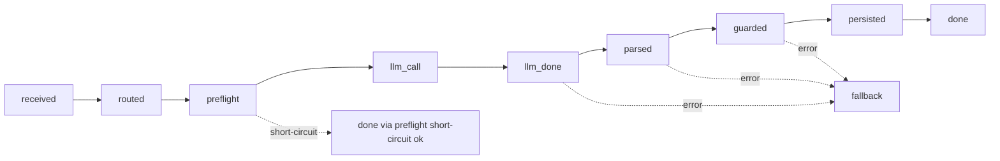

# Agent dispatch observability playbook

> Copy-paste queries for the consolidated `agent-dispatch` Edge Function. Catches
> error spikes, latency regressions, fallback storms, and Vertex token spend
> before users (or the GCP invoice) do.

This playbook lives next to the code it describes. When the log envelope or a
field name changes, update this file in the same PR — that is the only way the
queries below stay accurate.

---

## 1. What gets logged

Every line is a single JSON object emitted via `console.log` from
[`supabase/functions/_shared/obs/log.ts`](../../supabase/functions/_shared/obs/log.ts)
and shipped into the `edge_logs` table (Logflare-backed, BigQuery SQL dialect in
the Supabase SQL Editor).

The envelope:

```json
{
  "ts": "2026-05-08T18:39:33.512Z",
  "ns": "agent-dispatch",
  "level": "info" | "warn" | "error" | "debug",
  "msg": "<stable string — see table below>",
  "request_id": "<uuid>",
  "slug": "coach" | "organizer" | "buddy",
  "message_id": "<uuid of the trigger message>",
  "bubble_id": "<uuid>",
  "phase": "received" | "routed" | "preflight" | "llm_call" | "llm_done" | "parsed" | "guarded" | "persisted" | "fallback" | "done",
  "model": "gemini-2.5-flash",
  "latency_ms": 1234,
  "http_status": 503,
  "token_in": 1052,
  "token_out": 318,
  "error_kind": "http" | "parse" | "shape" | "timeout" | "auth"
}
```

The full `LogFields` contract is in
[`_shared/obs/log.ts`](../../supabase/functions/_shared/obs/log.ts); strategies
attach extra free-form keys (e.g. `proposed_write_kind`, `fallback_ok`,
`skip_reason`, `created_task_id`) which the queries below reference where
useful.

### Phase lifecycle



Three terminal lines exist per dispatch attempt — one of:

- `msg = "dispatch done"` (success path; carries `latency_ms` end-to-end since
  Phase 7b)
- `msg = "preflight short-circuit ok"` (e.g. Coach workout-player greeting;
  carries `latency_ms` for the RPC call)
- `msg = "fallback insertion"` (recovered failure path; carries
  `error_kind` + `fallback_ok`)

### Stable `msg` strings (use as exact-match filters)

| `msg`                                 | level         | `phase`     | Most useful pivot fields                                           |
| ------------------------------------- | ------------- | ----------- | ------------------------------------------------------------------ |
| `webhook received`                    | info          | `received`  | `request_id`, `message_id`, `bubble_id`                            |
| `loop guard skip (author is agent)`   | info          | —           | `request_id`, `message_id`                                         |
| `routing skip`                        | info          | `routed`    | `skip_reason`                                                      |
| `routed to strategy`                  | info          | `routed`    | `slug`                                                             |
| `preflight skip`                      | info          | `preflight` | `slug`, `skip_reason`                                              |
| `preflight short-circuit ok`          | info          | `preflight` | `slug`, `latency_ms`                                               |
| `preflight short-circuit RPC failed`  | error         | `preflight` | `slug`                                                             |
| `strategy preflight threw`            | error         | `preflight` | `slug`, `error`                                                    |
| `llm call begin`                      | info          | `llm_call`  | `slug`, `model`                                                    |
| `llm done`                            | info          | `llm_done`  | `slug`, `model`, `latency_ms`, `token_in`, `token_out`             |
| `parsed`                              | info          | `parsed`    | `slug`                                                             |
| `guarded`                             | info          | `guarded`   | `slug`                                                             |
| `persisted`                           | info          | `persisted` | `slug`                                                             |
| `dispatch done`                       | info          | `done`      | `slug`, `latency_ms` (end-to-end, Phase 7b)                        |
| `vertex auth failed`                  | error         | —           | `slug`, `error_kind`, `error`, `http_status`                       |
| `dispatch failed`                     | warn          | —           | `slug`, `error_kind`, `error`, `http_status`                       |
| `fallback insertion`                  | info or error | `fallback`  | `slug`, `error_kind`, `fallback_ok`                                |
| `buddy persisted`                     | info          | `persisted` | `slug`, `has_card`, `action_type`, `created_task_id`               |
| `organizer write intent`              | info          | `persisted` | `slug`, `writes_enabled`, `proposed_write_kind`, `created_task_id` |
| `dispatcher env invalid`              | error         | —           | `request_id`, `error`                                              |
| `agent self lookup failed`            | error         | `received`  | `error`                                                            |
| `resolved slug missing from registry` | error         | `routed`    | `slug`                                                             |

For the routing / context / strategy warnings (e.g. `agent_definitions query
failed`, `bindings query failed`, `failed to fetch root bubble history for
buddy`), search by `level = "warn"` plus `slug` or `bubble_id`; they are
diagnostics, not metrics.

---

## 2. Error budget — top errors in the last hour

**Plain-language goal:** what's failing right now, broken down by kind and
agent, so you can tell whether Vertex is throwing 5xx, the parser is rejecting
output, or auth has rotated under you.

**Logs Explorer filter (dashboard search bar):**

```text
event_message:"\"ns\":\"agent-dispatch\"" event_message:"\"error_kind\":"
```

**SQL (BigQuery dialect, paste into the Supabase SQL Editor):**

```sql
SELECT
  TIMESTAMP_TRUNC(timestamp, MINUTE) AS minute_bucket,
  JSON_VALUE(event_message, '$.slug')        AS slug,
  JSON_VALUE(event_message, '$.error_kind')  AS error_kind,
  JSON_VALUE(event_message, '$.http_status') AS http_status,
  COUNT(*)                                   AS events
FROM edge_logs
CROSS JOIN UNNEST(metadata) AS m
WHERE JSON_VALUE(event_message, '$.ns')         = 'agent-dispatch'
  AND JSON_VALUE(event_message, '$.error_kind') IS NOT NULL
  AND timestamp >= TIMESTAMP_SUB(CURRENT_TIMESTAMP(), INTERVAL 1 HOUR)
GROUP BY minute_bucket, slug, error_kind, http_status
ORDER BY minute_bucket DESC, events DESC
```

**Distinct `error_kind` values** (from
[`_shared/llm/vertex-gemini.ts`](../../supabase/functions/_shared/llm/vertex-gemini.ts)
`classifyError`):

- `http` — Vertex returned a non-2xx; check `http_status` and `error` (Vertex
  response body).
- `parse` — the strategy parser couldn't read Vertex's JSON (malformed or
  missing required keys).
- `shape` — JSON parsed but failed schema-shape validation (e.g. wrong field
  type, enum miss).
- `timeout` — Vertex round-trip exceeded `LLM_TIMEOUT_MS`.
- `auth` — OAuth signing failed in
  [`_shared/llm/vertex-auth.ts`](../../supabase/functions/_shared/llm/vertex-auth.ts);
  rotate the GCP Service Account key (see
  [`docs/agents/vertex-setup.md`](./vertex-setup.md)).

**Alert hint:** raise an alarm when
`error_kind = "http" AND http_status >= 500` exceeds **5 events / 5-minute
bucket** for any single `slug`. Sustained `auth` failures should page
immediately — every dispatch is failing.

---

## 3. Latency — LLM round-trip (median + p95)

**Plain-language goal:** is Vertex itself slow? This isolates the model call
from the rest of the dispatch pipeline.

**Logs Explorer filter:**

```text
event_message:"\"msg\":\"llm done\""
```

**SQL:**

```sql
SELECT
  TIMESTAMP_TRUNC(timestamp, HOUR)                AS hour_bucket,
  JSON_VALUE(event_message, '$.slug')             AS slug,
  JSON_VALUE(event_message, '$.model')            AS model,
  APPROX_QUANTILES(
    CAST(JSON_VALUE(event_message, '$.latency_ms') AS INT64),
    100
  )[OFFSET(50)]                                   AS p50_ms,
  APPROX_QUANTILES(
    CAST(JSON_VALUE(event_message, '$.latency_ms') AS INT64),
    100
  )[OFFSET(95)]                                   AS p95_ms,
  COUNT(*)                                        AS samples
FROM edge_logs
WHERE JSON_VALUE(event_message, '$.msg') = 'llm done'
  AND timestamp >= TIMESTAMP_SUB(CURRENT_TIMESTAMP(), INTERVAL 24 HOUR)
GROUP BY hour_bucket, slug, model
ORDER BY hour_bucket DESC, slug
```

A p95 step-change of ~30 % usually means Vertex silently rolled out a new
model patch revision — confirm against
[https://cloud.google.com/vertex-ai/docs/generative-ai/release-notes](https://cloud.google.com/vertex-ai/docs/generative-ai/release-notes).

---

## 4. Latency — end-to-end (median + p95)

**Plain-language goal:** what does the user actually wait for? Includes
preflight, prompt build, Vertex, parse, server guards, RPC persistence, and
serialization.

**Logs Explorer filter:**

```text
event_message:"\"msg\":\"dispatch done\""
```

**SQL:**

```sql
SELECT
  TIMESTAMP_TRUNC(timestamp, HOUR)                AS hour_bucket,
  JSON_VALUE(event_message, '$.slug')             AS slug,
  APPROX_QUANTILES(
    CAST(JSON_VALUE(event_message, '$.latency_ms') AS INT64),
    100
  )[OFFSET(50)]                                   AS p50_ms,
  APPROX_QUANTILES(
    CAST(JSON_VALUE(event_message, '$.latency_ms') AS INT64),
    100
  )[OFFSET(95)]                                   AS p95_ms,
  COUNT(*)                                        AS samples
FROM edge_logs
WHERE JSON_VALUE(event_message, '$.msg') = 'dispatch done'
  AND timestamp >= TIMESTAMP_SUB(CURRENT_TIMESTAMP(), INTERVAL 24 HOUR)
GROUP BY hour_bucket, slug
ORDER BY hour_bucket DESC, slug
```

**Coverage caveat:** this query only counts the success terminal line. Coach's
workout-player short-circuit emits `preflight short-circuit ok` (also carries
`latency_ms`), and recovered failures emit `fallback insertion` (no
`latency_ms` today). Section 8 shows how to combine all three for a true
"every-attempt" rollup. Extending `latency_ms` to the error/fallback log
sites is a small follow-up; until then those paths are excluded from p95.

---

## 5. Fallback rate

**Plain-language goal:** how often does the dispatcher catch a Vertex / parse /
shape error and insert the canned safe-reply instead of the real model output?
A spike usually means a silent Vertex model rollout broke a strategy's JSON
schema.

**Logs Explorer filter (numerator):**

```text
event_message:"\"phase\":\"fallback\"" event_message:"\"fallback_ok\":true"
```

**SQL (rate per slug per day):**

```sql
WITH attempts AS (
  SELECT
    DATE(timestamp)                          AS day,
    JSON_VALUE(event_message, '$.slug')      AS slug,
    COUNT(*)                                 AS dispatch_attempts
  FROM edge_logs
  WHERE JSON_VALUE(event_message, '$.msg') = 'routed to strategy'
    AND timestamp >= TIMESTAMP_SUB(CURRENT_TIMESTAMP(), INTERVAL 7 DAY)
  GROUP BY day, slug
),
fallbacks AS (
  SELECT
    DATE(timestamp)                          AS day,
    JSON_VALUE(event_message, '$.slug')      AS slug,
    COUNT(*)                                 AS fallback_inserts
  FROM edge_logs
  WHERE JSON_VALUE(event_message, '$.phase') = 'fallback'
    AND JSON_VALUE(event_message, '$.fallback_ok') = 'true'
    AND timestamp >= TIMESTAMP_SUB(CURRENT_TIMESTAMP(), INTERVAL 7 DAY)
  GROUP BY day, slug
)
SELECT
  COALESCE(a.day, f.day)                     AS day,
  COALESCE(a.slug, f.slug)                   AS slug,
  COALESCE(a.dispatch_attempts, 0)           AS dispatch_attempts,
  COALESCE(f.fallback_inserts, 0)            AS fallback_inserts,
  SAFE_DIVIDE(COALESCE(f.fallback_inserts, 0),
              NULLIF(a.dispatch_attempts, 0)) AS fallback_rate
FROM attempts a
FULL OUTER JOIN fallbacks f
  ON a.day = f.day AND a.slug = f.slug
ORDER BY day DESC, slug
```

**Why `routed to strategy` is the denominator:** every row of this `msg`
already carries `slug`, so the per-slug `GROUP BY` works without NULL
buckets. It fires after the loop guard and routing decision but before the
LLM call, so it captures every dispatch attempt that reached a strategy —
which is the right population for "of the dispatches we attempted, how many
fell back?". If you need the broader "every webhook the function processed"
denominator (including loop-guard and `no_strategy_matched` skips), swap in
`msg = 'webhook received'`, but be aware those rows have no `slug` and the
join collapses into a single bucket.

**Cross-check when the rate spikes:** rerun §2's query filtered to
`error_kind IN ('parse', 'shape')` — if those dominate, Vertex output drift
broke the strategy parser; rerun the [schema-drift
linter](../refactor/vertex-agent-dispatch-consolidation/phase-7a-schema-drift-linter.md)
locally and check for new prompt-key/schema mismatches.

---

## 6. Token usage / GCP cost projection

**Plain-language goal:** project monthly Vertex spend before the GCP invoice
arrives. Catch a runaway prompt that doubled `token_in` overnight.

**Logs Explorer filter:**

```text
event_message:"\"msg\":\"llm done\"" event_message:"\"token_in\":"
```

**SQL:**

```sql
SELECT
  DATE(timestamp)                                                AS day,
  JSON_VALUE(event_message, '$.model')                           AS model,
  JSON_VALUE(event_message, '$.slug')                            AS slug,
  COUNT(*)                                                       AS calls,
  SUM(CAST(JSON_VALUE(event_message, '$.token_in')  AS INT64))   AS sum_token_in,
  SUM(CAST(JSON_VALUE(event_message, '$.token_out') AS INT64))   AS sum_token_out
FROM edge_logs
WHERE JSON_VALUE(event_message, '$.msg') = 'llm done'
  AND JSON_VALUE(event_message, '$.token_in') IS NOT NULL
  AND timestamp >= TIMESTAMP_SUB(CURRENT_TIMESTAMP(), INTERVAL 30 DAY)
GROUP BY day, model, slug
ORDER BY day DESC, model, slug
```

Multiply `sum_token_in` and `sum_token_out` by the per-1k-token rate for the
matching `model` from
[https://cloud.google.com/vertex-ai/generative-ai/pricing](https://cloud.google.com/vertex-ai/generative-ai/pricing)
to project the monthly bill.

**Caveat:** Vertex omits `usageMetadata` on some responses (notably some
streaming or partial responses). The `token_in IS NOT NULL` predicate filters
those out; treat the daily sum as a **lower bound** on actual usage, not an
exact figure. The GCP billing console remains authoritative.

---

## 7. Per-slug throughput

**Plain-language goal:** capacity planning and "is anybody actually using
Buddy this week?".

**SQL:**

```sql
SELECT
  DATE(timestamp)                          AS day,
  JSON_VALUE(event_message, '$.slug')      AS slug,
  COUNT(*)                                 AS successful_dispatches
FROM edge_logs
WHERE JSON_VALUE(event_message, '$.msg') = 'dispatch done'
  AND timestamp >= TIMESTAMP_SUB(CURRENT_TIMESTAMP(), INTERVAL 14 DAY)
GROUP BY day, slug
ORDER BY day DESC, slug
```

For total attempt volume (including skips and fallbacks), substitute
`'webhook received'` for `'dispatch done'`.

---

## 8. Combining short-circuit + fallback + main path

When you want a single table covering every terminal line per dispatch
attempt — useful for "did anything happen for `request_id = X`?" forensics
and for combined latency rollups once the error/fallback paths get
`latency_ms` instrumentation:

```sql
SELECT
  timestamp,
  JSON_VALUE(event_message, '$.request_id') AS request_id,
  JSON_VALUE(event_message, '$.slug')       AS slug,
  JSON_VALUE(event_message, '$.msg')        AS terminal_msg,
  JSON_VALUE(event_message, '$.latency_ms') AS latency_ms,
  JSON_VALUE(event_message, '$.error_kind') AS error_kind,
  JSON_VALUE(event_message, '$.fallback_ok') AS fallback_ok
FROM edge_logs
WHERE JSON_VALUE(event_message, '$.msg') IN (
        'dispatch done',
        'preflight short-circuit ok',
        'fallback insertion'
      )
  AND timestamp >= TIMESTAMP_SUB(CURRENT_TIMESTAMP(), INTERVAL 1 HOUR)
ORDER BY timestamp DESC
LIMIT 200
```

To trace one request end-to-end, drop the `IN` clause and add
`AND JSON_VALUE(event_message, '$.request_id') = '<uuid>'`.

---

## 9. `edge_logs` SQL template

All queries above follow this scaffold; copy and adapt for new metrics:

```sql
SELECT
  TIMESTAMP_TRUNC(timestamp, <BUCKET>)                          AS time_bucket,
  JSON_VALUE(event_message, '$.slug')                           AS slug,
  -- add the field(s) you want to extract here:
  JSON_VALUE(event_message, '$.<your_field>')                   AS my_field,
  COUNT(*)                                                      AS events
FROM edge_logs
WHERE JSON_VALUE(event_message, '$.ns') = 'agent-dispatch'
  AND JSON_VALUE(event_message, '$.msg') = '<EXACT_MSG_STRING>'
  AND timestamp >= TIMESTAMP_SUB(CURRENT_TIMESTAMP(), INTERVAL <N> <HOUR|DAY>)
GROUP BY time_bucket, slug, my_field
ORDER BY time_bucket DESC
```

**Notes:**

- `JSON_VALUE` returns `STRING`; `CAST(... AS INT64)` for numeric aggregations
  (`SUM`, percentiles).
- Reference fields that may be absent (e.g. `error_kind` on a non-error line)
  with `IS NOT NULL` to skip them cleanly.
- The `CROSS JOIN UNNEST(metadata) AS m` clause from Supabase's stock
  examples is **only** needed when you also want the function-level metadata
  (e.g. `m.function_id`, `m.execution_id`); the JSON envelope queries above
  don't need it.

---

## 10. Cloud Logging appendix (when you outgrow Supabase Logs)

When log volume or retention exceeds Supabase's logflare tier, forward
`edge_logs` to GCP Cloud Logging (any standard sink works — Cloud Logging
itself, BigQuery, or Pub/Sub→Cloud Logging). The same JSON envelope arrives
at Cloud Logging as `jsonPayload` on each `LogEntry`, so the same playbook
sections map one-to-one. Mapping table:

| Need                           | Supabase Logs filter                        | Cloud Logging Logs Explorer filter                               |
| ------------------------------ | ------------------------------------------- | ---------------------------------------------------------------- |
| Only agent-dispatch lines      | `event_message:"\"ns\":\"agent-dispatch\""` | `jsonPayload.ns = "agent-dispatch"`                              |
| Only one slug                  | `event_message:"\"slug\":\"coach\""`        | `jsonPayload.slug = "coach"`                                     |
| Only error-kind lines          | `event_message:"\"error_kind\":"`           | `jsonPayload.error_kind != ""`                                   |
| Only the `llm done` terminator | `event_message:"\"msg\":\"llm done\""`      | `jsonPayload.msg = "llm done"`                                   |
| Only fallback inserts          | `event_message:"\"phase\":\"fallback\""`    | `jsonPayload.phase = "fallback"`                                 |
| Trace one request              | `event_message:"\"request_id\":\"<uuid>\""` | `jsonPayload.request_id = "<uuid>"`                              |
| Aggregations (p95, sums, etc.) | BigQuery SQL on `edge_logs` per §2-§7 above | BigQuery SQL on the Cloud Logging sink table (same `JSON_VALUE`) |

No code change is required — the structured envelope is already Cloud Logging
ready. Wiring the forwarder is an operator task, scope-deferred from this
phase.

---

## 11. The `LLM_DEBUG` flag

Setting `LLM_DEBUG=1` in the function's Edge secrets raises the shared LLM
modules to `debug`-level emission: full Vertex request bodies, retry deltas,
and per-attempt timing. Use sparingly — the volume is high and the request
bodies contain prompts (potentially sensitive). Unset it (or set it to `0`)
once the investigation is finished.

This single flag replaces the legacy per-agent debug toggles
(`BUDDY_AGENT_DEBUG` and `ORGANIZER_AGENT_DEBUG`) that used to live on the
deleted `buddy-agent-dispatch` and `organizer-agent-dispatch` functions.
Those flags are gone — see
[`docs/refactor/vertex-agent-dispatch-consolidation/secrets-matrix.md`](../refactor/vertex-agent-dispatch-consolidation/secrets-matrix.md)
for the full list of retired secrets.

---

## 12. Adding a new metric

When you want a new query in this playbook:

1. **Pick (or reuse) a stable `msg` string.** It must be unique enough that
   `JSON_VALUE(event_message, '$.msg') = '<string>'` is an unambiguous filter.
   Add the emission in the relevant Edge file with `log(level, msg, fields)`.
2. **Attach the data field as a typed `LogFields` extension key.** The
   contract is in
   [`_shared/obs/log.ts`](../../supabase/functions/_shared/obs/log.ts);
   well-known fields go in the type, free-form keys are allowed via the index
   signature. Numeric fields are emitted as JSON numbers — cast with
   `CAST(... AS INT64)` in BigQuery SQL.
3. **Add a query stanza here** under a new numbered section, following the §9
   template. Include: plain-language goal, Logs Explorer filter, SQL, and
   any operational caveat (e.g. "may be omitted by Vertex" for token usage).

For the underlying log envelope and field semantics, the canonical reference
is
[`docs/refactor/vertex-agent-dispatch-consolidation/phase-1-shared-foundations.md`](../refactor/vertex-agent-dispatch-consolidation/phase-1-shared-foundations.md).

---

_Last reviewed against
[`supabase/functions/agent-dispatch/index.ts`](../../supabase/functions/agent-dispatch/index.ts)
and the per-strategy emitters under
[`supabase/functions/agents/`](../../supabase/functions/agents/) on the
Phase 7b PR. When a `msg` string, `phase`, or field name changes, update this
file in the same PR so the queries stay copy-paste-correct._
