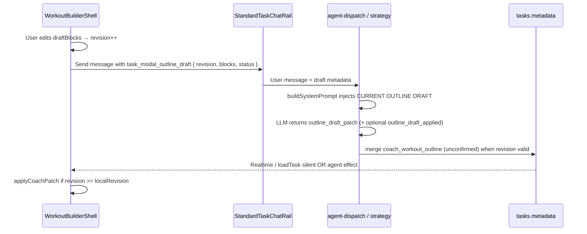

# Workout Builder — Master Blueprint

This document is the execution plan for **Option B: a dedicated `/builder/[taskId]` route** with a spacious outline authoring surface and an integrated **Coach Co-Pilot** (live draft context + `outline_draft_patch`). Use the checkboxes to track progress per sprint.

---

## 1. Architecture Overview

### Route and layout

- **URL:** `/app/[workspace_id]/builder/[task_id]`
- **Shell:** Full-viewport layout (`min-h-[100dvh]`), safe-area insets — mirrors the Active Session route pattern.
- **Chrome:** `WorkspaceShellGate` skips `DashboardShell` on builder pathnames (same as `/session/`).
- **Panels (desktop):**
  - **Left (~60–65%):** Workout structure builder — `WorkoutOutlinePanel` (or evolved blueprint UI) driven by `useWorkoutOutlineEditor`.
  - **Right (~35–40%):** `StandardTaskChatRail` — task-scoped Coach thread with block blueprint mentions.
- **Mobile:** Stacked panes with a segmented control (Builder | Coach), reusing the TaskModal workout-split mobile pattern.

### Entry and exit

| Entry                                      | Behavior                                                                                                                                                                 |
| ------------------------------------------ | ------------------------------------------------------------------------------------------------------------------------------------------------------------------------ |
| TaskModal (workout, outline not confirmed) | CTA: **Open structure builder** → `router.push(buildWorkoutBuilderUrl(...))`; close or minimize modal to avoid dual editors                                              |
| Kanban / deep link (optional)              | Card action or URL opens builder directly when feature flag is on                                                                                                        |
| After **Confirm structure**                | Stay on the builder route: structure panel switches to confirmed read-only summary and **Workout intake** renders below for factory generation (no auto-navigation away) |

### Co-Pilot data flow (revision + patch)

**Revision gate (client):**

- Monotonic `revision` per builder session; increment on every local `draftBlocks` change.
- Outgoing chat metadata always includes current `revision` and normalized blocks.
- Incoming patch applies only when `patch.revision >= localRevision` (stale coach replies ignored).

**`outline_draft_patch` (server):**

- New field on Coach JSON schema (not `proposed_workout_metadata`).
- Modes: `merge_by_name` (default) or `replace_all`.
- Persist via `applyCoachWorkoutOutlineToTaskMetadata` + `mergeCoachOutlineMetadataPatch` with `clearConfirmation: true`.
- Gated: workout task, no rich factory, outline not confirmed, rail surface.

**Agent effect (client):**

- Reply metadata / sweep parses `outline_draft_applied` → `WorkoutBuilderShell` calls `applyCoachPatch` on the outline editor hook.

### Single-writer rule

Only one surface should edit outline draft at a time: navigating to builder should close TaskModal (or hide outline panel there). Metadata + `revision` are the sync contract between UI and Coach.

---

## Sprint 1: The Builder Route Shell

**Goal:** Ship a full-page builder with outline editing and Coach rail mounted; no AI patch tool yet (Coach can advise in prose only).

### 1.1 Routing and feature flag

- [ ] Add `src/lib/feature-flags/workoutBuilderRoute.ts` — `isWorkoutBuilderRouteEnabled()` (env or existing flags pattern; default off in prod until ready).
- [ ] Add `src/lib/workout-builder/build-workout-builder-url.ts`:
  - [ ] `buildWorkoutBuilderUrl(workspaceId, taskId, opts?: { return?: string; from?: string })`
  - [ ] `isWorkoutBuilderPathname(pathname: string | null): boolean` — regex aligned with session helper.
- [ ] Add `src/app/(dashboard)/app/[workspace_id]/builder/[task_id]/layout.tsx` — `min-h-[100dvh]`, safe-area padding (copy session layout).
- [ ] Add `src/app/(dashboard)/app/[workspace_id]/builder/[task_id]/load-builder-task.ts`:
  - [ ] Auth: logged-in user + `workspace_members` row.
  - [ ] Load `tasks` row; require `normalizeItemType(item_type) === 'workout'`.
  - [ ] Verify bubble `workspace_id` matches route param.
  - [ ] Return payload type (e.g. `WorkoutBuilderTaskPayload`: `id`, `title`, `bubble_id`, `metadata`, `item_type`).
- [ ] Add `src/app/(dashboard)/app/[workspace_id]/builder/[task_id]/page.tsx`:
  - [ ] Server component: redirect if unauthenticated; `notFound()` if flag off or load fails.
  - [ ] Render `<WorkoutBuilderShell workspaceId={...} task={...} />`.

### 1.2 Dashboard chrome bypass

- [ ] Update `src/components/dashboard/workspace-shell-gate.tsx`:
  - [ ] Import `isWorkoutBuilderPathname`.
  - [ ] When builder pathname matches, render `{children}` only (no `DashboardShell`) — same branch as active session.

### 1.3 Builder shell (client)

- [ ] Add `src/features/workout-builder/WorkoutBuilderShell.tsx`:
  - [ ] Header HUD: workout title, **Back** (`safeNextPath(return)` or `router.back()`), optional **Open card** (opens TaskModal via dashboard callback or query-driven modal — document chosen approach in PR).
  - [ ] Grid layout: `md:grid-cols-[minmax(0,1.2fr)_minmax(0,0.8fr)]`, `min-h-0 flex-1` on both columns.
  - [ ] Left: `WorkoutOutlinePanel` with `canWrite` from membership.
  - [ ] Right: `StandardTaskChatRail` (props wired in Sprint 2 for metadata; mount with minimal handlers in Sprint 1).
  - [ ] Mobile: pane toggle (Builder | Coach).
- [ ] Add `src/features/workout-builder/useWorkoutBuilderTaskHost.ts` (or equivalent name):
  - [ ] Reuse or slim-wrap `useTaskLoadAndRealtime` for `taskId` + `workspaceId`.
  - [ ] Expose: `title`, `description`, `metadata`, `setMetadata`, `patchOriginalMetadataJson`, `saveCoreFields`, `loadTask`, `canWrite`, `loading`, `error`.
  - [ ] Instantiate `useWorkoutOutlineEditor` with the same args as `TaskModal` today.

### 1.4 Outline editor portability

- [ ] Confirm `useWorkoutOutlineEditor` needs no TaskModal imports (already standalone under `task-modal/hooks/`).
- [ ] Optional: move hook to `src/features/workout-builder/hooks/useWorkoutOutlineEditor.ts` and re-export from old path for backward compatibility — only if re-exports are low churn; otherwise keep path and import from shell.
- [ ] Add `WorkoutOutlinePanel` layout variant prop (e.g. `variant="builder"`) for wider spacing / typography — design tokens only in Sprint 1 if quick; otherwise defer visual polish to post-Sprint 3.

### 1.5 TaskModal integration (navigation only)

- [ ] Add **Open structure builder** control in `TaskModal` when:
  - [ ] `itemType === 'workout'`, `taskId`, `canWrite`, builder flag on.
  - [ ] Outline not confirmed (`!coach_outline_confirmed_at`) and no factory (`!hasRichWorkoutSetInMetadata`).
- [ ] On navigate: `router.push(buildWorkoutBuilderUrl(..., { return: currentPath }))` and `onOpenChange(false)` on modal.
- [ ] Hide or collapse `WorkoutOutlinePanel` on TaskModal Details when builder route is the recommended path (optional copy: “Editing structure in builder…”).

### 1.6 Tests and CI

- [ ] Unit test `build-workout-builder-url.ts` pathname helper.
- [ ] Test `load-builder-task.ts` guards (workout-only, workspace mismatch) — mirror `load-session-task` test style if present.
- [ ] Smoke test `WorkoutBuilderShell` renders outline + rail with mocked task host.

### 1.7 Sprint 1 exit criteria

- [ ] Flagged route loads full-page builder with live outline CRUD (save draft, confirm structure).
- [ ] Coach rail posts messages; no draft metadata in prompts yet (acceptable for Sprint 1).
- [ ] Back navigation returns to Kanban/modal without losing confirmed metadata on DB.

---

## Sprint 2: The Co-Pilot Context (Visibility)

**Goal:** Coach sees the live unconfirmed outline draft on every builder send; system prompt includes a structured draft block.

### 2.1 Outgoing metadata (builder → messages)

- [ ] Add `src/lib/agents/coach/build-outline-draft-context.ts` (name may be `build-task-modal-outline-draft-context.ts` if shared with modal):
  - [ ] `buildTaskModalOutlineDraftPayload(args)` → `{ v: 1, revision, status, confirmed, blocks, drops? }`.
  - [ ] Normalize blocks via `normalizeOutlineDraft(draftBlocks)`; cap `drops` for payload size.
  - [ ] `buildOutlineDraftContextBlock(payload, title?)` → `--- CURRENT OUTLINE DRAFT ---` text/JSON for prompts.
- [ ] Add `src/features/workout-builder/useWorkoutBuilderChatRail.ts`:
  - [ ] Hold `outlineRevision` ref; increment in `useWorkoutOutlineEditor` wrapper or shell when `setDraftBlocks` runs.
  - [ ] `buildOutgoingMessageMetadata` attaches `task_modal_outline_draft` when workout + !confirmed + !factory.
  - [ ] Re-export handlers placeholder for Sprint 3 (`onOutlineDraftPatch`, telemetry, etc.).

### 2.2 Wire rail in builder shell

- [ ] Replace bare `StandardTaskChatRail` props in `WorkoutBuilderShell` with `useWorkoutBuilderChatRail` outputs:
  - [ ] `workspaceId`, `taskId`, `bubbleId`, `canPostMessages`, `defaultAgentSlug` (`coach`).
  - [ ] `enableBlockBlueprintMentions={true}`, `workoutExerciseNames` from outline blocks (reuse TaskModal hash list logic).
  - [ ] `buildOutgoingMessageMetadata` from hook.
  - [ ] `transcriptFilter`, `onEffectTelemetry` (stub ok until Sprint 3).

### 2.3 Server: read metadata + inject prompt

- [ ] Update `supabase/functions/agents/coach/context.ts` (or equivalent) to parse `task_modal_outline_draft` from trigger message metadata on rail invocations.
- [ ] Update `supabase/functions/agents/coach/strategy.ts` → `buildSystemPrompt`:
  - [ ] When workout + !`hasRichWorkoutSetInMetadata` + !`readCoachOutlineMetadata(...).confirmedAt`:
  - [ ] Prefer live draft from message metadata if `revision` present; else fall back to `coach_workout_outline` on task row.
  - [ ] Append `buildOutlineDraftContextBlock(...)`.
- [ ] Update `src/lib/agents/coach/prompts.ts` + Deno mirror:
  - [ ] New section **OUTLINE CO-PILOT MODE** — structure-only phase; use surgical language; forbid factory/`proposed_workout_metadata`; reference `:` blueprint tokens.
- [ ] Set `messages.metadata.surface` (or builder-specific value) on sends from builder rail if dispatch needs to distinguish surface — align with `standard_task_chat_rail` or add `workout_builder` only if strategy requires it.
- [ ] Run `pnpm check:agent-mirror` and `pnpm check:agent-prompts`.

### 2.4 TaskModal parity (optional in Sprint 2)

- [ ] Attach same `task_modal_outline_draft` from `TaskModal` `buildStandardTaskChatRailOutgoingMetadata` when outline panel is active and not confirmed — keeps modal + builder consistent if user stays on card.

### 2.5 Tests

- [ ] Unit test `build-outline-draft-context.ts` (revision, empty blocks, drops cap).
- [ ] Test prompt builder includes draft block when metadata present (snapshot or string contains block names).

### 2.6 Sprint 2 exit criteria

- [ ] Manual: send Coach message from builder with draft blocks visible in Edge logs / prompt inspection.
- [ ] Coach replies reference actual block names and `format_params` from live draft (qualitative QA).

---

## Sprint 3: The Co-Pilot Patch Tool (Editing)

**Goal:** Coach can surgically update the outline draft; server persists; builder UI applies changes without full refresh.

### 3.1 Schema and parse (shared TS + Deno)

- [ ] Add `outline_draft_patch` to `src/lib/agents/coach/schema.ts` (`COACH_RESPONSE_SCHEMA` / main chat schema):
  - [ ] `blocks`: array of `COACH_PROPOSED_WORKOUT_BLOCK_ITEM_SCHEMA`.
  - [ ] `mode`: `"merge_by_name"` | `"replace_all"`.
  - [ ] `revision`: integer (echo client revision coach is answering).
  - [ ] Optional `clear_confirmation`: boolean (default true).
- [ ] Mirror to `supabase/functions/agents/coach/schema.ts`.
- [ ] Update `src/lib/agents/coach/parse.ts` + Deno mirror to extract `outline_draft_patch` and validate shape.
- [ ] Update `src/lib/agents/coach/server-guards.ts`:
  - [ ] Allow `outline_draft_patch` only when outline phase gates pass.
  - [ ] Reject `proposed_workout_metadata` in outline co-pilot mode (or strip with drop reason).

### 3.2 Persist in strategy

- [ ] Update `supabase/functions/agents/coach/strategy.ts` `persist` path:
  - [ ] On valid `outline_draft_patch`: merge blocks (`merge_by_name` / `replace_all`).
  - [ ] Apply `applyCoachWorkoutOutlineToTaskMetadata` + `mergeCoachOutlineMetadataPatch` (`status: 'ready'`, `clearConfirmation: true`, `drops` from validation).
  - [ ] Compare `patch.revision` to metadata from trigger message; skip or no-op stale patches (document server policy).
  - [ ] Set `update_existing_task: true` when persisting outline patch.
  - [ ] Attach reply metadata `outline_draft_applied: { revision, block_count, drops? }` for client sweep.
- [ ] Mirror any `src/lib/agents/coach/strategy.ts` client copy if present; run `pnpm check:agent-mirror`.

### 3.3 Client agent effects

- [ ] Extend `src/components/chat/agent-effects/types.ts` — `OutlineDraftAppliedEffectPayload`.
- [ ] Add `src/components/chat/agent-effects/parse-outline-draft-applied.ts`.
- [ ] Update `src/components/chat/agent-effects/useAgentEffectSweep.ts` to dispatch outline applied events.
- [ ] Wire `onOutlineDraftApplied` in `useWorkoutBuilderChatRail` → shell handler.

### 3.4 Builder UI apply path

- [ ] Extend `useWorkoutOutlineEditor`:
  - [ ] `applyCoachPatch({ blocks, revision, drops })` — revision gate, `setDraftBlocks`, metadata merge, toast.
  - [ ] Expose `outlineRevision` / `bumpRevision()` for shell.
- [ ] `WorkoutBuilderShell` handler:
  - [ ] Dedupe by `messageId` + fingerprint (same pattern as `handleTaskModalIntakePatch`).
  - [ ] Fallback: `loadTask({ silent: true })` if effect metadata missing but DB updated.
- [ ] Subscribe to task realtime metadata updates on builder route to sync when another client saves (optional v1: loadTask only).

### 3.5 Prompts: tool usage instructions

- [ ] Update **OUTLINE CO-PILOT MODE** in `prompts.ts` (+ mirror):
  - [ ] Instruct model to emit `outline_draft_patch` for structural edits (not prose-only lists).
  - [ ] Emit only changed/new blocks under `merge_by_name`.
  - [ ] Include `revision` matching client draft.
- [ ] Run `pnpm check:agent-prompts`.

### 3.6 TaskModal parity (optional)

- [ ] Wire same `onOutlineDraftApplied` in `TaskModal` if outline panel remains on card for any users.

### 3.7 Tests

- [ ] `parse.test.ts` — `outline_draft_patch` extraction and drops.
- [ ] `coach-outline-metadata` merge tests for patch modes.
- [ ] `useWorkoutOutlineEditor` test — `applyCoachPatch` ignores stale revision.
- [ ] `StandardTaskChatRail.agent-effects.test.tsx` or builder-specific effect sweep test.
- [ ] Manual E2E: Coach “add a circuit block with 3 stations” → blocks appear in builder without reload.

### 3.8 Sprint 3 exit criteria

- [ ] End-to-end: edit draft → chat → Coach patch → UI updates with revision gate.
- [ ] Confirm structure still works from builder HUD after patch.
- [ ] No regression on `AGENT_WEBHOOK_SECRET` / rail unauthorized paths (smoke `curl` per workspace rule doc).

---

## File touch matrix (all sprints)

| Area             | Files                                                                                                              |
| ---------------- | ------------------------------------------------------------------------------------------------------------------ |
| **Route**        | `app/.../builder/[task_id]/page.tsx`, `layout.tsx`, `load-builder-task.ts`                                         |
| **URLs / flags** | `build-workout-builder-url.ts`, `workoutBuilderRoute.ts`                                                           |
| **Shell**        | `features/workout-builder/WorkoutBuilderShell.tsx`, `useWorkoutBuilderTaskHost.ts`, `useWorkoutBuilderChatRail.ts` |
| **Gate**         | `workspace-shell-gate.tsx`                                                                                         |
| **Modal entry**  | `TaskModal.tsx`                                                                                                    |
| **Outline**      | `useWorkoutOutlineEditor.ts`, `WorkoutOutlinePanel.tsx`                                                            |
| **Context**      | `build-outline-draft-context.ts`                                                                                   |
| **Agent**        | `schema.ts`, `parse.ts`, `prompts.ts`, `server-guards.ts`, `strategy.ts`, `context.ts` (+ Deno mirrors)            |
| **Effects**      | `agent-effects/types.ts`, `useAgentEffectSweep.ts`, `parse-outline-draft-applied.ts`                               |
| **Chat**         | `StandardTaskChatRail.tsx` (unchanged API; new host wiring)                                                        |
| **CI**           | `pnpm check:agent-mirror`, `pnpm check:agent-prompts`                                                              |

---

## Out of scope (follow-up work)

- Blueprint UI redesign (cards, empty states, diff highlight) — after route + patch land.
- Auto-redirect all unconfirmed outlines to builder (feature-flagged product decision).
- Phase B on rail for full regen (“regenerate entire structure”) — keep `/api/ai/generate-workout-outline` for explicit regen button.
- Active-session-style `WorkoutCoachRail` on builder — builder uses **`StandardTaskChatRail`** only.

---

## Execution order

1. Complete **Sprint 1** checklist before Sprint 2 (rail must mount on stable shell).
2. Complete **Sprint 2** before Sprint 3 (Coach must see draft before patches are meaningful).
3. Run mirror/prompt checks at end of Sprint 2 and Sprint 3.

_Last updated: plan-only document — no implementation in this commit._
