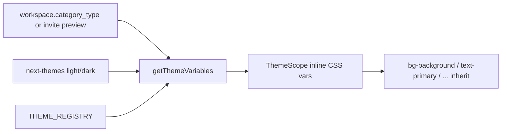

# UI Grammar — BuddyBubble Agentic Design System

**Status:** Canonical contract (June 2026).
**Audience:** Any agent (Cursor) or human writing/reviewing UI in this repo.
**Sibling contract:** [`docs/live-video/display-contract.md`](../live-video/display-contract.md) governs live-video **layout geometry**; this file governs **UI grammar** (tokens, type, variants, z-index) everywhere.

---

## 0. Philosophy

BuddyBubble does **not** ship a separate design-system package, Storybook, or Figma-token sync. The design system is a **textual grammar enforced in code + this doc**.

- **Source of truth is the repo**, not an abstraction layer:
  - Semantic tokens → [`src/app/globals.css`](../../src/app/globals.css)
  - Theme palettes (category × light/dark) → [`src/lib/theme-engine/registry.ts`](../../src/lib/theme-engine/registry.ts)
  - Primitives → [`src/components/ui/*`](../../src/components/ui)
  - Theme application → [`src/components/theme/ThemeScope.tsx`](../../src/components/theme/ThemeScope.tsx)
- **Agents must read raw `components/ui/*` and Tailwind classes directly.** Do not wrap primitives in new packages or indirection that hides the DOM/utility layer.
- When a rule here conflicts with an ad-hoc pattern in a file, **this doc wins** for new code. Pre-existing violations are migrated opportunistically, not in bulk.

### Stack (as-built)

| Layer       | Tech                                                                                   |
| ----------- | -------------------------------------------------------------------------------------- |
| Utilities   | **Tailwind CSS v4**                                                                    |
| Primitives  | **shadcn/ui** (`components.json` style `base-nova`, baseColor `neutral`, Lucide icons) |
| Headless    | **Base UI** (`@base-ui/react/*`), **Radix** (dialog/sheet), **vaul** (mobile drawers)  |
| Variants    | **CVA** (`class-variance-authority`)                                                   |
| Class merge | **`cn()`** = `clsx` + `tailwind-merge` ([`src/lib/utils.ts`](../../src/lib/utils.ts))  |
| Theming     | **next-themes** (light/dark) × **Theme Engine** (workspace category)                   |
| Font        | **Inter** (`--font-sans`)                                                              |

---

## 1. Color tokens (STRICT)

### Rule C1 — Never use raw palette colors for app surfaces

> **Banned in app UI:** `bg-slate-*`, `text-slate-*`, `bg-gray-*`, `bg-zinc-*`, `bg-indigo-*`, hex/`rgb()` literals.
> **Required:** semantic tokens below. They auto-adapt to light/dark **and** workspace category via `ThemeScope`.

| Intent                       | Token utility                                       | Notes                                 |
| ---------------------------- | --------------------------------------------------- | ------------------------------------- |
| App background               | `bg-background` / `text-foreground`                 | Page + body default                   |
| Card / panel                 | `bg-card` / `text-card-foreground`                  | Raised surfaces, drawers, modals      |
| Popover / menu               | `bg-popover` / `text-popover-foreground`            | Floating layers                       |
| Primary action               | `bg-primary` / `text-primary-foreground`            | Brand action color (category-driven)  |
| Secondary action             | `bg-secondary` / `text-secondary-foreground`        | Neutral filled                        |
| Muted / subtle               | `bg-muted` / `text-muted-foreground`                | Subtitles, hints, inert fills         |
| Accent (hover/active chrome) | `bg-accent` / `text-accent-foreground`              | Hover states                          |
| Destructive                  | `text-destructive`, `bg-destructive/10`             | Danger (see Button D-variant)         |
| Borders / inputs             | `border-border`, `border-input`                     | 1px dividers, field borders           |
| Focus ring                   | `ring-ring`                                         | Always pair focus with `ring-ring/50` |
| Sidebar/rail                 | `bg-sidebar`, `text-sidebar-foreground`, `--rail-*` | Chrome only                           |
| Charts                       | `--chart-1` … `--chart-5`                           | Data viz only                         |

Full token list is defined in `globals.css` `:root` / `.dark` and overwritten per category by `THEME_REGISTRY`. **Use the variable names exactly as they appear there.**

### Rule C2 — Kanban / status accents are the only semantic color exception

Yellow/red/orange/blue/green badge states have **no** shadcn 1:1, so the Theme Engine adds `--accent-yellow`, `--accent-red`, `--accent-orange`, `--accent-blue`, `--accent-green` (+ `-bg` / `-text`). Use these **only** for badge/status semantics (Kanban, alerts). Do not use them for general layout color.

### Rule C3 — Dense video chrome may use alpha-on-black overlays

Inside the **video stage only** (letterboxed Agora tiles, AMRAP HUD), opaque tokens read poorly over live video. The following are **allowed in `src/features/live-video/**`and`src/features/amrap/**` overlays**, and banned elsewhere:

- `bg-black/40`–`bg-black/80`, `border-white/15`–`/20`, `text-white`, `text-white/50`
- `bg-zinc-900` for initials placeholders on a tile

Everywhere else, use semantic tokens (Rule C1).

---

## 2. Typography (STRICT)

Font is **Inter** via `font-sans` (default on `html`). Headings reuse `--font-heading` = `--font-sans`.

### Rule T1 — Semantic type scale

Use Tailwind's standard scale (`text-xs` → `text-2xl`). Map by **role**, not by eyeballing pixels:

| Role                         | Class                                           | Color                   |
| ---------------------------- | ----------------------------------------------- | ----------------------- |
| Page / shell title           | `text-lg font-semibold sm:text-xl`              | `text-foreground`       |
| Section heading              | `text-sm font-semibold`                         | `text-foreground`       |
| Body                         | `text-sm`                                       | `text-foreground`       |
| **Subtitle / helper / hint** | `text-xs`                                       | `text-muted-foreground` |
| Numeric clock / timer        | `font-mono tabular-nums`                        | `text-foreground`       |
| Eyebrow / label caps         | `text-xs font-semibold uppercase tracking-wide` | `text-muted-foreground` |

### Rule T2 — No new arbitrary font sizes outside dense chrome

> **Banned for new app UI:** `text-[11px]`, `text-[13px]`, `text-[0.8rem]`, etc.
> Use `text-xs` (12px) or `text-sm` (14px).

**Exception (dense video/AMRAP chrome only):** `text-[10px]` / `text-[11px]` are tolerated in `src/features/live-video/**` and `src/features/amrap/**` tiles, lap chips, and rail labels where 12px overflows a small tile. Prefer the eyebrow pattern (`text-[10px] font-semibold uppercase tracking-wide text-muted-foreground`) already used by `SessionClockMini` / `GamifiedRailOfflineList`. Do **not** introduce sub-12px text in dashboard, modals, chat, or settings.

---

## 3. Z-index ladder (STRICT)

One ladder for the whole app. **Do not invent new values between tiers.** Reuse the nearest documented tier. Stage-local stacking (`z-[1]`–`z-20`) is fine inside a positioned container and does **not** count against this ladder.

| Tier                     | Value          | Owner / use                                                                         | Reference                                  |
| ------------------------ | -------------- | ----------------------------------------------------------------------------------- | ------------------------------------------ |
| Local                    | `z-[1]`–`z-20` | In-container stacking: tile placeholders, badges, card chrome, close buttons        | `BaseVideoHarness`, `kanban-task-card`     |
| Video overlays           | **`z-[43]`**   | AMRAP/phase HUD over the stage (timer, log-round); `pointer-events-none` shell      | `ActivePhaseOverlays`, `BaseVideoHarness`  |
| Stage strip / rail chips | **`z-[44]`**   | Lap chips / rail tile chrome over video                                             | `GamifiedRailTile`, `AmrapRailLapChips`    |
| Floating media           | **`z-50`**     | `FloatingMediaBar`, `Tier3ExercisesReopenPill`, popovers, inline menus              | `FloatingMediaBar`, `popover.tsx`          |
| Inline toast (scoped)    | `z-[60]`       | Local success toast inside a modal                                                  | `WorkspaceSettingsModal`                   |
| Mobile edge swipe        | `z-[80]`       | Off-canvas swipe opener                                                             | `MobileEdgeSwipeOpener`                    |
| Mobile tab bar           | `z-[90]`       | Bottom nav                                                                          | `MobileTabBar`                             |
| App overlay / fullscreen | `z-[100]`      | Dialog overlay+content, mobile drawer **overlay**, app toasts, fullscreen analytics | `dialog.tsx`, `MobileSidebarSheet`         |
| Sheet overlay            | `z-[110]`      | `Sheet` backdrop, mobile drawer content                                             | `sheet.tsx`                                |
| Sheet content            | `z-[120]`      | `Sheet` panel                                                                       | `sheet.tsx`                                |
| Primary modal            | `z-[150]`      | `TaskModal` (must sit above tab bar + sheets)                                       | `TaskModal`                                |
| Workout modal overlay    | `z-[155]`      | `WorkoutPlayer` / viewer dialog scrim                                               | `WorkoutPlayer`, `workout-viewer-dialog`   |
| Workout modal content    | `z-[160]`      | `WorkoutPlayer` / viewer dialog body                                                | `WorkoutPlayer`                            |
| Critical / tooltip       | `z-[200]`      | Tooltips above modals, critical fixed CTAs                                          | `WorkoutPlayer` tooltip, `dashboard-shell` |

### Rule Z1 — Non-modal panels never dim the stage

Per `display-contract` `T3-NON-MODAL-PANEL`: Tier 3 / live-video side panels use **no backdrop** and stay below the modal tiers. The video stage must remain bright and interactive. Use `Sheet modal={false}` (see [`sheet.tsx`](../../src/components/ui/sheet.tsx)) — its overlay is suppressed when `modal` is false.

---

## 4. Radius & spacing

### Rule R1 — Radius scale

Base `--radius: 0.625rem`. Derived: `rounded-sm` (×0.6), `rounded-md` (×0.8), `rounded-lg` (×1), `rounded-xl` (×1.4), `rounded-2xl` (×1.8), `rounded-3xl`/`4xl` for hero surfaces. Defaults: buttons `rounded-lg`, cards/popovers `rounded-xl`/`2xl`, pills `rounded-full`. Do not hardcode `rounded-[10px]`.

### Rule R2 — Spacing

Use Tailwind spacing scale (`gap-2`, `p-4`, etc.). Standard rhythm: bar/section gaps `gap-3`/`gap-4`, card padding `p-3`/`p-4`, control clusters `gap-2`.

---

## 5. Buttons — semantic variant grammar (STRICT)

Primitive: [`src/components/ui/button.tsx`](../../src/components/ui/button.tsx) (`buttonVariants` via CVA). Choose variant by **meaning**, not appearance.

| Variant       | Meaning — _when to reach for it_                                                                                  | Frequency |
| ------------- | ----------------------------------------------------------------------------------------------------------------- | --------- |
| `default`     | **The primary, expected action** on a surface (Start, Save, Confirm). One per cluster.                            | High      |
| `secondary`   | A **common alternative** action of equal safety (Start Session, toggles).                                         | Medium    |
| `outline`     | **Neutral / low-commitment** action (Exit workout, Add custom, Return to Huddle, filters).                        | High      |
| `ghost`       | **Escape-hatch / chrome** action that should recede (icon buttons, close, dismiss).                               | Medium    |
| `destructive` | **Nuclear / irreversible** action (End Session for All, delete). Never the only button; pair with a safe default. | Rare      |
| `link`        | **Inline navigation** styled as text.                                                                             | Rare      |

### Rule B1 — One `default` per action cluster

At most one `default`-variant button in a given toolbar/row. Everything else steps down to `secondary` / `outline` / `ghost`.

### Rule B2 — `destructive` requires intent + escape

A `destructive` action must coexist with a non-destructive way out (Cancel/Exit). Do not auto-focus it.

### Rule B3 — Sizes by density

`xs` (h-6) and `sm` (h-7) for dense bars/rails (e.g. `LiveSessionTopBar`), `default` (h-8) standard, `lg` (h-9) for primary CTAs. Icon-only → `icon` / `icon-sm` / `icon-xs`. Always include an `sr-only` label or `aria-label` on icon buttons.

---

## 6. Theming model (how tokens become category-aware)



- **Two axes:** workspace **category** × **light/dark**.
- **Categories (5, authoritative):** `business`, `kids`, `class`, `community`, `fitness` (`WorkspaceCategory` in [`src/types/database.ts`](../../src/types/database.ts); all five exist in `THEME_REGISTRY`). _Note: the older theme TDD references only four — the type and registry are the source of truth._
- **Application:** `ThemeScope` injects merged CSS variables on a `display:contents` wrapper; descendants inherit with **zero per-component rewrites**.

### Rule TH1 — Components never branch on category

Write components against semantic tokens only. Never `if (category === 'kids')` for color. The Theme Engine handles palette; components stay category-agnostic.

### Rule TH2 — Portaled content must re-scope

Anything portaled outside the dashboard tree (Radix/vaul portals: modals, drawers) must wrap content in `ThemeScope` with the active `themeCategory`, or tokens fall back to `:root` and break contrast. Precedent: `MobileSidebarSheet`, `PeopleInvitesModal`, `MobileThreadSheet`.

---

## 7. Platform shells (forward spec — Platform pivot)

As BuddyBubble generalizes from fitness to a **video-application platform**, feature shells must not hardcode domain UI. A **Platform Shell** is a layout primitive; **domain content is injected**.

### Rule PS1 — Top bar is zone-based, domain-agnostic (TARGET)

`LiveSessionTopBar` is the template for any video room (fitness huddle, enterprise meeting, tutoring). It must expose generic zones and **must not** import domain components like `LiveDeckExerciseInjector` directly.

**Target contract:**

```tsx
<LiveSessionTopBar
  left={<SessionHeader … />}        // or any domain header
  center={<SessionClockMini … />}   // or any domain status
  right={<SessionControlsActions … />}
/>
```

- Zones (`left` / `center` / `right`) accept `ReactNode`.
- The shell owns **only** the 3-zone grid, border, and responsive collapse — never domain logic, RPCs, or fitness vocabulary.
- Fitness specifics (`LiveDeckExerciseInjector`, AMRAP host actions) are passed **in** by the fitness composition layer.

> **Status:** `LiveSessionTopBar` currently hardcodes some fitness slots (`hostDeckInjector`, AMRAP `hostNavActions`). Refactoring to pure `left/center/right` zones is the next step and is governed by this rule. Until then, new domains must not copy the fitness props — they extend the zone API.

### Rule PS2 — Reuse, don't fork

New video surfaces compose existing primitives (`BaseVideoHarness`, `FloatingMediaBar`, `GamifiedParticipantRail` where ranking applies). Fork a shell only when the **layout geometry** differs, and document it in `display-contract.md`.

---

## 8. Agent checklist (paste-friendly)

Before emitting UI, an agent must confirm:

- [ ] Colors use semantic tokens (§1); no `slate/gray/zinc/hex` except video-chrome alpha (Rule C3).
- [ ] Type uses the semantic scale (§2); no new `text-[Npx]` outside dense video chrome.
- [ ] Any z-index reuses a documented tier (§3); non-modal panels have no backdrop (Z1).
- [ ] Buttons chosen by meaning (§5); ≤1 `default` per cluster; `destructive` has an escape.
- [ ] No `if (category === …)` color branching (TH1); portaled content re-scopes (TH2).
- [ ] New shells inject domain content via zones, not hardcoded imports (PS1).
- [ ] Radius via scale, not arbitrary px (R1).

---

## 9. Pointers

| Concern                    | File                                                                               |
| -------------------------- | ---------------------------------------------------------------------------------- |
| Semantic token defaults    | [`src/app/globals.css`](../../src/app/globals.css)                                 |
| Category palettes          | [`src/lib/theme-engine/registry.ts`](../../src/lib/theme-engine/registry.ts)       |
| Theme merge                | [`src/lib/theme-engine/merge.ts`](../../src/lib/theme-engine/merge.ts)             |
| Theme application          | [`src/components/theme/ThemeScope.tsx`](../../src/components/theme/ThemeScope.tsx) |
| Primitives                 | [`src/components/ui/`](../../src/components/ui)                                    |
| Button variants            | [`src/components/ui/button.tsx`](../../src/components/ui/button.tsx)               |
| Live-video layout contract | [`docs/live-video/display-contract.md`](../live-video/display-contract.md)         |
| shadcn config              | [`components.json`](../../components.json)                                         |
