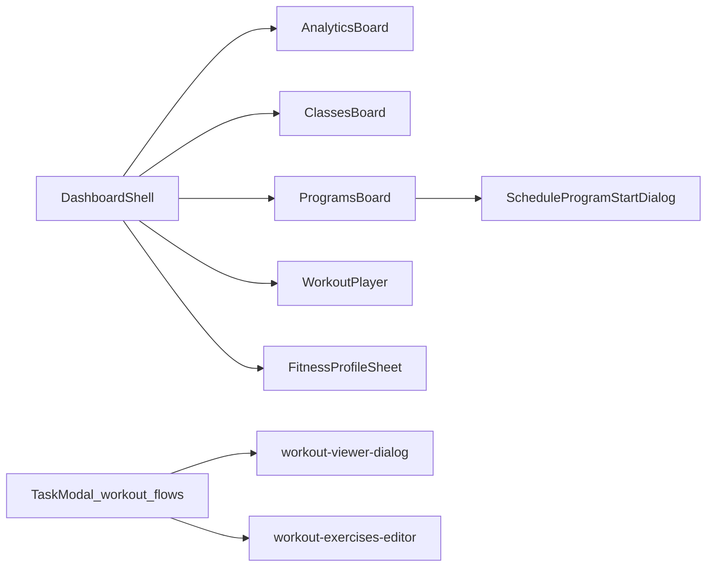

# Fitness UI components

This folder documents the **fitness-specific dashboard UI** under [src/components/fitness/](../../src/components/fitness/). Those modules implement programs, classes, analytics, workout editing/playback, and the per-workspace fitness profile sheet for **workspace category** `fitness`, as described in the root [README.md](../../README.md).

## Bubbles (channels)

Default fitness **bubble** names, which main-stage UI each one selects, and one-pagers per channel: **[bubbles/README.md](bubbles/README.md)**. For **workspace/bubble roles**, **Zustand vs props**, and **gating** (chat disable, premium overlay, trial soft-lock), see **[Architecture: roles, state, and gating](bubbles/README.md#architecture-roles-state-and-gating)** in that folder.

## Where these components mount

The shell is [src/components/dashboard/dashboard-shell.tsx](../../src/components/dashboard/dashboard-shell.tsx).

- **Board swap:** When the workspace is fitness (`workspaceCategoryForUi === 'fitness'`) and the user selects a bubble whose **name** matches a seeded channel, the main stage renders a fitness board instead of the default `KanbanBoard`:
  - Bubble name **`Analytics`** → `AnalyticsBoard` (wrapped in `PremiumGate` for the analytics feature).
  - Bubble name **`Classes`** → `ClassesBoard`.
  - Bubble name **`Programs`** → `ProgramsBoard` with `selectedBubbleId`, `bubbles`, `workspaceCategory`, `calendarTimezone`, `taskViewsNonce`, `canWrite`, `onOpenTask`, `onOpenCreateTask`.
- **Calendar slot:** For horizontal layouts, the shell `cloneElement`s `calendarSlot` (the calendar rail) and `taskViewsNonce` into the board element when the board accepts those props (`AnalyticsBoard`, `ClassesBoard`, `ProgramsBoard`).
- **Workout player:** `workoutPlayerTask` state holds a `TaskRow`; when set, [WorkoutPlayer](workout-player.md) opens with exercises from `metadataFieldsFromParsed(task.metadata).workoutExercises`. Started from `KanbanBoard` via `onStartWorkout` → `handleStartWorkout` (with trial gating).
- **Fitness profile sheet:** Rendered when `workspaceCategoryForUi === 'fitness'`; `fitnessProfileOpen` toggles the sheet. `bubbleIdForTasks` is the current bubble unless the user is on **All** bubbles (`ALL_BUBBLES_BUBBLE_ID`).

Workout **editing** and **viewer** flows also live in [TaskModal](../../src/components/modals/TaskModal.tsx) and task-modal subcomponents, which import [workout-viewer-dialog.tsx](../../src/components/fitness/workout-viewer-dialog.tsx) and [workout-exercises-editor.tsx](../../src/components/fitness/workout-exercises-editor.tsx). Live video reuses the exercises editor from [LiveSessionWorkoutPlayer.tsx](../../src/features/live-video/shells/huddle/LiveSessionWorkoutPlayer.tsx).

## Component index

| Source file                                                                                   | Doc                                                                  | Role                                                          | Primary inputs / data                                                                             |
| --------------------------------------------------------------------------------------------- | -------------------------------------------------------------------- | ------------------------------------------------------------- | ------------------------------------------------------------------------------------------------- |
| [ProgramsBoard.tsx](../../src/components/fitness/ProgramsBoard.tsx)                           | [programs-board.md](programs-board.md)                               | Kanban-style program lifecycle, templates, this-week workouts | `tasks` (programs, workouts), Supabase client, [src/lib/fitness/](../../src/lib/fitness/) helpers |
| [ScheduleProgramStartDialog.tsx](../../src/components/fitness/ScheduleProgramStartDialog.tsx) | [schedule-program-start-dialog.md](schedule-program-start-dialog.md) | Program start date/time picker                                | Parent `onSave`; workspace calendar TZ                                                            |
| [WorkoutPlayer.tsx](../../src/components/fitness/WorkoutPlayer.tsx)                           | [workout-player.md](workout-player.md)                               | In-session logging; creates `workout_log` task                | `fitness_profiles.unit_system`, `tasks` insert, optional `sourceTaskId`                           |
| [AnalyticsBoard.tsx](../../src/components/fitness/AnalyticsBoard.tsx)                         | [analytics-board.md](analytics-board.md)                             | Per-program workout stats for the signed-in user              | `tasks` (programs + workouts/workout_logs), `calendarTimezone`                                    |
| [ClassesBoard.tsx](../../src/components/fitness/ClassesBoard.tsx)                             | [classes-board.md](classes-board.md)                                 | Class instances and enrollment                                | [class-providers.ts](../../src/lib/fitness/class-providers.ts) `DEFAULT_CLASS_PROVIDER`           |
| [FitnessProfileSheet.tsx](../../src/components/fitness/FitnessProfileSheet.tsx)               | [fitness-profile-sheet.md](fitness-profile-sheet.md)                 | Goals, equipment, biometrics, quick workout                   | `fitness_profiles`, `/api/ai/quick-workout-from-profile`                                          |
| [workout-viewer-dialog.tsx](../../src/components/fitness/workout-viewer-dialog.tsx)           | [workout-viewer-dialog.md](workout-viewer-dialog.md)                 | Read/edit workout + AI chrome                                 | Task metadata, `WorkoutSetTemplate`, card cover AI hooks                                          |
| [workout-exercises-editor.tsx](../../src/components/fitness/workout-exercises-editor.tsx)     | [workout-exercises-editor.md](workout-exercises-editor.md)           | Reorderable exercise rows                                     | Controlled `WorkoutExercise[]`                                                                    |

## Shared types and metadata

- **`WorkoutExercise`** — shape of each exercise in task metadata and editors: see [item-metadata.ts](../../src/lib/item-metadata.ts) (`metadataFieldsFromParsed`, `parseTaskMetadata`).
- **`UnitSystem`** — `metric` | `imperial` on `fitness_profiles` and workout UIs: [database.ts](../../src/types/database.ts).
- **AI / program factory types** — [workout-factory/](../../src/lib/workout-factory/) (e.g. `WorkoutSetTemplate`, program schedule utils) used by the workout viewer.

Deeper database and RLS behavior live under [supabase/migrations/](../../supabase/migrations/); this doc set focuses on UI behavior and file-level entry points.

## Conventions for contributors

- All listed components are **client components** (`'use client'`).
- Prefer **`formatUserFacingError`** from [format-error.ts](../../src/lib/format-error.ts) when surfacing Supabase errors in UI.
- **`taskViewsNonce`:** The shell increments it (`bumpTaskViews`) after task creates/updates/archives. Pass it into boards that re-fetch when tasks change so analytics, classes, and programs stay in sync without subscribing to realtime in every surface.

## Doc map (reading order)

1. [workout-exercises-editor.md](workout-exercises-editor.md) — shared list editor.
2. [schedule-program-start-dialog.md](schedule-program-start-dialog.md) — small scheduling primitive.
3. [workout-viewer-dialog.md](workout-viewer-dialog.md) — embeds the editor; used from Task modal.
4. [workout-player.md](workout-player.md) — execution and logging.
5. [programs-board.md](programs-board.md) — largest fitness surface; links schedule dialog.
6. [analytics-board.md](analytics-board.md) — aggregates for selected program.
7. [classes-board.md](classes-board.md) — enrollments.
8. [fitness-profile-sheet.md](fitness-profile-sheet.md) — profile + AI quick workout.
