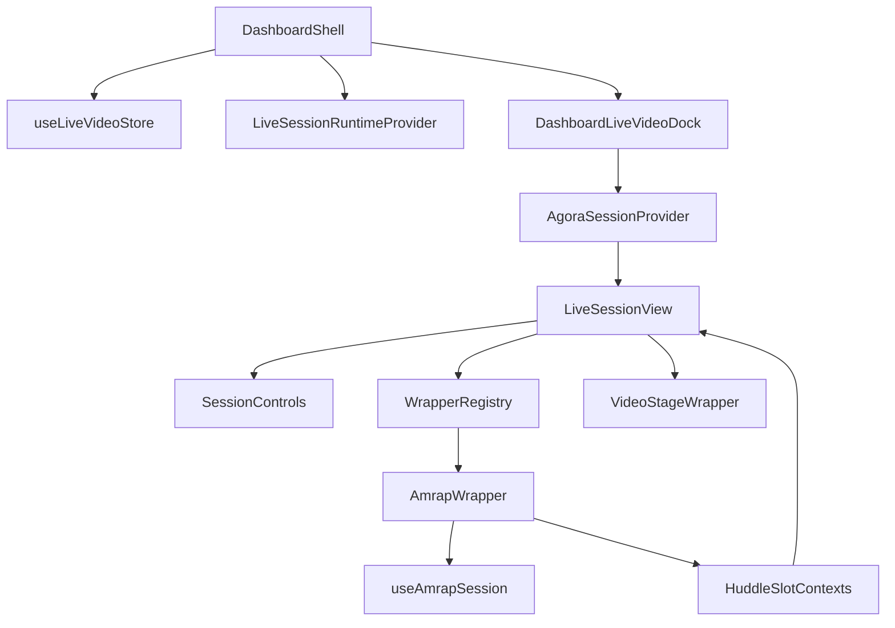
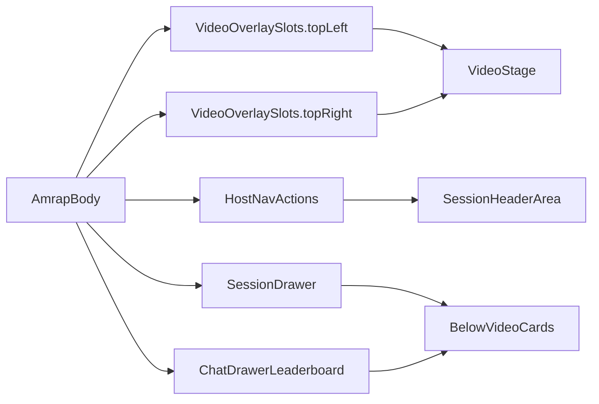

# AMRAP Wrapper README

Source areas:

- [src/features/amrap/](../../src/features/amrap/)
- [src/features/live-video/wrappers/amrap/AmrapWrapper.tsx](../../src/features/live-video/wrappers/amrap/AmrapWrapper.tsx)
- [src/features/live-video/shells/huddle/LiveSessionView.tsx](../../src/features/live-video/shells/huddle/LiveSessionView.tsx)
- [src/features/live-video/shells/huddle/SessionControls.tsx](../../src/features/live-video/shells/huddle/SessionControls.tsx)
- [src/components/dashboard/dashboard-live-video-dock.tsx](../../src/components/dashboard/dashboard-live-video-dock.tsx)

This document describes the AMRAP interval wrapper that mounts inside a live workout session after the host clicks **Start Session** and then **AMRAP block**.

The AMRAP wrapper is not a standalone page. It is an extension of the live-video huddle. It depends on:

- Agora for audio/video and participant media tracks.
- Supabase Realtime broadcast for host-owned live session phase state.
- Supabase Postgres and postgres_changes for durable wrapper attach state.
- AMRAP-specific tables/RPCs for timer, roster, and round logging.

## Current Status

The AMRAP wrapper is implemented as a first live-video interval wrapper:

- The host can attach an AMRAP block to an existing live session via `amrap_create_for_session`.
- `live_sessions.interval_wrapper_kind` and `interval_wrapper_config` select the wrapper renderer.
- `amrap_sessions` stores the server-clock timer and optional workout block snapshot.
- `amrap_participants` stores the AMRAP roster.
- `amrap_session_rounds` stores append-only round logs.
- The visible AMRAP UI is rendered through huddle slot contexts: video overlays, host nav actions, session drawer content, and leaderboard content.
- A small host-side `WrapperAttachContext` override lets the host mount the wrapper immediately after the attach RPC succeeds, without waiting for postgres_changes.

Known incomplete areas are listed in [Known Gaps](#known-gaps).

## User Flow

### Host

1. A live workout session is created from chat, a task card, a class instance, or the dev scaffold.
2. The dashboard opens `DashboardLiveVideoDock`.
3. Before Agora connects, the host sees `PreJoinBuilder`.
4. After joining video, `LiveSessionView` renders the huddle.
5. The host clicks **Start Session**. This changes shared session state from `idle` to `running` but leaves the phase in `lobby`.
6. The host clicks **AMRAP block**.
7. `SessionControls` calls `amrap_create_for_session` and immediately transitions local shared state to `phase: 'amrap'`.
8. When the RPC returns an `amrap_session_id`, `SessionControls` writes a local wrapper override so the host can mount `AmrapWrapper` immediately.
9. The RPC also updates `live_sessions.interval_wrapper_kind = 'amrap'` and `interval_wrapper_config = { amrap_session_id }`; participants receive that change via postgres_changes.
10. `AmrapWrapper` mounts and populates the huddle slots with timer, host actions, roster, and leaderboard UI.

### Participant

1. The participant joins the same live session through an invite/card/class join surface.
2. Before Agora connects, they see `ParticipantPreJoinSummary`.
3. After joining video, `LiveSessionView` renders the huddle.
4. They receive the host's shared session phase via Realtime broadcast.
5. They receive wrapper attach state through `live_sessions` postgres_changes or the join-hints backstop fetch.
6. When both `state.phase === 'amrap'` and `wrapperKind === 'amrap'`, `AmrapWrapper` mounts.
7. `useAmrapParticipants` calls `amrap_join_session` once for the participant and the participant can log rounds while the timer is in the `work` phase.

## Runtime Architecture



The live session has five separate state layers. Keep them distinct when debugging:

1. **Dashboard pointer**: `useLiveVideoStore` stores which session this browser tab is showing (`workspaceId`, `sessionId`, `channelId`, `hostUserId`, mode, and source ids).
2. **Agora media session**: `AgoraSessionProvider` owns channel join/leave, local tracks, remote users, and media toggles.
3. **Workout session state**: `LiveSessionRuntimeProvider` owns shared phase/status state through `useSessionState`.
4. **Durable wrapper state**: `live_sessions.interval_wrapper_kind` and `interval_wrapper_config` tell clients which interval wrapper to mount.
5. **AMRAP engine state**: `amrap_sessions`, `amrap_participants`, and `amrap_session_rounds` drive timer, roster, and leaderboard.

## Attach And Render Sequence

```mermaid
sequenceDiagram
  participant Host as HostBrowser
  participant Controls as SessionControls
  participant Runtime as useSessionState
  participant RPC as SupabaseRPC
  participant DB as Postgres
  participant View as LiveSessionView
  participant Participant as ParticipantBrowser

  Host->>Controls: Click AMRAP block
  Controls->>RPC: amrap_create_for_session
  Controls->>Runtime: transitionToPhase amrap
  Runtime-->>Participant: STATE_BROADCAST phase amrap
  RPC->>DB: insert/select amrap_sessions
  RPC->>DB: update live_sessions wrapper fields
  RPC-->>Controls: amrap_session_id
  Controls->>View: setOverride amrap config
  View->>View: effectiveWrapperKind becomes amrap
  DB-->>Participant: postgres_changes live_sessions UPDATE
  Participant->>Participant: wrapperKind becomes amrap
```

`LiveSessionView` renders `AmrapWrapper` only when both values agree:

```tsx
const wrapperPhaseMatches = effectiveWrapperKind === 'amrap' && state.phase === 'amrap';
```

This dual gate is intentional:

- The shared phase tells the huddle which workout phase the host selected.
- The durable wrapper config carries the server-created `amrap_session_id`.

If the phase is AMRAP but wrapper config is missing, the wrapper cannot safely mount because it has no AMRAP session row to read.

## Key Files

### Live-video shell

| File                                                                                                                         | Responsibility                                                                                                           |
| ---------------------------------------------------------------------------------------------------------------------------- | ------------------------------------------------------------------------------------------------------------------------ |
| [src/components/dashboard/dashboard-live-video-dock.tsx](../../src/components/dashboard/dashboard-live-video-dock.tsx)       | Registers `live_sessions` / `live_session_participants` after Agora connects; passes `displayName` to `LiveSessionView`. |
| [src/features/live-video/shells/huddle/LiveSessionView.tsx](../../src/features/live-video/shells/huddle/LiveSessionView.tsx) | Reads join hints, subscribes to `live_sessions` updates, selects the active interval wrapper, renders huddle slots.      |
| [src/features/live-video/shells/huddle/SessionControls.tsx](../../src/features/live-video/shells/huddle/SessionControls.tsx) | Starts the session, attaches/detaches AMRAP, transitions phase, sets host-side wrapper override.                         |
| [src/features/live-video/contexts/WrapperAttachContext.tsx](../../src/features/live-video/contexts/WrapperAttachContext.tsx) | Host-side optimistic wrapper override after `amrap_create_for_session` returns.                                          |
| [src/features/live-video/wrappers/registry.tsx](../../src/features/live-video/wrappers/registry.tsx)                         | Maps `interval_wrapper_kind` to wrapper component and wrapper metadata.                                                  |
| [src/features/live-video/wrappers/parseWrapperConfig.ts](../../src/features/live-video/wrappers/parseWrapperConfig.ts)       | Validates `amrap_session_id` from wrapper config.                                                                        |

### AMRAP feature

| File                                                                                                                     | Responsibility                                                                                        |
| ------------------------------------------------------------------------------------------------------------------------ | ----------------------------------------------------------------------------------------------------- |
| [src/features/live-video/wrappers/amrap/AmrapWrapper.tsx](../../src/features/live-video/wrappers/amrap/AmrapWrapper.tsx) | Wrapper entry point; parses config, builds AMRAP engine, writes visible UI into huddle slot contexts. |
| [src/features/amrap/hooks/useAmrapSession.ts](../../src/features/amrap/hooks/useAmrapSession.ts)                         | Composes timer, participants, rounds, actions, and page state into `AmrapSessionEngine`.              |
| [src/features/amrap/hooks/useAmrapTimerState.ts](../../src/features/amrap/hooks/useAmrapTimerState.ts)                   | Reads/subscribes to `amrap_sessions`; computes remaining seconds from server `work_started_at`.       |
| [src/features/amrap/hooks/useAmrapParticipants.ts](../../src/features/amrap/hooks/useAmrapParticipants.ts)               | Joins non-host users to AMRAP and subscribes to participant/round changes.                            |
| [src/features/amrap/hooks/useAmrapRounds.ts](../../src/features/amrap/hooks/useAmrapRounds.ts)                           | Reads/subscribes to round logs.                                                                       |
| [src/features/amrap/utils/buildAmrapBlockSnapshot.ts](../../src/features/amrap/utils/buildAmrapBlockSnapshot.ts)         | Captures the active workout deck item at attach time.                                                 |
| [src/features/amrap/types/amrap-engine.ts](../../src/features/amrap/types/amrap-engine.ts)                               | Public engine contract consumed by AMRAP components.                                                  |

### AMRAP UI components

| Component              | Visible area                                                                     |
| ---------------------- | -------------------------------------------------------------------------------- |
| `AmrapTimerOverlay`    | Top-left video overlay.                                                          |
| `AmrapLogRoundOverlay` | Top-right video overlay; participant/self round count and log button.            |
| `AmrapHostActions`     | Host nav action slot; start/reset timer.                                         |
| `AmrapWhosHere`        | Session drawer card; roster and round counts.                                    |
| `AmrapResultsDrawer`   | Chat/leaderboard slot; block snapshot, leaderboard, round times, results button. |
| `ViewResultsModal`     | Modal for copying final results.                                                 |

## Slot Rendering Contract

`AmrapWrapper` is intentionally small. Its direct DOM output is mostly a modal host and a `data-region="interval-amrap"` marker. The actual visible UI is pushed up to `LiveSessionView` through context slots.



This pattern avoids passing every AMRAP child through the huddle tree. The tradeoff is that if `AmrapWrapper` never mounts, every AMRAP slot remains `null` and the huddle appears to show nothing AMRAP-related.

When debugging "nothing displays", always check:

1. Did `state.phase` become `'amrap'`?
2. Did `effectiveWrapperKind` become `'amrap'`?
3. Does `effectiveWrapperConfig` contain a valid `amrap_session_id`?
4. Did `AmrapWrapper` mount, or did `WrapperErrorBoundary` show a fallback?
5. Did `AmrapBody` effects populate slot contexts?

## Data Model

### `live_sessions`

Created by `live_session_create` when the host joins Agora and the dock registers the durable live session row.

Relevant columns:

| Column                    | Purpose                                                                   |
| ------------------------- | ------------------------------------------------------------------------- |
| `id`                      | UUID session id from the invite/store. This is not the Agora `channelId`. |
| `host_user_id`            | Auth user id of the host.                                                 |
| `interval_wrapper_kind`   | Renderer selector. Current DB constraint supports `none` and `amrap`.     |
| `interval_wrapper_config` | JSON config for the active wrapper, e.g. `{ "amrap_session_id": "..." }`. |

`live_sessions` must be in the `supabase_realtime` publication so `LiveSessionView` can receive postgres_changes updates when AMRAP is attached/detached.

Relevant migrations:

- [supabase/migrations/20260730120000_create_live_sessions_and_participants.sql](../../supabase/migrations/20260730120000_create_live_sessions_and_participants.sql)
- [supabase/migrations/20260730120100_live_session_join_hints.sql](../../supabase/migrations/20260730120100_live_session_join_hints.sql)
- [supabase/migrations/20260731120000_live_session_lifecycle_rpcs.sql](../../supabase/migrations/20260731120000_live_session_lifecycle_rpcs.sql)
- [supabase/migrations/20260802120000_live_sessions_realtime.sql](../../supabase/migrations/20260802120000_live_sessions_realtime.sql)

### `live_session_participants`

Registered by the dock after Agora connects.

Relevant columns:

| Column         | Purpose                                                                 |
| -------------- | ----------------------------------------------------------------------- |
| `session_id`   | `live_sessions.id`.                                                     |
| `user_id`      | Auth user id.                                                           |
| `display_name` | Human label shown in live/AMRAP UIs.                                    |
| `role`         | `host` or `participant`.                                                |
| `agora_uid`    | Deterministic numeric Agora uid as a string, derived from auth user id. |

`amrap_join_session` requires live session membership through `is_live_session_participant`, so live participant registration must complete before AMRAP participant join can succeed.

### `amrap_sessions`

One AMRAP session per live session.

Relevant columns:

| Column             | Purpose                                                     |
| ------------------ | ----------------------------------------------------------- |
| `id`               | AMRAP session id passed in wrapper config.                  |
| `live_session_id`  | References `live_sessions.id`; unique.                      |
| `duration_seconds` | Timer duration. Current attach path uses 600 seconds.       |
| `timer_phase`      | `idle`, `setup`, `work`, or `finished`.                     |
| `work_started_at`  | Server timestamp used as the countdown clock source.        |
| `block_snapshot`   | Optional snapshot of selected workout block at attach time. |

### `amrap_participants`

Roster for the AMRAP block.

Relevant columns:

| Column             | Purpose                           |
| ------------------ | --------------------------------- |
| `amrap_session_id` | AMRAP session id.                 |
| `user_id`          | Auth user id.                     |
| `display_name`     | Name shown in roster/leaderboard. |
| `is_host`          | Host marker.                      |

### `amrap_session_rounds`

Append-only round logs.

Relevant columns:

| Column             | Purpose                         |
| ------------------ | ------------------------------- |
| `amrap_session_id` | AMRAP session id.               |
| `participant_id`   | `amrap_participants.id`.        |
| `logged_at`        | Server timestamp for the round. |

## RPCs

| RPC                                                                                 | Caller                     | Purpose                                                                                                                        |
| ----------------------------------------------------------------------------------- | -------------------------- | ------------------------------------------------------------------------------------------------------------------------------ |
| `live_session_create(p_session_id, p_display_name, p_agora_uid)`                    | Host                       | Creates `live_sessions` and upserts host `live_session_participants`.                                                          |
| `live_session_participant_join(p_session_id, p_display_name, p_agora_uid, p_role)`  | Participant/host           | Upserts live participant row after Agora connection.                                                                           |
| `get_live_session_join_hints(p_session_id)`                                         | Any client with session id | Returns wrapper kind/config before or alongside full row access.                                                               |
| `live_session_list_participants(p_session_id)`                                      | Host/participant           | Lists live participants; used to find host `agora_uid`.                                                                        |
| `amrap_create_for_session(p_live_session_id, p_duration_seconds, p_block_snapshot)` | Host                       | Ensures AMRAP session, upserts host AMRAP participant, attaches wrapper config on `live_sessions`, returns `amrap_session_id`. |
| `amrap_join_session(p_amrap_session_id, p_display_name)`                            | Participant                | Upserts caller into AMRAP roster.                                                                                              |
| `amrap_start_timer(p_amrap_session_id)`                                             | Host                       | Sets timer phase to `work` and `work_started_at = now()`.                                                                      |
| `amrap_reset_timer(p_amrap_session_id)`                                             | Host                       | Deletes rounds and resets timer to `idle`.                                                                                     |
| `amrap_log_round(p_amrap_session_id, p_participant_id)`                             | Participant/host self      | Inserts one round for the caller's own AMRAP participant row.                                                                  |
| `host_detach_amrap_session(p_session_id)`                                           | Host                       | Clears `live_sessions.interval_wrapper_kind/config`; leaves AMRAP rows intact.                                                 |

Most AMRAP tables have RLS enabled. Writes happen through `security definer` RPCs and are gated by host ownership or live session membership.

## Identity Glossary

The live-video AMRAP path uses several ids. Do not interchange them.

| Name                          | Example shape                   | Source                             | Purpose                                              |
| ----------------------------- | ------------------------------- | ---------------------------------- | ---------------------------------------------------- |
| `sessionId` / `liveSessionId` | UUID                            | `LiveVideoActiveSession.sessionId` | Primary key for `live_sessions`; used in RPC params. |
| `channelId`                   | `bb-live-<workspace>-<shortid>` | `LiveVideoActiveSession.channelId` | Agora channel name. Not accepted by UUID RPCs.       |
| `authUserId` / `localUserId`  | UUID                            | Supabase auth/profile              | Identity for RLS and AMRAP self matching.            |
| `agora_uid`                   | numeric string                  | `agoraUidFromUuid(authUserId)`     | Identity for Agora tiles and video exclusion.        |
| `amrap_session_id`            | UUID                            | `amrap_sessions.id`                | Wrapper config value; passed to AMRAP hooks/RPCs.    |
| `amrap_participants.id`       | UUID                            | `amrap_join_session` / host upsert | Used when logging rounds.                            |

`LiveSessionView` explicitly validates `liveSessionId` as a UUID before calling UUID-based RPCs. The Agora `channelId` must not be passed to those RPCs.

## Realtime Channels

### Broadcast channels

`useSessionState` uses Supabase Realtime broadcast on:

```text
room-session:${workspaceId}:${sessionId}
```

Broadcast carries the host-owned huddle state: status, phase, active deck item, aspect ratio, and generation.

AMRAP depends on this broadcast for `state.phase === 'amrap'`, but broadcast does not carry the `amrap_session_id`.

### postgres_changes channels

`LiveSessionView` subscribes to:

```text
live_session:${liveSessionId}
```

and listens for UPDATE events on `public.live_sessions` filtered by id. This is how non-host clients learn that `interval_wrapper_kind` changed to `amrap`.

AMRAP hooks also subscribe to:

- `amrap_session:${amrapSessionId}` for timer row updates.
- `amrap_participants:${amrapSessionId}` for roster/round aggregate refresh.
- `amrap_session_rounds:${amrapSessionId}:${channelInstanceId}` for round logs.

The publication requirements are:

- `live_sessions` in `supabase_realtime`.
- `amrap_sessions` in `supabase_realtime`.
- `amrap_participants` in `supabase_realtime`.
- `amrap_session_rounds` in `supabase_realtime`.

If any table is missing from the publication, subscriptions may appear subscribed but never emit the expected row changes.

## Timer Semantics

The shared huddle state machine has local `blockStartedAt` / pause fields. AMRAP does not use those values as its authoritative work timer.

AMRAP timer state comes from `amrap_sessions`:

1. The host clicks **Start timer** in `AmrapHostActions`.
2. `amrap_start_timer` updates `timer_phase = 'work'` and `work_started_at = now()`.
3. `useAmrapTimerState` receives the row and computes `remainingSec` locally from the server timestamp.
4. When remaining time reaches zero, the hook derives `timerPhase = 'finished'` locally even if the database row still says `work`.

This gives every client the same server-clock origin without broadcasting timer ticks.

## Workout Block Snapshot

When the host attaches AMRAP, `SessionControls` picks the active workout deck snapshot:

1. Prefer the selected deck snapshot if one is active.
2. Fall back to the first deck item.
3. Build a compact `block_snapshot` with title, workout type, duration, and exercises.

The snapshot is stored on first AMRAP session creation and shown in `AmrapResultsDrawer`. Because `amrap_sessions.live_session_id` is unique, later calls reuse the same AMRAP row and do not replace the snapshot.

## Error Boundaries And Missing Config

`LiveSessionView` wraps interval wrappers in `WrapperErrorBoundary`. If a wrapper throws, the user sees:

```text
Wrapper failed to render.
```

`AmrapWrapper` also handles missing/invalid config directly:

```text
Missing AMRAP session. Ask the host to restart AMRAP.
```

If this appears, check:

- Was `amrap_create_for_session` successful?
- Did it return an `amrap_session_id`?
- Does `live_sessions.interval_wrapper_config` contain `{ "amrap_session_id": "<uuid>" }`?
- Did `parseAmrapSessionIdFromWrapperConfig` reject the id as non-UUID?

## Troubleshooting

### Nothing AMRAP-related displays after clicking AMRAP block

Most likely causes:

1. `live_sessions` is not in `supabase_realtime`.
2. `amrap_create_for_session` failed.
3. `liveDbReady` is false, so the AMRAP button is disabled or attach is skipped.
4. `state.phase` did not become `amrap`.
5. `interval_wrapper_config` is missing or invalid.
6. `WrapperErrorBoundary` caught a render error.

Checklist:

- Confirm the migration [20260802120000_live_sessions_realtime.sql](../../supabase/migrations/20260802120000_live_sessions_realtime.sql) has been applied to the target database.
- Inspect browser console for `[SessionControls] amrap_create_for_session`.
- Inspect browser console for `[LiveSessionView] get_live_session_join_hints`.
- Check the `live_sessions` row:
  - `interval_wrapper_kind = 'amrap'`
  - `interval_wrapper_config->>'amrap_session_id'` is a UUID.
- Check the `amrap_sessions` row exists for the same `live_session_id`.
- Confirm `LiveSessionView` is mounted after Agora is connecting/connected.

### Host sees AMRAP but participant does not

Most likely causes:

1. Host-side `WrapperAttachContext` override is working, but participants are not receiving `live_sessions` postgres_changes.
2. Participant has not registered in `live_session_participants`, so AMRAP RLS/selects fail.
3. Participant joined after AMRAP attach and join hints are returning stale/missing config.

Checklist:

- Confirm `live_sessions` is in the Realtime publication.
- Confirm participant has a `live_session_participants` row for the same `session_id`.
- Confirm `get_live_session_join_hints(p_session_id)` returns `interval_wrapper_kind: 'amrap'`.
- Confirm participant receives host broadcast with `phase: 'amrap'`.

### Roster shows UUIDs instead of names

`DashboardLiveVideoDock` receives `displayName` from `DashboardShell` as:

```tsx
profile.full_name ?? profile.email ?? undefined;
```

If both profile fields are missing, the dock falls back to `localUserId`. Check profile loading and profile row completeness.

### Log round button is missing

`AmrapLogRoundOverlay` returns `null` when `engine.selfParticipant` is missing. Check:

- `amrap_join_session` succeeded.
- `amrap_participants.user_id` matches the current auth user id.
- The participant can select `amrap_participants` under RLS.

The button is disabled unless `engine.timerPhase === 'work'`.

### Timer does not start

Only hosts receive `engine.startTimer`.

Check:

- `role === 'host'` in `WrapperBaseProps`.
- `amrap_start_timer` succeeds.
- The `amrap_sessions` row updates to `timer_phase = 'work'` and has `work_started_at`.
- `amrap_sessions` is in the Realtime publication.

## QA Checklist

### Single-host smoke test

1. Start a live workout.
2. Join video as host.
3. Click **Start Session**.
4. Click **AMRAP block**.
5. Confirm:
   - AMRAP timer overlay appears on video.
   - Host **Start timer** / **Reset** actions appear.
   - Who's here card appears.
   - Leaderboard/results card appears.
6. Click **Start timer**.
7. Confirm countdown ticks.
8. Click **Reset**.
9. Confirm rounds clear and timer returns to idle.
10. Click **Return to Huddle**.
11. Confirm AMRAP UI clears.

### Host plus participant test

1. Start a live workout as host in browser A.
2. Join the same session as participant in browser B.
3. Host clicks **Start Session** then **AMRAP block**.
4. Confirm participant sees AMRAP UI within Realtime latency.
5. Host clicks **Start timer**.
6. Participant clicks **Log round**.
7. Confirm host and participant leaderboards update.
8. Host clicks **End Session for All**.
9. Confirm participant UI resets or the live session ends as expected.

### Rejoin test

1. Attach AMRAP as host.
2. Participant leaves the dock.
3. Participant rejoins from the invite/card/class surface.
4. Confirm join hints mount the AMRAP wrapper without requiring another host click.

## AMRAP Block 2 (minimal)

Parallel entry point for the **same** `amrap_sessions` / `useAmrapSession` stack, with `live_sessions.interval_wrapper_kind = 'amrap_minimal'`. Host chooses **AMRAP Block 2** in the huddle lobby; RPC is `amrap_create_for_session(..., p_wrapper_kind := 'amrap_minimal')`.

**What everyone sees**

- Video overlays only: **AMRAP** countdown (`AmrapTimerOverlay`) and **Log round** + round count (`AmrapLogRoundOverlay`).
- Host header actions: **Start timer** / **Reset** (`AmrapHostActions`).
- Host footer (same as full AMRAP while in block): **Pause Block** / **Resume Block** / **Return to Huddle** (`SessionControls`).

**What is omitted vs full AMRAP**

- No **Who's here** session-drawer slot (`AmrapMinimalWrapper` does not register session-drawer context).
- **Leaderboard** still mounts: `AmrapMinimalWrapper` registers `setChatDrawerLeaderboard(<AmrapResultsDrawer …/>)` and `LiveSessionView` renders that slot in a bordered card below session controls during `amrap_minimal` (same data as full AMRAP, without the large inline wrapper card).
- No bordered **inline** AMRAP wrapper card (`registry` `inlineUi: false`); the minimal wrapper still mounts off-stage for effects (overlays, host nav, `ViewResultsModal` for finished recap).

**Smoke test (host + participant)**

1. Host: **Start Session** → **AMRAP Block 2** (not **AMRAP block**).
2. Confirm both clients see timer + log round on video, no Who's here card, and no **inline** bordered AMRAP wrapper card (leaderboard may still appear in the chat-drawer slot card below controls).
3. Host **Start timer** → participant **Log round**; confirm rounds still sync via existing AMRAP RPCs.
4. Host **Return to Huddle** → confirm wrapper clears (`host_detach_amrap_session` + phase lobby).

## Contributor Notes

- Treat `LiveSessionView` as the wrapper composition boundary. New interval wrappers should plug into the registry and should not duplicate the huddle shell.
- Keep wrapper config small and validated. For AMRAP, only trust `amrap_session_id` after `parseAmrapSessionIdFromWrapperConfig`.
- Use DB rows/RPCs for durable interval state and Realtime broadcast for huddle phase/status.
- Do not pass Agora `channelId` to UUID RPCs.
- Keep the direct AMRAP wrapper DOM small; use slot contexts for huddle chrome integration.
- Any new table used by `postgres_changes` must be added to `supabase_realtime`.
- Any public table should have RLS enabled, with writes gated through explicit RPCs when the write rules are more complex than a simple owner check.

## Known Gaps

These are intentionally not part of the current AMRAP display fix:

- `TimerVideoBackground` exists but is not wired into `AmrapWrapper`.
- `AmrapEmbedExerciseSection` exists but is not rendered in the current wrapper UI.
- `AmrapResultsDrawer` calls `useAmrapRounds` even though the engine already derives round counts; this double-subscribes but currently works.
- The huddle **Pause Block** / **Resume Block** controls update local shared state, not the AMRAP server-clock timer.
- Moving from AMRAP directly to Warm-up or Tabata does not currently detach AMRAP server-side unless the host uses **Return to Huddle** or **End Session for All**.
- `IntervalWrapperKind` includes `simple_countdown`; `live_sessions.interval_wrapper_kind` supports `none`, `amrap`, and `amrap_minimal` (see migration `20260803120000_amrap_minimal_wrapper.sql`).
- AMRAP session duration is hard-coded to 600 seconds in `SessionControls`.

## Related Docs

- [docs/live-video/readme.md](../live-video/readme.md)
- [docs/fitness/README.md](README.md)
- [docs/fitness/workout-player.md](workout-player.md)
