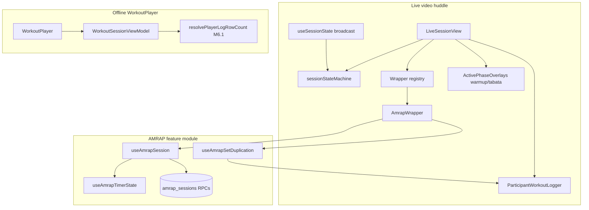
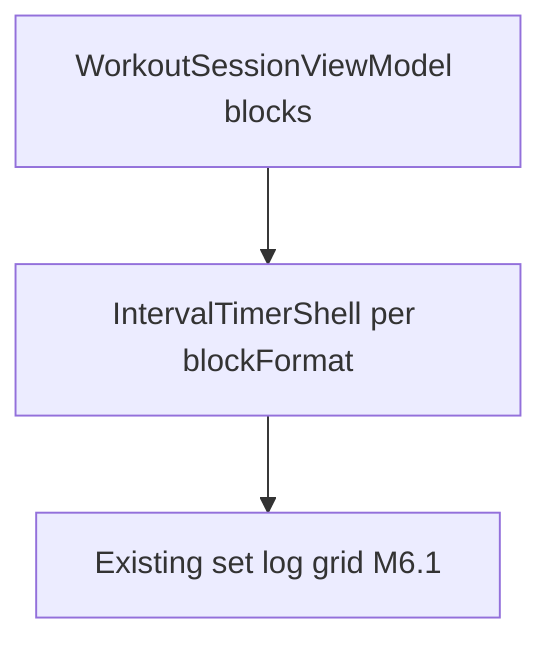

# Live Video Timers Audit

**Status:** Living audit (2026-05-20; Tabata/EMOM unified interval updated 2026-06-24)  
**Context:** Step 7 (Execution UX) plans interval timer shells (AMRAP, EMOM, Tabata) around the parametric [`WorkoutPlayer`](../../../src/components/fitness/WorkoutPlayer.tsx). This document inventories what already exists in live video before building anything new.

**Related:** [AMRAP wrapper README](../amrap-wrapper-readme.md) · [parametric-step6-plan.md](../parametric-step6-plan.md) · [Workout UI landscape](../README.md) · [live-video blueprint](../../live-video-blueprint.md) · [Tabata timer overlay assessment](../timers/live-video/tabata-timer-overlay-assessment.md)

---

## Executive summary

| Asset                            | Maturity                                                               | Step 7 relevance                                                                                                    |
| -------------------------------- | ---------------------------------------------------------------------- | ------------------------------------------------------------------------------------------------------------------- |
| **AMRAP interval wrapper**       | Production (`AmrapWrapper` + DB-backed engine)                         | **High salvage** — countdown, round logging, infinite-set duplication pattern                                       |
| **Session phase machine**        | Production (broadcast + pure reducer)                                  | **Partial** — phases `lobby \| warmup \| amrap \| tabata \| emom`                                                   |
| **Block elapsed clock**          | Production (`TimerDisplay`, `ActivePhaseOverlays`, `SessionClockMini`) | **Partial** — count-up/countdown display; legacy Tabata placeholder (4:00) suppressed when unified wrapper attached |
| **Simple countdown wrapper**     | Stub UI only                                                           | **Low** — registry entry exists, no timer logic                                                                     |
| **EMOM live timer**              | Production (unified interval wrapper)                                  | `BaseIntervalWrapper` + `EmomMechanics` + minute-segment FSM via `live_interval_sessions`                           |
| **Tabata live timer**            | Production (unified interval wrapper)                                  | `BaseIntervalWrapper` + `TabataMechanics` + work/rest FSM bound via `buildTabataAttachPayload`                      |
| **Offline WorkoutPlayer timers** | Elapsed wall clock only (`setInterval` 1s)                             | **Separate path** — M6.1 row counts; no interval shells yet                                                         |

**Bottom line:** Production-grade live interval execution exists for **AMRAP** (original wrapper) and for **Tabata/EMOM** via the unified `live_interval_sessions` path (`BaseIntervalWrapper` + polymorphic mechanics). The legacy `ActivePhaseOverlays` Tabata placeholder is suppressed when the unified Tabata wrapper is attached (`suppressTabataPlaceholder` in `LiveSessionView`). Offline **WorkoutPlayer** interval shells remain a separate Step 7 deliverable.

---

## Architecture map



Two **independent timing domains**:

1. **Live session block clock** — host broadcast state (`blockStartedAt`, pause/resume); client displays via `Date.now()` math.
2. **AMRAP server clock** — authoritative `work_started_at` + `duration_seconds` on `amrap_sessions`; client tick for display only.

---

## Component inventory

### Interval wrapper registry

| File                                                                                                                                                                    | Role                                                                            |
| ----------------------------------------------------------------------------------------------------------------------------------------------------------------------- | ------------------------------------------------------------------------------- |
| [`src/features/live-video/wrappers/registry.tsx`](../../../src/features/live-video/wrappers/registry.tsx)                                                               | Maps `IntervalWrapperKind` → component                                          |
| [`src/features/live-video/wrappers/types.ts`](../../../src/features/live-video/wrappers/types.ts)                                                                       | `WrapperBaseProps`, kinds: `none \| simple_countdown \| amrap \| amrap_minimal` |
| [`src/features/live-video/wrappers/amrap/AmrapWrapper.tsx`](../../../src/features/live-video/wrappers/amrap/AmrapWrapper.tsx)                                           | Production AMRAP mount + slot injection                                         |
| [`src/features/live-video/wrappers/simple-countdown/SimpleCountdownWrapper.tsx`](../../../src/features/live-video/wrappers/simple-countdown/SimpleCountdownWrapper.tsx) | Static stub                                                                     |

**Registered today:** `simple_countdown`, `amrap` (and `amrap_minimal` → same component). **No** `emom` or `tabata` wrapper kinds.

---

### AMRAP feature module (`src/features/amrap/`)

| File                                                                                                     | Timing                                                           | State                                                            | Purpose                                                       |
| -------------------------------------------------------------------------------------------------------- | ---------------------------------------------------------------- | ---------------------------------------------------------------- | ------------------------------------------------------------- |
| [`hooks/useAmrapTimerState.ts`](../../../src/features/amrap/hooks/useAmrapTimerState.ts)                 | **`setInterval(500ms)`** + **`Date.now()`** vs `work_started_at` | React state on `amrap_sessions` row; Realtime `postgres_changes` | Countdown display; phases `idle \| setup \| work \| finished` |
| [`hooks/useAmrapSession.ts`](../../../src/features/amrap/hooks/useAmrapSession.ts)                       | Composes timer hook                                              | Composes participants + rounds + RPCs                            | Full `AmrapSessionEngine`                                     |
| [`hooks/useAmrapParticipants.ts`](../../../src/features/amrap/hooks/useAmrapParticipants.ts)             | Realtime                                                         | Roster + `amrap_join_session`                                    | Participant list                                              |
| [`hooks/useAmrapRounds.ts`](../../../src/features/amrap/hooks/useAmrapRounds.ts)                         | Realtime                                                         | Append-only round timestamps                                     | Lap splits / leaderboard input                                |
| [`hooks/useAmrapSetDuplication.ts`](../../../src/features/amrap/hooks/useAmrapSetDuplication.ts)         | Effect on `rounds` delta                                         | Ref tracks `prevRounds`; upserts logs                            | **Infinite set growth** (see below)                           |
| [`components/AmrapTimerOverlay.tsx`](../../../src/features/amrap/components/AmrapTimerOverlay.tsx)       | Reads engine                                                     | Presentational                                                   | Top-left video overlay countdown                              |
| [`components/AmrapLogRoundOverlay.tsx`](../../../src/features/amrap/components/AmrapLogRoundOverlay.tsx) | User action                                                      | Calls `engine.logRound()`                                        | Top-right “Log round”                                         |
| [`components/AmrapResultsDrawer.tsx`](../../../src/features/amrap/components/AmrapResultsDrawer.tsx)     | —                                                                | Chat drawer leaderboard                                          | Host finalize flow                                            |
| [`utils/buildAmrapBlockSnapshot.ts`](../../../src/features/amrap/utils/buildAmrapBlockSnapshot.ts)       | —                                                                | —                                                                | Flat exercise list from deck snapshot                         |

Host timer control: RPCs `amrap_start_timer`, `amrap_reset_timer` (via `useAmrapSession`), not client-owned interval state.

---

### Live session state machine

| File                                                                                                              | Timing                                         | State                                                            | Purpose                                                                                                                    |
| ----------------------------------------------------------------------------------------------------------------- | ---------------------------------------------- | ---------------------------------------------------------------- | -------------------------------------------------------------------------------------------------------------------------- |
| [`state/sessionStateMachine.ts`](../../../src/features/live-video/state/sessionStateMachine.ts)                   | Pure **`Date.now()`** in `getBlockElapsedMs`   | Immutable reducer; no internal timers                            | Phases: `lobby \| warmup \| amrap \| tabata`                                                                               |
| [`hooks/useSessionState.ts`](../../../src/features/live-video/hooks/useSessionState.ts)                           | Broadcast-driven ticks                         | Supabase `room-session:*` channel; epoch offset for participants | Host authority + participant sync                                                                                          |
| [`shells/TimerDisplay.tsx`](../../../src/features/live-video/shells/TimerDisplay.tsx)                             | **`requestAnimationFrame`** loop               | Local label string                                               | Formats: count-up, countdown-seconds, countdown-tenths                                                                     |
| [`shells/huddle/SessionClockMini.tsx`](../../../src/features/live-video/shells/huddle/SessionClockMini.tsx)       | **`setInterval(100ms)`**                       | Global session elapsed (ignores block pause)                     | Mini HUD clock                                                                                                             |
| [`shells/huddle/ActivePhaseOverlays.tsx`](../../../src/features/live-video/shells/huddle/ActivePhaseOverlays.tsx) | **`setInterval(100ms)`** + `getBlockElapsedMs` | Warmup = count-up; Tabata = countdown                            | **Legacy placeholder** `PLACEHOLDER_TABATA_TOTAL_MS = 4 * 60 * 1000`; suppressed when unified Tabata/EMOM wrapper attached |

**EMOM phase** exists in `SessionPhase` for unified wrapper mount. AMRAP phase uses the dedicated wrapper, not `ActivePhaseOverlays`.

---

### Participant logging (live)

| File                                                                                                          | Role                                                     |
| ------------------------------------------------------------------------------------------------------------- | -------------------------------------------------------- |
| [`shells/ParticipantWorkoutLogger.tsx`](../../../src/features/live-video/shells/ParticipantWorkoutLogger.tsx) | Set grid for active deck task; **AMRAP-specific branch** |
| [`hooks/useWorkoutLogs.ts`](../../../src/features/live-video/hooks/useWorkoutLogs.ts)                         | CRUD for `workout_exercise_logs`                         |

Exercise list source: **`metadataFieldsFromParsed(activeTask.metadata).workoutExercises`** — flat cache, not `WorkoutSessionViewModel.blocks`.

---

### Offline WorkoutPlayer (not live video)

| File                                                                                                  | Timing                        | Role                                                                |
| ----------------------------------------------------------------------------------------------------- | ----------------------------- | ------------------------------------------------------------------- |
| [`src/components/fitness/WorkoutPlayer.tsx`](../../../src/components/fitness/WorkoutPlayer.tsx)       | **`setInterval(1s)`** elapsed | Modal player; Step 6 M6.1 block-aware **row counts**                |
| [`resolve-player-log-row-count.ts`](../../../src/lib/workout-factory/resolve-player-log-row-count.ts) | —                             | Derives row count from `formatParams.rounds` (Tabata/EMOM/circuit…) |

No interval countdown, work/rest alternation, or AMRAP time-cap UI in WorkoutPlayer yet.

---

### Scaffold / mock (non-production)

| File                                                                                            | Notes                                                                     |
| ----------------------------------------------------------------------------------------------- | ------------------------------------------------------------------------- |
| [`shells/WorkoutTimerShell.tsx`](../../../src/features/live-video/shells/WorkoutTimerShell.tsx) | Dev scaffold; Agora + session timer HUD                                   |
| [`ui/AmrapVideoOverlays.tsx`](../../../src/features/live-video/ui/AmrapVideoOverlays.tsx)       | **Hardcoded mock** (e.g. 14:55); huddle uses real `AmrapWrapper` overlays |

---

## AMRAP logging loop (infinite / unknown set count)

This is the most complete “unknown number of sets” pattern in the codebase.

### UX model

1. **Prep row only (set 1)** — In `phase === 'amrap'`, `ParticipantWorkoutLogger` renders **one editable row per exercise** (`prepSetNumber = 1`). Copy: _“Each logged round will copy these values into the next set in your workout log.”_

2. **Round button (video overlay)** — `AmrapLogRoundOverlay` → `engine.logRound()` → RPC `amrap_log_round`. Round count is **unbounded** (leaderboard sorts by total rounds).

3. **Automatic set duplication** — `useAmrapSetDuplication` (participants only, wired in `AmrapWrapper`):
   - Watches `engine.selfParticipant.rounds`.
   - On increase, for each round step and each flat exercise:
     - `set_number = max(existing set_number for exercise) + 1`
     - Copies **latest log row** for that exercise, else **prescription** (`weight`, `reps`, `rpe` from flat metadata)
     - **Skips insert** if all three are null: `if (weightLbs == null && reps == null && rpe == null) continue`
     - Upserts to `workout_exercise_logs` (`onConflict: user_id,session_id,task_id,exercise_name,set_number`)

4. **Read-only historical sets** — Logger lists `set_number > 1` as read-only summaries (“Sets from logged rounds”); does **not** pre-render infinite input rows.

5. **Deck task switch** — `prevRoundsRef` resets when `activeTask.id` changes so rounds are not backfilled onto a new card.

### Contrast with offline WorkoutPlayer (M6.1)

|                 | Live AMRAP                                           | Offline WorkoutPlayer                             |
| --------------- | ---------------------------------------------------- | ------------------------------------------------- |
| Set count model | **Grow on round log**                                | **Fixed at open** from `resolvePlayerLogRowCount` |
| Row driver      | Round events + duplication hook                      | `formatParams.rounds` / `exercise.sets`           |
| Persistence     | `workout_exercise_logs` per live session             | `draft_logs` matrix + finish payload              |
| Coach context   | Not wired to `live_set_counts` (M6.2 is player-only) | M6.2 `live_set_counts` on coach rail              |

For Step 7 **Tabata/EMOM shells on WorkoutPlayer**, the AMRAP **round-driven duplication** pattern is informative for “unbounded” formats, but **fixed-round Tabata** is closer to M6.1’s pre-sized grid + per-interval cell updates—not AMRAP’s lap model.

---

## Timing mechanism reference

| Component                               | Mechanism                                             | Authority                                 |
| --------------------------------------- | ----------------------------------------------------- | ----------------------------------------- |
| `useAmrapTimerState`                    | `setInterval(500)` + `Date.now()` − `work_started_at` | **Server** (`amrap_sessions` row)         |
| `useSessionState` / `getBlockElapsedMs` | `Date.now()` vs `blockStartedAt` (pause-aware)        | **Host broadcast**                        |
| `TimerDisplay`                          | `requestAnimationFrame` + parent `getElapsedMs()`     | Parent state                              |
| `SessionClockMini`                      | `setInterval(100)`                                    | Local vs `globalStartedAt`                |
| `ActivePhaseOverlays`                   | `setInterval(100)`                                    | Block elapsed; Tabata total **hardcoded** |
| `WorkoutPlayer` elapsed                 | `setInterval(1000)`                                   | Local React state                         |

**No `requestAnimationFrame`** in AMRAP engine. **No shared interval library** — each surface owns its tick loop.

---

## Coupling: flat vs parametric schema

| Consumer                                              | Schema                                              | Notes                                                                                   |
| ----------------------------------------------------- | --------------------------------------------------- | --------------------------------------------------------------------------------------- |
| `buildAmrapBlockSnapshot`                             | **Flat** `workoutExercises` + `duration_min`        | Stored on `amrap_sessions.block_snapshot`                                               |
| `useAmrapSetDuplication` / `ParticipantWorkoutLogger` | **Flat** from active deck task metadata             | Ignores `ai_workout_factory.workout_set`                                                |
| `WorkoutPlayer` + M6.1                                | **Rich or flat** via `buildWorkoutSessionViewModel` | `formatParams.rounds` drives row count for Tabata/EMOM/circuit                          |
| Live session phases                                   | **Phase names only**                                | `tabata` phase ≠ block `blockFormat: 'tabata'` on deck                                  |
| `formatBlockSubtitle` / coach merge                   | **Parametric**                                      | Labels from `formatParams`; not consumed by live timers                                 |
| `hydrateTabataExercisesFromFormatParams` (merge)      | **Factory**                                         | Sets `rounds`/`work_seconds` on exercise rows; live path does not read these for timers |

**Gap for Step 7:** Live AMRAP and participant logger are **flat-metadata-first**. Parametric blocks (Tabata `formatParams`, EMOM `interval_seconds`) are visible in deck summaries and offline player but **not** bound to live interval state machines.

---

## Reusability assessment for Step 7

### Salvage as-is or with thin adapters

| Asset                                                   | Recommendation                                                                                                                         |
| ------------------------------------------------------- | -------------------------------------------------------------------------------------------------------------------------------------- |
| **`TimerDisplay` + `formatSessionTime`**                | Reuse for count-up/countdown display in WorkoutPlayer shells                                                                           |
| **`getBlockElapsedMs` pause semantics**                 | Pattern for host-synced pause; adapt to local-only player (no broadcast)                                                               |
| **AMRAP countdown pattern** (`useAmrapTimerState`)      | Adapt “server anchor + client tick” if player timers need cross-device sync later; for solo player, local `Date.now()` start is enough |
| **`useAmrapSetDuplication` round→set model**            | Reference for AMRAP-style **unbounded** logging on live deck; **not** for fixed 8-round Tabata grid                                    |
| **Video overlay slot API** (`VideoOverlaySlotsContext`) | Live-video only; WorkoutPlayer shell likely uses in-panel chrome, not Agora slots                                                      |
| **Wrapper registry pattern**                            | Good mental model for Step 7 “shell per blockFormat” if live huddle ever mounts parametric wrappers                                    |

### Needs refactor or new build

| Gap                                          | Step 7 action                                                                                                                                                           |
| -------------------------------------------- | ----------------------------------------------------------------------------------------------------------------------------------------------------------------------- |
| **Tabata auto-set logging**                  | **Resolved** — `useTabataWorkSetSync` upserts on work-segment entry (see [tabata-timer-overlay-assessment.md](../timers/live-video/tabata-timer-overlay-assessment.md)) |
| **`SimpleCountdownWrapper` stub**            | Implement or fold into generic time-cap shell                                                                                                                           |
| **Live logger flat-only**                    | Either map `WorkoutSessionViewModel.flatExercises` into logger or teach logger block-aware sections                                                                     |
| **WorkoutPlayer has no interval UI**         | Step 7 primary deliverable: timer chrome **around** existing set grid (M6.1 row counts)                                                                                 |
| **Two timing domains (session vs AMRAP DB)** | Step 7 offline player should use **single local machine** per block, not live-session broadcast                                                                         |

### Suggested Step 7 layering (preview)



- **Tabata / EMOM / AMRAP (time-cap):** one shell component family driven by `block.formatParams`, not live-video `SessionPhase`.
- **Reuse M6.1** for how many rows exist; shells orchestrate **which row is active** and **work/rest timing**, not row creation (except AMRAP-style unbounded formats if product requires).

---

## Database & RPC surface (AMRAP)

Migrations under `supabase/migrations/20260801*`:

- Tables: `amrap_sessions`, `amrap_participants`, `amrap_session_rounds`
- RPCs: `amrap_create_for_session`, `amrap_start_timer`, `amrap_reset_timer`, `amrap_log_round`, `amrap_join_session`, finalize/leaderboard helpers
- Live attach: `live_sessions.interval_wrapper_kind`, `interval_wrapper_config` (JSON with `amrap_session_id`)

EMOM/Tabata use **`live_interval_sessions`** (unified interval engine migration `20260904120000`). See [Tabata timer overlay assessment](../timers/live-video/tabata-timer-overlay-assessment.md) for Tabata-specific architecture.

---

## Verification commands

```bash
# AMRAP + live-video unit tests (representative)
pnpm exec vitest run \
  src/features/amrap \
  src/features/live-video/shells/huddle/SessionDeckBuilder.test.tsx \
  src/features/live-video/state

# Parametric player row counts (Step 6 M6.1 — prerequisite for Step 7 grids)
pnpm exec vitest run \
  src/lib/workout-factory/resolve-player-log-row-count.test.ts
```

---

## Open questions for Step 7 planning

1. **Scope split:** Step 7 shells on **WorkoutPlayer only**, **live huddle only**, or both?
2. **Tabata:** Pre-sized 8 rows (M6.1) + highlight active round vs work/rest sub-states within each row?
3. **EMOM:** Derive `total_rounds` from `total_minutes / interval_seconds` when `formatParams.rounds` absent?
4. **AMRAP on WorkoutPlayer:** Time-cap countdown + optional round counter without live `amrap_sessions` DB?
5. **Parametric logger:** Upgrade `ParticipantWorkoutLogger` to `WorkoutSessionViewModel` or keep flat path for live?

---

## Audit metadata

| Item                  | Value                                                               |
| --------------------- | ------------------------------------------------------------------- |
| Audit date            | 2026-05-20                                                          |
| Tabata/EMOM update    | 2026-06-24 (unified interval wrapper; see assessment doc)           |
| Step 6 dependency     | M6.1 row counts shipped; M6.2 coach `live_set_counts` (player path) |
| Primary reference doc | [docs/fitness/amrap-wrapper-readme.md](../amrap-wrapper-readme.md)  |
