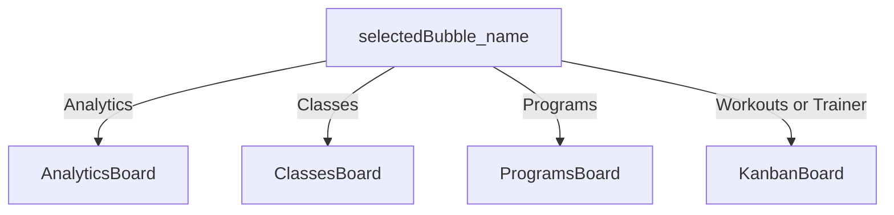

# Fitness Bubbles (channels)

A **Bubble** is a row in the `bubbles` table scoped to a **Social Space** (`workspaces`). The bubble sidebar sets `selectedBubbleId`; the main stage (and chat) follow that selection. Parent context: [docs/fitness README](../README.md) and the root [README.md](../../../README.md).

## Default fitness seed

When a workspace is created with `category_type = 'fitness'`, default channels and shared Kanban column slugs come from [`WORKSPACE_SEED_BY_CATEGORY.fitness`](../../src/lib/workspace-seed-templates.ts):

- **Bubbles (in order):** Programs, Workouts, Classes, Trainer, Analytics.
- **Board columns (all fitness Kanban surfaces that use workspace board columns):** Library, Scheduled, Today, Completed.

The **Analytics** bubble was also **backfilled** for older fitness workspaces that predated it; see [20260431100000_backfill_fitness_analytics_bubble.sql](../../supabase/migrations/20260431100000_backfill_fitness_analytics_bubble.sql).

## Name contract (special boards)

In [dashboard-shell.tsx](../../src/components/dashboard/dashboard-shell.tsx), three main-stage UIs are chosen by **exact string match** on the selected bubble’s **`name`** (not id):

| Name        | Main board UI                                                    |
| ----------- | ---------------------------------------------------------------- |
| `Analytics` | `AnalyticsBoard` (under `PremiumGate` for the analytics feature) |
| `Classes`   | `ClassesBoard`                                                   |
| `Programs`  | `ProgramsBoard`                                                  |

If an admin **renames** one of these bubbles, the shell **stops** rendering the special board until the name matches again (V1 has no slug-based routing; see comments near `isAnalyticsBubble` in the shell).

**Workouts** and **Trainer** do **not** have name checks: they use the default [KanbanBoard](../../src/components/board/kanban-board.tsx) with the same chat and calendar rail behavior as other non-fitness workspaces, plus fitness category theming and tasks.

## Architecture: roles, state, and gating

This section answers how **permission hierarchy**, **state**, and **UI gating** work for fitness (and the same model applies to other categories unless noted). **There is no separate permission matrix per fitness bubble name** (Programs, Workouts, etc.); differences are **which surface** mounts (name contract above) and **feature wrappers** (e.g. subscription on Analytics).

### 1. Role hierarchy and purpose (UI permission matrix)

**Vocabulary:** In the database, `workspace_members.role` uses [MemberRole](../../src/types/database.ts): `owner` \| `admin` \| `member` \| `guest` \| `trialing`. Product copy may use words like _host_ or _lead_; they are not separate enum values in code. **`trialing`** is the **Storefront / member preview** role (time-bounded on `workspace_members`).

Canonical UI rules live in [permissions.ts](../../src/lib/permissions.ts) (pure functions; **RLS enforces** on the server; these drive buttons and visibility).

**Workspace-level roles (numeric rank: owner > admin > member = trialing > guest):**

| Role       | `canWriteWorkspace` (tasks on **public** bubbles) | `canManageWorkspace` (settings, invites, members) | `canDeleteWorkspace` / promote owner |
| ---------- | ------------------------------------------------- | ------------------------------------------------- | ------------------------------------ |
| `owner`    | yes                                               | yes                                               | yes                                  |
| `admin`    | yes                                               | yes                                               | no                                   |
| `member`   | yes                                               | no                                                | no                                   |
| `trialing` | **yes** (ranked with `member`)                    | no                                                | no                                   |
| `guest`    | **no**                                            | no                                                | no                                   |

**Bubble-level (private `bubbles.is_private` and `bubble_members`):**

| Situation                                                       | View bubble (tasks + messages)                                                                | Create/edit tasks (`canWriteBubble`)                                   |
| --------------------------------------------------------------- | --------------------------------------------------------------------------------------------- | ---------------------------------------------------------------------- |
| Owner or admin                                                  | yes                                                                                           | yes                                                                    |
| Member or trialing, **public** bubble                           | yes                                                                                           | yes                                                                    |
| Member or trialing, **private** bubble, no `bubble_members` row | **no** in helper                                                                              | no                                                                     |
| Member or trialing, **private** bubble, `role = editor`         | yes (any row grants view)                                                                     | yes                                                                    |
| Member or trialing, **private** bubble, `role = viewer`         | yes                                                                                           | **no** (chat still allowed: `canPostMessages` follows `canViewBubble`) |
| `guest`                                                         | only if they have a `bubble_members` row (enables `canViewBubble`); not via “public” shortcut | only if `editor` on that private bubble                                |

`resolvePermissions` bundles flags such as `canWriteTasks`, `canPostMessages`, `canCreateWorkspaceBubble`, `isAdmin`, `isOwner` (see [PermissionFlags](../../src/lib/permissions.ts)).

**Storefront soft-lock (separate from rank):** After **member preview** ends (`memberPreviewPeriodEnded` in [member-trial-soft-lock.ts](../../src/lib/member-trial-soft-lock.ts)), the UI can **soft-lock** main surfaces when the user is on a **trial** `bubble_type` (or “All” if any trial bubble exists). This does not change the role enum; it gates by **trial state + bubble type**.

**Paid fitness subscription:** For `business` / `fitness` categories, [subscription-permissions.ts](../../src/lib/subscription-permissions.ts) adds `canViewAnalytics`, `canUseAI`, etc., from `workspace_subscriptions` + `category_type`. That is **in addition to** member role checks.

### 2. State management: where roles live and how the tree reads them

| Layer                      | Role / permission data                                                      | How it is used                                                                                                                                                                                                                                                         |
| -------------------------- | --------------------------------------------------------------------------- | ---------------------------------------------------------------------------------------------------------------------------------------------------------------------------------------------------------------------------------------------------------------------- |
| **Server**                 | `workspace_members.role`                                                    | [layout.tsx](<../../src/app/(dashboard)/app/[workspace_id]/layout.tsx>) loads it and passes **`initialRole`** into `DashboardShell` (via `parseMemberRole`).                                                                                                           |
| **Zustand**                | `activeWorkspace` including `role`, `onboarding_status`, `trial_expires_at` | [workspaceStore.ts](../../src/store/workspaceStore.ts) `loadUserWorkspaces` / `syncActiveFromRoute` — **not** full workspace member list, but the active space’s row fields.                                                                                           |
| **Zustand (other)**        | `subscriptionStore`, `userProfileStore`, `presenceStore`                    | Billing, profile, presence — not the primary RBAC source but used next to it (e.g. [PremiumGate](../../src/components/subscription/premium-gate.tsx)).                                                                                                                 |
| **Client effect in shell** | `bubble_members.role` for selected bubble                                   | `myBubbleRole` in [dashboard-shell.tsx](../../src/components/dashboard/dashboard-shell.tsx) (Supabase read when `selectedBubbleId` changes).                                                                                                                           |
| **Derived in shell**       | `effectiveWorkspaceRole`                                                    | Prefers `activeWorkspace.role` when it matches the route workspace; else falls back to `initialRole`.                                                                                                                                                                  |
| **React**                  | `usePermissions(workspaceRole, myBubbleRole, isBubblePrivate)`              | [use-permissions.ts](../../src/hooks/use-permissions.ts) wraps `resolvePermissions` in **`useMemo`**. **No** Context provider for RBAC; **no** Redux. Flags are **passed as props** (`canWriteTasks`, `canPostMessages`, …) into `ChatArea`, board components, modals. |

### 3. UI gating strategy (what we do when access is limited)

| Scenario                                                                          | Behavior                                                                                                                                                                                                         | Primary implementation                                                                                                                                                                                                                              |
| --------------------------------------------------------------------------------- | ---------------------------------------------------------------------------------------------------------------------------------------------------------------------------------------------------------------- | --------------------------------------------------------------------------------------------------------------------------------------------------------------------------------------------------------------------------------------------------- |
| No permission to post in chat                                                     | **Disable** input / attach / shortcuts; do not remove the thread.                                                                                                                                                | [ChatArea](../../src/components/chat/ChatArea.tsx) `canPostMessages`, composer `disabled`.                                                                                                                                                          |
| Storefront trial expired, user on **trial** bubble (or “All” with a trial bubble) | **Lock overlay** on main board/calendar; user steered to upgrade.                                                                                                                                                | [shouldSoftLockTrialSurfaces](../../src/lib/member-trial-soft-lock.ts) + [TrialPaywallGuard](../../src/components/subscription/trial-paywall-guard.tsx) in shell (`boardSoftLocked`), **bubbles stay in the list** unless RLS does not return them. |
| Start **WorkoutPlayer** on task in **trial** bubble when preview ended            | **Block** and open **StartTrialModal** (not a silent hide).                                                                                                                                                      | [shouldBlockWorkoutForExpiredMemberPreview](../../src/lib/member-trial-soft-lock.ts) in `handleStartWorkout`.                                                                                                                                       |
| **Analytics** (or other premium feature) without subscription (fitness/business)  | **Dim** children, block interaction, overlay; **owner** can click through to trial/subscribe; **non-owner** sees **“Ask the socialspace owner to subscribe”** (content still **visible**, not removed from nav). | [PremiumGate](../../src/components/subscription/premium-gate.tsx) + [resolveSubscriptionPermissions](../../src/lib/subscription-permissions.ts).                                                                                                    |
| Guest / viewer                                                                    | Fewer **write** affordances; navigation still lists channels the API returns.                                                                                                                                    | [permissions.ts](../../src/lib/permissions.ts) + RLS.                                                                                                                                                                                               |

**Bubble list:** For **non-admins**, the sidebar does not strip fitness channels by role. **Admins** can switch the bubble list tab (main / trials / DMs) to filter by `bubble_type` ([bubble-sidebar.tsx](../../src/components/dashboard/bubble-sidebar.tsx) `visibleBubbles`).

## Per-channel docs

| Bubble    | Main board       | Channel doc                  | Component deep-dive                                             |
| --------- | ---------------- | ---------------------------- | --------------------------------------------------------------- |
| Programs  | `ProgramsBoard`  | [programs.md](programs.md)   | [programs-board.md](../programs-board.md)                       |
| Workouts  | `KanbanBoard`    | [workouts.md](workouts.md)   | [workout-player.md](../workout-player.md) (playback from board) |
| Classes   | `ClassesBoard`   | [classes.md](classes.md)     | [classes-board.md](../classes-board.md)                         |
| Trainer   | `KanbanBoard`    | [trainer.md](trainer.md)     | (no dedicated fitness component)                                |
| Analytics | `AnalyticsBoard` | [analytics.md](analytics.md) | [analytics-board.md](../analytics-board.md)                     |

## Cross-cutting UI (not per-bubble)

- **[TaskModal](../../src/components/modals/TaskModal.tsx)** — cards open here from any bubble; workout tasks use the fitness viewer/editor components.
- **[WorkoutPlayer](../workout-player.md)** — started from the default Kanban path via `onStartWorkout` / `handleStartWorkout` (e.g. when the user runs a workout from a card on **Workouts** or another generic bubble).
- **[FitnessProfileSheet](../fitness-profile-sheet.md)** — workspace-level sheet (not tied to a single bubble); quick workout needs a concrete bubble, not “All”.
