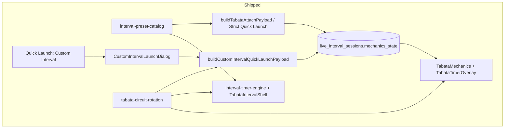
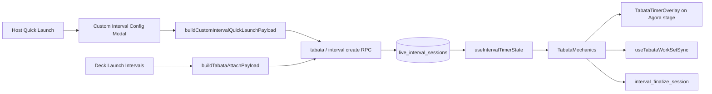
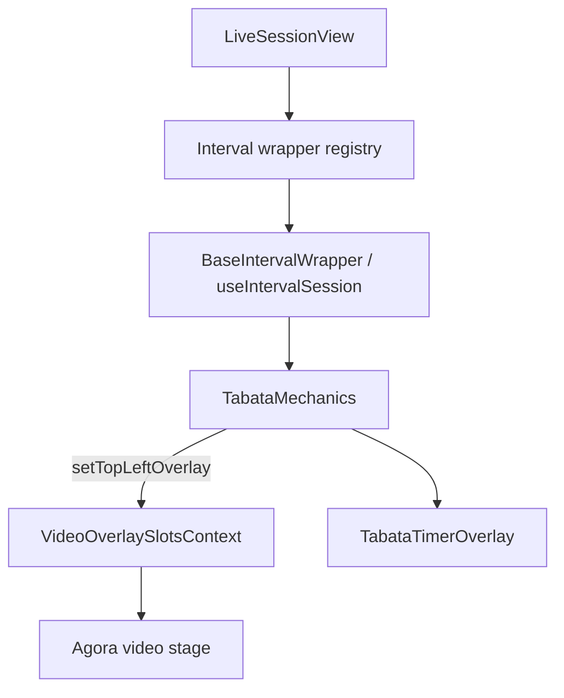

# Custom Interval Timer — Architectural Blueprint

**Status:** Phases 1–3 **shipped** (2026-07-15) — payload engine, host launch dialog, multi-station Quick Launch circuits  
**Charter:** Architecture for the **Custom Interval Timer** in live video sessions (historical record of the implemented design).  
**Product surface:** Live Agora huddle Quick Launch → host configures Work / Rest / Rounds (and optional circuit stations) → same work/rest engine and video HUD as named presets.

---

## Related docs

| Doc                                                                                                                | Role                                                                                 |
| ------------------------------------------------------------------------------------------------------------------ | ------------------------------------------------------------------------------------ |
| [unified-interval-engine.md](./unified-interval-engine.md)                                                         | Polymorphic live persistence (`live_interval_sessions`), `mechanics_state`, finalize |
| [interval-ratio-presets-design.md](./interval-ratio-presets-design.md)                                             | Preset catalog; `interval_preset: 'custom'`; authoring UX                            |
| [timers/live-video/tabata-dual-engine-boundary.md](./timers/live-video/tabata-dual-engine-boundary.md)             | Live vs offline FSMs — **do not merge**                                              |
| [timers/live-video/tabata-timer-overlay-assessment.md](./timers/live-video/tabata-timer-overlay-assessment.md)     | Overlay maturity (Batches A–I, L1–L3 shipped)                                        |
| [timers/live-video/live-interval-preset-overlay-plan.md](./timers/live-video/live-interval-preset-overlay-plan.md) | Preset-aware HUD labels                                                              |
| [multi-exercise-interval-circuit-plan.md](./multi-exercise-interval-circuit-plan.md)                               | Circuit rounds × stations (F1 + F2 shipped)                                          |
| [architecture/live-video-timers-audit.md](./architecture/live-video-timers-audit.md)                               | Older inventory of live timer surfaces                                               |

**Not this feature:** [workout-builder/custom-live-builder-architecture.md](./workout-builder/custom-live-builder-architecture.md) covers **inline exercise injection** into the live deck (“Add custom”), not the interval timer.

---

## 1. Overview & Objectives

### 1.1 What it is

The **Custom Interval Timer** is the host-facing path to start an arbitrary **work / rest / rounds** protocol in a live video session **without** requiring a pre-authored deck card or a named catalog preset (Classic HIIT, Power Sprints, etc.).

Internally it is **not a new engine**. It reuses:

- `block_format: 'tabata'` (engine family id)
- `interval_type: 'tabata'` on `live_interval_sessions`
- Live FSM: `tabata-mechanics-state.ts` + Postgres `mechanics_state`
- Overlay: `TabataTimerOverlay` (header label resolves to **Intervals** when `interval_preset === 'custom'`)
- Offline parity (when a card exists): `interval-timer-engine.ts` + `TabataIntervalShell`

User-facing vocabulary (Phase E contract):

| Term          | Meaning                                                      |
| ------------- | ------------------------------------------------------------ |
| **Intervals** | Umbrella / custom W/R label (`WORK_REST_BLOCK_FORMAT_LABEL`) |
| **Tabata**    | Strict Izumi 20/10 only                                      |
| Named presets | Classic HIIT, Fighters, …                                    |
| **Custom**    | Coach- or host-entered W/R that does not match a catalog row |

### 1.2 Role in live video sessions

During a huddle, the host needs to:

1. Optionally skip deck authoring for a quick finisher or improvised protocol.
2. Enter **Work seconds**, **Rest seconds**, **Rounds** (circuit passes), optionally exercise list / station count.
3. Attach a `live_interval_sessions` row and drive the **top-left Agora HUD** for all participants.
4. Pause / resume / reset / finalize on the same rails as Strict Tabata and deck-launched intervals.

Athletes never configure the timer; they see the overlay, logger highlight, and (when applicable) auto work-set sync.

### 1.3 Goals

1. **Quick Launch modal** — `CustomIntervalLaunchDialog` (Work / Rest / Rounds + optional stations).
2. **Reuse** attach → mechanics → overlay → finalize without forking FSMs.
3. Keep **dual-engine boundary**: live Postgres authority vs offline local reducer.
4. Align labels with `resolveIntervalPresetLabel` / `interval_preset: 'custom'`.
5. Support multi-station circuits via existing `tabata-circuit-rotation` helpers when exercise count &gt; 1.

### 1.4 Non-goals

- New Postgres `interval_type` (`'custom'`, `'hiit'`, etc.).
- Merging live and offline timer FSMs.
- Participant-facing mid-session W/R editor.
- Replacing outline authoring (`TabataFormatParamsEditor`) — that path already supports custom W/R.
- Sub-second Realtime tick broadcast (platform item G1; optional later).

---

## 2. Current State vs. Target Architecture

### 2.1 Current state (shipped architecture)



| Layer                            | Status      | Evidence                                                                                             |
| -------------------------------- | ----------- | ---------------------------------------------------------------------------------------------------- |
| Pure W/R engine (offline)        | **Shipped** | `interval-timer-engine.ts`, `use-interval-timer-engine.ts` (rAF)                                     |
| Live segmented FSM               | **Shipped** | `tabata-mechanics-state.ts`, host auto-advance, pause freeze                                         |
| Live tick / derive               | **Shipped** | `useIntervalTimerState` — `postgres_changes` + `setInterval(250ms)` from `segment_started_at`        |
| Video HUD overlay                | **Shipped** | `TabataTimerOverlay` via `VideoOverlaySlotsContext` / `setTopLeftOverlay`                            |
| Preset / custom labeling         | **Shipped** | `resolveTabataOverlayHeader` → `resolveIntervalPresetLabel`                                          |
| Circuit rotation math            | **Shipped** | `resolveTabataWorkSegmentTotal`, `deriveTabataActiveExerciseIndex`                                   |
| Deck attach                      | **Shipped** | `buildTabataAttachPayload` from active deck snapshot                                                 |
| Strict Tabata Quick Launch       | **Shipped** | `buildStrictTabataQuickLaunchPayload` (20/10 × 8)                                                    |
| **Custom Interval Quick Launch** | **Shipped** | `CustomIntervalLaunchDialog` → `buildCustomIntervalQuickLaunchPayload` → `tabata_create_for_session` |
| Authoring custom W/R (outline)   | **Shipped** | `TabataFormatParamsEditor` → `interval_preset: 'custom'`                                             |

### 2.2 Target architecture



**Invariant:** Custom Interval produces the **same** `TabataAttachPayload` shape as deck/strict launch (`block_snapshot` + `mechanics_state`). Only the **source of `format_params`** differs (modal fields vs card vs preset apply).

### 2.3 Follow-ups (Phase 4 backlog)

| Item                              | Notes                              |
| --------------------------------- | ---------------------------------- |
| Configurable live `setup_seconds` | Still default 10s live / 0 offline |
| Quick Launch last-used prefs      | localStorage key documented in §6  |
| Station dictionary typeahead      | Modal stations remain free-text    |

---

## 3. State Management Model

### 3.1 Terminology map (Work, Rest, Sets, Cycles)

Product language often says “sets” and “cycles.” Persist and compute with the existing contract:

| Product term                                | Stored / computed                                       | Notes                                               |
| ------------------------------------------- | ------------------------------------------------------- | --------------------------------------------------- |
| **Work**                                    | `work_seconds` / live `work_seconds` / offline `workMs` | Active effort segment                               |
| **Rest**                                    | `rest_seconds` / `restMs`                               | Between work segments (0 allowed)                   |
| **Rounds** (circuit)                        | `format_params.rounds` → `circuitRounds`                | Full passes through the exercise list               |
| **Work segments** (“sets” in casual speech) | `total_rounds` / `totalRounds`                          | `circuitRounds × max(1, exerciseCount)` when N&gt;1 |
| **Cycle**                                   | Prefer **circuit round** or **work segment** in UI copy | Avoid a third persisted field named `cycles`        |
| **Prepare / Get Ready**                     | Live `setup` segment (`setup_seconds`, default 10)      | Offline `prepareMs` usually 0                       |
| **Active station**                          | Derived: `(round_index - 1) % exerciseCount`            | Not required as durable JSON for v1                 |

### 3.2 Config shape

```typescript
// Conceptual — mirrors TabataFormatParams + attach payload
type CustomIntervalConfig = {
  work_seconds: number; // > 0
  rest_seconds: number; // >= 0
  rounds: number; // circuit rounds, > 0
  interval_preset: 'custom'; // always for this launcher
  // optional v1.1:
  // exercise_names?: string[]; // stations for circuit rotation
  // setup_seconds?: number;    // live GET READY override
};
```

Bounds: reuse `INTERVAL_PRESET_ROUND_BOUNDS.custom` (rounds 1–20) and sensible caps for work/rest (recommend work ≤ 600s, rest ≤ 300s — product confirm).

### 3.3 Live authoritative state (Postgres)

Durable truth lives on `live_interval_sessions`:

| Concern          | Mechanism                                          |
| ---------------- | -------------------------------------------------- |
| Coarse lifecycle | `timer_phase`: `idle \| setup \| work \| finished` |
| Clock anchor     | `work_started_at`, `duration_seconds`              |
| Segment position | `mechanics_state` JSONB                            |

Tabata / Custom `mechanics_state` (already implemented):

```json
{
  "segment": "work",
  "round_index": 3,
  "total_rounds": 8,
  "work_seconds": 45,
  "rest_seconds": 15,
  "setup_seconds": 10,
  "segment_started_at": "2026-07-15T18:30:12.000Z",
  "is_paused": false
}
```

**Who advances:** Host auto-advance (~200 ms poll in `TabataMechanics`) → `interval_advance_segment` (or equivalent) on segment boundaries. Participants are read-only on mechanics.

**Countdown derivation:** Clients do **not** trust a tick broadcast as truth. They derive remaining time from `segment_started_at` + frozen W/R/setup (+ pause fields). Local `setInterval(250ms)` only triggers re-render.

### 3.4 Offline / Active Session state (local)

| Piece                      | Role                                                                          |
| -------------------------- | ----------------------------------------------------------------------------- |
| `IntervalTimerEngineState` | Pure reducer: phase, `roundIndex`, anchors, pause                             |
| `useIntervalTimerEngine`   | React: `useReducer` + **rAF** tick loop                                       |
| Active Session             | Optional XState wrapper over the same pure engines (`interval-block-reducer`) |

Phases: `idle → prepare → work ⇄ rest → done` (pause as `phase: 'paused'` offline). Live uses `setup/work/rest/done` + `is_paused` flag — see dual-engine boundary mapping.

### 3.5 What we deliberately do **not** use

- Writing Postgres on every animation frame
- A separate React Context store for segment position (engine + session row are enough)
- `setInterval` as the **authority** for phase transitions on live (authority is host RPC + timestamps)

---

## 4. Video Session Integration

### 4.1 Mount chain



- Overlay is **presentational**; it reads `IntervalSessionEngine` (assembled in `useIntervalSession` from `useIntervalTimerState` + participants).
- Geometry / z-index follow [live-video display contract](../live-video/display-contract.md) and [UI grammar](../design-system/ui-grammar.md) video-stage exceptions (translucent HUD over tiles).

### 4.2 Launch entry points

| Entry                               | Behavior                                                                                           |
| ----------------------------------- | -------------------------------------------------------------------------------------------------- |
| **▶ Launch {preset}**               | Deck card → `buildTabataAttachPayload`                                                             |
| **Quick Launch → Strict Tabata**    | Immediate attach 20/10 × 8                                                                         |
| **Quick Launch → Custom Interval…** | `CustomIntervalLaunchDialog` → `buildCustomIntervalQuickLaunchPayload` → same attach RPC as Strict |
| Warm-up / AMRAP / EMOM              | Separate paths (out of scope for this feature)                                                     |

### 4.3 Overlay contract for custom blocks

| Element                       | Source                                                  |
| ----------------------------- | ------------------------------------------------------- |
| Header                        | `resolveTabataOverlayHeader` → **Intervals** for custom |
| Phase                         | WORK / REST / GET READY / PAUSED / Finished             |
| Subtitle                      | Round line + optional active exercise name (circuit)    |
| Progress / audio / host pause | Existing Batch D / I controls                           |

No new overlay component is required for v1.

### 4.4 Logging & finalize

- Work-segment entry → `useTabataWorkSetSync` upserts `workout_exercise_logs` for the **active** exercise (circuit-aware).
- Host Lock & Save → `interval_finalize_session` with Tabata `effective_rounds` derivation (unchanged).

---

## 5. Implementation Phases

### Phase 0 — Blueprint lock (complete)

- Locked: Custom Interval = Tabata engine + `interval_preset: 'custom'` + Quick Launch modal.
- Locked: dual-engine boundary remains.
- Open questions in §6 resolved for Phases 1–3.

### Phase 1 — State / payload engine (pure, testable)

| Task                                            | Notes                                                                                                             |
| ----------------------------------------------- | ----------------------------------------------------------------------------------------------------------------- |
| `buildCustomIntervalQuickLaunchPayload(config)` | Parallel to `buildStrictTabataQuickLaunchPayload`; sets `interval_preset: 'custom'`, title e.g. `Custom Interval` |
| Validation helper                               | Positive work, non-negative rest, rounds in bounds; optional exercise list                                        |
| Duration preview                                | Reuse `computeTabataBlockDurationFromParams` (+ live setup note)                                                  |
| Unit tests                                      | Payload shape, mechanics `total_rounds`, label resolves to Intervals                                              |

**Exit:** Pure functions green in Vitest; no UI yet (or behind a storybook-only harness if desired).

### Phase 2 — UI overlay path (host modal + wire-up) — **shipped**

| Task                                   | Notes                                                                                       |
| -------------------------------------- | ------------------------------------------------------------------------------------------- |
| `CustomIntervalLaunchDialog`           | Radix Dialog: Work / Rest / Rounds only (**no** ratio chips / preset picker)                |
| Wire `handleQuickLaunchCustomInterval` | Opens dialog → `buildCustomIntervalQuickLaunchPayload` → `tabata_create_for_session`        |
| Reuse outline patterns                 | Label/Input/preview grammar from `TabataFormatParamsEditor` — editor itself **not** mounted |
| Accessibility                          | Focus trap + Escape (Radix); inputs/Launch disabled while attach in flight                  |
| Overlay QA                             | HUD header **Intervals** via Phase 1 `interval_preset: 'custom'`                            |

**Exit:** Host can Quick Launch a 45/15 × 6 (example) and all clients see the overlay.

### Phase 3 — Video sync polish & circuit UX — **shipped**

| Task                           | Notes                                                                                    |
| ------------------------------ | ---------------------------------------------------------------------------------------- |
| Optional station list in modal | Textarea → `station_names` → `block_snapshot.exercises[]`; blank → Movement              |
| Payload fix                    | `totalRounds = resolveTabataWorkSegmentTotal(rounds, exerciseCount)` (was bare `rounds`) |
| Doc sync                       | Multi-exercise F2 marked shipped; fitness README index updated                           |
| Late-join / pause              | Same Postgres Tabata path; no FSM changes (manual QA below)                              |
| G1 broadcast ticks             | Out of scope                                                                             |

**Manual QA checklist**

1. Quick Launch custom 30/30 × 3 with 4 station names → HUD `Round 1 of 12 · …`
2. Advance past rest → next station name rotates
3. Host pause → countdown frozen for host + participant
4. Second browser joins mid-block → same remaining time / round / station (~250ms)
5. Empty stations → single Movement, `total_rounds === rounds`

**Exit:** Custom multi-station launch matches deck-launched Classic HIIT circuit behavior; docs consistent with code.

### Phase 4 — Optional follow-ups (backlog)

- Authorable `setup_seconds` in `format_params` (live/offline parity).
- Persist Quick Launch history / last-used custom params in local storage (key: `buddybubble.live-video.custom-interval-last`; pattern: [`timer-audio-preference.ts`](../../src/lib/timer/timer-audio-preference.ts)).
- Telemetry: `interval_preset: 'custom'` on finalize `session_telemetry`.
- Active Session route: ensure custom-config blocks resolve identically offline.

---

## 6. Open questions — locked (Phase 1)

| Question                        | Decision                                                                                                                                                                                                           |
| ------------------------------- | ------------------------------------------------------------------------------------------------------------------------------------------------------------------------------------------------------------------ |
| **Default values in the modal** | Seed Classic HIIT **30/30 × 8** via `DEFAULT_CUSTOM_INTERVAL_CONFIG` (Phase 2 modal). Builder requires an explicit config.                                                                                         |
| **Exercise list**               | Default single `{ name: 'Movement', … }`. Phase 3: optional `station_names` from modal textarea (comma/newline); max 12 stations.                                                                                  |
| **Ratio chips in modal**        | **Skipped in Phase 2** — Work/Rest/Rounds seconds only (fastest ship).                                                                                                                                             |
| **Rest = 0**                    | **Allowed.** Live `computeNextTabataMechanicsState` and offline `advanceFromWork` skip rest. Phase 1 fixed duration preview + snapshot parse to preserve `rest_seconds: 0` (previously rejected by `positiveInt`). |
| **Mid-session edit**            | Out of scope — re-attach / reset only.                                                                                                                                                                             |

**Quick Launch history (Phase 4, no code yet):** Mirror [`timer-audio-preference.ts`](../../src/lib/timer/timer-audio-preference.ts) with localStorage key `buddybubble.live-video.custom-interval-last` storing `{ work_seconds, rest_seconds, rounds }`.

---

## 7. File index (touch points for later PRs)

| Concern                          | Path                                                                            |
| -------------------------------- | ------------------------------------------------------------------------------- |
| Quick Launch + attach wire-up    | `src/features/live-video/shells/huddle/SessionControlsActions.tsx`              |
| Custom Interval launch dialog    | `src/features/live-video/shells/huddle/CustomIntervalLaunchDialog.tsx`          |
| Custom config + stations parse   | `src/lib/workout-factory/interval-timer/custom-interval-config.ts`              |
| Circuit rotation math            | `src/lib/workout-factory/interval-timer/tabata-circuit-rotation.ts`             |
| Strict / custom / deck attach    | `src/features/live-video/wrappers/interval/utils/buildTabataAttachPayload.ts`   |
| Live FSM                         | `src/features/live-video/wrappers/interval/mechanics/tabata-mechanics-state.ts` |
| Overlay                          | `src/features/live-video/wrappers/interval/mechanics/TabataTimerOverlay.tsx`    |
| Overlay labels                   | `src/features/live-video/wrappers/interval/mechanics/tabata-overlay-display.ts` |
| Timer hook                       | `src/features/live-video/wrappers/interval/hooks/useIntervalTimerState.ts`      |
| Catalog / custom label           | `src/lib/workout-factory/interval-timer/interval-preset-catalog.ts`             |
| Offline engine                   | `src/lib/workout-factory/interval-timer/interval-timer-engine.ts`               |
| Offline shell                    | `src/components/fitness/interval-shells/TabataIntervalShell.tsx`                |
| Authoring editor (reuse helpers) | `src/components/fitness/TabataFormatParamsEditor.tsx`                           |
| Circuit math                     | `src/lib/workout-factory/interval-timer/tabata-circuit-rotation.ts`             |

---

## 8. Success criteria

- Host opens **Custom Interval…**, enters W/R/rounds, confirms, and a live interval session starts without a deck card.
- HUD shows **Intervals** (not Tabata) for non-20/10 custom params.
- Pause, resume, reset, finalize, late-join behave identically to Strict Tabata / deck Intervals.
- No new `interval_type` enum value; no FSM merge.
- Unit tests cover payload builder + validation; existing Tabata overlay suites remain green.

---

## 9. Audit trail (superseded gaps)

Initial discovery found extensive Tabata / preset / overlay docs and a shared Tabata runtime, but no host Quick Launch path for ad-hoc W/R. That gap is closed: `CustomIntervalLaunchDialog` + `buildCustomIntervalQuickLaunchPayload` + optional `station_names` now attach via `tabata_create_for_session` on the same rails as Strict Tabata / deck Intervals.
