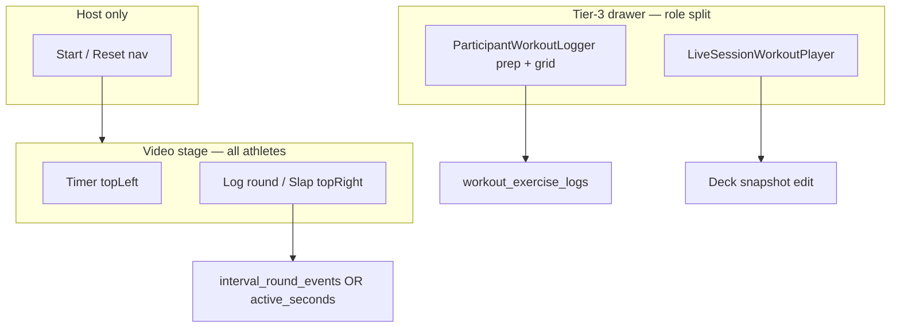

# EMOM Host / Trainer Logging — UX Parity with AMRAP

Status: **Implemented** (tier-3 athlete UX; see execution decision below).

## Execution decision (implemented)

- **Slap Target placement:** Tier-3 drawer for **both** host and participants. The DONE control is intentionally large; it does **not** use the AMRAP video top-right overlay pattern.
- **Host surface:** `EmomHostTier3AthleteSection` at the top of `LiveSessionWorkoutPlayer`; deck editor remains below.
- **Data:** `useEmomAthleteLogging` + `resolveEmomAthleteTaskId` enable `workout_exercise_logs` writes for hosts during `phase === 'emom'`.
- **Self pacing only:** `computeEmomSelfMinuteSplits` → `selfMinuteSplitEntries` / tier-3 chips / View Results modal. No EMOM gamified competitive rail.

Goal: Trainers and hosts who work out with the class get the same **DONE (Slap Target)** and **self** minute-split feedback as participants, without breaking the host-authoritative minute clock.

Related:

- [emom-implementation-plan.md](./emom-implementation-plan.md) — Phase 2 architecture (minute clock vs active period)
- [amrap-wrapper-readme.md](./amrap-wrapper-readme.md) — Slot rendering contract and host-athlete pattern
- [unified-interval-engine.md](./unified-interval-engine.md) — Shared interval tables and engine

---

## Problem statement

In a live class, the **trainer often performs the workout** alongside clients. A **host** may behave like a lead participant: they need to log work in real time, not only start the block and finalize results.

Today:

| Role               | Tier-3 drawer                            | Primary in-workout CTA        | `workout_exercise_logs.active_seconds` |
| ------------------ | ---------------------------------------- | ----------------------------- | -------------------------------------- |
| **Participant**    | `ParticipantWorkoutLogger`               | **DONE** via `EmomSlapTarget` | Written on slap                        |
| **Host / trainer** | `LiveSessionWorkoutPlayer` (deck editor) | **None**                      | Not written (logger disabled for host) |

Participants see DONE; the host does not. That contradicts AMRAP, where **Log round** lives on the **video overlay** for anyone with `engine.selfParticipant`, including the host.

---

## How AMRAP solves “host as athlete”

AMRAP splits **three concerns** across surfaces. EMOM should mirror this split.

### 1. Primary athlete action → video overlay (all roster members)

`AmrapMechanics` registers overlays via huddle slot contexts—not via tier-3:

| Slot                         | Component              | Who sees it                            |
| ---------------------------- | ---------------------- | -------------------------------------- |
| `VideoOverlaySlots.topLeft`  | `AmrapTimerOverlay`    | Everyone                               |
| `VideoOverlaySlots.topRight` | `AmrapLogRoundOverlay` | Everyone with `engine.selfParticipant` |
| `HostNavActions`             | `AmrapHostActions`     | Host only (start / reset)              |

`AmrapLogRoundOverlay` is **not** gated on `!isHost`. It only requires:

- `engine.selfParticipant` (host row upserted at attach via `amrap_create_for_session` / `emom_create_for_session`)
- `engine.timerPhase === 'work'`
- `engine.logRound` callable

Source: [`AmrapMechanics.tsx`](../../src/features/live-video/wrappers/interval/AmrapMechanics.tsx), [`AmrapLogRoundOverlay.tsx`](../../src/features/amrap/components/AmrapLogRoundOverlay.tsx).

### 2. Secondary prescription / load capture → tier-3 (participants only today)

`ParticipantWorkoutLogger` returns `null` when `isHost` and disables `useWorkoutLogs` with `enabled: !isHost`.

For AMRAP, participants get a **prep set grid** (weight / reps / RPE for set 1) in tier-3. The host gets **`LiveSessionWorkoutPlayer`** instead—deck editing, not logging.

`useAmrapSetDuplication` (in `AmrapMechanics`) auto-appends set rows when round count increases, but only when `enabled: !isHost`. Hosts who log rounds on the overlay still get round events; set duplication into `workout_exercise_logs` is participant-only unless they manually edit logs elsewhere.

### 3. Round durations / lap feedback → interval engine + rail

AMRAP lap UX is driven by **`interval_round_events`**, not tier-3:

- `useIntervalSession` builds `roundDurations`, `participantRoundLaps`, and `roundLapEntries` from round event timestamps vs `work_started_at`.
- `AmrapMechanics` re-renders the log overlay when `participantRoundLaps` / `roundLapEntries` change.
- Gamified rail (`useGamifiedRailModel`, phase `'amrap'`) shows lap chips per participant from `engine.participantRoundLaps`.
- Finalize merges round-indexed sets from `workout_exercise_logs` (see AMRAP readme).

Host and participant share the **same engine fields** for lap display; only **where** they edit prescription differs (overlay vs tier-3).



---

## How EMOM works today (Phase 2)

### Host-authoritative minute clock (correct, keep as-is)

- `live_interval_sessions.mechanics_state` — `minute_index`, `segment`, `segment_started_at`
- Host auto-advance via `interval_advance_segment` in `EmomMechanics`
- `EmomTimerOverlay` on **topLeft** only

### Active period capture (participant-only UI — gap)

- `EmomSlapTarget` mounted **only** inside `ParticipantWorkoutLogger` when `phase === 'emom'`
- Host never mounts `ParticipantWorkoutLogger` (`LiveSessionView` routes host → `LiveSessionWorkoutPlayer`)
- `useWorkoutLogs` disabled for host → no `active_seconds` rows for host slap even if UI existed

Source: [`ParticipantWorkoutLogger.tsx`](../../src/features/live-video/shells/ParticipantWorkoutLogger.tsx), [`EmomSlapTarget.tsx`](../../src/features/live-video/shells/EmomSlapTarget.tsx), [`LiveSessionView.tsx`](../../src/features/live-video/shells/huddle/LiveSessionView.tsx).

### Engine / results mismatch for “round durations”

| Concept                  | AMRAP                                          | EMOM today                                                                 |
| ------------------------ | ---------------------------------------------- | -------------------------------------------------------------------------- |
| Per-athlete timed events | `interval_log_round` → `interval_round_events` | **Not used** (`logRound` null when `intervalType === 'emom'`)              |
| Per-minute active time   | N/A (lap = round log)                          | `workout_exercise_logs.active_seconds` on slap                             |
| `engine.roundDurations`  | From round events                              | Always `[]` for EMOM                                                       |
| `engine.roundLapEntries` | Lap chips on video / rail                      | Always `[]` for EMOM                                                       |
| Gamified rail            | Active in `'amrap'` phase                      | Classic rail only (no `'emom'` branch)                                     |
| Finalize telemetry       | Round counts                                   | `active_seconds_total` / `active_seconds_avg` in `session_telemetry` (SQL) |

The Phase 2 plan correctly separated **session minute clock (host)** from **active period (athlete)**, but implementation placed the athlete UI exclusively in the participant tier-3 shell. That is inconsistent with AMRAP’s overlay-first athlete pattern.

---

## Adaptation principles

1. **Primary DONE action belongs on the video overlay**, registered from `EmomMechanics` (same slot as AMRAP log round: `setTopRightOverlay`).
2. **Do not move host tier-3 to `ParticipantWorkoutLogger` by default**—hosts still need deck editing during class. Optional follow-up: host prep grid or inline load edit (see tier-3 section).
3. **Reuse `EmomSlapTarget` behavior** (chime, vibrate, `useEmomActiveMinute`, set mapping, local Work → Rest)—extract or wrap for overlay placement; avoid duplicating capture math.
4. **Do not repurpose `interval_round_events` for EMOM minute splits** unless product explicitly wants server-backed lap events; EMOM’s source of truth for active time is already `active_seconds` per set.
5. **Extend engine / recap UI** with EMOM-specific “minute split” projections derived from logs (or a thin local buffer), analogous to `roundLapEntries` shape for display only.

---

## Proposed UX alignment

### A. Video overlay — `EmomSlapOverlay` (parity with `AmrapLogRoundOverlay`)

**Mount from:** `EmomMechanics` via `setTopRightOverlay`, alongside existing `EmomTimerOverlay` on topLeft.

**Visibility:**

- Show when `useEmomActiveMinute` reports `segment === 'minute'` (same as participant slap).
- Hide during `setup`, `idle`, `done`, and when session paused (match timer freeze rules in `useEmomBlockPauseSync`).

**Who sees it:**

- Any viewer with a resolvable **self interval participant** row (`live_interval_participants.user_id === auth user`), including host.
- Host is already upserted in `emom_create_for_session`; they do **not** need `amrap_join_session` (same as AMRAP host skip in `useIntervalParticipants`).

**Dependencies the overlay must receive** (today supplied by `ParticipantWorkoutLogger`):

| Input                       | Participant source today         | Host overlay source (proposed)                                                                                                     |
| --------------------------- | -------------------------------- | ---------------------------------------------------------------------------------------------------------------------------------- |
| `intervalSessionId`         | Wrapper config                   | `EmomMechanics` context                                                                                                            |
| Block / alternating params  | Session VM from active deck task | Host: `state.activeDeckItemId` + `useLiveSessionDeck` (same pattern as `AmrapMechanics` + `useAmrapSetDuplication`)                |
| `logSet` / `getExistingLog` | `useWorkoutLogs`                 | Shared hook instance in mechanics with **`enabled: Boolean(userId && taskId)`** — remove host exclusion for EMOM overlay path only |
| Exercise flat list          | Logger helpers                   | Reuse same VM flatten helpers or pass from a small `useEmomAthleteLogging` hook                                                    |

**UI parity with participant tier-3:**

- Large **DONE** during work minute; **Rest** chip after slap until next `minute_index`.
- Same haptic / audio feedback (`playSlapChime`, `vibrateSlapTarget`).
- Consider compact overlay styling (AMRAP log button is top-right on video, not full drawer width).

**Optional:** Keep a **duplicate** slap in participant tier-3 for thumb reach on mobile, or remove tier-3 slap once overlay is universal (product call; AMRAP does not duplicate log round in tier-3).

### B. Workout log writes for host

**Problem:** `useWorkoutLogs` uses `enabled: !isHost` globally in `ParticipantWorkoutLogger`.

**Proposed pattern (mirror AMRAP split):**

- **`useEmomAthleteLogging`** (or extend `EmomMechanics` inline): call `useWorkoutLogs` with host allowed when:
  - `phase === 'emom'`
  - `activeTask` resolved from host’s `activeDeckItemId` (identical to `AmrapMechanics` deck row lookup)
  - `sessionId`, `userId`, `taskId` present

**Task ID alignment:**

- Participants: `state.activeDeckItemId` (broadcast from host).
- Host: `activeSnapshotId` / `activeDeckItemId` from runtime—must match the card the host is working from so finalize merge scopes correctly.

**No automatic set duplication for EMOM:** Unlike AMRAP rounds, EMOM sets are **minute-indexed**, not round-count-indexed. Slap creates/updates the row for that minute’s set mapping (`resolveEmomLocalHighlightSetIndex`). Host prep loads still need explicit tier-3 entry or pre-filled prescription from deck (see C).

### C. Tier-3 drawer — intentional role split (unchanged default)

| Role        | Keep                              | Optional enhancement                                                                                                                                                                   |
| ----------- | --------------------------------- | -------------------------------------------------------------------------------------------------------------------------------------------------------------------------------------- |
| Host        | `LiveSessionWorkoutPlayer`        | Add collapsible **“Log my work”** section with weight/reps/RPE grid (same as participant non-AMRAP grid), **or** AMRAP-style EMOM prep blurb if product wants load locked before block |
| Participant | `ParticipantWorkoutLogger` + grid | Slap can move to overlay only                                                                                                                                                          |

**Recommendation:** Do **not** swap host tier-3 to full `ParticipantWorkoutLogger`—that removes deck editing mid-class. Overlay handles DONE; tier-3 grid remains optional for host load/RPE edits.

### D. Round duration / minute-split UX (EMOM analogue of AMRAP laps)

AMRAP shows **lap times** from `interval_round_events`. EMOM should show **active seconds per minute** from a different source.

#### Display model (proposed engine extension)

Add read-only engine projections (names illustrative):

```ts
type EmomMinuteSplitEntry = {
  minuteIndex: number; // 1..N
  activeSeconds: number | null;
  durationLabel: string; // e.g. "0:42"
};

type EmomParticipantMinuteSplits = {
  participantId: string;
  displayName: string;
  isSelf: boolean;
  entries: EmomMinuteSplitEntry[];
};
```

Expose on `IntervalSessionEngine`:

- `selfMinuteSplitEntries` (like `roundLapEntries`)
- `participantMinuteSplits` (like `participantRoundLaps`)

#### Data sources (pick one primary; both can coexist)

| Source                                                                                                                               | Pros                                         | Cons                                                                                      |
| ------------------------------------------------------------------------------------------------------------------------------------ | -------------------------------------------- | ----------------------------------------------------------------------------------------- |
| **Realtime subscribe** to caller’s `workout_exercise_logs` for session + task, map `set_number` → minute via inverse of slap mapping | Live rail updates for self; matches finalize | Requires consistent set_number semantics; alternating stations need same resolver as slap |
| **Optimistic local buffer** in overlay on DONE, merged with fetch                                                                    | Instant UI like AMRAP pending checkmark      | Must reconcile on refresh                                                                 |
| **`interval_round_events`**                                                                                                          | Reuses AMRAP pipeline                        | Wrong domain; duplicates `active_seconds`; extra RPC per minute                           |

**Recommendation:** Build splits from **`workout_exercise_logs.active_seconds`** for the current user (and optionally all participants if logs are readable under RLS for leaderboard). Do not wire EMOM to `interval_log_round`.

#### Where to surface splits (parity map)

| Surface               | AMRAP today                                      | EMOM proposed                                                                                             |
| --------------------- | ------------------------------------------------ | --------------------------------------------------------------------------------------------------------- |
| Self overlay          | Round count + log button                         | Minute label + DONE + optional last split chip                                                            |
| Video lap strip       | `AmrapRoundLapsOverlay` / rail bottom            | `EmomMinuteSplitsOverlay` when `selfMinuteSplitEntries.length > 0`                                        |
| Gamified rail         | `useGamifiedRailModel` when `phase === 'amrap'`  | Extend with `phase === 'emom'`: rank by **avg active_seconds** or **completed minutes**, show split chips |
| Chat drawer / results | Leaderboard + lap list in `AmrapResultsDrawer`   | Show per-participant avg active time from finalize snapshot + self minute list pre-finalize               |
| `ViewResultsModal`    | Accepts `roundDurations` (currently unused)      | For EMOM pass `selfMinuteSplitEntries` mapped to `number[]` or extend modal with labeled minutes          |
| Recap banner          | `AmrapRailRecapBanner` via `BaseIntervalWrapper` | Already handles EMOM complete label; add avg active seconds from `pageState` / telemetry                  |

#### Leaderboard semantics

AMRAP ranks by **round count** (then avg lap). EMOM Phase 2 finalize already computes **`active_seconds_avg`** per participant in SQL.

For live rail (optional v1): rank by number of minutes with non-null `active_seconds`, tie-break lower avg active time (faster work). Align copy with product: “EMOM splits” not “rounds.”

---

## Shell routing reference

Current tier-3 branch in [`LiveSessionView.tsx`](../../src/features/live-video/shells/huddle/LiveSessionView.tsx):

```
isHost ? LiveSessionWorkoutPlayer : ParticipantWorkoutLogger
```

Participant logger early exit:

```tsx
if (isHost) return null;
```

EMOM slap today:

```tsx
{isEmomPhase && intervalSessionId ? <EmomSlapTarget ... /> : null}
```

**Change locus for parity:** `EmomMechanics` + small shared logging hook—not `LiveSessionView` role swap.

---

## Comparison matrix (wrappers)

| Feature                      | AMRAP                   | Tabata         | EMOM (today)     | EMOM (target)            |
| ---------------------------- | ----------------------- | -------------- | ---------------- | ------------------------ |
| Host start/reset             | Nav actions             | Nav actions    | Nav actions      | Same                     |
| Timer overlay                | topLeft                 | topLeft        | topLeft          | Same                     |
| Athlete primary CTA          | topRight log round      | None           | tier-3 DONE only | **topRight DONE**        |
| Host can athlete-log         | Yes (overlay)           | N/A            | No               | **Yes (overlay)**        |
| Timed event table            | `interval_round_events` | Mechanics only | —                | —                        |
| Per-athlete duration storage | Lap derived from events | —              | `active_seconds` | Same                     |
| Engine lap/split fields      | `roundLapEntries`       | —              | Empty            | **`minuteSplitEntries`** |
| Gamified rail                | Yes                     | No             | No               | **Yes (optional)**       |
| Participant tier-3 prep      | AMRAP prep grid         | Full grid      | Slap + grid      | Slap overlay + grid      |

---

## Implementation checklist (when coding)

Ordered for minimal risk:

1. **`useEmomAthleteLogging`** — deck task resolution + `useWorkoutLogs` without host gate; used only from EMOM mechanics path.
2. **`EmomSlapOverlay`** — thin wrapper around existing `EmomSlapTarget` props, styled for top-right video slot.
3. **`EmomMechanics`** — `setTopRightOverlay` effect (mirror `AmrapMechanics` dependency array: minute index, segment, log pending state).
4. **Engine projections** — subscribe/fetch logs → `selfMinuteSplitEntries`; optional `participantMinuteSplits` for rail.
5. **Rail / recap** — extend `useGamifiedRailModel` for `'emom'` phase; wire `ViewResultsModal` / drawer copy.
6. **Tests** — host overlay renders when `selfParticipant` present; slap writes `active_seconds` with host role; split entries update after log insert.
7. **Docs** — update [emom-implementation-plan.md](./emom-implementation-plan.md) § Slap Target to say “overlay (all athletes)” not “participant logger only.”

### Non-goals (unless product asks)

- Replacing host tier-3 with participant logger
- EMOM `interval_log_round` / round event lap pipeline
- Changing host-authoritative `mechanics_state` or auto-advance ownership

---

## QA scenarios (host-as-athlete)

1. Host attaches EMOM, selects same deck card participants use, starts timer → **DONE** visible top-right on host video; participants still have DONE (overlay and/or tier-3).
2. Host slaps minute 1 → `workout_exercise_logs.active_seconds` on host user; Rest UI until minute 2.
3. Host with alternating stations → slap writes correct `set_number` per station mapping.
4. Participant splits visible on rail; host self splits visible after own slaps.
5. Finalize → host receives completed workout log task with merged `active_seconds` in metadata (same as participants).
6. Host never joins via `amrap_join_session` → still has `selfParticipant` from create RPC; overlay not blank.
7. Session pause → DONE disabled / hidden consistent with timer freeze.
8. Mobile: overlay tap target sufficient; tier-3 drawer not required to complete block.

---

## Summary

AMRAP treats **Log round** as a **video-overlay concern for every athlete**, including the host, while keeping **deck editing** and **prep logging** in separate surfaces. EMOM Phase 2 correctly stored active time in `workout_exercise_logs.active_seconds` but mounted **DONE only in the participant tier-3 logger**, which hosts never see.

**Adaptation:** Register EMOM slap on **`EmomMechanics` topRight overlay**, enable **`useWorkoutLogs` for host on the EMOM path**, and project **`active_seconds` into minute-split display fields** (rail, recap, results)—parallel to AMRAP’s `roundLapEntries`, without conflating EMOM minutes with `interval_round_events`.
