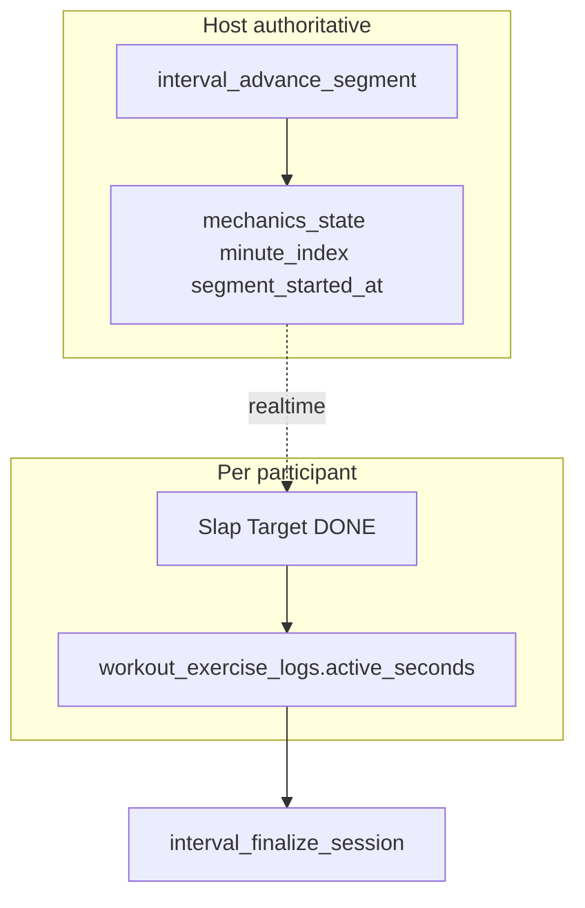

# EMOM Phase 2 — Live Interval Implementation

Status: **Implemented** (Phase 2 on unified interval engine).

Scope: Live-video EMOM blocks with alternating-station support, host-authoritative minute segmentation, per-participant **Slap Target** active-period capture, and finalize merge of `active_seconds` into workout logs and `session_telemetry`.

Related:

- [unified-interval-engine.md](./unified-interval-engine.md)
- Offline EMOM: `src/lib/workout-factory/interval-timer/emom-timer-engine.ts`, `EmomIntervalShell.tsx`
- Tabata reference: `src/features/live-video/wrappers/interval/mechanics/tabata-mechanics-state.ts`

---

## Architecture

**Two layers (must not be conflated):**

1. **Session minute clock (host)** — `live_interval_sessions.mechanics_state`; host auto-advances via `interval_advance_segment`.
2. **Active period (participant)** — Slap Target writes `workout_exercise_logs.active_seconds`; local Work → Rest UI only.

---

## State machine (`emom-mechanics-state.ts`)

| Field                                     | Notes                               |
| ----------------------------------------- | ----------------------------------- |
| `segment`                                 | `idle \| setup \| minute \| done`   |
| `minute_index`                            | 0 during setup; 1..N during minutes |
| `total_minutes`                           | From `resolveEmomTotalRounds`       |
| `interval_seconds`                        | Per-minute slot (default 60)        |
| `setup_seconds`                           | Live 10s pre-roll                   |
| `is_alternating` / `alternating_stations` | Optional                            |
| `segment_started_at`                      | Anchor for countdown                |
| `is_paused` / `elapsed_in_segment`        | Polymorphic pause                   |

Duration: `setup_seconds + total_minutes * interval_seconds`.

---

## Slap Target

- Component: `EmomSlapTarget.tsx` in **tier-3** for host and participants (not on the video overlay—the DONE control is too large for the stage).
- Host: `EmomHostTier3AthleteSection` atop `LiveSessionWorkoutPlayer`.
- Participant: `ParticipantWorkoutLogger` when `phase === 'emom'`.
- Logging: `useEmomAthleteLogging` (no `!isHost` gate during EMOM); host task from deck `activeSnapshot.task.id`.
- Self splits: `computeEmomSelfMinuteSplits` + `EmomSelfMinuteSplitsList` (private pacing only).
- Hook: `useEmomActiveMinute` — read-only subscription to session row.
- Capture: `activeSeconds = clamp(round((now - segment_started_at) / 1000), 0, interval_seconds)`.
- Set mapping: simple → `set_number = minute_index`; alternating → `resolveEmomLocalHighlightSetIndex + 1`.
- Feedback: `navigator.vibrate([50])`, `playSlapChime()`.
- Local rest: `restingForMinute` state until next `minute_index`.

---

## Schema

### `20260907120000_add_duration_to_workout_logs.sql`

Adds `workout_exercise_logs.active_seconds integer check (>= 0)`.

### `20260908120000_emom_phase2.sql`

- `emom_create_for_session`
- `interval_advance_segment` (type-branched validation)
- `interval_finalize_session` (EMOM rounds + `active_seconds` merge + telemetry aggregate)
- `live_sessions.interval_wrapper_kind` includes `'emom'`
- `amrap_reset_timer` EMOM branch

---

## Execution checklist

1. Migrations + `database.generated.ts`
2. `emom-mechanics-state.ts` + tests
3. `buildEmomAttachPayload.ts` + test
4. Engine hooks (`useIntervalTimerState`, `useIntervalSession`, `interval-engine` union)
5. `EmomMechanics` + overlay + host actions + pause sync
6. Slap Target + `useWorkoutLogs.active_seconds`
7. Merge TS (`merge-amrap-workout-log-exercises`, `SetLogEntry`)
8. Shell wiring (`types`, `WrapperAttachContext`, `LiveSessionView`, `SessionControlsActions`, `sessionStateMachine`, `isIntervalPhase`)
9. `tsc` + vitest

---

## Manual QA

1. Attach EMOM block from deck with EMOM format params.
2. Host Start → 10s setup → Minute 1 countdown.
3. Participant taps DONE → vibrate/chime, rest UI, `active_seconds` in DB.
4. Host pause/resume freezes minute countdown.
5. Finalize → per-set `active_seconds` in `set_logs`; `active_seconds_total` / `active_seconds_avg` in telemetry.
