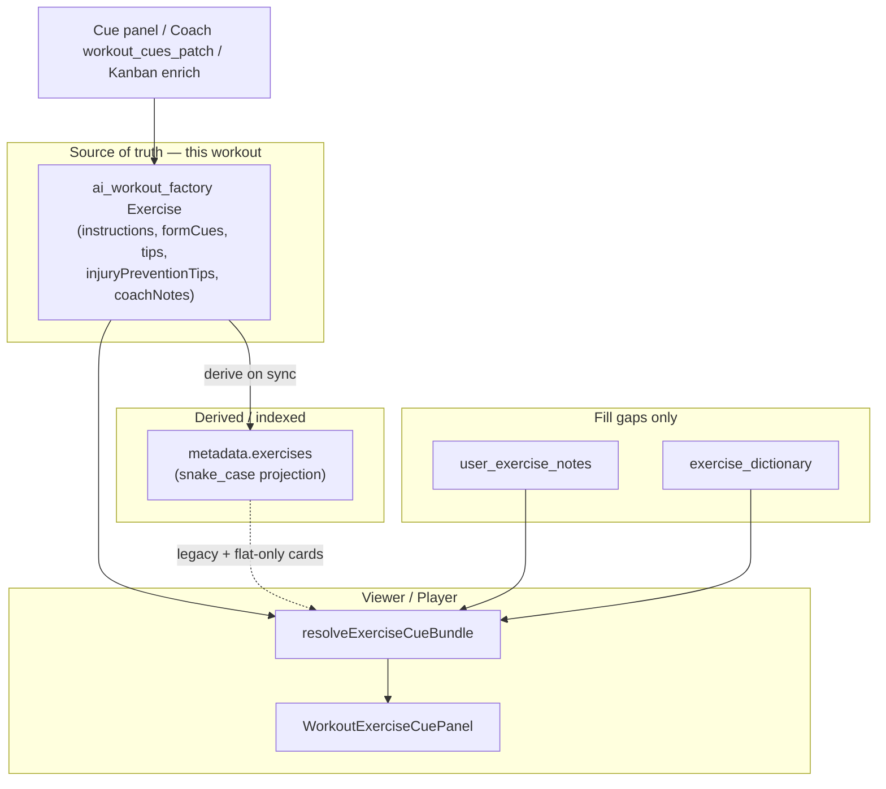

# Exercise cues unification blueprint (Phase M5+)

**Status:** Steps 1–5 implemented (precedence, Tips Phase A, dialog wiring, Coach race reconcile, Phase M5 schema unification). Tips Phase B/C remain open.  
**Date:** 2026-07-14  
**Prerequisite:** [workout-viewer-ai-coach-cues-gap-analysis.md](workout-viewer-ai-coach-cues-gap-analysis.md) · [exercise-cues-ux-architecture.md](exercise-cues-ux-architecture.md)  
**Authority:** Design authority for exercise cue architecture; §§2–3 describe the pre-M5 problem statement.

---

## 1. Purpose

Phases M1–M4 shipped the Workout Viewer cue accordion, workout- and user-scoped writes, and Coach **Ask Coach → `workout_cues_patch`**. Users still experience **UI ghosting** (cues persist in metadata but do not appear as expected) and **data fragility** (flat cache as sole rich SoT vs factory `coachNotes`-only tree).

This blueprint defines the **definitive target architecture** before further code:

| Pillar                      | Outcome                                                                               |
| --------------------------- | ------------------------------------------------------------------------------------- |
| **Schema unification (M5)** | Factory `Exercise` owns full cue prose; flat `metadata.exercises` is a **projection** |
| **Resolver precedence**     | Workout-scoped (this card) **strictly overrides** personal notes                      |
| **State & races**           | One persistence writer for Coach patches; UI updates without manual refresh           |
| **Tips UX**                 | Empty tips no longer look like a broken product surface                               |
| **Component wiring**        | Standalone `WorkoutViewerDialog` parity with TaskModal for Ask Coach                  |

---

## 2. Problem statement (live code)

### 2.1 Split-brain schema

| Surface                                                                                                                                                                      | Per-exercise cue fields today                                                             |
| ---------------------------------------------------------------------------------------------------------------------------------------------------------------------------- | ----------------------------------------------------------------------------------------- |
| Factory `Exercise` ([`workout-contract.ts`](../../src/lib/workout-factory/types/workout-contract.ts) / [`ai-program.ts`](../../src/lib/workout-factory/types/ai-program.ts)) | **`coachNotes` only**                                                                     |
| Flat `WorkoutExercise` (`tasks.metadata.exercises`)                                                                                                                          | `instructions`, `form_cues` / `form_cue`, `tips`, `injury_prevention_tips`, `coach_notes` |

Writes:

- `applyCuePatchesToMetadata` dual-writes **full fields → flat**, but factory only when the patch includes **`coach_notes`** (`applyCoachNotesToFactoryTree`).
- Structural Apply re-derives flat from the factory tree; cue survival depends on `preserveFlatCueFieldsOnDerive` — a **band-aid**, not a model.

**Effect:** The view model’s block exercises cannot carry the prose the Cue panel resolves from flat. Any derive path that forgets preserve, or any identity mismatch (id / name / `name::index`), drops or mis-attaches cues.

### 2.2 Ghosting via resolver order

[`resolveExerciseCueBundle`](../../src/lib/workout-factory/resolve-exercise-cue-bundle.ts) currently picks:

```
instructions / form_cues / tips / injury_prevention_tips:
  personal  >  flat  >  library

coach_notes:
  workout (factory coachNotes)  >  flat  >  library
```

So after Coach or “Save to this workout” writes flat successfully, **existing personal notes for the same dictionary exercise still win**. The panel shows “Your notes” with older text (or empty personal fields that still block display intent). Users perceive “saved but not showing” — classic ghosting.

Local drafts (`mergeCuePatchIntoBundle` with provenance `workout`) temporarily look correct until refresh/`useExerciseCueResolution` reloads and personal wins again.

### 2.3 Double apply for Coach patches

| Path       | What it does                                                                                                                            |
| ---------- | --------------------------------------------------------------------------------------------------------------------------------------- |
| **Server** | Coach strategy → `buildTaskMetadataDeltaForWorkoutCuePatch` → `agent_update_task_and_reply` (`p_new_metadata` + `p_workout_cues_patch`) |
| **Client** | `useAgentEffectSweep` → `onWorkoutCuesPatch` → TaskModal `handleWorkoutCuesPatch` → `applyCuePatchesToMetadata` on React `metadata`     |

Both are useful in isolation (DB durability vs immediate UI). Together they create:

- Redundant merges (usually idempotent, not free of races with in-flight `localCuePatches` / stale `cuePatchMetadataRef`).
- UI that still looks empty if React metadata updates but **resolver precedence** shadows flat, or if DB wrote and Realtime task reload **overwrote** optimistic client state with a pre-merge snapshot, then client sweep never re-ran.
- Ambiguity about which layer is source of truth after Ask Coach.

### 2.4 Tips emptiness

Kanban enrich maps `detailed_instructions` → `instructions`, `biomechanical_cues` → `form_cues`, injury tips → `injury_prevention_tips`. It **never** sets `tips`. Dictionary bridge follows the same DTO. The Cue panel still treats Tips as a peer editable section and Ask Coach often lists `tips` in `empty_fields`, so post-generation UIs look half-finished even when form cues are rich.

### 2.5 Dialog wiring hole

`WorkoutViewerContent` accepts `onAskCoachForCues` / `injuriesOnFile`. TaskModal passes them. **`WorkoutViewerDialog` does not forward them**, so any standalone host silently loses Ask Coach.

---

## 3. Target mental model



**Product rule:** “Save to this workout” and Coach Ask Coach mean **this card’s factory exercise wins**, regardless of the user’s global notes for that movement. Personal notes remain the cross-workout default when the card has no workout-scoped value for a field.

---

## 4. Schema unification (Phase M5)

### 4.1 Goal

Extend the rich factory **`Exercise`** so it is the **authoritative store** for per-exercise cue prose on parametric workouts. Flat `metadata.exercises` becomes a **projection** for:

- Flat-only / legacy cards (no `ai_workout_factory`)
- Consumers that still read snake_case lists (Kanban chips, older APIs, Coach slim context that already indexes flat)
- Stable `resolution_key` matching during transition

### 4.2 Field mapping (canonical)

| Factory `Exercise` (camelCase)  | Flat `WorkoutExercise` (snake_case) | Notes                                                        |
| ------------------------------- | ----------------------------------- | ------------------------------------------------------------ |
| `instructions?: string`         | `instructions`                      | Single string; arrays normalized at write boundaries         |
| `formCues?: string`             | `form_cues`                         | Prefer string; accept legacy `string[]` / `form_cue` on read |
| `tips?: string`                 | `tips`                              | Optional enrichment (see §7)                                 |
| `injuryPreventionTips?: string` | `injury_prevention_tips`            | Same                                                         |
| `coachNotes?: string`           | `coach_notes`                       | Existing; keep                                               |

Do **not** put block-level warm-up `instructions: string[]` on `Exercise`. Those remain session choreography on warm-up/finisher blocks.

### 4.3 Write path (shipped)

1. **All workout-scoped cue writers** (`applyCuePatchesToMetadata`, Edge `applyWorkoutCuePatchToTaskMetadata`, Kanban enrich / outline / proposed merge) write cue fields onto the matching factory `Exercise` by stable `id` (preferred) or resolution key.
2. **Then** project into `metadata.exercises` via `mapExercise` / `workoutInSetToTaskExercises` (`projectFactoryCuesOntoFlat`).
3. Structural Edit Apply copies cue fields through `viewExerciseToFactoryExercise` end-to-end. `preserveFlatCueFieldsOnDerive` is **removed** for rich cards; flat is a pure projection.

### 4.4 Read path (shipped)

For rich cards, `collectBlockExercises` passes `blockExercise`. `resolveExerciseCueBundle` reads all five cue fields **factory first** (provenance `workout`), then flat gap-fill, then personal, then library.

Flat rows remain:

- Fallback when factory fields are empty (lazy backfill / partial upgrade)
- Primary store for flat-only sessions (no factory tree)

### 4.5 Migration / backfill (shipped M5a–M5e)

| Step | Action                                                                          | Status |
| ---- | ------------------------------------------------------------------------------- | ------ |
| M5a  | Extend `Exercise`; dual-write factory + flat on every patch                     | Done   |
| M5b  | Factory → flat projection includes all five cue fields                          | Done   |
| M5c  | Lazy `backfillFactoryCuesFromFlat` on cue save / Coach merge / structural Apply | Done   |
| M5d  | Resolver prefers factory; flat only fills gaps                                  | Done   |
| M5e  | Remove `preserveFlatCueFieldsOnDerive`; document flat as projection             | Done   |

**Compatibility:** Older tasks with cues only on flat remain readable (flat gap-fill + lazy backfill). No DB migration of JSON shape is required beyond application-level backfill when tasks are saved/patched.

### 4.6 Out of scope for M5

- Changing `user_exercise_notes` or dictionary columns
- Publishing viewer-authored cues to the global library
- Renaming Coach `workout_cues_patch` snake_case wire format (keep wire ↔ map at boundaries)

---

## 5. Resolver precedence

### 5.1 Prescribed order (per field)

For `instructions`, `form_cues`, `tips`, `injury_prevention_tips`, and `coach_notes`:

```
1. Workout-scoped value on this card
      a. factory Exercise field (after M5)     → provenance: workout  ("This workout")
      b. else flat metadata.exercises field    → provenance: workout or flat
         (during transition, prefer labeling both as "This workout" / "This card"
          with flat only when factory lacks the field)
2. Personal notes (user_exercise_notes)        → provenance: personal
3. Library (exercise_dictionary)               → provenance: library
4. Empty
```

**Hard rule:** If a workout-scoped string is non-empty for a field, personal and library **must not** replace it — even if personal is “newer.” Cross-workout updates belong in “Save to my notes,” not by shadowing the card.

### 5.2 Why this fixes ghosting

Ask Coach and “Save to this workout” write workout-scoped data. With personal-first resolution, those writes are invisible whenever personal notes exist. Workout-first makes the Cue panel match user intent and provenance chips (“This workout” / “This card”).

### 5.3 Local drafts

`localCuePatches` / `mergeCuePatchIntoBundle` already stamp provenance `workout`. After commit, the same values must remain visible after `useExerciseCueResolution` reload — which only holds if §5.1 is implemented.

### 5.4 Empty-field Ask Coach

`computeEmptyCueFields` must treat a field as **filled** when workout-scoped (factory or flat) has content, **not** when only personal has content — otherwise Coach may refuse to generate card-specific cues the user asked for, or may overwrite personal-only display incorrectly. Align empty-field detection with the same precedence.

### 5.5 Provenance UX (optional cleanup)

After M5d, consider collapsing `flat` and `workout` chips to a single **“This workout”** label when both mean card-scoped data, keeping `flat` only for diagnostics or flat-only cards. Not required for the precedence fix.

---

## 6. State and race conditions (Coach patches)

**Step 3 status (2026-07-14):** Implemented via cue-aware richer-merge on silent `applyRow` ([`reconcile-workout-cue-metadata.ts`](../../src/lib/workout-factory/reconcile-workout-cue-metadata.ts)) plus a short-lived pending Coach cue marker and one guarded re-fetch when the first Realtime payload still lacks patched fields. Server remains the sole durable writer.

### 6.1 Principle

**Server persists; client optimistically mirrors; Realtime (or explicit reload) reconciles.** Never require a full page refresh. Never leave two writers disagreeing about who owns `tasks.metadata`.

### 6.2 Prescribed ownership

| Concern                                           | Owner                                                                                                                                                                             |
| ------------------------------------------------- | --------------------------------------------------------------------------------------------------------------------------------------------------------------------------------- |
| Durable write of cue fields into `tasks.metadata` | **Server only** — already via `buildTaskMetadataDeltaForWorkoutCuePatch` + `p_new_metadata` when a known task id exists                                                           |
| Reply observability                               | `p_workout_cues_patch` on message metadata (unchanged)                                                                                                                            |
| Immediate Cue panel update                        | **Client optimistic apply** of the same patch into TaskModal `metadata` / `workoutExercises` (existing `handleWorkoutViewerCuePatches`)                                           |
| Reconciliation                                    | When task row Realtime (or `loadTask`) delivers post-merge metadata, **replace** React metadata from server; do not re-apply the patch on top of an already-merged server payload |

### 6.3 Client effect sweep contract

`useAgentEffectSweep` / `onWorkoutCuesPatch` should be defined as:

1. **Optimistic UI** — apply patch once per `messageId` (keep existing dedupe in TaskModal + sweep refs).
2. **Not a second durable writer** — do not call a separate save API solely to persist cues the server already wrote.
3. **Idempotent with server** — applying the same fields twice is fine; applying then receiving Realtime with the same flat/factory content must not clear cues or thrash.
4. **Stale snapshot guard** — if Realtime arrives **without** the new cue fields (race: read replica / shallow merge), either:
   - prefer the richer of (local optimistic, incoming), for cue keys only, or
   - re-fetch task once when `workout_cues_patch` was just handled and incoming metadata lacks those fields.

### 6.4 Explicit non-goals

- Removing server merge (would make Ask Coach depend on the client being open).
- Removing client optimistic apply (would leave the panel empty until Realtime).
- Requiring footer Save for Coach-generated cues when the server already updated the task (footer Save remains for local micro-edits not yet flushed).

### 6.5 Manual micro-edit path (unchanged intent)

Cue panel “Save to this workout” → `onApplyCuePatches` → React metadata; DB persist via existing task save / autosave. No Coach sweep involved. After §5, display must reflect workout-scoped values immediately via optimistic metadata + resolver, without waiting for personal-layer reload tricks.

### 6.6 Acceptance criteria (races)

- Ask Coach one-shot → cues visible in the open viewer **without** closing the modal or hard refresh.
- Same exercise with prior personal notes → panel shows **new workout cues** with “This workout” / “This card,” not old personal text.
- Second device / reload → same cues from server metadata (factory after M5, flat during transition).
- Rapid double patch on two exercises → both stick (`cuePatchMetadataRef` chaining retained).

---

## 7. Tips field UX strategy

### 7.1 Product stance

**Tips are optional enrichment**, not a required peer of instructions/form cues for a “complete” cue set. The UI must not look broken when tips are absent after factory generation.

### 7.2 Prescribed strategy (phased)

**Phase A — Display (ship with precedence fix, no enrich change required)**

| Mode                        | Behavior                                                                                                                  |
| --------------------------- | ------------------------------------------------------------------------------------------------------------------------- |
| Read (collapsed / expanded) | Show Tips **only when** resolved `tips` is non-empty. Do not reserve empty Tips chrome that implies missing data.         |
| Authoring                   | Keep Tips textarea available (advanced / optional).                                                                       |
| Empty state copy            | Speak to “instructions & form cues”; mention tips only as optional (“Add tips”).                                          |
| Cues badge                  | “Filled” when any of instructions / form_cues / injury / coach_notes exist; **do not** require tips for the filled state. |

**Phase B — Ask Coach**

- Default `empty_fields` for Ask Coach: `instructions`, `form_cues`, and `injury_prevention_tips` when injuries are on file.
- Include `tips` in `empty_fields` only when the user explicitly asks for tips, or when a “Include tips” control is on — **not** by default solely because tips are blank after enrich.
- Prompts: when tips are requested, Coach may still fill them via `workout_cues_patch.tips`.

**Phase C — Producers (optional, later)**

- Kanban enrich / dictionary: either map a short “performance tip” / `commonMistakes` summary into `tips`, or leave tips unset forever and rely on Phase A–B.
- Do **not** invent low-quality tips just to fill a column.

### 7.3 What we will not do

- Hide the Tips field entirely from authoring (users and Coach still need it).
- Block M5 or precedence work on enrich pipeline changes.
- Treat empty tips as an error or incomplete-generation failure in QA.

---

## 8. Component wiring

### 8.1 Problem

[`WorkoutViewerDialog`](../../src/components/fitness/workout-viewer-dialog.tsx) destructures a subset of props and omits `onAskCoachForCues`, `injuriesOnFile`, and related cue chrome when rendering `WorkoutViewerContent`.

### 8.2 Prescription

Forward at least:

- `onAskCoachForCues`
- `injuriesOnFile`
- Any other cue-adjacent props already on `WorkoutViewerDialogProps` that Content uses (`onApplyCuePatches` is already forwarded)

Hosts that lack a Coach rail may pass `undefined` for `onAskCoachForCues`; the panel already hides Ask Coach when the callback is absent. TaskModal remains the primary wired host; standalone dialog must not silently drop the callback when provided.

### 8.3 Docs

Update [workout-viewer-dialog.md](workout-viewer-dialog.md) to list cue props and the Ask Coach dependency on a parent that can open the Coach rail / `sendCoachMessage`.

---

## 9. Implementation sequencing (when coding begins)

Recommended order — each step independently shippable and testable:

| Step  | Scope                                                                           | Status |
| ----- | ------------------------------------------------------------------------------- | ------ |
| **1** | Resolver precedence (§5) + empty-field alignment + Tips display Phase A (§7.2A) | Done   |
| **2** | `WorkoutViewerDialog` prop forwarding (§8)                                      | Done   |
| **3** | Coach patch client/server contract hardening (§6) — reconcile rules + tests     | Done   |
| **4** | M5a–M5b schema + dual-write + projection (§4)                                   | Done   |
| **5** | M5c–M5e backfill + resolver factory-first + retire preserve band-aid            | Done   |
| **6** | Tips Ask Coach Phase B; optional producer Phase C                               | Open   |

---

## 10. Test plan (blueprint-level)

| Area             | Cases                                                                                                               |
| ---------------- | ------------------------------------------------------------------------------------------------------------------- |
| Resolver         | Personal notes present + flat/factory workout cues → workout wins; only personal → personal; only library → library |
| Cue panel        | After patch commit, expanded panel shows new text without remount; provenance chip is workout/card                  |
| Ask Coach        | One-shot patch → optimistic UI + server metadata both contain fields; reload shows same                             |
| Structural Apply | Edit blocks → Apply → cue fields survive on factory and flat projection                                             |
| Tips             | Factory workout with form_cues only → no empty Tips section in read mode; badge still “filled”                      |
| Dialog           | Standalone dialog with mock `onAskCoachForCues` invokes callback                                                    |

Mirror Deno/TS agent helpers remain in sync (`pnpm check:agent-mirror` when Coach merge changes).

---

## 11. Success criteria

Ghosting is considered **closed** when:

1. Saving or generating workout-scoped cues for an exercise that already has personal notes **always** shows the workout-scoped text in the open viewer.
2. Ask Coach results appear without closing the task modal or hard-refreshing.
3. Structural Edit → Apply on a rich card does not strip cue fields (factory + projected flat).
4. Post-Kanban workouts do not present empty Tips as a defect.
5. Any host using `WorkoutViewerDialog` can pass Ask Coach through to the panel.

---

## 12. Related references

| Document / module                                                                            | Role                                                                  |
| -------------------------------------------------------------------------------------------- | --------------------------------------------------------------------- |
| [workout-viewer-ai-coach-cues-gap-analysis.md](workout-viewer-ai-coach-cues-gap-analysis.md) | Gap inventory (G1–G10) this blueprint resolves                        |
| [exercise-cues-ux-architecture.md](exercise-cues-ux-architecture.md)                         | Original M1–M5 design; update status after this blueprint is accepted |
| `resolve-exercise-cue-bundle.ts`                                                             | Precedence implementation site                                        |
| `apply-cue-patches-to-metadata.ts`                                                           | Client workout-scoped write                                           |
| `workout-cue-metadata-merge.ts`                                                              | Server workout-scoped write                                           |
| `useAgentEffectSweep.ts` / TaskModal `handleWorkoutCuesPatch`                                | Client optimistic path                                                |
| `sync-workout-metadata.ts`                                                                   | Derive / preserve / structural Apply                                  |

---

## 13. Summary

Unify cues by making **factory `Exercise` the card SoT**, projecting flat cache from it, and resolving **workout > personal > library** so personal notes cannot shadow Coach or card saves. Keep **server persistence + client optimistic apply** with clear reconciliation so Ask Coach never needs a manual refresh. Treat **tips as optional** in read/Ask-Coach defaults, and **forward Ask Coach props** from `WorkoutViewerDialog`. Implement in the order: precedence → wiring → race contract → M5 schema → tips producers.
