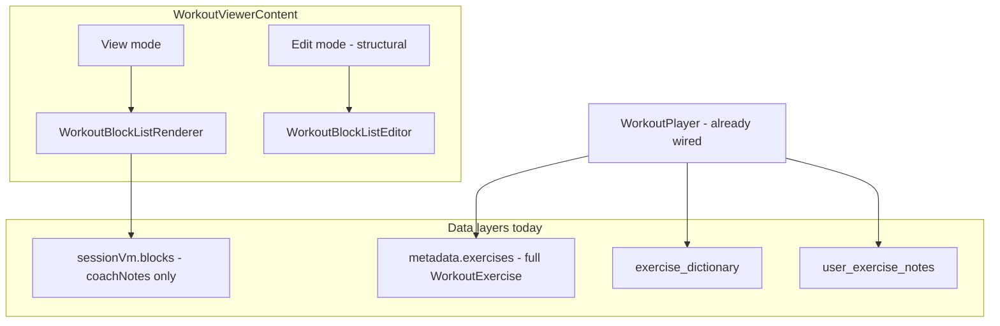
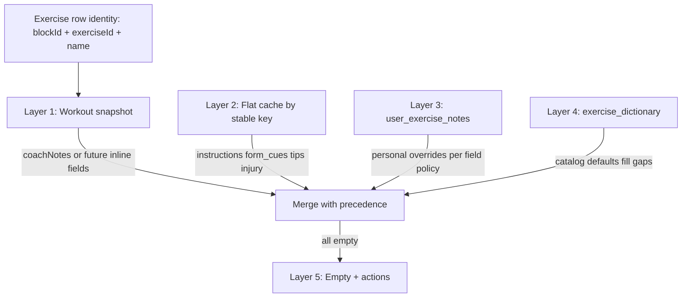
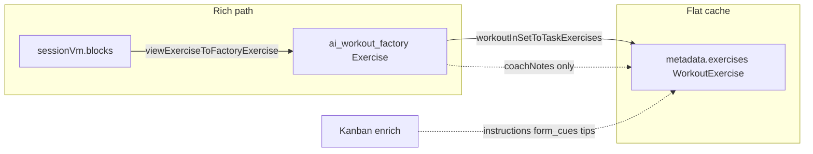
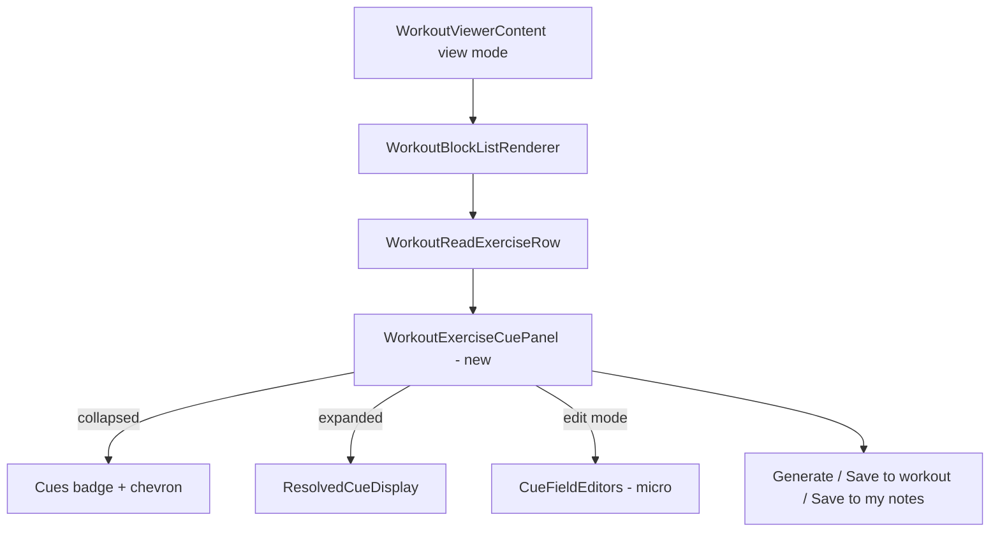

# Exercise instructions & form cues — Workout Viewer UX architecture

**Status:** Proposed  
**Context:** The Workout Viewer ships robust **structural editing** in Edit mode (Gap G2). End users preparing for a workout often need **instructions and form cues per exercise** without entering structural Edit mode. Data may live in the workout snapshot, flat metadata cache, personal notes, or the global exercise library — and may be missing entirely for custom movements.

**Parent:** [workout-viewer-dialog.md](workout-viewer-dialog.md) · [workout-block-editor-structural-editing-plan.md](workout-block-editor-structural-editing-plan.md) · [exercises/exercise-dictionary.md](exercises/exercise-dictionary.md) · [workout-player.md](workout-player.md)

**Source (today):** [WorkoutViewerContent](../../src/components/fitness/workout-viewer-dialog.tsx) · [WorkoutReadExerciseRow](../../src/components/fitness/workout-block-renderer/WorkoutReadExerciseRow.tsx) · [WorkoutPlayerExercisePanel](../../src/components/fitness/workout-block-renderer/WorkoutPlayerExercisePanel.tsx) · [useUserExerciseNotes](../../src/hooks/useUserExerciseNotes.ts)

---

## Problem statement

| Constraint                                                                         | Implication                                                                                                                                                 |
| ---------------------------------------------------------------------------------- | ----------------------------------------------------------------------------------------------------------------------------------------------------------- |
| Exercises may come from the central library, AI generation, or ad-hoc custom names | Resolution cannot assume a dictionary row exists                                                                                                            |
| Data hierarchy spans workout snapshot → library → empty                            | UI must merge layers with explicit precedence and provenance                                                                                                |
| Target persona is often an **end-user prepping**, not a coach restructuring        | Full Edit mode (blocks, DnD, split) is the wrong affordance for “show me form cues”                                                                         |
| Rich factory `Exercise` vs flat `WorkoutExercise` shapes differ                    | **Split-brain schema trap** — naive Apply/Save can drop cue fields (see [Critical constraint: split-brain schema](#critical-constraint-split-brain-schema)) |

---

## Current architecture (baseline)

`WorkoutViewerContent` is a **dual-mode shell** with a hard boundary:

| Mode     | Renderer                                              | Draft state                         | Commit path                                     |
| -------- | ----------------------------------------------------- | ----------------------------------- | ----------------------------------------------- |
| **View** | `WorkoutBlockListRenderer` → `WorkoutReadExerciseRow` | None (reads `sessionVm` from props) | Footer: Close / Save task                       |
| **Edit** | `WorkoutBlockListEditor` / `WorkoutExercisesEditor`   | `localBlocks` / `localExercises`    | Apply → `onApply` → `applyBlockEditsToMetadata` |

View mode today shows **name, prescription line, and `coachNotes` only** (line-clamped). It does **not** load dictionary rows, personal notes, or richer flat-cache fields (`instructions`, `form_cues`, `tips`, `injury_prevention_tips`).

**Existing precedent:** `WorkoutPlayer` + `WorkoutPlayerExercisePanel` already resolve a **four-field cue bundle** (catalog + personal). `useUserExerciseNotes` wires dictionary lookup → `user_exercise_notes`. The viewer should reuse that mental model, not reinvent it.



---

## Design principles

1. **Viewer-first, progressive disclosure** — prep persona sees the plan; cues are opt-in per exercise, not a mode switch.
2. **Separate “content” from “structure”** — adding form cues must not surface DnD, split, or block CRUD.
3. **Reuse resolution order** — same hierarchy as Player: workout snapshot → flat cache → personal → catalog → empty.
4. **Anchor when possible** — dictionary id unlocks `user_exercise_notes` and Coach `personal_cues_patch`; unanchored names get a workout-scoped fallback.
5. **Explicit save semantics** — distinguish **workout-scoped** vs **user-scoped** vs optional library contribution.

---

## UX workflow (viewer-first micro-edit)

### Primary interaction: expandable exercise detail (not Edit mode)

| Viewport         | Pattern                                                     |
| ---------------- | ----------------------------------------------------------- |
| Desktop / tablet | Accordion on the exercise row                               |
| Mobile           | Same accordion, or bottom sheet if content exceeds ~6 lines |

**Row chrome (view mode, unchanged at rest):**

- Exercise name + prescription (as today)
- **New:** trailing affordance — `ChevronDown` or pill **“Cues”** with state badge:
  - filled = content available
  - `+` = empty / missing
  - `~` = partial (e.g. catalog only, no personal)

**Expanded panel sections** (mirror `WorkoutPlayerExercisePanel` “detailed” layout):

| Section      | Typical sources           |
| ------------ | ------------------------- |
| Instructions | Workout / Library / Yours |
| Form cues    | …                         |
| Tips         | …                         |
| Injury notes | …                         |

**Provenance chips** (`This workout`, `Your notes`, `Library`) reduce confusion when layers disagree.

**Rejected patterns:**

| Pattern        | Why not                                                  |
| -------------- | -------------------------------------------------------- |
| Modal-only     | Breaks scan flow when comparing two exercises in a block |
| Tooltip        | Cues are multi-paragraph; wrong for authoring            |
| Full Edit mode | Implies structural authority (add block, reorder, split) |

### Lightweight authoring without Edit mode

Inside the expanded panel, when a section is empty or the user taps **Edit**:

- Inline textarea(s) per field (not the full `WorkoutBlockExerciseEditRow` grid)
- Footer actions:
  - **Save to this workout** (primary for one-off / custom names) — [workout-scoped persistence](#a-workout-scoped-this-workout-only)
  - **Save to my notes** (secondary; requires dictionary anchor) — [user-scoped persistence](#b-user-scoped-my-notes-cross-workout)
  - **Cancel** (discard panel draft only)

No title/description/block editors. No drag handles.

### Empty state copy

> No form cues yet for **Bulgarian split squat**.  
> [Generate with Coach] · [Add your own] · [Use library template]

If the name is unknown to the catalog: hide “Use library template”; emphasize Generate + Add your own.

---

## AI integration

### “Generate cues for [Exercise Name]” (inline, scoped)

**Trigger:** Button in empty or partial expanded panel.

**Request payload (minimal):**

- `exerciseName`, optional `equipment`, `blockFormat` / prescription context (sets×reps from row)
- `taskId`, `userId`
- `dictionaryId` if resolved (improves consistency)

**Backend options:**

| Option                                                                        | Pros                                               | Cons                             |
| ----------------------------------------------------------------------------- | -------------------------------------------------- | -------------------------------- |
| **A. Narrow Edge route** `/api/exercise-cues/generate`                        | Fast, no chat thread noise                         | New endpoint + prompt            |
| **B. Coach agent one-shot** (structured JSON, no `proposed_workout_metadata`) | Reuses `personal_cues_patch` + dictionary pipeline | Heavier; needs rail/thread UX    |
| **C. Client calls existing Kanban enrich subset**                             | Reuses dictionary write-back                       | May be overkill for one movement |

**Recommended v1: Option A** — wrap the same enrich prompt subset used in `dictionaryRowToEnrichedExercise` / Kanban Step B, returning:

```ts
{
  instructions?: string;
  form_cues?: string;
  tips?: string;
  injury_prevention_tips?: string;
  dictionary_id?: string; // if created or matched
}
```

**UX after generation:**

1. Preview in panel (read-only highlight → “Accept”)
2. On Accept: user chooses persistence target ([workout-scoped](#a-workout-scoped-this-workout-only) vs [user-scoped](#b-user-scoped-my-notes-cross-workout))
3. Toast: “Cues added — saved to this workout” / “Saved to your notes”

**Coach rail (optional v2):** “Ask Coach about this exercise” deep-links task rail with `exerciseIndex` pre-filled — good for follow-up questions, not primary for blank-state fill.

**Constraint:** Coach `personal_cues_patch` **drops unanchored** exercises. For AI → personal notes, the flow must **match or create** an `exercise_dictionary` row (`status: pending`, `created_by: user`) before RPC — same pattern as Kanban write-back.

---

## Data flow & five-layer resolution

### Resolver: `resolveExerciseCueBundle`

Introduce a **pure resolver** (shared by Viewer + Player) used at render time.



### Layer 1 — Workout snapshot (`sessionVm.blocks`)

- **Rich:** `exercise.coachNotes` (only cue-like field on factory `Exercise` today)
- Match key: `exercise.id` (preferred) else normalized `exerciseName`

### Layer 2 — Flat cache (`metadata.exercises`)

- Build index: `name` + optional stable id if present in flat rows
- Fields: `instructions`, `form_cues`, `form_cue`, `tips`, `coach_notes`, `injury_prevention_tips`, `notes`
- For rich cards, flat cache may be **stale relative to blocks** until last Apply/Save. Resolver should document precedence: block wins for `coachNotes`; flat wins for enriched Kanban fields until schema unification (Phase M5).

### Layer 3 — Personal (`user_exercise_notes`)

- Reuse `useUserExerciseNotes` pattern: batch `exercise_dictionary_lookup_by_names` → load notes by dict id
- Authenticated clients may execute lookup RPC per [grant migration](../../supabase/migrations/20260813120200_grant_exercise_dictionary_lookup_authenticated.sql)

### Layer 4 — Global library (`exercise_dictionary`)

- Client: `exercise_dictionary_lookup_by_names` (RLS = published + own pending)
- Map row → display via `dictionaryRowToEnrichedExercise` / `dictionaryRowToWorkoutExercise`
- Do **not** expose admin curation in viewer v1

### Layer 5 — Empty

- Show generate / add actions
- Optional **“Did you mean …?”** from autocomplete cache (`useExerciseDictionaryAutocomplete`) when name is close to a catalog row

### Merge precedence (per field)

```
workout-scoped draft  >  personal notes  >  flat cache  >  catalog  >  empty
```

### Hook sketch (implementation reference only)

```ts
useExerciseCueResolution({
  enabled: viewerOpen,
  userId,
  blocks: sessionVm.blocks,
  flatExercises: metadata.exercises,
});
// → Map<exerciseKey, ResolvedCueBundle & { dictionaryId, provenance }>
```

Batch **one** dictionary RPC per viewer open (all exercise names flattened from blocks), not per row.

---

## Persistence model

Three destinations — the user must understand which they chose.

### A. Workout-scoped (this workout only)

**Default for end-user prep.** Changes apply to **this task’s metadata** only.

| Aspect               | Detail                                                                                                                            |
| -------------------- | --------------------------------------------------------------------------------------------------------------------------------- |
| **User intent**      | “I want these cues on _this_ workout card.”                                                                                       |
| **Storage targets**  | Rich factory exercise (`coachNotes` in v1) + flat `metadata.exercises` merge for full fields                                      |
| **Commit trigger**   | Existing footer **Save task**, or dedicated **Save cues** micro-commit                                                            |
| **Draft state**      | `localCuePatches: Record<exerciseKey, Partial<CueFields>>` in `WorkoutViewerContent` — **separate** from structural `localBlocks` |
| **Helper (planned)** | `applyCuePatchesToMetadata(metadata, patches)` — does not require Edit mode Apply                                                 |

**v1 pragmatic path:** write to **`coachNotes`** on the factory exercise and mirror enriched fields into flat cache on Save.

**v2 schema path (M5):** extend factory `Exercise` with optional `instructions`, `formCues`, `tips`, `injuryPreventionTips`; thread through `viewExerciseToFactoryExercise` and `mapExercise`.

### B. User-scoped (my notes — cross-workout)

**Persists across all future workouts** for the same catalog exercise (for this signed-in user).

| Aspect                | Detail                                                                                                                                         |
| --------------------- | ---------------------------------------------------------------------------------------------------------------------------------------------- |
| **User intent**       | “Remember this for every time I do Bulgarian split squat.”                                                                                     |
| **Storage target**    | `user_exercise_notes` keyed by `exercise_dictionary_id`                                                                                        |
| **Commit path**       | `apply_personal_cues_for_user` RPC (service route wrapper)                                                                                     |
| **Dictionary anchor** | **Required** — matched name uses existing id; custom name creates `exercise_dictionary` row (`pending`, `created_by: user`) then upserts notes |
| **Does not require**  | Edit mode, block restructure, or Apply on structural draft                                                                                     |

Coach `personal_cues_patch` already writes this layer during live sessions; viewer micro-edit should use the same RPC shape for consistency.

### C. Global library (optional, gated)

| Aspect              | Detail                                                                                                                      |
| ------------------- | --------------------------------------------------------------------------------------------------------------------------- |
| **Default**         | Off for normal members                                                                                                      |
| **Trainers/admins** | “Publish to library” → update `exercise_dictionary` (existing trainer/admin RLS)                                            |
| **AI generate**     | May auto-insert `pending` dictionary row (Kanban pattern) — show “Saved to library (pending review)” only when user opts in |

### Persistence comparison

|                                    | Workout-scoped                                    | User-scoped                      |
| ---------------------------------- | ------------------------------------------------- | -------------------------------- |
| **Table / path**                   | `tasks.metadata` (factory + flat cache)           | `user_exercise_notes`            |
| **Scope**                          | This card only                                    | All workouts for user + exercise |
| **Custom exercise name**           | Always supported (via `coachNotes` / flat fields) | Requires pending dictionary stub |
| **Survives structural Edit Apply** | Must be merged explicitly — see split-brain       | Independent of block edits       |
| **Primary v1 action label**        | “Save to this workout”                            | “Save to my notes”               |

### What must not happen

- Silent loss on Save because only `coachNotes` round-trips through rich Apply
- Forcing Edit → Apply to add a form cue paragraph
- Writing personal notes without dictionary anchor (Coach already drops these)

---

## Critical constraint: split-brain schema

> **Phase M2 blocker.** Implementers must read this before shipping workout-scoped writes.

Rich parametric workouts store exercises in `ai_workout_factory` as factory **`Exercise`** objects. The shared contract today ([`workout-contract.ts`](../../src/lib/workout-factory/types/workout-contract.ts)) exposes only **`coachNotes`** for per-exercise prose — not `instructions`, `form_cues`, `tips`, or `injury_prevention_tips`.

Flat **`metadata.exercises`** (`WorkoutExercise` in [`item-metadata.ts`](../../src/lib/item-metadata.ts)) **does** carry the full cue surface, typically populated by Kanban enrich / AI generation.

On structural Apply, [`applyBlockEditsToMetadata`](../../src/lib/workout-factory/sync-workout-metadata.ts) rebuilds the factory tree from block views via `viewExerciseToFactoryExercise` (copies `coachNotes` only), then re-derives flat cache through [`workoutInSetToTaskExercises`](../../src/lib/workout-factory/map-ai-workout-to-task-exercises.ts) → `mapExercise`, which **also drops** all fields except `coach_notes`.



**Implications for M2 (workout-scoped write):**

1. Saving cues **only** through structural Edit Apply will **strip** enriched flat fields unless `applyCuePatchesToMetadata` runs as a separate merge step.
2. v1 M2 should merge cue patches into **both** factory `coachNotes` (minimal) **and** flat `metadata.exercises` by stable exercise key (`id` or normalized name).
3. M5 schema unification (extend factory `Exercise`) is the long-term fix; until then, treat flat cache as the **source of truth for full cue fields** on read, and dual-write on save.

---

## Component placement



**State ownership:** `WorkoutViewerContent` holds `localCuePatches` + dirty flag; **does not** toggle `mode === 'edit'`. Optional subtle banner: “Unsaved cue changes” when patches exist and the user hits Close.

**Permissions:**

| `canWrite` | Behavior                                          |
| ---------- | ------------------------------------------------- |
| `true`     | Full micro-edit + generate                        |
| `false`    | Read-only panel (catalog + personal for own user) |

Generate requires auth + rate limiting.

---

## Phased delivery

| Phase                           | Scope                                                                                                  | Notes                                           |
| ------------------------------- | ------------------------------------------------------------------------------------------------------ | ----------------------------------------------- |
| **M1 — Read**                   | Resolver + accordion display in view mode; reuse Player field layout; batch dictionary + personal load | No persistence                                  |
| **M2 — Write (workout-scoped)** | Micro-edit + `applyCuePatchesToMetadata` on Save; dual-write `coachNotes` + flat cache                 | **Blocked on split-brain handling** (see above) |
| **M3 — AI generate**            | One-shot generate endpoint + preview/accept                                                            | Optional dictionary insert on accept            |
| **M4 — User-scoped**            | Save to `user_exercise_notes` + pending dictionary create for custom names                             | Reuse `apply_personal_cues_for_user`            |
| **M5 — Schema unify**           | Extend factory `Exercise` cue fields; deprecate split-brain                                            | Thread through sync + map helpers               |

---

## Risks & mitigations

| Risk                     | Mitigation                                                    |
| ------------------------ | ------------------------------------------------------------- |
| Rich vs flat cue drift   | Explicit `applyCuePatchesToMetadata`; round-trip tests in M2  |
| Custom exercise names    | Pending dictionary stub on “Save to my notes”                 |
| Cognitive overload       | Accordion default collapsed; badges not paragraphs            |
| AI cost / latency        | Single-exercise prompt; cache dictionary after first generate |
| Duplicate UI with Player | Shared `ResolvedCueDisplay` + resolver module                 |

---

## Related code references

| Module                                                                                                                  | Role                                                         |
| ----------------------------------------------------------------------------------------------------------------------- | ------------------------------------------------------------ |
| [workout-viewer-dialog.tsx](../../src/components/fitness/workout-viewer-dialog.tsx)                                     | View/Edit shell; future `localCuePatches` owner              |
| [WorkoutReadExerciseRow.tsx](../../src/components/fitness/workout-block-renderer/WorkoutReadExerciseRow.tsx)            | View-mode row; shows `coachNotes` only today                 |
| [WorkoutPlayerExercisePanel.tsx](../../src/components/fitness/workout-block-renderer/WorkoutPlayerExercisePanel.tsx)    | Detailed cue layout precedent                                |
| [useUserExerciseNotes.ts](../../src/hooks/useUserExerciseNotes.ts)                                                      | Dictionary lookup + personal notes load                      |
| [sync-workout-metadata.ts](../../src/lib/workout-factory/sync-workout-metadata.ts)                                      | `viewExerciseToFactoryExercise`, `applyBlockEditsToMetadata` |
| [map-ai-workout-to-task-exercises.ts](../../src/lib/workout-factory/map-ai-workout-to-task-exercises.ts)                | Flat cache derivation (drops non-`coach_notes` fields)       |
| [exercise-dictionary.md](exercises/exercise-dictionary.md)                                                              | Catalog RLS, AI writer path                                  |
| [user_exercise_notes migration](../../supabase/migrations/20260813120000_user_exercise_notes_and_personal_cues_rpc.sql) | Personal cues table + `apply_personal_cues_for_user`         |

---

## Summary

The Workout Viewer should add a **per-exercise cue accordion** in View mode that reuses the Player’s **five-layer resolution hierarchy** and a **micro-edit flow** separate from structural Edit. AI generation is a **one-shot inline action** with preview, anchored to dictionary when persisting cross-workout.

**Workout-scoped** changes merge into `tasks.metadata` (factory + flat cache) on Save. **User-scoped** changes upsert `user_exercise_notes` and require a dictionary anchor. The **split-brain schema** (rich `coachNotes` only vs flat full cue fields) is a **critical M2 constraint** — naive Apply will strip cues until dual-write or schema unification (M5) ships.

**No implementation code in this document.** Implementation plans and PRs should reference this file as the architecture source of truth.
