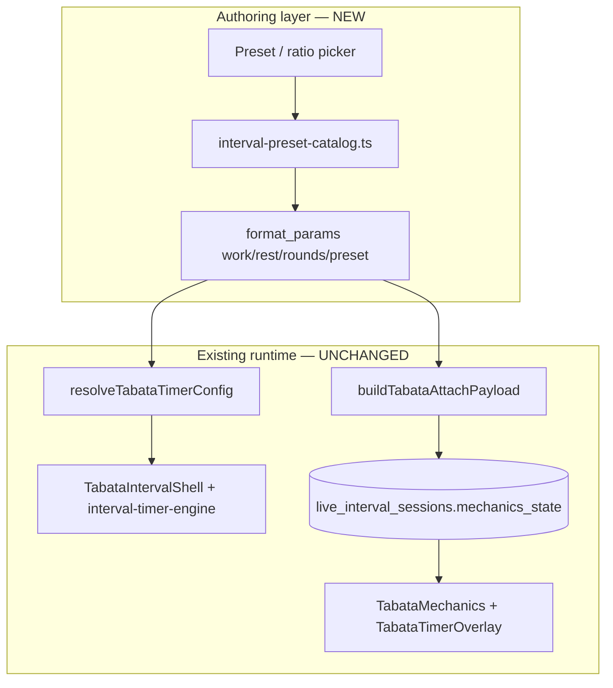

# Feature design: Work-to-rest interval presets (Tabata engine template)

**Status:** Design (2026-06-24)  
**Charter:** Extend the polished Tabata interval timer into a **preset-driven work/rest interval builder** without forking the live or offline engines.  
**Primary template:** Live + offline Tabata stack (Sprint 1–2 complete on `feature/interval-timers-general`).

**Related:**

- [Unified Interval Engine](./unified-interval-engine.md)
- [Tabata dual-engine boundary](./timers/live-video/tabata-dual-engine-boundary.md)
- [Tabata timer overlay assessment](./timers/live-video/tabata-timer-overlay-assessment.md)
- Offline shell: `src/components/fitness/interval-shells/TabataIntervalShell.tsx`
- Live mechanics: `src/features/live-video/wrappers/interval/mechanics/TabataMechanics.tsx`

---

## 1. Summary

Coaches program intervals by **work-to-rest ratio**, not by memorizing second pairs. Tabata (20s / 10s / 8 rounds) is one point on a spectrum of industry-standard protocols. The runtime already supports arbitrary positive `work_seconds`, `rest_seconds`, and `rounds` on `block_format: tabata`; what is missing is a **first-class preset layer** in authoring, catalog, and display so coaches can pick “Classic HIIT (1:1)” instead of typing 30/30 by hand.

**Recommendation:** Treat all ratio-based work/rest protocols as **`tabata` blocks with different `format_params`**, plus an optional `interval_preset` key for UX and labeling. Do **not** add new DB `interval_type` values or duplicate live/offline engines per preset.

---

## 2. Goals

1. **Preset catalog** — Ship the six standard protocols below as one-click authoring choices.
2. **Ratio-first builder UX** — Coach selects ratio (or preset), enters work duration; app auto-calculates rest (overridable).
3. **Runtime parity** — Presets run on the existing Tabata live overlay, participant logger highlights, work-set sync, and offline `TabataIntervalShell` without engine changes.
4. **Coach education** — Surface ratio name, energy-system intent, and work/rest summary in block subtitles and outline UI.
5. **Catalog + AI alignment** — Blueprint catalog and factory modes can reference presets instead of hardcoding 20/10.

## 3. Non-goals (this phase)

- New Postgres `interval_type` enum values (`hiit`, `power`, etc.).
- Separate live mechanics modules per preset (no `ClassicHiitMechanics.tsx`).
- EMOM-style multi-station rotation builder for intervals.
- Participant-facing preset picker during live session (host prescribes; athletes execute).
- Long-form educational copy in the timer overlay (keep HUD minimal; education lives in authoring).
- Offline/live **setup segment** parity (`setup_seconds` remains live-only default 10s unless a follow-up explicitly adds it to `format_params`).

---

## 4. Standard preset catalog

These are the v1 presets. Each maps to `{ work_seconds, rest_seconds, rounds }` on a `tabata` block.

| Preset ID             | Display name          | Work | Rest | Ratio (work:rest) | Default rounds | Energy system (coach-facing)   |
| --------------------- | --------------------- | ---- | ---- | ----------------- | -------------- | ------------------------------ |
| `tabata`              | Tabata (Max Effort)   | 20s  | 10s  | **2:1**           | 8              | Anaerobic / VO₂ max            |
| `classic_hiit`        | Classic HIIT          | 30s  | 30s  | **1:1**           | 8              | Glycolytic / lactate tolerance |
| `hypertrophy_density` | Hypertrophy / Density | 40s  | 20s  | **2:1**           | 8              | Local muscular endurance       |
| `heavy_aerobic`       | Heavy Aerobic         | 60s  | 60s  | **1:1**           | 6              | Oxidative (cardio engine)      |
| `power_sprints`       | Power Sprints         | 10s  | 50s  | **1:5**           | 6              | ATP-PC (phosphagen)            |
| `fighters`            | Fighters / Grapplers  | 5m   | 1m   | **5:1**           | 5              | Sport-specific endurance       |

**Notes:**

- `fighters` uses **300s work / 60s rest** in storage (same as other presets: integer seconds).
- Default rounds are starting suggestions; coach can edit. Validation remains “positive integer rounds required.”
- Two presets share **2:1** (Tabata vs Hypertrophy) and two share **1:1** (Classic HIIT vs Heavy Aerobic); preset ID preserves **intent** when work/rest overlap.

### Ratio reference (authoring copy)

| Ratio                   | Coach use                           | Physiology (short)                                                   |
| ----------------------- | ----------------------------------- | -------------------------------------------------------------------- |
| **1:1**                 | General conditioning, steady output | Rest clears moderate lactate; repeatable power across rounds         |
| **2:1**                 | Fat loss, VO₂ max, muscular burnout | Incomplete recovery; HR stays elevated; lactate stacks               |
| **1:3 – 1:5**           | Max power, speed, heavy O-lifts     | ATP replenishment needs ~3–5× work duration                          |
| **5:1** (extended work) | Combat rounds, threshold pacing     | Athlete learns to recover while moving; short rest drops HR slightly |

---

## 5. Current state (why Tabata is the template)

### 5.1 Prescription layer (already generic)

| Field           | Location                         | Behavior                                 |
| --------------- | -------------------------------- | ---------------------------------------- |
| `block_format`  | task metadata                    | `'tabata'`                               |
| `format_params` | task metadata                    | `work_seconds`, `rest_seconds`, `rounds` |
| Resolver        | `resolve-tabata-timer-config.ts` | Defaults 20/10; any positive ints work   |
| Subtitle        | `format-block-subtitle.ts`       | `Tabata · N Rounds (W/Rs)` — dynamic W/R |

Validation (`block-blueprint-library.ts`): only **`rounds`** is required; work/rest optional with defaults.

### 5.2 Live runtime (Postgres authority)

- `mechanics_state`: `segment`, `round_index`, `work_seconds`, `rest_seconds`, `total_rounds`, `setup_seconds` (default 10, not in `format_params`)
- Attach: `buildTabataAttachPayload` copies block params → initial mechanics
- UI: `TabataTimerOverlay`, host pause, participant active-set highlight, `useTabataWorkSetSync`

### 5.3 Offline runtime (local engine)

- `interval-timer-engine.ts` via `TabataIntervalShell`
- `prepareMs: 0` (no setup segment offline)
- Same W/R/rounds from `format_params`

### 5.4 Gap

| Gap                                                      | Impact                                                        |
| -------------------------------------------------------- | ------------------------------------------------------------- |
| Catalog defaults all tabata entries to 20/10             | Coaches never discover 30/30, 40/20, etc.                     |
| Outline editor is three number fields                    | High friction; no ratio mental model                          |
| Subtitle always says “Tabata”                            | Misleading for 30/30 Classic HIIT                             |
| Factory `intervalBalancedMode` (formerly tabataBalanced) | Phase E generalizes preset-aware factory                      |
| No `interval_preset` in schema                           | Cannot distinguish 2:1 Tabata vs 2:1 Hypertrophy in analytics |

**Engines require no changes** for v1 presets—only authoring, catalog, and display.

### 5.5 Interval terminology (Phase E)

User-facing language is **not** the same as `block_format: tabata` (internal engine id).

| User-facing term                          | When to use                           | `interval_preset`   | W/R/rounds                                |
| ----------------------------------------- | ------------------------------------- | ------------------- | ----------------------------------------- |
| **Tabata**                                | Only the Izumi protocol               | `tabata`            | 20 / 10 / 8 (rounds editable; W/R locked) |
| **Classic HIIT**, **Power Sprints**, etc. | Named catalog presets                 | matching id         | Catalog defaults; rounds often editable   |
| **Intervals** / **Standard Intervals**    | Umbrella or custom W/R                | `custom` or derived | Coach-calculated or user-edited           |
| **Never**                                 | “Tabata-style” for 30/30, 40/20, etc. | —                   | —                                         |

**Strict modalities (locked params):** Tabata (20/10/8), EMOM, AMRAP — Coach/Factory must not relabel these.

**Standard intervals (flexible):** For non-Tabata work/rest, AI computes `work_seconds`, `rest_seconds`, `rounds` from session time budget + goal; still emits `block_format: tabata` + `interval_preset` (`classic_hiit` when W/R match a preset, else `custom`).

Shared constants: `WORK_REST_BLOCK_FORMAT_LABEL` (`'Intervals'`), `INTERVAL_TERMINOLOGY_PROMPT_BLOCK`, `INTERVAL_PRESET_ROUND_BOUNDS`, `reconcileIntervalPreset()` in `interval-preset-catalog.ts`. Server ingest calls reconcile on every tabata `normalizeFormatParams`.

---

## 6. Proposed design

### 6.1 Data model: optional `interval_preset`

Add an **optional** key to `format_params` for tabata blocks:

```typescript
type IntervalPresetId =
  | 'tabata'
  | 'classic_hiit'
  | 'hypertrophy_density'
  | 'heavy_aerobic'
  | 'power_sprints'
  | 'fighters'
  | 'custom'; // explicit manual W/R; no named preset

type TabataFormatParams = {
  rounds: number;
  work_seconds: number;
  rest_seconds: number;
  interval_preset?: IntervalPresetId; // omit or 'custom' when coach edits W/R off-preset
};
```

**Rules:**

1. Choosing a preset **writes** canonical `work_seconds`, `rest_seconds`, and default `rounds`.
2. If coach changes work or rest after preset selection, set `interval_preset: 'custom'` (or clear preset).
3. If W/R exactly matches a known preset, UI may **re-suggest** preset label but does not auto-mutate stored ID without coach action.
4. `normalizeFormatParams` allow-lists `interval_preset`; unknown values stripped.
5. **No migration** on `live_interval_sessions` — attach payload already copies numeric W/R/rounds.

**Canonical preset table (single source of truth):**

```
src/lib/workout-factory/interval-timer/interval-preset-catalog.ts
```

Export:

- `INTERVAL_PRESET_CATALOG` — id, label, workSeconds, restSeconds, defaultRounds, ratioLabel, energySystemBlurb
- `applyIntervalPreset(id, overrides?)` → `{ work_seconds, rest_seconds, rounds, interval_preset }`
- `deriveIntervalPresetFromParams(params)` → preset id | `'custom'`
- `computeRestFromWorkAndRatio(workSeconds, ratio)` — for ratio dropdown auto-fill

### 6.2 Ratio math (builder)

Support discrete ratio selectors:

| Ratio key | Rest formula             |
| --------- | ------------------------ |
| `1:1`     | `rest = work`            |
| `2:1`     | `rest = round(work / 2)` |
| `1:2`     | `rest = work * 2`        |
| `1:3`     | `rest = work * 3`        |
| `1:5`     | `rest = work * 5`        |
| `5:1`     | `rest = round(work / 5)` |

**UX flow:**

1. Coach picks **preset** _or_ **ratio + work duration**.
2. Rest field auto-fills; “Unlock rest” toggle allows manual override → `custom`.
3. Rounds field pre-fills from preset default; always editable.
4. Live preview: block subtitle + total block duration (reuse `tabataBlockDurationSeconds` logic + offline/live setup note).

**Work duration input:** seconds for ≤90s presets; minutes+seconds stepper for `fighters` (300/60).

### 6.3 Display & labeling

| Surface                    | Today                       | Proposed                                                                    |
| -------------------------- | --------------------------- | --------------------------------------------------------------------------- |
| Block subtitle             | Always “Tabata · …”         | `{presetLabel} · N Rounds (W/Rs)` — e.g. `Classic HIIT · 8 Rounds (30/30s)` |
| Outline block chip         | Format name                 | Preset name when `interval_preset` set                                      |
| Live overlay segment label | WORK / REST / GET READY     | Unchanged (segment semantics identical)                                     |
| Live session phase         | `'tabata'`                  | Unchanged (`interval_wrapper_kind: 'tabata'`)                               |
| Participant logger         | Tabata active-set highlight | Unchanged                                                                   |

**Product copy decision (defer to implementation):** Rename umbrella format from “Tabata” to “Intervals” in UI while keeping `block_format: 'tabata'` internally for backward compatibility—or keep “Tabata” as format family name and use preset names in subtitles only. **Recommend:** preset name in subtitle; format row stays `tabata` until a breaking metadata migration is justified.

### 6.4 Catalog & Coach rail

Extend `block-blueprint-catalog.ts`:

| Entry                          | Preset                | Composer token             | Notes                 |
| ------------------------------ | --------------------- | -------------------------- | --------------------- |
| `main-tabata-power`            | `tabata`              | `:main/tabata/power `      | existing (20/10/8)    |
| `finisher-classic-hiit`        | `classic_hiit`        | `:finisher/hiit/classic `  | new (30/30/8)         |
| `finisher-hypertrophy-density` | `hypertrophy_density` | `:finisher/hiit/density `  | new (40/20/8)         |
| `cardio-heavy-aerobic`         | `heavy_aerobic`       | `:cardio/hiit/aerobic `    | new (60/60/6)         |
| `main-power-sprints`           | `power_sprints`       | `:main/interval/power `    | new (10/50/6)         |
| `main-fighters-rounds`         | `fighters`            | `:main/interval/fighters ` | new (5:00 / 1:00 × 5) |

Composer tokens documented in `rail-composer-tokens.md` §5.5.

### 6.5 Factory / AI generation

Phase 2 (after preset catalog ships):

- `intervalBalancedMode` + `intervalPresetId` using catalog defaults (Phase E).
- Coach system prompt: prefer preset IDs over raw seconds when proposing finishers.
- Validation in `prepare-workout-chain-request.ts`: accept any catalog preset; round bounds per preset (e.g. power sprints 4–8, fighters 3–6).

---

## 7. Architecture diagram



**Invariant:** Presets are a **pure function** from catalog → `format_params`. No branch in `interval_advance_segment`, `tabata-mechanics-state`, or overlay audio/progress.

---

## 8. Implementation phases

### Phase A — Catalog + types (1–2 days)

| Task                                          | Files                                                            |
| --------------------------------------------- | ---------------------------------------------------------------- |
| Preset catalog module + unit tests            | `interval-preset-catalog.ts`, `interval-preset-catalog.test.ts`  |
| Allow `interval_preset` in normalize/validate | `block-blueprint-library.ts`                                     |
| Subtitle uses preset label                    | `format-block-subtitle.ts`                                       |
| Types / JSDoc on format params                | `src/lib/workout-factory/types/` (if present) or catalog exports |

**Exit:** Given preset id, tests assert correct W/R/rounds; subtitle renders preset name.

### Phase B — Outline builder UX (2–3 days)

| Task                             | Files                                                                 |
| -------------------------------- | --------------------------------------------------------------------- |
| Preset chip row + ratio dropdown | `WorkoutOutlinePanel.tsx` or extracted `TabataFormatParamsEditor.tsx` |
| Auto-calc rest from ratio        | uses `computeRestFromWorkAndRatio`                                    |
| Duration preview                 | reuse `tabataBlockDurationSeconds` via shared helper accepting params |
| Field meta labels                | `outline-editor-client.ts`                                            |

**Exit:** Coach can author all six presets without typing rest manually; custom override marks `custom`.

### Phase C — Catalog & docs (1 day)

| Task                  | Files                                                  |
| --------------------- | ------------------------------------------------------ |
| New blueprint entries | `block-blueprint-catalog.ts`                           |
| Composer token docs   | `docs/agents/coach/rail-composer-tokens.md`            |
| Cross-link this doc   | `docs/fitness/README.md`, `unified-interval-engine.md` |

**Exit:** Coach rail `:finisher/hiit/classic` inserts Classic HIIT block.

### Phase D — QA matrix (1 day)

| Scenario                   | Live                                       | Offline                     |
| -------------------------- | ------------------------------------------ | --------------------------- |
| Classic HIIT 30/30 × 8     | overlay countdown, pause, logger highlight | shell work/rest alternation |
| Power Sprints 10/50 × 6    | long rest display, audio cues on work only | same                        |
| Fighters 5:00 / 1:00 × 5   | MM:SS countdown, round label               | total duration sanity       |
| Custom 45/15 after preset  | `custom` label, correct runtime            | same                        |
| Attach → reset → re-attach | mechanics_state W/R match params           | N/A                         |

No new migrations required for Phase A–D.

### Phase E — Terminology, Coach/Factory AI, preset-aware factory (complete)

- User-facing **Intervals** vs strict **Tabata** (20/10/8 only); `reconcileIntervalPreset` on ingest.
- Coach + Factory prompts: `INTERVAL_TERMINOLOGY_PROMPT_BLOCK`, `INTERVAL_MODALITY_FACTORY_PROMPT`.
- Factory API: `intervalBalancedMode`, `intervalBalancedOptions.intervalPresetId`, per-preset round bounds.

### Future — `setup_seconds` in authoring

If product requires configurable GET READY duration offline and live:

- Add optional `setup_seconds` to `format_params` (default 10 live, 0 offline until parity decision).
- Thread through `buildTabataAttachPayload` and `resolveTabataTimerConfig`.
- Document in [tabata-dual-engine-boundary.md](./timers/live-video/tabata-dual-engine-boundary.md).

---

## 9. Testing strategy

| Layer             | Coverage                                                                   |
| ----------------- | -------------------------------------------------------------------------- |
| Catalog           | Each preset id → expected params; ratio math edge cases (odd work seconds) |
| Normalize         | Unknown preset stripped; custom preserved                                  |
| Subtitle          | Preset label + fallback to Intervals/custom                                |
| Builder component | Selecting preset updates fields; manual rest → custom                      |
| Integration       | Attach payload for 30/30 block → mechanics_state work/rest/rounds          |
| Regression        | Existing 20/10 Tabata tests unchanged                                      |

Run: `pnpm exec vitest run src/lib/workout-factory/interval-timer/` + existing tabata-mechanics-state / overlay suites.

---

## 10. Risks & mitigations

| Risk                                               | Mitigation                                                                                       |
| -------------------------------------------------- | ------------------------------------------------------------------------------------------------ |
| “Tabata” label confusing for 60/60 aerobic         | Preset-driven subtitles; user-facing format label **Intervals** (Phase E)                        |
| Long work phases (5 min) overflow overlay          | Already use `formatCountdownMmSs`; verify layout at 300s                                         |
| Coach picks preset then edits W/R; stale preset id | Auto-flip to `custom` on divergence                                                              |
| Factory still emits 20/10 only                     | Phase E `intervalBalancedMode` + `intervalPresetId`; catalog tokens bypass factory until enabled |
| Live setup / offline no-setup confusion            | Document in builder preview (“Live includes 10s GET READY”)                                      |

---

## 11. Open questions

1. **Umbrella naming:** Keep internal `tabata` vs user-facing “Work/Rest Intervals” in format picker?
2. **Fighters default rounds:** 5 rounds (25 min work + 4 min rest + setup) vs coach-configurable only?
3. **Preset analytics:** Track `interval_preset` in `session_telemetry` on finalize for dashboard filters?
4. **Max work/rest bounds:** Cap work at 600s? Cap rest at 300s? Prevent zero-work presets?
5. **EMOM overlap:** 60s “minute” EMOM vs 60/60 interval—education copy to steer coaches?

---

## 12. Success criteria

- All six industry presets creatable in **≤3 clicks** in the outline editor.
- Live and offline timers run preset blocks with **no new engine code paths**.
- Block subtitles accurately name the preset and show `(work/rest)s`.
- Existing Tabata (20/10/8) blocks behave identically (backward compatible).
- Documentation linked from fitness README and unified interval engine index.

---

## 13. File index (planned touch points)

| Concern                  | Path                                                                                        |
| ------------------------ | ------------------------------------------------------------------------------------------- |
| **Preset catalog (new)** | `src/lib/workout-factory/interval-timer/interval-preset-catalog.ts`                         |
| **Format validation**    | `src/lib/agents/coach/block-blueprint-library.ts`                                           |
| **Outline UI**           | `src/components/fitness/WorkoutOutlinePanel.tsx`                                            |
| **Subtitle**             | `src/lib/workout-factory/format-block-subtitle.ts`                                          |
| **Blueprint presets**    | `src/lib/agents/coach/block-blueprint-catalog.ts`                                           |
| **Offline resolver**     | `src/lib/workout-factory/interval-timer/resolve-tabata-timer-config.ts` (unchanged logic)   |
| **Live attach**          | `src/features/live-video/wrappers/interval/utils/buildTabataAttachPayload.ts` (unchanged)   |
| **Live mechanics**       | `src/features/live-video/wrappers/interval/mechanics/tabata-mechanics-state.ts` (unchanged) |
