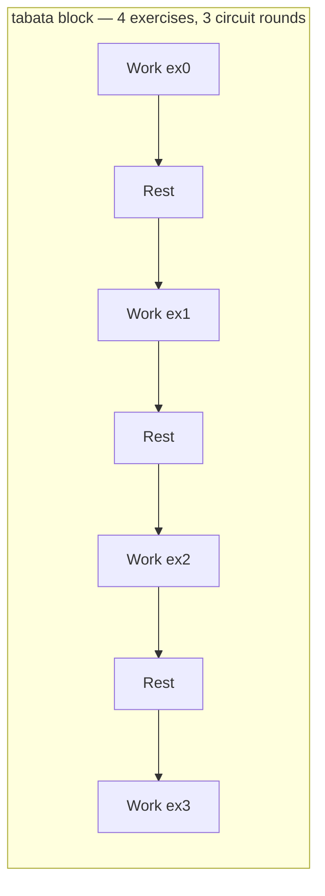

# Feature plan: Multi-exercise interval circuits (Classic HIIT rotation)

**Status:** Planned (2026-06-25)  
**Follows:** [interval-ratio-presets-design.md](./interval-ratio-presets-design.md) Phase E (terminology, presets, `interval_preset` ingest)  
**Charter:** Fix interval blocks where the user prescribes **N exercises × M circuit rounds** (e.g. 4 movements × 3 rounds = 12 work intervals). Today Coach often collapses to one compound exercise, and the Tabata engine treats `format_params.rounds` as **total work/rest cycles for a single stream**, not circuit rounds across stations.

**Related:**

- [Tabata dual-engine boundary](./timers/live-video/tabata-dual-engine-boundary.md)
- [Unified Interval Engine](./unified-interval-engine.md)
- [rail-composer-tokens.md](../agents/coach/rail-composer-tokens.md) §3.2 / §5.5
- Offline shell: `TabataIntervalShell.tsx` · Live: `TabataMechanics.tsx` · Log rows: `resolve-player-log-row-count.ts`

---

## 1. Problem statement

**Observed (manual QA, 2026-06-25):** User requests:

> Classic HIIT 30/30, 4 bodyweight exercises, 3 rounds (12 sets total)

**Expected:**

| Layer          | Expected                                               |
| -------------- | ------------------------------------------------------ |
| Coach prose    | Classic HIIT (not Tabata-style) ✅ Phase E             |
| Block subtitle | `Classic HIIT · 3 Rounds (30/30s)` ✅ Phase E          |
| Structure      | **4** `exercises[]` rows, each with interval meta      |
| Logging        | 3 log rows **per exercise** (12 work intervals total)  |
| Timer          | 12 work segments rotating A→B→C→D, 30s work / 30s rest |

**Actual:**

| Layer       | Actual                                                            |
| ----------- | ----------------------------------------------------------------- |
| Structure   | **1** exercise (“Burpees to Mountain Climbers”)                   |
| Meta line   | `1 sets · 30s work · 30s rest · 3 rounds`                         |
| Log grid    | 3 rows for the single exercise                                    |
| Timer       | 3 work/rest cycles (block-level `rounds: 3`)                      |
| Shell label | Hardcoded **“TABATA”** on `IntervalStartOnlyShell` (Phase E miss) |

Phase E fixed **vocabulary and preset identity**; it did **not** fix **exercise cardinality** or **circuit rotation semantics**.

---

## 2. Root causes (confirmed in code)

### 2.1 Coach / outline cardinality

- Outline prompts still encourage `exercises: [{ name }]` placeholders (one per block).
- No validation that `exercises.length` matches user-stated count (“4 exercises”).
- Card-creation turns can describe 4 movements in prose while emitting one merged name.

### 2.2 `rounds` semantics ambiguity

| Consumer                     | Current meaning of `format_params.rounds`                                                |
| ---------------------------- | ---------------------------------------------------------------------------------------- |
| `resolveTabataTimerConfig`   | Total **work/rest cycles** for the block (single clock)                                  |
| `tabataBlockDurationSeconds` | `setup + rounds×work + (rounds−1)×rest` (single-exercise formula)                        |
| `resolvePlayerLogRowCount`   | Row count **per exercise** in a tabata block                                             |
| `useTabataWorkSetSync`       | On work segment N, syncs `set_number = round_index` for **all** exercises simultaneously |

For a **circuit**, “3 rounds” usually means 3 full passes through 4 stations → **12** work intervals, not 3.

### 2.3 Hydration / display mismatch

- Merge path clears `sets` on tabata rows; factory fill path may set `sets: 1` (`map-outline-fill-to-workout.ts`).
- `formatExerciseTargetLine` can show both `sets` and `rounds`, producing confusing copy (`1 sets · … · 3 rounds`).

---

## 3. Goals

1. **Coach structure** — When the user specifies exercise count (or uses `:finisher/hiit/classic` with “4 exercises”), emit that many distinct `exercises: [{ name }, …]` placeholders; forbid collapsing unless explicitly requested.
2. **Contract** — Document and implement what `rounds` means for multi-exercise `block_format: tabata`:
   - **Recommended:** `rounds` = **circuit rounds** (passes through the exercise list); timer work segments = `rounds × exerciseCount`.
   - Optional future key: `work_intervals_total` if we need explicit override without migration pain.
3. **Timer parity** — Offline `TabataIntervalShell` and live `TabataMechanics` rotate **one active exercise per work segment** (EMOM `alternating_stations` is the reference pattern, but work/rest timing differs).
4. **Logging parity** — Active row highlights the station for the current work segment; each exercise keeps `rounds` log rows (= circuit rounds).
5. **UI polish** — Interval start shell label uses preset subtitle or **Intervals**, not hardcoded `Tabata`.

## 4. Non-goals

- Renaming `block_format: tabata` or `interval_type` in Postgres.
- New interval engine module per preset (still one Tabata FSM).
- Participant-facing station picker mid-session.
- Factory `intervalBalancedMode` circuit pairing (separate from Coach-authored outlines).

---

## 5. Proposed design

### 5.1 Terminology (unchanged from Phase E)

- User-facing format: **Intervals**
- **Tabata** label: strict 20/10/8 only
- **Classic HIIT**, etc.: preset names from `interval_preset`

### 5.2 Data model (v1 — no migration)

Keep `block_format: tabata`. Clarify semantics in docs and prompts:

```typescript
// format_params (existing keys)
{
  work_seconds: 30,
  rest_seconds: 30,
  rounds: 3,              // circuit rounds when exercises.length > 1
  interval_preset: 'classic_hiit',
  // optional future:
  // rotation: 'circuit' | 'simultaneous'  // default 'circuit' when N>1
}
```

**Timer total work segments:**

```text
work_segments = rounds × max(1, exercises.length)
```

**Duration preview:**

```text
setup + work_segments × work_seconds + (work_segments − 1) × rest_seconds
```

### 5.3 Coach / Factory prompt changes

| Surface                               | Change                                                                                 |
| ------------------------------------- | -------------------------------------------------------------------------------------- |
| `COACH_OUTLINE_ONLY_SYSTEM_PROMPT`    | Require `exercises.length` to match user-stated count; 4 exercises → 4 placeholders    |
| `buildCoachOutlineOnlyPrompt` example | Classic HIIT block with **4** `{ name }` entries                                       |
| Live co-pilot                         | “N exercises per interval block” with explicit array length                            |
| Lane 1 token + user text              | When user says “4 exercises”, synthesize 4 placeholders (generic names OK pre-factory) |
| `fill-parametric-outline`             | Fill N distinct movements; never merge into one compound name unless asked             |

### 5.4 Runtime rotation (sketch)



- Add `active_exercise_index` (or derive from `round_index` and `exerciseCount`) in mechanics state **or** compute in overlay from global work-segment index.
- `useTabataWorkSetSync`: sync **only** the active exercise on each work segment (not all exercises at once).
- `resolvePlayerLogRowCount`: unchanged if each exercise gets `rounds` rows.
- `resolveTabataTimerConfig`: `totalRounds = formatParams.rounds * exerciseCount` when `exerciseCount > 1` (or explicit flag).

Reference implementations to study:

- EMOM `alternating_stations` + `countEmomStationLogRows`
- `useTabataAthleteMechanics` active set selection

### 5.5 UI

| File                       | Change                                                                                                                 |
| -------------------------- | ---------------------------------------------------------------------------------------------------------------------- |
| `TabataIntervalShell.tsx`  | `IntervalStartOnlyShell` label from `resolveIntervalPresetLabel(block.formatParams)` or `WORK_REST_BLOCK_FORMAT_LABEL` |
| `formatExerciseTargetLine` | For tabata blocks, omit `sets` when `rounds` + `work_seconds` present                                                  |
| Block subtitle             | Optional: `Classic HIIT · 3 Rounds × 4 exercises (30/30s)`                                                             |

---

## 6. Implementation phases

### Phase F1 — Coach cardinality (1–2 days)

- Prompt + example updates (Coach + Deno mirror).
- Optional `validateBlockShape` warning when tabata block has 1 exercise but block name/description implies circuit.
- Tests: `prompts.test.ts`, `block-blueprint-library.test.ts`, parse/merge fixtures with 4 placeholders.

**Exit:** User request “4 exercises, 3 rounds” → outline/card metadata has `exercises.length === 4`.

### Phase F2 — Timer + logging semantics (2–3 days)

- `resolveTabataTimerConfig` / `computeTabataBlockDurationFromParams` multiply by exercise count when N>1.
- Live `tabata-mechanics-state` + offline `interval-timer-engine` rotate active station per work segment.
- `useTabataWorkSetSync` + `useTabataAthleteMechanics` highlight single active exercise.
- Tests: mechanics state transitions, log row highlight, duration preview.

**Exit:** 4×3 Classic HIIT runs 12 work intervals; correct exercise highlighted each work phase.

### Phase F3 — Display polish (0.5 day)

- Shell label, prescription meta line, docs cross-links.

---

## 7. Testing matrix

| Scenario                          | Coach emit     | Viewer rows                 | Timer segments | Live attach              |
| --------------------------------- | -------------- | --------------------------- | -------------- | ------------------------ |
| 1 ex, 8 rounds Tabata 20/10       | 1 placeholder  | 8 per ex                    | 8              | unchanged regression     |
| 4 ex, 3 rounds Classic HIIT 30/30 | 4 placeholders | 3 per ex                    | 12             | rotate + highlight       |
| 2 ex, 4 rounds custom 45/15       | 2 placeholders | 4 per ex                    | 8              | custom label “Intervals” |
| User says 4 ex, Coach emits 1     | —              | fail QA / prompt regression | —              | —                        |

```bash
pnpm exec vitest run \
  src/lib/workout-factory/interval-timer/ \
  src/lib/workout-factory/resolve-player-log-row-count.test.ts \
  src/features/live-video/wrappers/interval/mechanics/ \
  src/lib/agents/coach/prompts.test.ts
pnpm run check:agent-mirror
# Deploy after mirror sync:
# supabase functions deploy agent-dispatch --no-verify-jwt
```

---

## 8. Risks

| Risk                                                           | Mitigation                                                         |
| -------------------------------------------------------------- | ------------------------------------------------------------------ |
| Breaking single-exercise Tabata (8×20/10)                      | Gate multiplication on `exerciseCount > 1`; regression suite       |
| `rounds` already stored meaning “total intervals” in old cards | Document; optional one-time normalize on read                      |
| Live/offline drift                                             | Follow dual-engine boundary doc; shared pure duration helpers only |
| PR size                                                        | Split F1 (Coach) vs F2 (engine) if needed                          |

---

## 9. Open questions

1. **Simultaneous tabata** — Do we ever want all exercises working the same round index together (current behavior)? If yes, need `rotation: 'simultaneous'` escape hatch.
2. **Rest between exercises vs rest between rounds** — v1 assumes rest after every work segment; rest-only-between-rounds is out of scope.
3. **Factory fill before Generate** — Should outline placeholders stay generic until factory, or should Coach name all 4 before card creation?

---

## 10. References

- Phase E manual spot-check failure: 4 ex × 3 rounds → 1 ex × 3 rows (2026-06-25)
- `interval-ratio-presets-design.md` §5.5 — terminology contract (shipped)
- `tabata-dual-engine-boundary.md` — do not merge live/offline FSMs without charter
