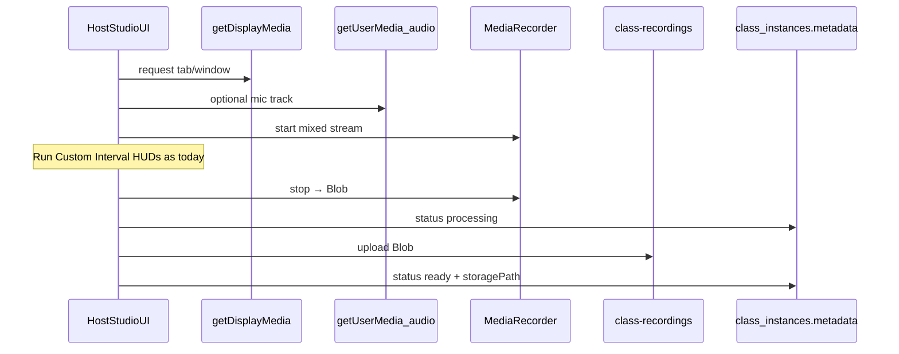

# Solo Recording Studio — Architectural Blueprint

**Status:** Phase 1–3 shipped (room lock + studio entry + browser recorder); Phase 4 playback polish pending

**Charter:** Let a host record themselves running a custom interval workout inside the existing live huddle + timer HUD stack, with the room locked so no other participants can join. Capture is **client-side** (browser `MediaRecorder`), not Agora Cloud Recording.  
**Depends on:** Live session invite / `live_sessions` lifecycle, Tabata/Custom Interval HUD + Quick Launch, `class-recordings` storage + async playback patterns.  
**Boundary:** Reuse huddle UI + interval FSM. Do **not** treat “don’t share the invite” as a security lock — enforce host-only on join RPC + token gate.

---

## Related docs

| Doc                                                                          | Role                                                                                 |
| ---------------------------------------------------------------------------- | ------------------------------------------------------------------------------------ |
| [class-recording-pipeline.md](./class-recording-pipeline.md)                 | Existing Track 1 (Agora cloud) / Track 2 (manual upload) + `class-recordings` bucket |
| [custom-interval-timer-blueprint.md](./custom-interval-timer-blueprint.md)   | Quick Launch Custom Interval + stations                                              |
| [timer-hud-start-button-blueprint.md](./timer-hud-start-button-blueprint.md) | Host Start under timer glass                                                         |
| [unified-interval-engine.md](./unified-interval-engine.md)                   | Live interval mechanics                                                              |
| [../live-video/readme.md](../live-video/readme.md)                           | Agora huddle + cloud recording overview                                              |

---

## 1. Product use case

**Solo Recording Studio:** A trainer opens a dedicated studio entry (not a shared Class Live CTA), attaches a Custom Interval (or Strict Tabata) deck item, sees the same live HUDs (timer glass, Start panel, exercise billboard), records a VOD of the session, and later plays it back for members or private review.

| Actor               | Behavior                                                                                                                                           |
| ------------------- | -------------------------------------------------------------------------------------------------------------------------------------------------- |
| Host                | Creates solo session, joins Agora as host (camera/mic for monitoring + local capture), runs timers, starts/stops browser recording, uploads result |
| Participant / guest | **Cannot** join (RPC + token reject), even if they learn `sessionId` / `channelId`                                                                 |
| Member (playback)   | Watches finished VOD via signed URL (reuse async playback patterns when attached to a class instance)                                              |

**Out of product scope (v1):** Multi-camera production, server-side mix, live audience, Agora Cloud Recording bot for this studio mode.

---

## 2. Discovery summary (locked facts)

### 2.1 Live session create / auth today

| Piece                     | Reality                                                                                                                         |
| ------------------------- | ------------------------------------------------------------------------------------------------------------------------------- |
| Invite                    | `LiveSessionInvitePayload` (`sessionId`, `channelId`, `hostUserId`, `workspaceId`, …) minted from chat / class card / deep link |
| Durable row               | `live_session_create` → `public.live_sessions` + host `live_session_participants`                                               |
| Join                      | `live_session_participant_join` then `POST /api/live-video/token`                                                               |
| Gate                      | `can_join_live_session` — host always; participants need workspace membership (+ class enrollment when class-backed)            |
| Room capacity / host-only | **Does not exist** on `live_sessions`                                                                                           |

Soft privacy (never publish invite) is **not** enough: a workspace member who learns IDs can still join non-class sessions.

### 2.2 Recording today

| Track                  | Mechanism                                       | Solo studio fit                                    |
| ---------------------- | ----------------------------------------------- | -------------------------------------------------- |
| Track 1                | Agora Cloud Recording → S3 → `class-recordings` | Cloud stream — **out of charter** for this feature |
| Track 2                | Manual file upload in Class Editor              | Upload/storage/playback reusable                   |
| Client `MediaRecorder` | **Not implemented** (zero hits)                 | Must invent for Solo Studio                        |

Playback: [`AsyncPlaybackShell`](../../src/features/live-video/shells/AsyncPlaybackShell.tsx) + signed URLs from bucket `class-recordings`.

---

## 3. Session constraints — room lock

### 3.1 Mechanism (normative)

Add an access mode on the durable session (name locked for this blueprint):

```text
live_sessions.access_mode text NOT NULL DEFAULT 'open'
  -- 'open' | 'solo_studio'
```

| Mode          | Join rule                                          |
| ------------- | -------------------------------------------------- |
| `open`        | Today’s `can_join_live_session` rules              |
| `solo_studio` | **Only** `auth.uid() = live_sessions.host_user_id` |

**Enforce in both places** (defense in depth):

1. `live_session_participant_join` — reject non-host with a stable error code (e.g. `room_host_only`).
2. `can_join_live_session` — same check so `/api/live-video/token` returns **403** even if join RPC is bypassed.

**Create path:** studio entry calls `live_session_create` with `p_access_mode := 'solo_studio'` (extend RPC; default `'open'` for all existing callers).

### 3.2 UI / invite hygiene (necessary but not sufficient)

| Practice                                                   | Purpose                                                                         |
| ---------------------------------------------------------- | ------------------------------------------------------------------------------- |
| Dedicated Studio entry (dashboard / Classes)               | Never write chat `metadata.live_session` or ClassCard Join CTA for this session |
| Skip `ParticipantPreJoinSummary` for host studio flow      | Host goes straight into huddle after create                                     |
| Do not share deep-link `join_live_class` for solo sessions | Avoid advertising join                                                          |

### 3.3 Optional hardening (later)

- Persist `channel_id` on `live_sessions` and reject token channel mismatches (documented open gap today).
- `max_participants = 1` as redundant check — access_mode alone is enough for v1.

---

## 4. Recording strategy audit

Charter requires **client-side** capture (not Agora Cloud Recording). Raw `getUserMedia` → `MediaRecorder` **does not** include HTML overlays (timer HUD, billboard, Start panel). Two options:

### Option A — Tab / window capture (`getDisplayMedia` + `MediaRecorder`)

|           |                                                                                                                                                                 |
| --------- | --------------------------------------------------------------------------------------------------------------------------------------------------------------- |
| **How**   | Host grants display capture of the studio tab/window; `MediaRecorder` encodes the resulting stream (optionally mix with `getUserMedia` mic via `AudioContext`). |
| **Pros**  | WYSIWYG: timers + HUDs baked into MP4; playback = existing video player; no telemetry sync engine; matches “record what I see”.                                 |
| **Cons**  | Browser picker UX (user must choose the correct tab); some browsers show a share chrome / may omit system audio; permission friction; cannot silently capture.  |
| **Hooks** | New client module (e.g. `soloStudioRecorder.ts`); start/stop from SessionControls; upload blob like Track 2.                                                    |

### Option B — Raw camera (`getUserMedia` + `MediaRecorder`) + FSM telemetry

|           |                                                                                                                                                                 |
| --------- | --------------------------------------------------------------------------------------------------------------------------------------------------------------- |
| **How**   | Record camera/mic only; stream `mechanics_state` / phase events as JSON timeline; VOD player re-renders overlays in sync.                                       |
| **Pros**  | Clean plate (reusable for edit); smaller UI coupling; no display-picker.                                                                                        |
| **Cons**  | Large product surface: new sync player, clock skew, seek/scrub overlay state, versioning of HUD chrome; camera file alone has **no** timers for naive playback. |
| **Hooks** | Telemetry writer next to interval engine; extend `AsyncPlaybackShell` (or new Solo VOD shell) with overlay clock.                                               |

### Recommendation (locked for v1)

**Ship Option A** for Solo Recording Studio v1.

Rationale: product value is “custom interval + live HUDs on a VOD”; Option A delivers that with the current playback stack. Option B is a follow-on architecture (Phase 5+) if we need camera-only masters or recomposited UI.

**Audio:** Prefer mixing the host mic (`getUserMedia` audio track) into the recorded stream so coaching cues are heard even if tab capture audio is unavailable.

**Not recommended for this charter:** Agora Cloud Recording (Track 1) — cloud stream, multi-party bot, class `async_session` coupling.

---

## 5. Recording API (Option A)



| Concern  | Approach                                                                                                              |
| -------- | --------------------------------------------------------------------------------------------------------------------- |
| API      | `navigator.mediaDevices.getDisplayMedia({ video: true, audio: true })` + optional mic                                 |
| Encode   | `MediaRecorder` with `video/webm;codecs=vp9,opus` (fallback `video/webm`)                                             |
| Chunking | Collect `ondataavailable` blobs; assemble on stop (or multipart upload if size requires)                              |
| Stop     | Explicit Stop Recording control; also stop on `endSession` / tab close (best-effort `beforeunload` warning)           |
| Agora    | Host still joins RTC for preview/self-view consistency with huddle chrome; **recording does not use Agora cloud bot** |

---

## 6. Data model

### 6.1 Session lock

| Store                                                     | Change                                                        |
| --------------------------------------------------------- | ------------------------------------------------------------- |
| `public.live_sessions`                                    | `access_mode text not null default 'open'` + check constraint |
| `live_session_create`                                     | Optional `p_access_mode` (default `open`)                     |
| `live_session_participant_join` / `can_join_live_session` | Reject non-host when `solo_studio`                            |

### 6.2 Recording identity + file

Reuse class recording storage contracts to avoid a second bucket/RLS universe:

| Store                                                   | Role                                                                                                                                            |
| ------------------------------------------------------- | ----------------------------------------------------------------------------------------------------------------------------------------------- |
| Synthetic / private **class instance** (recommended v1) | Studio create provisions or links a workspace class row with `async_session` + no public Join Live                                              |
| `class_instances.metadata.class_recording`              | Same shape as [class-recording-pipeline.md](./class-recording-pipeline.md); set `provider: 'browser'` (extend union from `'agora' \| 'manual'`) |
| Bucket `class-recordings`                               | Path `{workspace_id}/{class_instance_id}/{filename}.webm` (or remuxed `.mp4` later)                                                             |
| Optional JSON sidecar                                   | Only if Phase 5 Option B — e.g. `{…}/telemetry.json` — **not required for Option A v1**                                                         |

**Upload flow:** Mirror Track 2 — set `processing` → `storage.upload` → `ready` / `failed` ([`class-recording-storage.ts`](../../src/lib/class-recording-storage.ts) helpers).

**Playback:** `AsyncPlaybackShell` / class card “Recording ready” when `status === 'ready'`.

### 6.3 Explicit non-goals for v1 data

- Do not write `class_recording_sessions` Agora control-plane rows for browser capture.
- Do not require Agora webhook for Solo Studio completes.

---

## 7. UX sketch

1. **Enter Studio** (host) → create `solo_studio` live session + private class instance binding.
2. Huddle loads with camera; interval Quick Launch / deck attach as today.
3. **Record** control (SessionControls) → display-picker → recording indicator.
4. Run workout (HUD Start / Nav Start / pause unchanged).
5. **Stop & upload** → processing → ready.
6. End session (no participant kill-switch audience).

---

## 8. Execution phases

### Phase 0 — Blueprint (this doc)

1. [x] Audit live create/join and recording tracks.
2. [x] Lock room mode `solo_studio` + dual enforcement.
3. [x] Lock Option A (`getDisplayMedia` + `MediaRecorder`) for v1.

### Phase 1 — Room lock — **shipped**

1. [x] Migration: `live_sessions.access_mode` (`open` | `solo_studio`) — `20260929120000_live_sessions_access_mode_solo_studio.sql`.
2. [x] Extend `live_session_create` (`p_access_mode` default `open`) + `live_session_participant_join` (`room_host_only`) + `can_join_live_session` (participant path only when `open`).
3. [x] Token route inherits 403 via `can_join_live_session` (no parallel ad-hoc check required).

### Phase 2 — Studio entry shell — **shipped**

1. [x] Host-only **Enter Solo Studio** dashboard nav (same gate as Start live video); mints session **without** chat/card `live_session` broadcast.
2. [x] Bind private `class_instances` (`async_session` only, no `live_session`) via `provisionSoloStudioInstance`.
3. [x] Dock passes `p_access_mode: 'solo_studio'`; skips PreJoin; auto `joinChannel`; blocks Agora cloud record; huddle hides roster / participant rail; **End studio** label.

### Phase 3 — Browser recorder — **shipped**

1. [x] `getDisplayMedia` + `MediaRecorder` + mic mix (`useSoloStudioRecorder` / `solo-studio-recorder`); Record/Stop in SessionControlsActions when solo.
2. [x] Upload to `class-recordings` …/`studio-capture.webm` + metadata `provider: 'browser'` (`uploadSoloStudioRecording`).
3. [ ] Manual QA: overlays visible in VOD; non-host join fails.

### Phase 4 — Playback polish

1. Ensure `AsyncPlaybackShell` / class card treat `provider: 'browser'` like manual ready files.
2. Size limits, error copy, “choose this tab” coach marks.

### Phase 5 — Optional Option B

1. Telemetry timeline + recomposited VOD player (only if product requires camera-only masters).

---

## 9. Decision summary

| Topic            | Decision                                                                                               |
| ---------------- | ------------------------------------------------------------------------------------------------------ |
| Room lock        | `live_sessions.access_mode = 'solo_studio'`; enforce on join RPC + `can_join_live_session`             |
| Soft invite hide | Required UX; **not** sufficient alone                                                                  |
| Capture          | **Option A** — `getDisplayMedia` + `MediaRecorder` (WYSIWYG HUDs)                                      |
| Not used         | Agora Cloud Recording for Solo Studio v1                                                               |
| Storage          | Reuse `class-recordings` + class recording metadata (`provider: 'browser'`) via private class instance |
| Timers / HUD     | Unchanged live stack (Custom Interval, Start panel, billboard)                                         |

---

## 10. Open questions

1. **Studio entry surface:** **Locked** — dashboard secondary nav **Enter Solo Studio** next to Start live video (not a dedicated `/studio` route in v1).
2. **Member visibility:** Are solo VODs private to host/admin only, or attachable to a public class card? _(Private class instance without `live_session` for Phase 2; playback visibility still open.)_
3. **Remux:** Ship `.webm` as-is for v1, or server/client remux to `.mp4` for Safari?

---

## 11. Validation (when implementing)

```bash
# Phase 1 examples (names TBD)
pnpm exec vitest run src/lib/live-video/ # join/token helpers if extracted
# Deno / SQL tests for can_join_live_session solo_studio cases
```

Manual: host-only join 403 for second user; recorded file shows timer HUD; upload reaches `ready` and plays in async shell.
