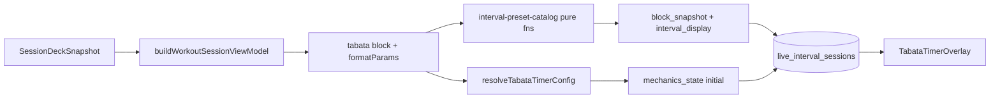

# Feature plan: Interval Preset Catalog in live video (timer overlay)

**Status:** Planned (2026-06-25)  
**Follows:** [interval-ratio-presets-design.md](../../interval-ratio-presets-design.md) Phase E (catalog + `interval_preset` ingest) · [multi-exercise-interval-circuit-plan.md](../../multi-exercise-interval-circuit-plan.md) Phase F1 (Coach cardinality, shipped)  
**Charter:** Bring **Interval Preset Catalog** semantics and **preset-aware copy** into live Agora sessions. Today the live Tabata path ignores `interval_preset` and hardcodes **“Tabata”** on the HUD even when the block is Classic HIIT, Fighters, or custom W/R. Align live attach, overlay, and participant logger with the same pure helpers used in outline editor and offline player—without merging the live/offline FSMs.

**Related:**

- [Tabata dual-engine boundary](./tabata-dual-engine-boundary.md) — shared presentation only; do not merge FSMs
- [Tabata timer overlay assessment](./tabata-timer-overlay-assessment.md) — Batches A–I shipped; this plan is the **preset + circuit** follow-on
- [Unified Interval Engine](../../unified-interval-engine.md) — `live_interval_sessions`, polymorphic `mechanics_state`
- [rail-composer-tokens.md](../../../agents/coach/rail-composer-tokens.md) §5.5

**Code entry points:**

| Layer               | File                                                                                                                                                                                                                                    |
| ------------------- | --------------------------------------------------------------------------------------------------------------------------------------------------------------------------------------------------------------------------------------- |
| Attach              | [`buildTabataAttachPayload.ts`](../../../../src/features/live-video/wrappers/interval/utils/buildTabataAttachPayload.ts)                                                                                                                |
| Overlay             | [`TabataTimerOverlay.tsx`](../../../../src/features/live-video/wrappers/interval/mechanics/TabataTimerOverlay.tsx)                                                                                                                      |
| Mechanics           | [`TabataMechanics.tsx`](../../../../src/features/live-video/wrappers/interval/mechanics/TabataMechanics.tsx) · [`tabata-mechanics-state.ts`](../../../../src/features/live-video/wrappers/interval/mechanics/tabata-mechanics-state.ts) |
| Engine hook         | [`useIntervalTimerState.ts`](../../../../src/features/live-video/wrappers/interval/hooks/useIntervalTimerState.ts)                                                                                                                      |
| Catalog (canonical) | [`interval-preset-catalog.ts`](../../../../src/lib/workout-factory/interval-timer/interval-preset-catalog.ts)                                                                                                                           |
| Types               | [`tabata-format-params.ts`](../../../../src/lib/workout-factory/types/tabata-format-params.ts)                                                                                                                                          |
| Config resolver     | [`resolve-tabata-timer-config.ts`](../../../../src/lib/workout-factory/interval-timer/resolve-tabata-timer-config.ts)                                                                                                                   |

---

## 1. Problem statement

Phase E shipped preset identity on **authoring** surfaces (outline editor, block subtitles, Coach prompts). Phase F1 shipped **Coach exercise cardinality** for multi-station circuits. **Live video** still behaves as if every `block_format: tabata` block were strict Izumi Tabata:

| Layer        | Authoring (Phase E)                                                 | Live video today                                                    |
| ------------ | ------------------------------------------------------------------- | ------------------------------------------------------------------- |
| Block label  | `Classic HIIT · 8 Rounds (30/30s)` via `resolveIntervalPresetLabel` | HUD header always **“Tabata”**                                      |
| Preset id    | `format_params.interval_preset: 'classic_hiit'` on card metadata    | Not read at attach or overlay                                       |
| W/R display  | From `format_params.work_seconds` / `rest_seconds`                  | Mechanics state has W/R; overlay does not show ratio subtitle       |
| Circuit (F2) | Coach emits N exercises × M circuit rounds                          | `total_rounds = format_params.rounds` only; no station label on HUD |

**Observed gap (manual QA):** Host starts a live class on a **Classic HIIT 30/30** finisher. Participant sees **Tabata** in the top-left overlay while the deck/logger shows interval meta from hydration. Product copy and coach intent diverge on the highest-visibility surface (video HUD).

---

## 2. Root causes (confirmed in code)

### 2.1 Overlay is preset-blind

[`TabataTimerOverlay.tsx`](../../../../src/features/live-video/wrappers/interval/mechanics/TabataTimerOverlay.tsx) line ~68:

```tsx
<p className="...">Tabata</p>
```

No import from `interval-preset-catalog.ts`. EMOM overlay similarly hardcodes **“EMOM”** (acceptable—no preset family yet).

### 2.2 Attach payload drops format_params

[`buildTabataAttachPayload`](../../../../src/features/live-video/wrappers/interval/utils/buildTabataAttachPayload.ts):

- Reads tabata block via `resolveTabataTimerConfig` → `{ workMs, restMs, totalRounds }` only.
- `buildAmrapBlockSnapshot` → `block_snapshot` has `exercises[]` but **no** `block_format`, `format_params`, or `interval_preset`.
- `buildInitialTabataMechanicsState` → mechanics JSON has segment timing only.

Preset identity exists on **task metadata** at attach time but is **not persisted** on the interval session row in a shape the overlay can read on every tick.

### 2.3 Timer semantics lag circuit plan (F2)

[`resolveTabataTimerConfig`](../../../../src/lib/workout-factory/interval-timer/resolve-tabata-timer-config.ts) sets `totalRounds = params.rounds` with no `× exerciseCount`. Live and offline share this resolver today. Multi-exercise circuit rotation (`active_exercise_index`, per-station highlight) is **out of scope for overlay-only work** but blocks correct round labels for 4×3 circuits until F2 lands.

### 2.4 Dual-engine boundary is intact

Live FSM (`tabata-mechanics-state.ts`) and offline FSM (`interval-timer-engine.ts`) must remain separate per [tabata-dual-engine-boundary.md](./tabata-dual-engine-boundary.md). **Safe to share:** catalog pure functions, subtitle formatters, `TabataFormatParams` type, countdown/audio utilities.

---

## 3. Goals

1. **Preset-aware HUD header** — Overlay shows catalog label (`Tabata`, `Classic HIIT`, `Intervals`, etc.) from the same rules as outline editor (`resolveIntervalPresetLabel` / `WORK_REST_BLOCK_FORMAT_LABEL`).
2. **Typed format_params on live attach** — Persist enough structure on `block_snapshot` (or a sibling field) so reconnecting clients and overlay do not re-parse full task metadata.
3. **Subtitle line on overlay** — Optional second line: `3 Rounds (30/30s)` or `Round 2 of 12 · Burpees` (circuit, post-F2) using shared duration/subtitle helpers where possible.
4. **Parity with Phase E terminology** — Never show “Tabata” for non-20/10 blocks unless `interval_preset === 'tabata'`.
5. **F2-ready contract** — Design snapshot/mechanics fields so circuit rotation can add `active_exercise_index` without another snapshot migration.

## 4. Non-goals

- Merging live and offline timer FSMs.
- Renaming `interval_type: 'tabata'` in Postgres or `interval_wrapper_kind`.
- New RPCs for preset selection mid-session (host picks preset before attach only).
- EMOM preset catalog (separate charter).
- Factory `intervalBalancedMode` live attach path.

---

## 5. Proposed design

### 5.1 Terminology (unchanged)

| Concept       | User-facing                       | Storage                            |
| ------------- | --------------------------------- | ---------------------------------- |
| Format family | **Intervals** (umbrella)          | `block_format: 'tabata'`           |
| Strict Izumi  | **Tabata**                        | `interval_preset: 'tabata'`, 20/10 |
| Named presets | **Classic HIIT**, **Fighters**, … | `interval_preset` + W/R            |
| Custom W/R    | **Intervals**                     | `interval_preset: 'custom'`        |

### 5.2 Data model — extend `block_snapshot` (v1, JSONB only)

Keep `mechanics_state` focused on **segment position**. Add optional interval metadata to **`block_snapshot`** (already JSONB on `live_interval_sessions`):

```typescript
/** Extends AmrapBlockSnapshotPayload for tabata/emom interval blocks. */
type IntervalBlockSnapshotExtension = {
  block_format?: 'tabata' | 'emom' | 'amrap';
  format_params?: TabataFormatParams; // work_seconds, rest_seconds, rounds, interval_preset
  /** Denormalized for HUD; derived at attach from format_params. */
  interval_display?: {
    preset_label: string; // e.g. "Classic HIIT"
    subtitle: string; // e.g. "3 Rounds (30/30s)" — formatBlockSubtitle parity
    exercise_count: number;
    circuit_rounds: number; // format_params.rounds (circuit passes)
    work_segments_total: number; // rounds × max(1, exercise_count) — F2
  };
};
```

**Attach flow:**



**Backward compatibility:** `parseBlockSnapshot` in `useIntervalTimerState` treats new keys as optional; old sessions without `format_params` fall back to **“Tabata”** + W/R from mechanics state (current behavior).

### 5.3 Overlay UI contract

| Element                  | Today                   | Proposed                                                                       |
| ------------------------ | ----------------------- | ------------------------------------------------------------------------------ |
| Header (10px caps)       | `Tabata`                | `interval_display.preset_label` or `resolveIntervalPresetLabel(format_params)` |
| Phase line               | WORK / REST / GET READY | Unchanged (`engine.segmentLabel`)                                              |
| Subtitle                 | `Round X of Y` only     | Keep round line; add optional W/R or preset subtitle from catalog              |
| Progress / audio / pause | Shipped (Batches D, I)  | Unchanged                                                                      |

**Reference layout** (matches existing EMOM/Tabata overlay card):

```
┌─────────────────────────────┐
│ CLASSIC HIIT          🔊 ⏸  │  ← preset_label (not "Tabata")
│ WORK                        │  ← segment phase
│ Round 2 of 12 · Burpees     │  ← F2: round + active station
│ ████████░░░░                │
│ 0:24                        │
└─────────────────────────────┘
```

Phase L1 ships header + static subtitle (`3 Rounds (30/30s)`). Phase L2 adds dynamic station name when F2 rotation lands.

### 5.4 Shared pure module (no Deno mirror required)

Create **`live-tabata-overlay-display.ts`** (or extend `tabata-overlay-display.ts`) in live-video mechanics folder:

- `resolveLiveIntervalOverlayHeader(format_params): string` → wraps `resolveIntervalPresetLabel`
- `resolveLiveIntervalOverlaySubtitle(format_params, exerciseCount?): string` → wraps `formatBlockSubtitle('tabata', params)` or a slim HUD-specific formatter
- Import from `@/lib/workout-factory/interval-timer/interval-preset-catalog` only — **no React**, safe for tests

Do **not** duplicate preset W/R tables; single source remains catalog.

### 5.5 Participant logger (light touch)

[`useTabataAthleteMechanics`](../../../../src/features/live-video/wrappers/interval/mechanics/useTabataAthleteMechanics.ts) highlights active set from mechanics only today. F2 adds per-exercise highlight; overlay plan only ensures **block_snapshot.exercises** order matches Coach circuit order (F1 exit).

---

## 6. Implementation phases

### Phase L1 — Preset-aware overlay + snapshot types (1–1.5 days)

**Scope:** Presentation + attach persistence only. No FSM or `total_rounds` math changes.

| Task                                                               | File(s)                                                          |
| ------------------------------------------------------------------ | ---------------------------------------------------------------- |
| Extend `AmrapBlockSnapshotPayload` type (optional interval fields) | `buildAmrapBlockSnapshot.ts` or new `interval-block-snapshot.ts` |
| Populate `format_params` + `interval_display` in attach            | `buildTabataAttachPayload.ts`                                    |
| Parse extended snapshot in timer hook                              | `useIntervalTimerState.ts`                                       |
| Replace hardcoded “Tabata” header; add subtitle line               | `TabataTimerOverlay.tsx`                                         |
| Pure helpers + unit tests                                          | `tabata-overlay-display.ts`, `TabataTimerOverlay.test.tsx`       |
| Export `TabataFormatParams` usage in attach tests                  | `buildTabataAttachPayload.test.ts`                               |

**Exit:** Live HUD shows **Classic HIIT** (or **Intervals**) for non-20/10 blocks; strict 20/10 still shows **Tabata**.

### Phase L2 — Align with circuit timer semantics (2–3 days)

**Depends on:** [multi-exercise-interval-circuit-plan.md](../../multi-exercise-interval-circuit-plan.md) **Phase F2** (shared with offline).

| Task                                                                             | Notes                                                      |
| -------------------------------------------------------------------------------- | ---------------------------------------------------------- |
| `resolveTabataTimerConfig`: `totalRounds = rounds × exerciseCount` when N>1      | Shared resolver; live attach inherits                      |
| `tabata-mechanics-state`: optional `active_exercise_index`, `work_segment_index` | JSONB additive                                             |
| Overlay subtitle: active exercise name from `block_snapshot.exercises[i]`        | F2                                                         |
| `useTabataWorkSetSync`: sync single active exercise per work segment             | F2                                                         |
| Round label: `tabataRoundDisplayLabel` aware of work segments vs circuit rounds  | May need `tabataRoundDisplayLabel(state, config)` overload |

**Exit:** 4×3 Classic HIIT shows **Round 2 of 12 · Mountain Climbers** (or equivalent) on live HUD; 12 work segments complete.

### Phase L3 — Display polish + docs (0.5 day)

| Task                                                  | Notes                                |
| ----------------------------------------------------- | ------------------------------------ |
| Host pre-start confirmation chip with preset subtitle | Optional; session deck UI            |
| Cross-link assessment doc; mark preset gap closed     | `tabata-timer-overlay-assessment.md` |
| `docs/fitness/README.md` index entry                  | This plan                            |

**Exit:** Docs and QA matrix green; no hardcoded “Tabata” regressions in snapshot tests.

---

## 7. Testing matrix

| Scenario                               | `interval_preset` | HUD header        | Round line (L1)          | Round line (L2)      |
| -------------------------------------- | ----------------- | ----------------- | ------------------------ | -------------------- |
| Strict Tabata 20/10 × 8, 1 ex          | `tabata`          | Tabata            | Round 1 of 8             | unchanged            |
| Classic HIIT 30/30 × 8, 1 ex           | `classic_hiit`    | Classic HIIT      | Round 1 of 8             | unchanged            |
| Custom 45/15 × 6, 1 ex                 | `custom`          | Intervals         | Round 1 of 6             | unchanged            |
| Classic HIIT 30/30, 4 ex × 3 rounds    | `classic_hiit`    | Classic HIIT      | 3 Rounds (30/30s) static | Round 1 of 12 · ex A |
| Legacy session (no snapshot extension) | —                 | Tabata (fallback) | From mechanics           | best-effort          |

```bash
pnpm exec vitest run \
  src/features/live-video/wrappers/interval/mechanics/TabataTimerOverlay.test.tsx \
  src/features/live-video/wrappers/interval/utils/buildTabataAttachPayload.test.ts \
  src/lib/workout-factory/interval-timer/interval-preset-catalog.test.ts \
  src/lib/workout-factory/interval-timer/resolve-tabata-timer-config.test.ts
# After F2:
pnpm exec vitest run src/features/live-video/wrappers/interval/mechanics/
```

No `check:agent-mirror` or Edge deploy for L1–L3 (client-only). Deploy is UI bundle only.

---

## 8. Risks

| Risk                                                                            | Mitigation                                                                               |
| ------------------------------------------------------------------------------- | ---------------------------------------------------------------------------------------- |
| Stale `block_snapshot` if host edits card mid-session                           | Document: re-attach required; snapshot frozen at interval start (same as AMRAP)          |
| Old rows without `format_params`                                                | Fallback header “Tabata”; derive W/R from mechanics_state                                |
| L1 ships before F2; subtitle says “3 Rounds” but timer runs 3 segments for 4 ex | QA gate: multi-exercise copy uses static subtitle until L2; or hide round total until F2 |
| Snapshot type drift vs `AmrapBlockSnapshotPayload`                              | Optional fields only; AMRAP path unchanged                                               |
| Breaking overlay tests                                                          | Extend existing 9+ cases; snapshot fixtures per preset                                   |

---

## 9. Open questions

1. **Snapshot location** — Prefer extending `block_snapshot` vs new top-level column `interval_config JSONB` on `live_interval_sessions`? **Recommend:** extend snapshot (no migration).
2. **Host-visible preset picker in live lobby** — Show preset subtitle on deck card before “Start interval”? (L3 UX)
3. **Fighters 5:00/1:00 overlay** — MM:SS countdown already works; subtitle uses `formatIntervalSecondsLabel` for long work periods?
4. **Simultaneous multi-exercise tabata** — If F2 adds `rotation: 'simultaneous'`, overlay may omit station name; defer until product confirms (see circuit plan §9).

---

## 10. Relationship to multi-exercise circuit plan

| Circuit plan phase                 | Live overlay plan                                                                            |
| ---------------------------------- | -------------------------------------------------------------------------------------------- |
| **F1** Coach cardinality (shipped) | Ensures `block_snapshot.exercises.length` correct for L2 station labels                      |
| **F2** Timer + logging             | **L2** — required for correct round totals and active exercise on HUD                        |
| **F3** Offline shell polish        | **L1/L3** — parallel; live overlay should call same catalog helpers as `TabataIntervalShell` |

Implement **L1** immediately after F1 (no F2 dependency). Schedule **L2** in the same PR train as **F2** to avoid misleading round counts on multi-exercise blocks.

---

## 11. References

- Phase E preset catalog: [`interval-preset-catalog.ts`](../../../../src/lib/workout-factory/interval-timer/interval-preset-catalog.ts)
- Phase E design §6.3 display table: [interval-ratio-presets-design.md](../../interval-ratio-presets-design.md)
- Circuit plan F1–F3: [multi-exercise-interval-circuit-plan.md](../../multi-exercise-interval-circuit-plan.md)
- Overlay maturity baseline: [tabata-timer-overlay-assessment.md](./tabata-timer-overlay-assessment.md)
