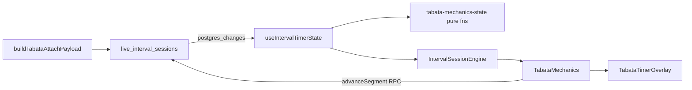
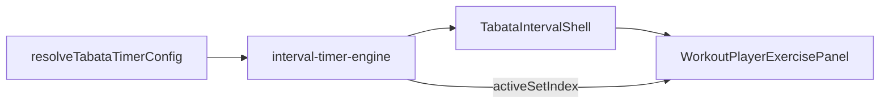

# Tabata Dual-Engine Boundary (Live vs Offline)

**Status:** Reference (2026-06-24; Batch E)  
**Related:** [unified-interval-engine.md](../../unified-interval-engine.md) · [tabata-timer-overlay-assessment.md](./tabata-timer-overlay-assessment.md)

This document defines the **intentional split** between the live-video Tabata FSM and the offline WorkoutPlayer Tabata timer. The two engines solve the same product problem with different persistence and tick models. **Do not merge them** without a dedicated architecture charter.

---

## Two engines, one product concept

| Dimension       | Live (unified interval wrapper)                                                                                                                                                                                                     | Offline (WorkoutPlayer)                                                                                   |
| --------------- | ----------------------------------------------------------------------------------------------------------------------------------------------------------------------------------------------------------------------------------- | --------------------------------------------------------------------------------------------------------- |
| **Authority**   | Postgres `live_interval_sessions.mechanics_state`                                                                                                                                                                                   | In-memory `IntervalTimerEngineState`                                                                      |
| **FSM module**  | [`tabata-mechanics-state.ts`](../../../../src/features/live-video/wrappers/interval/mechanics/tabata-mechanics-state.ts)                                                                                                            | [`interval-timer-engine.ts`](../../../../src/lib/workout-factory/interval-timer/interval-timer-engine.ts) |
| **UI shell**    | [`TabataTimerOverlay.tsx`](../../../../src/features/live-video/wrappers/interval/mechanics/TabataTimerOverlay.tsx) via [`TabataMechanics.tsx`](../../../../src/features/live-video/wrappers/interval/mechanics/TabataMechanics.tsx) | [`TabataIntervalShell.tsx`](../../../../src/components/fitness/interval-shells/TabataIntervalShell.tsx)   |
| **Tick source** | Client `setInterval(250ms)` + `segment_started_at` derive ([`useIntervalTimerState.ts`](../../../../src/features/live-video/wrappers/interval/hooks/useIntervalTimerState.ts))                                                      | `requestAnimationFrame` / engine `tick` in shell                                                          |
| **Pause**       | Global session pause → `freezeTabataMechanicsStateForPause` + RPC                                                                                                                                                                   | Local `pause` / `resume` on engine                                                                        |
| **Set logging** | Participant `useTabataWorkSetSync` → `workout_exercise_logs`                                                                                                                                                                        | `WorkoutPlayerExercisePanel` active-set highlight + manual entry                                          |
| **Round index** | `round_index` (1-based during work)                                                                                                                                                                                                 | `roundIndex` (0-based in engine; `displayRound` 1-based in UI)                                            |

---

## Segment / phase name mapping

Live `TabataSegment` and offline `IntervalTimerPhase` use different vocabularies:

| Live `segment`           | Offline `phase` | Typical UI label    |
| ------------------------ | --------------- | ------------------- |
| `idle`                   | `idle`          | Ready               |
| `setup`                  | `prepare`       | Get Ready / Prepare |
| `work`                   | `work`          | Work                |
| `rest`                   | `rest`          | Rest                |
| `done`                   | `done`          | Finished            |
| _(via `is_paused` flag)_ | `paused`        | Paused              |

Live pause is stored **on mechanics state** (`is_paused`, `elapsed_in_segment`), not as a `segment` value. Offline pause is a top-level `phase: 'paused'` with `pausedFromPhase`.

---

## Data flow (live)

---

## Data flow (offline)

---

## What may be shared (presentation only)

These utilities are **safe to share** across live and offline paths:

| Utility                                              | Location                                                                                                          |
| ---------------------------------------------------- | ----------------------------------------------------------------------------------------------------------------- |
| `formatCountdownMmSs`                                | [`@/lib/timer`](../../../../src/lib/timer/index.ts)                                                               |
| `useTimerAudioPreference` / `timer-audio-preference` | [`@/hooks/use-timer-audio-preference.ts`](../../../../src/hooks/use-timer-audio-preference.ts)                    |
| `IntervalShellAudioToggle`                           | [`IntervalShellAudioToggle.tsx`](../../../../src/components/fitness/interval-shells/IntervalShellAudioToggle.tsx) |
| `useIntervalCountdownAudio`                          | [`use-interval-countdown-audio.ts`](../../../../src/hooks/use-interval-countdown-audio.ts)                        |

Live overlay display helpers (`tabata-overlay-display.ts`, `emom-overlay-display.ts`) are **live-specific** — they read `IntervalSessionEngine` and live segment enums.

---

## Non-goals (this phase)

- **Merging FSMs** into one module used by both paths
- **Shared test vectors** between `tabata-mechanics-state.test.ts` and `interval-timer-engine` tests
- **Renaming** `amrap_reset_timer` for Tabata reset (G3.5 — separate infra PR)
- **Realtime broadcast ticks** for sub-second segment sync (G1 — platform concern)

---

## When to touch which engine

| Change                                 | Touch                                                                      |
| -------------------------------------- | -------------------------------------------------------------------------- |
| Live overlay countdown, accents, audio | `tabata-mechanics-state` + `TabataMechanics` + overlay helpers             |
| Host auto-advance, pause freeze        | `tabata-mechanics-state` + RPC `interval_advance_segment`                  |
| Offline WorkoutPlayer Tabata UX        | `interval-timer-engine` + `TabataIntervalShell`                            |
| Finalize / effective rounds            | SQL `interval_finalize_session` + `deriveTabataEffectiveRoundsForFinalize` |
| Participant auto-set logging           | `useTabataWorkSetSync` (live only)                                         |

---

## Verification

Documentation-only batch. Confirm links from:

- [tabata-timer-overlay-assessment.md](./tabata-timer-overlay-assessment.md) G3.4
- [unified-interval-engine.md](../../unified-interval-engine.md) § Dual-engine boundary
- [live-video-timers-audit.md](../../architecture/live-video-timers-audit.md)
