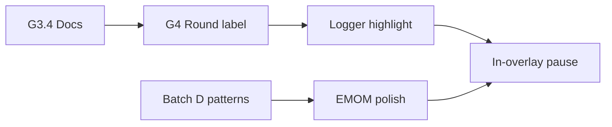

# Tabata Overlay — Remaining Work Plan

**Status:** Planning complete — Batches E–I shipped (2026-06-24); G3.5 RPC alias complete  
**Parent:** [tabata-timer-overlay-assessment.md](./tabata-timer-overlay-assessment.md) — Scope boundaries (Batches A–I complete)

This document orders the work that was **explicitly out of scope** for Batches A–D but still open in the assessment. It does not reopen closed “In” items or items intentionally deferred by product.

---

## Scope boundary status

### In scope — **complete** (Batches A–D)

| Item                     | Status | Evidence                                                                       |
| ------------------------ | ------ | ------------------------------------------------------------------------------ |
| Segment accent colors    | Done   | `tabata-overlay-display.ts`, `TabataTimerOverlay.tsx`                          |
| In-segment progress bar  | Done   | `tabataSegmentProgressRatio`, overlay progress track                           |
| Audio cues + mute toggle | Done   | `useTabataOverlayAudio`, `useTimerAudioPreference`, `IntervalShellAudioToggle` |
| Tests                    | Done   | 57+ unit tests across mechanics, overlay, work-set, formatter                  |
| Assessment doc           | Done   | `tabata-timer-overlay-assessment.md`                                           |

### Out of scope — **still open**

_None — all originally deferred overlay/logger items are complete or intentionally closed._

### Out of scope — **complete** (Batch I + G3.5, Sprint 2)

| Item                                    | Status   | Evidence                                                                         |
| --------------------------------------- | -------- | -------------------------------------------------------------------------------- |
| In-overlay pause/resume (interval-only) | **Done** | `useIntervalOverlayPause`, `IntervalOverlayHostControls`, Tabata/EMOM overlays   |
| G3.5 `interval_reset_timer` RPC alias   | **Done** | `20260924120000_interval_reset_timer_alias.sql`, `useIntervalSession.resetTimer` |
| EMOM logger active-minute highlight     | **Done** | `deriveEmomLoggerActiveSet`, lifted `useEmomActiveMinute` in participant logger  |

### Out of scope — **was open** (Sprint 2)

| Item                    | Status   | Notes                    |
| ----------------------- | -------- | ------------------------ |
| In-overlay pause/resume | **Done** | See Sprint 2 table above |

### Out of scope — **complete** (Batches E–H, Sprint 1)

| Item                                    | Status   | Evidence                                                                                   |
| --------------------------------------- | -------- | ------------------------------------------------------------------------------------------ |
| G3.4 dual-engine documentation          | **Done** | [tabata-dual-engine-boundary.md](./tabata-dual-engine-boundary.md)                         |
| `tabataRoundDisplayLabel()` extraction  | **Done** | `tabata-mechanics-state.ts`, `TabataTimerOverlay.tsx`                                      |
| Participant logger active-set highlight | **Done** | `useTabataAthleteMechanics`, `deriveTabataLoggerActiveSet`, `ParticipantWorkoutLogger.tsx` |
| EMOM overlay polish                     | **Done** | `emom-overlay-display.ts`, `useEmomOverlayAudio`, `EmomTimerOverlay.tsx`                   |

### Out of scope — **intentionally closed** (do not schedule unless product reopens)

| Item                                        | Status     | Notes                                                                                                        |
| ------------------------------------------- | ---------- | ------------------------------------------------------------------------------------------------------------ |
| `TimerDisplay` rAF / tenths on live overlay | **Closed** | Live HUD stays `formatCountdownMmSs` (MM:SS) for readability on video; assessment defers tenths deliberately |

### Related gaps (not in original scope boundaries, optional follow-ups)

| ID   | Item                                                 | Suggested batch                            |
| ---- | ---------------------------------------------------- | ------------------------------------------ |
| G3.5 | `amrap_reset_timer` RPC name for Tabata reset        | Infra cleanup — after dual-engine doc      |
| G1   | Realtime broadcast ticks (sub-second sync)           | Platform — separate from overlay polish    |
| —    | `TabataMechanics` integration / E2E tests            | QA — after logger highlight or EMOM polish |
| —    | “Prepare” vs “GET READY” label copy vs offline shell | Low priority copy parity                   |

---

## Recommended execution order

Work is ordered by **dependency**, **risk**, and **reuse of Batch D patterns**. Each batch is sized for a single PR where possible.



### Batch E — Dual-engine boundary doc (G3.4) — **Complete**

**Priority:** P3 — maintainability  
**Effort:** Small (docs only)  
**Blocks:** Safer refactors in F–I; clarifies what must _not_ be unified

**Deliverables:**

1. New section in [unified-interval-engine.md](../../unified-interval-engine.md) or `docs/fitness/timers/live-video/tabata-dual-engine-boundary.md`:
   - Live path: `tabata-mechanics-state.ts` + Postgres `mechanics_state` + `useIntervalTimerState` tick
   - Offline path: `interval-timer-engine.ts` + `WorkoutPlayer` / `TabataIntervalShell`
   - Explicit non-goals: no shared FSM merge in this phase
2. Table mapping segment names (`setup`/`work`/`rest` vs `prepare`/`work`/`rest`)
3. Pointer to shared _presentation_ utilities only (`formatCountdownMmSs`, audio preference)
4. Update assessment G3.4 row to **Resolved (Batch E)**

**Verification:** Doc review only; link from assessment + live-video-timers-audit.

---

### Batch F — `tabataRoundDisplayLabel()` (G4 optional) — **Complete**

**Priority:** P3 — maintainability  
**Effort:** Small  
**Depends on:** None (Batch E helpful but not required)

**Deliverables:**

1. `tabataRoundDisplayLabel(state: TabataMechanicsState): string | null` in `tabata-mechanics-state.ts` (mirror `emomMinuteDisplayLabel`)
2. `TabataTimerOverlay` uses helper instead of inline `Round ${…} / ${…}`
3. Unit tests in `tabata-mechanics-state.test.ts`
4. Assessment G4 secondary-label row → **Resolved**

**Verification:**

```bash
pnpm exec vitest run src/features/live-video/wrappers/interval/mechanics/tabata-mechanics-state.test.ts \
  src/features/live-video/wrappers/interval/mechanics/TabataTimerOverlay.test.tsx
```

---

### Batch G — Participant logger active-set highlight — **Complete**

**Priority:** P2 — product UX  
**Effort:** Medium  
**Depends on:** Batch C work-set sync (done); benefits from Batch F label helper for consistency

**Problem:** Participants receive auto-logged sets (`useTabataWorkSetSync`) but the tier-3 logger does not visually mark which set row matches the current work round.

**Deliverables:**

1. Expose current Tabata `round_index` (and optionally segment) to `ParticipantWorkoutLogger` — via interval session context, deck phase + `live_interval_sessions` subscription, or thin hook parallel to `useEmomAthleteLogging`
2. When `phase === 'tabata'` and segment is `work`, pass `activeSetIndex={round_index - 1}` (or `round_index` if 1-based row keys match `set_number`) into set row rendering
3. Reuse offline highlight tokens from `WorkoutPlayerExercisePanel` (`activeWork` / rest styling) for visual parity
4. Tests: pure helper for “active set number from mechanics state” + component test if logger rows are testable

**Out of scope for this batch:** Host logger changes; EMOM minute highlighting (separate if needed).

**Verification:** Manual — participant in live Tabata sees current round row highlighted during work; auto-upsert row matches highlight.

---

### Batch H — EMOM overlay polish (parity with Tabata Batch D) — **Complete**

**Priority:** P2 — UX parity across interval types  
**Effort:** Medium  
**Depends on:** Batch D patterns (done); consider extracting shared `interval-overlay-display` helpers if duplication exceeds ~40 lines

**Deliverables:**

1. `emom-overlay-display.ts` (or generalized `interval-overlay-display.ts` with type param) — minute/segment accents, progress ratio, cue key
2. `useEmomOverlayAudio` in `EmomMechanics` (same stack as `useTabataOverlayAudio`)
3. `EmomTimerOverlay` — progress bar, accents, audio toggle (reuse `IntervalShellAudioToggle` + `useTimerAudioPreference`)
4. `EmomTimerOverlay.test.tsx`
5. Update assessment / audit EMOM rows

**Explicitly out:** In-overlay pause (same deferral as Tabata).

**Verification:**

```bash
pnpm exec vitest run src/features/live-video/wrappers/interval/mechanics/EmomTimerOverlay.test.tsx
# Manual: EMOM live session — accents, progress, audio mute
```

---

### Batch I — In-overlay pause/resume (deferred product decision) — **Complete**

**Priority:** P1–P2 — product completeness vs complexity  
**Effort:** Large  
**Depends on:** Batches E (doc) and stable pause model (`useTabataBlockPauseSync`); recommend **after** Batches G–H unless host/participant feedback demands it sooner

**Current behavior:**

- **Global** session pause → `useTabataBlockPauseSync` freezes mechanics via RPC
- **Host** Start/Reset → `TabataHostActions` in nav strip
- **Offline** shell → in-card Pause/Resume on local machine

**Open questions (resolve before implementation):**

1. Should in-overlay pause affect **only** the interval block or the whole live session?
2. Participants: read-only pause indicator vs clickable resume (likely host-only)?
3. Interaction with global pause: duplicate controls or hide overlay pause when session paused?

**If approved — deliverables:**

1. Overlay Pause/Resume control (host-only) calling existing freeze/unfreeze + `advanceSegment` checkpoint path
2. Paused styling already partially present (`tabataSegmentPhaseAccentClass` `{ isPaused }`)
3. Audio inactive while paused (already in `tabataOverlayAudioIsActive`)
4. Tests for pause UI + no double-freeze with global pause
5. Assessment G2 in-shell pause row → **Resolved**; maturity → ~98%

**Verification:** Manual matrix — overlay pause, global pause, resume order, participant late-join during pause.

---

## What not to schedule

| Item                                     | Reason                                                                      |
| ---------------------------------------- | --------------------------------------------------------------------------- |
| Live overlay tenths / `TimerDisplay` rAF | Explicitly out of scope; video HUD readability                              |
| Merging live + offline Tabata engines    | G3.4 documents boundary; unification is a multi-sprint architecture project |
| Realtime broadcast ticks (G1)            | Infrastructure; not overlay-local                                           |

---

## Suggested PR sequence

| Order | Batch | PR title (suggested)                                         | Est. size          |
| ----- | ----- | ------------------------------------------------------------ | ------------------ |
| 1     | E     | docs: Tabata live vs offline engine boundary                 | ~1 file, doc       |
| 2     | F     | refactor: tabataRoundDisplayLabel helper                     | ~3 files, small    |
| 3     | G     | feat: highlight active Tabata set in participant logger      | ~4–6 files, medium |
| 4     | H     | feat: EMOM live overlay polish (Batch D parity)              | ~6–8 files, medium |
| 5     | I     | feat: Tabata in-overlay pause (host) — _if product approves_ | ~5–7 files, large  |

Optional parallel track after Batch E: **G3.5** RPC alias (`interval_reset_timer`) as infra-only PR — no UI dependency.

---

## Success criteria (program complete)

When Batches E–H are done (and I if approved):

- Assessment maturity **~98%** with G2 pause row either resolved or explicitly “won’t do”
- G3.4 **Resolved**; G4 round label **Resolved**
- EMOM and Tabata live overlays at visual/feature parity (except intentional MM:SS-only countdown)
- Participant logger reflects current Tabata work round
- No new scope creep into offline engine merge or sub-second broadcast ticks without separate charter

---

## References

- [tabata-timer-overlay-assessment.md](./tabata-timer-overlay-assessment.md)
- [live-video-timers-audit.md](../../architecture/live-video-timers-audit.md)
- [unified-interval-engine.md](../../unified-interval-engine.md)
- Offline reference: `TabataIntervalShell.tsx`, `WorkoutPlayerExercisePanel.tsx`
- Live EMOM reference: `EmomTimerOverlay.tsx`, `emom-mechanics-state.ts`
