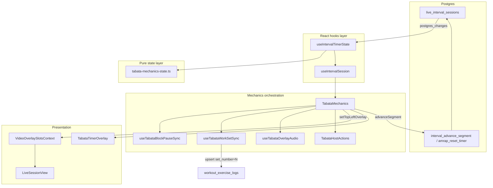

# Tabata Timer Overlay — Architectural Assessment & Gap Analysis

**Status:** Assessment (2026-06-24; last updated 2026-06-25 — Batches A–I + Phase L1–L3 complete)  
**Primary subject:** [`TabataTimerOverlay.tsx`](../../../../src/features/live-video/wrappers/interval/mechanics/TabataTimerOverlay.tsx)  
**Scope:** The overlay component and its full live-video dependency chain (engine → mechanics → slot injection → render)

**Related docs:**

- [Unified Interval Engine](../../unified-interval-engine.md)
- [Live interval preset overlay plan](./live-interval-preset-overlay-plan.md) — Phase L1–L3 (preset HUD, circuit subtitles, Smart Deck host launch)
- [Live Video Timers Audit (2026-05-20)](../../architecture/live-video-timers-audit.md) — partially superseded by Tabata Phase 1
- [AMRAP wrapper README](../../amrap-wrapper-readme.md)

---

## Executive summary

`TabataTimerOverlay` is a **presentational component** that renders the top-left Agora video HUD for live Tabata blocks. It does not own timer logic, subscriptions, or host controls. All authoritative state flows through `IntervalSessionEngine`, which is assembled by `useIntervalSession` from Postgres (`live_interval_sessions.mechanics_state`) and a client-side 250 ms tick loop.

The overlay is **functionally wired and production-shaped** for core countdown UX (segment label, round counter, MM:SS display, finished state). It sits at the leaf of a well-layered polymorphic interval architecture (`BaseIntervalWrapper` → `TabataMechanics` → slot context → overlay).

**Maturity:** UI shell **~100% complete** for HUD + participant logger parity; only intentionally closed items remain (tenths, G1 broadcast ticks).

| Layer                             | Maturity                | Notes                                                                           |
| --------------------------------- | ----------------------- | ------------------------------------------------------------------------------- |
| Overlay presentation              | Shipped (polished)      | Segment accents, progress bar, audio toggle; `formatCountdownMmSs`              |
| Segment state machine             | Shipped + tested        | `tabata-mechanics-state.ts`                                                     |
| Host auto-advance                 | Shipped                 | 200 ms poll in `TabataMechanics`                                                |
| Block pause sync                  | Shipped                 | `useTabataBlockPauseSync`                                                       |
| Parametric attach                 | Shipped + tested        | `buildTabataAttachPayload`                                                      |
| Type guard / overlay deps         | **Resolved (Batch A)**  | `isTabataMechanicsState()`; EMOM-parity overlay mounting                        |
| Shared countdown formatter        | **Resolved (Batch B)**  | `formatCountdownMmSs` in `@/lib/timer`                                          |
| Overlay/component tests           | **Resolved (Batch B)**  | `TabataTimerOverlay.test.tsx` (17+ cases incl. preset fixtures)                 |
| Auto set logging                  | **Resolved (Batch C)**  | `useTabataWorkSetSync` — work entry → `set_number = round_index`                |
| Finalize effective_rounds         | **Resolved (Batch C)**  | `deriveTabataEffectiveRoundsForFinalize` mirrors SQL                            |
| Segment accent / progress / audio | **Resolved (Batch D)**  | `tabata-overlay-display.ts`, `useTabataOverlayAudio`                            |
| Dual-engine boundary doc          | **Resolved (Batch E)**  | [tabata-dual-engine-boundary.md](./tabata-dual-engine-boundary.md)              |
| Preset-aware HUD header/subtitle  | **Resolved (L1–L2)**    | `resolveTabataOverlayHeader` / `resolveTabataOverlaySubtitle`                   |
| Host Smart Deck launch UX         | **Resolved (L3)**       | Primary `▶ Launch {preset}` + Quick Launch dropdown in `SessionControlsActions` |
| Participant logger active-set     | **Resolved (Batch G)**  | `useTabataAthleteMechanics` + `deriveTabataLoggerActiveSet`                     |
| EMOM overlay parity               | **Resolved (Batch H)**  | `emom-overlay-display.ts`, `useEmomOverlayAudio`                                |
| In-overlay pause/resume           | **Resolved (Batch I)**  | `useIntervalOverlayPause`, `IntervalOverlayHostControls`                        |
| EMOM logger minute highlight      | **Resolved (Sprint 2)** | `deriveEmomLoggerActiveSet`, lifted `useEmomActiveMinute`                       |
| Offline feature parity            | **Complete (in-scope)** | Interval-only overlay pause matches offline shell control model                 |

---

## Dependency map

### Direct imports (TabataTimerOverlay)

| Dependency                                                                                                               | Role                                                                   |
| ------------------------------------------------------------------------------------------------------------------------ | ---------------------------------------------------------------------- |
| [`interval-engine.ts`](../../../../src/features/live-video/wrappers/interval/types/interval-engine.ts)                   | `IntervalSessionEngine` type contract                                  |
| [`tabata-mechanics-state.ts`](../../../../src/features/live-video/wrappers/interval/mechanics/tabata-mechanics-state.ts) | `isTabataMechanicsState()` type guard                                  |
| [`tabata-overlay-display.ts`](../../../../src/features/live-video/wrappers/interval/mechanics/tabata-overlay-display.ts) | Preset header/subtitle, segment accent, progress, audio-active helpers |
| [`@/lib/timer`](../../../../src/lib/timer/index.ts)                                                                      | `formatCountdownMmSs` for MM:SS display                                |
| [`IntervalShellAudioToggle`](../../../../src/components/fitness/interval-shells/IntervalShellAudioToggle.tsx)            | Optional mute toggle (when `onToggleAudio` provided)                   |

### Upstream consumers

| File                                                                                                         | Relationship                                          |
| ------------------------------------------------------------------------------------------------------------ | ----------------------------------------------------- |
| [`TabataMechanics.tsx`](../../../../src/features/live-video/wrappers/interval/mechanics/TabataMechanics.tsx) | Sole consumer; mounts overlay via `setTopLeftOverlay` |

### Full runtime chain



### Transitive dependency inventory

| File                                                                                                                       | Responsibility                                                                                              |
| -------------------------------------------------------------------------------------------------------------------------- | ----------------------------------------------------------------------------------------------------------- |
| [`BaseIntervalWrapper.tsx`](../../../../src/features/live-video/wrappers/interval/BaseIntervalWrapper.tsx)                 | Generic shell: session hook, results modal, rail context                                                    |
| [`useIntervalSession.ts`](../../../../src/features/live-video/wrappers/interval/hooks/useIntervalSession.ts)               | Composes engine: RPCs (`startTimer`, `resetTimer`, `advanceSegment`), participants, page state              |
| [`useIntervalTimerState.ts`](../../../../src/features/live-video/wrappers/interval/hooks/useIntervalTimerState.ts)         | Realtime subscription; derives `remainingSec`, `segmentLabel`, `timerPhase`                                 |
| [`tabata-mechanics-state.ts`](../../../../src/features/live-video/wrappers/interval/mechanics/tabata-mechanics-state.ts)   | Segment FSM: parse, remaining, advance, pause freeze/unfreeze                                               |
| [`useTabataBlockPauseSync.ts`](../../../../src/features/live-video/wrappers/interval/mechanics/useTabataBlockPauseSync.ts) | Syncs global session pause/resume → mechanics_state checkpoint                                              |
| [`useTabataWorkSetSync.ts`](../../../../src/features/live-video/wrappers/interval/mechanics/useTabataWorkSetSync.ts)       | Participant auto-upsert on work-segment entry (`set_number = round_index`)                                  |
| [`useTabataOverlayAudio.ts`](../../../../src/features/live-video/wrappers/interval/mechanics/useTabataOverlayAudio.ts)     | Countdown audio cues + persisted mute preference                                                            |
| [`tabata-overlay-display.ts`](../../../../src/features/live-video/wrappers/interval/mechanics/tabata-overlay-display.ts)   | Pure preset/subtitle + accent/progress/cue-key helpers for overlay                                          |
| [`tabata-work-set-sync.ts`](../../../../src/features/live-video/wrappers/interval/mechanics/tabata-work-set-sync.ts)       | Pure trigger/dedup/copy helpers for work-set sync                                                           |
| [`TabataHostActions.tsx`](../../../../src/features/live-video/wrappers/interval/mechanics/TabataHostActions.tsx)           | Host Start/Reset buttons (nav bar)                                                                          |
| [`SessionControlsActions.tsx`](../../../../src/features/live-video/shells/huddle/SessionControlsActions.tsx)               | Smart Deck primary launch + Quick Launch overrides (`SessionControlsActions`)                               |
| [`buildTabataAttachPayload.ts`](../../../../src/features/live-video/wrappers/interval/utils/buildTabataAttachPayload.ts)   | Deck attach: `resolveTabataTimerConfig` → initial `mechanics_state`                                         |
| [`VideoOverlaySlotsContext.tsx`](../../../../src/features/live-video/contexts/VideoOverlaySlotsContext.tsx)                | Slot API: `topLeftOverlay`, `topRightOverlay`, etc.                                                         |
| [`HostNavActionsContext.tsx`](../../../../src/features/live-video/contexts/HostNavActionsContext.tsx)                      | Host control strip (Start/Reset)                                                                            |
| [`LiveSessionView.tsx`](../../../../src/features/live-video/shells/huddle/LiveSessionView.tsx)                             | Mounts `BaseIntervalWrapper` + `TabataMechanics`; renders `{topLeftOverlay}`; suppresses legacy placeholder |
| [`ActivePhaseOverlays.tsx`](../../../../src/features/live-video/shells/huddle/ActivePhaseOverlays.tsx)                     | Legacy 4:00 placeholder; suppressed when `intervalWrapperKind === 'tabata'`                                 |

### Parallel reference implementations (not in overlay chain)

| Asset                                                                                                          | Relevance                                                        |
| -------------------------------------------------------------------------------------------------------------- | ---------------------------------------------------------------- |
| [`EmomTimerOverlay.tsx`](../../../../src/features/live-video/wrappers/interval/mechanics/EmomTimerOverlay.tsx) | Structural twin; shares `formatCountdownMmSs`                    |
| [`AmrapTimerOverlay.tsx`](../../../../src/features/amrap/components/AmrapTimerOverlay.tsx)                     | Same visual shell; simpler data (no round/segment)               |
| [`TabataIntervalShell.tsx`](../../../../src/components/fitness/interval-shells/TabataIntervalShell.tsx)        | Offline WorkoutPlayer shell — richer UX (progress, audio, pause) |
| [`interval-timer-engine.ts`](../../../../src/lib/workout-factory/interval-timer/interval-timer-engine.ts)      | Offline segment engine — **not shared** with live mechanics      |

---

## Component contract

### Props

```tsx
{
  engine: IntervalSessionEngine;
  audioEnabled?: boolean;
  onToggleAudio?: () => void;
}
```

### Fields consumed

| Engine field     | Usage in overlay                                                |
| ---------------- | --------------------------------------------------------------- |
| `timerPhase`     | `'finished'` → show "Finished" instead of segment label         |
| `segmentLabel`   | Uppercased phase text ("WORK", "REST", "GET READY", "Paused")   |
| `remainingSec`   | Large countdown via `formatCountdownMmSs`                       |
| `blockSnapshot`  | `format_params` + `exercises` for preset header and subtitle    |
| `mechanicsState` | Narrowed via `isTabataMechanicsState()` for subtitle + progress |

### Subtitle logic (Phase L1–L3)

Subtitle copy is driven by `resolveTabataOverlaySubtitle` in `tabata-overlay-display.ts`:

- **Pre-start (`setup` / `idle`):** hidden on the participant HUD (L2 contract); static W/R available only via `includePreStart: true` for host-side helpers if needed.
- **Single-exercise work/rest:** same static W/R line.
- **Multi-exercise circuit work/rest:** dynamic line, e.g. `Round 2 of 12 · Mountain Climbers`.
- **Legacy sessions** (no `format_params`): header falls back to **Tabata**; subtitle derives W/R from `mechanics_state`.

Header label uses `resolveTabataOverlayHeader` → `resolveIntervalPresetLabel` (strict 20/10 → **Tabata**, Classic HIIT → **Classic HIIT**, custom W/R → **Intervals**).

### Rendering & a11y

- Wrapper: `pointer-events-none absolute inset-0 z-[43]` — full-stage hit area passthrough
- Card: `pointer-events-auto` top-left glass panel (matches EMOM/AMRAP)
- Countdown: `aria-live="polite"` for screen reader updates

---

## Data flow: how the countdown reaches the overlay

1. **Attach:** Host selects Tabata deck card → `buildTabataAttachPayload` writes initial `mechanics_state` (setup, 10 s default) + `block_snapshot` to `live_interval_sessions`.

2. **Start:** Host clicks Start → `useIntervalSession.startTimer` → `beginTabataSegmentTimer` → RPC `interval_advance_segment` sets `segment_started_at`.

3. **Tick (all clients):** `useIntervalTimerState` runs `setInterval(250ms)` calling `deriveTabataSegmentRemainingSec(mechanicsState, Date.now())`. Paused segments skip the interval.

4. **Auto-advance (host only):** `TabataMechanics` polls every 200 ms; when `isTabataSegmentElapsed`, calls `computeNextTabataMechanicsState` → `advanceSegment` RPC.

5. **Pause:** Global session pause triggers `useTabataBlockPauseSync` → `freezeTabataMechanicsStateForPause` → durable checkpoint via `advanceSegment`. Label becomes "Paused" via `tabataSegmentLabel`.

6. **Overlay refresh:** `TabataMechanics` effect calls `setTopLeftOverlay(<TabataTimerOverlay engine={…} />)` when tick-driving deps change.

---

## Architecture assessment

### Strengths

1. **Separation of concerns.** The overlay is a pure view over `IntervalSessionEngine`. Timer authority lives in Postgres + pure functions, not React state inside the overlay.

2. **Deterministic late join.** Any client can reconstruct segment remaining time from `segment_started_at` + frozen config in `mechanics_state` — matches the hybrid model in [unified-interval-engine.md](../../unified-interval-engine.md).

3. **Polymorphic shell.** Tabata reuses `BaseIntervalWrapper`, `useIntervalSession`, and slot injection identically to EMOM/AMRAP — low duplication at the wrapper tier.

4. **Legacy coexistence.** `ActivePhaseOverlays` placeholder is explicitly suppressed when the unified Tabata wrapper is attached, avoiding double timers.

5. **Tested core FSM.** `tabata-mechanics-state.test.ts` covers parse, advance, pause freeze/resume, and setup segment — the logic the overlay displays.

### Weaknesses & risks

1. **z-index collision surface.** Overlay, legacy `ActivePhaseOverlays`, and other slots all use `z-[43]`. Slot ordering depends on render order in `LiveSessionView`, not explicit layering policy.

2. **Dual Tabata engines.** Documented in [tabata-dual-engine-boundary.md](./tabata-dual-engine-boundary.md) (Batch E); shared test vectors remain a future architecture project, not an overlay blocker.

3. **No `TabataMechanics` integration tests.** Overlay and FSM are unit-tested; slot injection path is manual-smoke only.

**Resolved (Batch A / Batch B):** overlay refresh staleness (`engine` + `round_index` deps), `isTabataMechanicsState()` guard, triplicated `fmt()`, missing overlay tests, outdated audit doc.

---

## Gap analysis

### G1 — Product / mechanics gaps (system-level, not overlay-local)

| Gap                                | Spec reference                                                   | Current state                                                                                                                         | Impact                                                                                 |
| ---------------------------------- | ---------------------------------------------------------------- | ------------------------------------------------------------------------------------------------------------------------------------- | -------------------------------------------------------------------------------------- |
| Auto set logging on work entry     | [unified-interval-engine §4.3](../../unified-interval-engine.md) | **Resolved (Batch C)** — `useTabataWorkSetSync`                                                                                       | Participants auto-receive `workout_exercise_logs` per work round                       |
| Participant logger active-set row  | Offline `WorkoutPlayerExercisePanel`                             | **Resolved (Batch G)** — `useTabataAthleteMechanics`                                                                                  | Current work round row highlighted during live Tabata                                  |
| Realtime broadcast ticks           | [unified-interval-engine §4.1](../../unified-interval-engine.md) | **Not implemented** — postgres_changes + client derive only                                                                           | Acceptable for MVP; sub-second segment transitions depend on host poll + DB round-trip |
| `rounds_completed` materialization | Unified finalize seam                                            | Derived at finalize from mechanics, not live overlay concern                                                                          | Low impact on overlay                                                                  |
| Participant-facing pause/resume    | Offline `TabataIntervalShell`                                    | **Host-only (Batch I)** — overlay Pause/Resume via `useIntervalOverlayPause`; participants see frozen state via Realtime, no controls |

### G2 — UX gaps (overlay vs offline shell)

| Feature                                    | Offline `TabataIntervalShell` | Live `TabataTimerOverlay`                                                   |
| ------------------------------------------ | ----------------------------- | --------------------------------------------------------------------------- |
| Segment phase styling (work vs rest color) | Primary accent on phase label | **Resolved (Batch D)** — emerald/amber/sky accents                          |
| Elapsed / progress within segment          | `TimerDisplay` bar            | **Resolved (Batch D)** — thin progress bar from `remainingSec` / `totalSec` |
| Audio cues                                 | `IntervalShellAudioToggle`    | **Resolved (Batch D)** — `useTabataOverlayAudio` + toggle                   |
| In-shell pause/resume                      | Yes                           | **Resolved (Batch I)** — host overlay Pause/Resume (interval-only)          |
| Round display                              | Yes                           | Yes                                                                         |
| Setup / Get Ready                          | "Prepare" label               | "GET READY" via `segmentLabel`                                              |

### G3 — Code quality / maintainability gaps

| ID   | Gap                                       | Status                                                                                                       |
| ---- | ----------------------------------------- | ------------------------------------------------------------------------------------------------------------ |
| G3.1 | Triplicated `fmt()`                       | **Resolved (Batch B)** — `formatCountdownMmSs` in `@/lib/timer`                                              |
| G3.2 | No `isTabataMechanicsState()` guard       | **Resolved (Batch A)**                                                                                       |
| G3.3 | No overlay tests                          | **Resolved (Batch B)** — `TabataTimerOverlay.test.tsx`                                                       |
| G3.4 | Dual Tabata engines                       | **Resolved (Batch E)** — [tabata-dual-engine-boundary.md](./tabata-dual-engine-boundary.md)                  |
| G3.5 | `amrap_reset_timer` name for Tabata reset | **Resolved (Sprint 2)** — `interval_reset_timer` alias RPC                                                   |
| G3.6 | Outdated audit doc                        | **Resolved (Batch B)** — [live-video-timers-audit.md](../../architecture/live-video-timers-audit.md) updated |

### G5 — Interval preset semantics (overlay + host UX)

| Gap                                                 | Status                                                                                                                                                                   |
| --------------------------------------------------- | ------------------------------------------------------------------------------------------------------------------------------------------------------------------------ |
| Hardcoded **Tabata** HUD label for non-20/10 blocks | **Resolved (L1–L3)** — `resolveTabataOverlayHeader` + `resolveTabataOverlaySubtitle`; see [live-interval-preset-overlay-plan.md](./live-interval-preset-overlay-plan.md) |
| Host deck launch without preset context             | **Resolved (L3)** — Smart Deck primary `▶ Launch {preset}` (tabata, AMRAP, or EMOM) + Quick Launch strict Tabata override                                                |

### G4 — Parity with EMOM overlay (nearest sibling)

| Concern          | EMOM                        | Tabata                                | Delta                  |
| ---------------- | --------------------------- | ------------------------------------- | ---------------------- |
| Visual shell     | Identical classes           | Identical classes                     | None                   |
| Type guard       | `isEmomState()` (local)     | `isTabataMechanicsState()` (exported) | **Resolved (Batch A)** |
| Secondary label  | `emomMinuteDisplayLabel()`  | `resolveTabataOverlaySubtitle()`      | **Resolved (L1–L2)**   |
| Overlay deps     | Includes full `engine`      | Includes full `engine`                | **Resolved (Batch A)** |
| Segment in deps  | `minute_index`, `is_paused` | `round_index`, `is_paused`            | **Resolved (Batch A)** |
| Countdown format | `formatCountdownMmSs`       | `formatCountdownMmSs`                 | **Resolved (Batch B)** |

---

## Comparison: live overlay vs legacy placeholder

When the unified wrapper is **not** attached, `ActivePhaseOverlays` still shows a Tabata HUD with:

- Hardcoded `PLACEHOLDER_TABATA_TOTAL_MS = 4 * 60 * 1000`
- Block elapsed countdown (session state machine), not segment-aware work/rest
- Same visual position (`top-4 left-4`, `z-[43]`)

When the unified wrapper **is** attached (`suppressTabataPlaceholder={true}`), `TabataTimerOverlay` replaces that placeholder with segment-accurate countdown. This is the intended migration path documented inline in `ActivePhaseOverlays`.

---

## Test coverage matrix

| Area                                      | Tests       | Location                                  |
| ----------------------------------------- | ----------- | ----------------------------------------- |
| Mechanics state FSM                       | Yes         | `tabata-mechanics-state.test.ts`          |
| Attach payload / parametric binding       | Yes         | `buildTabataAttachPayload.test.ts`        |
| `TabataTimerOverlay` render               | **Yes**     | `TabataTimerOverlay.test.tsx` (17+ cases) |
| `TabataHostActions` Start/Reset           | **Yes**     | `TabataHostActions.test.tsx`              |
| `tabata-overlay-display` helpers          | **Yes**     | `tabata-overlay-display.test.ts`          |
| `useTabataWorkSetSync` / work-set helpers | **Yes**     | `useTabataWorkSetSync.test.ts`            |
| `deriveTabataEffectiveRoundsForFinalize`  | **Yes**     | `tabata-mechanics-state.test.ts`          |
| `EmomTimerOverlay` render                 | **Yes**     | `EmomTimerOverlay.test.tsx` (9 cases)     |
| `emom-overlay-display` helpers            | **Yes**     | `emom-overlay-display.test.ts`            |
| `TabataMechanics` integration             | **No**      | —                                         |
| `useIntervalTimerState` Tabata tick       | **No**      | —                                         |
| E2E live Tabata flow                      | **Unknown** | No dedicated spec found                   |

Suggested overlay unit tests — **implemented in Batch B; extended in Batch D and L1–L3:**

1. Renders "Finished" when `timerPhase === 'finished'`.
2. Subtitle hidden during `setup` / `idle` on participant HUD (Classic HIIT header still visible).
3. Dynamic circuit subtitle during work (`Round N of M · exercise`).
4. Formats `remainingSec` as `00:07` / `01:05`.
5. Exposes `aria-live="polite"` on countdown element.
6. Work/rest segment accent classes on phase label.
7. Progress fill width at ~50% when half elapsed.
8. Audio toggle mute/unmute `aria-label` when `onToggleAudio` provided.
9. Preset headers: Tabata (strict), Classic HIIT, Intervals (custom).

---

## Recommended priorities

### P0 — Correctness (completed, Batch A)

1. ~~Add `tabataState?.round_index` to `TabataMechanics` overlay effect deps.~~
2. ~~Introduce `isTabataMechanicsState()` type guard; remove non-null assertions in overlay.~~

### P1 — Product completeness (completed, Batch C)

1. ~~Implement Tabata auto-set logging on work-segment entry.~~ — `useTabataWorkSetSync` in `TabataMechanics`
2. ~~Verify finalize `effective_rounds` for Tabata.~~ — `deriveTabataEffectiveRoundsForFinalize` mirrors `interval_finalize_session` SQL

### P2 — UX polish (completed, Batch D)

1. ~~Segment-dependent accent (e.g. green work / amber rest) — optional, matches offline shell.~~
2. ~~Optional segment progress ring using `remainingSec` / `totalSec` from engine.~~
3. ~~Consider audio hook integration if offline parity is a goal.~~

### P3 — Maintainability (completed, Batch B)

1. ~~Extract shared countdown formatter.~~
2. ~~Add overlay component tests.~~
3. ~~Update [live-video-timers-audit.md](../../architecture/live-video-timers-audit.md) Tabata row.~~

---

## File index (quick reference)

```
src/features/live-video/wrappers/interval/
├── mechanics/
│   ├── TabataTimerOverlay.tsx      ← subject
│   ├── TabataTimerOverlay.test.tsx
│   ├── TabataMechanics.tsx         ← mounts overlay
│   ├── TabataHostActions.tsx
│   ├── TabataHostActions.test.tsx
│   ├── tabata-mechanics-state.ts
│   ├── tabata-mechanics-state.test.ts
│   ├── tabata-overlay-display.ts
│   ├── tabata-overlay-display.test.ts
│   ├── tabata-work-set-sync.ts
│   ├── useTabataAthleteMechanics.ts
│   ├── useTabataOverlayAudio.ts
│   ├── useTabataWorkSetSync.ts
│   ├── useTabataWorkSetSync.test.ts
│   └── useTabataBlockPauseSync.ts
├── hooks/
│   ├── useIntervalSession.ts
│   └── useIntervalTimerState.ts
├── types/
│   └── interval-engine.ts
├── utils/
│   ├── buildTabataAttachPayload.ts
│   └── buildTabataAttachPayload.test.ts
└── BaseIntervalWrapper.tsx

src/features/live-video/
├── contexts/VideoOverlaySlotsContext.tsx
└── shells/huddle/LiveSessionView.tsx

src/features/amrap/components/AmrapTimerOverlay.tsx   ← visual reference
src/components/fitness/interval-shells/TabataIntervalShell.tsx  ← offline reference
```

---

## Verification commands

```bash
# Tabata mechanics + overlay + work-set sync + display helpers
pnpm exec vitest run \
  src/features/live-video/wrappers/interval/mechanics/tabata-mechanics-state.test.ts \
  src/features/live-video/wrappers/interval/mechanics/useTabataWorkSetSync.test.ts \
  src/features/live-video/wrappers/interval/mechanics/tabata-overlay-display.test.ts \
  src/features/live-video/wrappers/interval/mechanics/TabataTimerOverlay.test.tsx \
  src/features/live-video/wrappers/interval/mechanics/TabataHostActions.test.tsx \
  src/features/live-video/wrappers/interval/utils/buildTabataAttachPayload.test.ts

# Broader interval wrapper regression
pnpm exec vitest run src/features/live-video/wrappers/interval
```

---

## Assessment metadata

| Item                              | Value                                                                                                            |
| --------------------------------- | ---------------------------------------------------------------------------------------------------------------- |
| Assessment date                   | 2026-06-24                                                                                                       |
| Last updated                      | 2026-06-25 (Phase L1–L3 preset overlay + Smart Deck host launch)                                                 |
| Lines in `TabataTimerOverlay.tsx` | ~125                                                                                                             |
| Direct dependencies               | `interval-engine`, `tabata-mechanics-state`, `tabata-overlay-display`, `@/lib/timer`, `IntervalShellAudioToggle` |
| Transitive files in live chain    | 16 primary                                                                                                       |
| Overlay component tests           | 17+ (`TabataTimerOverlay.test.tsx`)                                                                              |
| State machine unit tests          | Yes                                                                                                              |
