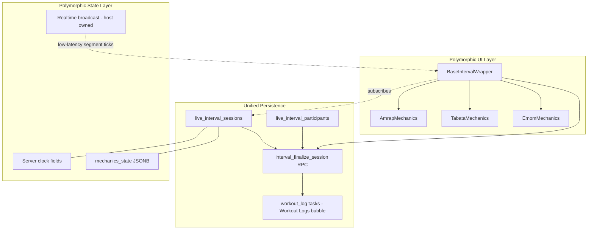

# Unified Interval Engine — Polymorphic Interval Architecture

Status: **Phase 0 implemented** (rename + polymorphic wrapper shell; Tabata/EMOM mechanics deferred)
Scope: Live-video interval blocks — AMRAP (shipped), Tabata, EMOM, Custom (e.g. 40/20s), Standard sets.
Goal: DRY the **persistence + finalize/auto-save** backbone while keeping **interval mechanics polymorphic** so we never force Tabata into an AMRAP-shaped hole.

Related source:

- [`supabase/migrations/20260801120000_amrap_session_tables_and_rpcs.sql`](../../supabase/migrations/20260801120000_amrap_session_tables_and_rpcs.sql)
- [`supabase/migrations/20260902120000_amrap_autosave_workout_logs.sql`](../../supabase/migrations/20260902120000_amrap_autosave_workout_logs.sql)
- [`supabase/migrations/20260903120000_amrap_autosave_merge_actuals.sql`](../../supabase/migrations/20260903120000_amrap_autosave_merge_actuals.sql)
- [`src/features/amrap/`](../../src/features/amrap/)
- [`src/lib/workout-factory/interval-timer/`](../../src/lib/workout-factory/interval-timer/)
- [`docs/fitness/amrap-wrapper-readme.md`](./amrap-wrapper-readme.md)

---

## 1. Problem statement

AMRAP shipped as a **vertically integrated silo**: `amrap_sessions`, `amrap_participants`, `amrap_session_rounds`, plus `amrap_*` RPCs and a dedicated `AmrapWrapper`. The **finalize → Workout Logs** auto-save (lock results, build per-participant `workout_log`, merge `workout_exercise_logs` actuals) is generically useful, but it currently lives inside `amrap_finalize_session` and is hard-keyed to AMRAP tables.

Tabata, EMOM, and Custom intervals share **~80% of the persistence concerns** (durable session, roster, block snapshot, finalize, auto-save, actuals merge) but differ sharply in **mechanics**:

| Dimension       | AMRAP                                | Tabata / EMOM / Custom                |
| --------------- | ------------------------------------ | ------------------------------------- | ------ |
| Time model      | Open clock, single cap               | Strictly segmented (work/rest cycles) |
| Round source    | Athlete decides (manual "Log Round") | Engine-driven, fixed `rounds`         |
| Set growth      | Unbounded, grows as rounds logged    | Pre-known: `rounds` sets per exercise |
| Logging trigger | Manual tap per round                 | Auto-advance on work-phase entry      |
| "Position"      | `elapsed since work_started_at`      | `(roundIndex, segment: work           | rest)` |

**Design tension:** unify the boring 80% (DB + finalize) **without** flattening the 20% that is genuinely polymorphic (timer UI, set-duplication, round semantics).

**Non-goal:** This doc does not rewrite AMRAP behavior or migrate live data. It defines the target shape so subsequent PRs converge instead of forking again.

---

## 2. Layered architecture overview



Three layers, each with a clear ownership boundary:

1. **Unified persistence** — one table family, one finalize RPC. Type-agnostic.
2. **Polymorphic state** — a hybrid of **typed server-clock columns** (durable, authoritative) and a **`mechanics_state` JSONB** (type-specific position), plus **Realtime broadcast** for sub-second ticks.
3. **Polymorphic UI** — a generic `<BaseIntervalWrapper>` owning subscriptions + finalize, delegating mechanics to render-prop children.

---

## 3. Unified persistence (the database layer)

### 3.1 `amrap_sessions` → `live_interval_sessions`

Rename and generalize the session table. Conceptual shape (illustrative, **not** a migration):

| Column                 | Type                             | Notes                                                                                      |
| ---------------------- | -------------------------------- | ------------------------------------------------------------------------------------------ |
| `id`                   | uuid PK                          |                                                                                            |
| `live_session_id`      | uuid unique FK → `live_sessions` | One active interval block per live session (unchanged from AMRAP).                         |
| `interval_type`        | `interval_type` enum             | `'amrap' \| 'tabata' \| 'emom'` (Phase 0); `'standard'` planned.                           |
| `duration_seconds`     | integer                          | Total cap (AMRAP) or derived total (`rounds × (work+rest)`).                               |
| `timer_phase`          | text check                       | Generalized lifecycle: `'idle' \| 'setup' \| 'work' \| 'finished'`. Coarse, type-agnostic. |
| `work_started_at`      | timestamptz                      | Server clock anchor — authoritative for all types.                                         |
| `mechanics_state`      | jsonb                            | **Type-specific position** (see §4). Null/`{}` for AMRAP.                                  |
| `block_snapshot`       | jsonb                            | `origin_task_id`, title, exercises — drives finalize (unchanged from AMRAP).               |
| `results_snapshot`     | jsonb                            | Generalized `leaderboard_snapshot` (AMRAP ranks; Tabata/EMOM completion summary).          |
| `results_finalized_at` | timestamptz                      | Idempotency guard (unchanged from AMRAP).                                                  |
| `created_at`           | timestamptz                      |                                                                                            |

`amrap_participants` → **`live_interval_participants`**:

| Column                | Type                   | Notes                                                                                                                    |
| --------------------- | ---------------------- | ------------------------------------------------------------------------------------------------------------------------ |
| `id`                  | uuid PK                |                                                                                                                          |
| `interval_session_id` | uuid FK                |                                                                                                                          |
| `user_id`             | uuid null              | Guests allowed (unchanged).                                                                                              |
| `display_name`        | text                   |                                                                                                                          |
| `is_host`             | boolean                | One-host partial unique index (unchanged).                                                                               |
| `rounds_completed`    | integer default 0      | **Generalized metric.** AMRAP increments on manual log; Tabata/EMOM set by engine/finalize from completed work segments. |
| `workout_log_task_id` | uuid null FK → `tasks` | Auto-save link (unchanged from `20260902120000`).                                                                        |
| `joined_at`           | timestamptz            |                                                                                                                          |

**Round detail table.** `amrap_session_rounds` (append-only timestamps) is **AMRAP-specific** and should be retained as an **optional, type-scoped** detail table — renamed `interval_round_events` — used only by mechanics that emit discrete round events (AMRAP manual logs). Segmented types do **not** write per-round rows during the block; their round count is deterministic from `mechanics_state` + config, materialized into `rounds_completed` at finalize. This avoids fabricating thousands of synthetic round rows for, e.g., a 20/10 × 8 Tabata across a class.

> **Migration posture:** AMRAP is live. The realistic path is **rename + add columns + add enum** with a compatibility view or staged cutover, not a destructive rewrite. Detailed migration sequencing is out of scope for this doc (lock the shape first).

### 3.2 The `interval_type` enum

```text
interval_type := 'amrap' | 'tabata' | 'emom'   -- Phase 0 migration (`20260904120000`)
```

- `'amrap'` — open clock, manual rounds.
- `'tabata'` — fixed `rounds`, symmetric work/rest (defaults 20/10), auto-advance.
- `'emom'` — fixed `rounds`/minutes, work-dominant segment per minute, auto-advance.

**Planned (not in DB enum yet):** `'standard'` — straight sets with a shared session clock (no segmentation); lets non-interval live workouts ride the same finalize/auto-save rail.

`interval_type` is the **single dispatch key** for: the UI mechanics component, the finalize round-derivation strategy, and the realtime tick interpretation.

### 3.3 Generic `interval_finalize_session` RPC

Replace `amrap_finalize_session(p_amrap_session_id, p_snapshot)` with:

```text
interval_finalize_session(p_interval_session_id uuid, p_results_snapshot jsonb) returns void
```

Host-only, idempotent, `security definer`. The RPC keeps the **proven AMRAP finalize skeleton** and parameterizes only the type-specific step:

**Type-agnostic steps (lifted verbatim from `amrap_finalize_session`):**

1. Auth + host check via `live_sessions.host_user_id`.
2. Idempotent lock: `update ... set timer_phase='finished', results_snapshot=p_results_snapshot, results_finalized_at=now() where results_finalized_at is null` — bail if already finalized.
3. Resolve `block_snapshot` → `origin_task_id`, title, exercises, program/schedule/visibility.
4. Resolve the **Workout Logs** bubble (`workspace_id_for_bubble` → `bubbles.name = 'Workout Logs'`, fallback to source bubble). Skip auto-save if no `origin_task_id`.
5. For each eligible participant (`user_id` set, effort > 0, `workout_log_task_id is null`): insert a `completed` `workout_log` task, `task_assignees` row, set `workout_log_task_id`.
6. Build `metadata.exercises[].set_logs`, merging actuals from `workout_exercise_logs` (see §3.4).
7. Stamp `metadata.session_telemetry.interval_performance[]` with `format`, `rounds_completed`, `elapsed_in_block_sec`.

**The single polymorphic seam — "how many sets per exercise?"**

```text
effective_rounds(interval_type, mechanics_state, block_snapshot, participant) :=
  amrap     -> participant.rounds_completed              (manual count)
  tabata    -> config.rounds  (or completed work segments from mechanics_state)
  emom      -> config.rounds / minutes completed
  standard  -> prescription sets from block_snapshot
```

This is a `case interval_type` (or a small SQL helper `interval_effective_rounds(...)`) producing `v_rounds`. **Everything downstream of `v_rounds` is identical to today's AMRAP finalize.** That is the entire DRY win: one finalize body, one branch.

### 3.4 Generic actuals merge

The actuals merge from `20260903120000_amrap_autosave_merge_actuals.sql` is **already type-agnostic** and carries over unchanged. For each `set_number` in `1..effective_rounds`, lateral-join `workout_exercise_logs` on:

- `user_id`
- `session_id = live_session_id::text`
- `exercise_name`
- `set_number`
- `created_at >= coalesce(work_started_at, created_at)` (block-window floor)
- `order by created_at desc limit 1` (dedup on deck card switch; **no** `task_id` filter)

Prefer actual `weight_lbs / reps / rpe`; fall back to snapshot prescription. The **round → set_number** convention (round N writes `set_number = N`) is the shared contract that makes the merge type-independent. Mechanics layers must honor it when emitting `workout_exercise_logs` (see §4.3).

The TS mirror [`src/lib/fitness/merge-amrap-workout-log-exercises.ts`](../../src/lib/fitness/merge-amrap-workout-log-exercises.ts) generalizes to `merge-interval-workout-log-exercises.ts` (same logic, `effectiveRounds` passed in rather than derived from AMRAP rounds).

---

## 4. Polymorphic mechanics (state model)

### 4.1 The core question

> How does the backend know a Tabata is in **"Round 3, Rest Phase"** while an AMRAP is **just a continuous clock**?

Answer: a **hybrid model**, deliberately split by latency and durability needs.

| Concern                           | Mechanism                                                              | Why                                                                        |
| --------------------------------- | ---------------------------------------------------------------------- | -------------------------------------------------------------------------- |
| **Durable, authoritative anchor** | Typed columns: `work_started_at`, `duration_seconds`, `timer_phase`    | Survives refresh/rejoin; RLS-readable; basis for late-join reconstruction. |
| **Type-specific position**        | `mechanics_state` JSONB on `live_interval_sessions`                    | Schema-flexible per type; no column churn when adding EMOM/Custom.         |
| **Sub-second ticks / countdown**  | Host **Realtime broadcast** (existing `SESSION_COMMAND_EVENT` channel) | High-frequency, ephemeral; must not write to Postgres every tick.          |

**Rule of thumb:** Postgres stores **what segment we are in and when it started**; the client **derives the live countdown** from those anchors + frozen config. Realtime broadcast is a **low-latency nudge** for instant transitions, not the source of truth.

### 4.2 `mechanics_state` shapes

AMRAP — effectively empty; the open clock is fully described by `work_started_at` + `duration_seconds`:

```json
{}
```

Tabata / Custom 40-20:

```json
{
  "segment": "rest",
  "round_index": 3,
  "total_rounds": 8,
  "work_seconds": 20,
  "rest_seconds": 10,
  "segment_started_at": "2026-06-01T18:30:12.000Z"
}
```

EMOM:

```json
{
  "segment": "work",
  "minute_index": 4,
  "total_minutes": 10,
  "interval_seconds": 60,
  "segment_started_at": "2026-06-01T18:33:00.000Z"
}
```

**Late join / reconnect** is fully deterministic: given `work_started_at` (or `segment_started_at`) + the frozen config in `mechanics_state`, any client reconstructs the current `(round, segment, remaining)` without trusting a transient broadcast. This is the property AMRAP already relies on for its single clock — generalized.

### 4.3 Who advances segments?

- **Host is the writer.** Only the host advances `mechanics_state` (via a thin `interval_advance_segment` RPC or the existing host broadcast + a periodic durable checkpoint). Participants are read-only on state.
- **Segment advance is the auto-log trigger.** When `mechanics_state` enters `segment: 'work'` for `round_index = N`, the participant mechanics layer auto-creates/auto-advances `set_number = N` in `workout_exercise_logs` (the segmented analog of AMRAP's `useAmrapSetDuplication`, which keys off manual round increments). Rest segments never advance set numbers.
- **Durability cadence:** broadcast every tick for smoothness; persist `mechanics_state` on **segment boundaries** (work↔rest, round↔round) and on pause/resume — bounded write volume, full recoverability.

### 4.4 Round semantics matrix

| Type     | Round source               | Writes `interval_round_events`? | `rounds_completed` set when              | Auto-advance sets?            |
| -------- | -------------------------- | ------------------------------- | ---------------------------------------- | ----------------------------- |
| AMRAP    | Athlete (manual log)       | Yes (timestamped)               | Live, per log                            | No (manual round duplication) |
| Tabata   | Engine (`mechanics_state`) | No                              | At finalize from completed work segments | Yes, on work-phase entry      |
| EMOM     | Engine (per minute)        | No                              | At finalize from minutes completed       | Yes, on minute entry          |
| Standard | Prescription               | No                              | At finalize = prescribed sets            | No (free logging)             |

---

## 5. Polymorphic UI & React component structure

### 5.1 `<BaseIntervalWrapper>` — the generic shell

Owns everything **type-agnostic**, mirroring what `AmrapWrapper` + `useAmrapSession` do today, minus the AMRAP-specific timer/log UI:

- Subscribe to `live_interval_sessions` + `live_interval_participants` via `postgres_changes` (resolve `selfParticipant`, `rounds_completed`, `workout_log_task_id`, `results_finalized_at`).
- Derive shared engine fields: `timerPhase`, `workStartedAt`, `mechanicsState`, `savedToAnalytics = Boolean(self.workout_log_task_id)`.
- Own the **Finalize UX**: host "Lock & Save" → `interval_finalize_session`; recap banner; `ViewResultsModal` with "Saved to your Analytics ✓".
- Own realtime broadcast plumbing and late-join reconstruction.
- **Render-prop delegation** to a mechanics component selected by `interval_type`.

```tsx
// Illustrative shape only — not final code.
<BaseIntervalWrapper
  intervalSessionId={id}
  liveSessionId={liveSessionId}
  role={role}
  renderMechanics={(ctx) => {
    switch (ctx.intervalType) {
      case 'amrap':
        return <AmrapMechanics ctx={ctx} />;
      case 'tabata':
        return <TabataMechanics ctx={ctx} />;
      case 'emom':
        return <EmomMechanics ctx={ctx} />;
      default:
        return <StandardMechanics ctx={ctx} />;
    }
  }}
/>
```

### 5.2 The mechanics contract (`ctx`)

`BaseIntervalWrapper` passes a stable context to each mechanics child:

| Field                             | Provided by Base  | Used by mechanics                    |
| --------------------------------- | ----------------- | ------------------------------------ |
| `intervalType`                    | session row       | dispatch (Base)                      |
| `timerPhase`, `workStartedAt`     | session row       | derive clock                         |
| `mechanicsState`                  | session row JSONB | derive `(round, segment, remaining)` |
| `selfParticipant`, `participants` | participants sub  | rosters, set-duplication target      |
| `isHost`                          | runtime           | host-only controls                   |
| `broadcast(event)`                | Base              | host segment ticks                   |
| `advanceSegment(next)`            | Base → RPC        | host writes durable checkpoint       |
| `logRound()`                      | Base → RPC        | **AMRAP only** (manual)              |

### 5.3 Specialized mechanics components

- **`<AmrapMechanics>`** — open-clock countdown from `workStartedAt + duration`; manual **Log Round** button → `ctx.logRound()`; `useAmrapSetDuplication` on round increments. (Direct lift of today's behavior.)
- **`<TabataMechanics>`** — work/rest segmented timer reusing the **existing offline engine** [`TabataIntervalShell`](../../src/components/fitness/interval-shells/TabataIntervalShell.tsx) / [`resolveTabataTimerConfig`](../../src/lib/workout-factory/interval-timer/resolve-tabata-timer-config.ts); **no** Log Round button; auto-advance set N on work entry. Host drives `ctx.advanceSegment`.
- **`<EmomMechanics>`** — minute-segmented timer; auto-advance per minute.
- **`<StandardMechanics>`** — shared clock, free per-set logging grid; finalize uses prescribed set count.

**Key invariant:** mechanics components **never** call finalize, never own DB subscriptions, never resolve the Workout Logs bubble. They only (a) render the timer UI, (b) interpret `mechanicsState`, and (c) emit `workout_exercise_logs` honoring the **round → set_number** contract (§3.4). This keeps the polymorphism confined to the genuinely variable surface.

### 5.4 Rail & results reuse

- `AmrapRailContext` → generalized `IntervalRailContext` (engine-shaped, type-agnostic).
- `AmrapRailRecapBanner` → `IntervalRecapBanner` (host Lock & Save, provisional/locked copy) consumed by `GamifiedParticipantRail` for any `interval_type`.
- `ViewResultsModal` stays generic; results text builder dispatches on type (AMRAP leaderboard vs Tabata/EMOM completion summary).

---

## 6. Why this avoids the "AMRAP-shaped hole"

| Risk if we naively reused AMRAP                       | How this design avoids it                                                                                                                          |
| ----------------------------------------------------- | -------------------------------------------------------------------------------------------------------------------------------------------------- |
| Forcing a manual "Log Round" button onto Tabata       | Mechanics layer is polymorphic; `logRound()` is AMRAP-only in `ctx`.                                                                               |
| Fabricating per-round event rows for segmented types  | `interval_round_events` is optional/type-scoped; segmented types derive rounds from `mechanics_state`.                                             |
| Modeling position as "elapsed seconds" only           | `mechanics_state` JSONB carries `(segment, round_index)`; columns carry the durable anchor.                                                        |
| Column churn each time we add a format                | New formats add an enum value + a mechanics component + (optionally) a `mechanics_state` shape — **zero** schema migration for the position model. |
| Re-implementing finalize/auto-save per type           | One `interval_finalize_session`; the only branch is `effective_rounds`.                                                                            |
| Broadcasting the whole clock and losing it on refresh | Durable anchors + frozen config = deterministic reconstruction; broadcast is a latency optimization, not truth.                                    |

---

## 7. Open questions (to resolve before implementation)

1. **Migration strategy** — rename-in-place vs new tables + backfill + compatibility view for `amrap_*`. AMRAP is live; must not drop rounds mid-class.
2. **`interval_advance_segment` vs broadcast-only checkpointing** — do we want a dedicated RPC per segment boundary, or a periodic host-driven `mechanics_state` patch?
3. **EMOM "failure" semantics** — does an incomplete minute count as `rounds_completed`? Affects `effective_rounds` for EMOM.
4. **Standard type scope** — is `'standard'` in v1, or reserved? It is the cleanest proof that finalize is truly generic, but adds surface.
5. **Round detail retention** — keep `interval_round_events` for AMRAP analytics, or fold into `rounds_completed` + telemetry only?
6. **Pause/resume in segmented types** — `segment_started_at` must shift on resume; define the durable checkpoint contract.

---

## 8. Summary

- **Persistence is unified:** `live_interval_sessions` + `live_interval_participants` + one idempotent, host-only `interval_finalize_session`. The auto-save and actuals merge are lifted from the proven AMRAP RPCs with a **single** polymorphic seam (`effective_rounds`).
- **State is hybrid:** durable server-clock columns (truth) + `mechanics_state` JSONB (type-specific position) + Realtime broadcast (latency). Late join is always deterministic.
- **UI is polymorphic by composition:** `<BaseIntervalWrapper>` owns subscriptions + finalize; render-prop `<AmrapMechanics>` / `<TabataMechanics>` / `<EmomMechanics>` / `<StandardMechanics>` own the variable 20% (timer UI, round semantics, set-duplication).

This locks the **shared backbone** while leaving each interval's mechanics free to be itself — AMRAP stays open-ended and manual; Tabata/EMOM stay strictly segmented and auto-advancing — without bending one into the other.

---

## 9. Dual-engine boundary (Tabata live vs offline)

Live Tabata mechanics (`tabata-mechanics-state.ts` + Postgres) and offline Tabata (`interval-timer-engine.ts` + WorkoutPlayer) are **intentionally separate** FSMs. They share presentation utilities only (`formatCountdownMmSs`, timer audio preference).

See [tabata-dual-engine-boundary.md](./timers/live-video/tabata-dual-engine-boundary.md) for segment name mapping, data flows, and non-goals.
