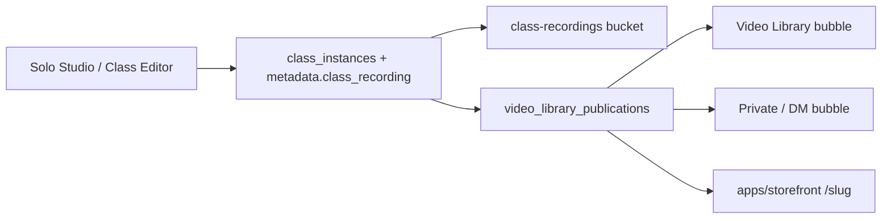

# Video Library Bubble — Architectural Blueprint

**Status:** Phase 1–4 shipped (publications + publish + CRM Library + storefront public playback)

**Charter:** Let a coach publish a finished Solo Studio (or other class) VOD into a **Video Library Bubble** with explicit access controls: public storefront (Astro), workspace-wide, or specific users (private / DM bubble).  
**Depends on:** Solo Recording Studio VODs (`class_instances.metadata.class_recording` + `class-recordings` bucket), Bubbles / `bubble_members` ACL, Storefront public portals (`apps/storefront`).  
**Boundary:** Do **not** invent a parallel media CDN or a chat `post_type` enum. Reuse recording storage + bubble membership patterns; add a thin **publication** join for distribution.

---

## Related docs

| Doc                                                                        | Role                                                                     |
| -------------------------------------------------------------------------- | ------------------------------------------------------------------------ |
| [solo-recording-studio-blueprint.md](./solo-recording-studio-blueprint.md) | Capture → upload → `ready` VOD on a synthetic private class instance     |
| [class-recording-pipeline.md](./class-recording-pipeline.md)               | Track 1 / Track 2 / browser provider + bucket conventions                |
| [bubbles/README.md](./bubbles/README.md)                                   | Bubble = channel; Social Space = workspace; name-contract special boards |
| [../live-video/readme.md](../live-video/readme.md)                         | Async playback shell + signed URLs                                       |

---

## 1. Product use case

**Publish to Video Library:** After a Solo Studio (or Class Editor / Agora) recording reaches `status: 'ready'`, the coach opens **Publish to Video Library**, chooses a destination and audience, and members (or the public) browse / play the VOD from a dedicated Video Bubble hub—not only from a Classes board card.

| Actor                | Behavior                                                                                                        |
| -------------------- | --------------------------------------------------------------------------------------------------------------- |
| Coach / admin        | Selects a ready VOD → Publish modal → destination + access level → publication row created                      |
| Workspace member     | Sees workspace-scoped library items in the Video Library bubble; plays via signed URL                           |
| Invited private user | Sees items published into a private / DM bubble they belong to                                                  |
| Anonymous visitor    | On a public workspace storefront (`/[slug]`), sees only **public** library items; plays via storefront-safe URL |

**Out of product scope (v1):** Full video CMS (chapters, transcripts), social reactions on VODs, monetized paywall per video, remux pipeline (see Solo Studio Phase 4/open Q).

---

## 2. Discovery summary (locked facts)

### 2.1 Bubbles / channels today

| Product term     | Implementation                                                                                    |
| ---------------- | ------------------------------------------------------------------------------------------------- |
| Social Space     | `workspaces`                                                                                      |
| Bubble / Channel | `bubbles` (`workspace_id`, `name`, `is_private`, `bubble_type`, `message_visibility`, `metadata`) |
| Membership       | `bubble_members` (`editor` \| `viewer`)                                                           |
| Feed / “posts”   | `messages` + `attachments` / `metadata` cards — **no** `posts` table, **no** `post_type`          |

Fitness special boards are selected by **exact bubble `name`** in `dashboard-shell.tsx` (`Classes`, `Programs`, `Analytics`). There is **no** Video Library bubble in `WORKSPACE_SEED_BY_CATEGORY.fitness` today.

Access helpers (`can_view_bubble` / `can_write_bubble`):

| Audience              | Mechanism                                                                                          |
| --------------------- | -------------------------------------------------------------------------------------------------- |
| Workspace-wide        | `is_private = false` + workspace membership                                                        |
| Private / invite-only | `is_private = true` + `bubble_members` row                                                         |
| DM                    | `bubble_type = 'dm'` (+ typically private)                                                         |
| Storefront anon       | Separate RLS: workspace `is_public` + row-level `visibility = 'public'` on tasks / class instances |

Primary UI: `bubble-sidebar.tsx`, `BubbleSettingsModal.tsx`, `bubble-actions.ts`, chat under `src/components/chat/`. Live video lives under `src/features/live-video/`.

### 2.2 Recordings today

| Layer        | Reality                                                                                                |
| ------------ | ------------------------------------------------------------------------------------------------------ |
| Bytes        | Private Storage bucket `class-recordings` — path `{workspace_id}/{class_instance_id}/…`                |
| Metadata     | `class_instances.metadata.class_recording` (`ClassRecordingPayload`) — **no** `class_recordings` table |
| Status       | `recording` → `uploading` → (`processing`) → `ready` \| `failed`                                       |
| Providers    | `agora` \| `manual` \| `browser` (Solo Studio)                                                         |
| Playback CRM | `AsyncPlaybackShell` + signed URLs; ClassCard **Play Workout** when `async_session` present            |
| Storefront   | `class_instances.visibility` `'private' \| 'public'` for **scheduled class cards**, not a VOD library  |

Solo Studio open question #2 (member visibility of solo VODs) is **answered by this blueprint**: publishing is an explicit coach action with an ACL, not implicit visibility of the synthetic private instance.

### 2.3 Astro / public content today

There is **no** `apps/astro`. Public marketing + portals are **`apps/storefront`** (Astro SSR → Vercel).

| Route     | Content                                                                                              |
| --------- | ---------------------------------------------------------------------------------------------------- |
| `/`       | Marketing; no Supabase content library                                                               |
| `/[slug]` | Public portal: `tasks.visibility = 'public'` + future `class_instances` with `visibility = 'public'` |

Pattern: SSR `createStorefrontClient()` (anon key) → hydrate React islands (`PublicFeed`). Gate: `workspaces.is_public` + row `visibility`. **No video library section** yet. Env: `PUBLIC_SUPABASE_URL`, `PUBLIC_SUPABASE_ANON_KEY`, `PUBLIC_APP_ORIGIN`.

**Storage note:** `class-recordings` select policy requires **authenticated workspace members**. Anon storefront **cannot** read objects directly today. Public playback must use a controlled signed-URL (or Edge) path—not a public bucket flip.

---

## 3. Options evaluation

### Option A — New `video_library_*` publication table (link recording → bubble + scope)

|          |                                                                                                                                                                                               |
| -------- | --------------------------------------------------------------------------------------------------------------------------------------------------------------------------------------------- |
| **How**  | Thin join: `class_instance_id` + destination `bubble_id` + `access_scope` (+ publisher, timestamps, optional title). Library UI queries publications; bytes stay on existing metadata/bucket. |
| **Pros** | Matches product (“publish to …”); multi-destination without copying files; clear RLS surface; doesn’t overload chat or instance visibility alone.                                             |
| **Cons** | New table + policies; must keep publication rows in sync when recordings fail/delete.                                                                                                         |

### Option B — New `post_type` / feed message for videos

|          |                                                                                                                                                                                                         |
| -------- | ------------------------------------------------------------------------------------------------------------------------------------------------------------------------------------------------------- |
| **How**  | Insert `messages` with video attachment or metadata card pointing at the recording.                                                                                                                     |
| **Pros** | Reuses chat composer/notifications.                                                                                                                                                                     |
| **Cons** | **No `post_type` exists**; chat is chronological feed, not a library grid; ACL is only bubble-level; attachments use `message-attachments` bucket, not `class-recordings`; fights Solo Studio pipeline. |

### Option C — Access matrix only on synthetic `class_instance`

|          |                                                                                                                                                                                                   |
| -------- | ------------------------------------------------------------------------------------------------------------------------------------------------------------------------------------------------- |
| **How**  | Extend `class_instances.visibility` (or new columns) for public / workspace / user list.                                                                                                          |
| **Pros** | Minimal schema if library = Classes board.                                                                                                                                                        |
| **Cons** | Does **not** create a Video Bubble hub; “specific users” reinvents `bubble_members`; conflates scheduled class storefront cards with VOD library; solo instances are intentionally private today. |

### Decision (normative)

**Choose Option A** as the distribution layer, with a **dedicated Video Library bubble** as the primary hub UI (same name-contract pattern as Classes / Programs / Analytics).

- **Reject Option B** as primary model (no post_type; wrong UX; wrong storage).
- **Reject Option C** as primary model (no Bubble hub; weak private-user story).
- **Reuse from C:** when `access_scope = 'public_storefront'`, also set (or require) `class_instances.visibility = 'public'` so storefront RLS patterns stay consistent for the underlying instance where useful.
- **Optional chat announce (non-normative v1):** after publish, coach may post a metadata card into the destination bubble pointing at the publication—secondary UX, not the source of truth.

---

## 4. Data model

### 4.1 Source of truth (unchanged)

```text
class_instances.metadata.class_recording  →  ClassRecordingPayload
storage.objects bucket class-recordings   →  {workspace_id}/{class_instance_id}/…
```

Publish is **gated** on `status = 'ready'` and a resolvable `storagePath` (or legacy `playbackUrl`).

### 4.2 Video Library bubble (hub)

| Concern       | Approach                                                                                            |
| ------------- | --------------------------------------------------------------------------------------------------- |
| Seed          | Add **Video Library** to fitness workspace seed (+ backfill migration for existing fitness spaces)  |
| Board routing | Name contract in `dashboard-shell.tsx`: `name === 'Video Library'` → `VideoLibraryBoard`            |
| Default ACL   | Hub bubble is **workspace-wide** (`is_private = false`) so all members can open the library surface |
| Item ACL      | Enforced per **publication** row (see below)—not every item inherits “everyone”                     |

Private / DM destinations remain normal bubbles (`is_private` + `bubble_members` / `bubble_type = 'dm'`). Publishing “to specific users” means selecting (or creating) such a bubble and ensuring recipients are members.

Stable identity (recommended hardening): set `bubbles.metadata.kind = 'video_library'` on the seeded hub so rename does not permanently break routing (shell can prefer `metadata.kind`, fall back to name—same lesson as Classes rename fragility).

### 4.3 Publication table (normative shape)

Name locked for this blueprint: **`video_library_publications`**.

```text
video_library_publications
  id                  uuid PK default gen_random_uuid()
  workspace_id        uuid NOT NULL → workspaces
  class_instance_id   uuid NOT NULL → class_instances
  bubble_id           uuid NOT NULL → bubbles   -- hub or private/DM destination
  access_scope        text NOT NULL
                      -- 'public_storefront' | 'workspace' | 'bubble_members'
  title               text NULL                 -- optional override; else instance/offering title
  published_by        uuid NOT NULL → auth.users
  published_at        timestamptz NOT NULL default now()
  unpublished_at      timestamptz NULL          -- soft revoke without deleting file
  metadata            jsonb NOT NULL default '{}'
  unique (class_instance_id, bubble_id, access_scope)
    -- allow republish rules TBD; uniqueness prevents duplicate tiles in same destination+scope
```

| `access_scope`      | Meaning                                                              |
| ------------------- | -------------------------------------------------------------------- |
| `workspace`         | Any workspace member may list/play (typical hub publish)             |
| `bubble_members`    | Caller must `can_view_bubble(bubble_id)` (private / DM destinations) |
| `public_storefront` | Anon storefront may list; playback via signed-URL Edge/API (below)   |

**Not stored as a separate media asset table:** one publication points at one class instance’s recording. Multi-bubble distribution = multiple publication rows, same `class_instance_id`.

### 4.4 Linking diagram



---

## 5. Access control enforcement

### 5.1 Matrix

| Product level                         | `access_scope`      | Destination bubble                       | Who can **list**                                    | Who can **play**                                                               |
| ------------------------------------- | ------------------- | ---------------------------------------- | --------------------------------------------------- | ------------------------------------------------------------------------------ |
| Astro page (Public / unauthenticated) | `public_storefront` | Usually Video Library hub                | Anon if `workspaces.is_public` + publication active | Short-lived signed URL from storefront-safe API / Edge after publication check |
| Everyone (Workspace-wide)             | `workspace`         | Video Library hub (`is_private = false`) | `is_workspace_member`                               | Existing member storage policy **or** same signed-URL helper                   |
| Specific user(s)                      | `bubble_members`    | Private or DM bubble + `bubble_members`  | `can_view_bubble(bubble_id)`                        | Same, then signed URL; storage RLS still requires membership today             |

**Coach publish gate:** workspace admin/owner (align with Solo Studio / class recording write: `is_workspace_admin` / `canManageWorkspaceClasses`). Members do not publish.

**Unpublish:** set `unpublished_at` (or delete row). Does **not** delete the recording object; Classes / async player may still work for entitled members depending on instance visibility.

### 5.2 RLS sketch (Phase 1)

**SELECT `video_library_publications`:**

1. `unpublished_at is null`, and
2. One of:
   - `access_scope = 'workspace'` AND `is_workspace_member(workspace_id)`
   - `access_scope = 'bubble_members'` AND `can_view_bubble(bubble_id)`
   - `access_scope = 'public_storefront'` AND workspace `is_public` AND role in (`anon`, `authenticated`)

**INSERT / UPDATE / soft-unpublish:** `is_workspace_admin(workspace_id)` (+ validate instance recording `ready` and same `workspace_id`).

**Storage:** Keep bucket private. Extend playback helper:

- CRM: continue `AsyncPlaybackShell` signed URL for members who can see the publication (or instance).
- Storefront: **new** `GET` (Next route or Edge Function) that:
  1. Loads publication by id (anon RLS allows public rows only).
  2. Confirms `access_scope = 'public_storefront'` and recording `ready`.
  3. Uses service role / privileged signer to mint a **short-lived** signed URL.
  4. Never returns paths for non-public scopes.

Do **not** mark the entire `class-recordings` bucket public.

### 5.3 Specific users flow

1. Coach chooses **Specific people**.
2. UI offers: existing private bubbles / DMs, or “New private Video share” (create private bubble + add selected users as `viewer`).
3. Insert publication with `access_scope = 'bubble_members'` and that `bubble_id`.
4. Optional: system message in that bubble announcing the video (metadata card → open player).

---

## 6. UI / UX design

### 6.1 Publish modal (CRM)

**Entry points (v1):**

1. Solo Studio / async player when recording is `ready` — primary CTA **Publish to Video Library**.
2. Classes board / ClassCard overflow for any ready `class_recording` (manual / agora / browser).

**Modal steps:**

1. **Preview** — title (editable), duration placeholder if known, thumbnail later.
2. **Destination**
   - Video Library (default hub)
   - Existing private / DM bubble
   - Create private share (user picker → new private bubble)
3. **Access**
   - ○ Everyone in this Social Space → `workspace` + hub
   - ○ Specific people → `bubble_members` + private/DM
   - ○ Public on my Astro page → `public_storefront` (+ confirm workspace `is_public` / slug exists)
4. **Confirm** → insert publication; toast with link to Library or storefront.

Copy constraint: Public option disabled (with explanation) when workspace is not `is_public` or lacks `public_slug`.

### 6.2 Library view (CRM Video Library bubble)

Mount **`VideoLibraryBoard`** when the Video Library bubble is selected (not Kanban).

| Decision     | v1 choice                                                                           |
| ------------ | ----------------------------------------------------------------------------------- |
| Layout       | **Responsive grid** of video tiles (not chat feed)                                  |
| Tile content | Title, published date, access badge (Public / Space / Private), play CTA            |
| Empty state  | “Record in Solo Studio or publish a class recording”                                |
| Filters      | All / Published by me / Public only (coach); members see only entitled rows via RLS |
| Playback     | Reuse `AsyncPlaybackShell` / existing class async deep link                         |

Chat rail may remain for the hub bubble (announcements), but the **main stage is the grid**, same split pattern as Classes vs chat.

### 6.3 Storefront (Astro) integration

| Surface | Approach                                                                                                                                                 |
| ------- | -------------------------------------------------------------------------------------------------------------------------------------------------------- |
| Portal  | Add a **Videos** section on `/[slug]` (or sibling `/[slug]/videos`) SSR-fetching `video_library_publications` where `access_scope = 'public_storefront'` |
| Card    | New public card type in `public-feed-types` **or** dedicated `PublicVideoCard` island                                                                    |
| Play    | Island player calling the signed-URL endpoint; do not embed long-lived service URLs in HTML                                                              |

Marketing `/` remains unchanged.

---

## 7. Execution phases

### Phase 0 — Blueprint (this doc)

1. [x] Audit bubbles / ACL / messages (no post_type).
2. [x] Audit Solo Studio recording + storefront portal patterns.
3. [x] Lock Option A + Video Library hub + access_scope matrix.

### Phase 1 — DB / data model

1. [x] Migration: `video_library_publications` + RLS + indexes (`workspace_id`, `bubble_id`, `access_scope`, `unpublished_at`).
2. [x] Seed + backfill fitness bubble **Video Library** (`metadata.kind = 'video_library'`).
3. [x] Types in `database.generated` (table Row/Insert/Update). Publish-gate helpers deferred to Phase 2.
4. [ ] SQL/Deno tests for SELECT policies across the three scopes.

### Phase 2 — Publish flow

1. [x] Server action `publishToVideoLibraryAction` (admin-only; validates ready recording + bubble workspace).
2. [x] Publish modal UI + entry from AsyncPlaybackShell / ClassCard when ready.
3. [x] Private share path: existing private/DM bubbles only (no create-share + user picker in v1).
4. [x] Unpublish action (soft) shipped; Library-board UI deferred to Phase 3.

### Phase 3 — Library UI (CRM)

1. [x] `VideoLibraryBoard` grid + empty/error states.
2. [x] Shell name/`metadata.kind` routing; sidebar surfaces the seeded bubble.
3. [x] Play via existing async shell; access badges; coach filters.
4. [x] Unit/RTL for board filtering and CTA visibility.

### Phase 4 — Astro / public integration

1. [x] Storefront SSR query for public publications.
2. [x] Public video section / cards + player island.
3. [x] Signed-URL via CRM Next route + Astro proxy for `public_storefront` only (not Edge); hard gates against IDOR.
4. [ ] Manual QA: anon sees public only; member sees workspace; invitee sees private; unpublished disappears.

---

## 8. Decision summary

| Topic              | Decision                                                                                                                      |
| ------------------ | ----------------------------------------------------------------------------------------------------------------------------- |
| Primary model      | **Option A** — `video_library_publications` join                                                                              |
| Rejected           | Option B (feed post_type); Option C alone (instance ACL without Bubble hub)                                                   |
| Hub UI             | Fitness bubble **Video Library** + `VideoLibraryBoard` (grid)                                                                 |
| File storage       | Unchanged `class-recordings` + `metadata.class_recording`                                                                     |
| Public playback    | Private bucket + CRM `GET /api/video-library/public-playback` (service role sign) + Astro `/api/video-library-playback` proxy |
| Specific users     | Private / DM bubble + `access_scope = 'bubble_members'`                                                                       |
| Workspace everyone | Hub bubble + `access_scope = 'workspace'`                                                                                     |
| Astro public       | `access_scope = 'public_storefront'` + storefront section on `/[slug]`                                                        |

---

## 9. Open questions

1. **Title source:** Prefer offering title, instance title, or free-text at publish time?
2. **Republish:** Allow same instance → same bubble with updated title, or force unpublish first?
3. **Public + workspace dual publish:** One row with `public_storefront` implying member visibility, or two rows?
4. **Non-fitness categories:** Seed Video Library only for `fitness`, or any workspace with recordings?
5. **Safari / remux:** Block public publish for `.webm` until Solo Studio remux lands, or show browser support note?

---

## 10. Validation (when implementing)

```bash
# Policy / helper tests (names TBD)
pnpm exec vitest run src/lib/video-library/
# Storefront build when Phase 4 lands
pnpm --filter storefront build
```

Manual matrix:

| Scenario                            | Expect                                    |
| ----------------------------------- | ----------------------------------------- |
| Publish workspace scope             | All members see tile in Video Library     |
| Publish private bubble              | Non-members do not see tile               |
| Publish public + visit `/[slug]`    | Anon sees video section; signed URL plays |
| Anon guesses private publication id | Signed-URL endpoint 404/403               |
| Unpublish                           | Tile removed; object file still in bucket |

---

## 11. Appendix — discovery file index

| Area         | Paths                                                                                                                                                      |
| ------------ | ---------------------------------------------------------------------------------------------------------------------------------------------------------- |
| Bubbles ACL  | `supabase/migrations/20260415110000_rbac_base_functions.sql`, `src/lib/permissions.ts`, `docs/fitness/bubbles/README.md`                                   |
| Bubble UI    | `src/components/dashboard/bubble-sidebar.tsx`, `src/components/modals/BubbleSettingsModal.tsx`, `src/app/(dashboard)/app/[workspace_id]/bubble-actions.ts` |
| Recording    | `src/types/live-session-invite.ts`, `src/lib/live-video/upload-solo-studio-recording.ts`, `src/features/live-video/shells/AsyncPlaybackShell.tsx`          |
| Storage      | `supabase/migrations/20260808120000_class_recordings_storage_bucket.sql`                                                                                   |
| Storefront   | `apps/storefront/src/pages/[slug].astro`, `apps/storefront/src/lib/public-feed-types.ts`, `apps/storefront/src/components/PublicFeed.tsx`                  |
| Class public | `supabase/migrations/20260910120000_add_class_instance_visibility.sql`                                                                                     |
