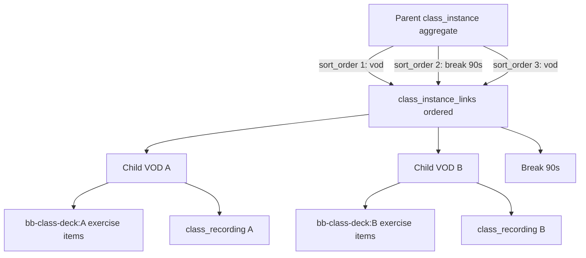
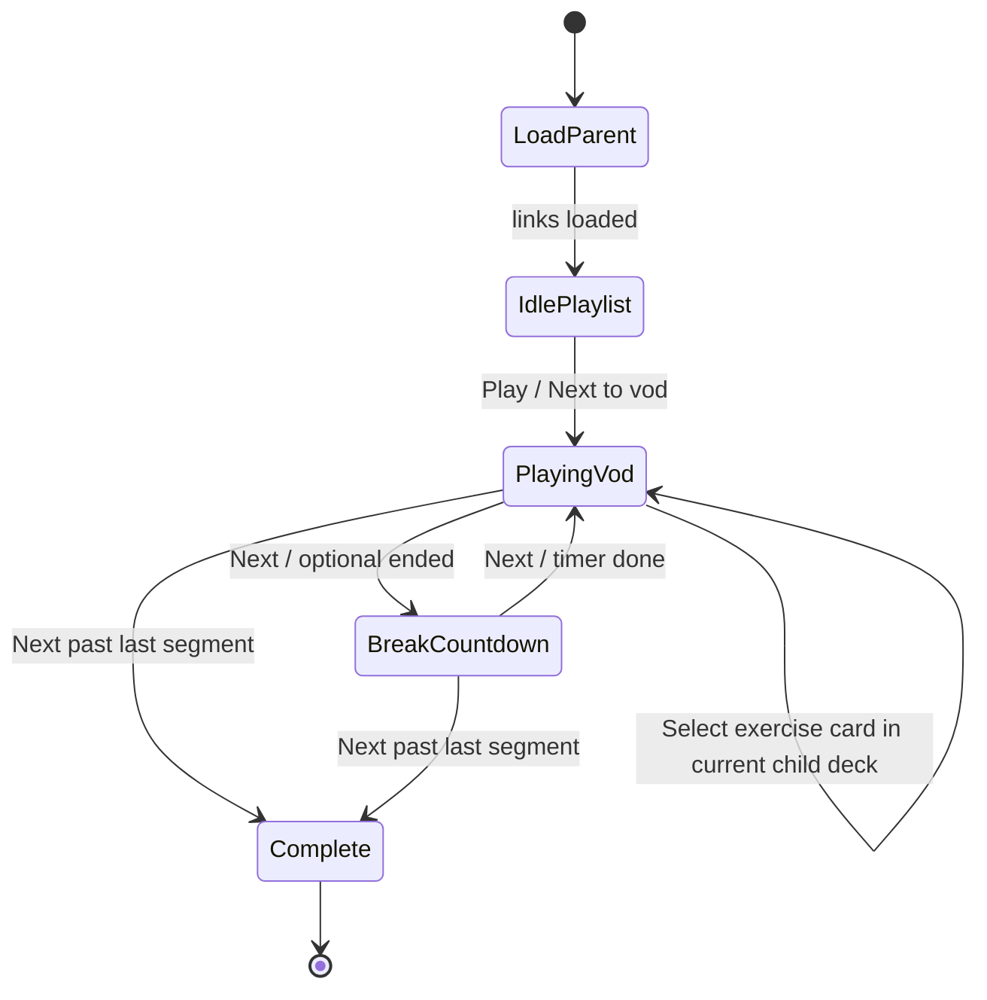

# Video Workout Aggregator — Architectural Blueprint

**Status:** Discovery complete; implementation not started  
**Charter:** Let a coach stitch independent single VODs (and timed breaks) into a longer aggregated workout while each source VOD remains a first-class, independently playable recording.  
**Depends on:** Solo Studio / class VODs (`class_instances.metadata.class_recording` + `class-recordings` bucket), per-instance exercise decks (`bb-class-deck:<instanceId>` → `live_session_deck_items`), Video Library publications (distribution), `AsyncPlaybackShell` 3-pane theater.  
**Boundary:** Do **not** overload `live_session_deck_items` as a VOD playlist, and do **not** require publication before aggregation. Aggregation keys off **`class_instances`**; publications remain an optional distribution layer for the **parent** (and unchanged for singles).

---

## Related docs

| Doc                                                                        | Role                                                                 |
| -------------------------------------------------------------------------- | -------------------------------------------------------------------- |
| [solo-recording-studio-blueprint.md](./solo-recording-studio-blueprint.md) | Capture → upload → `ready` VOD on a synthetic private class instance |
| [video-library-bubble-blueprint.md](./video-library-bubble-blueprint.md)   | Publish one instance → bubble + access scope                         |
| [class-recording-pipeline.md](./class-recording-pipeline.md)               | Storage / signed URL conventions                                     |
| [workout-builder/README.md](./workout-builder/README.md)                   | Exercise deck builder (Class Builder / Standalone)                   |
| [../live-video/readme.md](../live-video/readme.md)                         | Async playback shell + signed URLs                                   |

---

## 1. Product use case

**Video Workout Aggregator:** A trainer selects existing single VODs (e.g. 4‑min Tabata, 15‑min HIIT, 10‑min AMRAP), arranges them in order, inserts explicit **Breaks** between segments, and saves a longer aggregated workout (e.g. ~40 minutes). Athletes open one aggregated session and move through each VOD + break while logging sets against each segment’s own exercise deck. Single VODs continue to exist and play independently.

| Actor            | Behavior                                                                                                                        |
| ---------------- | ------------------------------------------------------------------------------------------------------------------------------- |
| Coach / admin    | Opens Aggregator Builder → picks ready VODs → DnD order → inserts Breaks → saves parent aggregate → optional Publish to Library |
| Athlete / member | Opens aggregated playback → watches current VOD segment → logs sets for that segment’s deck → advances (manual Next by default) |
| Coach (per-VOD)  | Continues to edit a child VOD’s exercise deck via existing `?class_deck_builder=<childId>`                                      |

**Example composition**

```text
[4-min Tabata VOD] → [90s Break] → [15-min HIIT VOD] → [2-min Break] → [10-min AMRAP VOD]
```

**Out of product scope (v1):** Remux / concatenate bytes into a single file, live multi-camera production, automatic chaptering from audio, monetized paywalls per segment, editing child VOD media inside the aggregator.

---

## 2. Discovery summary (locked facts)

### 2.1 Single VOD identity today

| Layer           | Reality                                                                                              |
| --------------- | ---------------------------------------------------------------------------------------------------- |
| Anchor          | `class_instances.id`                                                                                 |
| Bytes           | `metadata.class_recording` (`status: 'ready'`) → `class-recordings` bucket                           |
| Async namespace | `metadata.async_session.sessionId` = `bb-class-deck:<classInstanceId>`                               |
| Exercise queue  | `live_session_deck_items` where `session_id = 'bb-class-deck:' \|\| class_instance_id`               |
| Distribution    | Optional `video_library_publications` row → same `class_instance_id` (ACL only; not source of truth) |
| Playback shell  | `AsyncPlaybackShell` — **one** instance → **one** signed URL → **N** workout cards                   |

```50:53:src/features/live-video/shells/AsyncPlaybackShell.tsx
  const deckSessionId = useMemo(
    () => classDeckBuilderSessionId(classInstanceId),
    [classInstanceId],
  );
```

### 2.2 Exercise deck vs media timeline

`live_session_deck_items` rows are **workout task cards** (`task_id` NOT NULL; RLS via `get_task_bubble_id(task_id)`). There is **no** `item_type`, no break row, and no pointer to another VOD. Consumers (`SessionDeckBuilder`, logger, copy RPCs) assume exercise snapshots with `tasks(*)`.

`StandaloneClassDeckBuilder` authors that exercise deck for **one** class instance (`?class_deck_builder=`). It is video-free and must not be overloaded as a multi-VOD playlist editor.

### 2.3 Theater today (athlete)

`AsyncPlaybackShell` 3-pane layout when a deck is present:

1. **Left** — `AsyncPlaybackWorkoutLogger` (active exercise card)
2. **Center** — single `<video controls>` (or Play CTA)
3. **Right** — `CoachContextRail` (collapsible)
4. **Bottom** — `WorkoutQueueRegion` (read-only exercise queue; tap to select card)

There is **no** `video.onEnded` auto-advance, no playlist index, and the logger never advances the queue. Subtitle copy already frames selection as **manual** (“Tap a card in the queue to switch workouts”).

### 2.4 No existing aggregation primitives

Grep finds no `video_aggregations`, playlist tables, `class_instance_links`, or deck `video_block` types. Closest reuse: publications (distribution), `bb-class-deck:` (exercise queue), copy RPCs (live ↔ draft for **one** instance).

---

## 3. Data model decision

### Option A — `video_aggregations` ordered-linking to `video_library_publications`

|          |                                                                                                                                                                                                                                                                                          |
| -------- | ---------------------------------------------------------------------------------------------------------------------------------------------------------------------------------------------------------------------------------------------------------------------------------------- |
| **How**  | New playlist table whose items FK to publication rows (plus break rows).                                                                                                                                                                                                                 |
| **Pros** | Clean ordered list; can mirror publication RLS patterns.                                                                                                                                                                                                                                 |
| **Cons** | Publications are **optional** distribution — Solo / class VODs exist without a pub row; UNIQUE `(class_instance_id, bubble_id, access_scope)` makes “which tile” ambiguous; forces publish-first or dual linking for drafts; still must resolve to `class_instance_id` for bytes + deck. |

**Reject as primary spine.** Publications stay the publish layer, not the aggregation key.

### Option B — Extend `live_session_deck_items` with `item_type` (`video_block` / `break`)

|          |                                                                                                                                                                                                                           |
| -------- | ------------------------------------------------------------------------------------------------------------------------------------------------------------------------------------------------------------------------- |
| **How**  | Parent `bb-class-deck:<parentId>` holds typed rows pointing at child VODs or break durations.                                                                                                                             |
| **Pros** | Reuses `session_id` + `sort_order` + Realtime.                                                                                                                                                                            |
| **Cons** | `task_id` NOT NULL + bubble RLS via task — breaks/video refs need nullable `task_id` + RLS rewrite; overloads **exercise queue** with **media timeline**; blast radius across builder, logger, merge RPCs, and snapshots. |

**Reject as primary spine.** Keep exercise decks as exercise decks.

### Option C — Junction `class_instance_links` (parent aggregate instance → children / breaks)

|          |                                                                                                                                                                                                                                              |
| -------- | -------------------------------------------------------------------------------------------------------------------------------------------------------------------------------------------------------------------------------------------- |
| **How**  | Synthetic **parent** `class_instance` (aggregator identity). Ordered `class_instance_links` rows: `vod` → child instance, or `break` → duration. Children remain independent VODs with their own `class_recording` + `bb-class-deck:` decks. |
| **Pros** | Matches real VOD identity (`class_instances`); singles stay playable; publish aggregator = one publication → **parent** id; breaks need no fake tasks.                                                                                       |
| **Cons** | New table + RLS; playback must become playlist-aware (today’s shell is single-instance).                                                                                                                                                     |

### Decision (normative)

**Choose Option C** as the aggregation spine.

- **Reject Option A** as primary model (publications are not the VOD source of truth).
- **Reject Option B** as primary model (wrong abstraction; schema/RLS blast radius).

### 3.1 Normative schema sketch

```text
class_instance_links
  id                  uuid PK
  workspace_id        uuid NOT NULL → workspaces
  parent_instance_id  uuid NOT NULL → class_instances   -- aggregate
  child_instance_id   uuid NULL → class_instances       -- required when link_kind = 'vod'
  link_kind           text NOT NULL CHECK ('vod' | 'break')
  sort_order          integer NOT NULL DEFAULT 0
  break_duration_sec  integer NULL                      -- required when link_kind = 'break'
  title_override      text NULL
  metadata            jsonb NOT NULL DEFAULT '{}'
  created_at / updated_at
```

Constraints (normative intent):

- `link_kind = 'vod'` ⇒ `child_instance_id IS NOT NULL` and child ≠ parent; child has (or will have) a ready recording for playback.
- `link_kind = 'break'` ⇒ `child_instance_id IS NULL` and `break_duration_sec > 0`.
- Unique `(parent_instance_id, sort_order)` (or enforce order in write RPC).
- RLS: workspace owner/admin (and class-manage roles) write; members who can play the parent can read links.

**Parent instance contract**

| Field / metadata                         | Role                                                                                  |
| ---------------------------------------- | ------------------------------------------------------------------------------------- |
| `class_instances` row                    | Aggregate identity (synthetic offering / private visibility pattern like Solo Studio) |
| `metadata.async_session`                 | Optional; may pin `bb-class-deck:<parentId>` if we later add a parent-only intro deck |
| `metadata.class_recording`               | **Absent or unused for playback** — media comes from child links                      |
| `metadata.video_aggregation` (suggested) | `{ type: 'video_aggregation', version: 1 }` marker for UI routing                     |

**Publish:** `video_library_publications.class_instance_id` = **parent**. Library Play routes to aggregated theater when the instance is marked as an aggregation (or when it has link rows).

### 3.2 How child decks relate to the aggregate queue

**Policy (locked): Nested hydrate — do not flatten.**

| Concern                          | Behavior                                                                                |
| -------------------------------- | --------------------------------------------------------------------------------------- |
| Segment order / breaks           | Owned by `class_instance_links` on the **parent**                                       |
| Exercise cards for a VOD segment | Owned by child `bb-class-deck:<childInstanceId>` — unchanged                            |
| Athlete logger / coach rail      | Bound to the **active segment’s** child deck while a VOD is playing                     |
| Bottom `WorkoutQueueRegion`      | **Only** the exercises for the **currently playing** VOD segment (see §5.4)             |
| Break segments                   | No exercise deck; logger shows rest/break state; coach rail idle or last segment cues   |
| Editing a child’s workout        | Existing Class Deck Builder on the child id; aggregator builder does not edit exercises |



**Rejected alternative — Flatten:** Copy all child `live_session_deck_items` into parent `bb-class-deck:<parentId>`. That would break `SessionDeckBuilder` / `WorkoutDeckSelectionProvider` expectations (one `session_id` → one deck fetch), lose segment boundaries, make breaks awkward as fake tasks, and duplicate data when children are edited later.

---

## 4. UI/UX design — Coach Builder (locked)

### 4.1 Placement decision (locked)

**New shell + query-param takeover** — `?video_aggregator=<parentInstanceId>`, sibling to `class_deck_builder` / `class_async_player` in `dashboard-shell.tsx`.

| Surface                      | Role                                | Fit for aggregator                |
| ---------------------------- | ----------------------------------- | --------------------------------- |
| `StandaloneClassDeckBuilder` | Exercise cards for **one** instance | **Do not extend** (wrong job)     |
| New `VideoAggregatorBuilder` | Ordered VOD segments + Breaks       | **Primary authoring UI** (locked) |
| `VideoLibraryBoard`          | Browse / publish singles            | Entry: “New aggregated workout”   |

**Rationale:** Class Builder’s DnD, Kanban pick, and save path (`async_session` + exercise flush) are exercise-centric. Aggregator persistence is `class_instance_links`, not `live_session_deck_items`. Child exercise editing stays on `?class_deck_builder=<childId>`.

### 4.2 Builder UX (v1, locked)

**Layout (one composition)**

1. **Header** — Aggregate title, Save, Close; optional “Publish to Library” when ≥1 VOD segment exists.
2. **Timeline strip (primary)** — Horizontal DnD list of segment chips: VOD thumbnail/title/duration + Break chips (duration editable). Order = `class_instance_links.sort_order`.
3. **Library picker (secondary)** — Grid/list of ready VODs from workspace (`class_recording.status = 'ready'`, and/or published library rows resolved to `class_instance_id`). Add appends a `vod` link.
4. **Break control** — “Add break” inserts a `break` link with default duration (e.g. 60s); inline edit seconds.

**Interactions (locked)**

- Drag to reorder → rewrite `sort_order` (e.g. Tabata → Break 90s → HIIT → Break → AMRAP).
- Remove segment → delete link row (**never** deletes child VOD or its deck).
- Click VOD chip → preview and/or “Edit workout” → `?class_deck_builder=<childId>`.
- Empty state — “Add videos from your library to build a longer workout.”

**Permissions:** Same gate as class management / publish (`canManageWorkspaceClasses` / owner-admin patterns used by Class Deck Builder and Video Library).

### 4.3 Entry points (locked)

| Location                    | Action                                                        |
| --------------------------- | ------------------------------------------------------------- |
| Video Library board         | “Create aggregated workout” → provision parent + open builder |
| Aggregated playback (coach) | “Edit aggregation” → reopen builder                           |
| Classes / library overflow  | “Add to aggregator…” (Phase 3+)                               |

---

## 5. UI/UX design — Athlete playback theater (locked)

### 5.1 Shell strategy (locked)

**`AggregatedPlaybackShell`** — playlist-aware theater that **reuses** the 3-pane chrome of `AsyncPlaybackShell` (logger | video | coach rail | bottom queue) but replaces single-recording effects with a **playlist state machine**.

Do **not** silently overload `AsyncPlaybackShell`’s `classInstanceId` without an explicit aggregation branch: callers today assume one recording on that id.

**Routing:** `?class_async_player=<parentId>` detects aggregation marker / presence of links → mount `AggregatedPlaybackShell`; singles keep today’s shell.

### 5.2 Playlist state machine (locked)

```text
segments[] = ordered class_instance_links for parent
cursor     = index into segments
```

| Segment kind | Center pane                                   | Logger / Coach / bottom queue                                        |
| ------------ | --------------------------------------------- | -------------------------------------------------------------------- |
| `vod`        | Resolve child signed URL; `<video key={url}>` | Hydrate **only** `bb-class-deck:<childId>`; select first card        |
| `break`      | Countdown UI + Skip                           | No exercise queue; rest status; coach rail idle or last-segment cues |

**Signed URLs:** Cache per `child_instance_id`; prefetch next VOD while current plays.

### 5.3 Transition policy (locked for v1)

| Mode                      | Behavior                                                                              | Default                     |
| ------------------------- | ------------------------------------------------------------------------------------- | --------------------------- |
| **Manual Next**           | Athlete taps **Next** (or selects a playlist chip) to leave current VOD or skip break | **Yes**                     |
| **Optional auto-advance** | On `video.ended` (and break timer complete), advance cursor                           | **Off** in v1; opt-in later |

**Rationale:** Logger and coach rail are not media-driven today; athletes often finish logging after the clip ends. Auto-advance would yank the active deck mid-log. Manual Next matches existing “tap to switch” language.

**Do not** auto-advance from “set logged” / logger completion.

### 5.4 Queue regions (locked)

Two layers — **playlist** vs **exercise queue** — must not be merged into one flattened strip.

| Region                            | Content                                                       | Updates when                                                               |
| --------------------------------- | ------------------------------------------------------------- | -------------------------------------------------------------------------- |
| **Playlist strip** (new)          | Ordered VOD titles + Break chips; highlights `cursor`         | Cursor / links load                                                        |
| **`WorkoutQueueRegion` (bottom)** | Exercise cards for the **currently playing VOD segment only** | Cursor enters a new `vod` → remount provider with child’s `bb-class-deck:` |

#### Bottom `WorkoutQueueRegion` — normative rule

**Show only the exercises for the currently playing video segment.**

| Reason         | Detail                                                                                                                                                                                                                |
| -------------- | --------------------------------------------------------------------------------------------------------------------------------------------------------------------------------------------------------------------- |
| Data fetching  | Nested hydrate uses `bb-class-deck:<childInstanceId>`. Flattening multiple child decks into one queue would break `SessionDeckBuilder` / `WorkoutDeckSelectionProvider` (single `sessionIdOverride` → one deck read). |
| Cognitive load | Athlete stays focused on the current block (e.g. 4‑min Tabata) before the HIIT block is revealed — same pattern as premium apps (Peloton, Apple Fitness+).                                                            |
| Breaks         | While `link_kind = 'break'`, hide or replace the exercise queue with a rest/empty state — do not show the next VOD’s cards early.                                                                                     |

When the cursor moves VOD A → Break → VOD B:

1. Playlist strip moves highlight.
2. Center swaps video ↔ break UI.
3. On entering B: logger + coach rail rebind to B’s deck; bottom `WorkoutQueueRegion` reloads **only** B’s cards; `localActiveDeckItemId` resets to B’s first card.
4. During the break: bottom region does **not** show A or B exercise cards.

### 5.5 Mermaid — playback flow (locked)



---

## 6. Execution phases (locked order)

### Phase 0 — Schema & types

- [ ] Migration: `class_instance_links` + RLS + indexes
- [ ] Parent marker in `class_instances.metadata` (`video_aggregation`)
- [ ] Provision helper: create synthetic parent instance (mirror Solo Studio private instance patterns where appropriate)
- [ ] Regenerate `database.generated.ts`
- [ ] Unit tests for link constraints / ordering helpers

### Phase 1 — Aggregator Builder (coach)

- [ ] `VideoAggregatorBuilder` shell + `?video_aggregator=` routing in `dashboard-shell.tsx`
- [ ] Load ready VODs; add / remove / reorder; add / edit breaks
- [ ] Persist via insert/update/delete on `class_instance_links` (or single replace RPC)
- [ ] Entry CTA on Video Library board
- [ ] Smoke: create 3-VOD + 2-break aggregate; reload restores order

### Phase 2 — Aggregated playback (athlete)

- [ ] `AggregatedPlaybackShell` with playlist cursor
- [ ] Signed URL cache + center pane swap (VOD / break)
- [ ] Nested deck hydrate for **active child only**; remount `WorkoutQueueRegion` / logger / coach on cursor change
- [ ] Bottom queue never flattens multiple child decks
- [ ] Manual Next / Skip break; playlist strip
- [ ] Library / Classes Play routes parent aggregates to this shell

### Phase 3 — Publish & polish

- [ ] Publish parent to Video Library (reuse `PublishVideoModal` / actions with parent id)
- [ ] Coach “Edit aggregation” from playback / library card
- [ ] Prefetch next VOD URL; empty/failed child segment UX
- [ ] Optional: persisted auto-advance preference (off by default)

### Phase 4 — Hardening (later)

- [ ] Concurrent edit / Realtime on links (if needed)
- [ ] Analytics: segment completion events
- [ ] Storefront public play for published aggregates (follow Video Library public playback patterns)

---

## 7. Decision summary

| Topic                         | Decision                                                                                    |
| ----------------------------- | ------------------------------------------------------------------------------------------- |
| Aggregation spine             | **Option C** — `class_instance_links` on a parent `class_instance`                          |
| Publications                  | Optional distribution of the **parent**; never the aggregation key                          |
| Exercise decks                | Stay on **children** (`bb-class-deck:<childId>`); nested hydrate                            |
| Bottom `WorkoutQueueRegion`   | **Current VOD segment only** — never flatten multi-child decks into one strip               |
| Breaks                        | Link rows `link_kind = 'break'` + `break_duration_sec`; no exercise cards during breaks     |
| Builder UI                    | **New** `VideoAggregatorBuilder` + `?video_aggregator=` — not Class Deck Builder            |
| Playback UI                   | `AggregatedPlaybackShell`; playlist strip + per-segment exercise queue; manual Next default |
| Flatten child decks to parent | **Rejected** (breaks SessionDeckBuilder fetch model + athlete cognitive load)               |

---

## 8. Open questions

1. **Parent offering / task_id:** Solo Studio and class flows attach offerings (and often `task_id`). What minimal parent row shape satisfies existing NOT NULL / unique constraints without implying a scheduled class?
2. **Duration display:** Use child recording duration from metadata if present, or omit until a duration field exists on `class_recording`?
3. **Member edit rights:** Can non-admin coaches who can publish also mutate links, or owner/admin only?
4. **Deep link mid-aggregate:** Should `?segment=` resume a cursor for returning athletes?
5. **Auto-advance v1.1:** Persist preference per user vs per aggregate?

---

## 9. Validation (when implementing)

| Check                      | Command / method                                                                                                                                        |
| -------------------------- | ------------------------------------------------------------------------------------------------------------------------------------------------------- |
| Types                      | `pnpm exec tsc --noEmit`                                                                                                                                |
| Link helpers / shell tests | Vitest for new modules                                                                                                                                  |
| Manual matrix              | Build aggregate → play → Next through VODs + breaks → log sets on each child deck → edit child deck → confirm aggregate still resolves → publish parent |

**Blueprint validation (this doc):** Discovery tables match current schema; Option C chosen with rejected A/B rationale; builder/playback placements explicit; phases ordered without requiring implementation in this PR.

---

## Appendix — File index (current code to reuse)

| Area                   | Path                                                                     |
| ---------------------- | ------------------------------------------------------------------------ |
| Async theater          | `src/features/live-video/shells/AsyncPlaybackShell.tsx`                  |
| Class deck builder     | `src/features/live-video/shells/huddle/StandaloneClassDeckBuilder.tsx`   |
| Deck session id        | `src/lib/fitness/class-deck-builder-session-id.ts`                       |
| Queue region           | `src/features/live-video/ui/WorkoutQueueRegion.tsx`                      |
| Coach rail             | `src/features/live-video/components/CoachContextRail.tsx`                |
| Dashboard routing      | `src/components/dashboard/dashboard-shell.tsx`                           |
| Video Library board    | `src/components/fitness/VideoLibraryBoard.tsx`                           |
| Publications migration | `supabase/migrations/20260930120000_video_library_publications.sql`      |
| Reverse deck copy RPC  | `supabase/migrations/20261001120000_copy_live_deck_to_class_session.sql` |
