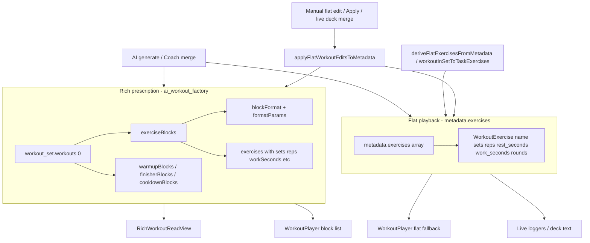
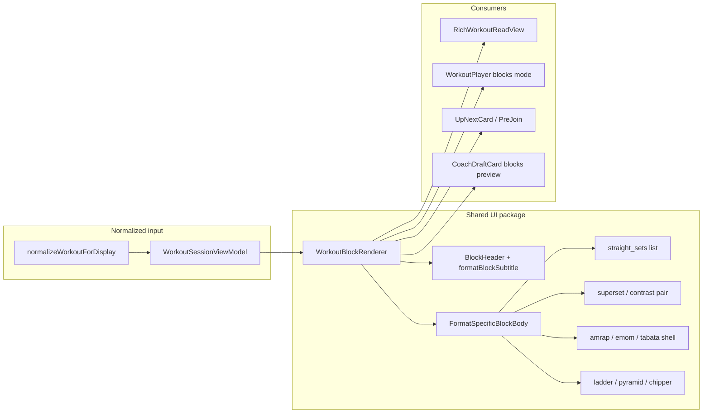

# Workout UI landscape audit (parametric blocks)

**Status:** Living landscape audit (updated after Steps 1–3).  
**Context:** The Parametric Workout Blocks epic ships a closed-world engine with **12** `block_format` values, block-level `formatParams`, and merge-time exercise hydration (e.g. EMOM/Tabata `workSeconds` / `restSeconds`). This document maps **every UI surface** that renders or executes workouts. **Steps 1–3** added the data contract, `WorkoutSessionViewModel`, and block-aware **WorkoutPlayer** P0; many surfaces below are still flat-only.

**Implementation plans:** [parametric-step1-2-plan.md](./parametric-step1-2-plan.md) · [parametric-step3-plan.md](./parametric-step3-plan.md) · [parametric-step4-plan.md](./parametric-step4-plan.md) (M0–M4 shipped) · [parametric-step4-m4-plan.md](./parametric-step4-m4-plan.md) · [parametric-step5-plan.md](./parametric-step5-plan.md) · [parametric-step5-m1-m3-plan.md](./parametric-step5-m1-m3-plan.md) (M1 + M3 shipped)

**Related engine docs:** [parametric-workout-blocks](../../refactor/parametric-workout-blocks/README.md), [rail-composer-tokens](../../agents/coach/rail-composer-tokens.md), [PCC manifesto](../../architecture/pcc-manifesto.md).

**Note:** Dashboard layout/shell documentation was moved to [layout-shell-architecture.md](./layout-shell-architecture.md) (it previously lived in this file by mistake).

---

## Executive summary

| Layer                            | What exists today                                                                                                                                                                                                                                                                                                | User impact                                                                                            |
| -------------------------------- | ---------------------------------------------------------------------------------------------------------------------------------------------------------------------------------------------------------------------------------------------------------------------------------------------------------------- | ------------------------------------------------------------------------------------------------------ |
| **Data (write path)**            | Coach merge + AI factory write `ai_workout_factory.workout_set` with `exerciseBlocks[]`, `blockFormat`, `formatParams`, warmup/finisher/cooldown                                                                                                                                                                 | Prescription is clinically structured in the DB                                                        |
| **Data (read path — preview)**   | `RichWorkoutReadView` shows block sections + `formatBlockSubtitle()`                                                                                                                                                                                                                                             | User **sees** intent in Task Modal viewer (view mode only)                                             |
| **Data (read path — execution)** | **WorkoutPlayer** uses `useWorkoutSessionViewModel` → rich blocks + subtitles when `ai_workout_factory` exists; flat `metadata.exercises` is a derived cache for logging. Live loggers / deck text still read flat lists.                                                                                        | Player shows block structure (P0); timers / superset pairing / progression UX still missing            |
| **Flattening / manual edits**    | `deriveFlatExercisesFromMetadata` keeps `metadata.exercises` in sync with factory. **Manual flat edits** (viewer Apply, live deck merge) call `applyFlatWorkoutEditsToMetadata`: main `exerciseBlocks` degrade to one `straight_sets` “Main” block; warmup/finisher/cooldown preserved; factory **not** deleted. | Intentional degradation when the user edits the flat list; parametric intent on main work is collapsed |

**Bottom line:** The engine and **WorkoutPlayer** now share a block-aware read path for rich cards. Live video, Coach draft preview, and format-specific execution (timers, pairs, ladders) remain the main gaps.

---

## Data model reference (two truths)

| Field / helper                                    | Location                                                                                        | Used for                                                                     |
| ------------------------------------------------- | ----------------------------------------------------------------------------------------------- | ---------------------------------------------------------------------------- |
| `metadata.ai_workout_factory.workout_set`         | `tasks.metadata`                                                                                | Viewer rich mode, Kanban “has workout” detection                             |
| `metadata.exercises`                              | `tasks.metadata`                                                                                | Derived cache: logging, editors, Coach rail `#` list, finish → `workout_log` |
| `buildWorkoutSessionViewModel(metadata)`          | [workout-session-view-model.ts](../../../src/lib/workout-factory/workout-session-view-model.ts) | Player + triggers: `source`, `blocks[]`, `flatExercises`, `flatCacheStale`   |
| `metadataFieldsFromParsed(meta).workoutExercises` | [item-metadata.ts](../../../src/lib/item-metadata.ts)                                           | Universal flat accessor (legacy surfaces)                                    |
| `getExercisesFromWorkout(session)`                | [program-schedule-utils.ts](../../../src/lib/workout-factory/program-schedule-utils.ts)         | Flattens `exerciseBlocks` → `Exercise[]` (drops block boundaries)            |
| `formatBlockSubtitle(blockFormat, formatParams)`  | [format-block-subtitle.ts](../../../src/lib/workout-factory/format-block-subtitle.ts)           | Subtitles only in `RichWorkoutReadView`                                      |

### Twelve closed-world formats (engine)

From [block-blueprint-library.ts](../../../src/lib/agents/coach/block-blueprint-library.ts):

`straight_sets`, `superset`, `circuit`, `amrap`, `emom`, `tabata`, `ladder`, `chipper`, `pyramid`, `contrast`, `clusters`, `drop_sets`.

Merge already hydrates **EMOM** (derived `workSeconds` / `restSeconds`) and **Tabata** (`hydrateTabataExercisesFromFormatParams`) onto factory exercise rows inside `exerciseBlocks`. The Player **displays** block headers/subtitles and extended target lines; it does **not** yet run interval timers or paired-round UX per format.

---

## View inventory

### Tier 1 — Primary prescription & execution (highest impact)

| #   | Component                  | Path                                                                                         | Role                                                               | Data source                                                                                                                                          |
| --- | -------------------------- | -------------------------------------------------------------------------------------------- | ------------------------------------------------------------------ | ---------------------------------------------------------------------------------------------------------------------------------------------------- |
| 1   | **RichWorkoutReadView**    | [workout-viewer-dialog.tsx](../../../src/components/fitness/workout-viewer-dialog.tsx)       | Read-only prescription: warmup / main blocks / finisher / cooldown | **Rich:** `workoutSet.workouts[0]` → `exerciseBlocks`, `formatBlockSubtitle`                                                                         |
| 2   | **WorkoutViewerContent**   | same file                                                                                    | View/edit shell; toggles rich vs flat                              | Rich if `workoutSet != null`; else `metadata.exercises`                                                                                              |
| 3   | **FlatExercisesReadView**  | same file                                                                                    | Flat fallback list                                                 | `metadata.exercises`                                                                                                                                 |
| 4   | **WorkoutExercisesEditor** | [workout-exercises-editor.tsx](../../../src/components/fitness/workout-exercises-editor.tsx) | Edit mode in viewer                                                | **Flat only**                                                                                                                                        |
| 5   | **WorkoutPlayer**          | [WorkoutPlayer.tsx](../../../src/components/fitness/WorkoutPlayer.tsx)                       | Live session: set grid, elapsed timer, finish → `workout_log`      | **Rich:** `useWorkoutSessionViewModel` → `WorkoutPlayerBlockList`; **flat fallback** when no factory; logging still `flatExercises` + global indices |
| 6   | **TaskModal**              | [TaskModal.tsx](../../../src/components/modals/TaskModal.tsx)                                | Embeds viewer; wires AI gen, player triggers                       | Both: `viewerWorkoutSet` + `workoutExercises` state                                                                                                  |
| 7   | **useTaskWorkoutAi**       | [useTaskWorkoutAi.ts](../../../src/components/modals/task-modal/hooks/useTaskWorkoutAi.ts)   | Rich detection; viewer Apply                                       | `applyFlatWorkoutEditsToMetadata` — degrades main blocks to `straight_sets`, preserves factory + instruction sections                                |

### Tier 2 — Board, shell, and launch surfaces

| #   | Component                  | Path                                                                                               | Role                           | Data source                                                                                     |
| --- | -------------------------- | -------------------------------------------------------------------------------------------------- | ------------------------------ | ----------------------------------------------------------------------------------------------- |
| 8   | **KanbanTaskCard**         | [kanban-task-card.tsx](../../../src/components/board/kanban-task-card.tsx)                         | Card chrome; Quick View / Play | Detection: flat exercises **or** `ai_workout_factory.workout_set`; **no exercise list on card** |
| 9   | **DashboardShell**         | [dashboard-shell.tsx](../../../src/components/dashboard/dashboard-shell.tsx)                       | Global `WorkoutPlayer` host    | Passes task `metadata` → Player (ViewModel inside player)                                       |
| 10  | **TaskModalEditorChrome**  | [TaskModalEditorChrome.tsx](../../../src/components/modals/task-modal/TaskModalEditorChrome.tsx)   | `WorkoutPlayerTriggers`        | Gate: `buildWorkoutSessionViewModel(metadata).flatExercises.length` (factory-derived when rich) |
| 11  | **TaskModalWorkoutFields** | [TaskModalWorkoutFields.tsx](../../../src/components/modals/task-modal/TaskModalWorkoutFields.tsx) | Details tab editor             | **Flat** — used for `workout_log` rows                                                          |
| 12  | **TaskModalDetailsBody**   | [TaskModalDetailsBody.tsx](../../../src/components/modals/task-modal/TaskModalDetailsBody.tsx)     | Intake + log fields            | Flat for logs                                                                                   |

### Tier 3 — Live video & class deck

| #   | Component                     | Path                                                                                                        | Role                                | Data source                                                                             |
| --- | ----------------------------- | ----------------------------------------------------------------------------------------------------------- | ----------------------------------- | --------------------------------------------------------------------------------------- |
| 13  | **LiveSessionWorkoutPlayer**  | [LiveSessionWorkoutPlayer.tsx](../../../src/features/live-video/shells/huddle/LiveSessionWorkoutPlayer.tsx) | Host edits active deck card         | Flat `workoutExercises`                                                                 |
| 14  | **ParticipantWorkoutLogger**  | [ParticipantWorkoutLogger.tsx](../../../src/features/live-video/shells/ParticipantWorkoutLogger.tsx)        | Per-exercise set logging in session | Flat                                                                                    |
| 15  | **UpNextCard**                | [UpNextCard.tsx](../../../src/features/live-video/shells/huddle/UpNextCard.tsx)                             | “Up next” strip summary             | **Rich:** `formatRichWorkoutStripSummary`; **flat:** legacy `formatExerciseLine`        |
| 16  | **ParticipantPreJoinSummary** | [ParticipantPreJoinSummary.tsx](../../../src/features/live-video/shells/ParticipantPreJoinSummary.tsx)      | Queue preview per card              | **Rich:** `WorkoutMetadataPreview` compact blocks; **flat:** `WorkoutFlatExerciseList`  |
| 17  | **LiveDeckExerciseInjector**  | [LiveDeckExerciseInjector.tsx](../../../src/features/live-video/shells/huddle/LiveDeckExerciseInjector.tsx) | Append `#` exercises to card        | Merges into flat `metadata.exercises`                                                   |
| 18  | **SessionDeckBuilder**        | [SessionDeckBuilder.tsx](../../../src/features/live-video/shells/huddle/SessionDeckBuilder.tsx)             | Deck strip of `KanbanTaskCard`      | **Rich:** `SessionDeckWorkoutSummary` strip/compact under tile; **flat:** exercise line |

### Tier 4 — Chat, drafts, and ancillary

| #   | Component                    | Path                                                                                                    | Role                           | Data source                                                                                 |
| --- | ---------------------------- | ------------------------------------------------------------------------------------------------------- | ------------------------------ | ------------------------------------------------------------------------------------------- |
| 19  | **WorkoutCoachRail**         | [WorkoutCoachRail.tsx](../../../src/components/chat/WorkoutCoachRail.tsx)                               | Coach beside player            | **Rich:** `buildWorkoutCoachRailContext` (structure summary + factory in sentinel metadata) |
| 20  | **CoachDraftCard**           | [CoachDraftCard.tsx](../../../src/components/chat/CoachDraftCard.tsx)                                   | Proposed workout preview       | **Rich:** `WorkoutMetadataPreview` on `proposed_metadata`; **flat:** same via VM flat list  |
| 21  | **RichMessageComposer**      | [RichMessageComposer.tsx](../../../src/components/chat/RichMessageComposer.tsx)                         | `:` / `#` tokens               | Catalog + hash picker (not full prescription UI)                                            |
| 22  | **ClassEditorWorkoutPicker** | [ClassEditorWorkoutPicker.tsx](../../../src/components/modals/class-modal/ClassEditorWorkoutPicker.tsx) | Pick workout by title/duration | No exercise list                                                                            |

### Tier 5 — Post-workout / analytics

| Surface                          | Path                                                                                               | Notes                                                                                             |
| -------------------------------- | -------------------------------------------------------------------------------------------------- | ------------------------------------------------------------------------------------------------- |
| **TaskModal workout_log read**   | [TaskModalWorkoutFields.tsx](../../../src/components/modals/task-modal/TaskModalWorkoutFields.tsx) | **Fixed (Step 4 M4):** `WorkoutLogReadSummary` + `set_logs` overlay; viewer `readVariant="log"`   |
| **WorkoutPlayer `handleFinish`** | WorkoutPlayer.tsx                                                                                  | Persists **`workout_log`** with flat `metadata.exercises` + `set_logs` — block context not stored |
| **AnalyticsBoard**               | [AnalyticsBoard.tsx](../../../src/components/fitness/AnalyticsBoard.tsx)                           | Counts completed workouts — no prescription UI                                                    |
| **AmrapResultsDrawer**           | [AmrapResultsDrawer.tsx](../../../src/features/amrap/components/AmrapResultsDrawer.tsx)            | Explicitly does **not** repeat exercise list                                                      |

There is **no** dedicated post-workout summary component that renders block structure beyond TaskModal / viewer log read.

### Existing component docs (per-surface)

- [workout-player.md](../workout-player.md)
- [workout-viewer-dialog.md](../workout-viewer-dialog.md)
- [workout-exercises-editor.md](../workout-exercises-editor.md)

---

## Parametric gap analysis (by view)

### What “full support” means per format

| Format          | Clinical intent                    | Minimum UI parity                                                                     |
| --------------- | ---------------------------------- | ------------------------------------------------------------------------------------- |
| `straight_sets` | Sets × reps                        | Current flat grid is adequate                                                         |
| `superset`      | Exactly 2 exercises, shared rounds | **Grouped pair** UI; alternate A/B per round                                          |
| `circuit`       | 3+ stations, rounds                | **Round-robin** grouping; station order                                               |
| `amrap`         | Time-capped rounds                 | **Countdown** from `time_cap_minutes`; round tracker                                  |
| `emom`          | Interval clock                     | **Per-minute timer**; work/rest from `workSeconds` / `restSeconds`                    |
| `tabata`        | Work/rest intervals                | **Interval timer** using exercise or block `work_seconds` / `rest_seconds` / `rounds` |
| `ladder`        | Rep rungs                          | **Progression UI** (1→10), not single static reps                                     |
| `chipper`       | Sequential for-time                | **Ordered checklist**; optional time cap subtitle                                     |
| `pyramid`       | Rep/load progression               | **Per-set targets** across sets                                                       |
| `contrast`      | PAP heavy + explosive              | **Paired blocks** (2 exercises), round structure                                      |
| `clusters`      | Micro-rest clusters                | **Cluster rep/rest** breakdown per set                                                |
| `drop_sets`     | Failure + load drops               | **Drop steps** (% and count from `formatParams`)                                      |

### Gap matrix (current vs needed)

| View                       | Block sections     | Subtitles                | Grouped superset/contrast  | Timers AMRAP/EMOM/Tabata                 | Ladder/pyramid progression | Chipper order   | Clusters/drop_sets   |
| -------------------------- | ------------------ | ------------------------ | -------------------------- | ---------------------------------------- | -------------------------- | --------------- | -------------------- |
| RichWorkoutReadView        | Yes                | Yes                      | No (linear list per block) | Meta line only (`workSeconds`, `rounds`) | Meta line only             | List order only | Meta line only       |
| WorkoutPlayer              | **Yes** (P0)       | **Yes** (P0)             | **No**                     | **No**                                   | **No**                     | List order only | Meta line only       |
| WorkoutExercisesEditor     | **No**             | **No**                   | **No**                     | **No**                                   | **No**                     | **No**          | **No**               |
| FlatExercisesReadView      | **No**             | **No**                   | **No**                     | **No**                                   | **No**                     | **No**          | **No**               |
| SessionDeckBuilder (strip) | Partial            | **Yes**                  | No                         | No                                       | No                         | No              | No                   |
| UpNextCard (strip)         | Partial            | **Yes**                  | No                         | No                                       | No                         | No              | No                   |
| ParticipantPreJoinSummary  | **Yes** (compact)  | **Yes**                  | Labels only                | No                                       | No                         | List order only | Meta line only       |
| WorkoutCoachRail context   | N/A (metadata)     | **Yes** (summary string) | No                         | No                                       | No                         | No              | No                   |
| Live loggers / deck edit   | **No**             | **No**                   | **No**                     | **No**                                   | **No**                     | **No**          | **No**               |
| CoachDraftCard             | **Yes** (compact)  | **Yes**                  | Labels only                | No                                       | No                         | List order only | Meta line only       |
| TaskModal workout_log read | **No** (flat list) | N/A                      | **No**                     | **No**                                   | **No**                     | List order only | **Yes** (`set_logs`) |

### Critical behavioral gaps (not just styling)

1. ~~**Player never reads `exerciseBlocks`**~~ — **Fixed (Step 3):** rich cards render `WorkoutPlayerBlockList` from the ViewModel. Set logging still uses flat global indices.

2. ~~**Apply deletes `ai_workout_factory`**~~ — **Fixed (Step 1):** Apply uses `applyFlatWorkoutEditsToMetadata`; factory remains, main work degrades to a single `straight_sets` block when flat edits diverge from factory-derived list.

3. **Flattening drops block boundaries for logging** — [getExercisesFromWorkout](../../../src/lib/workout-factory/program-schedule-utils.ts) concatenates all block exercises; block name, `blockFormat`, and `formatParams` are lost. AI → task mapping via [map-ai-workout-to-task-exercises.ts](../../../src/lib/workout-factory/map-ai-workout-to-task-exercises.ts) preserves per-exercise `work_seconds` / `rounds` but not grouping.

4. **Finish workout flattens logs** — Completed `workout_log` stores flat exercises + `set_logs`; no record of which block format was performed.

5. ~~**Coach draft UI is flat**~~ — **Fixed (Step 4 M2):** `CoachDraftCard` uses `WorkoutMetadataPreview` when `proposed_metadata` includes factory; flat drafts unchanged.

6. ~~**Live deck tiles show title only**~~ — **Fixed (Step 4 M3):** `SessionDeckBuilder` tiles show `SessionDeckWorkoutSummary`; Coach rail context includes `workout_structure_summary` when rich.

7. ~~**Log read used editor UI; set_logs invisible**~~ — **Fixed (Step 4 M4):** `WorkoutLogReadSummary` in TaskModal Details and viewer log variant.

8. **Rich view is read-only for structure** — Edit mode always uses `WorkoutExercisesEditor` (flat). **Planned:** [parametric-step5-plan.md](./parametric-step5-plan.md) (M0 Apply guard + block editor).

9. **Kanban / deck surfaces** — Play launches block-aware Player for rich cards, but **no Tabata/EMOM timer** yet — subtitles only.

---

## Architectural recommendation

### Principle: one block-aware presentation layer, many shells

Do **not** teach `WorkoutPlayer`, `UpNextCard`, and `CoachDraftCard` each to parse `block_format` independently. Introduce a **shared block presentation module** consumed by all surfaces.

### Proposed building blocks

| Piece                                          | Responsibility                                                                       | Suggested location                                                                  |
| ---------------------------------------------- | ------------------------------------------------------------------------------------ | ----------------------------------------------------------------------------------- |
| **`WorkoutSessionViewModel`**                  | Single normalized shape from either `WorkoutSetTemplate` or flat `WorkoutExercise[]` | `src/lib/workout-factory/workout-session-view-model.ts` (**shipped**)               |
| **`WorkoutBlockRenderer` / player block list** | Block headers + exercise panels for Player P0                                        | `src/components/fitness/workout-block-renderer/` (**shipped**, read-only execution) |
| **`useWorkoutPlayerBlockState`**               | Player-specific: active block, round index, timer state                              | Colocated with WorkoutPlayer or `src/hooks/`                                        |
| **Keep `formatBlockSubtitle`**                 | Pure subtitle helper — already shared                                                | Existing file                                                                       |

### Phased delivery (suggested effort order)

| Phase                        | Scope                                                                                                 | Outcome                                                                                            |
| ---------------------------- | ----------------------------------------------------------------------------------------------------- | -------------------------------------------------------------------------------------------------- |
| **P0 — Data path**           | Player reads `exerciseBlocks` when `ai_workout_factory` exists; fallback to flat `metadata.exercises` | **Done** (Steps 1–3)                                                                               |
| **P1 — Read parity**         | Replace `RichWorkoutReadView` inner loop with `WorkoutBlockRenderer`; use in deck “up next”           | Consistent preview everywhere                                                                      |
| **P2 — Player modes**        | Timer shell for AMRAP/EMOM/Tabata; pair layout for superset/contrast                                  | Functional clinical intent                                                                         |
| **P3 — Progression formats** | Ladder, pyramid, chipper, clusters, drop_sets interactive UX                                          | Full 12-format execution                                                                           |
| **P4 — Edit & logs**         | Block-aware editor or “re-sync flat from blocks”; optional block metadata on `workout_log`            | Persist intent through edit + history — **[parametric-step5-plan.md](./parametric-step5-plan.md)** |

### What not to do

- Do not add format-specific `if (tabata)` branches only inside `WorkoutPlayer` without a shared renderer — duplication will diverge from merge/Coach rules.
- Do not rely on flattening for Player — use factory tree as source of truth when present.
- Do not expand `WorkoutExercisesEditor` alone — it cannot represent `formatParams` or two-exercise cardinality rules.

---

## Suggested verification checklist (when implementing)

After block-aware UI work, manually verify:

1. Card with only `ai_workout_factory` (no flat `exercises`) → Play shows blocks + subtitles. (**Verify post–Step 3.**)
2. Tabata finisher block → work/rest intervals match `formatParams` and per-exercise timers.
3. Superset / contrast with two `#` tags on rail → paired UI, not two unrelated exercises.
4. Apply from viewer → factory preserved; main blocks degrade to `straight_sets` when flat list edited (warning UX optional).
5. Finish workout → log remains usable; document whether block context is stored.

---

## Audit metadata

| Item                  | Value                                                                |
| --------------------- | -------------------------------------------------------------------- |
| Branch audited        | `feat/parametric-workout-blocks` (post Phase A/B/C)                  |
| Audit date            | 2026-05-19 (doc sync 2026-05-18 after Steps 1–3)                     |
| Player block UI       | Shipped — see [parametric-step3-plan.md](./parametric-step3-plan.md) |
| Layout doc relocation | [layout-shell-architecture.md](./layout-shell-architecture.md)       |
