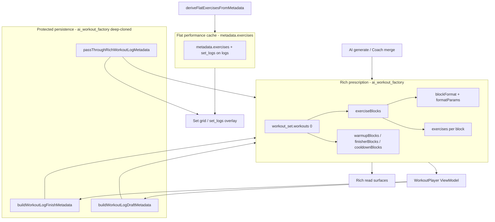

# Workout UI landscape audit (parametric blocks)

**Status:** Parametric Workout Engine epic **complete** (Steps 1–9 shipped). Living landscape audit for engineers and AI coding assistants (e.g. Gemini Code Assist).  
**Context:** Closed-world engine with **12** `block_format` values, block-level `formatParams`, merge-time exercise hydration, deterministic EMOM matrix hydration, interval timers in **WorkoutPlayer**, and protected `ai_workout_factory` persistence on logs.

**Implementation plans:** [parametric-step1-2-plan.md](./parametric-step1-2-plan.md) · [parametric-step3-plan.md](./parametric-step3-plan.md) · [parametric-step4-plan.md](./parametric-step4-plan.md) · [parametric-step5-plan.md](./parametric-step5-plan.md) · [parametric-step6-plan.md](./parametric-step6-plan.md) · [parametric-step7-plan.md](./parametric-step7-plan.md) · [parametric-step8-plan.md](./parametric-step8-plan.md) · [parametric-step9-plan.md](./parametric-step9-plan.md) · Native Alternating EMOMs: [parametric-emom-alternating-phase1-plan.md](./parametric-emom-alternating-phase1-plan.md) · [parametric-emom-alternating-phase2-plan.md](./parametric-emom-alternating-phase2-plan.md) · [parametric-emom-alternating-phase3-plan.md](./parametric-emom-alternating-phase3-plan.md)

**Related engine docs:** [parametric-workout-blocks](../../refactor/parametric-workout-blocks/README.md) · [rail-composer-tokens](../../agents/coach/rail-composer-tokens.md) · [layout-shell-architecture.md](./layout-shell-architecture.md) · [workout-player.md](../workout-player.md)

---

## Executive summary

| Layer                               | What ships today                                                                                                                                                                           | User impact                                                                                         |
| ----------------------------------- | ------------------------------------------------------------------------------------------------------------------------------------------------------------------------------------------ | --------------------------------------------------------------------------------------------------- |
| **Data (write path)**               | Coach merge + AI factory write `ai_workout_factory.workout_set` with `exerciseBlocks[]`, `blockFormat`, `formatParams`, warmup/finisher/cooldown                                           | Structured prescription in the DB                                                                   |
| **Deterministic hydration**         | `normalizeFormatParams` → `hydrateEmomAlternatingStations` before `validateBlockShape` on every parse/merge/synthesize path                                                                | LLM selects exercises and booleans; **server owns** `alternating_stations` matrix math              |
| **Data (read path — preview)**      | `RichWorkoutReadView`, `WorkoutMetadataPreview`, deck strips                                                                                                                               | Block sections + `formatBlockSubtitle()`                                                            |
| **Data (read path — execution)**    | **WorkoutPlayer** via `useWorkoutSessionViewModel`: block list, subtitles, **Tabata/EMOM interval shells**, alternating **modulo highlight routing**                                       | Athletes see and **run** parametric intent, not only read it                                        |
| **Persistence (logs)**              | **Log pass-through lane** + **draft autosave** deep-clone `ai_workout_factory`; finish uses `buildWorkoutLogFinishMetadata`                                                                | Rich EMOM/Tabata structure survives manual edits, mid-workout crash recovery, and completed history |
| **Flattening / prescription edits** | `workout` cards: flat divergent edits still call `applyFlatWorkoutEditsToMetadata` (main work → single `straight_sets` block). **`workout_log` cards:** factory preserved via pass-through | Intentional collapse only on **source workout** flat edits—not on completed logs                    |

**Bottom line:** The parametric engine is production-active in the Player (blocks, timers, alternating highlights). Remaining gaps are mostly **live-video flat loggers**, **block-aware editing** (Step 5), and advanced format UX (superset pairing, ladder progression UI).

---

## The AI / UI boundary and deterministic hydration

### Hybrid contract

| Responsibility                                                      | Owner                                              |
| ------------------------------------------------------------------- | -------------------------------------------------- |
| Exercise names, sets, reps, loads, coach notes                      | LLM (Coach JSON / rail composer)                   |
| `block_format`, scalar `format_params` (intervals, rounds, caps)    | LLM + catalog tokens (`:` picker)                  |
| `is_alternating`, catalog-only `is_combo`                           | Booleans on mentions—**not** Vertex schema keys    |
| `alternating_stations` zero-based index arrays                      | **Server only** (`hydrateEmomAlternatingStations`) |
| Interval timer state, active-row highlight, modulo minute → station | **WorkoutPlayer** client                           |

The LLM must **not** be relied on to emit correct `[[0],[1,2]]` matrices. When `is_alternating: true` and `alternating_stations` is missing or empty, hydration runs **before** `validateBlockShape` so blocks are not dropped as `emom_alternating_invalid_stations`.

**Canonical hydrator:** [`hydrate-emom-alternating-stations.ts`](../../../src/lib/agents/_shared/workout-metadata/hydrate-emom-alternating-stations.ts)  
**Call sites:** [`parse.ts`](../../../src/lib/agents/coach/parse.ts) · [`block-blueprint-synthesize.ts`](../../../src/lib/agents/coach/block-blueprint-synthesize.ts) · [`merge-coach-proposed-into-task-metadata.ts`](../../../src/lib/agents/_shared/workout-metadata/merge-coach-proposed-into-task-metadata.ts) · lane preflight (Deno)

### EMOM catalog taxonomy (`:phase/emom/<focus> `)

Third segment is picker/search metadata. Persisted shape is always `block_format: emom` + `format_params` (never the token string).

| Catalog focus           | `is_alternating` | `is_combo`         | Hydrated `alternating_stations` (when omitted)                      | Clinical intent                                                |
| ----------------------- | ---------------- | ------------------ | ------------------------------------------------------------------- | -------------------------------------------------------------- |
| **`straight`**          | `false`          | —                  | (none—legacy single-station EMOM)                                   | One movement every minute; classic straight EMOM               |
| **`density`**           | `false`          | —                  | (none—legacy multi-exercise parallel columns)                       | Every exercise every minute (high density), not AMRAP-for-time |
| **`alternating`**       | `true`           | —                  | `[[0],[1],[2],…]` one index per minute                              | A/B/C pacing circuit                                           |
| **`alternating-combo`** | `true`           | `true` (ephemeral) | `[[0],[1,2]]` for 3 exercises; last two paired on final minute slot | A / B+C couplets (e.g. Squat / Push-up + Sit-up)               |

`is_combo` is normalized through `normalizeFormatParams`, consumed by the hydrator, then **stripped** from persisted metadata so Zod/Vertex only see `is_alternating` + `alternating_stations`.

**Helpers:**

- `buildDefaultAlternatingStationsMatrix(n)` → `[[0],…,[n-1]]`
- `buildComboAlternatingStationsMatrix(n)` → solo minutes for `0…n-3`, then `[n-2,n-1]` paired (2 ex → `[[0,1]]`)

See [rail-composer-tokens.md](../../agents/coach/rail-composer-tokens.md) for full token list.

### Dual-stack architecture (client + Edge)

All block-library parsing, `normalizeFormatParams`, `validateBlockShape`, and EMOM matrix hydration are **mirrored**:

| Stack                      | Location                                                                            |
| -------------------------- | ----------------------------------------------------------------------------------- |
| **Next.js (canonical)**    | `src/lib/agents/coach/` · `src/lib/agents/_shared/workout-metadata/`                |
| **Supabase Deno (mirror)** | `supabase/functions/agents/coach/` · `supabase/functions/_shared/workout-metadata/` |

**Enforcement:** `pnpm check:agent-mirror` (see [`scripts/check-agent-mirror-parity.ts`](../../../scripts/check-agent-mirror-parity.ts)). Any change to canonical hydrator/library files must update the Deno mirror body byte-for-byte (header excluded).

Coach Edge dispatch and client Task Modal share the same deterministic boundaries—do not implement hydration only on one side.

---

## Data model reference (persistence layer)

### Field and helper reference

| Field / helper                            | Location                                                                                                      | Role                                                                                                                            |
| ----------------------------------------- | ------------------------------------------------------------------------------------------------------------- | ------------------------------------------------------------------------------------------------------------------------------- |
| `metadata.ai_workout_factory.workout_set` | `tasks.metadata`                                                                                              | Source of truth for block structure when present                                                                                |
| `metadata.exercises`                      | `tasks.metadata`                                                                                              | Derived performance cache; logging grid; `set_logs` on completed logs                                                           |
| `metadata.draft_logs`                     | in-progress `workout_log` only                                                                                | Autosave set matrix (`SetDraft[][]`); not used at finish                                                                        |
| `workout_log_schema_version`              | completed logs                                                                                                | `1` on player finish ([`buildWorkoutLogFinishMetadata`](../../../src/lib/workout-factory/build-workout-log-finish-metadata.ts)) |
| `buildWorkoutSessionViewModel`            | [workout-session-view-model.ts](../../../src/lib/workout-factory/workout-session-view-model.ts)               | `source`, `blocks[]`, `flatExercises`, `flatCacheStale`                                                                         |
| `finalizeWorkoutMetadataForSave`          | [item-metadata.ts](../../../src/lib/item-metadata.ts)                                                         | Task Modal save reconciliation                                                                                                  |
| `passThroughRichWorkoutLogMetadata`       | [sync-workout-metadata.ts](../../../src/lib/workout-factory/sync-workout-metadata.ts)                         | **Log pass-through lane**                                                                                                       |
| `buildWorkoutLogDraftMetadata`            | [build-workout-log-finish-metadata.ts](../../../src/lib/workout-factory/build-workout-log-finish-metadata.ts) | Mid-workout autosave snapshot                                                                                                   |
| `buildWorkoutLogFinishMetadata`           | same module                                                                                                   | Completed log snapshot                                                                                                          |
| `applyFlatWorkoutEditsToMetadata`         | sync-workout-metadata                                                                                         | **`workout` only**—degrades main `exerciseBlocks` when flat list diverges                                                       |

### Log pass-through lane (data-integrity)

**Problem solved:** Completed `workout_log` rows store flat `exercises` with `set_logs` (performance layer) **and** a prescription snapshot in `ai_workout_factory`. Task Modal save used to reconcile flat form state against factory-derived prescription and **collapse or strip** rich structure (“Manual Edit Leak”).

**Fix:** In `finalizeWorkoutMetadataForSave`, when `itemType === 'workout_log'` and `hasRichWorkoutSetInMetadata`:

- Call `passThroughRichWorkoutLogMetadata(built, fields.workoutExercises)`
- **Do not** call `applyFlatWorkoutEditsToMetadata`
- **Do not** replace `exercises` with factory-derived prescription
- Deep-clone `ai_workout_factory`; apply user flat edits (`weight`, `set_logs`, etc.) only to `metadata.exercises`

### Draft autosave (crash recovery)

**Problem solved:** In-progress autosave wrote only `draft_logs` + `source_task_id`. Reloading from the log card lost EMOM/Tabata structure (“Autosave Crash Leak”).

**Fix:** [`WorkoutPlayer`](../../../src/components/fitness/WorkoutPlayer.tsx) debounced autosave uses `buildWorkoutLogDraftMetadata`:

- Always: `source_task_id`, `draft_logs`, optional `class_instance_id`
- When source session is rich: deep-cloned `ai_workout_factory` (same gate as finish)
- Omits `workout_log_schema_version` and flat `exercises` until finish

### `workout` vs `workout_log` save semantics

| `item_type`   | Rich factory on manual save                                                                                |
| ------------- | ---------------------------------------------------------------------------------------------------------- |
| `workout`     | Reconcile flat vs derived; may degrade main block to `straight_sets` via `applyFlatWorkoutEditsToMetadata` |
| `workout_log` | **Pass-through**—factory + parametric blocks preserved                                                     |

### Twelve closed-world formats

From [block-blueprint-library.ts](../../../src/lib/agents/coach/block-blueprint-library.ts):

`straight_sets`, `superset`, `circuit`, `amrap`, `emom`, `tabata`, `ladder`, `chipper`, `pyramid`, `contrast`, `clusters`, `drop_sets`.

Merge hydrates **EMOM** (`workSeconds` / `restSeconds`) and **Tabata** (`hydrateTabataExercisesFromFormatParams`) on factory rows. **WorkoutPlayer** runs **AMRAP / Tabata / EMOM** interval shells (Step 7) and **alternating station highlight** via `alternating_stations` + modulo cycle index (Step 9 / Native Alternating EMOMs).

---

## View inventory

### Tier 1 — Primary prescription and execution

| #   | Component                  | Path                                                                                         | Role                                                     | Data source                                                                                            |
| --- | -------------------------- | -------------------------------------------------------------------------------------------- | -------------------------------------------------------- | ------------------------------------------------------------------------------------------------------ |
| 1   | **RichWorkoutReadView**    | [workout-viewer-dialog.tsx](../../../src/components/fitness/workout-viewer-dialog.tsx)       | Read-only prescription                                   | Rich `workoutSet` → blocks + subtitles                                                                 |
| 2   | **WorkoutViewerContent**   | same                                                                                         | View/edit shell                                          | Rich if `workoutSet`; else flat                                                                        |
| 3   | **WorkoutExercisesEditor** | [workout-exercises-editor.tsx](../../../src/components/fitness/workout-exercises-editor.tsx) | Edit mode                                                | **Flat only** (block editor planned Step 5)                                                            |
| 4   | **WorkoutPlayer**          | [WorkoutPlayer.tsx](../../../src/components/fitness/WorkoutPlayer.tsx)                       | Live session: blocks, **timers**, finish → `workout_log` | `useWorkoutSessionViewModel` → `WorkoutPlayerBlockList`; flat logging indices                          |
| 5   | **TaskModal**              | [TaskModal.tsx](../../../src/components/modals/TaskModal.tsx)                                | Viewer, player, AI                                       | `metadata` + form state                                                                                |
| 6   | **useTaskWorkoutAi**       | [useTaskWorkoutAi.ts](../../../src/components/modals/task-modal/hooks/useTaskWorkoutAi.ts)   | Viewer Apply                                             | Block path: `applyBlockEditsToMetadata`; flat path: `applyFlatWorkoutEditsToMetadata` (`workout` only) |

### Tier 2 — Board, shell, launch

| #   | Component                  | Path                                                                                               | Role                              |
| --- | -------------------------- | -------------------------------------------------------------------------------------------------- | --------------------------------- |
| 7   | **KanbanTaskCard**         | [kanban-task-card.tsx](../../../src/components/board/kanban-task-card.tsx)                         | Play / Quick View; rich detection |
| 8   | **DashboardShell**         | [dashboard-shell.tsx](../../../src/components/dashboard/dashboard-shell.tsx)                       | Global `WorkoutPlayer` host       |
| 9   | **TaskModalWorkoutFields** | [TaskModalWorkoutFields.tsx](../../../src/components/modals/task-modal/TaskModalWorkoutFields.tsx) | `WorkoutLogReadSummary` for logs  |

### Tier 3 — Live video (still predominantly flat)

| #   | Component                    | Path                                                                                                        | Gap                                     |
| --- | ---------------------------- | ----------------------------------------------------------------------------------------------------------- | --------------------------------------- |
| 10  | **LiveSessionWorkoutPlayer** | [LiveSessionWorkoutPlayer.tsx](../../../src/features/live-video/shells/huddle/LiveSessionWorkoutPlayer.tsx) | Flat `workoutExercises`                 |
| 11  | **ParticipantWorkoutLogger** | [ParticipantWorkoutLogger.tsx](../../../src/features/live-video/shells/ParticipantWorkoutLogger.tsx)        | Flat                                    |
| 12  | **SessionDeckBuilder**       | [SessionDeckBuilder.tsx](../../../src/features/live-video/shells/huddle/SessionDeckBuilder.tsx)             | Rich strip summary when factory present |

### Tier 4 — Chat and drafts

| #   | Component               | Path                                                                            | Data                                              |
| --- | ----------------------- | ------------------------------------------------------------------------------- | ------------------------------------------------- |
| 13  | **WorkoutCoachRail**    | [WorkoutCoachRail.tsx](../../../src/components/chat/WorkoutCoachRail.tsx)       | Rich context + `execution_patch`                  |
| 14  | **CoachDraftCard**      | [CoachDraftCard.tsx](../../../src/components/chat/CoachDraftCard.tsx)           | `WorkoutMetadataPreview` when factory in proposal |
| 15  | **RichMessageComposer** | [RichMessageComposer.tsx](../../../src/components/chat/RichMessageComposer.tsx) | `:` catalog tokens                                |

### Tier 5 — Post-workout

| Surface                                | Status                                                                                                                                         |
| -------------------------------------- | ---------------------------------------------------------------------------------------------------------------------------------------------- |
| **TaskModal `workout_log` read**       | Rich blocks + `set_logs` overlay ([`WorkoutLogReadSummary`](../../../src/components/fitness/workout-block-renderer/WorkoutLogReadSummary.tsx)) |
| **WorkoutPlayer `handleFinish`**       | `buildWorkoutLogFinishMetadata` — factory + flat `set_logs`                                                                                    |
| **Workout Viewer `readVariant="log"`** | Rich log summary when factory + `set_logs` present                                                                                             |

Per-surface docs: [workout-player.md](../workout-player.md) · [workout-viewer-dialog.md](../workout-viewer-dialog.md) · [workout-exercises-editor.md](../workout-exercises-editor.md)

---

## Parametric gap analysis

### Format support in WorkoutPlayer (execution)

| Format                                                      | Player status                                                                            |
| ----------------------------------------------------------- | ---------------------------------------------------------------------------------------- |
| `straight_sets`                                             | Flat set grid (adequate)                                                                 |
| `amrap`                                                     | **Shipped** — local round extension + time cap shell                                     |
| `emom`                                                      | **Shipped** — interval shell + alternating highlight via `alternating_stations` / modulo |
| `tabata`                                                    | **Shipped** — work/rest interval shell + row highlight sync                              |
| `superset` / `contrast`                                     | Subtitles + meta; **no** paired-round UX                                                 |
| `circuit`                                                   | Block list; **no** round-robin chrome                                                    |
| `ladder` / `pyramid` / `chipper` / `clusters` / `drop_sets` | Subtitles + target lines; **no** interactive progression UI                              |

### Gap matrix (read vs execute)

| View                       | Block sections | Subtitles     | Timers AMRAP/EMOM/Tabata | Alternating highlight    |
| -------------------------- | -------------- | ------------- | ------------------------ | ------------------------ |
| RichWorkoutReadView        | Yes            | Yes           | Meta only                | N/A (read-only)          |
| **WorkoutPlayer**          | **Yes**        | **Yes**       | **Yes**                  | **Yes** (modulo routing) |
| WorkoutExercisesEditor     | No             | No            | No                       | No                       |
| TaskModal workout_log read | **Yes**        | **Yes**       | N/A                      | N/A (`set_logs` overlay) |
| Live loggers / deck edit   | No             | Partial strip | No                       | No                       |
| CoachDraftCard             | Yes (compact)  | Yes           | No                       | No                       |

### Resolved vs remaining behavioral notes

| Topic                                                          | Status                                                                      |
| -------------------------------------------------------------- | --------------------------------------------------------------------------- |
| Player reads `exerciseBlocks` via ViewModel                    | **Done** (Step 3)                                                           |
| Apply no longer deletes factory                                | **Done** (Step 1)                                                           |
| Finish + history preserve `ai_workout_factory`                 | **Done** (Step 8)                                                           |
| Manual edit on **completed log** preserves factory             | **Done** (log pass-through)                                                 |
| Draft autosave preserves factory                               | **Done** (`buildWorkoutLogDraftMetadata`)                                   |
| EMOM / Tabata interval timers in Player                        | **Done** (Step 7)                                                           |
| Deterministic `alternating_stations` hydration                 | **Done** (Step 9 + combo preset)                                            |
| Flattening drops block boundaries **for logging grid indices** | **By design** — flat cache is performance layer; factory holds prescription |
| Block-aware **edit** mode in viewer                            | **Planned** ([parametric-step5-plan.md](./parametric-step5-plan.md))        |
| Live video full parametric execution                           | **Open**                                                                    |

---

## Architectural recommendation (post-epic)

### Principle: one block presentation layer

**Shipped:** [`WorkoutSessionViewModel`](../../../src/lib/workout-factory/workout-session-view-model.ts) + [`workout-block-renderer/`](../../../src/components/fitness/workout-block-renderer/) (read + player shells).

**Do not** add format-specific branches only inside `WorkoutPlayer` without extending the shared renderer—keep parse/hydration/validation mirrored on Edge.

### Suggested next phases

| Phase                        | Scope                               | Status                                                            |
| ---------------------------- | ----------------------------------- | ----------------------------------------------------------------- |
| P0 Data + Player blocks      | ViewModel + block list              | **Done**                                                          |
| P1 Read parity               | Deck / draft compact previews       | **Mostly done** (Step 4)                                          |
| P2 Player timers             | AMRAP / Tabata / EMOM shells        | **Done** (Step 7)                                                 |
| P3 EMOM taxonomy + hydration | Catalog tokens + matrix inject      | **Done** (Step 9)                                                 |
| P4 Log integrity             | Pass-through + draft/finish factory | **Done** (post–Step 8)                                            |
| P5 Edit & guardrails         | Block editor, Apply guards on logs  | **Open** ([parametric-step5-plan.md](./parametric-step5-plan.md)) |
| P6 Live video                | Parametric deck/logger              | **Open**                                                          |

---

## Verification checklist (regression)

1. Rich card with only `ai_workout_factory` → Play shows blocks, subtitles, correct timer shell for format.
2. `:main/emom/alternating` + 3 exercises → hydrated `[[0],[1],[2]]`; alternating highlight cycles per minute.
3. `:main/emom/alternating-combo` + 3 exercises → hydrated `[[0],[1,2]]`; minute 2 highlights stations 1+2 only.
4. Tabata block → work/rest timer; row highlight follows round.
5. Finish workout → `workout_log` has `workout_log_schema_version: 1`, `ai_workout_factory`, `set_logs`.
6. Edit weight on completed log in Task Modal → Save → factory and EMOM blocks unchanged (`passThroughRichWorkoutLogMetadata`).
7. Mid-workout autosave → reload from in-progress log card → EMOM structure restored after autosave tick.
8. `pnpm check:agent-mirror` passes after any hydrator/library edit.

---

## Audit metadata

| Item                   | Value                                                          |
| ---------------------- | -------------------------------------------------------------- |
| Epic status            | Steps 1–9 **complete**                                         |
| Doc sync               | 2026-05-18                                                     |
| Primary branch context | `feat/mobile-chat-thread-overlay` (parametric + log integrity) |
| Layout documentation   | [layout-shell-architecture.md](./layout-shell-architecture.md) |
