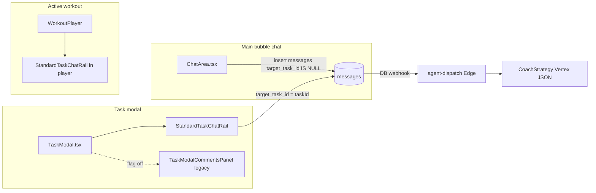
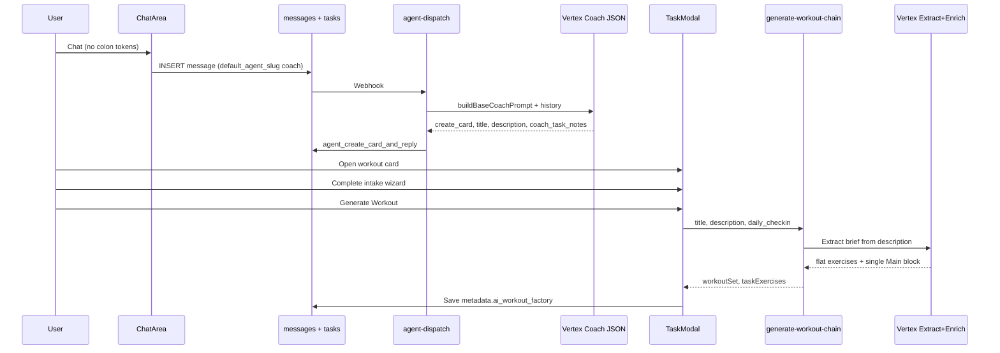
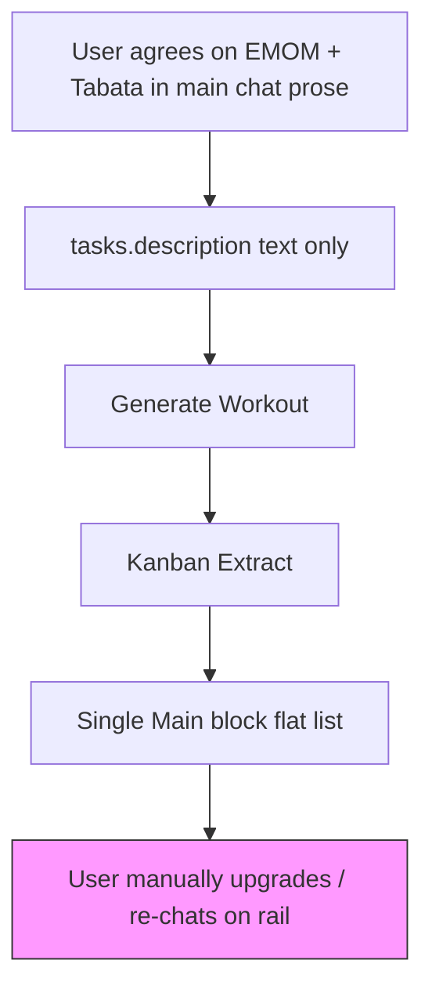
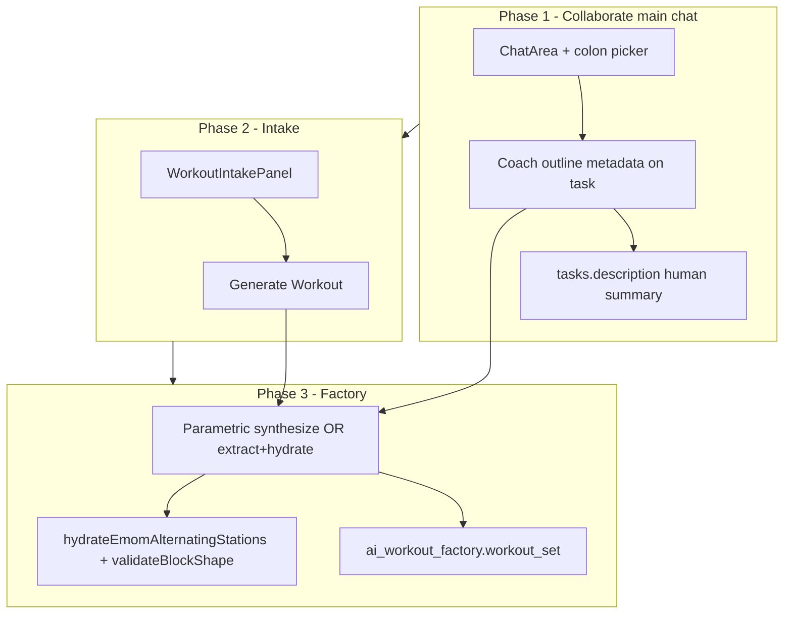

# Apex Architect handoff — architecture audit (research)

**Mode:** Research audit (implementation tracked below).  
**Phase 1 (shipped):** Apex Architect persona + main-chat `:` catalog + always-on block blueprint library in [`ChatArea`](../../../src/components/chat/ChatArea.tsx) / [`prompts.ts`](../../../src/lib/agents/coach/prompts.ts). **Phase 2 (shipped):** validated parametric blocks persist on new cards at `tasks.metadata.coach_workout_outline` via `p_coach_workout_outline` on `agent_create_card_and_reply` and rail/direct updates via `applyCoachWorkoutOutlineToTaskMetadata`. Phase 3 (Vertex handoff on Generate Workout) remains open.  
**Goal:** Trace how **main bubble chat** → **Intake Form** → **Generate Workout** → **Vertex** works today, and identify what must change so the main chatarea Coach can collaboratively build a **parametric outline** (`:main/emom/alternating`, `:metcon/tabata`, etc.) and hand it to the factory on **Generate Workout**.

**Related:** [Workout UI landscape audit](./README.md) · [Coach ↔ Vertex handoff assessment](../../coach-vertex-workout-handoff-assessment.md) · [rail-composer-tokens](../../agents/coach/rail-composer-tokens.md) · [vertex-agent-dispatch consolidation](../../refactor/vertex-agent-dispatch-consolidation/README.md)

---

## Executive summary

| Stage                      | Today                                                                                                                                                                                            | Apex Architect gap                                                                                   |
| -------------------------- | ------------------------------------------------------------------------------------------------------------------------------------------------------------------------------------------------ | ---------------------------------------------------------------------------------------------------- |
| **Main chat Coach**        | Prose intake + `create_card` with `tasks.title` / `tasks.description`; no `:` catalog in composer; block library **not** injected unless `block_blueprint_mentions` on the message               | Need **Apex Architect** persona, colon picker, and durable **structured outline** in chat/card state |
| **Task modal chat** (rail) | `StandardTaskChatRail` has colon tokens + LIVE CO-PILOT; can append parametric blocks **only when** `ai_workout_factory.workout_set` already exists; otherwise `card_action: trigger_generation` | Main chat should converge on this capability **before** first factory run                            |
| **Generate Workout**       | `POST /api/ai/generate-workout-chain` with **title + description + intake wizard** only — **no chat history**, **no block outline JSON**                                                         | Must pass agreed outline + intake into Vertex (or a new synthesis step)                              |
| **Vertex factory**         | Kanban **Extract → Enrich** produces a **single flat `Main` block** (`straight_sets`-shaped list), not parametric `block_format` / `formatParams`                                                | Must emit full `ai_workout_factory.workout_set` with EMOM/Tabata/etc.                                |

---

## Surface map: three Coach entry points



| Surface                  | Component                                                                                                                        | `messages.metadata.surface` | Default agent                    | Colon block picker                              | Block library in prompt                                                           |
| ------------------------ | -------------------------------------------------------------------------------------------------------------------------------- | --------------------------- | -------------------------------- | ----------------------------------------------- | --------------------------------------------------------------------------------- |
| **Main chatarea**        | [`ChatArea.tsx`](../../../src/components/chat/ChatArea.tsx)                                                                      | _(unset)_                   | `coach` via `default_agent_slug` | **No** (`enableBlockBlueprintMentions` not set) | Only if `block_blueprint_mentions` present (unreachable from UI today)            |
| **Task modal comments**  | [`StandardTaskChatRail.tsx`](../../../src/components/chat/StandardTaskChatRail.tsx) when `NEXT_PUBLIC_STANDARD_TASK_CHAT_RAIL=1` | `standard_task_chat_rail`   | per `item_type`                  | **Yes** for `workout` / `workout_log`           | **Always** on rail (`shouldInjectBlockBlueprintLibrary({ isRailSurface: true })`) |
| **Legacy task comments** | [`TaskModalCommentsPanel.tsx`](../../../src/components/modals/task-modal/TaskModalCommentsPanel.tsx)                             | _(unset)_                   | `coach`                          | **No**                                          | Same as main chat                                                                 |
| **Workout player rail**  | `StandardTaskChatRail` inside [`WorkoutPlayer.tsx`](../../../src/components/fitness/WorkoutPlayer.tsx)                           | `standard_task_chat_rail`   | `coach`                          | Yes (workout context)                           | Rail + workout JSON / compact block index                                         |

**Differentiation from workout-coach-rail:** The dedicated [`WorkoutCoachRail.tsx`](../../../src/components/chat/WorkoutCoachRail.tsx) wrapper is being retired in favor of `StandardTaskChatRail` + `WorkoutPlayer` (see [phase-5-workout-coach-rail-migration](../../refactor/standard-task-chat-rail/phase-5-workout-coach-rail-migration.md)). Runtime behavior is **`CoachStrategy`** in [`supabase/functions/agents/coach/strategy.ts`](../../../supabase/functions/agents/coach/strategy.ts), not a separate edge function.

---

## 1. Main chat Coach agent

### 1.1 Trigger and routing

1. User posts in [`ChatArea`](../../../src/components/chat/ChatArea.tsx) → `sendMessage` inserts a row into `public.messages` with `target_task_id IS NULL` (main channel only; see [phase-3.8 strict channel isolation](../../refactor/standard-task-chat-rail/phase-3.8-strict-channel-isolation.md)).
2. Database webhook invokes **`supabase/functions/agent-dispatch`** ([`handler.ts`](../../../supabase/functions/agent-dispatch/handler.ts)).
3. [`resolveAgent`](../../../supabase/functions/agent-dispatch/resolve.ts) picks **Coach** when:
   - message mentions `@coach`, or
   - `metadata.default_agent_slug === 'coach'` (ChatArea sets this on send), or
   - bubble default agent binding.
4. [`CoachStrategy.buildSystemPrompt`](../../../supabase/functions/agents/coach/strategy.ts) assembles the system prompt; [`buildContents`](../../../supabase/functions/agents/coach/strategy.ts) maps thread history + trigger text to Vertex `contents`.

### 1.2 System prompt and schema (canonical sources)

| Artifact                                       | Path                                                                                                                                                 |
| ---------------------------------------------- | ---------------------------------------------------------------------------------------------------------------------------------------------------- |
| Base persona + intake / card / PRE-DRAFT rules | [`src/lib/agents/coach/prompts.ts`](../../../src/lib/agents/coach/prompts.ts) → `buildBaseCoachPrompt()`                                             |
| Block taxonomy prose                           | [`src/lib/agents/coach/block-blueprint-library.ts`](../../../src/lib/agents/coach/block-blueprint-library.ts) → `buildBlockBlueprintLibraryPrompt()` |
| Vertex JSON schema                             | [`src/lib/agents/coach/schema.ts`](../../../src/lib/agents/coach/schema.ts) → `COACH_RESPONSE_SCHEMA`                                                |
| Server guards + parametric drop                | [`src/lib/agents/coach/server-guards.ts`](../../../src/lib/agents/coach/server-guards.ts)                                                            |
| Deno mirror                                    | `supabase/functions/agents/coach/*` (enforced by `pnpm check:agent-mirror`)                                                                          |

**Main-chat-specific prompt behavior:**

- `isCoachRailSurfaceFromMessageMetadata` is **false** → [`buildCurrentTaskContextBlock`](../../../src/lib/agents/coach/prompts.ts) uses **PRE-DRAFT CONFIRMATION** tail (not LIVE CO-PILOT).
- [`shouldInjectBlockBlueprintLibrary`](../../../src/lib/agents/coach/block-blueprint-library.ts): `isRailSurface || blockBlueprintMentionCount > 0` → main chat **does not** get the library unless mentions exist (composer does not emit them).
- Thinking budget: [`COACH_MAIN_CHAT_INTAKE_THINKING_BUDGET`](../../../src/lib/agents/coach/config.ts) (512) on non-rail intake turns.

### 1.3 How the “outline” is produced today (main chat)

Coach does **not** emit a separate `outline` JSON field. The negotiated plan is stored as:

| Output field                      | Persisted to                                       | Shape                                                                                         |
| --------------------------------- | -------------------------------------------------- | --------------------------------------------------------------------------------------------- |
| `create_card: true`               | `tasks` via `agent_create_card_and_reply`          | `task_title`, `task_description` (prose brief)                                                |
| `coach_task_notes`                | Seed **task comment** (`p_seed_task_comment_text`) | Prose + mandatory **Generate Workout** CTA                                                    |
| `proposed_workout_metadata`       | Usually **null** on main chat pre-factory          | Server **drops** parametric `blocks[]` on flat merge (`parametric_requires_rich_workout_set`) |
| `card_action: trigger_generation` | `messages.metadata` on reply                       | Client runs generator (see §3) — **primarily wired on task rail**, not main bubble            |

**Explicit guard in base prompt** ([`prompts.ts`](../../../src/lib/agents/coach/prompts.ts)):

> On a card with no `ai_workout_factory.workout_set` yet, you may NOT emit `proposed_workout_metadata.blocks` with parametric `block_format` … Use `card_action: 'trigger_generation'` instead.

So the main chat “outline” is **natural-language** in `tasks.description`, not parametric blocks.

### 1.4 Catalog tokens in main chat

| Mechanism                                   | Main chat                                                                                                                                                                                     | Task rail                                                                                   |
| ------------------------------------------- | --------------------------------------------------------------------------------------------------------------------------------------------------------------------------------------------- | ------------------------------------------------------------------------------------------- |
| `:` block picker UI                         | **Off** — [`RichMessageComposer`](../../../src/components/chat/RichMessageComposer.tsx) defaults `enableBlockBlueprintMentions: false`; ChatArea only sets `enableExerciseHashMentions: true` | **On** — `TaskModal` passes `enableBlockBlueprintMentions={isWorkoutItemType}`              |
| `metadata.block_blueprint_mentions` on send | Not produced                                                                                                                                                                                  | Produced in [`StandardTaskChatRail`](../../../src/components/chat/StandardTaskChatRail.tsx) |
| Deterministic preflight                     | [`block-blueprint-lane-preflight.ts`](../../../supabase/functions/agents/coach/block-blueprint-lane-preflight.ts) (Lane 1/2 append)                                                           | Same, requires mentions + known task                                                        |
| `synthesizeProposedBlocksFromMentions`      | Only if mentions somehow present                                                                                                                                                              | Normal path for `:` turns                                                                   |

Catalog definitions: [`block-blueprint-catalog.ts`](../../../src/lib/agents/coach/block-blueprint-catalog.ts) (e.g. `:main/emom/alternating`, `:metcon/tabata`). Documented in [rail-composer-tokens.md](../../agents/coach/rail-composer-tokens.md).

### 1.5 Main chat composer payload

[`ChatArea`](../../../src/components/chat/ChatArea.tsx) send path (simplified):

```ts
// Coach routing hint only — no task_modal_live_state, no block_blueprint_mentions
metadata: {
  default_agent_slug: 'coach';
}
```

No attachment of intake wizard state (that exists only on **task rail** via `buildStandardTaskChatRailOutgoingMetadata` in [`TaskModal.tsx`](../../../src/components/modals/TaskModal.tsx)).

---

## 2. Intake UI and “Generate Workout” trigger

### 2.1 UI locations

| Control                                         | Component                                                                                            | Handler                                                                                                                                                      |
| ----------------------------------------------- | ---------------------------------------------------------------------------------------------------- | ------------------------------------------------------------------------------------------------------------------------------------------------------------ |
| **Generate Workout** (primary)                  | [`WorkoutIntakePanel.tsx`](../../../src/components/fitness/WorkoutIntakePanel.tsx)                   | `handleSubmit` → `handleAiGenerateWorkout(wizardData)`                                                                                                       |
| Hosted in Details tab                           | [`TaskModalDetailsBody.tsx`](../../../src/components/modals/task-modal/TaskModalDetailsBody.tsx)     | `onGenerateWorkoutFromIntake` prop                                                                                                                           |
| Wired in modal                                  | [`TaskModal.tsx`](../../../src/components/modals/TaskModal.tsx)                                      | `handleGenerateWorkoutFromIntake` → `handleAiGenerateWorkout` from [`useTaskWorkoutAi`](../../../src/components/modals/task-modal/hooks/useTaskWorkoutAi.ts) |
| Inline **Generate** in comments (legacy layout) | [`TaskModalCommentsPanel.tsx`](../../../src/components/modals/task-modal/TaskModalCommentsPanel.tsx) | `onGenerateWorkout` → `handleGenerateWorkoutFromComments` (no wizard payload)                                                                                |
| Chat **trigger_generation**                     | `useAgentEffectSweep` → `onCardAction`                                                               | `handleCardAction` → `handleAiGenerateWorkout(buildWizardPayload())`                                                                                         |

Intake wizard state: [`useWorkoutIntakeWizardState.ts`](../../../src/components/modals/task-modal/hooks/useWorkoutIntakeWizardState.ts) (readiness, sleep, duration, intensity, soreness, equipment). Coach can mirror sliders via **`task_modal_intake_patch`** on task-scoped messages (effect sweep in TaskModal).

### 2.2 Exact API payload on Generate Workout

[`useTaskWorkoutAi.handleAiGenerateWorkout`](../../../src/components/modals/task-modal/hooks/useTaskWorkoutAi.ts) calls [`postGenerateWorkoutChain`](../../../src/lib/workout-factory/api-client.ts):

```json
{
  "workspace_id": "<uuid>",
  "daily_checkin": {
    "readiness": 7,
    "equipment": ["Dumbbells", "..."],
    "sleepQuality": 8,
    "durationMinutes": 30,
    "soreness": ["None"],
    "targetIntensity": "Moderate",
    "target_duration_min": 30
  },
  "workout_brief_authoritative": true,
  "persona": {
    "title": "<tasks.title>",
    "description": "<tasks.description>",
    "sessionDurationMinutes": 45
  }
}
```

**Not included today:**

- Chat transcript / thread history
- `block_blueprint_mentions` or synthesized block shells
- `proposed_workout_metadata` / `ai_workout_factory` draft from Coach
- `architectBlueprint` or `step1UserPromptOverride` (accepted by [`prepareWorkoutChainRequest`](../../../src/lib/workout-factory/prepare-workout-chain-request.ts) but unused by the active pipeline)

On success, the client writes:

```ts
metadata.ai_workout_factory = {
  generated_at,
  model,
  workout_set,
  chain_metadata,
};
metadata.exercises = taskExercises; // flat cache
```

### 2.3 Coach ↔ intake coupling (task rail only)

When the user sends from **StandardTaskChatRail**, outgoing metadata includes:

```ts
task_modal_live_state: { v: 1, item_type, wizard_step, readiness, sleep_quality, ... }
workoutContext?: // if factory or flat exercises exist
```

Coach reads this in [`readTaskModalLiveStateFromMessageMetadata`](../../../src/lib/agents/coach/prompts.ts) and may emit **`task_modal_intake_patch`**; TaskModal applies patches via `handleTaskModalIntakePatch`.

**Main bubble chat does not send `task_modal_live_state`** — intake is filled manually on the card after `create_card`.

### 2.4 `card_action: trigger_generation` (auto-generate)

| Step                  | Behavior                                                                                                                                                                |
| --------------------- | ----------------------------------------------------------------------------------------------------------------------------------------------------------------------- |
| Coach infers or emits | [`card-action-infer.ts`](../../../supabase/functions/agents/coach/card-action-infer.ts) / schema `card_action`                                                          |
| Guard                 | Rail + no rich `workout_set` + user consent + not active workout session                                                                                                |
| Client                | [`TaskModal.handleCardAction`](../../../src/components/modals/TaskModal.tsx) dedupes by message id, opens viewer, calls `handleAiGenerateWorkout(buildWizardPayload())` |
| **Main chat**         | `useAgentEffectSweep` exists on **task rail** only; bubble feed does not auto-run generation from `card_action`                                                         |

---

## 3. Vertex / factory generation path

### 3.1 Not agent-dispatch

Full **`ai_workout_factory`** JSON is **not** built by the Coach Edge function. Coach uses **Vertex Gemini JSON mode** for conversational fields; the heavy factory runs on **Next.js**:

```
POST /api/ai/generate-workout-chain
  → buildBuddyWorkoutPersona (fitness_profiles + overrides)
  → runGenerateWorkoutChain
  → runExtractAndEnrichChain (Kanban path only)
```

Entry: [`src/app/api/ai/generate-workout-chain/route.ts`](../../../src/app/api/ai/generate-workout-chain/route.ts).

### 3.2 Kanban Extract → Enrich pipeline

| Step            | Module                                                                                                           | Vertex model                    | Output                                                                                                                                                      |
| --------------- | ---------------------------------------------------------------------------------------------------------------- | ------------------------------- | ----------------------------------------------------------------------------------------------------------------------------------------------------------- |
| **A – Extract** | [`extract-workout-from-brief.ts`](../../../src/lib/workout-factory/prompt-chain/extract-workout-from-brief.ts)   | `gemini-3.1-flash-lite-preview` | [`KanbanExtractBriefOutput`](../../../src/lib/workout-factory/types/kanban-extract-types.ts): flat `exercises[]` with `section: warmup \| main \| cooldown` |
| **B – Enrich**  | [`enrich-workout-biomechanics.ts`](../../../src/lib/workout-factory/prompt-chain/enrich-workout-biomechanics.ts) | same                            | Coaching prose per exercise `order`                                                                                                                         |
| **Assemble**    | [`map-kanban-extract-to-workout.ts`](../../../src/lib/workout-factory/map-kanban-extract-to-workout.ts)          | —                               | **`exerciseBlocks: [{ order: 1, name: 'Main', exercises: [...] }]`** — no `block_format`, no EMOM matrix                                                    |

The extractor prompt mentions HIIT wording (`work_seconds`, AMRAP language) but the **assembler always collapses main work into one anonymous Main block**, not `:main/emom/alternating` parametric blocks.

### 3.3 Where parametric blocks _are_ built today

| Path                        | When                                                                                      | Functions                                                                                                                                                                                                                                                               |
| --------------------------- | ----------------------------------------------------------------------------------------- | ----------------------------------------------------------------------------------------------------------------------------------------------------------------------------------------------------------------------------------------------------------------------- |
| **Coach merge (rail)**      | User has `ai_workout_factory.workout_set`; Coach emits `proposed_workout_metadata.blocks` | [`mergeCoachProposedIntoTaskMetadata`](../../../supabase/functions/_shared/workout-metadata/merge-coach-proposed-into-task-metadata.ts) + [`hydrateEmomAlternatingStations`](../../../supabase/functions/_shared/workout-metadata/hydrate-emom-alternating-stations.ts) |
| **Colon preflight**         | Rail message with `block_blueprint_mentions`                                              | [`block-blueprint-lane-preflight.ts`](../../../supabase/functions/agents/coach/block-blueprint-lane-preflight.ts) → [`synthesizeProposedBlocksFromMentions`](../../../supabase/functions/agents/coach/block-blueprint-synthesize.ts)                                    |
| **Generate Workout button** | **Does not** use synthesize path                                                          | Kanban extract only                                                                                                                                                                                                                                                     |

### 3.4 Legacy / unused factory hooks

[`prepareWorkoutChainRequest`](../../../src/lib/workout-factory/prepare-workout-chain-request.ts) still accepts `architectBlueprint` and `step1UserPromptOverride`, but [`generate-workout-chain-runner.ts`](../../../src/lib/workout-factory/generate-workout-chain-runner.ts) documents that **all** generation uses Kanban extract+enrich only. The old 4-step Architect → Biomechanist → Equipment → Mathematician chain is not invoked from the Task Modal button.

---

## 4. End-to-end data flow (current)

### 4.1 Happy path: main chat → card → intake → generate



### 4.2 Happy path: task rail with colon tokens (post-factory editing)

After `ai_workout_factory` exists, user can append `:finisher/emom/alternating` blocks via rail; merge + hydration run server-side. **Generate Workout** is not required for those edits.

### 4.3 Gap: parametric outline before first factory



---

## 5. Files to update for Apex Architect (implementation checklist)

Grouped by workstream **(a)** persona + main chat tokens, **(b)** outline extraction/storage, **(c)** Vertex handoff.

### (a) Inject Apex Architect persona and catalog into main chat

| File                                                                                                                          | Change                                                                                                                                                                              |
| ----------------------------------------------------------------------------------------------------------------------------- | ----------------------------------------------------------------------------------------------------------------------------------------------------------------------------------- |
| [`src/lib/agents/coach/prompts.ts`](../../../src/lib/agents/coach/prompts.ts)                                                 | New `buildApexArchitectPrompt()` or extend `buildBaseCoachPrompt` for `surface !== rail`; outline-first collaboration; when to use catalog tokens in **prose** vs structured fields |
| [`supabase/functions/agents/coach/prompts.ts`](../../../supabase/functions/agents/coach/prompts.ts)                           | Mirror                                                                                                                                                                              |
| [`src/lib/agents/coach/config.ts`](../../../src/lib/agents/coach/config.ts)                                                   | Optional thinking budget / model notes for outline turns                                                                                                                            |
| [`src/components/chat/ChatArea.tsx`](../../../src/components/chat/ChatArea.tsx)                                               | `RichMessageComposer` `features.enableBlockBlueprintMentions: true` (or gated flag); attach `block_blueprint_mentions` on send (parity with rail)                                   |
| [`src/components/chat/RichMessageComposer.tsx`](../../../src/components/chat/RichMessageComposer.tsx)                         | Only if new UX hooks needed beyond existing colon picker                                                                                                                            |
| [`src/lib/agents/coach/block-blueprint-mentions-client.ts`](../../../src/lib/agents/coach/block-blueprint-mentions-client.ts) | Already has catalog; ensure main chat uses same payloads                                                                                                                            |
| [`shouldInjectBlockBlueprintLibrary`](../../../src/lib/agents/coach/block-blueprint-library.ts)                               | Consider `isMainChatOutlineSession` or always inject library when `session_request` / workout intent (product decision)                                                             |
| [`scripts/check-agent-prompt-schema-drift.ts`](../../../scripts/check-agent-prompt-schema-drift.ts)                           | Update prompt corpus if Apex block added                                                                                                                                            |
| [`docs/agents/coach/rail-composer-tokens.md`](../../agents/coach/rail-composer-tokens.md)                                     | Document main-chat parity                                                                                                                                                           |

### (b) Extract and persist the agreed parametric outline

| File                                                                                                                                                                                        | Change                                                                                                                                          |
| ------------------------------------------------------------------------------------------------------------------------------------------------------------------------------------------- | ----------------------------------------------------------------------------------------------------------------------------------------------- |
| [`src/lib/agents/coach/schema.ts`](../../../src/lib/agents/coach/schema.ts)                                                                                                                 | Possible new field e.g. `workout_outline` / extend `proposed_workout_metadata` rules for **pre-factory** cards on main chat (today guarded out) |
| [`src/lib/agents/coach/server-guards.ts`](../../../src/lib/agents/coach/server-guards.ts)                                                                                                   | Relax or branch `parametric_requires_rich_workout_set` for **staged outline** on `tasks.metadata` (new key e.g. `coach_workout_outline`)        |
| [`supabase/functions/_shared/workout-metadata/merge-coach-proposed-into-task-metadata.ts`](../../../supabase/functions/_shared/workout-metadata/merge-coach-proposed-into-task-metadata.ts) | Merge outline into task before factory exists                                                                                                   |
| [`supabase/functions/agents/coach/strategy.ts`](../../../supabase/functions/agents/coach/strategy.ts)                                                                                       | `persist` / `create_card`: persist outline JSON on task metadata, not only description prose                                                    |
| [`src/components/modals/TaskModal.tsx`](../../../src/components/modals/TaskModal.tsx)                                                                                                       | Load/display outline; pass to generate handler                                                                                                  |
| [`src/components/fitness/WorkoutIntakePanel.tsx`](../../../src/components/fitness/WorkoutIntakePanel.tsx)                                                                                   | Optional preview of agreed blocks before generate                                                                                               |
| [`src/types/database.ts`](../../../src/types/database.ts)                                                                                                                                   | If new metadata keys are formalized                                                                                                             |
| Migration (if needed)                                                                                                                                                                       | Document-only metadata keys may avoid migration                                                                                                 |

**Alternative:** Keep outline only in `tasks.description` but require machine-readable appendix (fragile). Prefer explicit metadata JSON synced from Coach `proposed_workout_metadata.blocks` + colon mentions.

### (c) Pass outline + intake to Vertex on Generate Workout

| File                                                                                                                                                | Change                                                                                                                                                                                                                                                                                                                                                                    |
| --------------------------------------------------------------------------------------------------------------------------------------------------- | ------------------------------------------------------------------------------------------------------------------------------------------------------------------------------------------------------------------------------------------------------------------------------------------------------------------------------------------------------------------------- |
| [`src/components/modals/task-modal/hooks/useTaskWorkoutAi.ts`](../../../src/components/modals/task-modal/hooks/useTaskWorkoutAi.ts)                 | Include outline blocks / mentions in `postGenerateWorkoutChain` body                                                                                                                                                                                                                                                                                                      |
| [`src/lib/workout-factory/api-client.ts`](../../../src/lib/workout-factory/api-client.ts)                                                           | Extend request type                                                                                                                                                                                                                                                                                                                                                       |
| [`src/app/api/ai/generate-workout-chain/route.ts`](../../../src/app/api/ai/generate-workout-chain/route.ts)                                         | Forward outline to runner                                                                                                                                                                                                                                                                                                                                                 |
| [`src/lib/workout-factory/generate-workout-chain-runner.ts`](../../../src/lib/workout-factory/generate-workout-chain-runner.ts)                     | Branch: Kanban extract **vs** parametric synthesis                                                                                                                                                                                                                                                                                                                        |
| **New or extended pipeline**                                                                                                                        | Wire [`synthesizeProposedBlocksFromMentions`](../../../src/lib/agents/coach/block-blueprint-synthesize.ts) + exercise fill ([`block-blueprint-lane-preflight`](../../../supabase/functions/agents/coach/block-blueprint-lane-preflight.ts) Lane 2 pattern) + dictionary bridge — **or** new Vertex prompt that outputs `workout_set` with `block_format` / `formatParams` |
| [`src/lib/workout-factory/map-kanban-extract-to-workout.ts`](../../../src/lib/workout-factory/map-kanban-extract-to-workout.ts)                     | Replace or supplement single-`Main`-block assembly when outline present                                                                                                                                                                                                                                                                                                   |
| [`src/lib/workout-factory/prompt-chain/extract-workout-from-brief.ts`](../../../src/lib/workout-factory/prompt-chain/extract-workout-from-brief.ts) | Teach brief parser to honor `:token` semantics in description (secondary fallback)                                                                                                                                                                                                                                                                                        |
| [`src/lib/workout-factory/build-workout-log-finish-metadata.ts`](../../../src/lib/workout-factory/build-workout-log-finish-metadata.ts)             | No change unless generate path shapes factory differently                                                                                                                                                                                                                                                                                                                 |

### (d) Cross-cutting / optional

| File                                                                                                                            | Change                                                                                     |
| ------------------------------------------------------------------------------------------------------------------------------- | ------------------------------------------------------------------------------------------ |
| [`src/components/chat/agent-effects/useAgentEffectSweep.ts`](../../../src/components/chat/agent-effects/useAgentEffectSweep.ts) | If main chat should honor `card_action: trigger_generation` on embedded task cards in feed |
| [`src/components/chat/CoachDraftCard.tsx`](../../../src/components/chat/CoachDraftCard.tsx)                                     | Draft finalize path uses `apply_workout_draft` RPC — align with Apex outline               |
| [`docs/coach-vertex-workout-handoff-assessment.md`](../../coach-vertex-workout-handoff-assessment.md)                           | Update when brief-authoritative + Apex paths ship                                          |
| [`docs/fitness/views/README.md`](./README.md)                                                                                   | Link this audit from landscape doc                                                         |

---

## 6. Recommended target architecture (Apex Architect)



**Design principles (aligned with parametric engine):**

1. **LLM selects exercises and booleans; server owns matrix math** — reuse [`hydrate-emom-alternating-stations.ts`](../../../src/lib/agents/_shared/workout-metadata/hydrate-emom-alternating-stations.ts).
2. **Dual-stack** — any new hydrator/merge logic mirrored under `supabase/functions/_shared/workout-metadata/`.
3. **Do not rely on Kanban extract alone** for `:main/emom/alternating-combo` — extract schema has no `block_format`.

---

## 7. Verification scenarios (post-implementation)

1. Main chat: user inserts `:main/emom/alternating` + `#` exercises → Coach confirms → task stores outline JSON + prose description.
2. Open card → intake patches from chat still apply → **Generate Workout** produces `ai_workout_factory` with `block_format: emom` and hydrated `alternating_stations`.
3. Without colon tokens, fallback: brief-only extract still works (regression).
4. Task rail after generate: LIVE CO-PILOT append still merges append-only blocks.
5. `pnpm check:agent-mirror` + `check:agent-prompts` pass after prompt/schema edits.

---

## 8. Audit metadata

| Item                    | Value                                                                         |
| ----------------------- | ----------------------------------------------------------------------------- |
| Mode                    | Research — no app code changed in this file                                   |
| Doc path                | `docs/fitness/views/apex-architect-handoff-audit.md`                          |
| Edge entry              | `supabase/functions/agent-dispatch` (replaces legacy `bubble-agent-dispatch`) |
| Factory entry           | `POST /api/ai/generate-workout-chain`                                         |
| Standard task rail flag | `NEXT_PUBLIC_STANDARD_TASK_CHAT_RAIL=1`                                       |

**Status:** Ready for product/engineering review. Implementation should follow a phased plan (persona + composer → outline persistence → factory handoff) with explicit regression coverage on the existing Kanban path.
