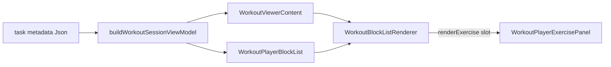

# Parametric Step 4 — Milestone 1 (Core Viewers)

**Status:** Shipped.

**Parent:** [parametric-step4-plan.md](./parametric-step4-plan.md) · **Prerequisite:** [parametric-step4-m0-plan.md](./parametric-step4-m0-plan.md) (shipped)

**Rule:** M1 **wires** the M0 read package into the three high-traffic surfaces below. No UpNext / PreJoin / CoachDraft (M2). No live-video edit paths.

---

## Goal

Replace duplicated bespoke render loops in the workout viewer and player with one shared orchestrator so **read** and **log** UIs share block structure, subtitles, station labels, and instruction cards.



---

## Scope boundary

| In M1                                                 | Not in M1                                                                  |
| ----------------------------------------------------- | -------------------------------------------------------------------------- |
| `RichWorkoutReadView` → `WorkoutBlockListRenderer`    | `UpNextCard`, `ParticipantPreJoinSummary` (M2)                             |
| `FlatExercisesReadView` → `WorkoutFlatExerciseList`   | `density="inline"` full styling (M2)                                       |
| `WorkoutPlayerBlockList` compose via `renderExercise` | TaskModal / `useTaskWorkoutAi` state refactor beyond metadata pass-through |
| Delete viewer-local duplicate helpers (~L34–407)      | `WorkoutExercisesEditor` (edit surface)                                    |
| Viewer + player test updates / smoke checklist        | Block reconstruction from workout logs                                     |

---

## M0 assets to consume

| Export                              | Use in M1                                                                                                                  |
| ----------------------------------- | -------------------------------------------------------------------------------------------------------------------------- |
| `WorkoutBlockListRenderer`          | Rich read + player shell                                                                                                   |
| `WorkoutFlatExerciseList`           | Flat fallback in viewer                                                                                                    |
| `WorkoutBlockListChrome`            | Difficulty / set / session chrome in viewer                                                                                |
| `WorkoutBlockExerciseRenderContext` | Player `renderExercise` callback                                                                                           |
| `useWorkoutSessionViewModel`        | Same hook as `WorkoutPlayer` ([`use-workout-session-view-model.ts`](../../../src/hooks/use-workout-session-view-model.ts)) |

Import barrel: `@/components/fitness/workout-block-renderer` (read exports only).

---

## Task breakdown (implementation order)

### T1 — Thread metadata into `WorkoutViewerContent`

**Problem:** Viewer today branches on `workoutSet != null` and re-parses factory shape in `RichWorkoutReadView`. The player already uses `useWorkoutSessionViewModel(metadata)`; the viewer does not.

**Change:**

1. Add optional prop to `WorkoutViewerContentProps` / `WorkoutViewerDialogProps`:

   ```ts
   /** Task metadata for read VM; when omitted, rich path falls back to workoutSet-only chrome. */
   metadata?: Json | null;
   ```

2. In `WorkoutViewerContent`, call `useWorkoutSessionViewModel(metadata ?? {})`.

3. **Call sites** — pass task metadata:
   - [`TaskModal.tsx`](../../../src/components/modals/TaskModal.tsx) embedded `WorkoutViewerContent` → `metadata={metadata}` (or the same object `useTaskWorkoutAi` uses).
   - `WorkoutViewerDialog` → accept `metadata` and forward (future standalone callers).

4. **Rich vs flat branch** (align with VM, not duplicate signals):

   ```ts
   const sessionVm = useWorkoutSessionViewModel(metadata ?? {});
   const showRichRead = sessionVm.source === 'rich' && sessionVm.blocks.length > 0;
   ```

   Keep `workoutSet` prop temporarily for chrome fields (`difficulty`, set title/description) until VM always carries `workoutSet` when rich — prefer `sessionVm.workoutSet` when non-null.

**Exit:** Viewer and player derive blocks from the same `buildWorkoutSessionViewModel` path for a given task.

---

### T2 — Replace `RichWorkoutReadView` with `WorkoutBlockListRenderer`

**Delete** (from [`workout-viewer-dialog.tsx`](../../../src/components/fitness/workout-viewer-dialog.tsx)):

- `formatRestLabel`, `exerciseThumbnailSrc`
- `RequestImageLink`, `ExerciseThumbnailFrame`, `ExerciseReadRow`, `ExerciseDetail`
- `InstructionBlockSection`
- `RichWorkoutReadView` body (entire function)

**Replace** view-mode rich branch (~L683–688) with:

```tsx
<WorkoutBlockListRenderer
  blocks={sessionVm.blocks}
  taskId={taskId}
  density="full"
  chrome={{
    difficulty: sessionVm.workoutSet?.difficulty,
    setTitle: sessionVm.workoutSet?.title,
    setDescription: sessionVm.workoutSet?.description ?? undefined,
    sessionTitle: sessionVm.session?.title,
    sessionDescription: sessionVm.session?.description ?? undefined,
    cardTitle: displayTitle,
  }}
  data-testid="workout-viewer-block-list"
/>
```

**Edge cases:**

| Case                                          | Behavior                                                                                         |
| --------------------------------------------- | ------------------------------------------------------------------------------------------------ |
| `source === 'rich'` but empty blocks          | Fall through to flat message + `WorkoutFlatExerciseList` (same as today’s “no structure”)        |
| `workoutSet` prop set but metadata not passed | Log dev warning in dev; use `workoutSet` for chrome only, blocks from VM if metadata added later |
| Instruction `RequestImageLink`                | Preserved via `taskId` on renderer → `WorkoutInstructionSection` (M0)                            |

**Imports to remove** after delete: `formatBlockSubtitle`, `formatRepsDisplay`, `normalizeWorkoutForEditor`, `ProgramWorkout`, `Exercise` (if unused).

**Optional:** Add `workout-viewer-dialog.test.tsx` — render `WorkoutViewerContent` with `richMetadataWithBlockFormat('tabata')` + metadata; assert `workout-viewer-block-list` and `MAIN` subtitle. Not required if manual smoke is thorough.

---

### T3 — Replace `FlatExercisesReadView` with `WorkoutFlatExerciseList`

**Delete** `FlatExercisesReadView`.

**Replace** flat branch (~L692–697):

```tsx
<WorkoutFlatExerciseList exercises={localExercises} taskId={taskId} density="full" />
```

Keep surrounding copy: “No AI workout structure saved — showing the exercise list from this card.”

**Exit:** Zero prescription-line duplication in viewer; all meta lines from `format-exercise-prescription-line.ts`.

---

### T4 — Compose `WorkoutPlayerBlockList` with shared renderer

**Replace** manual warmup / main / finisher / cooldown loops in [`WorkoutPlayerBlockList.tsx`](../../../src/components/fitness/workout-block-renderer/WorkoutPlayerBlockList.tsx) with:

```tsx
const indexLookup = buildPlayerExerciseIndexLookup(viewModel.blocks);
const globalIndexByBlockExercise = new Map(
  indexLookup.map((e) => [`${e.blockId}:${e.exerciseIndexInBlock}`, e.globalIndex]),
);

return (
  <div className="space-y-8" data-testid="workout-player-block-list">
    <WorkoutBlockListRenderer
      blocks={viewModel.blocks}
      density="full"
      className="space-y-8"
      renderExercise={(ctx) => {
        const globalIndex =
          ctx.globalFlatIndex ??
          globalIndexByBlockExercise.get(`${ctx.block.id}:${ctx.exerciseIndexInBlock}`);
        if (globalIndex == null) return null;
        const exercise = flatExercises[globalIndex];
        if (!exercise) return null;
        const showSeparator = globalIndex > 0;
        return (
          <div key={`${ctx.block.id}-ex-${ctx.exerciseIndexInBlock}`}>
            {showSeparator ? <Separator className="mb-6" /> : null}
            <WorkoutPlayerExercisePanel
              exercise={exercise}
              index={globalIndex}
              sets={logs[globalIndex] ?? []}
              view={view}
              unit={unit}
              personalNotes={personalNotesByExerciseIndex[globalIndex] ?? null}
              onSetChange={(si, f, v) => onSetChange(globalIndex, si, f, v)}
              onToggleDone={(si) => onToggleDone(globalIndex, si)}
              onAddSet={() => onAddSet(globalIndex)}
            />
          </div>
        );
      }}
    />
  </div>
);
```

**Notes:**

- Do **not** import read row components into the player slot — only `WorkoutPlayerExercisePanel`.
- `ctx.globalFlatIndex` from M0 `WorkoutBlockExerciseGroup` should match `buildPlayerExerciseIndexLookup`; keep lookup map as fallback.
- Remove direct imports of `WorkoutBlockHeader`, `WorkoutInstructionBlockList` from player file (renderer owns structure).
- **Spacing:** Renderer root uses `space-y-6`; player today uses `space-y-8`. Pass `className="space-y-8"` on renderer (as above) or accept minor spacing delta — verify in smoke.

**Preserve testids:**

| Testid                       | Owner after M1                                |
| ---------------------------- | --------------------------------------------- |
| `workout-player-block-list`  | Outer wrapper in `WorkoutPlayerBlockList`     |
| `instruction-section-warmup` | `WorkoutInstructionSection` (unchanged)       |
| `main-block-${block.id}`     | **Add** optional prop on renderer (T4b below) |
| `exercise-panel-${index}`    | `WorkoutPlayerExercisePanel` (unchanged)      |

#### T4b — Optional renderer prop for player main-block sections

Add to `WorkoutBlockListRendererProps`:

```ts
/** When set, applied to each main block `<section>` (player regression testids). */
getMainBlockSectionProps?: (block: WorkoutSessionBlockView) => React.HTMLAttributes<HTMLElement>;
```

Player passes:

```ts
getMainBlockSectionProps={(block) => ({
  'data-testid': `main-block-${block.id}`,
  className: 'space-y-4',
})}
```

Default: current `className="space-y-3"` for viewer.

---

### T5 — Regression tests & CI

**Commands:**

```bash
pnpm exec vitest run \
  src/components/fitness/workout-block-renderer/WorkoutBlockListRenderer.test.tsx \
  src/components/fitness/workout-block-renderer/WorkoutPlayerBlockList.test.tsx \
  src/hooks/use-workout-session-view-model.test.tsx

pnpm run lint
```

**Update** `WorkoutPlayerBlockList.test.tsx` if needed:

- Warmup: still `instruction-section-warmup` inside first `workout-player-block-list`.
- Tabata: subtitle + `exercise-panel-*` count === `vm.flatExercises.length`.
- Optional: query `main-block-*` if T4b lands.

**New** (recommended): `workout-viewer-dialog.test.tsx` — one rich + one flat render with metadata fixture.

---

### T6 — Manual visual parity (required before merge)

Compare **viewer** vs **player** on the same task (or fixtures):

| Fixture                                   | Check                                                                      |
| ----------------------------------------- | -------------------------------------------------------------------------- |
| `richMetadataWithBlockFormat('tabata')`   | Block header `MAIN`, Tabata subtitle, warmup Prep card, exercise meta line |
| `richMetadataWithBlockFormat('superset')` | `A1` / `A2` labels, grouped ring chrome                                    |
| Flat-only metadata (no factory)           | `WorkoutFlatExerciseList`, empty message, thumbnails                       |

**Checklist:**

- [ ] Difficulty + set/session chrome matches pre-M1 viewer
- [ ] Warmup → main → finisher → cooldown order
- [ ] Player separators still between global exercise indices (not only within block)
- [ ] Request image link on instruction blocks when `taskId` set
- [ ] Edit mode unchanged (`WorkoutExercisesEditor` still flat list)

---

### T7 — Docs & plan status

- Update [parametric-step4-plan.md](./parametric-step4-plan.md) M1 → **Shipped** when done.
- Add one line to [docs/fitness/README.md](../README.md) doc map: “Core viewers use `WorkoutBlockListRenderer` (Step 4 M1).”
- Do **not** edit the Cursor plan file `step_4_m0_foundation_*.plan.md`.

---

## File touch list

| File                              | Action                                                |
| --------------------------------- | ----------------------------------------------------- |
| `workout-viewer-dialog.tsx`       | Major: wire renderer, delete ~370 lines of duplicates |
| `WorkoutPlayerBlockList.tsx`      | Major: compose renderer + slot                        |
| `WorkoutBlockListRenderer.tsx`    | Minor: optional `getMainBlockSectionProps`            |
| `workout-block-renderer-types.ts` | Minor: type for T4b prop                              |
| `TaskModal.tsx`                   | Pass `metadata` to viewer                             |
| `WorkoutPlayerBlockList.test.tsx` | Adjust if testids move                                |
| `workout-viewer-dialog.test.tsx`  | Optional new                                          |
| `parametric-step4-plan.md`        | Status                                                |

**No changes:** `WorkoutPlayer.tsx` body (already uses VM), `WorkoutPlayerExercisePanel`, M0 pure helpers.

---

## Risk register

| Risk                                       | Mitigation                                                                                     |
| ------------------------------------------ | ---------------------------------------------------------------------------------------------- |
| `showRich` vs `sessionVm.source` mismatch  | Single branch on `sessionVm.source === 'rich'`; document that `workoutSet` prop is chrome-only |
| Player separator regression                | Keep `globalIndex > 0` rule in slot; test tabata + multi-block fixture                         |
| Double spacing (`space-y-6` + `space-y-8`) | Override renderer `className` or tune main section spacing in T4b                              |
| Metadata not passed from TaskModal         | T1 is blocking; add prop in same PR                                                            |
| Grouped superset layout in player          | Slot renders panel only; group chrome comes from renderer — verify panels inside ring          |

---

## PR checklist (M1)

- [ ] Viewer rich path uses `WorkoutBlockListRenderer` only (no local `ExerciseDetail`)
- [ ] Viewer flat path uses `WorkoutFlatExerciseList`
- [ ] Player composes renderer; no duplicate block header / instruction markup
- [ ] `metadata` passed from TaskModal
- [ ] Vitest suites green; `pnpm run lint` clean
- [ ] Manual Tabata + superset smoke signed off
- [ ] Parent plan M1 status updated

---

## Estimated effort

| Task                                    | Size |
| --------------------------------------- | ---- |
| T1 Metadata + branch alignment          | S    |
| T2 Rich viewer swap + delete duplicates | M    |
| T3 Flat viewer swap                     | S    |
| T4 Player compose + testids             | M    |
| T5–T6 Tests + manual smoke              | M    |
| T7 Docs                                 | S    |

**Total:** ~1 dev day (half day if no viewer RTL test).

---

## M2 preview (after M1 merges)

- `UpNextCard` / `ParticipantPreJoinSummary` with `density="compact"`
- `format-block-summary-line.ts` for deck one-liners
- Optional Kanban quick-view tooltip

M1 must not redesign the `renderExercise` or `chrome` APIs — M2 only adds density and new call sites.
