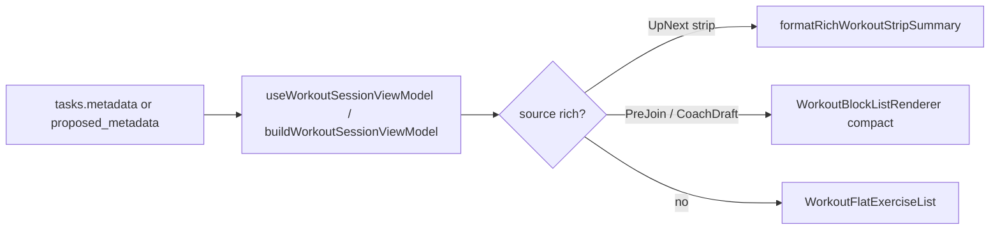

# Parametric Step 4 — Milestone 2 (Dashboard & Discovery)

**Status:** Shipped.

**Parent:** [parametric-step4-plan.md](./parametric-step4-plan.md) · **Prerequisite:** [parametric-step4-m1-plan.md](./parametric-step4-m1-plan.md) (shipped)

**Rule:** M2 adds **read parity** on discovery surfaces using the M0 read package. No Kanban card-face changes (Quick View already uses M1). No edit/apply or player timer work (Step 5–6).

---

## Goal

Preview surfaces show the same block structure and subtitles as the Task Modal viewer / WorkoutPlayer when `ai_workout_factory.workout_set` exists; flat cards keep the legacy flat fallback.



---

## Scope boundary

| In M2                                               | Not in M2                                                                       |
| --------------------------------------------------- | ------------------------------------------------------------------------------- |
| `UpNextCard` block-aware strip summary              | Full `WorkoutBlockListRenderer` on UpNext (layout)                              |
| `ParticipantPreJoinSummary` per-card compact blocks | `SessionDeckBuilder` strip summaries (M3)                                       |
| `CoachDraftCard` `WorkoutMetadataPreview`           | Kanban hover / card exercise list                                               |
| `format-block-summary-line.ts` pure helpers         | Block-aware Edit/Apply ([parametric-step5-plan.md](./parametric-step5-plan.md)) |
| `WorkoutMetadataPreview` wrapper                    | Player interval timers (Step 6)                                                 |

---

## Deliverables

| Artifact                                                  | Path                                                                                                            |
| --------------------------------------------------------- | --------------------------------------------------------------------------------------------------------------- |
| `formatBlockSummaryLine`, `formatRichWorkoutStripSummary` | [format-block-summary-line.ts](../../../src/lib/workout-factory/format-block-summary-line.ts)                   |
| `WorkoutMetadataPreview`                                  | [WorkoutMetadataPreview.tsx](../../../src/components/fitness/workout-block-renderer/WorkoutMetadataPreview.tsx) |
| UpNext strip wiring                                       | [UpNextCard.tsx](../../../src/features/live-video/shells/huddle/UpNextCard.tsx)                                 |
| Pre-join queue preview                                    | [ParticipantPreJoinSummary.tsx](../../../src/features/live-video/shells/ParticipantPreJoinSummary.tsx)          |
| Coach draft preview                                       | [CoachDraftCard.tsx](../../../src/components/chat/CoachDraftCard.tsx)                                           |

---

## Surface behavior

### UpNextCard

- `buildWorkoutSessionViewModel` + `formatRichWorkoutStripSummary` in existing `line-clamp-2` paragraph.
- Flat legacy path unchanged (`formatExerciseLine` on `metadataFieldsFromParsed`).

### ParticipantPreJoinSummary

- Each deck row: `WorkoutMetadataPreview` with `density="compact"`.
- Scroll container and card padding unchanged.

### CoachDraftCard

- `WorkoutMetadataPreview` inside `max-h-40 overflow-y-auto`.
- `taskId={null}` (no Request image mailto in draft preview).
- Hidden when VM has no block or flat exercise content.

---

## Tests

```bash
pnpm exec vitest run \
  src/lib/workout-factory/format-block-summary-line.test.ts \
  src/components/fitness/workout-block-renderer/WorkoutMetadataPreview.test.tsx \
  src/components/fitness/workout-block-renderer/WorkoutBlockListRenderer.test.tsx \
  src/features/live-video/shells/huddle/UpNextCard.test.tsx \
  src/features/live-video/shells/ParticipantPreJoinSummary.test.tsx \
  src/components/chat/CoachDraftCard.test.tsx
```

---

## Manual verification

1. Live huddle with rich Tabata card queued → **Up next** shows block subtitle (e.g. `MAIN · Tabata · …`).
2. Participant pre-join queue → rich cards show compact block sections; flat legacy unchanged.
3. Coach draft with flat `proposed_metadata.exercises` → same as before; rich draft shows block headers when factory present.
4. `pnpm run check` green.

---

## Follow-up (M3+)

- Session deck strip summaries (`SessionDeckBuilder`)
- Class / member pre-join audit for remaining `formatExerciseLine` call sites
- [parametric-step5-plan.md](./parametric-step5-plan.md) — block-aware Edit/Apply
