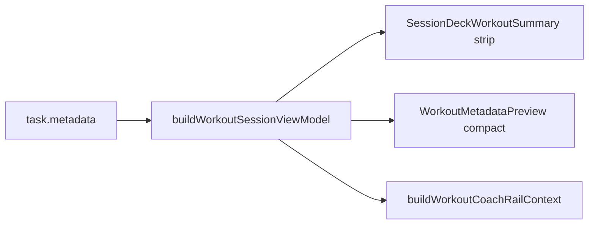

# Parametric Step 4 — Milestone 3 (Pre-Class & Waiting Room)

**Status:** Shipped.

**Parent:** [parametric-step4-plan.md](./parametric-step4-plan.md) · **Prerequisite:** [parametric-step4-m2-plan.md](./parametric-step4-m2-plan.md) (shipped)

**Rule:** M3 upgrades trainer/class deck tiles and Coach context strings before sessions start. No global Kanban card-face changes, no edit/log paths.

---

## Goal

When a trainer loads rich workouts into a live/class deck, everyone sees block structure and subtitles before the clock starts.



---

## Deliverables

| Artifact                       | Path                                                                                                                                                                                                                            |
| ------------------------------ | ------------------------------------------------------------------------------------------------------------------------------------------------------------------------------------------------------------------------------- |
| `buildWorkoutCoachRailContext` | [build-workout-coach-rail-context.ts](../../../src/lib/workout-factory/build-workout-coach-rail-context.ts)                                                                                                                     |
| `SessionDeckWorkoutSummary`    | [SessionDeckWorkoutSummary.tsx](../../../src/features/live-video/shells/huddle/SessionDeckWorkoutSummary.tsx)                                                                                                                   |
| Deck tile integration          | [SessionDeckBuilder.tsx](../../../src/features/live-video/shells/huddle/SessionDeckBuilder.tsx)                                                                                                                                 |
| Live Up next strip             | [LiveSessionView.tsx](../../../src/features/live-video/shells/huddle/LiveSessionView.tsx) + [UpNextCard.tsx](../../../src/features/live-video/shells/huddle/UpNextCard.tsx)                                                     |
| Coach / launch context         | [WorkoutCoachRail.tsx](../../../src/components/chat/WorkoutCoachRail.tsx), [WorkoutPlayer.tsx](../../../src/components/fitness/WorkoutPlayer.tsx), [dashboard-shell.tsx](../../../src/components/dashboard/dashboard-shell.tsx) |

---

## Surface behavior

### SessionDeckBuilder

- Below each `KanbanTaskCard` summary tile: `SessionDeckWorkoutSummary`
- `mode="strip"` in normal deck strip; `mode="compact"` in board-pick (`tallCardChrome`) mode
- Inherited by PreJoinBuilder, LiveSessionView, StandaloneClassDeckBuilder, ClassEditor live deck, AsyncPlaybackShell

### UpNextCard

- Mounted in `LiveSessionView` when `uiMode === 'live'`
- Uses M2 `formatRichWorkoutStripSummary` for rich metadata

### Coach rail context

- `buildWorkoutCoachRailContext` adds `exercises`, `workout_structure_summary`, `ai_workout_factory` when rich
- `#` hash picker reads names from structured context (fixes bare-array `workoutData` bug)
- No Coach rail UI preview component added

### ParticipantPreJoinSummary

- Verified unchanged from M2 (compact blocks per queue row)

---

## Tests

```bash
pnpm exec vitest run \
  src/lib/workout-factory/build-workout-coach-rail-context.test.ts \
  src/features/live-video/shells/huddle/SessionDeckWorkoutSummary.test.tsx \
  src/features/live-video/shells/huddle/SessionDeckBuilder.test.tsx \
  src/components/chat/WorkoutCoachRail.test.tsx \
  src/features/live-video/shells/huddle/UpNextCard.test.tsx
```

---

## Manual verification

1. Trainer PreJoinBuilder — rich Tabata tile shows subtitle strip; board-pick shows compact blocks.
2. Live huddle — deck tiles + Up next strip show block subtitles.
3. Class StandaloneClassDeckBuilder — deck tiles show structure before save.
4. WorkoutPlayer Coach rail — `#` picker lists factory exercises; sentinel metadata includes structure summary.
5. Flat legacy deck card — flat exercise line unchanged.

---

## Follow-up (Step 5+)

- ~~Workout log read unify~~ — Shipped: [parametric-step4-m4-plan.md](./parametric-step4-m4-plan.md)
- Block-aware Edit/Apply ([parametric-step5-plan.md](./parametric-step5-plan.md))
