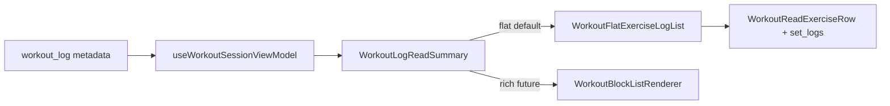

# Parametric Step 4 — Milestone 4 (Post-Workout Logs)

**Status:** Shipped.

**Parent:** [parametric-step4-plan.md](./parametric-step4-plan.md) · **Prerequisite:** [parametric-step4-m3-plan.md](./parametric-step4-m3-plan.md) (shipped)

**Rule:** M4 is read-only log display. Finished `workout_log` rows remain flat in the DB (no `ai_workout_factory` on finish). Edit paths still use `WorkoutExercisesEditor` in viewer edit mode.

---

## Goal

Completed workout logs use the shared read renderer (`WorkoutFlatExerciseList` / future `WorkoutBlockListRenderer`) with per-set `set_logs` overlay — not bespoke `WorkoutExercisesEditor` rows in TaskModal Details.



---

## Deliverables

| Artifact                          | Path                                                                                                                                                                  |
| --------------------------------- | --------------------------------------------------------------------------------------------------------------------------------------------------------------------- |
| `formatSetLogLine`                | [format-set-log-line.ts](../../../src/lib/workout-factory/format-set-log-line.ts)                                                                                     |
| `WorkoutFlatExerciseLogList`      | [WorkoutFlatExerciseLogList.tsx](../../../src/components/fitness/workout-block-renderer/WorkoutFlatExerciseLogList.tsx)                                               |
| `WorkoutLogReadSummary`           | [WorkoutLogReadSummary.tsx](../../../src/components/fitness/workout-block-renderer/WorkoutLogReadSummary.tsx)                                                         |
| `WorkoutReadExerciseRow` set_logs | [WorkoutReadExerciseRow.tsx](../../../src/components/fitness/workout-block-renderer/WorkoutReadExerciseRow.tsx)                                                       |
| TaskModal Details                 | [TaskModalWorkoutFields.tsx](../../../src/components/modals/task-modal/TaskModalWorkoutFields.tsx)                                                                    |
| Workout viewer log variant        | [workout-viewer-dialog.tsx](../../../src/components/fitness/workout-viewer-dialog.tsx), [TaskModal.tsx](../../../src/components/modals/TaskModal.tsx) (`readVariant`) |

---

## Surface behavior

### TaskModal `workout_log` Details

- Exercise section: `WorkoutLogReadSummary` (read-only) with `metadata.exercises` + `duration_min`
- Type/duration inputs unchanged
- Exercise edits: WorkoutViewer split pane (edit mode still uses `WorkoutExercisesEditor`)

### WorkoutViewer view mode

- `readVariant="log"` from TaskModal when `itemType === 'workout_log'`
- Flat branch uses `WorkoutLogReadSummary` (no “No AI structure” banner on logs)
- Prescription `workout` cards unchanged

### N/A (documented, no code change)

| #   | Surface            | Reason                      |
| --- | ------------------ | --------------------------- |
| 15  | AnalyticsBoard     | Counts only                 |
| 16  | AmrapResultsDrawer | Explicitly no exercise list |
| —   | PostSessionSummary | Duration/participants only  |

---

## Tests

```bash
pnpm exec vitest run \
  src/lib/workout-factory/format-set-log-line.test.ts \
  src/components/fitness/workout-block-renderer/WorkoutLogReadSummary.test.tsx \
  src/components/fitness/workout-viewer-dialog.test.tsx
```

---

## Manual verification

1. Open completed `workout_log` in TaskModal Details — shared read rows + set log lines per exercise.
2. Open same card in WorkoutViewer view mode — same list; no misleading flat-fallback copy.
3. Legacy log without `set_logs` — flat list only; no empty set section.
4. `workout` prescription card viewer — unchanged flat fallback message.
5. `pnpm run check` green.

---

## Follow-up (Step 5+)

- Persist `ai_workout_factory` on `workout_log` finish (schema / Step 6)
- Block-aware Edit/Apply ([parametric-step5-plan.md](./parametric-step5-plan.md))
