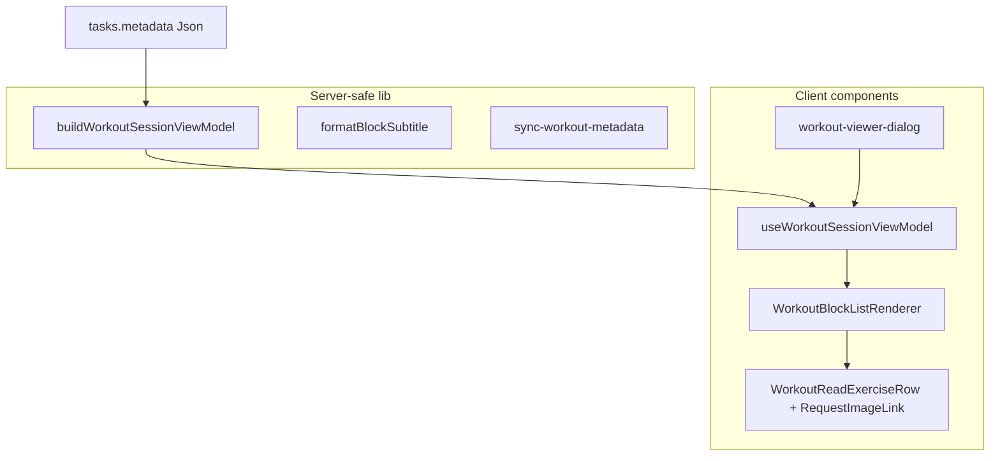

# Parametric Workout Blocks — Step 4 (P1 Read Parity)

**Status:** Planning only — no React changes in this pass.

**Prerequisites:** [parametric-step1-2-plan.md](./parametric-step1-2-plan.md) (data contract + ViewModel) · [parametric-step3-plan.md](./parametric-step3-plan.md) (WorkoutPlayer block-aware P0)

**Related:** [Workout UI landscape audit](./README.md) · [workout-player.md](../workout-player.md) · [Parametric engine](../../refactor/parametric-workout-blocks/README.md)

---

## Executive summary

Steps 1–3 stabilized the **data router** (`sync-workout-metadata`), the **translator** (`WorkoutSessionViewModel`), and the **execution shell** (`WorkoutPlayer` + `WorkoutPlayerBlockList`). Step 4 is **P1 Read Parity**: one stateless presentational layer that renders parametric blocks identically on every **read-only** surface.

**Sprint shape:** Single technical plan, **four phased milestones**, one dedicated sprint. Build the shared renderer **once**, then wire consumers in risk order. Do **not** split across disconnected sprints — that reintroduces subtitle/grouping drift between viewer, deck copy, and player chrome.

**In scope:** Read-only prescription UI (headers, subtitles, exercise rows, instruction sections, superset/contrast grouping labels).

**Out of scope (Step 5+ / P2 execution):** Interval timers, interactive round state, ladder rung progression UX, block metadata on `workout_log`, block-aware **editors**, live set logging (`ParticipantWorkoutLogger`), Coach `execution_patch` plumbing.

---

## Current duplication (problem statement)

| Location                                                                                                              | What it renders today                                              | Data source                                                                                     |
| --------------------------------------------------------------------------------------------------------------------- | ------------------------------------------------------------------ | ----------------------------------------------------------------------------------------------- |
| [RichWorkoutReadView](../../../src/components/fitness/workout-viewer-dialog.tsx)                                      | Warmup / main blocks / finisher / cooldown + `ExerciseDetail` rows | Direct `WorkoutSetTemplate` → `normalizeWorkoutForEditor` → manual loop + `formatBlockSubtitle` |
| [WorkoutPlayerBlockList](../../../src/components/fitness/workout-block-renderer/WorkoutPlayerBlockList.tsx)           | Same section order + `WorkoutBlockHeader` + interactive panels     | `useWorkoutSessionViewModel` → `blocks[]`                                                       |
| [WorkoutInstructionBlockList](../../../src/components/fitness/workout-block-renderer/WorkoutInstructionBlockList.tsx) | Instruction sections                                               | `blocks[]` filtered by section                                                                  |
| [UpNextCard](../../../src/features/live-video/shells/huddle/UpNextCard.tsx)                                           | Flat one-liners                                                    | `metadataFieldsFromParsed().workoutExercises`                                                   |
| [ParticipantPreJoinSummary](../../../src/features/live-video/shells/ParticipantPreJoinSummary.tsx)                    | Flat bullet list                                                   | Same flat path                                                                                  |
| [CoachDraftCard](../../../src/components/chat/CoachDraftCard.tsx)                                                     | Flat exercise names                                                | `proposed_metadata.exercises` only                                                              |

The viewer and player already **look similar** but are implemented twice with different exercise row components (`ExerciseDetail` vs `WorkoutPlayerExercisePanel`). Step 4 collapses the **read** path into one module; the player keeps a thin **interactive slot** on top.

---

## 1. Component design — `WorkoutBlockListRenderer`

### Location

Extend the existing package:

```text
src/components/fitness/workout-block-renderer/
  WorkoutBlockHeader.tsx              # exists — shared block title + subtitle
  WorkoutInstructionBlockList.tsx     # exists — align to delegate to renderer sections
  WorkoutBlockListRenderer.tsx         # NEW — stateless read body
  WorkoutReadExerciseRow.tsx           # NEW — extracted from viewer ExerciseReadRow/ExerciseDetail
  WorkoutBlockExerciseGroup.tsx        # NEW — A1/A2 brackets for superset/contrast/circuit
  WorkoutFlatExerciseList.tsx          # NEW — flat-only fallback (compact + default)
  WorkoutBlockListRenderer.test.tsx    # NEW — 12-format fixture matrix
  index.ts                             # NEW — explicit public exports (tree-shake friendly)
```

Keep **player-only** modules separate:

- `WorkoutPlayerBlockList.tsx` — composes `WorkoutBlockListRenderer` + `renderExercisePanel` slot
- `WorkoutPlayerExercisePanel.tsx` — set grid, logging, detailed view (unchanged responsibility)

### Architectural signature

```tsx
/** Pure read model input — prefer passing output of buildWorkoutSessionViewModel. */
type WorkoutBlockListRendererProps = {
  /** Full blocks array from ViewModel (warmup, main, finisher, cooldown). */
  blocks: WorkoutSessionBlockView[];

  /** Optional set/session chrome (viewer hero context). */
  chrome?: {
    difficulty?: string | null;
    setTitle?: string | null;
    setDescription?: string | null;
    sessionTitle?: string | null;
    sessionDescription?: string | null;
    /** Card title for “set title differs” suppression. */
    cardTitle?: string;
  };

  /**
   * Visual density for deck widgets vs full viewer.
   * - `full` — TaskModal viewer (current RichWorkoutReadView spacing)
   * - `compact` — UpNext / pre-join bullets (block headers + truncated rows)
   * - `inline` — single-line summaries per block (future calendar chip)
   */
  density?: 'full' | 'compact' | 'inline';

  /**
   * Replace default read-only exercise row (e.g. player injects WorkoutPlayerExercisePanel).
   * When omitted, renders WorkoutReadExerciseRow for each factory Exercise in block order.
   *
   * Args include globalFlatIndex when caller pre-computes via workout-player-exercise-index
   * (player only); read surfaces omit it.
   */
  renderExercise?: (ctx: WorkoutBlockExerciseRenderContext) => React.ReactNode;

  /** Passed through to default row for RequestImageLink (viewer). Omit in server-safe embeds. */
  taskId?: string | null;

  className?: string;
  'data-testid'?: string;
};

type WorkoutBlockExerciseRenderContext = {
  block: WorkoutSessionBlockView;
  exercise: Exercise;
  exerciseIndexInBlock: number;
  /** A1, A2, B1… for superset/contrast/circuit when density !== inline */
  stationLabel: string | null;
  globalFlatIndex?: number;
};
```

**Stateless contract:**

- No `useState`, `useEffect`, timers, draft recovery, or Supabase.
- No import of `WorkoutPlayer`, `SetDraft`, or Coach rail modules.
- Accepts **already-normalized** `WorkoutSessionBlockView[]` (subtitles precomputed in ViewModel).

### Rendering rules

1. **Section order (fixed):** warmup → main (`section === 'main'`, sorted by `order`) → finisher → cooldown.
2. **Block header:** Reuse `WorkoutBlockHeader` with `block.name` + `block.subtitle` (ViewModel already calls `formatBlockSubtitle`).
3. **Instruction sections:** For `warmup` | `finisher` | `cooldown`, render instruction cards from `block.instructions` (merge logic currently split between viewer `InstructionBlockSection` and `WorkoutInstructionBlockList` — **one implementation** inside renderer or shared subcomponent).
4. **Main block exercises:**
   - `straight_sets`, `amrap`, `emom`, `tabata`, `ladder`, `chipper`, `pyramid`, `clusters`, `drop_sets` — vertical list of exercise rows under header.
   - `superset`, `contrast` — **exactly two** exercises wrapped in `WorkoutBlockExerciseGroup` with `A1`/`A2` labels and optional “Pair · N rounds” from subtitle.
   - `circuit` — grouped list with `A1…An` station labels; rounds from subtitle only (no round-robin animation).
5. **Exercise row (default):** `WorkoutReadExerciseRow` — sets×reps, RPE, rest, work seconds, rounds (same bit string as today’s `ExerciseDetail`); optional coach notes line; optional `RequestImageLink` when `taskId` set.
6. **Flat fallback:** When `blocks.length === 0` or caller passes `source === 'flat'`, delegate to `WorkoutFlatExerciseList` mapping `WorkoutExercise[]` with matching typography at chosen `density`.

### Decoupling from player state

| Concern                    | Read renderer | Player wrapper                                      |
| -------------------------- | ------------- | --------------------------------------------------- |
| Block sections + subtitles | Yes           | Composes renderer                                   |
| Set grid / done toggles    | No            | `WorkoutPlayerExercisePanel` via `renderExercise`   |
| Global log index           | No            | Player precomputes lookup, passes `globalFlatIndex` |
| Elapsed timer / finish     | No            | `PlayerBody` footer                                 |

After Step 4, `WorkoutPlayerBlockList` becomes ~30 lines: filter main blocks, map `renderExercise` → panel + separator logic.

---

## 2. Refactoring `RichWorkoutReadView`

### Target file

[src/components/fitness/workout-viewer-dialog.tsx](../../../src/components/fitness/workout-viewer-dialog.tsx)

### Current flow (remove)

```text
workoutSet prop → normalizeWorkoutForEditor(firstRaw) → manual map exerciseBlocks
                → formatBlockSubtitle per block
                → InstructionBlockSection × 3
                → ExerciseDetail rows
```

### Target flow

```text
metadata OR workoutSet → buildWorkoutSessionViewModel(metaOrSynthetic)
                       → WorkoutBlockListRenderer(blocks, chrome, taskId, density="full")
```

### Step-by-step refactor

1. **Unify entry at `WorkoutViewerContent`**
   - Today: branches on `workoutSet != null` vs flat.
   - After: always call `useWorkoutSessionViewModel(task.metadata)` (or `buildWorkoutSessionViewModel` in RSC-safe parent if needed).
   - Rich path: `sessionVm.source === 'rich'` → `WorkoutBlockListRenderer`.
   - Flat path: `WorkoutFlatExerciseList` with `sessionVm.flatExercises` (replaces inline `FlatExercisesReadView` body or wraps it).

2. **Delete from viewer (post-migration)**
   - `RichWorkoutReadView` inner block loop and duplicate `InstructionBlockSection` markup.
   - Direct imports of `normalizeWorkoutForEditor`, `formatBlockSubtitle` in viewer (subtitle stays in ViewModel only).
   - `ExerciseDetail` → move to `WorkoutReadExerciseRow` in block-renderer package; viewer imports from there.

3. **Preserve viewer-only chrome**
   - `WorkoutViewHero`, edit toggle, AI generate buttons, embedded layout — **unchanged**.
   - Set/session title/description/difficulty → pass via `chrome` prop on renderer.

4. **`taskId` / RequestImageLink**
   - Keep client boundary in viewer; pass `taskId` into renderer default rows.
   - Do not move Supabase-linked `RequestImageLink` into a Server Component.

5. **Regression checklist (viewer)**
   - All 12 formats from [workout-session-view-model.fixtures.ts](../../../src/lib/workout-factory/__fixtures__/workout-session-view-model.fixtures.ts) render block headers + subtitles.
   - Warmup/finisher/cooldown instruction bullets unchanged.
   - Flat-only cards still render `FlatExercisesReadView` equivalent.
   - Edit mode still uses flat `WorkoutExercisesEditor` only (no block editor in Step 4).

---

## 3. Phased surface migration (single sprint)

Surfaces grouped by **risk** and **user visibility**. Milestones are sequential gates within one sprint — each milestone merges before starting the next.

### Milestone 0 — Foundation (sprint days 1–2)

**Status:** Shipped (read renderer package + Vitest matrix; consumers wired in M1).

**Goal:** Shared module exists; tests green; no consumer wired yet.

| Deliverable                                                                         | Notes                                                                    |
| ----------------------------------------------------------------------------------- | ------------------------------------------------------------------------ |
| `WorkoutBlockListRenderer` + `WorkoutReadExerciseRow` + `WorkoutBlockExerciseGroup` | Full density                                                             |
| `WorkoutFlatExerciseList`                                                           | compact + full                                                           |
| Refactor `WorkoutInstructionBlockList`                                              | Delegate markup to renderer section helper (no duplicate Prep card HTML) |
| `WorkoutBlockListRenderer.test.tsx`                                                 | 12 formats + flat fallback + superset/contrast labels                    |
| `index.ts` exports                                                                  | Document public API                                                      |

**Exit criteria:** `pnpm exec vitest run src/components/fitness/workout-block-renderer/WorkoutBlockListRenderer.test.tsx` passes; ESLint clean; no new circular imports with `item-metadata`.

---

### Milestone 1 — Core viewers (sprint days 3–4)

**Highest impact; establishes visual source of truth.**

| #   | Surface                    | Path                        | Migration                                                                   |
| --- | -------------------------- | --------------------------- | --------------------------------------------------------------------------- |
| 1   | **RichWorkoutReadView**    | `workout-viewer-dialog.tsx` | Replace body with `useWorkoutSessionViewModel` + `WorkoutBlockListRenderer` |
| 2   | **WorkoutViewerContent**   | same                        | Single VM at shell; remove parallel `workoutSet` parsing where redundant    |
| 3   | **FlatExercisesReadView**  | same                        | Thin wrapper → `WorkoutFlatExerciseList`                                    |
| 4   | **WorkoutPlayerBlockList** | `workout-block-renderer/`   | Compose shared renderer + `renderExercise` → `WorkoutPlayerExercisePanel`   |

**Not in M1:** TaskModal state refactor beyond viewer; `useTaskWorkoutAi` already uses ViewModel for detection.

**Exit criteria:** Side-by-side manual compare viewer vs player on Tabata + superset fixtures; existing `WorkoutPlayerBlockList.test.tsx` still passes (update assertions if testids move to shared renderer).

---

### Milestone 2 — Dashboard & discovery (sprint days 5–6)

**Compact read density; flat fallback when no factory.**

| #   | Surface                       | Path                            | Migration                                                                                                            |
| --- | ----------------------------- | ------------------------------- | -------------------------------------------------------------------------------------------------------------------- |
| 5   | **UpNextCard**                | `UpNextCard.tsx`                | `buildWorkoutSessionViewModel(metadata)` → `density="compact"`; show first main block subtitle + next exercise row   |
| 6   | **ParticipantPreJoinSummary** | `ParticipantPreJoinSummary.tsx` | Same VM; list blocks as bullets (block name + subtitle + exercise count)                                             |
| 7   | **KanbanTaskCard**            | `kanban-task-card.tsx`          | _Optional P1.5:_ tooltip / expanded quick view using compact renderer (card face stays chrome-only)                  |
| 8   | **CoachDraftCard**            | `CoachDraftCard.tsx`            | When `proposed_metadata` includes factory (`hasRichWorkoutSetInMetadata`), render compact block list; else flat list |

**Shared helper (new):**

```tsx
// src/lib/workout-factory/format-block-summary-line.ts (pure, no React)
formatBlockSummaryLine(block: WorkoutSessionBlockView): string
```

Use in inline/deck one-liners to avoid duplicating subtitle logic outside renderer.

**Exit criteria:** Live huddle “Up next” shows “Tabata · 8 Rounds” when factory present; flat cards unchanged.

---

### Milestone 3 — Pre-class & waiting rooms (sprint days 7–8)

| #   | Surface                               | Path                                        | Migration                                                                                                                                     |
| --- | ------------------------------------- | ------------------------------------------- | --------------------------------------------------------------------------------------------------------------------------------------------- |
| 9   | **ParticipantPreJoinSummary** (deep)  | already in M2                               | Per-deck-item block bullets when queue items are rich                                                                                         |
| 10  | **Session deck strip summaries**      | `SessionDeckBuilder.tsx` / deck row chrome  | Compact block count + first subtitle (if space)                                                                                               |
| 11  | **Class board / member pre-join**     | class-related shells using workout metadata | Audit call sites of `formatExerciseLine`; swap to VM + compact renderer                                                                       |
| 12  | **WorkoutCoachRail** exercise context | `WorkoutCoachRail.tsx`                      | Read-only name list from `flatExercises` (already); optional: include block names in system prompt context string — **metadata only**, not UI |

**Explicitly excluded (write / execution paths):**

- `LiveSessionWorkoutPlayer` (edit)
- `ParticipantWorkoutLogger` (log)
- `LiveDeckExerciseInjector` (merge)

---

### Milestone 4 — Post-workout & history (sprint days 9–10)

| #   | Surface                        | Path                                        | Migration                                                                                                                                                    |
| --- | ------------------------------ | ------------------------------------------- | ------------------------------------------------------------------------------------------------------------------------------------------------------------ |
| 13  | **TaskModal workout_log read** | `TaskModalDetailsBody` / viewer on log rows | Flat list today; if log metadata gains factory in future, use renderer. **P1:** unify log read with `WorkoutFlatExerciseList` + completed `set_logs` overlay |
| 14  | **Workout log summary (new)**  | _No component today_                        | Introduce `WorkoutLogReadSummary` using flat renderer + duration; defer block context until Step 5 schema                                                    |
| 15  | **AnalyticsBoard**             | `AnalyticsBoard.tsx`                        | Counts only — **no UI change**; document as N/A                                                                                                              |
| 16  | **AmrapResultsDrawer**         | `AmrapResultsDrawer.tsx`                    | Explicitly no exercise list — **N/A**                                                                                                                        |

**Step 4 note:** Finished logs remain **flat** in DB ([Step 3 unchanged](../workout-player.md)). M4 is visual consistency for **flat log display**, not block reconstruction from logs.

---

### Surface inventory — out of scope for Step 4

| Surface                          | Reason                         |
| -------------------------------- | ------------------------------ |
| `WorkoutExercisesEditor`         | Edit surface — Step 6+         |
| `TaskModalWorkoutFields`         | Flat form fields               |
| `WorkoutPlayer` logging / timers | P2 execution (Step 5)          |
| `RichMessageComposer`            | Token picker, not prescription |
| `ClassEditorWorkoutPicker`       | Title/duration only            |
| `SessionDeckBuilder` DnD chrome  | No prescription read           |

**Audit coverage:** 16 surfaces migrated or explicitly N/A; 6 execution/edit surfaces deferred — matches [views/README.md](./README.md) tier list (~22 entries).

---

## 4. Next.js boundaries & bundle safety

### Layering



| Module                             | `'use client'`        | Rule                                                                                               |
| ---------------------------------- | --------------------- | -------------------------------------------------------------------------------------------------- |
| `workout-session-view-model.ts`    | No                    | Pure functions; safe to import from server if ever needed                                          |
| `format-block-subtitle.ts`         | No                    | Pure                                                                                               |
| `WorkoutBlockListRenderer.tsx`     | **Yes** (recommended) | Uses Tailwind + optional child slots; no hooks required but colocate with row component            |
| `WorkoutReadExerciseRow.tsx`       | **Yes**               | Contains `RequestImageLink` (client)                                                               |
| `WorkoutBlockListRendererCore.tsx` | Optional split        | If we need RSC embed later: zero client imports, no RequestImageLink; viewer wraps with client row |

**Practical rule for this sprint:** Mark the whole `workout-block-renderer/` read package `'use client'` except re-export pure types from ViewModel. All current consumers are already client components.

### Bundle bloat guards

1. **`index.ts` explicit exports** — no `export *` from player modules.
2. **No import of** `@/components/chat/*`, `WorkoutPlayer`, or Supabase client from renderer core.
3. **No import of** `@/lib/agents/coach/*` beyond type-only `BlockFormat` if needed (subtitle already on block view).
4. **Dynamic import not required** for Step 4 — renderer is small; revisit if Coach draft embed grows.

### Graph leak checklist (PR template)

- [ ] New renderer files do not import `item-metadata` circular path at runtime (use ViewModel types only).
- [ ] Server layouts / RSC pages do not import `workout-viewer-dialog` transitively without `'use client'`.
- [ ] `pnpm run lint` + `pnpm run build` clean after each milestone.

---

## 5. Testing strategy (Vitest)

### Primary suite — `WorkoutBlockListRenderer.test.tsx`

**Pattern:** Mirror [workout-session-view-model.test.ts](../../../src/lib/workout-factory/workout-session-view-model.test.ts) — loop all 12 formats from [workout-session-view-model.fixtures.ts](../../../src/lib/workout-factory/__fixtures__/workout-session-view-model.fixtures.ts).

```tsx
import { render, screen } from '@testing-library/react';
import { describe, it, expect } from 'vitest';
import { BLOCK_FORMATS } from '@/lib/agents/coach/block-blueprint-library';
import { buildWorkoutSessionViewModel } from '@/lib/workout-factory/workout-session-view-model';
import { richMetadataWithBlockFormat } from '@/lib/workout-factory/__fixtures__/workout-session-view-model.fixtures';
import { WorkoutBlockListRenderer } from '@/components/fitness/workout-block-renderer/WorkoutBlockListRenderer';

describe('WorkoutBlockListRenderer', () => {
  for (const format of BLOCK_FORMATS) {
    it(`renders ${format} block header and subtitle`, () => {
      const vm = buildWorkoutSessionViewModel(richMetadataWithBlockFormat(format));
      render(<WorkoutBlockListRenderer blocks={vm.blocks} density="full" />);
      expect(screen.getByText(/MAIN/i)).toBeInTheDocument();
      // format-specific subtitle assertions (reuse format-block-subtitle expectations)
    });
  }

  it('renders warmup/finisher/cooldown instruction sections', () => {
    /* ... */
  });
  it('labels superset/contrast exercises A1/A2', () => {
    /* ... */
  });
  it('flat fallback via WorkoutFlatExerciseList', () => {
    /* flat-only metadata */
  });
});
```

### Secondary suites

| Suite                                               | Purpose                                                                            |
| --------------------------------------------------- | ---------------------------------------------------------------------------------- |
| Update `WorkoutPlayerBlockList.test.tsx`            | Assert composition still renders panels via slot                                   |
| `workout-viewer-dialog` integration test (optional) | Render `WorkoutViewerContent` view mode with rich fixture                          |
| Snapshot gate (optional)                            | One snapshot per format in **full** density only — avoid snapshot churn in compact |

### CI command (add to plan verification)

```bash
pnpm exec vitest run \
  src/components/fitness/workout-block-renderer/WorkoutBlockListRenderer.test.tsx \
  src/components/fitness/workout-block-renderer/WorkoutPlayerBlockList.test.tsx \
  src/lib/workout-factory/workout-session-view-model.test.ts
```

---

## 6. Documentation updates (same sprint)

| Doc                                                     | Update                                                                       |
| ------------------------------------------------------- | ---------------------------------------------------------------------------- |
| [parametric-step3-plan.md](./parametric-step3-plan.md)  | Link Step 4 as follow-up; move “Shared renderer” from out-of-scope to Step 4 |
| [views/README.md](./README.md)                          | Mark P1 read parity in progress; update gap matrix when milestones land      |
| [workout-viewer-dialog.md](../workout-viewer-dialog.md) | ViewModel + shared renderer                                                  |
| [docs/fitness/README.md](../README.md)                  | Link `parametric-step4-plan.md`                                              |

---

## 7. Migration order (summary)

```text
M0  Build WorkoutBlockListRenderer + tests (12 formats)
    ↓
M1  RichWorkoutReadView + FlatExercisesReadView + WorkoutPlayerBlockList compose
    ↓
M2  UpNextCard, PreJoinSummary, CoachDraftCard (compact)
    ↓
M3  Deck/class pre-join summaries
    ↓
M4  Workout log read unify (flat); stub WorkoutLogReadSummary if needed
```

**Parallel work allowed:** M0 tests + `WorkoutReadExerciseRow` extraction can proceed while reviewing viewer chrome props; **do not** wire M2 until M1 visual parity sign-off.

**Rollback strategy:** Each milestone is one PR; viewer (M1) is the only high-traffic surface — feature-flag not required if tests + manual Tabata/superset check pass.

---

## 8. Open decisions (resolve before M1 coding)

1. **Naming:** Ship as `WorkoutBlockListRenderer` (matches folder) vs alias export `SharedWorkoutBlockRenderer` — recommend **one name** in code, document alias in README only.
2. **Superset/contrast UI:** P1 read shows **A1/A2 labels + subtitle** only; no alternating round columns (Step 5).
3. **CoachDraftCard factory path:** Confirm `apply_workout_draft` persists `ai_workout_factory` on finalize — if yes, compact renderer applies; if not, stay flat until server contract extended.
4. **`flatCacheStale`:** Step 4 does not require UI; optional badge in viewer deferred.

---

## Verification (manual, end of sprint)

1. Task Modal view mode: Tabata finisher shows same subtitle as WorkoutPlayer for same card.
2. Superset block: viewer and player both show A1/A2 (or paired group) under one block header.
3. Up Next during live session: block subtitle visible for rich deck card.
4. Flat-only legacy card: identical to pre-Step-4 flat list.
5. `pnpm run check` green.
