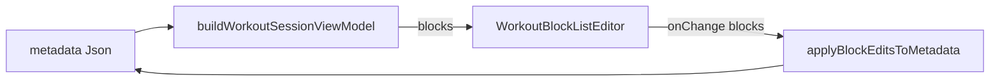

# Parametric Step 5 — M1 + M3 (Block editor + write path)

**Status:** Shipped.

**Parent:** [parametric-step5-plan.md](./parametric-step5-plan.md) (Step 5 umbrella).

**Follow-up (shipped):** [parametric-step5-m2-plan.md](./parametric-step5-m2-plan.md) — viewer Edit + Apply wiring · [workout-block-editor-structural-editing-plan.md](../workout-block-editor-structural-editing-plan.md) — Gap G2 structural editing (P0–P3).

---

## Goal

Let users edit existing block/exercise fields on rich factory cards without React-side adapters:

1. **M3** — `applyBlockEditsToMetadata(meta, blocks)` rebuilds `ai_workout_factory` and syncs `metadata.exercises`.
2. **M1** — `WorkoutBlockListEditor` mutates `WorkoutSessionBlockView[]` via `onChange`.



---

## What shipped

### M3 — Write path (`src/lib/workout-factory/sync-workout-metadata.ts`)

| Export                          | Role                                                                                       |
| ------------------------------- | ------------------------------------------------------------------------------------------ |
| `viewExerciseToFactoryExercise` | View exercise → factory `Exercise`                                                         |
| `viewBlockToExerciseBlock`      | Main block → `ExerciseBlock` (preserves `blockFormat`, `formatParams`, renumbered `order`) |
| `viewBlockToWarmupBlock`        | Instruction sections → `WarmupBlock`                                                       |
| `blocksViewToProgramWorkout`    | Partition/sort blocks into session arrays                                                  |
| **`applyBlockEditsToMetadata`** | Rich-only entry; flat cache via `workoutInSetToTaskExercises`; no-op on flat-only metadata |

**Structural editing (Gap G2):** Shipped in follow-up PRs — add/remove/reorder exercises (DnD), main + instruction block CRUD, comma split. See [workout-block-editor-structural-editing-plan.md](../workout-block-editor-structural-editing-plan.md).

**Still out of scope for M3/M1 baseline:** `formatParams` editing (M4); writing `subtitle` (computed on read).

### M1 — Editor (`src/components/fitness/workout-block-renderer/`)

| Module                            | Role                                                                                  |
| --------------------------------- | ------------------------------------------------------------------------------------- |
| `workout-block-editor-types.ts`   | Props, immutable field + structural helpers (exercise/block CRUD, split, DnD support) |
| `WorkoutBlockExerciseEditRow.tsx` | Name, sets, reps, RPE, rest, coach notes; remove + Split affordance                   |
| `WorkoutInstructionBlockEdit.tsx` | Section label + instructions textarea (fixed line count vs loaded)                    |
| `WorkoutBlockListEditor.tsx`      | Orchestrator: warmup → main → finisher → cooldown + structural add/remove controls    |
| `MainBlockExerciseList.tsx`       | Per-block exercise list with DnD                                                      |
| `index.ts`                        | Public exports                                                                        |

**Out of scope (M1 baseline):** weight input (no factory field); `onBlockFormatParamsChange` (M4). DnD and structural CRUD shipped in Gap G2 follow-up.

### M0 (prerequisite, prior commit)

`useTaskWorkoutAi` — title-only Apply no longer degrades rich blocks via flat path.

---

## Verification

```bash
pnpm exec vitest run \
  src/lib/workout-factory/sync-workout-metadata.test.ts \
  src/components/fitness/workout-block-renderer/WorkoutBlockListEditor.test.tsx
```

Round-trip pattern (sync tests + editor integration test):

```ts
const vm1 = buildWorkoutSessionViewModel(meta);
const edited = /* patch vm1.blocks */;
const next = applyBlockEditsToMetadata(meta, edited);
const vm2 = buildWorkoutSessionViewModel(next);
```

---

## Explicitly not in this milestone

- **M2:** `localBlocks`, `WorkoutViewerApplyPayload.blocks`, viewer Apply wiring
- **M4:** `formatParams` editor
- Convert-to-flat-list menu
- Drag-and-drop reorder (optional up/down deferred)
