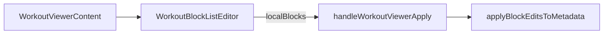

# Parametric Step 5 — M2 (Viewer integration)

**Status:** Shipped.

**Parent:** [parametric-step5-plan.md](./parametric-step5-plan.md)

**Prerequisites:** [parametric-step5-m1-m3-plan.md](./parametric-step5-m1-m3-plan.md) (block editor + `applyBlockEditsToMetadata`), M0 Apply guard.

---

## Goal

Connect **View → Edit → Apply** for rich factory cards in the Task Modal workout viewer:

- Edit mode: `WorkoutBlockListEditor` when `readVariant !== 'log'` and `sessionVm.source === 'rich'`
- Apply payload: optional `blocks?: WorkoutSessionBlockView[]`
- Hook: `applyBlockEditsToMetadata` when `blocks` present; else M0 flat guard



---

## What shipped

| File                                                                                                             | Change                                                                                 |
| ---------------------------------------------------------------------------------------------------------------- | -------------------------------------------------------------------------------------- |
| [`workout-viewer-dialog.tsx`](../../../src/components/fitness/workout-viewer-dialog.tsx)                         | `localBlocks`, `useRichBlockEdit`, `WorkoutBlockListEditor` in edit; `blocks` on Apply |
| [`useTaskWorkoutAi.ts`](../../../src/components/modals/task-modal/hooks/useTaskWorkoutAi.ts)                     | Block path → `applyBlockEditsToMetadata`; flat path → M0 guard                         |
| [`useTaskWorkoutAi.test.ts`](../../../src/components/modals/task-modal/hooks/__tests__/useTaskWorkoutAi.test.ts) | Rich blocks Apply + title-only with blocks                                             |
| [`workout-viewer-dialog.test.tsx`](../../../src/components/fitness/workout-viewer-dialog.test.tsx)               | Edit branch + Apply payload                                                            |

**Gating:**

| Condition                     | Edit UI                  |
| ----------------------------- | ------------------------ |
| `readVariant === 'log'`       | `WorkoutExercisesEditor` |
| `sessionVm.source !== 'rich'` | `WorkoutExercisesEditor` |
| Rich workout                  | `WorkoutBlockListEditor` |

---

## Verification

```bash
pnpm exec vitest run \
  src/components/modals/task-modal/hooks/__tests__/useTaskWorkoutAi.test.ts \
  src/components/fitness/workout-viewer-dialog.test.tsx \
  src/lib/workout-factory/sync-workout-metadata.test.ts \
  src/components/fitness/workout-block-renderer/WorkoutBlockListEditor.test.tsx
```

**Manual QA:**

1. Tabata card → View blocks → Edit shows block editor (not flat DnD).
2. Rename main exercise → Apply → Tabata subtitle preserved in View.
3. Title-only Apply → block structure preserved.
4. Flat legacy card → flat editor unchanged.
5. `workout_log` → no block editor in edit.

---

## Next

- **M4:** `formatParams` editor
- Explicit “Convert to flat list” menu (optional)
