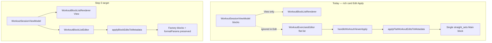

# Parametric Workout Blocks — Step 5 (Block-Aware Edit & Metadata Sync)

**Status:** In progress — **M0**, **M1**, and **M3** shipped; **M2** (viewer Apply wiring) next.

**Prerequisites:** [parametric-step4-plan.md](./parametric-step4-plan.md) M0–M4 shipped (shared read renderer + read parity).

**M1 + M3 milestone doc:** [parametric-step5-m1-m3-plan.md](./parametric-step5-m1-m3-plan.md)

**Related:** [Workout UI landscape audit](./README.md) · [parametric-step1-2-plan.md](./parametric-step1-2-plan.md) (data contract) · [layout-shell-architecture.md](./layout-shell-architecture.md)

**Follow-ups (separate steps):** Step 6 — Player interval timers (P2) · Step 7 — Progression-format execution UX (P3) · Step 8 — Block context on `workout_log` (P4 logging)

---

## Executive summary

Step 4 delivered **read parity**: View mode renders parametric blocks (Tabata subtitles, section headers, superset labels) via `WorkoutBlockListRenderer`. **Edit mode is unchanged** — it still mounts flat `WorkoutExercisesEditor`, and **Apply** always routes through `applyFlatWorkoutEditsToMetadata`, which collapses all `exerciseBlocks` into a single `straight_sets` “Main” block.

Users who open **Edit → Apply** (even to change title/description only) lose block formatting in View mode. Card **Save** is safer: `finalizeWorkoutMetadataForSave` only degrades when the flat form list **diverges** from factory-derived exercises — but the viewer Apply path does not use that guard today.

Step 5 closes the **edit / persist loop** for rich cards: block structure survives intentional edits, and accidental Apply without exercise changes does not destroy parametric intent.

**Sprint shape:** One technical plan, **four phased milestones** (M0–M3 required; M4 optional stretch). M0 can ship as a hotfix before the full block editor.

---

## Problem statement (observed 2026-05-20)

| Surface           | Rich Tabata card behavior                                                             |
| ----------------- | ------------------------------------------------------------------------------------- |
| **View**          | ✅ Block headers, `Tabata · 8 Rounds (20/10s)`, section grouping                      |
| **Edit**          | ❌ Flat drag-and-drop list; Tabata blocks invisible as structure                      |
| **Apply changes** | ❌ Collapses `exerciseBlocks` → one `straight_sets` Main block; View loses formatting |

Root causes:

1. **Edit UI** — [workout-viewer-dialog.tsx](../../../src/components/fitness/workout-viewer-dialog.tsx) edit branch always renders [WorkoutExercisesEditor](../../../src/components/fitness/workout-exercises-editor.tsx) (flat-only).
2. **Apply write path** — [useTaskWorkoutAi.ts](../../../src/components/modals/task-modal/hooks/useTaskWorkoutAi.ts) `handleWorkoutViewerApply` unconditionally calls `applyFlatWorkoutEditsToMetadata`.
3. **Inconsistency vs Save** — [finalizeWorkoutMetadataForSave](../../../src/lib/item-metadata.ts) uses `flatExercisesMatchDerived` before degrading; Apply does not.



---

## Scope

### In scope (Step 5)

| Area                          | Deliverable                                                                                                              |
| ----------------------------- | ------------------------------------------------------------------------------------------------------------------------ |
| **M0 Apply safety**           | Apply/Save parity: skip factory degradation when flat exercises unchanged; title/description-only Apply preserves blocks |
| **M1 Edit foundation**        | `WorkoutBlockListEditor` — block-scoped edit slots reusing M0 read row primitives                                        |
| **M2 Viewer integration**     | Rich cards: Edit mode uses block editor; flat-only cards keep `WorkoutExercisesEditor`                                   |
| **M3 Metadata write path**    | `applyBlockEditsToMetadata` + round-trip tests VM → factory → VM                                                         |
| **M4 formatParams (stretch)** | Bounded editing for Tabata / AMRAP / EMOM block timers (rounds, work/rest, time cap) — not full 12-format builder        |
| **UX guardrails**             | Warning when switching to Edit on rich cards until M2 ships; optional “structure will be preserved” copy after M2        |

### Out of scope (Step 6+)

| Deferred                                                             | Step           | Notes                                                   |
| -------------------------------------------------------------------- | -------------- | ------------------------------------------------------- |
| AMRAP/EMOM/Tabata **interval timers** during Play                    | 6 (P2)         | Read subtitles exist; no countdown shell                |
| Superset/contrast **paired round UX** during Play                    | 6 (P2)         | A1/A2 labels in read only                               |
| Ladder / pyramid / chipper / clusters / drop_sets **progression UX** | 7 (P3)         |                                                         |
| Block metadata on **`workout_log`** finish payload                   | 8 (P4)         | Finish still flat                                       |
| **LiveSessionWorkoutPlayer** block editor                            | 5 stretch or 6 | Flat editor today; lower traffic than Task Modal viewer |
| **TaskModalWorkoutFields** details-tab flat editor                   | —              | Stays flat for `workout_log` rows                       |
| Coach **`execution_patch`** block-aware indices                      | —              | Global flat index contract unchanged                    |
| New **`block_format`** values or merge rule changes                  | —              | Closed-world 12 formats only                            |

---

## Design principles

1. **Factory is source of truth** when `ai_workout_factory.workout_set` exists — same as Steps 1–4 read path.
2. **Edit through the ViewModel** — editors mutate `WorkoutSessionBlockView[]` (or a dedicated edit DTO), not a flattened list, for rich cards.
3. **Derive flat cache after write** — `metadata.exercises` refreshed via `workoutInSetToTaskExercises` + `deriveFlatExercisesFromMetadata`; never hand-edit flat list in parallel without syncing factory.
4. **Reuse read primitives** — extend `workout-block-renderer/` with edit slots; do not fork Tabata subtitle logic into a second editor package.
5. **Degrade only on explicit flat divergence** — collapsing to `straight_sets` remains valid when the user intentionally edits via flat fallback or converts a card to flat-only.

---

## Milestone 0 — Apply safety (hotfix)

**Goal:** Stop accidental block loss before the full block editor ships. **Can merge independently.**

### Changes

| File                                                                                       | Change                                                                                                                                                                     |
| ------------------------------------------------------------------------------------------ | -------------------------------------------------------------------------------------------------------------------------------------------------------------------------- |
| [useTaskWorkoutAi.ts](../../../src/components/modals/task-modal/hooks/useTaskWorkoutAi.ts) | In `handleWorkoutViewerApply`, call `applyFlatWorkoutEditsToMetadata` **only when** `!flatExercisesMatchDerived(payload.exercises, deriveFlatExercisesFromMetadata(prev))` |
| [workout-viewer-dialog.tsx](../../../src/components/fitness/workout-viewer-dialog.tsx)     | Optional: one-line banner in Edit mode — _“Exercise structure is preserved unless you change exercises below.”_                                                            |

### Exit criteria

- Vitest: rich fixture → Apply with **unchanged** exercises → `exerciseBlocks` length and `blockFormat` unchanged (Tabata block still Tabata).
- Vitest: Apply with **changed** exercise name/reps → existing degrade behavior (single `straight_sets` Main) until M3 replaces it.
- Manual: View Tabata blocks → Edit title only → Apply → View still shows Tabata sections.

### Estimate

0.5–1 day.

---

## Milestone 1 — Block edit foundation

**Status:** Shipped — see [parametric-step5-m1-m3-plan.md](./parametric-step5-m1-m3-plan.md).

**Goal:** Shared edit orchestrator exists; tests green; not wired to viewer yet.

### New modules

```text
src/components/fitness/workout-block-renderer/
  WorkoutBlockListEditor.tsx          # NEW — edit orchestrator (mirrors WorkoutBlockListRenderer)
  WorkoutBlockExerciseEditRow.tsx     # NEW — inline edit row (extends read row fields)
  WorkoutInstructionBlockEdit.tsx     # NEW — instruction bullet edit for warmup/finisher/cooldown
  workout-block-editor-types.ts       # NEW — BlockEditState, onChange contracts
  WorkoutBlockListEditor.test.tsx     # NEW
  index.ts                            # export edit package (tree-shake friendly)
```

### Architectural signature

```tsx
type WorkoutBlockListEditorProps = {
  blocks: WorkoutSessionBlockView[];
  canWrite: boolean;
  workoutUnitSystem: UnitSystem;
  onChange: (next: WorkoutSessionBlockView[]) => void;
  /** Optional: edit block-level formatParams (M4). */
  onBlockFormatParamsChange?: (blockId: string, params: Record<string, unknown>) => void;
  idPrefix?: string;
};
```

### Behavior (M1)

| Block kind                                 | Edit capability                                                                                                                       |
| ------------------------------------------ | ------------------------------------------------------------------------------------------------------------------------------------- |
| **Main** (`exerciseBlocks`)                | Reorder exercises within block; edit sets/reps/RPE/notes per row; reorder blocks (drag); **read-only** `blockFormat` + subtitle in M1 |
| **Instruction** (warmup/finisher/cooldown) | Edit instruction lines; rename section label where factory uses `exerciseName`                                                        |
| **Cardinality**                            | Enforce merge rules in UI where cheap (e.g. superset warns if ≠2 exercises) — full validation deferred to write path                  |

### Reuse from M0

- `WorkoutBlockHeader` (read-only in M1)
- `WorkoutBlockExerciseGroup` station labels (A1/A2)
- `formatBlockSubtitle`, `formatExercisePrescriptionLine` helpers

### Exit criteria

```bash
pnpm exec vitest run src/components/fitness/workout-block-renderer/WorkoutBlockListEditor.test.tsx
```

- Tabata fixture: edit exercise name in finisher block → `onChange` emits updated block array; `blockFormat` + `formatParams` unchanged.
- Superset fixture: two exercises remain grouped under one block id.

### Estimate

2–3 days.

---

## Milestone 2 — Viewer integration

**Goal:** Task Modal workout viewer Edit mode preserves block structure for rich cards.

### Changes

| File                                                                                   | Change                                                                                                    |
| -------------------------------------------------------------------------------------- | --------------------------------------------------------------------------------------------------------- |
| [workout-viewer-dialog.tsx](../../../src/components/fitness/workout-viewer-dialog.tsx) | When `sessionVm.source === 'rich'`, Edit body → `WorkoutBlockListEditor`; else → `WorkoutExercisesEditor` |
| [workout-viewer-dialog.tsx](../../../src/components/fitness/workout-viewer-dialog.tsx) | Extend local state: `localBlocks` alongside `localExercises`; sync from VM on `syncKey`                   |
| [WorkoutViewerApplyPayload](../../../src/components/fitness/workout-viewer-dialog.tsx) | Add optional `blocks?: WorkoutSessionBlockView[]` when rich                                               |

### View / Edit parity

```text
View:  sessionVm.blocks → WorkoutBlockListRenderer
Edit:  localBlocks       → WorkoutBlockListEditor   (rich)
Edit:  localExercises     → WorkoutExercisesEditor   (flat fallback)
```

### Exit criteria

- Manual: generated + Coach-appended Tabata finisher → View shows blocks → Edit shows same sections (not flat list) → Apply → View unchanged structure.
- [workout-viewer-dialog.test.tsx](../../../src/components/fitness/workout-viewer-dialog.test.tsx): rich path mounts `WorkoutBlockListEditor` in edit mode.

### Estimate

1–2 days (after M1).

---

## Milestone 3 — Metadata write path

**Status:** Shipped — see [parametric-step5-m1-m3-plan.md](./parametric-step5-m1-m3-plan.md).

**Goal:** Apply and Save persist block-aware edits into `ai_workout_factory` without collapsing parametric blocks.

### New pure module

**Location:** [sync-workout-metadata.ts](../../../src/lib/workout-factory/sync-workout-metadata.ts) (canonical; Deno mirror if needed for agent parity checks).

```ts
/** Apply block-aware edits from the viewer editor. Updates factory tree + derived flat cache. */
export function applyBlockEditsToMetadata(
  meta: unknown,
  payload: {
    blocks: WorkoutSessionBlockView[];
    title?: string;
    description?: string;
  },
): Json;
```

### Write rules

| Input                                                                         | Factory mutation                                                                                     |
| ----------------------------------------------------------------------------- | ---------------------------------------------------------------------------------------------------- |
| Main block exercise row edit                                                  | Update matching `exerciseBlocks[].exercises[]`; preserve `blockFormat`, `formatParams`, block `name` |
| Reorder exercises within block                                                | Re-order factory exercise rows; re-number `order`                                                    |
| Reorder main blocks                                                           | Re-order `exerciseBlocks[]`; re-number block `order`                                                 |
| Instruction section edit                                                      | Map to `warmupBlocks` / `finisherBlocks` / `cooldownBlocks` via section kind                         |
| Add/remove exercise (M3 minimum: edit existing only; add/remove stretch → M4) | Document scope in PR                                                                                 |

### Integration

| Caller                           | Behavior                                                                                                                       |
| -------------------------------- | ------------------------------------------------------------------------------------------------------------------------------ |
| `handleWorkoutViewerApply`       | Rich + `payload.blocks` → `applyBlockEditsToMetadata`; flat → existing flat path (with M0 guard)                               |
| `finalizeWorkoutMetadataForSave` | When form has rich factory and block editor was used, prefer block path if TaskModal tracks block state (optional unify in M3) |

### Tests

```bash
pnpm exec vitest run \
  src/lib/workout-factory/sync-workout-metadata.test.ts \
  src/lib/workout-factory/workout-session-view-model.test.ts
```

- Round-trip: `richMetadataWithBlockFormat('tabata')` → VM → applyBlockEdits (rename exercise) → VM → still `blockFormat === 'tabata'`.
- Coach-append scenario: main + finisher blocks → edit finisher reps only → both blocks preserved.

### Exit criteria

- Replace unconditional degrade in Apply for rich block edits.
- `flatExercisesMatchDerived` true after block-only metadata sync.

### Estimate

2–3 days.

---

## Milestone 4 — formatParams editing (stretch)

**Goal:** Users can adjust Tabata / AMRAP / EMOM timing without Coach or regenerating.

### UI

- Block header “Edit timing” affordance on parametric main/finisher blocks.
- Bounded fields from [block-blueprint-library.ts](../../../src/lib/agents/coach/block-blueprint-library.ts) cardinality (e.g. Tabata: rounds, work_seconds, rest_seconds).
- On save: update `formatParams` + re-run `hydrateTabataExercisesFromFormatParams` (merge module parity).

### Out of M4

- Changing `block_format` (Tabata → AMRAP) in UI — Coach / `:` composer remains the path for format changes.
- Adding new blocks from UI — Coach append (Lane 1) remains primary; optional “Add block” deferred.

### Estimate

2–3 days (optional).

---

## Phased delivery summary

```text
M0  Apply safety (flatExercisesMatchDerived guard)           ← ship first
    ↓
M1  WorkoutBlockListEditor + tests
    ↓
M2  WorkoutViewerContent rich Edit wiring
    ↓
M3  applyBlockEditsToMetadata + Apply/Save integration
    ↓
M4  formatParams editor (stretch)
```

**Parallel work:** M0 can merge while M1 is in review. **Do not** wire M2 until M1 tests pass.

**Rollback:** M2 viewer switch can be gated with `NEXT_PUBLIC_WORKOUT_BLOCK_EDITOR=1` if needed; M0 has no flag (strictly safer behavior).

---

## Verification checklist (end of Step 5)

1. Rich Tabata card: View → Edit → change title only → Apply → View still shows Tabata block headers/subtitles.
2. Rich Tabata card: Edit finisher exercise name → Apply → View + Play show updated name; Tabata timing unchanged.
3. Flat-only legacy card: Edit still uses `WorkoutExercisesEditor`; behavior unchanged.
4. Save after block edit: `finalizeWorkoutMetadataForSave` and Apply produce consistent factory JSON.
5. Coach `:finisher/tabata` append → user edits in viewer → structure preserved (no revert to flat list on reload).
6. `pnpm run check` green.

---

## Documentation updates (same sprint)

| Doc                                                            | Update                                                                                            |
| -------------------------------------------------------------- | ------------------------------------------------------------------------------------------------- |
| [parametric-step4-plan.md](./parametric-step4-plan.md)         | Link Step 5; note Edit/Apply gap closed in Step 5                                                 |
| [views/README.md](./README.md)                                 | Gap #6 (rich view edit-only flat) → in progress; update gap matrix row for WorkoutExercisesEditor |
| [workout-viewer-dialog.md](../workout-viewer-dialog.md)        | Document rich Edit path + `WorkoutViewerApplyPayload.blocks`                                      |
| [workout-exercises-editor.md](../workout-exercises-editor.md)  | Clarify: flat-only path; rich cards use block editor                                              |
| [docs/fitness/README.md](../README.md)                         | Link `parametric-step5-plan.md`                                                                   |
| [layout-shell-architecture.md](./layout-shell-architecture.md) | Add `applyBlockEditsToMetadata` to sync table                                                     |

---

## Open decisions (resolve before M1 coding)

1. **Payload shape:** Extend `WorkoutViewerApplyPayload` with `blocks[]` vs pass full `WorkoutSetTemplate` — recommend **`blocks[]` from VM** to keep viewer decoupled from factory JSON keys.
2. **Add/remove block in UI:** M3 scope = edit existing blocks only; adding finisher without Coach is **M4+ or out of scope** — confirm with product.
3. **Flat escape hatch:** Offer “Convert to flat list” explicit action (calls `applyFlatWorkoutEditsToMetadata`) vs accidental degrade — recommend **explicit menu** after M2.
4. **LiveSessionWorkoutPlayer:** Block editor parity in Step 5 M4 or defer to Step 6 — recommend **defer** unless live host edit is P0.
5. **Feature flag:** Required for M2 viewer switch? Recommend **optional** env flag for first deploy only.

---

## Step 6+ roadmap preview

| Step  | Theme                                 | Primary surfaces                                              |
| ----- | ------------------------------------- | ------------------------------------------------------------- |
| **6** | Player interval timers (P2)           | `WorkoutPlayer` — AMRAP/EMOM/Tabata countdown shells          |
| **7** | Progression formats (P3)              | Ladder, pyramid, chipper, clusters, drop_sets interactive UX  |
| **8** | Block-aware logs (P4)                 | `handleFinish`, `workout_log.metadata` block context          |
| **9** | Read parity completion (P1 remainder) | `UpNextCard`, `CoachDraftCard`, deck summaries (Step 4 M2–M4) |

Step 5 unblocks **prescription editing**; Steps 6–7 unblock **execution fidelity**; Step 8 unblocks **history/analytics**.

---

## CI command (add when M1 lands)

```bash
pnpm exec vitest run \
  src/components/fitness/workout-block-renderer/WorkoutBlockListEditor.test.tsx \
  src/components/fitness/workout-block-renderer/WorkoutBlockListRenderer.test.tsx \
  src/lib/workout-factory/sync-workout-metadata.test.ts \
  src/components/fitness/workout-viewer-dialog.test.tsx
```

---

## Audit metadata

| Item              | Value                                                                      |
| ----------------- | -------------------------------------------------------------------------- |
| Motivation        | User report: View shows Tabata blocks; Edit flat; Apply destroys structure |
| Step 4 dependency | M0–M1 read renderer shipped                                                |
| Planning date     | 2026-05-20                                                                 |
