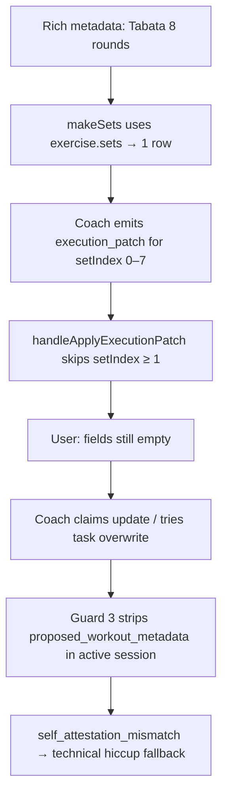
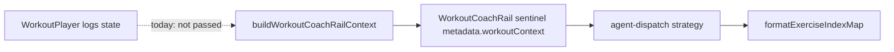

# Parametric Workout Blocks — Step 6 (Execution grid fidelity & Coach context sync)

**Status:** **M6.1 shipped** · **M6.2** (Coach context sync) planned · **M6.3+** deferred.

**Prerequisites:** [parametric-step3-plan.md](./parametric-step3-plan.md) (block-aware player P0) · [parametric-step5-plan.md](./parametric-step5-plan.md) (rich prescription edit/Apply). Step 5 M4 (`formatParams` editor) optional but not blocking.

**Related:** [workout-coach-rail README](../../rails/workout-coach-rail/README.md) · [Workout UI landscape audit](./README.md) · [parametric-step3-plan.md](./parametric-step3-plan.md)

**Follow-ups (later steps):** Step 7 — progression-format execution UX (P3) · Step 8 — block context on `workout_log` (P4) · Step 6 stretch — interval timer shells (AMRAP/EMOM/Tabata countdown UI)

---

## Executive summary

Step 3 gave the player **block headers and subtitles**; Step 5 fixed **prescription editing**. Step 6 fixes **execution fidelity**: the live set grid must match what the prescription and Coach already believe (e.g. 8-round Tabata → 8 fillable rows), and the Coach rail must expose **current row bounds** so `execution_patch` stops silently dropping out-of-range cells.

This is **not a feature-flag problem** and **not a prompt rewrite**. The failure mode is a **frontend reality mismatch** that gaslights the model:



**Order of operations (strict):**

| Phase     | Theme                                                          | Touch server prompt prose?            |
| --------- | -------------------------------------------------------------- | ------------------------------------- |
| **M6.1**  | UI reality — block-aware log row initialization                | **No**                                |
| **M6.2**  | Coach context — live row counts in workout context / index map | **No** (formatter + JSON fields only) |
| **M6.3**  | `execution_patch` resize ops                                   | **Deferred**                          |
| **M6.4+** | Interval timer shells, superset pairing, etc.                  | Separate milestones                   |

---

## Problem statement (observed 2026-05-20)

| Symptom                                                        | Root cause                                                                                                                                           |
| -------------------------------------------------------------- | ---------------------------------------------------------------------------------------------------------------------------------------------------- |
| Tabata finisher shows “8 rounds” in header but **one** set row | [`makeSets`](../../../src/components/fitness/WorkoutPlayer.tsx) uses `exercise.sets ?? 3`, ignores `exercise.rounds` and block `formatParams.rounds` |
| Coach says reps/RPE are set; grid stays blank                  | Model may omit `execution_patch`, or patch targets `setIndex` ≥ rendered row count → silently skipped                                                |
| “Technical hiccup calculating your workout”                    | `self_attestation_mismatch` after Guard 3 strips structured writes during active session while reply claims a save                                   |
| Browser `agent.effect.parse_dropped`                           | `parseExecutionPatchFromMetadata` returned null (no patch or invalid shape)                                                                          |

**In scope surfaces:** [`WorkoutPlayer.tsx`](../../../src/components/fitness/WorkoutPlayer.tsx), [`buildWorkoutCoachRailContext`](../../../src/lib/workout-factory/build-workout-coach-rail-context.ts), [`WorkoutCoachRail.tsx`](../../../src/components/chat/WorkoutCoachRail.tsx), shared [`formatExerciseIndexMap`](../../../src/lib/agents/coach/prompts.ts) (formatter only — mirror to Edge).

**Explicitly out of scope for Step 6 initial slice:**

- Changes to `buildBaseCoachPrompt`, `MID_WORKOUT_SUPPORT_MODE_DIRECTIVE`, `ACTIVE_WORKOUT_EXECUTION_STATE_DIRECTIVE`, or other Coach **prompt prose**
- `execution_patch` **`add_sets`** / dynamic grid resize by the model
- Task Modal / `StandardTaskChatRail` (separate Vercel flag: `NEXT_PUBLIC_STANDARD_TASK_CHAT_RAIL`)
- Interval countdown UI (Step 6 stretch / Step 7 overlap — document only)

---

## What shipped (M6.1)

| File                                                                                                            | Change                                                                                       |
| --------------------------------------------------------------------------------------------------------------- | -------------------------------------------------------------------------------------------- |
| [`resolve-player-log-row-count.ts`](../../../src/lib/workout-factory/resolve-player-log-row-count.ts)           | `resolvePlayerLogRowCount`, `buildPlayerInitialLogs`, `buildPlayerInitialLogRowsForExercise` |
| [`resolve-player-log-row-count.test.ts`](../../../src/lib/workout-factory/resolve-player-log-row-count.test.ts) | Tabata, straight_sets, flat fallback, circuit, `buildPlayerInitialLogs`                      |
| [`workout-player-exercise-index.ts`](../../../src/lib/workout-factory/workout-player-exercise-index.ts)         | `blockContextForGlobalIndex`                                                                 |
| [`WorkoutPlayer.tsx`](../../../src/components/fitness/WorkoutPlayer.tsx)                                        | Block-aware log init/recovery; `blocksDigest` in recovery identity                           |

**Resolver priority:** `formatParams.rounds` (round-driven main blocks) → `exercise.rounds` → `exercise.sets` → `max(1, sets ?? 3)`.

**Verification:**

```bash
pnpm exec vitest run \
  src/lib/workout-factory/resolve-player-log-row-count.test.ts \
  src/lib/workout-factory/workout-player-exercise-index.test.ts
```

---

## M6.1 — UI reality check (WorkoutPlayer log grid)

**Status:** Shipped.

### Goal

When the player initializes `logs` (fresh open, recovery fallback, or template reset), **row count per exercise** must reflect parametric prescription, not only `exercise.sets`.

### Current behavior

```typescript
// WorkoutPlayer.tsx — today
function makeSets(ex: WorkoutExercise): SetDraft[] {
  const count = Math.max(1, ex.sets ?? 3);
  return Array.from({ length: count }, () => ({ weight: '', reps: '', rpe: '', done: false }));
}
```

Used in recovery paths: `exercises.map(makeSets)` where `exercises = sessionVm.flatExercises`.

### Target behavior

Introduce a **pure factory helper** (Vitest-covered) in `src/lib/workout-factory/`:

```typescript
/**
 * How many fillable log rows the player should render for one flat exercise index.
 * Must stay in sync with WorkoutPlayer grid and M6.2 live_set_counts.
 */
export function resolvePlayerLogRowCount(
  exercise: WorkoutExercise,
  blockContext: { blockFormat: string | null; formatParams: Record<string, unknown> } | null,
): number;
```

**Resolution order (documented, tested per format):**

| Priority | Source                                                                                          | Example                                 |
| -------- | ----------------------------------------------------------------------------------------------- | --------------------------------------- |
| 1        | Block `formatParams.rounds` when block is **interval-style** and exercise is in that main block | Tabata `rounds: 8` → **8 rows**         |
| 2        | `exercise.rounds` when &gt; 0 (flat cache / derived row)                                        | `rounds: 8` on flat exercise            |
| 3        | `exercise.sets` when &gt; 0                                                                     | Straight sets `sets: 4` → 4 rows        |
| 4        | Fallback                                                                                        | `max(1, sets ?? 3)` (legacy flat cards) |

**Block-aware wiring:**

- Use existing [`buildPlayerExerciseIndexLookup`](../../../src/lib/workout-factory/workout-player-exercise-index.ts) + `sessionVm.blocks` to resolve `blockContext` for each global flat index.
- **M6.1 v1 formats:** `tabata` (required), `emom`, `circuit`, `superset` when `formatParams.rounds` is set — same rule: rounds drive row count for exercises in that main block.
- **Do not** change `SetDraft` shape, global `exerciseIndex`, or `handleFinish` payload in M6.1.

### Files

| File                                                                    | Change                                                                  |
| ----------------------------------------------------------------------- | ----------------------------------------------------------------------- |
| `src/lib/workout-factory/resolve-player-log-row-count.ts`               | **New** — pure resolver + tests                                         |
| `src/lib/workout-factory/workout-player-exercise-index.ts`              | Optional helper: `blockForGlobalIndex(lookup, blocks)`                  |
| `src/components/fitness/WorkoutPlayer.tsx`                              | Replace naive `makeSets` with block-aware initializer using `sessionVm` |
| `src/components/fitness/WorkoutPlayer.test.tsx` or block-renderer tests | Tabata fixture → 8 rows                                                 |

### Draft recovery note

When `draft_logs` row length ≠ newly resolved template length:

- **Prefer saved draft** if user has edited (`hasUserEditedRef`) or draft exists with matching `exercises.length`.
- On **fresh open** after M6.1 ships, new templates get correct row counts; old in-progress drafts with 1-row Tabata may need one-time re-init (acceptable; document in QA).

### Acceptance (M6.1)

1. Rich Tabata card (8 rounds in `formatParams`) → each Tabata exercise panel shows **8** set rows on player open.
2. Straight-sets exercise with `sets: 4` unchanged.
3. Flat-only legacy card unchanged.
4. `handleApplyExecutionPatch` can fill `setIndex` 0–7 without silent skip.
5. Manual QA: Coach “set 15 reps on all 8 sets” with patch → grid updates (may still need M6.2 for reliable model targeting).

---

## M6.2 — Coach context sync (live row bounds)

### Goal

The LLM must see **the same row bounds the UI renders**, including after the user adds/removes rows with **+ Set**.

### Principle

**Do not fix this by adding prompt paragraphs.** Enrich the **workout context JSON** the client already sends on the workout-player sentinel and optionally on user sends; extend **`formatExerciseIndexMap`** to render counts from that JSON (formatter change only — no new directives).

### Current context path



Today [`formatExerciseIndexMap`](../../../src/lib/agents/coach/prompts.ts) emits:

```text
0: Burpees [dict:…]
1: High Knees [dict:…]
```

### Target

1. **Client payload** — add parallel array (stable, easy to parse):

   ```json
   {
     "exercises": [ … ],
     "live_set_counts": [8, 8, 4, … ],
     "workout_task_title": "…"
   }
   ```

   - `live_set_counts[i]` = `logs[i].length` from WorkoutPlayer at sentinel send time.
   - Update on **each user message** from WorkoutCoachRail when logs change (pass callback/ref from player → rail), so manual +/− set rows stay accurate.

2. **Index map formatter** — when `live_set_counts` aligns with `exercises.length`:

   ```text
   0: Burpees (8 log rows) [dict:…]
   1: High Knees (8 log rows) [dict:…]
   ```

   Append one line to existing footer (no new system prompt section):

   `setIndex must be 0 .. live_set_counts[exerciseIndex] - 1`.

3. **Mirror** — update Deno copy in `supabase/functions/agents/coach/prompts.ts` via existing mirror discipline (`pnpm check:agent-mirror`). **No** changes to `config.ts` directives or `buildBaseCoachPrompt` text in this milestone.

### Files

| File                                                          | Change                                                        |
| ------------------------------------------------------------- | ------------------------------------------------------------- |
| `src/lib/workout-factory/build-workout-coach-rail-context.ts` | Accept optional `liveSetCounts?: number[]`; include in output |
| `src/components/fitness/WorkoutPlayer.tsx`                    | Pass `logs` lengths into rail props                           |
| `src/components/chat/WorkoutCoachRail.tsx`                    | Merge live counts into sentinel + outgoing metadata           |
| `src/lib/agents/coach/prompts.ts`                             | `formatExerciseIndexMap` reads `live_set_counts`              |
| `supabase/functions/agents/coach/prompts.ts`                  | Mirror formatter                                              |
| `src/lib/agents/coach/prompts.test.ts`                        | Count suffix + bounds footer                                  |

### Out of scope (M6.2)

- Server-side-only context (must originate from client logs — source of truth for grid)
- Embedding full `draft_logs` in context (too heavy; counts array suffices)

### Acceptance (M6.2)

1. Supabase message metadata for workout-player sentinel includes `live_set_counts`.
2. Coach system prompt block (Edge logs / debug) shows `(N log rows)` per index for Tabata workout.
3. After user adds a set via + Set, next user message updates counts; Coach patch targeting new last index succeeds.
4. No new prompt directive strings in `config.ts` / `prompts.ts` base blocks.

---

## M6.3 — execution_patch grid resize (deferred)

**Decision:** Do **not** add `add_sets` (or similar) to `execution_patch` in Step 6.

| Responsibility                        | Owner                                   |
| ------------------------------------- | --------------------------------------- |
| Row count / grid shape                | User via **+ Set** / player init (M6.1) |
| Cell values (reps, RPE, weight, done) | Coach via **`execution_patch`**         |

Rationale: AI-driven grid resize races autosave, user taps, and draft recovery. M6.1 + M6.2 remove the Tabata mismatch that forced the model toward forbidden task overwrites.

Revisit only if product requires “Coach, add 3 more sets” without user tapping +.

---

## M6.4+ — Step 6 stretch (not in initial slice)

From [parametric-step5-plan.md](./parametric-step5-plan.md) roadmap — **after** M6.1–M6.2:

| Milestone      | Theme                                                    |
| -------------- | -------------------------------------------------------- |
| Timer shells   | AMRAP / EMOM / Tabata countdown chrome in player         |
| Paired layouts | Superset / contrast round UX                             |
| Log metadata   | Block context on `workout_log` finish (→ Step 8 overlap) |

---

## Verification

### Automated (add when M6.1 lands)

```bash
pnpm exec vitest run \
  src/lib/workout-factory/resolve-player-log-row-count.test.ts \
  src/lib/workout-factory/workout-player-exercise-index.test.ts \
  src/lib/agents/coach/prompts.test.ts \
  src/lib/workout-factory/build-workout-coach-rail-context.test.ts
```

```bash
pnpm check:agent-mirror   # after formatExerciseIndexMap mirror
```

### Manual QA (WorkoutPlayer + Coach rail)

1. Open rich Tabata workout → confirm **8 rows** per Tabata exercise before chatting.
2. Ask Coach to set 15 reps + RPE 8 on all sets → grid cells populate; no “technical hiccup”.
3. Delete one row with UI (if supported) or use + Set → ask Coach to fill last row → succeeds.
4. Edge logs: no `self_attestation_mismatch` for normal rep/RPE requests; `execution_patch` present on reply metadata.
5. Regression: flat-only workout card; straight_sets 4×10 unchanged.

---

## Relationship to env / flags

| Config                                | Affects WorkoutPlayer Coach?         |
| ------------------------------------- | ------------------------------------ |
| `COACH_MERGE_WORKOUT_METADATA`        | No (task-card merge / rail composer) |
| `COACH_CARD_ACTIONS`                  | No                                   |
| `NEXT_PUBLIC_STANDARD_TASK_CHAT_RAIL` | No (TaskModal only)                  |

Workout coach rail has **no feature flag** ([docs/rails/workout-coach-rail/README.md](../../rails/workout-coach-rail/README.md)).

---

## Implementation order (checklist)

- [x] **M6.1a** — `resolvePlayerLogRowCount` + unit tests (Tabata, straight_sets, flat fallback)
- [x] **M6.1b** — Wire WorkoutPlayer init/recovery through resolver + `sessionVm.blocks`
- [ ] **M6.1c** — Manual Tabata QA on production-like rich card
- [ ] **M6.2a** — `live_set_counts` on coach context from player `logs`
- [ ] **M6.2b** — `formatExerciseIndexMap` formatter + mirror + tests
- [ ] **M6.2c** — End-to-end Coach rep/RPE fill QA
- [ ] **Defer** — `add_sets`, prompt directive edits, timer shells

---

## Audit metadata

| Item              | Value                                                                                                 |
| ----------------- | ----------------------------------------------------------------------------------------------------- |
| Motivation        | Production Coach rail: Tabata 8-round prescription vs 1-row grid; `self_attestation_mismatch` cascade |
| Planning date     | 2026-05-20                                                                                            |
| Step 3 dependency | Block-aware player read path                                                                          |
| Step 5 dependency | Rich prescription accurate in DB (optional for M6.1 Tabata case)                                      |
