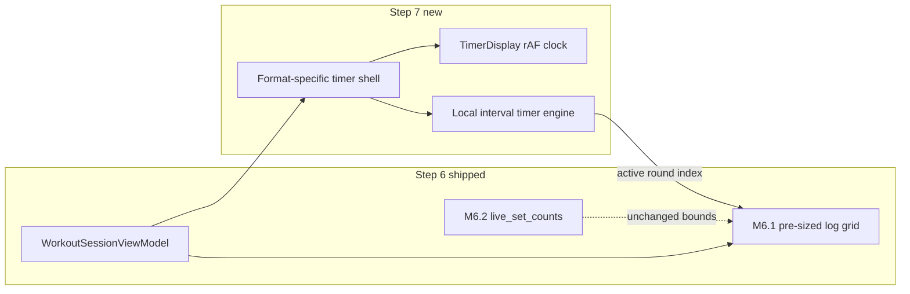
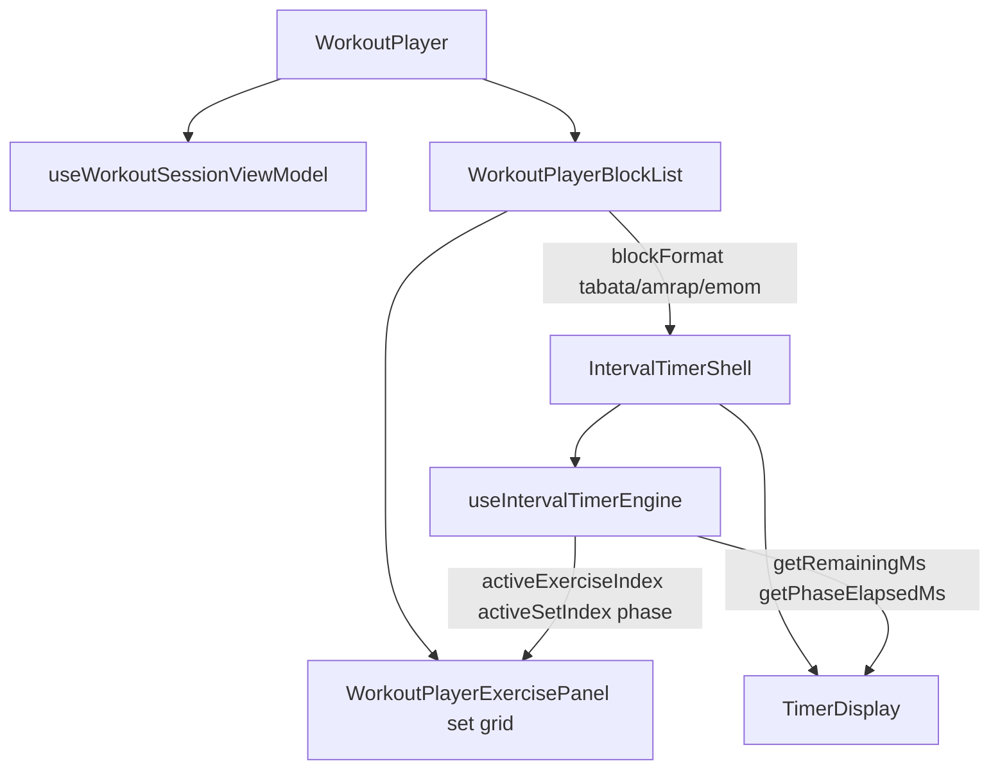
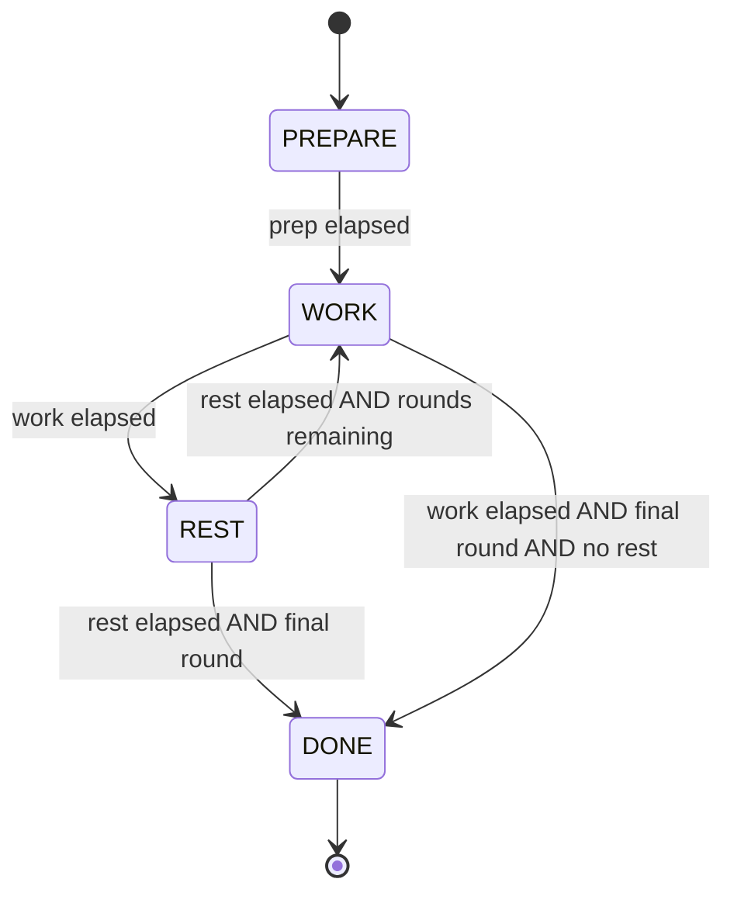

# Parametric Workout Blocks — Step 7 (Execution UX & Timer Shells)

**Status:** **M7.1 shipped** · **M7.2 shipped** · M7.3–M7.4 planned (2026-05-21)  
**Prerequisites:** [parametric-step6-plan.md](./parametric-step6-plan.md) (**M6.1** row counts · **M6.2** Coach `live_set_counts`) · [live-video-timers-audit.md](../architecture/live-video-timers-audit.md)

**Related:** [Workout UI landscape audit](./README.md) · [workout-coach-rail README](../../rails/workout-coach-rail/README.md) · [parametric-step3-plan.md](./parametric-step3-plan.md)

---

## Executive summary & goals

Step 6 fixed **execution grid fidelity** — the player renders the correct number of log rows (e.g. 8 for Tabata) and the Coach rail knows those bounds. Step 7 adds **execution UX**: local interval timer shells that wrap the existing grid and guide the athlete through work/rest timing, round progression, and time-cap formats.

**What Step 7 delivers**

| Format     | Shell behavior                                                                        |
| ---------- | ------------------------------------------------------------------------------------- |
| **Tabata** | Work/rest alternation per round; active row highlight synced to pre-sized grid (M6.1) |
| **AMRAP**  | Global time-cap countdown; local “Log Round” extends the grid without DB RPCs         |
| **EMOM**   | Fixed-interval reset loop (e.g. 60s every minute); round index drives active row      |

**Explicit architectural decision (2026-05-20 audit):**

We are **not** reusing the live-video AMRAP wrapper (`AmrapWrapper`, `useAmrapSession`, `amrap_*` RPCs) for the offline `WorkoutPlayer`. That system is coupled to:

- Supabase Realtime + Postgres (`amrap_sessions`, `amrap_log_round`)
- Flat deck metadata (`workoutExercises`) rather than `WorkoutSessionViewModel.blocks`
- Agora huddle overlay slots and host broadcast session phases

Step 7 builds **pure, local state machines** driven by parametric `ai_workout_factory` block metadata (`blockFormat`, `formatParams`). Live video remains a separate product surface; patterns may be referenced, not imported wholesale.



**Out of scope (Step 7 master plan):**

- Live-video wrapper refactors or parametric live huddle timers
- Coach prompt / `execution_patch` schema changes
- `add_sets` / model-driven grid resize (deferred from M6.3)
- Superset/contrast paired-row UX (Step 6 stretch → later step)
- Block context on `workout_log` finish payload (Step 8)

---

## Architecture & reusability

### What we salvage

| Asset                   | Location                                                                                                      | Step 7 use                                                                                                                                               |
| ----------------------- | ------------------------------------------------------------------------------------------------------------- | -------------------------------------------------------------------------------------------------------------------------------------------------------- |
| **`TimerDisplay`**      | [`src/features/live-video/shells/TimerDisplay.tsx`](../../../src/features/live-video/shells/TimerDisplay.tsx) | High-frequency clock via **`requestAnimationFrame`** — local `setState` in the display subtree avoids stuttering `setInterval` ticks on the whole player |
| **`formatSessionTime`** | Same file                                                                                                     | Count-up, countdown-seconds, countdown-tenths from elapsed ms + optional total                                                                           |
| **`formatElapsedMs`**   | Same file                                                                                                     | Tenths display for work/rest precision                                                                                                                   |

**Why not WorkoutPlayer’s current elapsed clock?** Today the player uses `setInterval(1000)` for session elapsed ([`WorkoutPlayer.tsx`](../../../src/components/fitness/WorkoutPlayer.tsx)). Step 7 interval shells need sub-second smooth countdowns during work/rest; the live-video `TimerDisplay` pattern is the approved display layer.

**Extraction note:** Consider moving `TimerDisplay` + formatters to a shared module (e.g. `src/lib/timer/` or `src/components/fitness/timer/`) so WorkoutPlayer does not import from `features/live-video/`. Milestone M7.1 sub-plan should decide exact path.

### What we do not salvage

| Asset                                    | Reason                                                      |
| ---------------------------------------- | ----------------------------------------------------------- |
| `AmrapWrapper` / `useAmrapSession`       | DB RPC + Realtime + flat schema                             |
| `useAmrapSetDuplication`                 | Round → `workout_exercise_logs` upsert via live session     |
| `useAmrapTimerState`                     | Server-authoritative `work_started_at` on `amrap_sessions`  |
| `ActivePhaseOverlays` Tabata placeholder | Hardcoded 4:00; not bound to `formatParams`                 |
| Live `sessionStateMachine` broadcast     | Host/participant sync; solo player needs local-only machine |

See [live-video-timers-audit.md](../architecture/live-video-timers-audit.md) for full inventory.

### Data source: parametric blocks only

Timer shells read **only** from the existing player read model:

```typescript
// WorkoutSessionViewModel (already built in Step 3)
sessionVm.blocks: WorkoutSessionBlockView[]

// Per block (main work)
block.blockFormat: 'tabata' | 'amrap' | 'emom' | …
block.formatParams: Record<string, unknown>
block.exercises: Exercise[]
block.subtitle: string | null  // presentation only; shells use formatParams
```

**Canonical `formatParams` keys** (from [`block-blueprint-library.ts`](../../../src/lib/agents/coach/block-blueprint-library.ts)):

| Format     | Required                                                     | Optional (defaults in merge/hydration)         |
| ---------- | ------------------------------------------------------------ | ---------------------------------------------- |
| **tabata** | `rounds`                                                     | `work_seconds` (20), `rest_seconds` (10)       |
| **amrap**  | `time_cap_minutes`                                           | `target_rounds`, `rest_between_rounds_seconds` |
| **emom**   | `interval_seconds` + (`total_minutes` **or** `total_rounds`) | `rest_in_interval_seconds`                     |

Row count for fixed formats continues to come from **M6.1** [`resolvePlayerLogRowCount`](../../../src/lib/workout-factory/resolve-player-log-row-count.ts) — shells **highlight** rows, they do not re-derive counts (except AMRAP local extension in M7.2).

### Layering model



**New modules (proposed — confirm in M7.1 sub-plan):**

| Module                                                                  | Responsibility                                              |
| ----------------------------------------------------------------------- | ----------------------------------------------------------- |
| `src/lib/workout-factory/interval-timer/`                               | Pure reducer + absolute-timestamp math (testable, no React) |
| `src/lib/workout-factory/interval-timer/resolve-format-timer-config.ts` | `formatParams` → typed config per `blockFormat`             |
| `src/components/fitness/interval-shells/`                               | React shells: Tabata, AMRAP, EMOM                           |
| `src/hooks/use-interval-timer-engine.ts`                                | React hook: rAF tick, pause/resume, dispatch transitions    |

### Core timer engine (design target)

All shells share one **absolute-timestamp** engine:

- On phase enter: `phaseAnchorMs = Date.now()`
- Remaining in phase: `durationMs - (Date.now() - phaseAnchorMs)` (clamped ≥ 0)
- On pause: freeze `pausedAtMs`, accumulate `pausedTotalMs`; on resume, shift anchor
- rAF loop reads `Date.now()` each frame — **no drift** from slow `setInterval` callbacks

**Tabata phase machine:**



**EMOM:** Single visible countdown that **resets** to `interval_seconds` at each minute boundary; round index increments on reset until `total_rounds` or `total_minutes` exhausted.

**AMRAP:** Single global countdown from `time_cap_minutes`; optional PREPARE; **no** WORK/REST alternation unless product adds `rest_between_rounds_seconds` later.

---

## Milestone sequence

| Milestone | Theme                              | Status      |
| --------- | ---------------------------------- | ----------- |
| **M7.1**  | Core timer engine + Tabata shell   | **Shipped** |
| **M7.2**  | Local AMRAP shell + grid extension | **Shipped** |
| **M7.3**  | EMOM shell                         | Planned     |
| **M7.4**  | Polish: audio cues + wake lock     | Stretch     |

---

## M7.1 — Core timer engine & Tabata shell

**Status:** Shipped. See [parametric-step7-m7.1-plan.md](./parametric-step7-m7.1-plan.md).

### Goal

Ship the shared local interval engine and the first production shell (**Tabata**). Sync timer state to the M6.1 pre-sized grid so the **active set row** is visually highlighted during WORK and optionally de-emphasized during REST.

### Scope

1. **Pure engine** — reducer + helpers:
   - Phases: `idle | prepare | work | rest | done | paused`
   - Inputs: `{ workMs, restMs, prepareMs?, totalRounds }`
   - Outputs: `{ phase, roundIndex (0-based), remainingMs, isRunning }`
   - Actions: `start`, `pause`, `resume`, `reset`, `skipPhase` (stretch)

2. **`resolveTabataTimerConfig(block)`** — read `formatParams.rounds`, `work_seconds`, `rest_seconds` with defaults 20/10.

3. **`TabataIntervalShell`** — UI chrome above/beside block grid:
   - Phase label (PREPARE / WORK / REST)
   - `TimerDisplay` with `formatSessionTime(..., 'countdown-tenths', phaseDurationMs)`
   - Start / Pause / Reset controls
   - Round indicator: “Round 3 of 8”

4. **Grid sync** — pass `activeSetIndex={engine.roundIndex}` (per exercise in block) into `WorkoutPlayerExercisePanel`:
   - Highlight active row during WORK
   - Optional: lock input on non-active rows during auto-run (product decision in sub-plan)

5. **Wire in `WorkoutPlayerBlockList`** — mount shell when `block.blockFormat === 'tabata'`.

### Non-goals (M7.1)

- AMRAP / EMOM shells
- Audio / wake lock
- Replacing session-level elapsed clock in player header (may coexist)

### Verification

```bash
pnpm exec vitest run \
  src/lib/workout-factory/interval-timer \
  src/components/fitness/interval-shells
```

**Manual QA:**

1. Open rich Tabata card → 8 rows (M6.1) + timer shell visible on Tabata block.
2. Start timer → WORK 20s → REST 10s → advances round; row 0→7 highlights in sync.
3. Pause mid-work → resume without time jump (anchor math).
4. Coach rep fill on active row still works (M6.2 bounds unchanged).

---

## M7.2 — Local AMRAP shell

**Status:** Shipped. See [parametric-step7-m7.2-plan.md](./parametric-step7-m7.2-plan.md).

### Goal

Time-cap countdown for `blockFormat === 'amrap'` using **local-only** state. Implement **grid extension** via a “Log Round” control that appends blank set rows in React `logs` state — **no** `amrap_log_round` RPC, **no** live-video duplication hook.

### Scope

1. **`resolveAmrapTimerConfig(block)`** — `time_cap_minutes` → total ms; optional `target_rounds` for display only.

2. **`AmrapIntervalShell`**:
   - Global countdown (`formatSessionTime` countdown-seconds)
   - Round counter (user-driven, not timer-driven)
   - **Log Round** button → increment local `roundCount`; for each exercise in block, append one blank `SetDraft` row (copy prior row values or prescription — mirror UX intent of live prep row without DB)

3. **Row growth rules:**
   - Initial rows: still M6.1 at open (typically 1 row per exercise for AMRAP, or rounds from params if prescribed)
   - Each Log Round: `setLogs(prev => appendBlankRow(prev, exerciseIndex))`
   - Update `liveSetCounts` derivation in player so M6.2 Coach bounds reflect new row count **locally**

4. **Contrast with live AMRAP** (document in sub-plan):

   | Live AMRAP                      | M7.2 offline AMRAP         |
   | ------------------------------- | -------------------------- |
   | `amrap_log_round` RPC           | Local React state only     |
   | `useAmrapSetDuplication`        | Explicit Log Round handler |
   | Leaderboard / multi-participant | Solo player                |

### Non-goals (M7.2)

- Persisting round count separately from set rows on finish (round = implicit from row count unless Step 8 adds metadata)
- Chipper time-cap (reuse AMRAP shell pattern in follow-up if needed)

### Verification

- Unit: append-row helper preserves matrix shape; `liveSetCounts` updates
- Manual: 12-min AMRAP → countdown hits 0; Log Round × N → N additional rows per exercise; Coach can fill new rows

---

## M7.3 — EMOM shell

**Status:** Not started.

### Goal

Fixed-reset interval loop: every `interval_seconds`, reset the visible countdown and advance the active grid row until `total_rounds` or `total_minutes` is exhausted.

### Scope

1. **`resolveEmomTimerConfig(block)`**:
   - `interval_seconds` (required)
   - `total_rounds` **or** derive from `total_minutes * 60 / interval_seconds`
   - Optional `rest_in_interval_seconds` for work/rest within minute (stretch: sub-phase WORK/REST inside each EMOM minute)

2. **`EmomIntervalShell`**:
   - Countdown resets to `interval_seconds` at each round boundary
   - Round index 0..N-1 drives `activeSetIndex`
   - Display: “Minute 4 of 12” or “Round 4 of 12”

3. **Engine extension** — EMOM mode on shared engine or dedicated `emom` reducer slice:
   - `onIntervalElapsed` → increment round, reset anchor
   - Handle start offset (user starts mid-minute — optional skew in sub-plan)

4. **Grid sync** — same highlight contract as M7.1.

### Non-goals (M7.3)

- Multi-exercise alternating EMOM (A/B minute) — initial slice may treat block as single active exercise column; sub-plan to define multi-exercise behavior

### Verification

- Unit: 60s interval × 10 rounds; boundary resets
- Manual: EMOM block from rich metadata; rows match M6.1; timer reset each minute; highlight advances

---

## M7.4 — Polish & UX (stretch)

**Status:** Not started · **optional after M7.1–M7.3 ship**

### Goal

Floor-friendly execution polish:

| Feature        | Approach                                                                                                                                                                                                                         |
| -------------- | -------------------------------------------------------------------------------------------------------------------------------------------------------------------------------------------------------------------------------- |
| **Audio cues** | Short beeps at phase transitions (WORK→REST, REST→WORK, EMOM reset, AMRAP 10s warning) — Web Audio or `<audio>` assets; mute toggle in shell                                                                                     |
| **Wake lock**  | [Screen Wake Lock API](https://developer.mozilla.org/en-US/docs/Web/API/Screen_Wake_Lock_API) with [NoSleep.js](https://github.com/richtr/NoSleep.js) fallback for Safari; acquire on timer start, release on pause/done/unmount |
| **Haptics**    | `navigator.vibrate` on phase change where supported (mobile)                                                                                                                                                                     |

### Non-goals (M7.4)

- Custom sound library / user-uploaded cues
- Background timer when player modal closed

---

## Relationship to Step 6

| Step 6 deliverable              | Step 7 interaction                                                     |
| ------------------------------- | ---------------------------------------------------------------------- |
| M6.1 `resolvePlayerLogRowCount` | Tabata/EMOM: fixed row count at init; AMRAP: base count + local append |
| M6.2 `live_set_counts`          | Must recompute when AMRAP Log Round adds rows                          |
| M6.3 `add_sets` patch ops       | Still deferred; AMRAP Log Round is **user** action, not Coach          |
| Block headers/subtitles         | Unchanged; shells add chrome below subtitle                            |

---

## Execution protocol

> **Strict rule:** Each milestone (**M7.1**, **M7.2**, **M7.3**, **M7.4**) must be **individually planned** by the agent in a dedicated sub-plan document **before any code is written**.

| Milestone | Required sub-plan path                                             |
| --------- | ------------------------------------------------------------------ |
| M7.1      | [`parametric-step7-m7.1-plan.md`](./parametric-step7-m7.1-plan.md) |
| M7.2      | [`parametric-step7-m7.2-plan.md`](./parametric-step7-m7.2-plan.md) |
| M7.3      | [`parametric-step7-m7.3-plan.md`](./parametric-step7-m7.3-plan.md) |
| M7.4      | [`parametric-step7-m7.4-plan.md`](./parametric-step7-m7.4-plan.md) |

Each sub-plan must include:

1. Exact file list (create / modify)
2. Type signatures for engine state and config resolvers
3. UI wireframe or component tree
4. Test matrix (unit + manual QA)
5. Explicit “will not touch” list (Coach prompts, live-video, RPCs)

**Implementation order:** M7.1 → M7.2 → M7.3 → M7.4 (stretch). Do not start M7.2 until M7.1 engine API is stable.

---

## Open questions (resolve in M7.1 sub-plan)

1. **Shared module location** — move `TimerDisplay` out of `live-video` or re-export wrapper?
2. **Auto-run vs manual** — does Tabata auto-advance phases, or require tap to start each WORK?
3. **Non-active row editing** — allow filling ahead during REST, or lock to active row only?
4. **Multi-block sessions** — one active shell per visible block, or single “focused” block timer?
5. **Session elapsed vs block timer** — replace header `setInterval(1s)` with rAF, or keep both?
6. **AMRAP initial row count** — 1 prep row per exercise vs `target_rounds` from `formatParams`?

---

## Implementation checklist (master)

- [x] **M7.1** — Engine + Tabata shell shipped
- [x] **M7.2** — AMRAP shell + local Log Round shipped
- [ ] **M7.3** — Sub-plan approved → EMOM shell
- [ ] **M7.4** — Sub-plan approved → audio + wake lock (stretch)

---

## Audit metadata

| Item              | Value                                                                      |
| ----------------- | -------------------------------------------------------------------------- |
| Planning date     | 2026-05-20                                                                 |
| Step 6 dependency | M6.1 + M6.2 shipped                                                        |
| Live-video audit  | [live-video-timers-audit.md](../architecture/live-video-timers-audit.md)   |
| Decision          | Local parametric shells; **no** live AMRAP wrapper reuse for WorkoutPlayer |

---

## Known gap — main ChatArea / thread Coach cannot generate HIIT parametric workouts (2026-05-21)

**Observed during M7.1 manual QA / production-like Coach dispatch** (edge logs: `error_kind: timeout` on thread-panel; also applies to main bubble chat when `surface !== rail`).

Step 7 M7.1 ships **offline WorkoutPlayer timer shells** only. It does **not** fix Coach **prescription / generation** paths. A separate product gap exists for **HIIT-style parametric formats** (Tabata, AMRAP, EMOM, circuit) when the user talks to Coach from the **main ChatArea composer** or **thread panel**, rather than the **Task Modal Coach rail** (`StandardTaskChatRail`).

### Symptoms

- User asks for a Tabata / HIIT workout in main chat or on a card thread → Coach times out (~28s `llm_budget_ms`) or returns the safe-reply fallback (_“technical hiccup calculating your workout”_).
- Even on successful turns, parametric blocks may not land: flat cards drop `block_format: tabata | amrap | emom` via server guard **`parametric_requires_rich_workout_set`**.

### Root causes (dispatch logs + code path)

| Factor                                           | Task Modal Coach rail                     | Main ChatArea / thread panel                           |
| ------------------------------------------------ | ----------------------------------------- | ------------------------------------------------------ |
| `isCoachRailSurfaceFromMessageMetadata`          | `true` → `surface: rail`                  | `false` → `surface: non_rail`                          |
| Block blueprint library in system prompt         | Included                                  | **Omitted** unless `metadata.block_blueprint_mentions` |
| `:` block picker / `#` exercise tags             | Yes (`StandardTaskChatRail`)              | **No** (thread composer disables rich features)        |
| `card_action: trigger_generation` client handler | Yes (`TaskModal` + `useAgentEffectSweep`) | **No**                                                 |
| Server `inferCardActionTriggerGeneration`        | Eligible on rail                          | **Skipped** on non-rail                                |
| Rich `workout_set` on flat card                  | N/A — uses generator hand-off             | Direct Tabata JSON **server-dropped**                  |

**Intended path for new HIIT prescriptions:** Task Modal → Coach rail → user consent → `card_action: trigger_generation` → `/api/ai/generate-workout-chain` → rich `ai_workout_factory.workout_set` with parametric blocks → then M7.x timer shells in WorkoutPlayer.

### Out of scope for M7.2–M7.4 (track separately)

Do not block Step 7 timer-shell milestones on this; file as **Coach intake / generation UX** follow-up:

1. **ChatArea parity** — wire `useAgentEffectSweep` + `onCardAction` when composing on a workout-attached thread or card context.
2. **Prompt diet** — include block blueprint library on `non_rail` when `knownTargetTaskId` is a workout task without rich `workout_set` (or when message mentions Tabata/AMRAP/EMOM).
3. **Ops** — raise Supabase `LLM_TIMEOUT_MS` (e.g. 55000) if intake turns on long threads keep hitting `error_kind: timeout`.
4. **Docs / UX** — steer users to Task Modal Coach rail for first-time HIIT generation until ChatArea parity ships.

**Reference:** [live-video-timers-audit.md](../architecture/live-video-timers-audit.md) · Coach `shouldInjectBlockBlueprintLibrary` · `parametric_requires_rich_workout_set` in merge layer.
