# Parametric Workout Blocks — Step 8 (Post-Workout Save & Rich History)

**Status:** **M8.2 shipped** · **M8.3 planned** (audit complete 2026-05-18).  
**Prerequisites:** [parametric-step7-plan.md](./parametric-step7-plan.md) (**M7.1–M7.4 shipped** — block-aware player, interval shells, audio, wake lock) · [parametric-step6-plan.md](./parametric-step6-plan.md) (grid fidelity) · [parametric-step5-plan.md](./parametric-step5-plan.md) (block edit/Apply) · [parametric-step4-m4-plan.md](./parametric-step4-m4-plan.md) (log read UI)

**Related:** [Workout UI landscape audit](./README.md) · [parametric-step1-2-plan.md](./parametric-step1-2-plan.md) (metadata contract) · [live-video-timers-audit.md](../architecture/live-video-timers-audit.md) (`block_snapshot` on live AMRAP — separate product surface)

---

## Executive summary

Step 7 made **execution** block-aware: Tabata / AMRAP / EMOM shells, correct log row counts, and Coach `live_set_counts` alignment. Step 8 closes the **persistence loop**: when the athlete taps **Finish Workout**, the completed `workout_log` task must retain the same **parametric structure** (`block_format`, `format_params`, section names) as the source prescription, while still storing **per-set performance** (`set_logs`) for analytics and history.

**Today:** `WorkoutPlayer.handleFinish` writes only a **flat** `metadata.exercises[]` (+ `set_logs`, `duration_min`, `source_task_id`) into `tasks.metadata`. It does **not** copy `ai_workout_factory`. History surfaces therefore lose Tabata/EMOM/AMRAP headers and fall back to a flat exercise list—even though read components (`WorkoutLogReadSummary`, `WorkoutBlockListRenderer`) already support rich logs **if** factory JSON is present.

**Step 8 goal:** **Structural parity** between prescription and completed log—rich blocks in the DB, rich blocks in Task Modal / Workout Viewer / Analytics-facing task rows, with logged sets overlaid on the correct global exercise indices.

```mermaid
flowchart TB
  subgraph today [Today — finish path]
    Src[Source workout task metadata]
    Player[WorkoutPlayer sessionVm + logs]
    Finish[handleFinish]
    LogMeta[workout_log tasks.metadata]
    Src -->|ai_workout_factory read-only in player| Player
    Player --> Finish
    Finish -->|exercises + set_logs only| LogMeta
    LogMeta -->|no factory| FlatRead[WorkoutFlatExerciseLogList]
  end

  subgraph step8 [Step 8 target]
    Src2[Source workout metadata]
    Player2[WorkoutPlayer]
    Build[buildWorkoutLogFinishMetadata]
    LogMeta2[workout_log metadata]
    Summary[WorkoutLogReadSummary]
    Blocks[WorkoutBlockListRenderer + set_logs overlay]
    Src2 --> Player2
    Player2 --> Build
    Build -->|factory snapshot + exercises + set_logs| LogMeta2
    LogMeta2 --> Summary --> Blocks
  end
```



**Out of scope (this epic):**

- Live-video `amrap_sessions` / `workout_exercise_logs` relational telemetry (parallel paths; optional future sync)
- Trainer Hub tables `public.workout_logs` / `user_workout_logs` (legacy JSON `exercises`; not Kanban `workout_log` items)
- Re-running interval timer shells in **read-only** history (static prescription + performance only)
- Coach prompt / `execution_patch` schema changes
- Block-aware **edit** of completed logs (remains flat editor in viewer edit mode unless a later step extends M5)

---

## Schema audit (exploration)

### Where completed workouts are stored

| Store                                            | Role in BuddyBubble                                                                 | JSON / structure                                               |
| ------------------------------------------------ | ----------------------------------------------------------------------------------- | -------------------------------------------------------------- |
| **`public.tasks`** (`item_type = 'workout_log'`) | **Primary** — Kanban cards, Task Modal, Workout Player finish, program history      | `metadata` **JSONB** (untyped `Json` in app)                   |
| **`public.workout_exercise_logs`**               | Per-set rows during **live** sessions (`session_id`, `task_id`, `exercise_name`, …) | Relational; **not** used by `WorkoutPlayer.handleFinish` today |
| **`public.workout_logs`**                        | Trainer Hub legacy log (effort, rating, `workout_name`)                             | No parametric blocks                                           |
| **`public.user_workout_logs`**                   | Program week completion (`exercises` JSONB)                                         | Flat program template logs                                     |

**Generated types:** [`src/types/database.generated.ts`](../../../src/types/database.generated.ts) (`tasks.metadata: Json`). There is no separate `src/types/supabase.ts` in this repo.

### `tasks.metadata` keys relevant to Step 8

| Key                                         | On source `workout`             | On in-progress `workout_log` draft | On completed `workout_log` (today)          |
| ------------------------------------------- | ------------------------------- | ---------------------------------- | ------------------------------------------- |
| `ai_workout_factory.workout_set.workouts[]` | ✅ Prescription source of truth | ❌ Not copied                      | ❌ **Stripped at finish**                   |
| `exercises[]`                               | ✅ Derived cache                | ❌ (draft uses `draft_logs` only)  | ✅ Flat list + `set_logs` on completed sets |
| `draft_logs`                                | —                               | ✅ Autosave matrix                 | ❌ Removed at finish                        |
| `source_task_id`                            | —                               | ✅                                 | ✅                                          |
| `duration_min`                              | optional                        | —                                  | ✅                                          |
| `class_instance_id`                         | optional                        | optional                           | optional                                    |

**Conclusion (8.1):** No new table is required. `tasks.metadata` already accepts arbitrary JSON; persisting `ai_workout_factory` on finish is a **write-path** change, not a greenfield schema. Optional hardening: document a **`workout_log_schema_version`** integer for forward-compatible migrations inside JSON.

### RPC audit

There is **no** `finish_workout` RPC. Completion is:

- `supabase.from('tasks').update({ status: 'completed', metadata: finalMetadata })` (existing draft), or
- `supabase.from('tasks').insert({ item_type: 'workout_log', status: 'completed', metadata: finalMetadata })` (new log).

**Phase 8.1 default:** keep direct task writes; add RPC only if RLS, validation, or server-side snapshot normalization becomes necessary.

---

## Payload audit — `WorkoutPlayer.handleFinish`

**File:** [`src/components/fitness/WorkoutPlayer.tsx`](../../../src/components/fitness/WorkoutPlayer.tsx)

### What the player already has in memory

| State           | Source                                                               | Used at finish?                |
| --------------- | -------------------------------------------------------------------- | ------------------------------ |
| `sessionVm`     | `useWorkoutSessionViewModel(metadata)` from **source** workout props | ❌ Not serialized              |
| `exercises`     | `sessionVm.flatExercises`                                            | ✅ Mapped to `exercisePayload` |
| `logs`          | `SetDraft[][]` aligned to global flat indices                        | ✅ Completed sets → `set_logs` |
| `metadata` prop | Source task `tasks.metadata`                                         | ❌ Factory not copied          |

### What `handleFinish` sends today (lines ~730–872)

```ts
const finalMetadata: Json = {
  ...(sourceTaskId ? { source_task_id: sourceTaskId } : {}),
  ...(durationMins > 0 ? { duration_min: durationMins } : {}),
  exercises: exercisePayload, // flat: name, sets, set_logs, optional reps/weight/duration_min
  ...(class_instance_id ? { class_instance_id } : {}),
};
```

Each `exercisePayload` entry includes only **completed** sets (`filter(s => s.done)`), with `set`, `weight`, `reps`, `rpe`, `done`.

**Autosave (in-progress)** uses [`buildDraftMetadata`](../../../src/components/fitness/WorkoutPlayer.tsx) — only `source_task_id`, `draft_logs`, optional `class_instance_id`. Factory is also omitted during draft.

### Implications for 8.2

1. **Snapshot prescription:** Deep-clone `metadata.ai_workout_factory` from the **source** workout at finish time (immutable “what was prescribed”), not from live timer state machines.
2. **Keep flat cache:** Continue writing `metadata.exercises` with `set_logs` (analytics, Coach `#` list, historical prefill, [`deriveFlatExercisesFromMetadata`](../../../src/lib/workout-factory/sync-workout-metadata.ts)).
3. **AMRAP extra rounds:** Player may append rows via [`appendAmrapRoundRows`](../../../src/lib/workout-factory/interval-timer/append-amrap-round-rows.ts); flat `exercises` may be **longer** than factory-derived prescription. Do **not** silently rewrite factory round counts at finish unless a dedicated sub-plan defines merge rules.
4. **New helper (proposed):** `buildWorkoutLogFinishMetadata({ sourceMetadata, sessionVm, exercisePayload, durationMin, sourceTaskId, classInstanceId })` in `src/lib/workout-factory/` with unit tests.

---

## History view audit

### Read components (ready vs gaps)

| Surface                                       | Component                                                                                                                                                                                                      | Rich blocks                                                                                                                                                                                        | `set_logs` overlay                                                                                                                                                                                                   |
| --------------------------------------------- | -------------------------------------------------------------------------------------------------------------------------------------------------------------------------------------------------------------- | -------------------------------------------------------------------------------------------------------------------------------------------------------------------------------------------------- | -------------------------------------------------------------------------------------------------------------------------------------------------------------------------------------------------------------------- |
| **Task Modal** `workout_log` Details          | [`TaskModalWorkoutFields`](../../../src/components/modals/task-modal/TaskModalWorkoutFields.tsx) → [`WorkoutLogReadSummary`](../../../src/components/fitness/workout-block-renderer/WorkoutLogReadSummary.tsx) | ⚠️ **Blocked** — passes `logReadMetadata = { exercises, duration_min }` only (**drops factory**)                                                                                                   | ✅ Flat branch only                                                                                                                                                                                                  |
| **Workout Viewer** view + `readVariant="log"` | [`workout-viewer-dialog.tsx`](../../../src/components/fitness/workout-viewer-dialog.tsx)                                                                                                                       | ⚠️ If factory exists, **`showRichRead` wins** and renders [`WorkoutBlockListRenderer`](../../../src/components/fitness/workout-block-renderer/WorkoutBlockListRenderer.tsx) **without** `set_logs` | ✅ Via `WorkoutLogReadSummary` when `isLogRead` and not `showRichRead`                                                                                                                                               |
| **WorkoutLogReadSummary**                     | Self                                                                                                                                                                                                           | ✅ `vm.source === 'rich'` → block list                                                                                                                                                             | ❌ Rich branch has **no** per-set performance lines ([`WorkoutLogReadSummary.test.tsx`](../../../src/components/fitness/workout-block-renderer/WorkoutLogReadSummary.test.tsx) documents “future logs with factory”) |
| **Analytics / Programs**                      | Task lists                                                                                                                                                                                                     | N/A (counts)                                                                                                                                                                                       | N/A                                                                                                                                                                                                                  |

### Index mapping for overlays

[`buildPlayerExerciseIndexLookup`](../../../src/lib/workout-factory/workout-player-exercise-index.ts) maps **main-block** exercises to **global flat indices** (same order as `workoutInSetToTaskExercises`). Step 8.3 should reuse this to attach `flatExercises[i].set_logs` to the correct block exercise rows in read mode.

---

## Phase 8.1 — Schema & RPC

**Objective:** Confirm storage contract; add only what the write path cannot express in existing `tasks.metadata`.

| #   | Deliverable              | Default decision                                                                                |
| --- | ------------------------ | ----------------------------------------------------------------------------------------------- |
| 1   | **Migration**            | **None required** for MVP — store `ai_workout_factory` inside `tasks.metadata` on `workout_log` |
| 2   | **Optional version key** | `workout_log_schema_version: 1` on finished logs for future shape changes                       |
| 3   | **RPC**                  | **Defer** — direct task insert/update remains unless server validation is needed                |
| 4   | **Indexes**              | **Defer** GIN on `metadata->'ai_workout_factory'` unless analytics queries require it           |
| 5   | **Legacy tables**        | Document that `workout_logs` / `user_workout_logs` are **out of scope** for parametric parity   |

**Sub-plan required before code:** `parametric-step8-m8.1-plan.md` — finalize snapshot rules (clone vs merge), version field, and whether `source_task_id` should trigger a server-side copy helper.

---

## Phase 8.2 — Player finish payload

**Objective:** `handleFinish` persists factory snapshot + existing flat performance cache.

| #   | Task                                                                                    | File(s)                                                                                                                     |
| --- | --------------------------------------------------------------------------------------- | --------------------------------------------------------------------------------------------------------------------------- |
| 1   | Implement `buildWorkoutLogFinishMetadata`                                               | `src/lib/workout-factory/build-workout-log-finish-metadata.ts` + tests                                                      |
| 2   | Wire `handleFinish` to use builder                                                      | `WorkoutPlayer.tsx`                                                                                                         |
| 3   | Preserve `finalizeWorkoutMetadataForSave` semantics for manual Task Modal saves on logs | `item-metadata.ts` / `sync-workout-metadata.ts` (ensure log saves do not strip factory when flat matches derived)           |
| 4   | Draft autosave (optional stretch)                                                       | Copy factory into in-progress draft metadata so mid-session recovery shows structure — **separate sub-plan** if scope creep |

**Finish metadata shape (target):**

```json
{
  "workout_log_schema_version": 1,
  "source_task_id": "uuid",
  "duration_min": 38,
  "ai_workout_factory": { "workout_set": { "workouts": ["...prescription snapshot..."] } },
  "exercises": [
    {
      "name": "Goblet Squat",
      "sets": 8,
      "set_logs": [{ "set": 1, "weight": 53, "reps": 10, "done": true }]
    }
  ]
}
```

**Sub-plan required before code:** `parametric-step8-m8.2-plan.md` — AMRAP row mismatch policy, draft autosave scope, and test matrix (Tabata / EMOM / AMRAP / straight_sets / flat-only source).

---

## Phase 8.3 — History read parity

**Objective:** Completed logs show **block headers + subtitles + logged sets** on the correct exercises.

| #   | Task                                               | File(s)                                                                                                                                                                     |
| --- | -------------------------------------------------- | --------------------------------------------------------------------------------------------------------------------------------------------------------------------------- |
| 1   | Pass **full** task metadata into log read surfaces | `TaskModalWorkoutFields.tsx` (merge `metadata` from parent, not only `workoutExercises` state)                                                                              |
| 2   | Rich log overlay                                   | `WorkoutLogReadSummary.tsx` — when `showRich`, supply `renderExercise` (or shared helper) mapping `set_logs` via `buildPlayerExerciseIndexLookup`                           |
| 3   | Workout Viewer log variant                         | `workout-viewer-dialog.tsx` — for `readVariant="log"`, prefer `WorkoutLogReadSummary` when `set_logs` exist **even if** factory present (fix `showRichRead` precedence bug) |
| 4   | Tests                                              | Extend `WorkoutLogReadSummary.test.tsx` — rich Tabata metadata + `set_logs` on flat exercises → expect block header **and** set lines                                       |
| 5   | Docs                                               | Update [parametric-step4-m4-plan.md](./parametric-step4-m4-plan.md) “future factory” note to point at Step 8                                                                |

**Sub-plan required before code:** `parametric-step8-m8.3-plan.md` — UI spec for parametric read (compact vs full), EMOM 16-row logs, and Task Modal metadata prop plumbing.

---

## Execution protocol

Per Steps 5–7:

1. **Do not implement** 8.1 / 8.2 / 8.3 code in the master PR without an approved milestone sub-plan (`parametric-step8-m8.x-plan.md`).
2. **Order:** **M8.1** (contract) → **M8.2** (finish write) → **M8.3** (read parity). M8.2 can ship before M8.3 only if QA accepts temporarily rich-less UI for new logs (not recommended).
3. **Verification gate:**

```bash
pnpm exec vitest run \
  src/lib/workout-factory/build-workout-log-finish-metadata.test.ts \
  src/components/fitness/workout-block-renderer/WorkoutLogReadSummary.test.tsx

pnpm run check
```

4. **Manual QA:** Finish a Tabata workout from a rich source card → open `workout_log` in Task Modal and Workout Viewer → confirm block subtitle (e.g. “8 Rounds (20/10s)”) **and** per-set log lines.

---

## Current database / metadata limitations (summary)

1. **Finish path drops structure** — `handleFinish` never writes `ai_workout_factory`; parametric intent exists only on the source `workout` task.
2. **Read path partially ready** — `WorkoutLogReadSummary` can render rich blocks but Task Modal **strips** factory from props; Workout Viewer **prefers** block list without `set_logs` when factory is present.
3. **No finish RPC** — validation and snapshot normalization are client-side only today.
4. **Parallel legacy stores** — `workout_logs`, `user_workout_logs`, and `workout_exercise_logs` do not participate in the Kanban `workout_log` metadata contract.
5. **Flat cache remains necessary** — `metadata.exercises` + `set_logs` stay the performance layer for analytics and Coach; Step 8 **adds** factory snapshot, not replaces flat logs.

---

## Milestone table

| Milestone | Theme                             | Sub-plan doc                                                     | Ship criteria                                                     |
| --------- | --------------------------------- | ---------------------------------------------------------------- | ----------------------------------------------------------------- |
| **M8.1**  | Storage contract & snapshot rules | `parametric-step8-m8.1-plan.md`                                  | Written contract; migration decision recorded                     |
| **M8.2**  | Finish payload                    | [parametric-step8-m8.2-plan.md](./parametric-step8-m8.2-plan.md) | **Shipped** — new logs persist `ai_workout_factory` + tests green |
| **M8.3**  | History read parity               | `parametric-step8-m8.3-plan.md`                                  | Task Modal + Viewer show blocks **with** `set_logs`               |

---

## Cross-links

| Doc                                                    | Update when Step 8 ships                                    |
| ------------------------------------------------------ | ----------------------------------------------------------- |
| [parametric-step7-plan.md](./parametric-step7-plan.md) | Remove “block context on finish (Step 8)” from out-of-scope |
| [README.md](./README.md)                               | Landscape row “Finish workout flattens logs” → fixed        |
| [parametric-step6-plan.md](./parametric-step6-plan.md) | Step 8 follow-up → shipped                                  |
