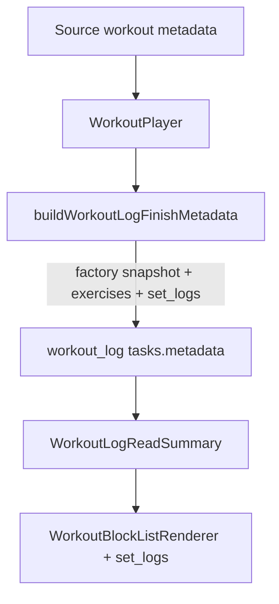

# Parametric Workout Blocks — Step 8 (Post-Workout Save & Rich History)

**Status:** **Complete** — M8.1–M8.3 shipped (Parametric Workout Blocks epic closed).  
**Prerequisites:** [parametric-step7-plan.md](./parametric-step7-plan.md) (**M7.1–M7.4 shipped** — block-aware player, interval shells, audio, wake lock) · [parametric-step6-plan.md](./parametric-step6-plan.md) (grid fidelity) · [parametric-step5-plan.md](./parametric-step5-plan.md) (block edit/Apply) · [parametric-step4-m4-plan.md](./parametric-step4-m4-plan.md) (log read UI)

**Related:** [Workout UI landscape audit](./README.md) · [parametric-step1-2-plan.md](./parametric-step1-2-plan.md) (metadata contract) · [live-video-timers-audit.md](../architecture/live-video-timers-audit.md) (`block_snapshot` on live AMRAP — separate product surface)

---

## Executive summary

Step 7 made **execution** block-aware: Tabata / AMRAP / EMOM shells, correct log row counts, and Coach `live_set_counts` alignment. Step 8 closed the **persistence loop**: when the athlete taps **Finish Workout**, the completed `workout_log` task retains the same **parametric structure** (`block_format`, `format_params`, section names) as the source prescription, while still storing **per-set performance** (`set_logs`) for analytics and history.

**Shipped outcome:** `buildWorkoutLogFinishMetadata` snapshots `ai_workout_factory` on finish (M8.2). Task Modal and Workout Viewer pass full metadata into `WorkoutLogReadSummary`, which overlays `set_logs` onto block headers via `globalFlatIndex` (M8.3).



**Out of scope (this epic):**

- Live-video `amrap_sessions` / `workout_exercise_logs` relational telemetry (parallel paths; optional future sync)
- Trainer Hub tables `public.workout_logs` / `user_workout_logs` (legacy JSON `exercises`; not Kanban `workout_log` items)
- Re-running interval timer shells in **read-only** history (static prescription + performance only)
- Coach prompt / `execution_patch` schema changes
- Block-aware **edit** of completed logs (remains flat editor in viewer edit mode unless a later step extends M5)

---

## Schema audit (exploration)

### Where completed workouts are stored

| Store                                            | Role in BuddyBubble                                                                 | JSON / structure                                               |
| ------------------------------------------------ | ----------------------------------------------------------------------------------- | -------------------------------------------------------------- |
| **`public.tasks`** (`item_type = 'workout_log'`) | **Primary** — Kanban cards, Task Modal, Workout Player finish, program history      | `metadata` **JSONB** (untyped `Json` in app)                   |
| **`public.workout_exercise_logs`**               | Per-set rows during **live** sessions (`session_id`, `task_id`, `exercise_name`, …) | Relational; **not** used by `WorkoutPlayer.handleFinish` today |
| **`public.workout_logs`**                        | Trainer Hub legacy log (effort, rating, `workout_name`)                             | No parametric blocks                                           |
| **`public.user_workout_logs`**                   | Program week completion (`exercises` JSONB)                                         | Flat program template logs                                     |

**Generated types:** [`src/types/database.generated.ts`](../../../src/types/database.generated.ts) (`tasks.metadata: Json`). There is no separate `src/types/supabase.ts` in this repo.

### `tasks.metadata` keys relevant to Step 8

| Key                                         | On source `workout`             | On in-progress `workout_log` draft   | On completed `workout_log` (shipped)        |
| ------------------------------------------- | ------------------------------- | ------------------------------------ | ------------------------------------------- |
| `ai_workout_factory.workout_set.workouts[]` | ✅ Prescription source of truth | ✅ **Snapshotted on draft autosave** | ✅ **Snapshotted at finish** (M8.2)         |
| `workout_log_schema_version`                | —                               | —                                    | ✅ `1` on player finish                     |
| `exercises[]`                               | ✅ Derived cache                | ❌ (draft uses `draft_logs` only)    | ✅ Flat list + `set_logs` on completed sets |
| `draft_logs`                                | —                               | ✅ Autosave matrix                   | ❌ Removed at finish                        |
| `source_task_id`                            | —                               | ✅                                   | ✅                                          |
| `duration_min`                              | optional                        | —                                    | ✅                                          |
| `class_instance_id`                         | optional                        | optional                             | optional                                    |

**Conclusion (8.1):** No new table is required. `tasks.metadata` already accepts arbitrary JSON; persisting `ai_workout_factory` on finish is a **write-path** change, not a greenfield schema. Optional hardening: document a **`workout_log_schema_version`** integer for forward-compatible migrations inside JSON.

### RPC audit

There is **no** `finish_workout` RPC. Completion is:

- `supabase.from('tasks').update({ status: 'completed', metadata: finalMetadata })` (existing draft), or
- `supabase.from('tasks').insert({ item_type: 'workout_log', status: 'completed', metadata: finalMetadata })` (new log).

**Phase 8.1 default:** keep direct task writes; add RPC only if RLS, validation, or server-side snapshot normalization becomes necessary.

---

## Payload — `WorkoutPlayer.handleFinish` (shipped M8.2)

**File:** [`src/components/fitness/WorkoutPlayer.tsx`](../../../src/components/fitness/WorkoutPlayer.tsx) · [`build-workout-log-finish-metadata.ts`](../../../src/lib/workout-factory/build-workout-log-finish-metadata.ts)

`handleFinish` calls `buildWorkoutLogFinishMetadata`, which writes `workout_log_schema_version`, flat `exercises` + `set_logs`, and a deep-cloned `ai_workout_factory` when the source session is rich.

**In-progress draft autosave** uses [`buildWorkoutLogDraftMetadata`](../../../src/lib/workout-factory/build-workout-log-finish-metadata.ts) (`draft_logs` + deep-cloned `ai_workout_factory` when source is rich).

---

## History read path (shipped M8.3)

| Surface                                | Rich blocks | `set_logs` overlay                                                                 |
| -------------------------------------- | ----------- | ---------------------------------------------------------------------------------- |
| **Task Modal** `workout_log` Details   | ✅          | ✅ via full `taskMetadata` merge + `WorkoutLogReadSummary`                         |
| **Workout Viewer** `readVariant="log"` | ✅          | ✅ `readVariant === 'log'` routes to `WorkoutLogReadSummary` before `showRichRead` |
| **WorkoutLogReadSummary**              | ✅          | ✅ `setLogsByGlobalIndexFromMetadata` + `renderExercise`                           |
| **Analytics / Programs**               | N/A         | N/A                                                                                |

Overlay index order matches `WorkoutBlockListRenderer` main-block `globalFlatIndex` (same flattening as [`buildPlayerExerciseIndexLookup`](../../../src/lib/workout-factory/workout-player-exercise-index.ts)).

---

## Phase 8.1 — Schema & RPC

**Objective:** Confirm storage contract; add only what the write path cannot express in existing `tasks.metadata`.

| #   | Deliverable              | Default decision                                                                                |
| --- | ------------------------ | ----------------------------------------------------------------------------------------------- |
| 1   | **Migration**            | **None required** for MVP — store `ai_workout_factory` inside `tasks.metadata` on `workout_log` |
| 2   | **Optional version key** | `workout_log_schema_version: 1` on finished logs for future shape changes                       |
| 3   | **RPC**                  | **Defer** — direct task insert/update remains unless server validation is needed                |
| 4   | **Indexes**              | **Defer** GIN on `metadata->'ai_workout_factory'` unless analytics queries require it           |
| 5   | **Legacy tables**        | Document that `workout_logs` / `user_workout_logs` are **out of scope** for parametric parity   |

**Sub-plan required before code:** `parametric-step8-m8.1-plan.md` — finalize snapshot rules (clone vs merge), version field, and whether `source_task_id` should trigger a server-side copy helper.

---

## Phase 8.2 — Player finish payload

**Objective:** `handleFinish` persists factory snapshot + existing flat performance cache.

| #   | Task                                                                                    | File(s)                                                                                                                     |
| --- | --------------------------------------------------------------------------------------- | --------------------------------------------------------------------------------------------------------------------------- |
| 1   | Implement `buildWorkoutLogFinishMetadata`                                               | `src/lib/workout-factory/build-workout-log-finish-metadata.ts` + tests                                                      |
| 2   | Wire `handleFinish` to use builder                                                      | `WorkoutPlayer.tsx`                                                                                                         |
| 3   | Preserve `finalizeWorkoutMetadataForSave` semantics for manual Task Modal saves on logs | `item-metadata.ts` / `sync-workout-metadata.ts` (ensure log saves do not strip factory when flat matches derived)           |
| 4   | Draft autosave (optional stretch)                                                       | Copy factory into in-progress draft metadata so mid-session recovery shows structure — **separate sub-plan** if scope creep |

**Finish metadata shape (target):**

```json
{
  "workout_log_schema_version": 1,
  "source_task_id": "uuid",
  "duration_min": 38,
  "ai_workout_factory": { "workout_set": { "workouts": ["...prescription snapshot..."] } },
  "exercises": [
    {
      "name": "Goblet Squat",
      "sets": 8,
      "set_logs": [{ "set": 1, "weight": 53, "reps": 10, "done": true }]
    }
  ]
}
```

**Sub-plan required before code:** `parametric-step8-m8.2-plan.md` — AMRAP row mismatch policy, draft autosave scope, and test matrix (Tabata / EMOM / AMRAP / straight_sets / flat-only source).

---

## Phase 8.3 — History read parity

**Objective:** Completed logs show **block headers + subtitles + logged sets** on the correct exercises.

| #   | Task                                               | File(s)                                                                                                                                                                     |
| --- | -------------------------------------------------- | --------------------------------------------------------------------------------------------------------------------------------------------------------------------------- |
| 1   | Pass **full** task metadata into log read surfaces | `TaskModalWorkoutFields.tsx` (merge `metadata` from parent, not only `workoutExercises` state)                                                                              |
| 2   | Rich log overlay                                   | `WorkoutLogReadSummary.tsx` — when `showRich`, supply `renderExercise` (or shared helper) mapping `set_logs` via `buildPlayerExerciseIndexLookup`                           |
| 3   | Workout Viewer log variant                         | `workout-viewer-dialog.tsx` — for `readVariant="log"`, prefer `WorkoutLogReadSummary` when `set_logs` exist **even if** factory present (fix `showRichRead` precedence bug) |
| 4   | Tests                                              | Extend `WorkoutLogReadSummary.test.tsx` — rich Tabata metadata + `set_logs` on flat exercises → expect block header **and** set lines                                       |
| 5   | Docs                                               | Update [parametric-step4-m4-plan.md](./parametric-step4-m4-plan.md) “future factory” note to point at Step 8                                                                |

**Sub-plan:** [parametric-step8-m8.3-plan.md](./parametric-step8-m8.3-plan.md) — **shipped** (Task Modal + Viewer read parity, `set_logs` overlay on rich blocks).

---

## Execution protocol

Per Steps 5–7:

1. **Do not implement** 8.1 / 8.2 / 8.3 code in the master PR without an approved milestone sub-plan (`parametric-step8-m8.x-plan.md`).
2. **Order:** **M8.1** (contract) → **M8.2** (finish write) → **M8.3** (read parity). M8.2 can ship before M8.3 only if QA accepts temporarily rich-less UI for new logs (not recommended).
3. **Verification gate:**

```bash
pnpm exec vitest run \
  src/lib/workout-factory/build-workout-log-finish-metadata.test.ts \
  src/components/fitness/workout-block-renderer/WorkoutLogReadSummary.test.tsx

pnpm run check
```

4. **Manual QA:** Finish a Tabata workout from a rich source card → open `workout_log` in Task Modal and Workout Viewer → confirm block subtitle (e.g. “8 Rounds (20/10s)”) **and** per-set log lines.

---

## Remaining limitations (post–Step 8)

1. **Launch `sourceTaskId` on in-progress log cards** — Kanban/Task Modal may pass the log task id instead of `metadata.source_task_id` for draft recovery (follow-up).
2. **No finish RPC** — Validation and snapshot normalization are client-side only.
3. **Parallel legacy stores** — `workout_logs`, `user_workout_logs`, and `workout_exercise_logs` do not participate in the Kanban `workout_log` metadata contract.
4. **Flat cache still required** — `metadata.exercises` + `set_logs` remain the performance layer; factory is prescription snapshot, not a replacement.
5. **Manual Task Modal save** — **Fixed:** `workout_log` saves use `passThroughRichWorkoutLogMetadata` (factory snapshot + `set_logs` preserved). Workout Viewer flat Apply on logs may still degrade in-memory state before save (separate follow-up).
6. **AMRAP index drift** — Extra logged rounds live only in flat `exercises`; overlay may diverge if flat order/count disagrees with factory-derived indices.

---

## Milestone table

| Milestone | Theme                             | Sub-plan doc                                                     | Ship criteria                                                     |
| --------- | --------------------------------- | ---------------------------------------------------------------- | ----------------------------------------------------------------- |
| **M8.1**  | Storage contract & snapshot rules | `parametric-step8-m8.1-plan.md`                                  | Written contract; migration decision recorded                     |
| **M8.2**  | Finish payload                    | [parametric-step8-m8.2-plan.md](./parametric-step8-m8.2-plan.md) | **Shipped** — new logs persist `ai_workout_factory` + tests green |
| **M8.3**  | History read parity               | [parametric-step8-m8.3-plan.md](./parametric-step8-m8.3-plan.md) | **Shipped** — Task Modal + Viewer show blocks **with** `set_logs` |

---

## Cross-links

| Doc                                                              | Status                                   |
| ---------------------------------------------------------------- | ---------------------------------------- |
| [parametric-step7-plan.md](./parametric-step7-plan.md)           | Step 8 out-of-scope note can be retired  |
| [README.md](./README.md)                                         | Landscape updated — finish/history fixed |
| [parametric-step6-plan.md](./parametric-step6-plan.md)           | Step 8 follow-up shipped                 |
| [parametric-step8-m8.2-plan.md](./parametric-step8-m8.2-plan.md) | Finish payload                           |
| [parametric-step8-m8.3-plan.md](./parametric-step8-m8.3-plan.md) | History read parity                      |
