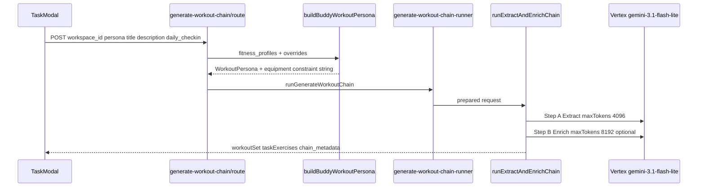
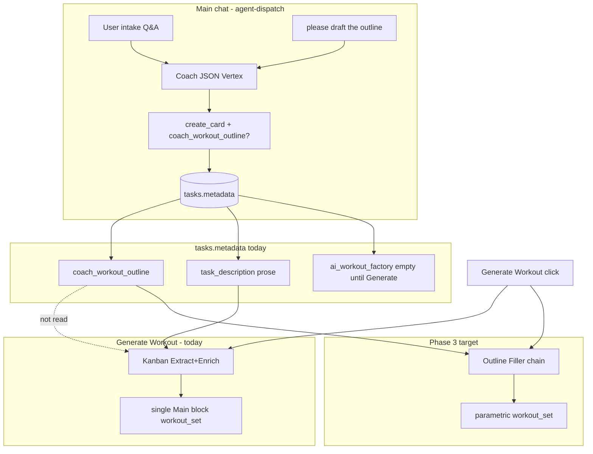
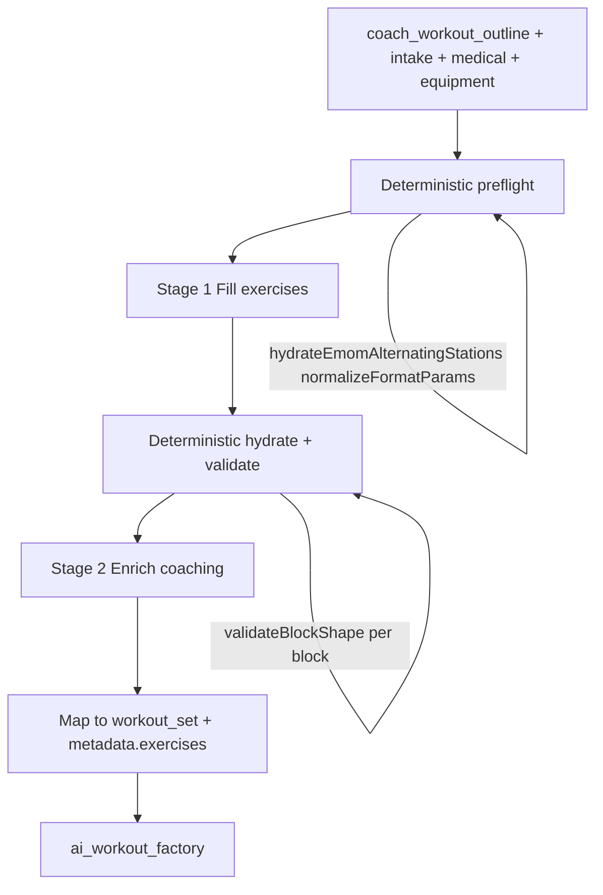

# Vertex “Generate Workout” factory — audit & Phase 3 outline filler design

**Mode:** Research audit (no implementation in this doc).  
**Date:** 2026-05-22  
**Context:** Phase 2 persists `tasks.metadata.coach_workout_outline` from main-bubble Coach. Phase 3 must bridge that outline to `metadata.ai_workout_factory.workout_set` when the user clicks **Generate Workout** — without flattening parametric blocks.

**Related:** [Apex Architect handoff audit](./apex-architect-handoff-audit.md) · [Workout UI landscape](./README.md) · [Parametric blocks blueprint](../../refactor/parametric-workout-blocks/README.md) · [Coach ↔ Vertex handoff (legacy doc)](../../coach-vertex-workout-handoff-assessment.md)

---

## Executive summary

| Layer                                                        | What runs today                                                                              | Failure mode for Apex path                                                                                              |
| ------------------------------------------------------------ | -------------------------------------------------------------------------------------------- | ----------------------------------------------------------------------------------------------------------------------- |
| **Main chat Coach** (`agent-dispatch`)                       | Apex persona + draft-intent blueprint library + `create_card` + `coach_workout_outline` JSON | **`finish_reason: MAX_TOKENS`** → `error_kind: truncated` → safe reply (“technical hiccup”). **Not** a factory timeout. |
| **Generate Workout** (`POST /api/ai/generate-workout-chain`) | **Kanban Extract → Enrich** only                                                             | Ignores `coach_workout_outline`; rebuilds from title/description prose → **single flat `Main` block**                   |
| **Legacy 4-stage factory**                                   | **Not invoked** — types + UI strings remain                                                  | N/A                                                                                                                     |

**Paradigm shift (target):**

- **Chat Coach = Architect** — structural outline only (`coach_workout_outline`: `block_format`, `format_params`, block names; minimal exercise placeholders).
- **Vertex factory = Filler** — hydrate exercises, loads, coaching copy into the existing parametric `workout_set` tree the Player already reads.

**Critical distinction:** The 12,288-token ceiling that failed your “please draft the outline” turn lives on **Coach JSON dispatch**, not on Generate Workout. The factory uses separate Vertex calls with `maxTokens: 4096` (extract) and `8192` (enrich) and was **never called** in that failure transcript.

---

## 1. Proof: your failure was Chat, not Factory

From production logs (`request_id: c3b46b62`, message “Nope, please draft the outline.”):

| Signal                      | Value                                                                      | Interpretation                                                                                                   |
| --------------------------- | -------------------------------------------------------------------------- | ---------------------------------------------------------------------------------------------------------------- |
| Handler                     | `agent-dispatch` / Coach strategy                                          | Main bubble chat webhook                                                                                         |
| `llm_timeout_configured_ms` | 75000                                                                      | Clock alignment **working**                                                                                      |
| `llm_budget_ms`             | 62553                                                                      | No ~43s clip                                                                                                     |
| `latency_ms`                | 52602                                                                      | Completed inside budget                                                                                          |
| `finish_reason`             | **`MAX_TOKENS`**                                                           | Output token cap hit                                                                                             |
| `token_out`                 | **11967**                                                                  | ~97% of `COACH_MAX_OUTPUT_TOKENS` (12288)                                                                        |
| `error_kind`                | **`truncated`**                                                            | Handler rejects incomplete JSON ([`handler.ts`](../../../supabase/functions/agent-dispatch/handler.ts) L355–360) |
| Partial JSON                | Cut mid `"Warm-up (5 min dynamic prep wor"` inside `coach_workout_outline` | Verbosity problem, not wall-clock                                                                                |

The factory route (`/api/ai/generate-workout-chain`) is only reached after intake + **Generate Workout** on the card ([`useTaskWorkoutAi.ts`](../../../src/components/modals/task-modal/hooks/useTaskWorkoutAi.ts)). That button was not part of this failure.

**Why constraining Chat verbosity still matters:** A parametric outline does not need ~12k tokens. The model over-generated prose (`task_description`, `coach_task_notes`, per-exercise `coach_notes`, duplicated warm-up/cool-down narrative) in the same JSON blob as `coach_workout_outline`. Phase 2 contract should keep the **architect turn slim**; the factory should own exercise detail and coaching depth.

---

## 2. Legacy 4-stage pipeline (design intent, currently unused)

### 2.1 Where it lives in the repo

| Artifact                                                              | Status                                                                                                                                                                                          |
| --------------------------------------------------------------------- | ----------------------------------------------------------------------------------------------------------------------------------------------------------------------------------------------- |
| Type definitions                                                      | [`src/lib/workout-factory/types/ai-program.ts`](../../../src/lib/workout-factory/types/ai-program.ts) (`ArchitectBlueprint`, `PatternSkeleton`, `ExerciseSelection`, `PromptChainMetadata`)     |
| Workout-scoped variants                                               | [`src/lib/workout-factory/types/ai-workout.ts`](../../../src/lib/workout-factory/types/ai-workout.ts) (`WorkoutArchitectBlueprint`, `WorkoutChainMetadataLegacy`)                               |
| Request hooks                                                         | [`prepare-workout-chain-request.ts`](../../../src/lib/workout-factory/prepare-workout-chain-request.ts) accepts `architectBlueprint`, `step1UserPromptOverride` — **passed through but unused** |
| Prompt modules (`step1-workout-architect.ts`, `step3-coach.ts`, etc.) | **Removed** from tree; referenced only in outdated docs ([`coach-vertex-workout-handoff-assessment.md`](../../coach-vertex-workout-handoff-assessment.md))                                      |
| Runner                                                                | [`generate-workout-chain-runner.ts`](../../../src/lib/workout-factory/generate-workout-chain-runner.ts) — **only** calls Kanban extract+enrich                                                  |
| UI copy                                                               | [`api-client.ts`](../../../src/lib/workout-factory/api-client.ts) `WORKOUT_FACTORY_CHAIN_MESSAGES` still says “Step 1/4 … Step 4/4” — **misleading** vs actual pipeline                         |

Saved workouts may still carry `chain_metadata.pipeline: 'legacy_four_step'` for historical rows ([`WorkoutChainMetadataLegacy`](../../../src/lib/workout-factory/types/ai-workout.ts)).

### 2.2 What each legacy stage was designed to do


| Stage                   | Type (legacy)                                      | Designed responsibility                                                                                              |
| ----------------------- | -------------------------------------------------- | -------------------------------------------------------------------------------------------------------------------- |
| **1 — Architect**       | `ArchitectBlueprint` / `WorkoutArchitectBlueprint` | Session structure: split, duration, progression protocol, volume landmarks, rationale — **before** picking exercises |
| **2 — Biomechanist**    | `PatternSkeleton`                                  | Movement-pattern balance per day (horizontal push, knee dominant, etc.) — **structural** skeleton                    |
| **3 — Equipment Coach** | `ExerciseSelection[]`                              | Map patterns → concrete exercise names constrained by **available equipment**                                        |
| **4 — Mathematician**   | `WorkoutInSet[]`                                   | Sets, reps, RPE, rest, work intervals — **numeric prescription**                                                     |

For **multi-week programs**, the same pattern appears in `ai-program.ts` with `BuildPhaseRequest` / `chain_metadata.step1_architect … step3_coach`. The **single-session Kanban button** replaced this with a one-shot “read the brief” extractor.

### 2.3 Why it was retired for the Task Modal button

The Kanban path optimizes for **Coach-authored title + description** as the sole brief ([`extract-workout-from-brief.ts`](../../../src/lib/workout-factory/prompt-chain/extract-workout-from-brief.ts)): one Vertex call designs or extracts a flat exercise list; a second call adds biomechanical coaching. Fewer round trips, simpler ops — but it **re-architects from prose** every time instead of honoring a pre-agreed parametric outline.

---

## 3. Active pipeline: Kanban Extract → Enrich

### 3.1 Entry points



**Key files:**

| Step                 | File                                                                                                                                                                                                                             | Role                                                                                                                                |
| -------------------- | -------------------------------------------------------------------------------------------------------------------------------------------------------------------------------------------------------------------------------- | ----------------------------------------------------------------------------------------------------------------------------------- |
| Button / client      | [`useTaskWorkoutAi.ts`](../../../src/components/modals/task-modal/hooks/useTaskWorkoutAi.ts)                                                                                                                                     | Sends title, description, intake as `daily_checkin`; sets `workout_brief_authoritative: true` when both title and description exist |
| API                  | [`route.ts`](../../../src/app/api/ai/generate-workout-chain/route.ts)                                                                                                                                                            | Auth, load `fitness_profiles`, `buildBuddyWorkoutPersona`, delegate runner                                                          |
| Runner               | [`generate-workout-chain-runner.ts`](../../../src/lib/workout-factory/generate-workout-chain-runner.ts)                                                                                                                          | **Only** `runExtractAndEnrichChain`                                                                                                 |
| Vertex orchestration | [`generate-workout-kanban-extract-runner.ts`](../../../src/lib/workout-factory/generate-workout-kanban-extract-runner.ts)                                                                                                        | Extract → dictionary split → Enrich → merge → `normalizeWorkoutSet`                                                                 |
| Prompts              | [`extract-workout-from-brief.ts`](../../../src/lib/workout-factory/prompt-chain/extract-workout-from-brief.ts), [`enrich-workout-biomechanics.ts`](../../../src/lib/workout-factory/prompt-chain/enrich-workout-biomechanics.ts) | Step A/B instructions                                                                                                               |
| Assembly             | [`map-kanban-extract-to-workout.ts`](../../../src/lib/workout-factory/map-kanban-extract-to-workout.ts)                                                                                                                          | **Flattens** into `WorkoutInSet`                                                                                                    |

### 3.2 Inputs today (what Generate Workout actually sees)

From [`useTaskWorkoutAi.handleAiGenerateWorkout`](../../../src/components/modals/task-modal/hooks/useTaskWorkoutAi.ts):

- `persona.title` / `persona.description` — from **task card** (Coach prose)
- `daily_checkin` — intake wizard (readiness, sleep, equipment, duration, soreness, intensity)
- `workout_brief_authoritative: true` when title + description both set

**Not forwarded:**

- `tasks.metadata.coach_workout_outline` — **zero references** in `src/lib/workout-factory/`
- Main chat history
- Block catalog tokens (`:main/emom/alternating-combo`)

[`buildBuddyWorkoutPersona`](../../../src/lib/workout-factory/buddy-persona.ts) appends intake JSON into `description` and, when brief-authoritative, replaces profile equipment with a constraint sentence (“use only equipment implied in the brief”).

### 3.3 Step A — Extract (design + flatten intent)

- **Model:** `google/gemini-3.1-flash-lite-preview` ([`generate-workout-kanban-extract-runner.ts`](../../../src/lib/workout-factory/generate-workout-kanban-extract-runner.ts) L103)
- **Output schema:** flat `exercises[]` with `section: warmup | main | cooldown` only ([`KanbanExtractBriefOutput`](../../../src/lib/workout-factory/types/kanban-extract-types.ts))
- **Policy:** sparse brief → **invent** a full session; detailed brief → extract faithfully
- **Parametric awareness:** prompt mentions AMRAP/EMOM/Tabata language for `work_seconds` / `reps`, but **no `block_format` or `format_params` in schema**

### 3.4 Step B — Enrich

- Adds `detailed_instructions`, `biomechanical_cues`, `injury_prevention_tips` per exercise
- **Must not** change prescription fields (sets, reps, work_seconds, order)
- Skipped when all exercises hit `exercise_dictionary` cache

### 3.5 Assembly — why parametric data is destroyed

[`buildWorkoutInSetFromKanbanExtract`](../../../src/lib/workout-factory/map-kanban-extract-to-workout.ts) L84–147:

```ts
// All "main" section rows → ONE block:
exerciseBlocks: [{ order: 1, name: 'Main', exercises: mainExercises }],
```

Effects:

| Source outline (Phase 2 target)                           | Kanban output today                                |
| --------------------------------------------------------- | -------------------------------------------------- |
| `:main/emom/alternating-combo` block with `format_params` | Lost — becomes anonymous `Main` straight list      |
| Separate Finisher / Tabata block                          | Merged into flat `main` exercises or mis-sectioned |
| `alternating_stations` / EMOM minute matrix               | Never created — no hydrator call in factory path   |
| Warm-up as instruction block                              | `warmupBlocks` with instruction lines only (OK)    |

The parametric engine ([`README.md`](./README.md)) expects `exerciseBlocks[].blockFormat` + `formatParams` on **`ai_workout_factory.workout_set`**. Kanban assembly never sets those fields ([`workout-contract.ts`](../../../src/lib/workout-factory/types/workout-contract.ts) supports them; mapper does not).

### 3.6 Persistence after Generate

[`useTaskWorkoutAi`](../../../src/components/modals/task-modal/hooks/useTaskWorkoutAi.ts) writes:

```ts
metadata.ai_workout_factory = {
  generated_at, model,
  workout_set: data.workoutSet,
  chain_metadata: { pipeline: 'kanban_extract_enrich', ... },
};
```

`coach_workout_outline` remains a **sibling** field on metadata ([`applyCoachWorkoutOutlineToTaskMetadata`](../../../src/lib/agents/_shared/workout-metadata/merge-coach-proposed-into-task-metadata.ts) explicitly does not touch factory). Nothing reconciles outline ↔ factory today.

---

## 4. End-to-end map: current vs target



---

## 5. Phase 3 proposal: Parametric Outline Filler

### 5.1 Design principles

1. **Do not re-architect in the factory** when `coach_workout_outline` exists — treat it as **immutable structure** (block count, names, `block_format`, `format_params`).
2. **Reuse proven pieces:** dictionary lookup, enrich coaching fields, `normalizeWorkoutSet`, `hydrateEmomAlternatingStations`, `validateBlockShape` (same deterministic boundary as Coach merge).
3. **Split concerns from Chat:** Chat stores **skeleton**; factory stores **executable** `ai_workout_factory`.
4. **Router, not rewrite:** Keep Kanban extract+enrich for cards **without** outline (legacy / manual cards).

### 5.2 Suggested pipeline: `runFillParametricOutlineChain`

Replace legacy 4-stage **roles** with two Vertex stages + deterministic post-process:



| Phase                | Owner                          | Input                                             | Output                                                                                                                                                                  |
| -------------------- | ------------------------------ | ------------------------------------------------- | ----------------------------------------------------------------------------------------------------------------------------------------------------------------------- |
| **Preflight (code)** | TypeScript                     | Raw outline blocks from metadata                  | Normalized blocks; EMOM matrices hydrated; invalid blocks dropped with logged reasons                                                                                   |
| **Stage 1 — Fill**   | Vertex                         | Outline JSON + intake + equipment list + injuries | Same block tree; each block gains `exercises[]` (names, sets/reps/work_seconds as appropriate); **must not** change `block_format` / `format_params`                    |
| **Post-fill (code)** | TypeScript                     | Stage 1 JSON                                      | `validateBlockShape`; dictionary split; optional pending-dictionary inserts                                                                                             |
| **Stage 2 — Enrich** | Vertex (adapt existing Step B) | Per-exercise coaching needs                       | Reuse [`enrich-workout-biomechanics.ts`](../../../src/lib/workout-factory/prompt-chain/enrich-workout-biomechanics.ts) pattern — coaching fields only                   |
| **Assemble (code)**  | New mapper                     | Validated blocks                                  | `WorkoutSetTemplate` with `exerciseBlocks[].blockFormat`, `formatParams`, `exercises`; warm-up/cool-down instruction blocks; `deriveFlatExercisesFromMetadata` for grid |

**Legacy stage mapping (conceptual):**

| Old stage                      | Phase 3 equivalent                                                   |
| ------------------------------ | -------------------------------------------------------------------- |
| Architect                      | **Chat** (`coach_workout_outline`) — already done pre-Generate       |
| Biomechanist + Equipment Coach | **Stage 1 Fill** — pick exercises per block under format constraints |
| Mathematician                  | **Stage 1 Fill** (prescription numbers) + deterministic validators   |
| Kanban Enrich                  | **Stage 2 Enrich** — prose coaching only                             |

### 5.3 Stage 1 prompt contract (sketch)

**System:** “You are filling a pre-approved workout outline. Do not add/remove/reorder blocks. Do not change `block_format` or `format_params`. Output only exercises and prescriptions inside each block.”

**User payload sections:**

1. `=== OUTLINE (READ-ONLY STRUCTURE) ===` — JSON from `coach_workout_outline`
2. `=== INTAKE (AUTHORITATIVE TODAY) ===` — readiness, sleep, duration, soreness, intensity, equipment
3. `=== ATHLETE SAFETY ===` — injuries/conditions from profile
4. `=== RESOLVED EQUIPMENT ===` — same authoritative list pattern as Kanban extract

**Output schema:** mirror Coach block item shape but **without** chat fields (`reply_content`, `coach_task_notes`, etc.) — blocks array only. Target `maxTokens: 8192` (factory), not 12288 (chat).

**Model:** same family as Kanban (`gemini-3.1-flash-lite-preview`) or flash full model if fill quality insufficient — decision in implementation spike.

### 5.4 Runner integration

[`generate-workout-chain-runner.ts`](../../../src/lib/workout-factory/generate-workout-chain-runner.ts):

```ts
// Pseudocode — not implemented
if (prepared.coachWorkoutOutline?.length) {
  return runFillParametricOutlineChain(prepared, creds, ...);
}
return runExtractAndEnrichChain(prepared, creds, ...);
```

**API / client changes:**

- [`useTaskWorkoutAi.ts`](../../../src/components/modals/task-modal/hooks/useTaskWorkoutAi.ts) — pass `coach_workout_outline` from parsed task metadata (or server loads task by id in a hardened route).
- [`prepare-workout-chain-request.ts`](../../../src/lib/workout-factory/prepare-workout-chain-request.ts) — add typed `coachWorkoutOutline?: ParametricBlock[]`.
- New `chain_metadata.pipeline: 'parametric_outline_fill'`.

### 5.5 New assembler (replace Kanban flattening for outline path)

Create e.g. `map-outline-fill-to-workout.ts`:

- Map each outline block → `ExerciseBlock` with `blockFormat` / `formatParams` (camelCase per [`workout-contract.ts`](../../../src/lib/workout-factory/types/workout-contract.ts))
- Instruction-only blocks → `warmupBlocks` / `cooldownBlocks` / `finisherBlocks` by name heuristics or explicit `section_role` if added to outline schema later
- Call existing [`mergeKanbanExtractEnrichToTaskExercises`](../../../src/lib/workout-factory/map-kanban-extract-to-workout.ts) **logic** for flat cache derivation, or `deriveFlatExercisesFromMetadata` after save

### 5.6 Chat-side companion fix (same epic, separate from factory)

To prevent recurrence of `MAX_TOKENS` on draft turn **before** Phase 3 ships:

| Chat turn (`create_card`)                                  | Factory turn (Generate)                        |
| ---------------------------------------------------------- | ---------------------------------------------- |
| Block names + `block_format` + `format_params`             | Full `exercises[]` with sets/reps/work_seconds |
| Optional exercise **names only** (placeholders)            | Dictionary-linked detail, form cues            |
| Short `task_description` summary                           | Enrich stage coaching prose                    |
| `coach_task_notes` brief or defer to seed comment template | N/A                                            |

Enforce via Coach schema descriptions + server guard: reject or strip verbose fields on outline turn; cap array sizes (e.g. max 4 blocks, max 6 exercises per block on create).

---

## 6. Cascading failure prevention checklist

| Risk                                  | Mitigation                                                                                                                     |
| ------------------------------------- | ------------------------------------------------------------------------------------------------------------------------------ |
| Chat JSON too large                   | Slim architect contract; never ask for factory-depth coaching on `create_card`                                                 |
| Clock timeouts on chat                | Already aligned (90s client / 75s edge / 63s vertex budget) — **orthogonal** to truncation                                     |
| Factory ignores outline               | Phase 3 router + pass outline in API                                                                                           |
| Flattened `Main` block                | New mapper; never call `buildWorkoutInSetFromKanbanExtract` for outline path                                                   |
| EMOM matrix wrong                     | Server-side `hydrateEmomAlternatingStations` in factory preflight (same as Coach merge)                                        |
| Outline / factory drift               | After fill, optional: clear or version `coach_workout_outline`; store `outline_source_message_id` in `chain_metadata`          |
| Misleading UI “Step 1/4”              | Update `WORKOUT_FACTORY_CHAIN_MESSAGES` to reflect 2-stage fill+enrich or outline vs kanban                                    |
| Stale docs referencing 4-step prompts | Mark [`coach-vertex-workout-handoff-assessment.md`](../../coach-vertex-workout-handoff-assessment.md) superseded by this audit |

---

## 7. Implementation file checklist (Phase 3)

| File                                                                                                    | Change                                          |
| ------------------------------------------------------------------------------------------------------- | ----------------------------------------------- |
| [`generate-workout-chain-runner.ts`](../../../src/lib/workout-factory/generate-workout-chain-runner.ts) | Route on outline presence                       |
| [`prepare-workout-chain-request.ts`](../../../src/lib/workout-factory/prepare-workout-chain-request.ts) | Accept `coachWorkoutOutline`                    |
| [`route.ts`](../../../src/app/api/ai/generate-workout-chain/route.ts)                                   | Load outline from task metadata or request body |
| [`useTaskWorkoutAi.ts`](../../../src/components/modals/task-modal/hooks/useTaskWorkoutAi.ts)            | Forward outline                                 |
| **New** `generate-workout-outline-fill-runner.ts`                                                       | Stage 1 + post-process orchestration            |
| **New** `prompt-chain/fill-parametric-outline.ts`                                                       | Stage 1 prompt + validator                      |
| **New** `map-outline-fill-to-workout.ts`                                                                | Parametric `workout_set` assembly               |
| [`types/ai-workout.ts`](../../../src/lib/workout-factory/types/ai-workout.ts)                           | `WorkoutChainMetadataOutlineFill` union member  |
| [`api-client.ts`](../../../src/lib/workout-factory/api-client.ts)                                       | Progress strings                                |
| Coach prompts / guards (parallel)                                                                       | Slim `create_card` outline payload              |

---

## 8. Open questions for product / spike

1. **Generate without outline** — If user skips chat outline (legacy card), keep Kanban path unchanged?
2. **Outline edits after Generate** — Rail merge only, or re-run filler on “Regenerate”?
3. **Block section routing** — Infer warm-up/cool-down from block `name` vs add explicit `section_role` to outline schema?
4. **Model choice for Fill** — Is flash-lite sufficient for kettlebell EMOM combo fill, or promote to gemini-2.5-flash for factory only?
5. **Success criteria** — Generated `workout_set` round-trips through `WorkoutPlayer` EMOM timer + alternating highlight for `:main/emom/alternating-combo` acceptance test.

---

## Appendix A — Quick reference: two Vertex surfaces

| Surface        | Entry                                 | Model (today)                   | Max output                        | Produces                                                |
| -------------- | ------------------------------------- | ------------------------------- | --------------------------------- | ------------------------------------------------------- |
| **Chat Coach** | DB webhook → `agent-dispatch`         | `gemini-2.5-flash`              | 12288 (`COACH_MAX_OUTPUT_TOKENS`) | Agent message + optional card + `coach_workout_outline` |
| **Factory**    | `POST /api/ai/generate-workout-chain` | `gemini-3.1-flash-lite-preview` | 4096 + 8192                       | `ai_workout_factory.workout_set`                        |

These are **independent** systems today. Phase 3 connects them via `coach_workout_outline` → outline filler; Chat slimming prevents architect-turn truncation.
