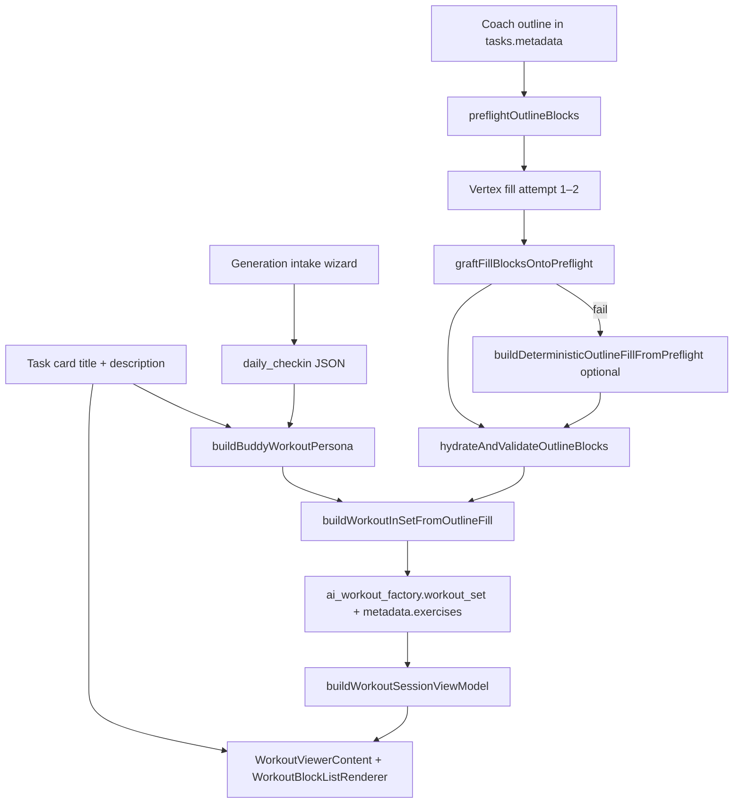

# Workout generation — content model, parsing pipeline, and viewer redundancy

_Scope: parametric outline-fill factory (`POST /api/ai/generate-workout-chain`) from task-card generation through what the athlete sees in **WorkoutViewerContent**._

_Related: [workout-viewer-three-narrative-layers.md](./workout-viewer-three-narrative-layers.md) · [workout-generation-422-assessment.md](./workout-generation-422-assessment.md) · [workout-viewer-dialog.md](../workout-viewer-dialog.md)_

---

## 1. What you are looking at (example walkthrough)

Using the climbing circuit example:

| UI region                     | Example text                                       | Primary source                                                            |
| ----------------------------- | -------------------------------------------------- | ------------------------------------------------------------------------- |
| **Card header** (top)         | Title + long paragraph                             | `tasks.title` / `tasks.description`                                       |
| **Workout plan → Difficulty** | `Difficulty · intermediate`                        | `ai_workout_factory.workout_set.difficulty`                               |
| **Workout plan → muted box**  | Same paragraph again                               | `workout_set.description` (= persona description at assembly time)        |
| **Workout plan → Session**    | Title + same paragraph **again**                   | `workout_set.workouts[0].title` / `.description`                          |
| **Main — Circuit**            | Block name + `Circuit · 4 Rounds`                  | Outline block `name` + `formatBlockSubtitle(circuit, format_params)`      |
| **A1 … A3 rows**              | Exercise name + `1× · 12 per side reps · Rest 30s` | Factory `Exercise` fields via `formatExercisePrescriptionLineFromFactory` |
| **Finisher / Tabata**         | `Tabata · 8 Rounds (20/10s)` + per-exercise meta   | Block subtitle + Tabata hydration on exercises                            |

The **user-facing brief** (climbing, flagging, bodyweight, 45 min) is correct content. The problem is that it is **stored once, then copied into multiple layers**, and **macro-planning intake** is appended as raw JSON inside the athlete-facing description.

---

## 2. End-to-end pipeline (generation → display)



**Key idea:** Vertex only fills **exercise prescriptions** (sets/reps/work/rest). The server owns block **names**, **formats**, and **format_params** via grafting. Title and description are **not** generated by fill—they are copied from the persona built at request time.

---

## 3. Stage-by-stage parsing

### 3.1 Task card inputs

| Field                   | Where set                     | Used for                                                              |
| ----------------------- | ----------------------------- | --------------------------------------------------------------------- |
| `tasks.title`           | User / Coach                  | Persona title → session title → suggested card title                  |
| `tasks.description`     | User / Coach                  | Persona description → session + set description                       |
| Intake wizard           | `useWorkoutIntakeWizardState` | Serialized to `daily_checkin` on generate                             |
| `coach_workout_outline` | Apex Architect / Coach        | Authoritative block structure (names, formats, exercise placeholders) |

Client preflight (`preflightOutlineBlocks`) runs **before** POST; server runs the same normalization again at the API boundary.

### 3.2 Persona assembly (`buildBuddyWorkoutPersona`)

File: `src/lib/workout-factory/buddy-persona.ts`

```typescript
// When daily_checkin is present:
description = [description.trim(), `Macro planning context: ${JSON.stringify(dailyCheckIn)}`]
  .filter(Boolean)
  .join('\n\n');
```

This is the **root cause of the JSON blob** in the athlete-facing description:

```text
Macro planning context: {"duration_minutes":"Optimized for Goals","phase_intent":"standard_progression",...}
```

Intake fields (`duration_minutes`, `phase_intent`, `progression_trend`, `anchor_lift`) are meant for **Vertex context**, not for display. They are appended to `persona.description` as a single string.

### 3.3 Outline fill + graft

| Step              | Module                                | Output shape                                                                                  |
| ----------------- | ------------------------------------- | --------------------------------------------------------------------------------------------- |
| Preflight         | `outline-block-preflight.ts`          | Normalized blocks: `name`, `block_format`, `format_params`, `exercises[]` or `instructions[]` |
| Vertex fill       | `fill-parametric-outline.ts`          | Fill-only JSON: `{ blocks: [{ exercises: [...] }] }`                                          |
| Graft             | `graftFillBlocksOntoPreflight`        | Model exercises overlaid on preflight by block index; structure from server                   |
| Fallback (P3)     | `build-deterministic-outline-fill.ts` | Default sets/reps from format when Vertex fails                                               |
| Post-fill hydrate | `hydrateAndValidateOutlineBlocks`     | EMOM matrix, format param normalization, drop invalid rows                                    |

### 3.4 Factory assembly (`buildWorkoutInSetFromOutlineFill`)

File: `src/lib/workout-factory/map-outline-fill-to-workout.ts`

For each outline block:

1. **Instruction-only** (instructions present, no named exercises) → `warmupBlocks` / `finisherBlocks` / `cooldownBlocks` based on block name role.
2. **Exercise blocks** → `exerciseBlocks[]` with:
   - `name`, `blockFormat`, `formatParams`
   - `exercises[]` mapped via `mapOutlineExerciseToFactory` (name, sets, reps, work/rest/rounds)
3. **EMOM / Tabata hydration** — if timing lives in `format_params`, per-exercise `workSeconds` / `restSeconds` / `rounds` are derived server-side.

Session shell:

```typescript
title = persona.title?.trim() || 'Workout';
description = persona.description?.trim() || ''; // includes macro JSON if check-in was sent
```

### 3.5 Workout set wrapper (`assembleOutlineFillSuccess`)

File: `src/lib/workout-factory/generate-workout-outline-fill-runner.ts`

```typescript
workoutSet = {
  title: workoutInSet.title, // same as session
  description: workoutInSet.description, // same string as session
  difficulty: persona.experienceLevel,
  workouts: [workoutInSet], // session duplicates title + description
};
```

Persisted under `tasks.metadata.ai_workout_factory.workout_set`.

Flat cache: `metadata.exercises[]` is derived from the rich session via `outlineFillToTaskExercises` for legacy editors and the player index.

### 3.6 Read model (`buildWorkoutSessionViewModel`)

File: `src/lib/workout-factory/workout-session-view-model.ts`

Reads `ai_workout_factory.workout_set`, takes `workouts[0]` as the session, builds:

- `blocks[]` — warmup / main / finisher / cooldown sections
- `subtitle` per main block — `formatBlockSubtitle(blockFormat, formatParams)` (e.g. `Circuit · 4 Rounds`)
- `flatExercises[]` — denormalized list for player / flat editor

### 3.7 Viewer rendering (`WorkoutViewerContent`)

File: `src/components/fitness/workout-viewer-dialog.tsx`

**Layer A — Card header (`ViewReadHeader`)**

- `displayTitle` ← `tasks.title` (local draft)
- `displayDescription` ← `tasks.description` (local draft)

**Layer B — Workout plan (`WorkoutBlockListRenderer` chrome)**

Passed from viewer:

```typescript
chrome={{
  difficulty: sessionVm.workoutSet?.difficulty,
  setTitle: sessionVm.workoutSet?.title,
  setDescription: sessionVm.workoutSet?.description,
  sessionTitle: sessionVm.session?.title,
  sessionDescription: sessionVm.session?.description,
  cardTitle: displayTitle,
}}
```

File: `src/components/fitness/workout-block-renderer/WorkoutBlockListRenderer.tsx`

| Chrome field         | Shown when    | Typical result in example           |
| -------------------- | ------------- | ----------------------------------- |
| `difficulty`         | always if set | `Difficulty · intermediate`         |
| `setDescription`     | non-empty     | Full brief + macro JSON (duplicate) |
| `sessionTitle`       | non-empty     | Same title as card (duplicate)      |
| `sessionDescription` | non-empty     | Same brief + macro JSON (duplicate) |

`setTitle` is suppressed when it equals `cardTitle`; **descriptions are not deduplicated**.

**Layer C — Blocks and exercises**

- Block header: `name` + `subtitle` (format-aware, not redundant with description)
- Exercise row meta: `formatExercisePrescriptionLineFromFactory` joins sets, reps, rest, work, rounds with `·`

Example circuit row: `1× · 12 per side reps · Rest 30s`  
Example Tabata row: `1× · Rest 10s · 20s work · 8 rounds` (block-level rounds also appear in subtitle)

---

## 4. Redundancy map (your example)

| #   | Repeated content                      | Appears N times                                                            | Why                                                                                                                                       |
| --- | ------------------------------------- | -------------------------------------------------------------------------- | ----------------------------------------------------------------------------------------------------------------------------------------- |
| 1   | Climbing / bodyweight brief paragraph | **3×** (header, set box, session)                                          | Same string in `tasks.description`, `workout_set.description`, and `workouts[0].description`; viewer renders header + both factory layers |
| 2   | Title                                 | **2×** (header, session)                                                   | `setTitle` hidden when equal to card title; session title still shown                                                                     |
| 3   | Macro planning JSON suffix            | **3×**                                                                     | Appended in `buildBuddyWorkoutPersona` before assembly; copied into all description fields                                                |
| 4   | Difficulty                            | **1×**                                                                     | Only in chrome (not duplicated today)                                                                                                     |
| 5   | Circuit round count                   | **2×** (brief says "3-4 rounds", subtitle says "4 Rounds")                 | Brief is free text; subtitle is authoritative from `format_params.rounds`                                                                 |
| 6   | Tabata timing                         | **2×** (subtitle `8 Rounds (20/10s)`, exercise meta `20s work · 8 rounds`) | By design: block subtitle + per-exercise hydration for player timers                                                                      |

---

## 5. What is intentional vs accidental

| Behavior                                  | Verdict                                                                                     |
| ----------------------------------------- | ------------------------------------------------------------------------------------------- |
| Block subtitle from `format_params`       | **Intentional** — canonical prescription for parametric formats                             |
| Exercise meta line (sets/reps/rest/work)  | **Intentional** — player and log UX                                                         |
| `tasks.title` vs factory title            | **Mostly intentional** — card can diverge after edit; factory holds generation snapshot     |
| Same description in set + session         | **Accidental duplication** — assembly copies persona description to both levels identically |
| Macro JSON in `persona.description`       | **Accidental for display** — correct for LLM prompt, wrong layer for athlete-facing text    |
| Header + chrome both showing description  | **Accidental duplication** — viewer has no cross-layer dedupe                               |
| Brief "3-4 rounds" vs subtitle "4 Rounds" | **Content drift** — outline text vs structured params; not a parser bug                     |

---

## 6. Recommended deduplication strategies (future work)

These are **documentation targets**, not implemented in this doc.

### 6.1 Separate prompt context from display description

Keep macro intake on `daily_checkin` / structured metadata only. Do **not** append `Macro planning context: …` to `persona.description` when `workout_brief_authoritative` is true.

Alternative: append only inside the Vertex **user prompt** in `buildFillParametricOutlinePrompt`, not on the persisted session.

### 6.2 Single description surface in the viewer

In `WorkoutBlockListRenderer` chrome:

- If `setDescription === sessionDescription === cardDescription`, render **once** (header only).
- Or: hide `setDescription` / `sessionDescription` when they match `cardTitle`/`displayDescription` (mirror title dedupe).

### 6.3 Drop redundant session chrome when set mirrors session

Today `workout_set.workouts[0]` always duplicates set-level title/description. Options:

- Persist empty `session.description` when identical to set description, or
- Omit the **Session** chrome block when `sessionDescription === setDescription`.

### 6.4 Strip macro suffix on save

If macro JSON must remain in persona for re-generation, store it separately:

```typescript
metadata.generation_intake_context: WorkoutGenerationIntakeContext
```

and keep `tasks.description` as the human brief only.

### 6.5 Tabata / circuit meta line tuning

Optional presentation-only change: when block subtitle already states rounds/work/rest, suppress duplicate round/work fragments on the exercise meta line for time-domain formats (player still reads structured fields from metadata).

---

## 7. Quick reference — files by concern

| Concern                            | File                                                                               |
| ---------------------------------- | ---------------------------------------------------------------------------------- |
| Macro JSON appended to description | `src/lib/workout-factory/buddy-persona.ts`                                         |
| Intake → `daily_checkin`           | `src/lib/workout-factory/generation-intake-context.ts`, `useTaskWorkoutAi.ts`      |
| Outline preflight / graft          | `src/lib/workout-factory/outline-block-preflight.ts`                               |
| Fill validation                    | `src/lib/workout-factory/prompt-chain/fill-parametric-outline.ts`                  |
| Session assembly                   | `src/lib/workout-factory/map-outline-fill-to-workout.ts`                           |
| Set wrapper                        | `src/lib/workout-factory/generate-workout-outline-fill-runner.ts`                  |
| View model                         | `src/lib/workout-factory/workout-session-view-model.ts`                            |
| Viewer redundancy                  | `src/components/fitness/workout-viewer-dialog.tsx`, `WorkoutBlockListRenderer.tsx` |
| Block subtitles                    | `src/lib/workout-factory/format-block-subtitle.ts`                                 |
| Exercise meta lines                | `src/lib/workout-factory/format-exercise-prescription-line.ts`                     |

---

## 8. Verification checklist

After any deduplication change:

1. Generate a workout with intake wizard filled (anchor lift, phase intent).
2. Open Workout Viewer — brief should appear **once**; macro context should not appear as raw JSON to athletes.
3. Confirm `ai_workout_factory.workout_set` still has correct block subtitles and exercise prescriptions.
4. Run WorkoutPlayer on circuit + Tabata blocks — timers and meta lines still resolve.
5. Regenerate path still receives intake context (prompt or structured metadata, not lost).

```bash
npx vitest run \
  src/lib/workout-factory/buddy-persona.test.ts \
  src/lib/workout-factory/map-outline-fill-to-workout.test.ts \
  src/lib/workout-factory/workout-session-view-model.test.ts
```
