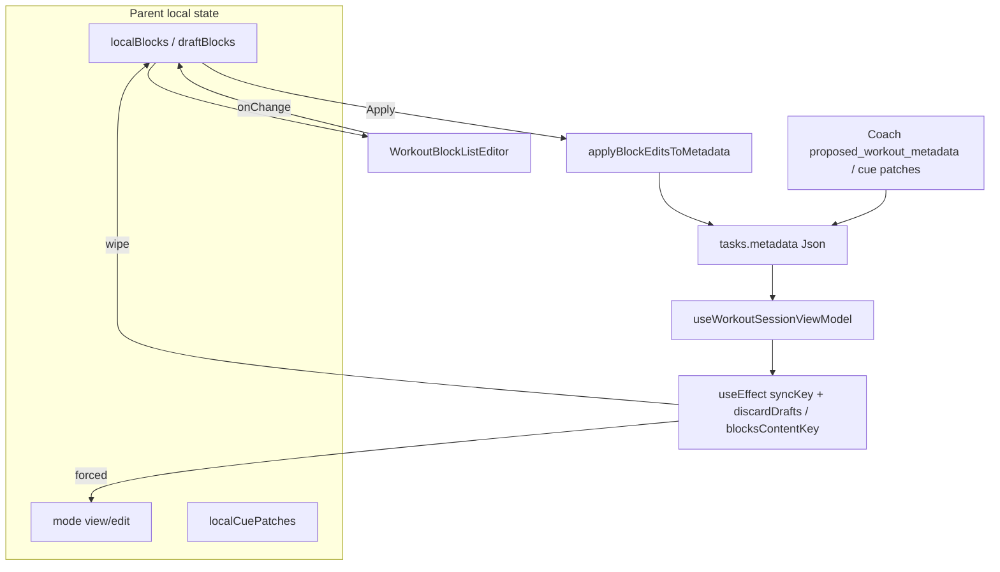
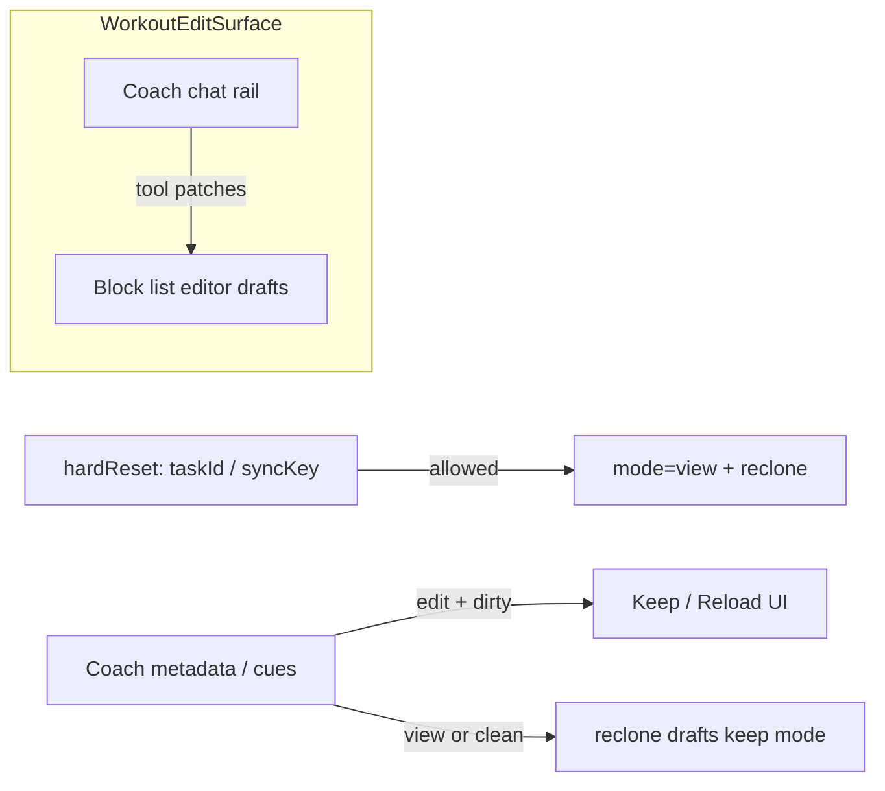

# Architectural assessment: Coach ↔ Workout block editor (direct editing)

**Date:** 2026-07-18  
**Branch intent:** `update/coach-direct-editing-in-edit`  
**Status:** Historical discovery assessment. Phase 3 v2 surgical patching is shipped; see the canonical [Coach implementation reference](../agents/coach/README.md#two-path-workout-editor-architecture).  
**Naming note:** There is no symbol named `WorkoutBlockEditor`. The rich canvas editor is **`WorkoutBlockListEditor`**. Parents own view/edit mode.

**Related docs:**

- [workout-viewer-ai-coach-cues-gap-analysis.md](./workout-viewer-ai-coach-cues-gap-analysis.md) — cues / Ask Coach (view mode)
- [workout-block-editor-structural-editing-plan.md](./workout-block-editor-structural-editing-plan.md) — structural edit (shipped)
- [workout-viewer-dialog.md](./workout-viewer-dialog.md)
- [docs/agents/coach/README.md](../agents/coach/README.md)

---

## Executive verdict

1. **The “click Coach → snaps back to view” bug is almost certainly not a focus/blur race.** There is no `onBlur` / `useOnClickOutside` / `pointer-down-outside` path that exits edit mode in the fitness editor stack.
2. **Mode is forced to view/preview by sync effects** that treat parent prop / metadata churn as “discard drafts and leave edit.” Coach chat and Ask Coach are high-probability triggers of that churn (`syncKey` bump, `metadata` updates, cue patches).
3. **Resolved in Phase 3 v2:** existing rich workouts use `structural_patch`, applied both server-side and to the live canvas draft. `proposed_workout_metadata` is creation-only and is physically absent from the rich-canvas schema.

---

## Task 1 — Discovery & gap analysis

### 1. State management

#### Edit vs view mode

| Host                                                                                                    | Mode state                                       | Enter                             | Exit / forced reset                                                               |
| ------------------------------------------------------------------------------------------------------- | ------------------------------------------------ | --------------------------------- | --------------------------------------------------------------------------------- |
| [`WorkoutViewerContent`](../../src/components/fitness/workout-viewer-dialog.tsx)                        | Local `useState<'view' \| 'edit'>('view')`       | View/Edit tab → `setMode('edit')` | Discard / View tab; **`useEffect([syncKey, discardDrafts])` → `setMode('view')`** |
| [`WorkoutBuilderGeneratedReview`](../../src/features/workout-builder/WorkoutBuilderGeneratedReview.tsx) | Local `useState<'preview' \| 'edit'>('preview')` | `enterEdit`                       | Cancel / Apply; **`useEffect([syncKey, blocksContentKey])` → `'preview'`**        |

- **Not Zustand.** No workout-editor store under `src/store/`.
- **Not a shared React context** for mode or drafts.
- **`WorkoutBlockListEditor` has no mode** — when mounted it is always editable (`blocks` + `onChange`).

#### Block data (drafts)

```
TaskModal / WorkoutBuilderShell
  metadata (Json) + workoutExercises
    → useWorkoutSessionViewModel(metadata) → sessionVm.blocks
    → parent clones into localBlocks / draftBlocks
    → WorkoutBlockListEditor({ blocks, onChange })
    → Apply → applyBlockEditsToMetadata → setMetadata
```

| Layer         | Type / location                                                                                | Role                                                             |
| ------------- | ---------------------------------------------------------------------------------------------- | ---------------------------------------------------------------- |
| Canvas draft  | `WorkoutSessionBlockView[]` local state in parent                                              | Immutable updates via helpers in `workout-block-editor-types.ts` |
| Persist model | `tasks.metadata` / `ai_workout_factory.workout_set`                                            | Source of truth after Apply / Coach merge                        |
| View model    | [`workout-session-view-model.ts`](../../src/lib/workout-factory/workout-session-view-model.ts) | Maps metadata → `WorkoutSessionBlockView`                        |
| Flat fallback | `WorkoutExercisesEditor` + `WorkoutExercise[]`                                                 | Used when `sessionVm.source !== 'rich'`                          |

#### Prop-drilling / localization traps (AI-hostile)

| Trap                                                                             | Why it hurts Coach mutations                                                                                                |
| -------------------------------------------------------------------------------- | --------------------------------------------------------------------------------------------------------------------------- |
| Drafts live only in parent `useState`                                            | No stable action surface for tool handlers; Coach must either mutate `metadata` (triggers sync wipe) or invent a new bridge |
| Dual hosts (`WorkoutViewerContent` + `WorkoutBuilderGeneratedReview`)            | Same editor, duplicated mode/sync/Apply semantics                                                                           |
| Cue drafts separate from block drafts (`localCuePatches`)                        | Coach cue patches and structural edit are different channels; easy to desync                                                |
| `TaskModal` monolith (~2.6k lines) owns Ask Coach, syncKey, metadata, split pane | Any Coach UX change risks re-entrancy into sync effects                                                                     |
| Apply UX inconsistency                                                           | Viewer Apply does **not** auto-exit edit; builder Apply returns to preview                                                  |



---

### 2. The focus/blur bug — exact mechanism

#### Ruled out

Searched under `src/components/fitness/` for mode-exiting focus handlers:

- No `onBlur` → exit edit
- No `useOnClickOutside`
- No Radix `onPointerDownOutside` tied to view/edit
- Editor rows are always-on controlled inputs (no row-level blur-to-commit mode)

**Conclusion:** Treating this as a focus/blur race would lead to the wrong fix (e.g. wrapping chat in `preventDefault` on mousedown) and leave the real reset intact.

#### Primary mechanism (viewer)

```331:335:src/components/fitness/workout-viewer-dialog.tsx
  useEffect(() => {
    discardDrafts();
    setMode('view');
    setLocalCuePatches({});
  }, [syncKey, discardDrafts]);
```

`discardDrafts` is recreated whenever `title`, `description`, `exercises`, or `sessionVm.blocks` change:

```324:329:src/components/fitness/workout-viewer-dialog.tsx
  const discardDrafts = useCallback(() => {
    setLocalTitle(title);
    setLocalDescription(description);
    setLocalExercises(exercises.map((e) => ({ ...e })));
    setLocalBlocks(cloneBlocksForEditor(sessionVm.blocks));
  }, [title, description, exercises, sessionVm.blocks]);
```

Any of those identity/content changes while the user is in **edit** → effect runs → **instant return to view** + draft wipe.

#### High-probability Coach triggers

| Trigger                          | Path                                                                                 | Effect                                                                                  |
| -------------------------------- | ------------------------------------------------------------------------------------ | --------------------------------------------------------------------------------------- |
| Ask Coach / open workout split   | `TaskModal` bumps `workoutPaneSyncKey` when `showWorkoutSplitPane` goes false → true | `syncKey` change → forced view                                                          |
| Ask Coach for cues               | `handleAskCoachForCues` opens viewer + Comments + `sendCoachMessage`                 | Often opens split (syncKey) and later applies cue/metadata updates                      |
| Coach / Realtime metadata update | `setMetadata` / `loadTask` while pane open                                           | `sessionVm.blocks` / `exercises` change → `discardDrafts` identity change → forced view |
| Cue patch apply                  | `handleWorkoutViewerCuePatches` mutates metadata                                     | Same discardDrafts path                                                                 |
| Builder content replace          | `blocksContentKey` / `generatedReviewSyncKey`                                        | Forced `'preview'`                                                                      |

```1345:1351:src/components/modals/TaskModal.tsx
  useEffect(() => {
    if (showWorkoutSplitPane && !prevWorkoutSplitRef.current) {
      setWorkoutPaneSyncKey((k) => k + 1);
      setMobileUnifiedPane('workout');
    }
    prevWorkoutSplitRef.current = showWorkoutSplitPane;
  }, [showWorkoutSplitPane]);
```

#### Secondary (builder)

```84:87:src/features/workout-builder/WorkoutBuilderGeneratedReview.tsx
  useEffect(() => {
    setMode('preview');
    setDraftBlocks(cloneWorkoutSessionBlocksForEditor(blocksRef.current));
  }, [syncKey, blocksContentKey]);
```

Same class of bug: external block content change while editing snaps to preview.

---

### 3. AI readiness (schema & tool-calling)

#### What is already typed / LLM-shaped

| Artifact                     | Location                                                                           | Suitability                                                                                     |
| ---------------------------- | ---------------------------------------------------------------------------------- | ----------------------------------------------------------------------------------------------- |
| Coach wire schema for blocks | [`COACH_PROPOSED_WORKOUT_BLOCK_ITEM_SCHEMA`](../../src/lib/agents/coach/schema.ts) | Strong for Vertex JSON-mode / Gemini response schema; enum’d `block_format`, constrained fields |
| Full Coach response          | `COACH_RESPONSE_SCHEMA` (+ Edge mirror)                                            | Production tool surface today (not Vercel AI SDK tools)                                         |
| Cue patch schema             | `workout_cues_patch` in coach schema                                               | Good for field-level patches                                                                    |
| Outline patch                | `outline_draft_patch`                                                              | Pre-factory outline only — not the block list editor                                            |
| Canvas view type             | `WorkoutSessionBlockView`                                                          | Strict TS for UI; camelCase factory `Exercise`                                                  |
| Pure mutators                | `workout-block-editor-types.ts`                                                    | Good substrate for deterministic apply of AI patches                                            |

#### Gaps for “LLM tool-calling into the canvas”

| Gap                                     | Detail                                                                                                                                                                                             |
| --------------------------------------- | -------------------------------------------------------------------------------------------------------------------------------------------------------------------------------------------------- |
| No client tool handler → draft API      | Coach tools land in message metadata / server merge, not `onChange(localBlocks)`                                                                                                                   |
| Snake_case wire vs camelCase canvas     | Coach: `block_format`, `exerciseName` via factory mapping; editor uses `blockFormat`, `exerciseName` on `Exercise` — conversion exists for persist paths, not for live streaming                   |
| `formatParams: Record<string, unknown>` | Loose on the canvas type; Coach schema documents keys but TS does not enforce per-format                                                                                                           |
| Dual schema mirrors                     | App + `supabase/functions/agents/coach/schema.ts` — keep `pnpm check:agent-mirror` in any schema change                                                                                            |
| Not Vercel AI SDK                       | Current stack is Vertex JSON-mode + message effects (`useAgentEffectSweep`). Introducing AI SDK tools is optional; prefer aligning with existing Coach effect channels unless product mandates SDK |
| Streaming granularity                   | No incremental block-stream protocol; merges are whole `proposed_workout_metadata` or cue maps                                                                                                     |

**Assessment:** Schema is **good enough for structured tool args** (especially Coach block items). The missing piece is a **typed client mutation surface on the draft**, plus sync policy so AI writes do not look like “external props changed → discard.”

---

## Task 2 — Architectural recommendations

### 1. Event boundary (focus + interactive shell)

Do **not** lead with blur suppression. Lead with **sync policy** and a shared shell contract.

**Recommended structure:**

1. **`WorkoutEditSurface` shell** (viewer + coach rail siblings) marked with a stable attribute / context, e.g. `data-workout-edit-surface`.
2. **Split sync into two intents:**
   - `hardReset` — user opens pane / switches task / explicit Discard (`syncKey` or taskId change only).
   - `externalContent` — metadata/Coach updates while mounted: if `mode === 'edit'` and drafts dirty → **do not** force view; offer toast “Workout updated — Keep editing / Reload”; if clean → quietly refresh drafts.
3. **Remove `discardDrafts` from the effect dependency list** that forces mode. Reset drafts only when `hardReset` keys change, or when user confirms Reload.
4. **Optional focus nicety (secondary):** if any future popover/select uses outside-dismiss, exclude the coach rail via the shared surface. This is polish after the sync fix, not the root cause fix.



### 2. AI mutation strategy

**Cleanest pattern for this codebase (prefer incremental over greenfield store):**

| Option                                      | Verdict                                  | Notes                                                                                                                                                                               |
| ------------------------------------------- | ---------------------------------------- | ----------------------------------------------------------------------------------------------------------------------------------------------------------------------------------- |
| A. Zustand global workout-editor store      | **Defer**                                | Only if both TaskModal and Builder need deep sharing; today hosts differ. Avoid another global store unless dual hosts collapse.                                                    |
| B. Specialized `WorkoutCanvasDraftProvider` | **Preferred**                            | Context + imperative handle: `getBlocks`, `replaceBlocks`, `applyBlockPatch`, `applyCuePatch`, `isDirty`, `mode`. Mounted by viewer/builder; Coach effect handlers call the handle. |
| C. Coach writes only via `setMetadata`      | **Keep for commit**, not for live canvas | Server merge / Apply remain source of truth for persistence; live edit must target drafts first.                                                                                    |
| D. Vercel AI SDK tools calling Zustand      | **Skip for v1**                          | Extra abstraction over existing Vertex + effect sweep; add only if product standardizes on AI SDK.                                                                                  |

**Concrete v1 flow for “Coach writes to canvas”:**

1. Extend Coach response / effect channel with a **draft-oriented** patch (or reuse `proposed_workout_metadata` with a client flag `apply_target: 'draft' | 'persist'`).
2. `useAgentEffectSweep` (or TaskModal handler) resolves `WorkoutCanvasDraft` handle:
   - If edit mode active → map Coach blocks → `WorkoutSessionBlockView[]` via existing view-model helpers → `replaceBlocks` / merge by block id.
   - If view mode → either enter edit + apply, or fall back to today’s persist merge (product choice).
3. Persist still goes through **Apply** / Save (human gate) unless product wants auto-commit for Coach structural edits.
4. Reuse pure helpers in `workout-block-editor-types.ts` for surgical ops (add exercise, reorder) so AI and UI share one mutation vocabulary.

### 3. Tech debt cleanup (in scope of this update)

| Item                                                                    | Priority  | Recommendation                                                                                       |
| ----------------------------------------------------------------------- | --------- | ---------------------------------------------------------------------------------------------------- |
| Sync effect coupling (`discardDrafts` / `blocksContentKey` forces mode) | **P0**    | Fix as the mode-revert bug; add regression tests for “edit + metadata churn stays in edit”           |
| Dual mode hosts with divergent Apply UX                                 | P1        | Extract shared `useWorkoutBlockDraftSession` hook used by viewer + builder review                    |
| Three editors (rich / flat / outline)                                   | P2        | Document boundaries; do not merge in this branch — only ensure Coach draft API targets rich path     |
| `TaskModal` size                                                        | P2        | Keep Ask Coach / effect wiring thin; move draft session into hook/provider rather than growing modal |
| `formatParams: Record<string, unknown>`                                 | P2        | Tighten with existing blueprint types where Coach writes                                             |
| Schema mirror duplication                                               | Process   | Any Coach schema change → update both + `check:agent-mirror`                                         |
| Misleading name `WorkoutBlockEditor`                                    | Docs only | Use `WorkoutBlockListEditor` in code; keep assessment title for product language                     |
| Cue authoring disabled in edit (`cuesEnabled = mode === 'view'`)        | Product   | Decide whether Coach-in-edit should allow cue panels or only structural canvas                       |

Out of scope unless they block the bug: Strict Mode double-effect noise (effects are correct once deps are fixed); converting client/server components.

---

## Task 3 — Execution plan (checklist)

Do not implement until this assessment is reviewed. Suggested order:

### Phase 0 — Confirm root cause (short spike)

- [ ] Reproduce: enter Edit in TaskModal workout pane → click Comments / Coach composer (without sending) → observe whether mode flips.
- [ ] Reproduce: enter Edit → Ask Coach for cues → confirm `workoutPaneSyncKey` bump correlates with flip.
- [ ] Reproduce: enter Edit → apply / simulate metadata update (cue patch) → confirm flip without focus change.
- [ ] Add failing tests in `workout-viewer-dialog.test.tsx` (and builder review test) that assert **mode stays `'edit'`** when metadata/exercises change but `syncKey` is unchanged and drafts are dirty.

### Phase 1 — Sync / event boundary fix (unblocks Coach UX)

- [ ] Introduce explicit reset keys: `hardResetKey` (`syncKey` / `taskId`) vs soft external content updates.
- [ ] Rewrite viewer effect so only `hardResetKey` forces `mode='view'` + discard.
- [ ] On soft updates while editing + dirty: keep mode; optional “Reload from Coach” affordance.
- [ ] On soft updates while view or clean edit: refresh local drafts from props.
- [ ] Mirror policy in `WorkoutBuilderGeneratedReview` (`blocksContentKey` must not force preview when dirty).
- [ ] Revisit TaskModal `workoutPaneSyncKey` bump: reset on first open is fine; ensure Ask Coach while already open does **not** bump unnecessarily.
- [ ] Green the new regression tests; keep existing syncKey discard tests.

### Phase 2 — Draft session abstraction (foundation for AI writes)

- [ ] Extract `useWorkoutBlockDraftSession` (or `WorkoutCanvasDraftProvider`) with: mode, drafts, enter/cancel/apply, hardReset, applyExternalBlocks, isDirty.
- [ ] Wire `WorkoutViewerContent` to the hook (surgical — avoid rewriting the whole dialog).
- [ ] Wire `WorkoutBuilderGeneratedReview` to the same hook where practical.
- [ ] Export a stable imperative handle for Coach effect handlers (`applyCoachBlockDraft` / `replaceBlocks`).

### Phase 3 — Coach → canvas mutation path (shipped as v2 surgical patching)

- [x] Persist structural Coach edits server-side and merge them into an open draft.
- [x] Stamp stable block/exercise ids and inject a compact `structural_address_map`.
- [x] Route reply metadata through `useAgentEffectSweep` to the Task Modal draft handle.
- [x] Use bounded per-field/per-exercise operations; full-draft replacement is not an edit path.
- [x] Show “Coach updated your canvas” feedback and keep Apply/Save as the human commit gate.
- [x] Keep schema/parser Edge mirrors synchronized with `check:agent-mirror`.

### Phase 4 — Hardening & debt (only as needed for the above)

- [ ] Align Apply UX (viewer vs builder) behind the shared draft session.
- [ ] Tighten `formatParams` typing for Coach-applied blocks.
- [ ] Document the new draft API in `workout-viewer-dialog.md` + coach README § workout canvas.
- [ ] Manual QA matrix: edit + chat click; edit + Ask Coach; edit + cue patch; edit + proposed metadata; builder review parity; mobile split pane.

### Explicit non-goals for this branch

- [ ] Full TaskModal rewrite
- [ ] Unifying outline editor + block list editor into one component
- [ ] Migrating Coach stack to Vercel AI SDK
- [ ] Focus-trap / blur hacks as the primary fix

---

## Open product questions

1. While the user is mid-edit with unsaved canvas changes, should an incoming Coach structural proposal **merge into the draft**, **queue until Apply**, or **prompt Keep/Reload**?
2. Should Coach-driven canvas writes auto-enter edit mode when the user is in view?
3. Should cue authoring remain view-only, or move into the shared edit surface with structural blocks?
4. Is builder review in scope for v1, or TaskModal viewer only?

---

## Appendix — key file map

| Area             | Path                                                                          |
| ---------------- | ----------------------------------------------------------------------------- |
| Editor           | `src/components/fitness/workout-block-renderer/WorkoutBlockListEditor.tsx`    |
| Mutators         | `src/components/fitness/workout-block-renderer/workout-block-editor-types.ts` |
| Viewer host      | `src/components/fitness/workout-viewer-dialog.tsx`                            |
| Builder host     | `src/features/workout-builder/WorkoutBuilderGeneratedReview.tsx`              |
| TaskModal wiring | `src/components/modals/TaskModal.tsx`                                         |
| Apply / cues     | `src/components/modals/task-modal/hooks/useTaskWorkoutAi.ts`                  |
| View model       | `src/lib/workout-factory/workout-session-view-model.ts`                       |
| Persist blocks   | `src/lib/workout-factory/sync-workout-metadata.ts`                            |
| Coach schema     | `src/lib/agents/coach/schema.ts`                                              |
| Cue effects      | `src/hooks/useAgentEffectSweep.ts` (cue / outline effects)                    |
