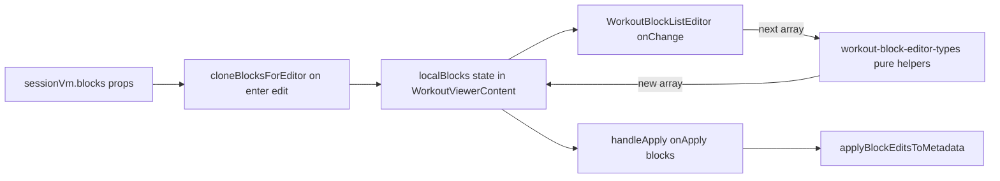

# Workout block editor — structural editing plan (Gap G2)

**Status:** Shipped (P0–P3)  
**Context:** Gap **G2** resolved. `WorkoutBlockListEditor` (edit mode in [WorkoutViewerContent](../../src/components/fitness/workout-viewer-dialog.tsx)) supports structural editing: add/remove/reorder exercises (DnD), add/remove main blocks, comma-split on hallucinated names, and add/remove instruction sections (warm-up / finisher / cool-down). Commits via **Apply** → `applyBlockEditsToMetadata`.

**Parent:** [parametric-step5-plan.md](views/parametric-step5-plan.md) (M1–M3 shipped field edit; structural edit was explicitly out of scope) · [workout-viewer-dialog.md](workout-viewer-dialog.md)

**Source:** [WorkoutBlockListEditor.tsx](../../src/components/fitness/workout-block-renderer/WorkoutBlockListEditor.tsx)

---

## Current state

| Layer                                                                                                                  | What exists today                                                                                                       |
| ---------------------------------------------------------------------------------------------------------------------- | ----------------------------------------------------------------------------------------------------------------------- |
| [WorkoutBlockListEditor.tsx](../../src/components/fitness/workout-block-renderer/WorkoutBlockListEditor.tsx)           | Warmup → main → finisher → cooldown; field + structural edits (add/remove blocks, DnD reorder, split, instruction CRUD) |
| [workout-block-editor-types.ts](../../src/components/fitness/workout-block-renderer/workout-block-editor-types.ts)     | Immutable helpers: field updates, exercise add/remove/reorder/split, main + instruction block CRUD                      |
| [WorkoutBlockExerciseEditRow.tsx](../../src/components/fitness/workout-block-renderer/WorkoutBlockExerciseEditRow.tsx) | Edit row with remove trash + **Split** when name contains commas                                                        |
| [MainBlockExerciseList.tsx](../../src/components/fitness/workout-block-renderer/MainBlockExerciseList.tsx)             | Per-block DnD (`SortableBlockExerciseRow`), add-exercise footer                                                         |
| [outline-editor-client.ts](../../src/lib/agents/coach/outline-editor-client.ts)                                        | **`canAddExerciseToBlock`** / **`canRemoveExerciseFromBlock`** — format-aware cardinality rules                         |
| [WorkoutViewerContent](../../src/components/fitness/workout-viewer-dialog.tsx)                                         | Owns `localBlocks` draft; `onChange={setLocalBlocks}`; commits on **Apply** via `applyBlockEditsToMetadata`             |

**Remaining (post-P3):** EMOM `alternating_stations` re-hydrate on Apply after reorder; catalog picker for new main blocks; `validateBlockShape` soft warning on Apply.

**Type note:** Block rows use factory **`Exercise`** (`exerciseName`, `sets`, `reps`), not flat **`WorkoutExercise`**. New rows must match [`Exercise`](../../src/lib/workout-factory/types/ai-program.ts).

---

## Architecture principle: immutable draft, commit on Apply



Every structural action follows the existing field-edit pattern:

```ts
onChange(addExerciseToBlock(blocks, blockId, newExercise));
```

Never mutate `blocks`, `block.exercises`, or `sessionVm`. Parent `metadata` / factory tree updates only after **Apply**.

After Apply, [`applyBlockEditsToMetadata`](../../src/lib/workout-factory/sync-workout-metadata.ts) → `blocksViewToProgramWorkout` → `normalizeWorkoutForEditor` re-derives flat cache. Subtitles in view mode recompute on next VM build from `formatBlockSubtitle`.

---

## Phase 1 (P0) — Add exercise + harden remove

**Goal:** Fix the “AI merged three movements into one input” case without new block types.

### 1.1 New pure helpers in [workout-block-editor-types.ts](../../src/components/fitness/workout-block-renderer/workout-block-editor-types.ts)

| Helper                                                         | Behavior                                                                                                                         |
| -------------------------------------------------------------- | -------------------------------------------------------------------------------------------------------------------------------- |
| `createDefaultBlockExercise(block, index)`                     | Returns a new `Exercise` for append                                                                                              |
| `addExerciseToBlock(blocks, blockId, exercise)`                | Immutable append + renumber `order` 1…n                                                                                          |
| `reorderExercisesInBlock(blocks, blockId, fromIndex, toIndex)` | `arrayMove` on `exercises` + renumber                                                                                            |
| `recomputeBlockViewMeta(block)`                                | Refresh `subtitle` via `formatBlockSubtitle(blockFormat, formatParams)` after structural change (subtitle is display-only today) |

**Default new `Exercise` object** (mirror outline + factory contract):

```ts
{
  id: crypto.randomUUID(),           // stable React/DnD key
  order: exercises.length + 1,
  exerciseName: '',                  // empty → user fills; placeholder "Exercise name"
  sets: lastExercise?.sets ?? 1,     // inherit from sibling when present
  reps: lastExercise?.reps ?? '',
  // omit rpe, restSeconds, coachNotes until user sets them
}
```

Use **`canAddExerciseToBlock(blockViewForGuard(block))`** (same shape as remove guard) to show/hide the button. Reuse [WorkoutOutlinePanel](../../src/components/fitness/WorkoutOutlinePanel.tsx) pattern: superset/contrast cap at 2 stations.

### 1.2 UI in [WorkoutBlockListEditor.tsx](../../src/components/fitness/workout-block-renderer/WorkoutBlockListEditor.tsx)

Below each main block’s exercise list (inside the grouped/flat container):

- **“Add exercise”** outline `Button` when `canWrite && canAddExerciseToBlock(...)`
- On click: `onChange(addExerciseToBlock(blocks, block.id, createDefaultBlockExercise(block, exercises.length)))`
- Optionally auto-focus the new row’s name input (ref or `autoFocus` on last row)

### 1.3 Remove exercise (verify + small fixes)

**Already implemented:** `removeExerciseFromBlock` + trash in [WorkoutBlockExerciseEditRow](../../src/components/fitness/workout-block-renderer/WorkoutBlockExerciseEditRow.tsx). Tests cover EMOM 3→2 removal ([WorkoutBlockListEditor.test.tsx](../../src/components/fitness/workout-block-renderer/WorkoutBlockListEditor.test.tsx)).

**Plan adjustments:**

1. After remove, call `recomputeBlockViewMeta` on the affected block (station labels / grouped layout depend on count).
2. Renumber `exercise.order` after splice (today remove only filters; `viewExerciseToFactoryExercise` renumbers on Apply, but in-editor `order` should stay consistent for DnD).
3. **UX guard:** when `canRemoveExerciseFromBlock` is false, hide trash (current) **or** show disabled trash + tooltip citing format minimum (e.g. “Superset requires 2 exercises”). Do not bypass cardinality rules silently.
4. **Recovery path for hallucinated comma-names:** user adds rows, splits text manually — no auto-split in P0.

### 1.4 Tests (Phase 1)

- Add exercise on Tabata block → `onChange` receives length+1, new row has empty name + inherited sets/reps.
- Add hidden on superset when already 2 exercises.
- Remove still splices correctly; Apply round-trip preserves `blockFormat` (extend existing test).

---

## Phase 2 (P1) — Reorder exercises (DnD within block)

**Reference:** [WorkoutExercisesEditor](../../src/components/fitness/workout-exercises-editor.tsx) — `DndContext`, `SortableContext`, `PointerSensor` (8px activation), per-row `useSortable`, `arrayMove` on drag end.

### 2.1 Scope

- **In-block only** (not cross-block drag in v1).
- One `DndContext` per main block **or** single editor-level context with composite ids `{blockId}:{sortId}`.

### 2.2 Implementation sketch

1. Extract **`SortableBlockExerciseRow`** wrapper around `WorkoutBlockExerciseEditRow`:
   - Grip handle (`GripVertical`) when `canWrite`
   - `useSortable({ id: exercise.id ?? fallbackId })`
2. Maintain **`sortIdsByBlockId: Record<string, string[]>`** in `WorkoutBlockListEditor` (same pattern as flat editor’s `sortIds` + `useLayoutEffect` sync on length changes).
3. `onDragEnd` → `reorderExercisesInBlock(blocks, blockId, oldIndex, newIndex)`.
4. **EMOM alternating:** reorder changes station indices; on Apply, consider re-running `hydrateEmomAlternatingStations` in `applyBlockEditsToMetadata` if `formatParams.alternating_stations` length ≠ exercise count (follow-up hook in write path — flag in plan, implement in Phase 2 or 3).

### 2.3 Tests

- Drag exercise 2 → position 0 → `onChange` order matches.
- Station labels (A1/A2, EMOM stations) update after reorder.

---

## Phase 3 (P2) — Add / remove blocks

### 3.1 Add main block

**Placement:** Footer of editor, after cooldown section — **“Add main block”**.

**Default new `WorkoutSessionBlockView`:**

```ts
{
  id: crypto.randomUUID(),
  section: 'main',
  order: maxMainOrder + 1,
  name: 'Main work',
  blockFormat: 'straight_sets',   // safe default; user can change in M4 formatParams work
  formatParams: {},
  subtitle: formatBlockSubtitle('straight_sets', {}),
  exercises: [createDefaultBlockExercise({ exercises: [] }, 0)],
  instructions: [],
}
```

**Alternative (richer):** small catalog popover reusing `catalogPresetToOutlineBlock` + map outline → `WorkoutSessionBlockView` (same catalog as [WorkoutOutlinePanel](../../src/components/fitness/WorkoutOutlinePanel.tsx)). Defer catalog picker to P2b if straight_sets default is enough for v1.

**Helper:** `appendMainBlock(blocks, newBlock)` — append + normalize `order` across all main blocks.

### 3.2 Remove main block

- **“Remove block”** on block header (destructive ghost button) when `canWrite && mainBlocks.length > 1`.
- **Never** allow removing the last main block (factory requires ≥1 main work); show toast if attempted.
- Helper: `removeBlockById(blocks, blockId)` — filter + renumber `order`.
- Instruction blocks (warmup/finisher/cooldown): optional **“Add warm-up section”** using `createInstructionBlock` mapped to `WorkoutSessionBlockView` with `section: 'warmup'`. Lower priority than main blocks.

### 3.3 Apply-path validation

Before or during `applyBlockEditsToMetadata`:

- Run `validateBlockShape` per main block (mirror outline confirm).
- On invalid shape after user edit: toast with `blockShapeDropMessage`, **still allow Apply** but document risk — or block Apply with inline error. **Recommend:** soft warning + allow Apply for recovery; Player may degrade gracefully.

### 3.4 Tests

- Two main blocks → remove one → Apply → factory has one `exerciseBlocks` entry.
- Append block → Apply round-trip → VM block count +1.

---

## Phase 4 (P3) — Polish & edge cases

| Item                              | Action                                                                                   |
| --------------------------------- | ---------------------------------------------------------------------------------------- |
| Header **View** tab while editing | Optionally call same reset as Cancel (known viewer gap)                                  |
| Split comma-separated names       | Optional “Split into rows” on name field when `,` detected — stretch                     |
| M4 formatParams editor            | Changing format may require exercise count adjustment — coordinate with structural tools |
| `workout_log` readVariant         | Structural edit stays disabled (flat editor only) — no change                            |
| Docs                              | Update [parametric-step5-plan.md](views/parametric-step5-plan.md) M1 “out of scope” list |

---

## Prioritized delivery order

| Priority | Deliverable                                                            | User impact                               |
| -------- | ---------------------------------------------------------------------- | ----------------------------------------- |
| **P0**   | Add exercise + remove hardening                                        | Fixes hallucinated multi-movement strings |
| **P1**   | Within-block DnD                                                       | Reorder stations without retyping         |
| **P2**   | Add/remove main blocks                                                 | Multi-block sessions editable             |
| **P3**   | Instruction block add/remove, EMOM re-hydrate on apply, catalog picker | Completeness                              |

---

## File touch list (by phase)

| Phase | Files                                                                                                                                                   |
| ----- | ------------------------------------------------------------------------------------------------------------------------------------------------------- |
| P0    | `workout-block-editor-types.ts`, `WorkoutBlockListEditor.tsx`, `WorkoutBlockListEditor.test.tsx`                                                        |
| P1    | `WorkoutBlockExerciseEditRow.tsx` or new `SortableBlockExerciseRow.tsx`, `WorkoutBlockListEditor.tsx`                                                   |
| P2    | Same + optional `block-view-factory.ts` helper to map catalog preset → `WorkoutSessionBlockView`; `sync-workout-metadata.test.ts` for multi-block Apply |
| P3    | `applyBlockEditsToMetadata` (EMOM hydration), docs                                                                                                      |

---

## Validation checklist

1. Edit rich Tabata → Add exercise → split “Burpees, Squats, Climbers” across 3 rows → Apply → view shows 3 stations; split pane stays open.
2. Remove exercise where allowed → Cancel → row count restored; Apply → factory updated.
3. Drag reorder → station labels follow new order.
4. Add second main block → Apply → `exerciseBlocks.length === 2` in metadata.
5. `pnpm exec vitest run src/components/fitness/workout-block-renderer/WorkoutBlockListEditor.test.tsx src/components/fitness/workout-viewer-dialog.test.tsx src/lib/workout-factory/sync-workout-metadata.test.ts`

---

## Recommended start

Phase **P0** only (~1–2 days). It unblocks the hallucination fix with minimal surface area and reuses existing `canAddExerciseToBlock` / `removeExerciseFromBlock` infrastructure. DnD and block-level CRUD can follow as separate PRs.
