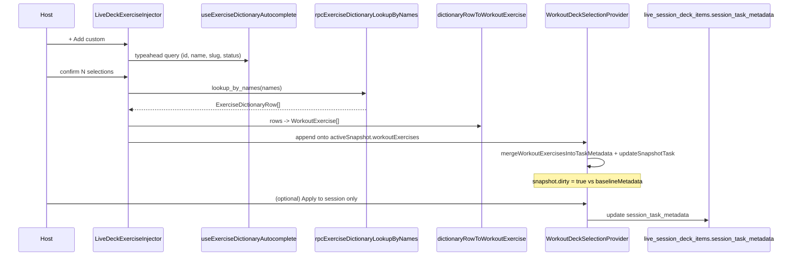

# ADR: Custom Live Workout Builder (inline exercise injection)

Status: **Implemented (v1)** — behavior matches [`LiveDeckExerciseInjector.tsx`](../../../src/features/live-video/shells/huddle/LiveDeckExerciseInjector.tsx) (Pre-Live + Active Live). This document is both the original design record and an **as-built** pointer; where the code intentionally differs from the earlier two-step empty-deck sequence, §4 calls it out.

Scope: **Pre-Live** ([`PreJoinBuilder.tsx`](../../../src/features/live-video/shells/huddle/PreJoinBuilder.tsx)) and **Active Live** ([`LiveSessionView.tsx`](../../../src/features/live-video/shells/huddle/LiveSessionView.tsx)) host shells. Class Builder may follow later under the same contract; not covered here.

Companion docs: [Unified workout builder layout](./unified-builder-layout.md), [Workout builder README](./README.md).

---

## 1. Overview & goal

**Goal:** Let the host **search [`exercise_dictionary`](../../../supabase/migrations/20260617130000_create_exercise_dictionary.sql) inline** from the live workout deck and **inject rich exercises** (instructions, form cues, equipment, media, injury tips) directly into the **active deck card’s** `WorkoutExercise[]` — without leaving the live shell to open the global Kanban or the Task modal.

This **applies to both** the **Pre-Live Builder** and the **Active Live Builder**, sharing one component and one persistence path. The Class Builder may opt in later by mounting the same component above its `LiveSessionWorkoutPlayer` slot.

Non-goals (this ADR):

- New tables, new RPCs, or any change to `live_session_deck_items` columns.
- Replacing the existing **+ Add from Board** Kanban pick flow (it stays as the way to import existing **Workout cards**).
- Mobile sheet refactors of the workout editor.

---

## 2. Selector strategy: reuse the chat `#` autocomplete

The chat composer already searches `exercise_dictionary` via:

- Hook: [`useExerciseDictionaryAutocomplete`](../../../src/hooks/useExerciseDictionaryAutocomplete.ts) — returns `{ id, name, slug, status }` rows scoped by RLS, deduped + cached.
- Cache: [`exercise-dictionary-autocomplete-cache.ts`](../../../src/lib/exercise-dictionary-autocomplete-cache.ts) — 5-minute TTL, in-flight coalescing, per-user invalidation on `SIGNED_OUT`.

We **adapt** (not fork) this hook for the live builder selector. The selector UI is a **typeahead command popover** (e.g. shadcn `Command` / `Popover`) with **multi-select** support so the host can stage several exercises before injecting.

### Why adapt and not duplicate

- One source of truth for RLS, caching, and refresh semantics.
- Cheap list payload (`id, name, slug, status`) is correct for the selector grid; we **only fetch the rich payload on confirm** to avoid pulling JSON-heavy `instructions`/`biomechanics` on every keystroke.

### Lightweight → rich data mapping

On **confirm** (host clicks **Add to deck**):

1. The selector returns the chosen `ExerciseDictionaryAutocompleteRow[]` (id + name).
2. We call **[`rpcExerciseDictionaryLookupByNames`](../../../src/lib/workout-factory/exercise-dictionary-bridge.ts)** (RPC `exercise_dictionary_lookup_by_names`, granted to `authenticated` in [`20260813120200_grant_exercise_dictionary_lookup_authenticated.sql`](../../../supabase/migrations/20260813120200_grant_exercise_dictionary_lookup_authenticated.sql)) to fetch full `ExerciseDictionaryRow`s for the picked names.
3. We map each row to a [`WorkoutExercise`](../../../src/lib/item-metadata.ts) via **[`dictionaryRowToWorkoutExercise`](../../../src/lib/workout-factory/dictionary-row-to-workout-exercise.ts)** — it builds Kanban-shaped extract/enrich inputs, calls [`mergeKanbanExtractEnrichToTaskExercises`](../../../src/lib/workout-factory/map-kanban-extract-to-workout.ts) (same merge path as AI/Kanban enrichment), then attaches `thumbnail_url` when [`ExerciseDictionaryRow`](../../../src/types/database.ts) `media` exposes a URL. Equipment is derived from `biomechanics` keys (`equipment`, `equipmentNeeded`, `primaryEquipment`).
4. RPC rows are reordered to match the picker with **`orderDictionaryRowsByPickerSelection`** in the same module (normalized name order).
5. The host can edit prescription (sets/reps/weight/RPE/duration) inline before or after injection in the existing [`WorkoutExercisesEditor`](../../../src/components/fitness/workout-exercises-editor.tsx) — this ADR does not change that editor’s API.

### Component placement (implemented)

- **[`LiveDeckExerciseInjector`](../../../src/features/live-video/shells/huddle/LiveDeckExerciseInjector.tsx)** (`'use client'`) — **+ Add custom** trigger, Radix **`Popover`** + shadcn-style **`Command`** list ([`command.tsx`](../../../src/components/ui/command.tsx), [`popover.tsx`](../../../src/components/ui/popover.tsx)) built on **`useExerciseDictionaryAutocomplete`**, multi-select via toggled `CommandItem` rows (max **25** per confirm).
- **[`PreJoinBuilder`](../../../src/features/live-video/shells/huddle/PreJoinBuilder.tsx)** and **[`LiveSessionView`](../../../src/features/live-video/shells/huddle/LiveSessionView.tsx)** render it next to the board/deck actions and pass **`workspaceId`**, **`workoutsBubbleId`**, and **`canWrite`**.

**Workouts bubble id wiring:** [`dashboard-shell.tsx`](../../../src/components/dashboard/dashboard-shell.tsx) resolves **`workoutsBubbleForLiveDeck`** for the active workspace and passes **`workoutsBubbleId={workoutsBubbleForLiveDeck?.id ?? null}`** through [`dashboard-live-video-dock.tsx`](../../../src/components/dashboard/dashboard-live-video-dock.tsx) into the live shell props so Option B can target the correct `bubble_id` without re-querying inside the injector.

**Errors:** confirm-path failures use **`formatUserFacingError`** ([`format-error.ts`](../../../src/lib/format-error.ts)); generic toasts for unexpected errors (no raw dictionary/autocomplete strings in user-visible copy). Dev-only `console.error` for thrown errors.

---

## 3. Workflow: Option A — ephemeral mutation on `activeSnapshot`

This matches how [`LiveSessionWorkoutPlayer.tsx`](../../../src/features/live-video/shells/huddle/LiveSessionWorkoutPlayer.tsx) already mutates exercises today, so we inherit dirty tracking and overlay persistence for free.

### Sequence



### State path (must use existing helpers)

- Read current exercises: `metadataFieldsFromParsed(activeSnapshot.task.metadata).workoutExercises` (same as `LiveSessionWorkoutPlayer`).
- Append: `next = [...existing, ...mappedFromDictionary]`.
- Apply to snapshot via the **single** mutation contract:
  ```ts
  const nextMeta = mergeWorkoutExercisesIntoTaskMetadata(activeSnapshot.task, next);
  ctx.updateSnapshotTask(activeSnapshot.snapshotId, { ...activeSnapshot.task, metadata: nextMeta });
  ```
  Defined in [`session-deck-snapshot.ts`](../../../src/features/live-video/shells/huddle/session-deck-snapshot.ts) and [`workout-deck-selection-context.tsx`](../../../src/features/live-video/shells/huddle/workout-deck-selection-context.tsx).
- Persistence:
  - **Default:** mark snapshot dirty; user clicks the existing **Apply to session only** in `LiveSessionWorkoutPlayer` to push **`session_task_metadata`** to the deck row (RPC: simple `update` on [`live_session_deck_items`](../../../supabase/migrations/20260624120000_live_session_deck_and_task_assignees.sql)).
  - **Optional auto-persist** (product call): immediately call `ctx.acceptSnapshotSessionOnly(activeSnapshot.snapshotId)` after a successful inject for a one-tap UX. Do **not** call `updateOriginalTask` / `insertTaskClone` from this path — those mutate global `tasks` rows and are explicit user actions in the player.

### Invariants preserved

- Original `tasks.metadata` is **not** rewritten. The deck card mutation lives entirely in `session_task_metadata`.
- Sidebar `selectedBubbleId` is untouched (no Kanban override needed for the selector).
- `WorkoutDeckSelectionProvider` `isSelectingFromBoard` stays **false** — this flow is independent of the “+ Add from Board” Kanban pick mode and must not toggle the embedded Workouts board.
- Active Agora session and `WorkoutDeckSelectionProvider` are unaffected (no remount triggers).

### Edge rules (implemented)

- **Active card is explicit:** if the deck has snapshots but **`activeSnapshotId` is null** (`needsSelectionFirst`), the injector **does not** fall back to `deck[0]`. The trigger is disabled with tooltip copy to select a card first; opening the popover is closed in an effect while that state holds.
- Block injection when the active card’s **`item_type`** is not **`workout`** / **`workout_log`** (inline helper + toast).
- Multi-select cap **25** per inject — toast when at cap; footer shows selected count.
- After inject, optionally focus the newest exercise row in `WorkoutExercisesEditor` (use existing `autoEditFirstRow` semantic if/when extended) — **not** implemented in v1.

---

## 4. Empty-deck handling: Option B fallback (one-shot task seed)

When the host confirms with **an empty deck** (`ctx.deck.length === 0`) and there is no active snapshot to patch, Option A has nothing to mutate. The implementation still uses a **single seed `tasks` row** + **`addTaskToDeck`** so the invariant holds: **every deck row has a `task_id`** ([`workout-deck-selection-context.tsx`](../../../src/features/live-video/shells/huddle/workout-deck-selection-context.tsx)).

### As implemented (v1) — one confirm on empty deck

The original ADR text described inserting **`exercises: []`** then running a second **Option A** append. **Shipped behavior is a single user confirm:** the host selects dictionary rows in the popover and clicks **Add to deck**. On empty deck, the injector:

1. Requires **`workoutsBubbleId`** (from dashboard props); otherwise toast: add a **“Workouts”** channel.
2. Requires signed-in **`created_by`** (`profileId` from the client profile store).
3. Awaits **[`resolveFirstBoardColumnSlug`](../../../src/lib/fitness/resolve-first-board-column-slug.ts)** (`board_columns` by `position`, fallback **`planned`**) — shared with [`storefront-trial-workout-task.ts`](../../../src/lib/storefront-trial-workout-task.ts) for consistent **Kanban column** placement.
4. **`tasks.insert`** with `metadata: { workout_type: 'strength', exercises: mapped }` where **`mapped`** is the confirmed dictionary payload (not an empty array), plus defaults aligned with other workout inserts (`visibility: 'private'`, `priority: 'medium'`, `attachments: []`, etc.).
5. **`insert(...).select('id').single()`** then a **`select('*').eq('id', ...).maybeSingle()`** to retrieve a full **`TaskRow`** for **`addTaskToDeck`** (provider expects a complete row shape).

This avoids a two-step “empty task then inject” while keeping the same persistence boundary.

### Why Option B is a fallback, not the default

- Avoids creating throwaway `tasks` rows for the common case where the host is editing an existing card.
- Keeps the **active card** as the unit of host intent; empty-deck bootstrap is the exception path.
- **`task_id` always exists** after seed; further edits use the same snapshot / **Apply to session only** flow as other deck cards.

### Failure handling

- If `tasks.insert` or the follow-up fetch fails: **`formatUserFacingError`** toast, deck unchanged.
- If `addTaskToDeck` succeeds but the deck-item insert fails inside the provider: provider already retries via `flushDirtySessionMetadata`; the injector should still proceed — the snapshot exists locally and dirty edits will flush when the deck row is created.

---

## 5. Acceptance criteria

- Host in **Pre-Live**:
  - Active workout card present → **+ Add custom** opens search, multi-select, confirm appends rich exercises, snapshot turns **dirty**, **Apply to session only** persists `session_task_metadata`. **Join video** re-enables once the host exits the popover.
- Host in **Active Live**:
  - Same as above; mic/camera bar (`selectionFloatingMediaBar`) is unaffected (the injector is not the Kanban pick mode).
- **Empty deck** in either shell:
  - One **Add to deck** confirm: Option B inserts a **`workout`** task whose **`metadata.exercises`** already contains the chosen movements, then **`addTaskToDeck`** attaches it to the session deck (no separate second inject step).
- Sidebar `selectedBubbleId` unchanged across the entire flow.
- No regressions to `+ Add from Board`, AMRAP wrapper paths, or Agora connectivity.

---

## 6. Open product decisions (do not block design)

- Auto-persist after inject vs require explicit **Apply to session only** click.
- Whether the seed `tasks` row from Option B is later promoted to a “save as new card” by reusing `usePersistDeckSnapshot.insertTaskClone` semantics.
- Whether to allow **drag-and-drop** of selector chips into a specific position in the exercise list (vs append-only).

---

## 7. Related work (same initiative, outside the injector file)

These changes landed alongside the custom builder but are not part of the injector’s public API:

- **Participant pre-join:** [`ParticipantPreJoinSummary.tsx`](../../../src/features/live-video/shells/ParticipantPreJoinSummary.tsx) surfaces a **`waitingForHost`** status banner when join retries detect the host row is not ready yet (clear UX instead of silent state).
- **Dashboard / Agora hoist:** [`dashboard-shell.tsx`](../../../src/components/dashboard/dashboard-shell.tsx) keeps **`DashboardLiveVideoDockProvider`** wrapping **`LiveTheaterPlanBranch`** so video context survives `shellKind` transitions; narrowing the provider is a separate portal/slot refactor if we ever need to optimize re-renders.
