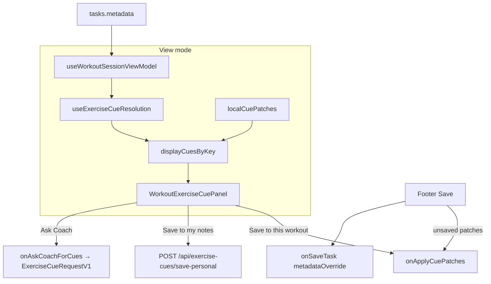

# Architectural assessment: AI Coach cues ↔ Workout Viewer

**Date:** 2026-07-14  
**Scope:** AI Coach–generated and user-updated **instructions**, **form cues**, and **tips** (plus related injury notes / coach notes) as consumed and authored through [`workout-viewer-dialog.tsx`](../../src/components/fitness/workout-viewer-dialog.tsx).  
**Related design:** [exercise-cues-ux-architecture.md](exercise-cues-ux-architecture.md) · [workout-viewer-dialog.md](workout-viewer-dialog.md) · [docs/agents/coach/README.md](../agents/coach/README.md) §5 / §5b

---

## Verdict

M1–M4 of the exercise-cues UX architecture are **shipped in code**: the viewer resolves a four-field cue bundle (plus display-only coach notes), supports workout- and user-scoped writes, and drives Coach generation via **Ask Coach → `workout_cues_patch`**. The largest remaining gaps are **schema split-brain (M5 unfinished)**, **`tips` under-produced by factory/Kanban pipelines**, **resolver precedence vs documented design**, **standalone dialog unwired for Ask Coach**, and **architecture docs that still describe the pre-accordion baseline**.

---

## 1. Scope and surfaces

| In scope                                                                   | Out of scope (related but distinct)                                       |
| -------------------------------------------------------------------------- | ------------------------------------------------------------------------- |
| Per-exercise `instructions`, `form_cues`, `tips`, `injury_prevention_tips` | Block-level `instructions[]` on warm-up / finisher (session choreography) |
| Viewer Cue panel + Ask Coach / Save to workout / Save to my notes          | Structural Edit mode (blocks, DnD, split)                                 |
| Coach `workout_cues_patch` / `personal_cues_patch`                         | Full Coach outline / factory rewrite                                      |
| Flat `metadata.exercises` + library + personal notes                       | Workout-level narrative (`WorkoutCoachBriefSection`)                      |

Primary shell: **`WorkoutViewerContent`** (TaskModal embedded path is the production host). Wrapper **`WorkoutViewerDialog`** shares content but does not forward Coach cue props (see [G4](#g4-standalone-dialog-omits-ask-coach)).

---

## 2. As-shipped architecture

### 2.1 Viewer shell (`WorkoutViewerContent`)



| Concern        | Implementation                                                                                     |
| -------------- | -------------------------------------------------------------------------------------------------- |
| Cue load       | `useExerciseCueResolution` when `mode === 'view'` and `readVariant !== 'log'`                      |
| Local drafts   | `localCuePatches: Record<resolutionKey, WorkoutCuePatch>` — separate from structural `localBlocks` |
| Overlay        | `mergeCuePatchIntoBundle` → provenance `workout` for draft fields                                  |
| Workout write  | `onApplyCuePatches` → parent `applyCuePatchesToMetadata` (TaskModal / `useTaskWorkoutAi`)          |
| Personal write | `savePersonalExerciseCues` → refresh cues                                                          |
| Ask Coach      | Builds `ExerciseCueRequestV1` with `computeEmptyCueFields`; parent opens Comments rail             |
| Dirty close    | Confirm discard when unsaved cue patches exist                                                     |

**Cue panel fields** (`WorkoutExerciseCuePanel`):

| Field                    | Display | Micro-editable                    |
| ------------------------ | ------- | --------------------------------- |
| `instructions`           | yes     | yes                               |
| `form_cues`              | yes     | yes                               |
| `tips`                   | yes     | yes                               |
| `injury_prevention_tips` | yes     | yes                               |
| `coach_notes`            | yes     | **no** (not in `EDITABLE_FIELDS`) |

Provenance chips: `This workout` | `Your notes` | `This card` (`flat`) | `Library`.

### 2.2 Resolution layers (actual code)

Pure merge: [`resolveExerciseCueBundle`](../../src/lib/workout-factory/resolve-exercise-cue-bundle.ts).

**For `instructions` / `form_cues` / `tips` / `injury_prevention_tips`:**

```
personal  >  flat (metadata.exercises)  >  library
```

**For `coach_notes` only:**

```
workout (factory Exercise.coachNotes)  >  flat  >  library
```

Local / Coach patches that land in flat (or draft overlay) surface as workout-scoped content in the UI after commit/refresh. There is **no** first-class “workout snapshot” layer for the four main cue fields on factory `Exercise` objects — that is the M5 hole.

Architecture doc merge order (`workout draft > personal > flat > catalog`) is **not** what the resolver implements for those four fields: **personal beats flat** (including Coach-written workout cues on the card). See [G3](#g3-resolver-precedence-diverges-from-architecture-doc).

### 2.3 Persistence destinations

| Destination       | Mechanism                                                                                            | Scope                                      |
| ----------------- | ---------------------------------------------------------------------------------------------------- | ------------------------------------------ |
| Workout (flat)    | `applyCuePatchesToMetadata` → `metadata.exercises`                                                   | This task only                             |
| Workout (factory) | Same helper updates `coachNotes` on rich tree **only when patch includes `coach_notes`**             | This task; incomplete for full cue surface |
| Personal          | `apply_personal_cues_for_user` via `/api/exercise-cues/save-personal` or Coach `personal_cues_patch` | User × dictionary exercise                 |
| Library           | Kanban / admin dictionary writers (not viewer “Publish”)                                             | Global / pending                           |

Structural Apply risk is mitigated by `preserveFlatCueFieldsOnDerive` in [`sync-workout-metadata.ts`](../../src/lib/workout-factory/sync-workout-metadata.ts) (re-copies cue columns from previous flat when re-deriving). Still fragile if ids/names drift — see [G1](#g1-split-brain-schema-m5-unfinished).

---

## 3. AI Coach generation & update pipelines

### 3.1 Surgical fill — Ask Coach (M3) — primary path for viewer

```
Cue panel "Ask Coach"
  → ExerciseCueRequestV1 in messages.metadata.exercise_cue_request
  → agent-dispatch Coach strategy + EXERCISE_CUE_REQUEST mode
  → same turn: workout_cues_patch for every empty_fields key
        { v:1, resolution_key, instructions?, form_cues?, tips?, injury_prevention_tips? }
  → RPC p_workout_cues_patch on reply metadata
  → optional server merge into tasks.metadata (buildTaskMetadataDeltaForWorkoutCuePatch)
  → client useAgentEffectSweep → onWorkoutCuesPatch
       → stripWorkoutCuesPatchToCuePatch → applyCuePatchesToMetadata
```

| Module                                                     | Role                                                        |
| ---------------------------------------------------------- | ----------------------------------------------------------- |
| `src/lib/agents/coach/exercise-cue-request.ts`             | Request parse, empty-field list, dispatch resolve           |
| `src/lib/agents/coach/workout-cues-patch.ts`               | Patch parse; personal→workout coalesce for unanchored names |
| `src/lib/agents/coach/workout-cue-metadata-merge.ts`       | Server flat merge                                           |
| `src/lib/agents/coach/prompts.ts`                          | `EXERCISE_CUE_REQUEST_MODE_DIRECTIVE`                       |
| `supabase/functions/agents/coach/*`                        | Deno mirrors                                                |
| `20260928130000_agent_rpcs_persist_workout_cues_patch.sql` | RPC plumbing                                                |

Coach is instructed to fill **only `empty_fields`** for the requested exercise and to use **`workout_cues_patch`** (not `personal_cues_patch`, not structural `proposed_workout_metadata`) for form/instructions/tips updates in this mode.

### 3.2 Bulk factory — Kanban extract + enrich

| Enrich field             | Flat `WorkoutExercise`   |
| ------------------------ | ------------------------ |
| `detailed_instructions`  | `instructions`           |
| `biomechanical_cues`     | `form_cues`              |
| `injury_prevention_tips` | `injury_prevention_tips` |
| extract `brief_note`     | `coach_notes`            |
| _(none)_                 | **`tips` never set**     |

Mapping lives in [`map-kanban-extract-to-workout.ts`](../../src/lib/workout-factory/map-kanban-extract-to-workout.ts). Dictionary bridge reuses the same enrich DTO shape — still no dedicated library `tips` column. See [G2](#g2-tips-field-is-first-class-in-ui-rare-from-generation).

### 3.3 User-scoped AI — `personal_cues_patch`

- Keyed by `exerciseIndex`; requires dictionary anchor; unanchored rows dropped (or coalesced into workout patch during cue-request flow).
- Writes `user_exercise_notes` only — **does not** update `tasks.metadata.exercises`.
- Visible in viewer via resolver layer `personal`.

### 3.4 What was not built

| Planned (architecture doc)                | Status                                                |
| ----------------------------------------- | ----------------------------------------------------- |
| Option A `/api/exercise-cues/generate`    | **Not built** — M3 Coach-agentic path shipped instead |
| Inline preview → Accept before persist    | **Not built** — Coach rail confirm + patch apply      |
| “Use library template” empty-state action | **Not built**                                         |
| M5 factory `Exercise` cue fields          | **Not shipped**                                       |

---

## 4. Data model map

| Store                                     | Cue-relevant fields                                                                                     |
| ----------------------------------------- | ------------------------------------------------------------------------------------------------------- |
| `WorkoutExercise` (`metadata.exercises`)  | `instructions`, `notes`, `form_cues` / `form_cue`, `tips`, `injury_prevention_tips`, `coach_notes`      |
| Factory `Exercise` (`ai_workout_factory`) | **`coachNotes` only**                                                                                   |
| `user_exercise_notes`                     | `instructions`, `form_cues`, `tips`, `injury_prevention_tips`                                           |
| `exercise_dictionary`                     | `instructions` (jsonb steps); biomechanics → performance / mistakes / injury tips; **no `tips` column** |

Patch contracts:

- `WorkoutCuePatch` — client metadata merge
- `WorkoutCuesPatchV1` — Coach reply (`v: 1`, `resolution_key`, cue fields)
- `ExerciseCueRequestV1` — Ask Coach trigger
- `ResolvedCueBundle` — display + provenance

---

## 5. Gap analysis

Gaps are ordered by product/architecture impact.

### G1. Split-brain schema (M5 unfinished)

**Severity:** High (latent data-loss / drift)

Factory rich tree still carries only `coachNotes`. Full cue surface lives on flat `metadata.exercises`. Cue micro-saves write flat correctly; factory updates only for `coach_notes`. Structural Apply is protected by `preserveFlatCueFieldsOnDerive`, but:

- Any future derive path that forgets preserve will strip cues.
- Identity matching (id / normalized name / flat index) can mis-attach cues after renames/reorders.
- Dual sources of truth complicate Coach context builders that slim to factory trees.

**Close with:** M5 — extend factory `Exercise` with `instructions` / `formCues` / `tips` / `injuryPreventionTips`; thread through `viewExerciseToFactoryExercise`, `mapExercise`, and Coach slim context.

### G2. `tips` field is first-class in UI, rare from generation

**Severity:** Medium (UX emptiness / incomplete Coach surface)

| Producer                    | Sets `tips`?                 |
| --------------------------- | ---------------------------- |
| Kanban enrich               | No                           |
| Dictionary bridge           | Effectively no               |
| Coach `workout_cues_patch`  | Yes (when in `empty_fields`) |
| Coach `personal_cues_patch` | Yes                          |
| Manual Cue panel            | Yes                          |

After factory generation, users often see instructions + form cues filled and **Tips** empty, which drives extra Ask Coach turns or looks incomplete.

**Close with:** Enrich prompt + map (`tips` or map a biomechanics subfield); optional Coach post-gen fill; or demote Tips in UI when never populated by factory.

### G3. Resolver precedence diverges from architecture doc

**Severity:** Medium (user surprise)

Doc / design principle: workout-scoped should win over personal for “this card.”  
Code: **personal > flat** for the four editable cue fields.

Consequence: older personal notes can **shadow** newer Coach- or user-written workout cues on the card. Provenance chips help, but “Save to this workout” may appear ineffective if personal already has content for that field.

**Close with:** Align code to `workout/flat > personal > library` for display when a flat field is non-empty, **or** update the architecture doc and UX copy to match personal-wins (and consider “override my notes for this workout” affordance).

### G4. Standalone dialog omits Ask Coach

**Severity:** Medium for non-TaskModal hosts; Low for primary path

`WorkoutViewerDialog` accepts `onAskCoachForCues` / `injuriesOnFile` on the props type but **does not forward** them to `WorkoutViewerContent`. TaskModal embedded path wires both.

**Close with:** Forward `onAskCoachForCues`, `injuriesOnFile`, and related chrome props from `WorkoutViewerDialog`.

### G5. Doc staleness vs shipped product

**Severity:** Medium (onboarding / agent confusion)

| Document                               | Drift                                                                                                          |
| -------------------------------------- | -------------------------------------------------------------------------------------------------------------- |
| `exercise-cues-ux-architecture.md`     | Still **Status: Proposed**; “view mode shows coachNotes only”; “future localCuePatches”; related refs outdated |
| `workout-viewer-dialog.md`             | Thin on cue accordion, Ask Coach, patch save paths                                                             |
| Architecture “Option A” generate route | Described as recommended v1; M3 shipped instead                                                                |

**Close with:** Flip status to **Partial / M1–M4 shipped**; rewrite “Current architecture” to match code; mark Option A superseded by M3; expand viewer doc.

### G6. Double apply path for Coach patches

**Severity:** Low–Medium

Server may merge cues into `tasks.metadata` via `agent_update_task_and_reply`, while the client also applies from reply metadata. Usually idempotent; can race with unsaved `localCuePatches` or stale React metadata.

**Close with:** Single source of truth (prefer server write + client refresh) or client-only apply with explicit “already merged” skip.

### G7. `coach_notes` not micro-editable in Cue panel

**Severity:** Low

Displayed read-only; authoring lives more in structural edit / factory. Asymmetric vs other fields; Kanban `brief_note` → coach_notes can appear without an easy view-mode edit.

**Close with:** Add to `EDITABLE_FIELDS` **or** hide from Cue panel and keep only on structural/edit surfaces.

### G8. Log / generating modes skip cue resolution

**Severity:** Low (by design)

`readVariant === 'log'` and edit mode disable cue resolution. Worth documenting so “missing cues on log view” is not treated as a bug.

### G9. No dedicated generate API; rail-coupled UX

**Severity:** Low (accepted tradeoff)

Architecture Option A (narrow `/api/exercise-cues/generate`) was skipped. Ask Coach is rail-coupled but **one-shot** (first reply emits `workout_cues_patch`). Latency/thread noise is lower than the old two-turn confirm; still reuses Coach identity and injury context.

**Close with:** Keep M3; optionally add a thin generate route later if rail UX becomes a pain point.

### G10. Block `instructions[]` vs exercise cues naming collision

**Severity:** Low (cognitive)

Warm-up/finisher step lists share the word “instructions” but are a different concept (`WorkoutInstructionSection`). Cue panel does not show them; Coach prompts must keep them separate from `workout_cues_patch.instructions`.

---

## 6. Pipeline coverage matrix

| Capability             | Kanban enrich | Ask Coach (`workout_cues_patch`) | Personal patch / Save to notes | Viewer micro-edit | Library catalog  |
| ---------------------- | ------------- | -------------------------------- | ------------------------------ | ----------------- | ---------------- |
| instructions           | yes           | yes                              | yes                            | yes               | yes (steps)      |
| form_cues              | yes           | yes                              | yes                            | yes               | via biomechanics |
| tips                   | **no**        | yes                              | yes                            | yes               | **no**           |
| injury_prevention_tips | yes           | yes (if injuries / empty)        | yes                            | yes               | yes              |
| coach_notes            | brief_note    | rarely (not primary)             | n/a                            | display only      | rare             |

---

## 7. Recommendations (priority)

1. **Treat M5 as the structural payoff** — unify factory `Exercise` cue fields so flat is a projection, not the only SoT. Until then, keep `preserveFlatCueFieldsOnDerive` covered by tests on every derive entrypoint.
2. **Decide tips strategy** — either teach enrich/Coach factory paths to emit `tips`, or stop advertising Tips as a peer of form cues in empty-state / Ask Coach when factory never fills them.
3. **Reconcile precedence** — pick personal-vs-workout winner and update resolver + architecture doc + chip copy together.
4. **Forward Ask Coach props** on `WorkoutViewerDialog`; refresh `exercise-cues-ux-architecture.md` and `workout-viewer-dialog.md` to “shipped” baseline.
5. **Optional polish** — single apply path for Coach patches; preview/accept before persist; library template empty action; micro-edit `coach_notes`.

---

## 8. Related file map

### UI

| Path                                                             | Role                                              |
| ---------------------------------------------------------------- | ------------------------------------------------- |
| `src/components/fitness/workout-viewer-dialog.tsx`               | Shell, drafts, cue wiring                         |
| `…/WorkoutExerciseCuePanel.tsx`                                  | Accordion + Ask Coach / save actions              |
| `…/WorkoutReadExerciseRow.tsx`                                   | Row + Cues badge                                  |
| `…/WorkoutBlockListRenderer.tsx` / `WorkoutFlatExerciseList.tsx` | Plan lists                                        |
| `…/WorkoutPlayerExercisePanel.tsx`                               | Live player parallel cue UX                       |
| `src/components/modals/TaskModal.tsx`                            | `handleAskCoachForCues`, `handleWorkoutCuesPatch` |
| `…/hooks/useTaskWorkoutAi.ts`                                    | `handleWorkoutViewerCuePatches`                   |

### Resolution / persistence

| Path                                                       | Role                       |
| ---------------------------------------------------------- | -------------------------- |
| `src/hooks/useExerciseCueResolution.ts`                    | Batch dict + personal load |
| `src/lib/workout-factory/resolve-exercise-cue-bundle.ts`   | Pure merge                 |
| `src/lib/workout-factory/apply-cue-patches-to-metadata.ts` | Workout-scoped write       |
| `src/lib/workout-factory/save-personal-exercise-cues.ts`   | Personal save client       |
| `src/lib/workout-factory/sync-workout-metadata.ts`         | Preserve cues on derive    |
| `src/lib/workout-factory/map-kanban-extract-to-workout.ts` | Enrich → flat              |
| `src/app/api/exercise-cues/save-personal/route.ts`         | Personal upsert API        |

### Coach

| Path                                                         | Role                          |
| ------------------------------------------------------------ | ----------------------------- |
| `src/lib/agents/coach/exercise-cue-request.ts`               | UI → Coach request            |
| `src/lib/agents/coach/workout-cues-patch.ts`                 | Patch parse / coalesce        |
| `src/lib/agents/coach/workout-cue-metadata-merge.ts`         | Server metadata merge         |
| `src/lib/agents/coach/prompts.ts` / `schema.ts` / `parse.ts` | Contract                      |
| `supabase/functions/agents/coach/strategy.ts`                | Persist + optional task delta |
| `src/components/chat/agent-effects/useAgentEffectSweep.ts`   | Client effect for patch       |

### Docs (update targets)

| Path                                            | Note                                       |
| ----------------------------------------------- | ------------------------------------------ |
| `docs/fitness/exercise-cues-ux-architecture.md` | Canonical design; status/baseline stale    |
| `docs/fitness/workout-viewer-dialog.md`         | Shell overview; thin on cues               |
| `docs/agents/coach/README.md` §5b               | Accurate ops note for `workout_cues_patch` |

---

## 9. Summary

The Workout Viewer is a **working content surface** for layered instructions, form cues, tips, and injury notes, with Coach generation wired through the TaskModal path. Generation and UI agree on three of four “prep” fields after Ask Coach; **factory bulk generation systematically omits tips**, and **rich factory schema still cannot own the full cue surface**. Closing the gap is less about new viewer chrome and more about **M5 schema unification**, **tips producer alignment**, **resolver vs product precedence**, and **bringing docs and the standalone dialog wrapper up to the shipped M1–M4 baseline**.
`)
