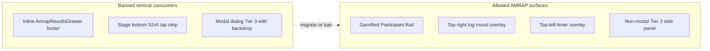

# Display Contract — Live Video Huddle

**Status:** Canonical spec (May 2026).  
**Audience:** Phase 3 (Tier 3 drawer), AMRAP viewport economy, future layout work.  
**Baseline:** Phase 2 complete (`WorkoutQueueRegion`, decoupled theater flags).  
**Related:** [exercise-list-leave-button-audit.md](./exercise-list-leave-button-audit.md), [readme.md](./readme.md), [unified-builder-layout.md](../fitness/workout-builder/unified-builder-layout.md).

---

## 1. Purpose and scope

This contract defines **what mounts where** in the connected huddle (`LiveSessionView`) across product surfaces:

| Surface             | Header label                   | Primary intent                           |
| ------------------- | ------------------------------ | ---------------------------------------- |
| **Planning Huddle** | “Workout Builder — The Huddle” | Plan deck, edit exercises, preview video |
| **Live Broadcast**  | “Live Session — The Huddle”    | Video-first; workout chrome is opt-in    |

**In scope:** Connected huddle after Agora join (`LiveSessionView`), theater layout plan flags, Tier 1–3, interval phases (warm-up, AMRAP, tabata).  
**Out of scope (separate contracts):** `PreJoinBuilder` (pre-join always-open editor), dashboard shell rails, `WorkoutTimerShell` QA surface.

**Design principle:**

> Plan in the huddle; broadcast video. Workout chrome is available on demand, not by default, during live broadcast—except where this contract explicitly mandates auto-open (Tier 3 on card selection).

---

## 2. Tiered architecture invariants

### Tier 1 — Workout Queue (`WorkoutQueueRegion`)

| Invariant                 | Rule                                                                                  |
| ------------------------- | ------------------------------------------------------------------------------------- |
| **Primitive**             | `WorkoutQueueRegion` wraps `SessionDeckBuilder`                                       |
| **Mount gate**            | `huddle.showWorkoutQueueStrip === true` (active connected huddle)                     |
| **Default open**          | `uiMode === 'builder'` → expanded                                                     |
| **Auto-collapse**         | `uiMode === 'live'` → collapsed (24px toggle bar visible)                             |
| **Manual toggle**         | Always allowed; persists until next `uiMode` change                                   |
| **Component cooperation** | `SessionDeckBuilder.isCollapsed={!isOpen}` zeros strip min-heights                    |
| **Pre-join parity**       | `PreJoinBuilder` keeps bare `SessionDeckBuilder` (always open, no toggle)—intentional |

**Phase 2 as-built:** Matches above. **Gap (Phase 3b):** No coupling to `state.phase` (AMRAP/warm-up/tabata)—see §6 Rule V3.

### Tier 2 — Up Next summary (`UpNextCard`)

| Invariant               | Rule                                                                                   |
| ----------------------- | -------------------------------------------------------------------------------------- |
| **Connected huddle**    | **Must not mount** in `LiveSessionView` (removed Phase 2)                              |
| **Rationale**           | Superseded by Tier 3 logger/player for “what am I doing now?”                          |
| **Component retention** | `UpNextCard.tsx` may remain for other surfaces/tests; not part of connected huddle DOM |

### Tier 3 — Exercise interaction (`LiveSessionWorkoutPlayer` / `ParticipantWorkoutLogger`)

| Invariant               | Rule (target — Phase 3)                                                         |
| ----------------------- | ------------------------------------------------------------------------------- |
| **Current (Phase 2)**   | Left `ResizablePanel` when `sideEditorOpen`; mobile bottom `Sheet`              |
| **Target (Phase 3)**    | **Non-modal side panel** (desktop) / bottom sheet (mobile)—not horizontal split |
| **Panel layout**        | **Rule `T3-NON-MODAL-PANEL`** — see §4                                          |
| **Host trigger**        | `activeSnapshotId != null` (local deck context)                                 |
| **Participant trigger** | `state.activeDeckItemId != null` (host-broadcast session state)                 |
| **Auto-open**           | **YES — Selection = Auto-Open** (§4)                                            |
| **Manual close**        | User may dismiss panel; selection state may remain until host clears card       |

---

## 3. Theater layout flags (Phase 2 — frozen semantics)

From `live-theater-layout.types.ts`:

| Flag                      | When `true`                    | Consumer                                               | Must not control                       |
| ------------------------- | ------------------------------ | ------------------------------------------------------ | -------------------------------------- |
| `compactVideoPadding`     | `phase === 'live_video'`       | `VideoStageWrapper` → `BaseVideoHarness.compactChrome` | Tier mount, panel open, queue collapse |
| `showWorkoutQueueStrip`   | Active huddle (builder + live) | `LiveSessionView` → `WorkoutQueueRegion`               | Collapse state (local to region)       |
| ~~`maximizeVideoInDock`~~ | **Removed**                    | —                                                      | —                                      |

**Invariant:** One flag, one concern. New visibility rules use new flags or component-local state—never overload padding flags.

---

## 4. Mount semantics — Tier 3 (locked product decisions)

### Question

> Should `activeDeckItemId != null` auto-open a drawer in live broadcast?

### Contract answer: **YES**

**Rule ID:** `T3-SELECTION-AUTO-OPEN`

When the host selects a workout card (setting `activeDeckItemId` via session broadcast):

1. **Participants:** Tier 3 panel **must auto-open** immediately—even when `uiMode === 'live'`.
2. **Host:** Tier 3 panel **must auto-open** when `activeSnapshotId` is set—same semantics.
3. **Content goal:** Participants see equipment, rep ranges, and logging UI without hunting for a toggle.
4. **Manual dismiss:** Users **may close** the panel without clearing selection; panel may re-open on next selection change or explicit “View workout” affordance (TBD in Phase 3 UI).
5. **Clear selection:** Host clearing active card → panel **must close** (default: close on clear).

### Panel layout rule (strict)

**Rule ID:** `T3-NON-MODAL-PANEL`

Tier 3 must be a **Non-Modal Side Panel** (`modal={false}`). It must slide over or push the content **WITHOUT** a backdrop overlay. The live video **MUST** remain 100% bright, visible, and interactive while the panel is open. Modals/Dialogs that dim the screen are **strictly banned**.

Implementation notes (non-normative):

- Prefer Radix `Sheet` with `modal={false}` or an equivalent side-panel primitive—not `Dialog`, not modal `Sheet`.
- Video stage, participant rail, `FloatingMediaBar`, and in-video overlays remain pointer-accessible unless explicitly covered by the panel’s physical bounds (slide/push), never by a dimming scrim.
- Replacing the Phase 2 `ResizablePanelGroup` split removes permanent width theft; slide/push may temporarily reduce visible video area without darkening or blocking interaction on uncovered regions.

```mermaid
sequenceDiagram
  participant Host
  participant SessionState
  participant Participant
  participant Tier3Panel

  Host->>SessionState: setActiveDeckItem(deckItemId)
  SessionState->>Participant: broadcast activeDeckItemId
  Host->>Tier3Panel: auto-open host
  SessionState->>Participant: activeDeckItemId not null
  Participant->>Tier3Panel: auto-open participant
```

### Implications vs Phase 2 baseline

| Behavior              | Phase 2 (today)                          | Contract (Phase 3+)                                                      |
| --------------------- | ---------------------------------------- | ------------------------------------------------------------------------ |
| Live + card selected  | Split panel opens (desktop)              | Non-modal side panel auto-opens                                          |
| Live + no selection   | Video full width                         | Video full width                                                         |
| User closes UI        | Split unmounts only if selection cleared | Panel closes; selection may persist                                      |
| Broadcast video-first | Split steals 22–55% width permanently    | Panel slides/pushes; **no backdrop**; video stays bright and interactive |
| Modal/scrim           | N/A                                      | **Banned** for Tier 3                                                    |

### Mobile precedent

`LiveSessionView` already uses a bottom `Sheet` when `compact && sideEditorOpen`. Phase 3 applies **`T3-NON-MODAL-PANEL`** on mobile as well (`modal={false}`), extends **auto-open** semantics to desktop, and aligns close/clear behavior across breakpoints.

---

## 5. State matrix

Axes: **surface** × **uiMode** × **session phase** × **selection** × **viewport**.

### 5.1 Core surfaces (`uiMode` × selection)

| uiMode    | `activeDeckItemId` | Tier 1 queue        | Tier 2 UpNext | Tier 3 (contract)   |
| --------- | ------------------ | ------------------- | ------------- | ------------------- |
| `builder` | null               | Open (default)      | Hidden        | Closed              |
| `builder` | set                | Open (default)      | Hidden        | **Panel open**      |
| `live`    | null               | Collapsed (default) | Hidden        | Closed              |
| `live`    | set                | Collapsed (default) | Hidden        | **Panel auto-open** |

Tier 1 manual toggle overrides default open/collapsed until `uiMode` changes.

### 5.2 Interval phases (`state.phase`)

| Phase    | Registry wrapper | Tier 1 (contract target)           | Tier 3                                           | Video overlays                 | Inline column chrome              |
| -------- | ---------------- | ---------------------------------- | ------------------------------------------------ | ------------------------------ | --------------------------------- |
| `lobby`  | none             | Per uiMode matrix                  | Per selection matrix                             | None                           | SessionControls only              |
| `warmup` | none             | **Collapsed** during block (§6 V3) | Per selection matrix                             | `ActivePhaseOverlays` top-left | None                              |
| `tabata` | none             | **Collapsed** during block         | Per selection matrix                             | `ActivePhaseOverlays` top-left | None                              |
| `amrap`  | `AmrapWrapper`   | **Collapsed** during block         | Per selection; logger in **AMRAP prep-set mode** | Timer, log round, lap chips    | **No footer leaderboard** (§6 V2) |

### 5.3 Special modes

| Mode                 | Tier 1                           | Tier 3                 | Main column                             |
| -------------------- | -------------------------------- | ---------------------- | --------------------------------------- |
| `selectingFromBoard` | Mounts (toggle available)        | Closed                 | Embedded Kanban replaces main workspace |
| `compact` (< md)     | Same collapse rules              | Bottom non-modal sheet | No `ResizablePanelGroup`                |
| Session ended        | Unmounted (`PostSessionSummary`) | Unmounted              | —                                       |

---

## 6. Future viewport invariants

### 6.1 Interval wrapper (AMRAP) economy — current baseline

Today AMRAP consumes space on **four layers** simultaneously:

1. **Video overlays** — timer (top-left), log round (top-right), `z-[43]`
2. **Stage bottom strip** — `AmrapRoundLapsOverlay` up to `max-h-[min(52vh,22rem)]`, `z-[44]`
3. **Inline footer** — `AmrapResultsDrawer` via `chatDrawerLeaderboard` below SessionControls
4. **Tier 1 + Tier 3 split** — independent; no phase coordination

Warm-up / Tabata: overlay-only via `ActivePhaseOverlays` (no registry wrapper).

### 6.2 Contract rules

#### Rule V1 — Top App Bar (Header/Footer merge)

**Target DOM:**

```text
[ Top App Bar — single shrink-0 row ]
  ← Session title, phase controls, host nav (AMRAP timer actions), Exit workout
[ Tier 1 toggle + collapsed strip ]
[ Main stage — flex-1 min-h-0 ]
  ← Video + Gamified Rail ONLY (no horizontal Tier 3 split)
[ Tier 3 Non-Modal Side Panel — slide/push, no backdrop, not a flex sibling ]
```

- **Banned:** Separate `SessionHeader` block + bottom `SessionControls` footer stack consuming two vertical shrink bands.
- **Merged into:** One Top App Bar region with session lifecycle + phase transitions + leave.

#### Rule V2 — Leaderboards: Gamified Rail only

**Banned:**

- Full-width bottom leaderboard rows in the huddle flex column (`chatDrawerLeaderboard` inline card)
- Full-width stage-bottom lap strips that consume up to **52vh** of the 16:9 stage

**Required:**

- AMRAP rankings and lap summaries migrate to the **right-hand Participant Video Rail** (Gamified Rail)
- Rank/order **linked to participant video tiles** (avatar, round count, lap chips on tile—not detached footer list)
- Log round affordance remains reachable without shrinking video below usable 16:9 minimum



#### Rule V3 — Tier 1 coordination during interval blocks

When `state.phase !== 'lobby'`:

- Tier 1 **must be collapsed** on phase enter (in addition to live-mode collapse)
- User may still manually expand Tier 1 via toggle (default: allow manual expand)

**Rationale:** Interval blocks + open queue + panel + footer was the viewport crush vector identified in audits.

#### Rule V4 — 16:9 video minimum

The main video stage must retain a **contracted minimum visible height** in the dock (exact px/% TBD in implementation).

- Inline flex siblings in the main column: **Tier 1 toggle bar only** (24px when collapsed)
- Tier 3 and AMRAP leaderboard: **non-modal panel or rail**, not additional flex rows below video; **no dimming scrim**

### 6.3 Interval type taxonomy (mount contract)

| Interval         | Wrapper kind              | Primary UI surfaces (target)                                   |
| ---------------- | ------------------------- | -------------------------------------------------------------- |
| Warm-up          | None (phase only)         | Top-left timer overlay on video                                |
| Tabata           | None (phase only)         | Top-left countdown overlay on video                            |
| AMRAP            | `amrap` / `amrap_minimal` | Timer overlay + log-round overlay + **Gamified Rail** rankings |
| Simple countdown | `simple_countdown`        | TBD; must not use inline `min-h-[120px]` footer card pattern   |

`AmrapWrapper` may remain `sr-only` effect root if all UX moves to overlays + rail.

---

## 7. Gap analysis — Phase 2 as-built vs contract

| Area                     | As-built (Phase 2)       | Contract target                                        | Phase |
| ------------------------ | ------------------------ | ------------------------------------------------------ | ----- |
| Tier 1 collapse on live  | `uiMode` only            | + collapse on `state.phase !== 'lobby'`                | 3b    |
| Tier 2                   | Removed from LSV         | Frozen                                                 | Done  |
| Tier 3                   | Resizable split          | Non-modal panel + Selection=Auto-Open                  | **3** |
| Tier 3 live auto-open    | Split opens (width cost) | Panel auto-open; no backdrop; video bright/interactive | **3** |
| AMRAP footer leaderboard | Inline below controls    | **Banned** → Gamified Rail                             | 4     |
| Stage bottom lap strip   | Up to 52vh               | **Banned** → rail tile chips                           | 4     |
| Header + footer          | Two bands                | Merged Top App Bar                                     | 4     |
| `showWrapperBoardSplit`  | Dormant                  | Remain dormant unless contract amended                 | —     |
| Warm-up/Tabata           | Overlays only            | Unchanged                                              | —     |

---

## 8. Component ownership map (target)

| Concern                  | Owner                                                                                                   |
| ------------------------ | ------------------------------------------------------------------------------------------------------- |
| Tier 1 collapse + toggle | `WorkoutQueueRegion`                                                                                    |
| Tier 1 mount gate        | `deriveLiveTheaterLayoutPlan.showWorkoutQueueStrip`                                                     |
| Video padding            | `compactVideoPadding` → `VideoStageWrapper`                                                             |
| Tier 3 panel shell       | **New:** `WorkoutInteractionDrawer` (Phase 3—name TBD); **`modal={false}` required**                    |
| Tier 3 auto-open         | Derived: `activeDeckItemId != null` OR host `activeSnapshotId != null`; local `panelDismissed` override |
| AMRAP timer / log round  | Video overlay slots (keep)                                                                              |
| AMRAP rankings           | **Gamified Rail** adapter (new)                                                                         |
| Phase transitions        | Merged into Top App Bar                                                                                 |
| Interval phase overlays  | `ActivePhaseOverlays` (warm-up/tabata); AMRAP slot injection                                            |

---

## 9. Execution phases (spec roadmap)

### Phase 3 — Tier 3 non-modal side panel

- Replace `ResizablePanelGroup` Tier 3 branch with full-width video + **`T3-NON-MODAL-PANEL`**
- Implement `T3-SELECTION-AUTO-OPEN` + dismiss semantics
- Preserve `ParticipantWorkoutLoggerCore` AMRAP prep-set mode inside panel
- Deprecate `buddybubble.huddleEditorVideoSplit.*` localStorage (or freeze writes)
- Vitest/E2E: live + selection → panel open; clear selection → panel closed; **no backdrop**; video interactive

### Phase 3b — Tier 1 phase coordination

- `WorkoutQueueRegion`: collapse when `state.phase !== 'lobby'`

### Phase 4 — AMRAP viewport economy

- Introduce Top App Bar; remove stacked header/footer
- Migrate `AmrapResultsDrawer` + stage-bottom laps → Gamified Rail
- Remove inline `chatDrawerLeaderboard` footer mount from `LiveSessionView`
- Enforce Rule V4 minimum video height

---

## 10. Validation checklist (acceptance criteria)

**Tier 1**

- [ ] Builder: queue open by default; toggle works
- [ ] Live: queue collapsed by default; toggle works
- [ ] Interval block: queue collapsed on phase enter (Phase 3b)

**Tier 2**

- [ ] `UpNextCard` absent from `LiveSessionView` at all times

**Tier 3**

- [ ] Host selects card → panel opens (builder + live)
- [ ] Participant receives `activeDeckItemId` → panel opens in live broadcast
- [ ] Panel uses `modal={false}` — **no backdrop dimming**
- [ ] Video remains **100% bright and interactive** on uncovered regions while panel is open
- [ ] User closes panel → no modal scrim left behind
- [ ] Host clears selection → panel closes
- [ ] AMRAP phase: prep-set logger UI inside panel

**AMRAP economy**

- [ ] No inline footer leaderboard in huddle column
- [ ] No stage-bottom strip with column/viewport impact
- [ ] Rankings visible on participant rail tiles
- [ ] Single Top App Bar; no separate footer control band

**Video**

- [ ] 16:9 stage maintains minimum visible area with queue collapsed + panel closed
- [ ] `compactVideoPadding` active only in live broadcast; no effect on panel modality

---

## 11. Open questions (non-blocking for Phase 3 start)

1. **Panel side:** Left vs right on desktop (right panel keeps rail visible)?
2. **Slide vs push:** Panel overlays video edge vs reflows main stage width?
3. **Re-open affordance:** If user dismisses panel while selection persists, show floating “View workout” pill on video?
4. **Tier 1 toggle during AMRAP:** Allow manual expand or hard-disable during `phase !== 'lobby'`?
5. **Gamified Rail data density:** Max participants before rail scroll/clutter threshold?

---

## Appendix A — Phase 2 file reference

| Artifact             | Path                                                            |
| -------------------- | --------------------------------------------------------------- |
| Queue region         | `src/features/live-video/ui/WorkoutQueueRegion.tsx`             |
| Layout flags         | `src/features/live-video/theater/live-theater-layout.types.ts`  |
| Connected shell      | `src/features/live-video/shells/huddle/LiveSessionView.tsx`     |
| Collapse-aware strip | `src/features/live-video/shells/huddle/SessionDeckBuilder.tsx`  |
| AMRAP wrapper        | `src/features/live-video/wrappers/amrap/AmrapWrapper.tsx`       |
| Phase overlays       | `src/features/live-video/shells/huddle/ActivePhaseOverlays.tsx` |
