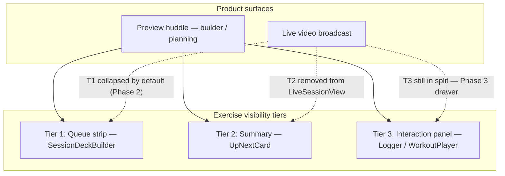
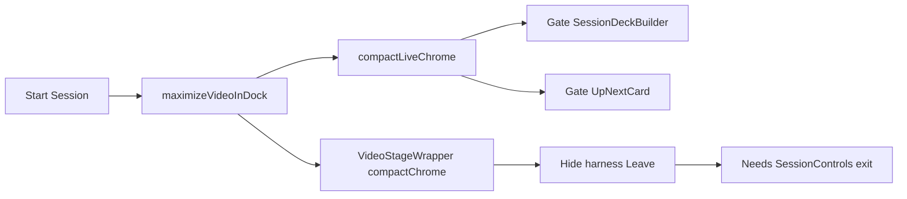

# Live Session UX Audit: Exercise List & Leave Button

**Date:** May 2026  
**Scope:** Connected huddle (`LiveSessionView`), theater layout plan, dock routing, and pre-join surfaces  
**Context:** Layout work on branch `updates/live-video-display` introduced `maximizeVideoInDock` / `compactLiveChrome`, which regressed workout queue visibility and temporarily removed the connected Leave control. **Phase 1 (surgical rollback) and Phase 2 (`WorkoutQueueRegion` + decoupled layout flags) are complete** — see [§10](#10-phase-1-resolution-surgical-rollback) and [§11](#11-phase-2-resolution-workoutqueueregion--flag-decoupling).

For the broader live-video architecture, see [architectural-assessment.md](./architectural-assessment.md). For **canonical Planning Huddle vs Live Broadcast mount rules** (Tier 1–3, AMRAP viewport economy), see **[display-contract.md](./display-contract.md)**. For the intended builder DOM hierarchy, see [../fitness/workout-builder/unified-builder-layout.md](../fitness/workout-builder/unified-builder-layout.md).

---

## Executive summary

The original regression traced to a single overloaded flag chain (`maximizeVideoInDock` → `compactLiveChrome` → unmount strip). That gate was **removed in Phase 1** and replaced in **Phase 2** with decoupled flags plus a first-class collapsible queue region.

**Current code path (Phase 2):**

```text
deriveLiveTheaterLayoutPlan
  → compactVideoPadding: phase === 'live_video'   → VideoStageWrapper → BaseVideoHarness padding
  → showWorkoutQueueStrip: true (active huddle)   → LiveSessionView → WorkoutQueueRegion
       → auto-collapsed when uiMode === 'live'; manual toggle; SessionDeckBuilder isCollapsed
```

In parallel, **`BaseVideoHarness`** hides its **Leave** row when `fullWidth && isConnected`; exit is via **`SessionControls` → Exit workout** (Phase 1).

**Important:** [§0 User-reported behavior](#0-user-reported-behavior-may-2026-qa) captured pre-fix QA. **Re-validation is required** after Phase 2 before closing gaps G0–G2. Tier 3 (logger/player beside video) is **unchanged** and may still read as “exercises in broadcast.”

| Surface                                   | Product intent                              | Current code (post–Phase 2)                                           | Pre-fix QA (May 2026)        |
| ----------------------------------------- | ------------------------------------------- | --------------------------------------------------------------------- | ---------------------------- |
| Workout queue in **preview huddle**       | **Open by default**                         | `WorkoutQueueRegion` open when `uiMode === 'builder'`                 | **Not visible** ❌ — re-test |
| Workout queue in **live video broadcast** | **Collapsed by default** (toggle to expand) | Region mounted; `isOpen = false` on live; no `UpNextCard`             | **Visible** ❌ — re-test     |
| Leave / Exit workout (connected)          | Always available                            | `LiveSessionTopBar` → `SessionControlsActions.onLeaveDock` (Sprint 3) | Was missing — likely fixed   |

---

## 0. User-reported behavior (May 2026 QA)

**Reporter:** Host/participant testing in the dashboard live-video dock.

### Terminology (UI labels in code)

| User phrase              | Maps to in product/code                                                                                                                                                                                                                                                               |
| ------------------------ | ------------------------------------------------------------------------------------------------------------------------------------------------------------------------------------------------------------------------------------------------------------------------------------- |
| **Preview huddle**       | Surfaces titled **“Workout Builder — The Huddle”** — `PreJoinBuilder` (before Agora join) and/or connected `LiveSessionView` while `uiMode === 'builder'` (video connected, session not started). Also aligns with session phase **lobby** (“Return to Huddle” in `SessionControls`). |
| **Live video broadcast** | Agora-connected `LiveSessionView` once the session is running — header **“Live Session — The Huddle”**, `uiMode === 'live'`, video-dominant dock (`theater_focus`, `compactVideoPadding: true`).                                                                                      |

### What the user reported

1. **Workout queue and exercises are no longer available in the preview huddle view.**
2. **Workout queue is visible in the live video broadcast** — where it should **not** display.
3. This is the **opposite of intended product behavior:**
   - Queue + exercises belong in **preview / builder / huddle planning**.
   - Queue should **not** occupy the live video broadcast surface.

### Confirmation status

| Claim                                              | Confirmed from code review?  | Notes                                                                                                                                                                                                                                                                        |
| -------------------------------------------------- | ---------------------------- | ---------------------------------------------------------------------------------------------------------------------------------------------------------------------------------------------------------------------------------------------------------------------------- |
| Product intent (queue in huddle, not in broadcast) | ✅ Yes                       | Matches [unified-builder-layout.md](../fitness/workout-builder/unified-builder-layout.md) trifecta: header → deck strip → main workspace. Live broadcast should be video-first.                                                                                              |
| User sees **no queue in preview huddle**           | ⚠️ **Re-test after Phase 2** | Pre-fix: possible flex/min-height fight (Phase 2a wrapper) or empty deck context. Post–Phase 2: `WorkoutQueueRegion` + `SessionDeckBuilder isCollapsed` should allow open strip in builder mode.                                                                             |
| User sees **queue in live video broadcast**        | ⚠️ **Partially addressed**   | Post–Phase 2: Tier 1 **auto-collapses** on live (24px toggle only unless expanded). Tier 3 logger/player **still mounts** beside video when `activeDeckItemId` set — likely still reported as “queue in broadcast.” Full video-first broadcast requires Phase 3 drawer work. |

### Corrected problem statement

The layout work **inverted product intent relative to what users experience**, even where code comments suggest the opposite:

- **Intended:** Plan workouts in the huddle/builder; go live with video-only (or minimal) chrome.
- **Observed (QA):** Planning/huddle surfaces lost the queue; broadcast surfaces still show workout content.

The first audit timeline (§2) described **code-intended** hide/show timing. **§0 supersedes that timeline for product impact** until re-validated in-browser with instrumented state logging.

---

## 1. Architecture: how exercise visibility is supposed to work

The codebase defines **three tiers** of exercise UI:



### Tier 1 — Queue strip (`SessionDeckBuilder` via `WorkoutQueueRegion`)

Connected huddle mounts Tier 1 through [`WorkoutQueueRegion.tsx`](../../src/features/live-video/ui/WorkoutQueueRegion.tsx), not bare `SessionDeckBuilder`.

- **Host:** sortable deck tiles; click to set active card → broadcasts `activeDeckItemId`.
- **Participant:** read-only horizontal queue from `useLiveSessionDeck`.
- **Product rule:** Always under the header in builder/huddle contexts; **not** in the live broadcast chrome.

Relevant file: `src/features/live-video/shells/huddle/SessionDeckBuilder.tsx`

### Tier 2 — Summary (`UpNextCard`)

- Compact “Up next” line from `WorkoutDeckSelectionProvider`.
- **No longer mounted in `LiveSessionView`** (Phase 2); participants use Tier 3 logger instead during live.
- Component retained for other surfaces / future use.

Relevant file: `src/features/live-video/shells/huddle/UpNextCard.tsx`

### Tier 3 — Interaction panel

- **Host:** `LiveSessionWorkoutPlayer`
- **Participant:** `ParticipantWorkoutLogger`
- Resizable split beside video when `showSideEditor` is true.

**QA note:** Tier 3 beside the video stage may be what testers describe as “queue/exercises in the live video broadcast” even when Tier 1 strip is absent.

Relevant files:

- `src/features/live-video/shells/huddle/LiveSessionWorkoutPlayer.tsx`
- `src/features/live-video/shells/ParticipantWorkoutLogger.tsx`

---

## 2. What the layout change did (historical — pre–Phase 1)

> **Superseded.** The gate below was reverted in Phase 1 and replaced by Phase 2 architecture. Kept for regression context.

### The gate (removed)

```typescript
// LiveSessionView.tsx
const compactLiveChrome = maximizeVideoInDock;

{!compactLiveChrome || selectingFromBoard ? (
  <SessionDeckBuilder state={state} className="min-h-0 min-w-0 shrink-0" />
) : null}

{uiMode === 'live' && !selectingFromBoard && !compactLiveChrome ? (
  <UpNextCard className="shrink-0" />
) : null}
```

### Flag derivation (removed)

```typescript
// live-theater-layout.types.ts — REMOVED in Phase 2
huddle: {
  maximizeVideoInDock: phase === 'live_video';
}
// Replaced by: compactVideoPadding, showWorkoutQueueStrip
```

`sessionUiKind === 'live'` when `globalStartedAt != null` or `status !== 'idle'` (host **Start Session**).

### Code-intended timeline (superseded for UX by §0)

| Phase                          | `compactLiveChrome`         | Strip mounted (code)   |
| ------------------------------ | --------------------------- | ---------------------- |
| Pre-join `PreJoinBuilder`      | N/A (not `LiveSessionView`) | Always                 |
| Connected, session not started | false                       | Yes                    |
| Connected, session started     | true                        | No (except board-pick) |

**User QA contradicts the practical outcome** of this matrix for preview huddle and live broadcast. Treat §0 as the source of truth for product impact until fixed and re-tested.

---

## 3. Architecture: leave / exit paths

Leave is **local-only**: `leaveChannel()` + `liveVideoStore.leaveSession()` — does not end the shared workout.

| Surface                     | Label        | When shown                            |
| --------------------------- | ------------ | ------------------------------------- |
| `PreJoinBuilder`            | Exit workout | Pre-join host                         |
| `ParticipantPreJoinSummary` | Exit workout | Pre-join participant                  |
| `BaseVideoHarness`          | Leave        | Connected, non-theater fullWidth only |
| `SessionControls`           | Exit workout | Connected (if `onLeaveDock` wired)    |

### Layout impact on leave

```typescript
// BaseVideoHarness.tsx
const hideConnectedLeaveRow = fullWidth && isConnected;
```

Theater dock uses `fullWidth` → harness Leave hidden when connected. Relocation target: `SessionControls.onLeaveDock` via dock `onAfterLeave={onLeaveSession}` (working tree).

Leave shares `LiveSessionView` footer with session controls; both are **hidden during `selectingFromBoard`** while the deck strip is **shown** (gate exception) — another huddle/broadcast asymmetry.

---

## 4. Why exercises and leave feel connected

Both regressions trace to **`maximizeVideoInDock` / `compactLiveChrome`** treating “live phase” as “strip all non-video chrome,” without distinguishing:

- **Essential planning chrome** (queue, exercises) → belongs in **huddle**
- **Video broadcast chrome** → should stay clean
- **Local exit control** → must exist in **both** when connected



---

## 5. Gap analysis

### A. Product / UX gaps (updated with QA)

| Gap                                            | Description                                                                                                                   |
| ---------------------------------------------- | ----------------------------------------------------------------------------------------------------------------------------- |
| **G0 — Inverted visibility (QA)**              | Queue missing in preview huddle; queue/content visible during live broadcast — opposite of product intent                     |
| **G1 — Queue stripped from planning**          | Host/participant cannot plan or review saved session workouts in huddle surfaces                                              |
| **G2 — Workout content bleeds into broadcast** | Exercises/queue appear in video-dominant live surface where only video + minimal controls should show                         |
| **G3 — Tier 3 vs Tier 1 confusion**            | Side-panel logger/player may be mistaken for “queue in broadcast”; still violates “video-first broadcast” if shown by default |
| **G4 — Leave relocated but fragile**           | Prop chain, scaffold gap, hidden during board-pick                                                                            |

### B. Architectural gaps

| Gap                                     | Description                                                                                     |
| --------------------------------------- | ----------------------------------------------------------------------------------------------- |
| **A1 — Single flag, multiple concerns** | ~~`maximizeVideoInDock`~~ **Resolved Phase 2:** `compactVideoPadding` + `showWorkoutQueueStrip` |
| **A2 — Trifecta standard bypassed**     | Active Live no longer matches Class / Pre-Live DOM hierarchy                                    |
| **A3 — Code intent ≠ observed UX**      | Static gate analysis insufficient; no E2E assertion on huddle vs broadcast surfaces             |
| **A4 — Doc drift**                      | `readme.md` still claims deck builder in connected huddle                                       |

---

## 6. State matrix (reconciled: product intent vs code vs QA)

| Surface                                            | Product intent                      | Current code (post–Phase 2)                                         | Pre-fix QA                             |
| -------------------------------------------------- | ----------------------------------- | ------------------------------------------------------------------- | -------------------------------------- |
| Preview huddle (`Workout Builder — The Huddle`)    | Queue **open** by default           | `WorkoutQueueRegion` open; toggle collapses                         | **Not visible** ❌ — re-test           |
| Live video broadcast (`Live Session — The Huddle`) | Queue **collapsed**; video dominant | Region mounted, auto-collapsed; Tier 2 gone; Tier 3 split unchanged | **Queue/content visible** ❌ — re-test |
| Pre-join (`PreJoinBuilder` / participant summary)  | Full queue, always open             | Bare `SessionDeckBuilder` (no toggle)                               | Not reported                           |

---

## 7. Recommendations (prioritized)

### P0 — Restore product-correct surface mapping

1. **Queue + exercises in preview huddle only** — `PreJoinBuilder`, connected builder-mode `LiveSessionView`, and lobby/planning phases must always show Tier 1 (and Tier 2 where appropriate).
2. **Remove queue from live video broadcast** — when `uiMode === 'live'` / broadcast mode, unmount Tier 1 and Tier 2; do not show `LiveSessionWorkoutPlayer` / `ParticipantWorkoutLogger` beside video unless user explicitly opens a “view workout” affordance.
3. ~~**Decouple flags**~~ — **Done (Phase 2):** `compactVideoPadding` + `showWorkoutQueueStrip`. ~~Formal `display-contract.md`~~ — **Done:** see [display-contract.md](./display-contract.md). Remaining: optional `broadcastMode` for Tier 3 (superseded by contract rules).

### P1 — Leave hardening

4. Keep **Exit workout** in `SessionControls` for connected sessions.
5. Show leave during board-pick (alongside `selectionFloatingMediaBar`).
6. Pass `onAfterLeave` in scaffold.

### P2 — Validation

7. Add E2E or manual QA script: assert queue visible on “Workout Builder — The Huddle”, absent on “Live Session — The Huddle”.
8. Log `[DEBUG][LiveVideo]` `sessionUiKind`, `compactLiveChrome`, `uiMode`, and whether `SessionDeckBuilder` mounted — correlate with user-visible surfaces.

---

## 8. Design principle

> **Plan in the huddle; broadcast video. Workout chrome belongs in builder/planning surfaces, not in the live video frame.**

- **Preview huddle:** header → deck strip → exercise editor/logger → actions.
- **Live broadcast:** video stage + session controls + exit; no queue strip unless user explicitly opens planning overlay.

---

## 9. Bottom line

**Pre-fix QA confirmed a real regression** (inverted queue visibility). **Phase 1** removed the broken unmount gate; **Phase 2** added structural collapse + decoupled flags.

**Open until re-validated:** G0–G2 product gaps and Tier 3 “exercises beside video” during broadcast (Phase 3 drawer). **Leave** path is wired via Phase 1 but P1 hardening (board-pick, scaffold) remains.

**Canonical mount rules:** [display-contract.md](./display-contract.md) — Planning Huddle vs Live Broadcast tiers, `T3-SELECTION-AUTO-OPEN`, and `T3-NON-MODAL-PANEL` (see [§11](#11-phase-2-resolution-workoutqueueregion--flag-decoupling) for Phase 2 history).

---

## 10. Phase 1 resolution (surgical rollback)

**Completed:** Phase 1 rolled back behavioral scope from the layout plan while keeping video geometry fixes.

**Kept:**

- `BaseVideoHarness` stage/rail flex rebalance, height-fill aspect box, fixed-width rail, `compactChrome` padding-only prop, harness Leave row hidden when connected in theater (leave via `SessionControls` **Exit workout**).
- `VideoStageWrapper` stretch layout + `compactChrome` passthrough.
- `LiveSessionView` video panel height wrappers (split + full-width branches).
- `SessionControls.onLeaveDock` + dock `onAfterLeave={onLeaveSession}` wiring.

**Reverted / removed:**

- `compactLiveChrome` / `maximizeVideoInDock` gating on `SessionDeckBuilder` and `UpNextCard` — queue strip and Up Next restored to unconditional mount (pre-plan behavior).
- `LiveVideoSyncPill`, `requestSync` API, dev SessionView debug log.
- Orphan deck copy in `ParticipantWorkoutLogger`.
- AMRAP `preferredShell: 'theater_board_split'`.
- Theater split defaults (42/58, dock `minSize={200}`).
- Huddle editor/video split defaults (35/65).

**Deferred to Phase 2:** ~~intentional broadcast-mode queue hiding~~ (partial — collapse not unmount), ~~`display-contract.md`~~ (published), degraded-state UX (sync pill, orphan copy), split tuning.

**Post-Phase 1 expectation:** Workout queue visible in huddle/builder surfaces again; video stage should fill the dock without collapsed main stage.

---

## 11. Phase 2 resolution (`WorkoutQueueRegion` + flag decoupling)

**Completed:** Structural fix for Tier 1 collapse and theater flag decoupling.

**Layout flags** ([`live-theater-layout.types.ts`](../../src/features/live-video/theater/live-theater-layout.types.ts)):

| Flag                      | Derivation (active huddle)               | Consumer                                               |
| ------------------------- | ---------------------------------------- | ------------------------------------------------------ |
| `compactVideoPadding`     | `true` when `phase === 'live_video'`     | `VideoStageWrapper` → `BaseVideoHarness.compactChrome` |
| `showWorkoutQueueStrip`   | `true` (mount region; collapse is local) | `LiveSessionView` → `WorkoutQueueRegion`               |
| ~~`maximizeVideoInDock`~~ | **Removed**                              | —                                                      |

**New primitive:** [`WorkoutQueueRegion.tsx`](../../src/features/live-video/ui/WorkoutQueueRegion.tsx)

- CSS grid collapse with full `min-h-0` chain (flex child + grid + overflow wrapper)
- Auto-open in builder, auto-close on `uiMode === 'live'`; manual toggle persists until next mode change
- Passes `isCollapsed={!isOpen}` to `SessionDeckBuilder`

**`SessionDeckBuilder` collapse-aware:**

- `isCollapsed` prop zeros strip min-heights (`min-h-0 p-0 overflow-hidden opacity-0`), hides title row, drops root `shrink-0`

**`LiveSessionView` integration:**

- Replaced ad-hoc Phase 2a wrapper with `WorkoutQueueRegion` gated by `huddle.showWorkoutQueueStrip`
- **Removed** live `UpNextCard` mount
- **Untouched:** `ResizablePanelGroup`, `ParticipantWorkoutLogger`, `LiveSessionWorkoutPlayer`

**Tests:** `live-theater-layout.test.ts`, `SessionDeckBuilder.test.tsx` (`isCollapsed` case).

**Post-Phase 2 behavior:**

| Event            | Queue region                             |
| ---------------- | ---------------------------------------- |
| Mount in builder | Open                                     |
| Mount in live    | Collapsed (toggle bar only)              |
| Start Session    | Auto-collapse                            |
| User toggle      | Manual open/close until `uiMode` changes |

### Deferred to Phase 3+

| Item                                               | Priority      | Notes                                                                                                |
| -------------------------------------------------- | ------------- | ---------------------------------------------------------------------------------------------------- |
| **[`display-contract.md`](./display-contract.md)** | **Canonical** | Planning Huddle vs Live Broadcast rules; mount matrix for T1–T3; non-modal Tier 3 panel              |
| **Tier 3 drawer**                                  | **Next code** | Toggleable `ParticipantWorkoutLogger` / host player; removes default split beside video in broadcast |
| `showWorkoutQueueStrip: false` in broadcast        | Optional      | Full unmount (no toggle) — product choice                                                            |
| PreJoinBuilder toggle parity                       | Optional      | Match connected huddle collapse UX                                                                   |
| E2E / manual QA script                             | P2            | Re-validate §0 claims post–Phase 2                                                                   |
| Degraded-state UX                                  | P2            | Sync pill, orphan deck copy                                                                          |
| `readme.md` doc drift (A4)                         | P2            | Align Tier 1/2 bullets with Phase 2                                                                  |

---

## Relevant files

| Area                           | Path                                                           |
| ------------------------------ | -------------------------------------------------------------- |
| Connected huddle layout        | `src/features/live-video/shells/huddle/LiveSessionView.tsx`    |
| Tier 1 queue region (collapse) | `src/features/live-video/ui/WorkoutQueueRegion.tsx`            |
| Preview huddle (pre-join host) | `src/features/live-video/shells/huddle/PreJoinBuilder.tsx`     |
| Session header labels          | `src/features/live-video/shells/huddle/SessionHeader.tsx`      |
| Theater layout plan            | `src/features/live-video/theater/live-theater-layout.types.ts` |
| Deck queue strip               | `src/features/live-video/shells/huddle/SessionDeckBuilder.tsx` |
| Video stage padding            | `src/features/live-video/shells/huddle/VideoStageWrapper.tsx`  |
| Dock router                    | `src/components/dashboard/dashboard-live-video-dock.tsx`       |
| Video harness + Leave          | `src/features/live-video/BaseVideoHarness.tsx`                 |
| Session controls + exit        | `src/features/live-video/shells/huddle/SessionControls.tsx`    |
| Builder layout standard        | `docs/fitness/workout-builder/unified-builder-layout.md`       |
