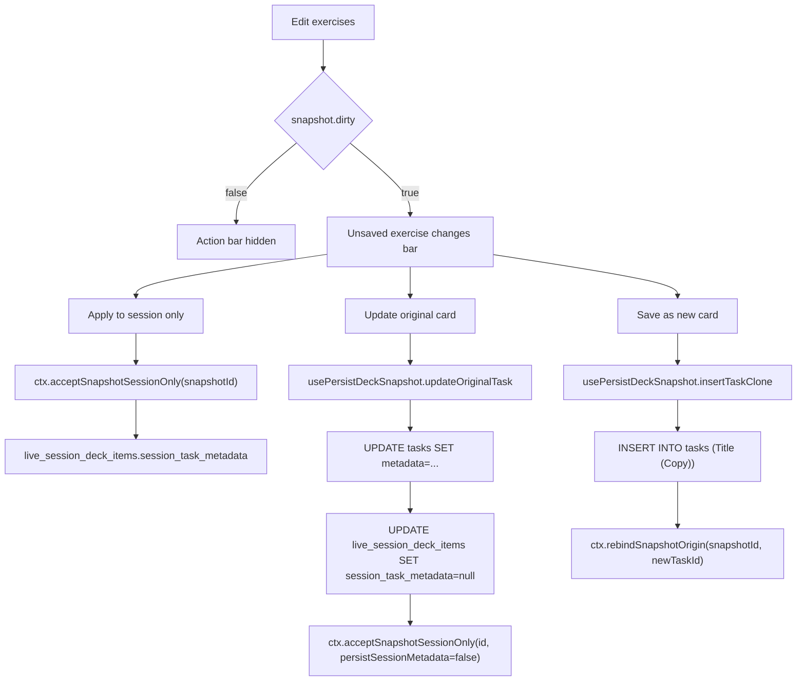

# LiveSessionWorkoutPlayer

## Component overview

| Item               | Detail                                                                                                                                                                                                                                                                                                                                                            |
| ------------------ | ----------------------------------------------------------------------------------------------------------------------------------------------------------------------------------------------------------------------------------------------------------------------------------------------------------------------------------------------------------------- |
| **Path**           | [`src/features/live-video/shells/huddle/LiveSessionWorkoutPlayer.tsx`](../../src/features/live-video/shells/huddle/LiveSessionWorkoutPlayer.tsx)                                                                                                                                                                                                                  |
| **Purpose**        | The **host-side workout editor** rendered inside the live video huddle (and a few host-only authoring shells). It surfaces the **active deck snapshot's exercises** in a `WorkoutExercisesEditor`, tracks **dirty edits in memory only**, and offers three persistence affordances: **Apply to session only**, **Update original card**, or **Save as new card**. |
| **Component type** | Inline panel (not a Radix `Dialog`); mounted inside parent shells.                                                                                                                                                                                                                                                                                                |
| **Audience**       | **Host-only** UI in live sessions. Participants see [`ParticipantWorkoutLogger`](../../src/features/live-video/shells/ParticipantWorkoutLogger.tsx) instead (the `LiveSessionView` switches based on `isHost`).                                                                                                                                                   |

This is **not** a modal in the dialog sense; it is a panel placed alongside (or instead of) the video stage. It is documented in this folder because it is part of the same **live-video session UX surface** and shares the workout-deck state model.

---

## Where it is mounted

| Caller                               | File                                                                                                       | Notes                                                                                 |
| ------------------------------------ | ---------------------------------------------------------------------------------------------------------- | ------------------------------------------------------------------------------------- |
| Connected huddle (host)              | [`LiveSessionView`](../../src/features/live-video/shells/huddle/LiveSessionView.tsx)                       | Rendered for the host; participants get `ParticipantWorkoutLogger`.                   |
| Host pre-join                        | [`PreJoinBuilder`](../../src/features/live-video/shells/huddle/PreJoinBuilder.tsx)                         | Inline editor below the deck builder.                                                 |
| Class deck authoring (no live video) | [`StandaloneClassDeckBuilder`](../../src/features/live-video/shells/huddle/StandaloneClassDeckBuilder.tsx) | Persists to `live_session_deck_items` under `bb-class-deck:<classInstanceId>`.        |
| Class editor modal                   | [`ClassEditor`](../../src/components/modals/class-modal/ClassEditor.tsx)                                   | Inside the class instance editor, scoped by `WorkoutDeckSelectionProvider` overrides. |

In every case, a `WorkoutDeckSelectionProvider` must be mounted **above** the player; otherwise the component renders **`null`** (see "Edge cases" below).

---

## Props

```ts
type LiveSessionWorkoutPlayerProps = {
  className?: string;
  workspaceId: string;
  supabase: SupabaseClient;
  canWrite: boolean;
  onPersistSuccess?: () => void;
  /**
   * Live-session / pre-join host: run after layout guards pass and before persisting exercises
   * (e.g. focusBoard() + tripwire logging from the parent).
   */
  onHostLayoutFocusBoard?: () => void;
};
```

| Prop                     | Effect                                                                                                                                                                                                                                                   |
| ------------------------ | -------------------------------------------------------------------------------------------------------------------------------------------------------------------------------------------------------------------------------------------------------- |
| `workspaceId`            | Used to fetch the host's preferred `unit_system` from `fitness_profiles` for the `WorkoutExercisesEditor`.                                                                                                                                               |
| `supabase`               | Authenticated client passed through to the persistence hook (`usePersistDeckSnapshot`).                                                                                                                                                                  |
| `canWrite`               | Mirrors the caller's task-write permission. **Disables** "Update original card" and "Save as new card" but **never** "Apply to session only" (which is in-memory + session-scoped). Also forwarded into `WorkoutExercisesEditor` to gate inline editing. |
| `onPersistSuccess`       | Fired after a successful **Update original** or **Save as new** write so callers can refetch boards / decks.                                                                                                                                             |
| `onHostLayoutFocusBoard` | Optional layout hook — runs **before** any of the three commit paths so the parent can scroll, tripwire-log, or focus the board (used by `LiveSessionView`'s `focusBoard`).                                                                              |

---

## Data sources and state model

### Active deck snapshot

The component reads from [`useWorkoutDeckSelectionOptional`](../../src/features/live-video/shells/huddle/workout-deck-selection-context.tsx). The selection context owns:

- **`deck: SessionDeckSnapshot[]`** — ordered queue of in-memory clones of board tasks.
- **`activeSnapshotId`** — currently focused snapshot.
- **`updateSnapshotTask`**, **`acceptSnapshotSessionOnly`**, **`rebindSnapshotOrigin`**, etc.

```ts
const activeSnapshot = useMemo(() => {
  if (!ctx?.deck.length) return null;
  const id = ctx.activeSnapshotId;
  if (id) {
    const found = ctx.deck.find((s) => s.snapshotId === id);
    if (found) return found;
  }
  return ctx.deck[0] ?? null;
}, [ctx?.activeSnapshotId, ctx?.deck]);
```

If `activeSnapshotId` is `null` it falls back to the first deck row, which keeps the panel useful immediately after a deck is hydrated from `live_session_deck_items` without requiring an explicit click.

### Dirty detection

`SessionDeckSnapshot.dirty` is computed in [`session-deck-snapshot.ts`](../../src/features/live-video/shells/huddle/session-deck-snapshot.ts) by comparing a **workout-only signature** (`workoutType`, `workoutDurationMin`, `workoutExercises`) against `baselineMetadata`. The dirty card-action bar (Apply / Update / Save as new) only renders when `activeSnapshot.dirty === true`.

### Unit system

A `useEffect` reads `fitness_profiles.unit_system` for `(workspaceId, profileId)` once and stores it locally; the editor receives `metric` by default and switches to `imperial` only when the row says so. Read errors are silently swallowed (default stays `metric`).

### Item type guard

The panel only edits **workout-shaped** cards: `task.item_type === 'workout'` or `'workout_log'`. Non-workout selections render an explanatory empty state instead of the editor.

---

## Edits and persistence flows

### Editing exercises

`WorkoutExercisesEditor` calls `onChange(next: WorkoutExercise[])`. The handler builds a merged metadata payload via `mergeWorkoutExercisesIntoTaskMetadata(task, next)` and pushes it back through the context:

```ts
ctx.updateSnapshotTask(activeSnapshot.snapshotId, {
  ...activeSnapshot.task,
  metadata: nextMeta,
});
```

This **does not** write to Supabase. It only updates the in-memory snapshot, which flips `dirty = true` and reveals the action bar.

### Three commit affordances



| Button                    | What happens                                                                                                                                                                                                                                                                                                                                                                                                                                                                       |
| ------------------------- | ---------------------------------------------------------------------------------------------------------------------------------------------------------------------------------------------------------------------------------------------------------------------------------------------------------------------------------------------------------------------------------------------------------------------------------------------------------------------------------- |
| **Apply to session only** | Calls `ctx.acceptSnapshotSessionOnly(snapshotId)` (default `persistSessionMetadata: true`). The selection context writes the current `task.metadata` to **`live_session_deck_items.session_task_metadata`** so the overlay survives reloads, then clears `dirty` locally. **Original `tasks` row is untouched**, so the board is unchanged.                                                                                                                                        |
| **Update original card**  | Calls `usePersistDeckSnapshot.updateOriginalTask(snap)`: **`UPDATE public.tasks SET metadata = ... WHERE id = snap.originTaskId`**. On success, also clears the deck-row overlay (`session_task_metadata = null`) so there is no stale overlay layered on top of the just-updated original. Then `acceptSnapshotSessionOnly(id, { persistSessionMetadata: false })` clears `dirty` without re-writing the overlay. Toasts: success (`"Original card updated"`) or per-write error. |
| **Save as new card**      | Calls `usePersistDeckSnapshot.insertTaskClone(snap)`: copies the active task into a new row in the same `bubble_id` with `title = "<original> (Copy)"` (truncated to 500 chars) at the next `position`. On success, calls `ctx.rebindSnapshotOrigin(snapshotId, newId)` so subsequent **Update original** writes target the new row. Toasts: success (`"Saved as new card"`) or error.                                                                                             |

`onHostLayoutFocusBoard?.()` runs at the start of every commit handler so callers can guarantee the parent layout has the board visible before async work begins.

### Permission gating

- **Apply to session only**: requires `ctx` and a dirty snapshot; **does not** require `canWrite` (session-scoped overlay is treated as ephemeral session state, not a board write).
- **Update original card** / **Save as new card**: disabled when `busy || !canWrite`.

`busy` comes from `usePersistDeckSnapshot` and is set during the awaited writes. Buttons stay disabled across all three until the write resolves.

---

## Empty / fallback states

```ts
if (!ctx) return null;
```

If the panel is rendered without a `WorkoutDeckSelectionProvider` ancestor, it bails silently — common in scaffold routes that don't wire deck state.

When `ctx` exists but the deck is empty:

> Add workouts from the board, then select a card above to edit exercises.

When the active selection is **not** a workout-shaped task:

> Selected card is not a workout — exercise editing is only available for workout cards.

These keep the panel safely mounted (no layout collapse) while signalling what the host needs to do next.

---

## Critical UI / architectural gotchas

### 1. The component is **session-scoped state**, not a board editor

It looks like a card editor, but it is **always editing a clone**. The original `tasks` row only changes if the host explicitly clicks **Update original card** (or **Save as new card** which inserts a different row). All three buttons behave differently on persistence; do not rename / reorder them without understanding the contract — particularly **Apply to session only** which writes to `live_session_deck_items.session_task_metadata` (a per-session overlay), not `tasks`.

### 2. **`canWrite` does not gate the editor input**

The `WorkoutExercisesEditor` receives `canWrite` and may itself disable inputs, but the **action bar** still shows **Apply to session only** even when `canWrite === false` because session-only acceptance is a local/overlay write that the deck context permits for any host (see `canPersist` in `WorkoutDeckSelectionProvider`). Keep this distinction explicit if you re-skin the bar.

### 3. **`activeSnapshot` fallback hides selection bugs**

When `activeSnapshotId` is `null` the panel auto-selects `deck[0]`. That makes hydration "just work" but can mask a real bug where selection state did not propagate. If the wrong card appears to load on revisit, verify `setActiveSnapshotId` was called by the deck builder before blaming this panel.

### 4. **No optimistic UI on Update / Save-as-new**

`usePersistDeckSnapshot` keeps `busy = true` until the network completes; there is no optimistic local apply for the original-card path because we want the toast (success/error) to reflect the actual DB result. If you add optimistic UI, you must reconcile against `onPersistSuccess` and the toast call sites.

### 5. **`Save as new card` requires `bubble_id` on the active task**

If the cloned snapshot has no `bubble_id`, `insertTaskClone` toasts `"Missing bubble for new card."` and aborts. This can happen for cards constructed outside the normal board (synthetic snapshots, drafts). Bind a `bubble_id` upstream rather than patching this guard away.

### 6. **Scoped contexts via override props**

`WorkoutDeckSelectionProvider` accepts `sessionIdOverride` (and optionally `disableGlobalBoardBridge`) so multiple instances can coexist without colliding (see `ClassEditor` and `StandaloneClassDeckBuilder`). The player itself is unaware of these — it just consumes the nearest provider — but if you debug "two players see the same dirty state," check that each shell wraps its own provider with the right overrides.

### 7. **Don't replace the editor with a Radix Dialog**

Several callers nest this panel inside a class-editor modal. Wrapping the player itself in another `Dialog` would double-mount focus traps and break form interactions. If you need a modal-like presentation, mount the host shell (e.g. `PreJoinBuilder`) inside a dialog, not the player directly.

---

## Related files

| Area                                                                      | File                                                                                                                                                         |
| ------------------------------------------------------------------------- | ------------------------------------------------------------------------------------------------------------------------------------------------------------ |
| Persistence hook (Update / Save-as-new)                                   | [`src/features/live-video/shells/huddle/usePersistDeckSnapshot.ts`](../../src/features/live-video/shells/huddle/usePersistDeckSnapshot.ts)                   |
| Snapshot model + dirty signature                                          | [`src/features/live-video/shells/huddle/session-deck-snapshot.ts`](../../src/features/live-video/shells/huddle/session-deck-snapshot.ts)                     |
| Deck selection / overlay persistence                                      | [`src/features/live-video/shells/huddle/workout-deck-selection-context.tsx`](../../src/features/live-video/shells/huddle/workout-deck-selection-context.tsx) |
| Editor primitive                                                          | [`src/components/fitness/workout-exercises-editor.tsx`](../../src/components/fitness/workout-exercises-editor.tsx)                                           |
| Metadata helpers (`metadataFieldsFromParsed`, `buildTaskMetadataPayload`) | [`src/lib/item-metadata.ts`](../../src/lib/item-metadata.ts)                                                                                                 |
| Participant counterpart                                                   | [`src/features/live-video/shells/ParticipantWorkoutLogger.tsx`](../../src/features/live-video/shells/ParticipantWorkoutLogger.tsx)                           |

---

## Debugging checklist

1. **Panel renders nothing:** likely no `WorkoutDeckSelectionProvider` above; mount one (or render the host shell that already does).
2. **No action bar appears after edits:** `dirty` is false because `workoutMetadataSignature` did not change — check `metadataFieldsFromParsed` slice (only `workoutType`, `workoutDurationMin`, `workoutExercises` participate in dirty detection).
3. **"Update original card" is disabled:** confirm `canWrite === true` and the snapshot is not in `busy`. RLS errors will show as toast strings and reset `busy` via the hook's `finally`.
4. **Save-as-new fails with "Missing bubble":** the active snapshot has no `bubble_id`; ensure the upstream board / draft attached one.
5. **Wrong card appears selected:** the panel falls back to `deck[0]`. Inspect `activeSnapshotId` in the deck context; the bug is usually upstream selection, not in this file.
6. **Edits in one shell appear in another:** check whether both shells share a single `WorkoutDeckSelectionProvider`. Use `sessionIdOverride` / `disableGlobalBoardBridge` to isolate.
