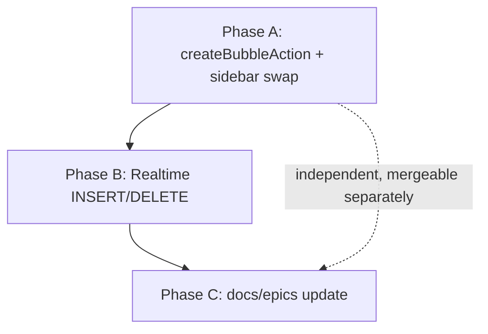

# Next.js 16 — Phase 5 completion plan (post-PR #96)

PR #96 shipped the bulk of Phase 5 (token-bound `unstable_cache` for invites + bubbles, React Compiler enabled). Three explicit out-of-scope items remained. This doc plans them in dependency order so the migration's read-your-writes story is fully consistent.

Status legend: **DO** = action required this phase, **SKIP** = deliberately not doing (decision recorded), **DONE** = already shipped.

| Item                                                        | Phase | Status                                                   |
| ----------------------------------------------------------- | ----- | -------------------------------------------------------- |
| Sidebar `addBubble` direct INSERT bypasses `revalidateTag`  | A     | **DO**                                                   |
| Realtime channel only listens for UPDATE, not INSERT/DELETE | B     | **DO**                                                   |
| `bubble_members` per-user reads stay client-side            | C     | **SKIP** (documented)                                    |
| Five `revalidatePath` migrations for invites                | —     | **DONE** (PR #96, commit `91bc1d6`)                      |
| No service role / no `cookies()` inside `unstable_cache`    | —     | **DONE** (architecture invariant, holds for both pilots) |

---

## Phase A — Migrate sidebar `addBubble` to a server action

### Why

[`src/components/dashboard/bubble-sidebar.tsx`](../../src/components/dashboard/bubble-sidebar.tsx) lines 123–149 still inserts directly via the browser Supabase client:

```ts
const { data, error } = await supabase
  .from('bubbles')
  .insert({ workspace_id: workspaceId, name: name.trim(), icon: null })
  .select('*')
  .single();
```

Side effects after the insert: optimistic state append (`onBubblesChange`), `onSelectBubble`, and the fitness-only `ensureCoachBubbleBindings` call. None of these calls `revalidateTag`, so the new bubble is **not** in the RSC cache for the workspace's next first-paint until something else writes (an `updateBubbleAction`, `addBubbleMemberAction`, etc.) and busts `workspace-${workspaceId}-bubbles`.

### Approach

Add `createBubbleAction` to [`src/app/(dashboard)/app/[workspace_id]/bubble-actions.ts`](<../../src/app/(dashboard)/app/[workspace_id]/bubble-actions.ts>) and switch the sidebar to call it. Keep optimistic UX intact; defer the `revalidateTag` to the server.

### Files

- **New action**: [`bubble-actions.ts`](<../../src/app/(dashboard)/app/[workspace_id]/bubble-actions.ts>)
  - Signature: `createBubbleAction(input: { workspaceId: string; name: string; workspaceCategory?: string | null }): Promise<ActionResult<{ bubble: BubbleRow }>>`.
  - Auth: `requireWorkspaceWriter` (extract a small helper or reuse the existing `requireWorkspaceAdmin` pattern; this action only needs `can_write_workspace` semantics — owner/admin/member/trialing — not admin).
  - Insert: same payload (`workspace_id`, `name.trim()`, `icon: null`).
  - Fitness side-effect: when `workspaceCategory === 'fitness'`, run `ensureCoachBubbleBindings(supabase, [bubble.id])`. On failure, **log only** — do not delete the bubble (matches current sidebar behavior; the sidebar logs and continues).
  - Tail: `revalidateTag(bubblesCacheTag(input.workspaceId), 'max')`.
  - Returns the inserted `BubbleRow` so the client can keep the optimistic-append pattern without an extra fetch.
- **Sidebar consumer**: [`bubble-sidebar.tsx`](../../src/components/dashboard/bubble-sidebar.tsx)
  - Replace the `supabase.from('bubbles').insert(...)` block with `await createBubbleAction({ ... })`.
  - On `{ ok: true, bubble }`: same `onBubblesChange([...bubbles, bubble])` + `onSelectBubble(bubble.id)` + `setName('')`.
  - On `{ error }`: surface in existing UI affordance (today the sidebar silently fails; this PR can keep that or add a toast — keep behavior unchanged for the smallest diff).

### Acceptance

- New bubble appears in the sidebar instantly (optimistic append, unchanged).
- After the action returns and the user reloads or another tab opens the workspace, the new bubble is in the RSC first paint (cache tag was busted server-side).
- No service role; no new env vars.
- `pnpm lint`, `pnpm lint:eslint`, `pnpm build` clean.
- Smoke test as **owner**, **member**, **trialing**: all should succeed (RLS allows; the action explicitly checks the same role set as `can_write_workspace`).
- Smoke test as **guest**: action returns the existing "only socialspace admins…" style error message (or a tailored "members and above can create bubbles" message — tighten copy in the action).

### Risks

- **`bubble-sidebar.tsx` is a Client Component.** Calling a Server Action from it is the standard Next.js 16 pattern; no boundary change required. Confirm import path uses `'use server'` action (top of `bubble-actions.ts` already declares it).
- **Coach binding is currently best-effort.** Preserve that semantics — do **not** wrap the action in a transaction that rolls back on coach-bind failure. Doing so would change product behavior.
- **RPC helper preferred only if `can_write_workspace` is still drifted in production.** PR #96 ships `seed_workspace_template` for that drift case during initial seeding, but a single per-bubble RPC isn't justified here — the sidebar create runs inside the workspace, so RLS on `bubbles_insert` is the source of truth and (now that `can_write_workspace` is correct) will accept owner/admin/member/trialing inserts without an RPC.

### Estimate

~2–3 hours including manual smoke tests.

---

## Phase B — Realtime INSERT/DELETE on `bubbles`

### Why

The Realtime channel at [`dashboard-shell.tsx`](../../src/components/dashboard/dashboard-shell.tsx) lines 1264–1286 only listens for `UPDATE`:

```ts
.channel(`bubbles_metadata:${workspaceId}`)
.on('postgres_changes',
    { event: 'UPDATE', schema: 'public', table: 'bubbles',
      filter: `workspace_id=eq.${workspaceId}` },
    (payload) => { setBubbles(prev => prev.map(...)); })
```

After Phase A, sidebar create runs through a server action and busts the cache, but **other tabs/users in the same workspace** only see the new bubble after their next mount or another event. Adding INSERT/DELETE handlers closes the gap so live deltas are consistent with rename/UPDATE behavior.

### Approach

Extend the same channel; do **not** create a new one (one channel per workspace per shell). Add idempotent INSERT/DELETE handlers that dedup against the existing local state (so the optimistic append in the same tab doesn't double-add).

### Files

- [`dashboard-shell.tsx`](../../src/components/dashboard/dashboard-shell.tsx) lines 1264–1286 only.
- **No DB changes.** [`bubbles`](../../supabase/migrations/20260522140000_bubbles_metadata_jsonb.sql) is already in `supabase_realtime` publication (see line 8).

### Sketch

```ts
.channel(`bubbles_metadata:${workspaceId}`)
.on('postgres_changes',
    { event: 'INSERT', schema: 'public', table: 'bubbles',
      filter: `workspace_id=eq.${workspaceId}` },
    (payload) => {
      const row = payload.new as BubbleRow | null;
      if (!row?.id) return;
      setBubbles((prev) => (prev.some((b) => b.id === row.id) ? prev : [...prev, row]));
    })
.on('postgres_changes',
    { event: 'UPDATE', schema: 'public', table: 'bubbles',
      filter: `workspace_id=eq.${workspaceId}` },
    /* existing handler */)
.on('postgres_changes',
    { event: 'DELETE', schema: 'public', table: 'bubbles',
      filter: `workspace_id=eq.${workspaceId}` },
    (payload) => {
      const row = payload.old as { id?: string } | null;
      if (!row?.id) return;
      setBubbles((prev) => prev.filter((b) => b.id !== row.id));
      // Re-snap selectedBubbleId if the deleted bubble was active.
    })
.subscribe();
```

### Acceptance

- Sidebar create in tab A shows up in tab B (same user, two windows) without a refresh.
- A delete from any source (server action, dashboard, future admin tool) removes the bubble from open clients.
- The local optimistic append in Phase A's sidebar create is **not** duplicated when its own INSERT event arrives (the `prev.some` guard is the deduplication key).
- If `selectedBubbleId` points at a deleted bubble, the shell falls back to `ALL_BUBBLES_BUBBLE_ID` (current behavior preserved).
- No new realtime channels; one channel per workspace remains.

### Risks

- **DELETE payloads only carry `payload.old`** when the table has REPLICA IDENTITY DEFAULT (i.e. only the primary key). `bubbles` has only `id` as PK, which is enough for our handler. Confirm by inspecting `payload.old` in dev once.
- **Filter scope.** `workspace_id=eq.${workspaceId}` correctly scopes both INSERT and DELETE; verify on a workspace boundary (deleting a bubble in workspace X must NOT affect workspace Y open in another tab).
- **Tab churn.** With three handlers on one channel, the subscribe call still happens once. No throughput change.

### Estimate

~1–1.5 hours including a multi-tab smoke test.

---

## Phase C — Document the deliberate non-actions

These are decisions, not work. We commit them as a short paragraph in [`docs/epics/next16-migration.md`](../epics/next16-migration.md) so the rationale survives.

### Item C1 — `bubble_members` per-user reads stay client-side

Two effects in [`dashboard-shell.tsx`](../../src/components/dashboard/dashboard-shell.tsx) read `bubble_members` on `selectedBubbleId` change:

- Lines 408–438: derive `myBubbleRole` (editor/viewer/null).
- Lines 448–487: derive `fitnessProfileTargetUserId` for 1-to-1 fitness coach views.

**Decision: not migrating to RSC cache.** Both are selection-dependent (re-fire on every bubble switch) and per-user, so the cache key would be `(workspaceId, userId, bubbleId)` and the tag would have to include `bubble-${bubbleId}`. The lookups are 1–N row reads with `maybeSingle()` / a small list — RLS is the source of truth and the queries are well under any meaningful latency budget. Adding a cache layer here would be net negative on complexity.

### Item C2 — Service role / `cookies()` invariant

This is not work; it's a constraint that holds for both pilots and any future cached loader:

- **No `SUPABASE_SERVICE_ROLE_KEY`** inside `unstable_cache` (would bypass RLS).
- **No `cookies()` / `headers()`** inside `unstable_cache` (Next.js 16 forbids dynamic functions in cached scopes).

The token-pass-through pattern (read `session.access_token` outside the cache, pass it in via the closure, instantiate `@supabase/supabase-js` with `Authorization: Bearer ${token}`) is the only sanctioned shape.

### Item C3 — Five invites `revalidatePath` migrations

Already shipped in PR #96 commit `91bc1d6`. No follow-up.

---

## Sequencing & branch strategy



- **Phase A and Phase B can ship in the same PR**, but both should be reviewed together because Phase B's INSERT dedup logic is justified by Phase A's optimistic append.
- **Phase C is a 1-paragraph docs commit**, can land in the same PR or be batched with other doc work.

---

## Out of scope of THIS plan (future Phase 6+)

- Migrating `bubble-sidebar.tsx` rename/delete affordances (currently no UI for delete; rename uses `updateBubbleAction` already).
- Any caching of `tasks`, `messages`, or `live_sessions` reads.
- React Compiler hot-route audits and `'use no memo'` opt-ins (the build is clean today; future warnings get triaged per-PR, not as a sprint).
- Promoting cache key versions from `'v1'` to `'v2'` — only if a loader's return shape changes.

---

## Verification matrix (applies to both Phase A and Phase B)

- `pnpm format:check`
- `pnpm lint` (tsc)
- `pnpm lint:eslint` (warnings only — 0 errors must remain 0)
- `pnpm build`
- Manual: open the workspace as **owner** in tab A and **member** in tab B; create, rename, delete a bubble in A; confirm B updates without refresh.
- Manual: hard-reload tab B; confirm the new bubble is in first paint (RSC cache tag invalidation).
