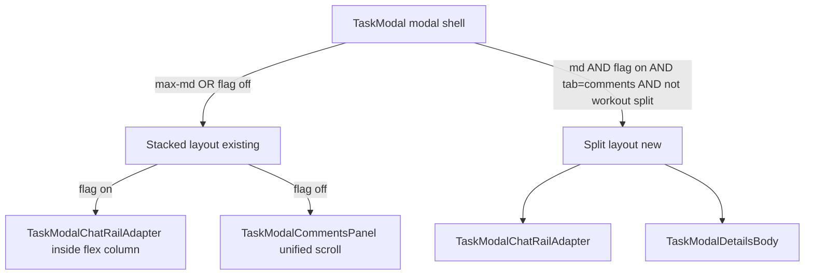

# Phase 3.5 — Layout stabilization (collapse fix + desktop split-pane)

> Inserted between Phase 3 and Phase 4. **All changes live behind the existing
> `NEXT_PUBLIC_STANDARD_TASK_CHAT_RAIL` flag** so the legacy
> `TaskModalCommentsPanel` path stays byte-identical and rollback is one env
> flip away. The rail's public prop API (Phase 0 §4) is **not** modified.

## Why this phase exists

Two production-observed regressions on the flag-on TaskModal path:

1. **Collapse bug.** When the AI is generating a workout (`aiWorkoutGenerating`)
   or any conditional row inside the comments-only outer scroll container
   appears (e.g. workout viewer button row, "Loading workout…" placeholder),
   `StandardTaskChatRail` shrinks to a few pixels above
   `<TaskModalTabBar />` (Screenshots 1 + 2). Root cause:
   - The rail uses `flex h-full min-h-0 min-w-0 flex-col`
     ([`src/components/chat/StandardTaskChatRail.tsx`](../../../src/components/chat/StandardTaskChatRail.tsx) ~347).
   - On the flag-on `viewMode === 'comments-only'` branch the rail is mounted
     **inside** the unified scroll container (`commentsUnifiedScrollRef` —
     [`TaskModal.tsx`](../../../src/components/modals/TaskModal.tsx) ~1158–1300).
     `h-full` inside a vertically-scrolling parent has no deterministic height,
     so any sibling row pushes the rail to ~0 px.
   - The unified scroll container exists for the **legacy** path (it pairs with
     `composerPortalHost`). On flag-on we already drop the portal host
     ([phase-2-task-modal-integration.md](./phase-2-task-modal-integration.md)
     §"Locked decisions" item 1) — the unified scroll wrapper is **vestigial**
     for the rail and is what's collapsing it.

2. **Comments tab loses card context (Screenshot 3).** Today
   `selectTab('comments')` flips `viewMode` to `'comments-only'`
   ([`TaskModal.tsx`](../../../src/components/modals/TaskModal.tsx) ~754),
   hiding the editor chrome and details body. Users want chat **and** card
   visible side-by-side on `md:`+ (mirroring the existing
   `showWorkoutSplitPane` 2-column layout — same file ~1109).

## Locked decisions (Phase 3.5 planning — do not revisit without amending)

1. **Feature flag.** Reuse the existing
   `NEXT_PUBLIC_STANDARD_TASK_CHAT_RAIL`. No new flag. Both fixes
   together ride that flag; flag-off path is untouched.
2. **Rail prop API stays frozen.** Phase 0 §4 is unchanged. The fix lives in
   `TaskModal.tsx` and the adapter wrapper — **not** in
   `StandardTaskChatRail.tsx`.
3. **Mobile keeps current behavior.** On `max-md:` the comments tab continues
   to render as today on flag-on (rail in a single column, no split). The
   split-pane is **`md:`+ only**.
4. **No new component for the details pane.** The right-hand side reuses the
   existing details body (hero + `TaskModalEditorChrome` +
   `TaskModalItemMetadataSections` + `TaskModalSchedulingSection` +
   subtasks/attachments/etc.) by **extracting the existing JSX block** from
   the `tab === 'details'` branch into a small local sub-component
   (`TaskModalDetailsBody`) that both branches call. No prop additions to
   downstream sub-panels; this is a **mechanical lift**, not a redesign.
5. **No `viewMode` change.** When the split is active and the user picks the
   Comments tab on `md:`+, `viewMode` stays `'full'` and a new
   `commentsSplitLayout` boolean controls the 2-column render. We do **not**
   introduce a third `viewMode`. The narrow-viewport path continues to use
   `viewMode === 'comments-only'`.
6. **Tab bar.** The `<TaskModalTabBar />` stays mounted at the **modal**
   bottom in both layouts. It is **not** duplicated per pane.
7. **Workout split takes precedence.** When `showWorkoutSplitPane` is true
   (the existing workout viewer split), the new comments split does **not**
   activate — preserves the workout-first UX. `commentsSplitLayout = …
&& !showWorkoutSplitPane`.

## Architecture



## Inputs

- Phase 3 complete (`defaultSlugForItemType` wired; manual smoke green).
- Flag-off path remains the rollback target.
- Existing `showWorkoutSplitPane` 2-column scaffolding at
  [`TaskModal.tsx`](../../../src/components/modals/TaskModal.tsx) ~1106–1154
  is the visual + flex template to mirror.

## Deliverables

### Files to create

1. [`src/components/modals/task-modal/TaskModalDetailsBody.tsx`](../../../src/components/modals/task-modal/TaskModalDetailsBody.tsx)

   Mechanical lift of the JSX inside the `tab === 'details'` branch
   ([`TaskModal.tsx`](../../../src/components/modals/TaskModal.tsx) ~1399–1551
   — `TaskModalEditorChrome` → `TaskModalItemMetadataSections` →
   `TaskModalSchedulingSection` → `TaskModalSubtasksPanel`-or-equivalent
   sections, hero block, `TaskModalDetailsFooterActions`).
   - **Props:** every value the existing JSX consumes from `TaskModal`'s scope,
     forwarded as a single `TaskModalDetailsBodyProps` interface. No new state,
     no new hooks. Type the props by reading the current JSX bindings.
   - **Behavior:** byte-identical to the inlined version. Snapshot test in
     `__tests__/TaskModalDetailsBody.snapshot.test.tsx` with a fixture-task
     to lock the lift.

   > Why a sub-component, not a function: React fragments inside a callback
   > would re-create on every parent render and break `key` semantics for
   > `TaskModalEditorChrome`'s controlled inputs. A real component preserves
   > identity.

### Files to modify

1.  [`src/components/modals/TaskModal.tsx`](../../../src/components/modals/TaskModal.tsx)

              **Collapse fix (flag-on, both `comments-only` mounts):**
              - Around line 1156, inside the existing `useCommentsUnifiedLayout` branch,
                **branch on `standardRailEnabled`** for the wrapper: - **flag on:** drop the `commentsUnifiedScrollRef` wrapper. Render the
                hero + `TaskModalEditorChrome` (if shown) **above** a sibling
                `<TaskModalChatRailAdapter>` in a parent `flex min-h-0 flex-1 flex-col`
                column. The adapter's outer wrapper stays `flex min-h-0 min-w-0 flex-1

        flex-col` (already shipped in

    [`TaskModalChatRailAdapter.tsx`](../../../src/components/modals/task-modal/TaskModalChatRailAdapter.tsx)
    ~188 — needs `flex-1`added; see file 2 below). - **flag off:** unchanged — keeps`commentsUnifiedScrollRef`,
    `unifiedScrollLayout`, `composerPortalHost`.

              - At the second mount (`viewMode === 'full' && tab === 'comments'`,
                ~1580–1596), wrap the adapter in `flex min-h-0 flex-1 flex-col` (it
                already lives in `<div className="flex min-h-0 flex-1 flex-col">` ~1580
                — verify the inner adapter receives `flex-1` so `aiWorkoutGenerating`
                siblings cannot squeeze it).

              **Split-pane (new `commentsSplitLayout`):**
              - New derivation near the existing layout flags (~1035–1052):

                ```ts
                const isMdUp = !useIsNarrowBelowMd(); // see file 3 below
                const commentsSplitLayout =
                  standardRailEnabled &&
                  Boolean(taskId) &&
                  tab === 'comments' &&
                  isMdUp &&
                  !showWorkoutSplitPane;
                ```

              - When `commentsSplitLayout` is true, **skip** the
                `viewMode === 'comments-only'` branch and instead render the split body
                inside the existing `viewMode === 'full'` shell. The split body is a new
                2-column flex inserted **in place of** the current single-column scroll
                container at ~1366–1551:

                     ```tsx
                     <div className="flex min-h-0 flex-1 md:flex-row md:items-stretch">
                       {/* Left: rail */}
                       <div className="flex min-h-0 min-w-0 flex-1 flex-col md:max-w-[min(42%,440px)] md:shrink-0 md:basis-[min(38%,400px)] md:grow-0 md:flex-none md:border-r md:border-border">
                         <TaskModalChatRailAdapter ref={commentsPanelRef} {...sameAdapterProps} />
                       </div>
                       {/* Right: details body (own scroll) */}
                       <div className="flex min-h-0 flex-1 flex-col overflow-y-auto overscroll-contain">
                         <TaskModalDetailsBody {...detailsBodyProps} />
                       </div>
                     </div>
                     ```

                     Width tuple **mirrors** the existing workout-split tuple
                     (~1152–1153 — `md:max-w-[min(38%,400px)] md:shrink-0

                md:basis-[min(32%,340px)] md:grow-0 md:flex-none`). We use 38–42% / 32–38%
                instead of 32–38% / 38–42% because the rail is the focus here, not the
                workout. **Decision-locked.**

              - `selectTab('comments')` (~749–760) is **kept** but its `viewMode →

        'comments-only'`rule must short-circuit when`isMdUp && standardRailEnabled
        && !showWorkoutSplitPane`. The simplest implementation: don't change

    `selectTab`; let `commentsSplitLayout`win in the render branching above
    so`viewMode`may say`'comments-only'` while the layout renders the
    split. **Decision-locked.**

              - `<TaskModalTabBar />` stays at the modal bottom in both layouts (already
                true today; just confirm the split body is sized so the tab bar remains
                visible — the outer modal container already enforces `md:max-h-[min(90dvh,100dvh)]`).

2.  [`src/components/modals/task-modal/TaskModalChatRailAdapter.tsx`](../../../src/components/modals/task-modal/TaskModalChatRailAdapter.tsx)

    **Single line change** to the outer wrapper (~188):

    ```diff
    - <div className="relative -mx-6 flex min-h-0 min-w-0 flex-1 flex-col">
    + <div className="relative flex min-h-0 min-w-0 flex-1 flex-col">
    ```

    The `-mx-6` was a holdover that worked accidentally inside the
    `commentsUnifiedScrollRef` (which had `px-6`). After the collapse fix the
    adapter sits in a parent that already has its own padding (or none), and
    the negative margin clipped the rail border on the split-pane left column.

    **No prop changes.** Adapter API stays as shipped in Phase 3.

3.  **Viewport detection — reuse [`useIsNarrowBelowMd`](../../../src/hooks/use-is-narrow-below-md.ts).**

    Derive in `TaskModal.tsx` directly:

    ```ts
    const isMdUp = !useIsNarrowBelowMd();
    ```

    No new hook is created. The existing hook ships an SSR-safe default
    (`useState(false)` then a `useLayoutEffect` `matchMedia` subscription on
    [`NARROW_MAX_QUERY`](../../../src/lib/viewport.ts)), so the first paint
    on the server is "not narrow" → split layout — matching desktop's most
    common case. The first client render aligns once the media query
    resolves.

    > Decision-locked: do **not** swap to a wider/different breakpoint than
    > Tailwind `md` (768px). Matches the existing `showWorkoutSplitPane`
    > breakpoint contract.

### Files to NOT touch

- [`src/components/chat/StandardTaskChatRail.tsx`](../../../src/components/chat/StandardTaskChatRail.tsx)
  — rail layout primitive (`flex h-full min-h-0 min-w-0 flex-col`) is the
  README §5 contract; the fix is in the **parent**. Phase 0 §4 prop API
  unchanged.
- [`src/components/modals/task-modal/TaskModalCommentsPanel.tsx`](../../../src/components/modals/task-modal/TaskModalCommentsPanel.tsx)
  — flag-off must stay byte-identical (Phase 4 retires it).
- [`src/hooks/useMessageThread.ts`](../../../src/hooks/useMessageThread.ts) —
  no new thread/RLS/send semantics for Phase 3.5; the rail may already depend on
  `silentRefreshMessages` (agent-reply polling from earlier work), which is out
  of scope for collapse/split-only changes.
- `agent-dispatch`, RPCs, RLS, DB.
- `WorkoutCoachRail.tsx` / `WorkoutPlayer.tsx` — Phase 5.

## Tests

1. **Adapter snapshot.** Render `<TaskModalChatRailAdapter>` inside a
   `<div className="flex h-[600px] flex-col">` test wrapper and assert the
   adapter's outer wrapper has `flex-1 min-h-0` classes (regression
   guard against the `-mx-6` reintroduction).
2. **Collapse regression test (TaskModal level).** Render `TaskModal` with
   `flag on` + `tab === 'comments'` + a stub that simulates
   `aiWorkoutGenerating === true` (mock the workout-AI hook). Assert:
   - The element matching `[data-testid="standard-task-chat-rail-composer"]`
     has a non-zero `getBoundingClientRect().height` (use
     `@testing-library/react` + `jsdom` with explicit container height).
   - The composer precedes `<TaskModalTabBar />` in document order.
3. **Split-pane render branch.** With `flag on`, `tab === 'comments'`,
   `useIsNarrowBelowMd === false`, `showWorkoutSplitPane === false`,
   `taskId` set:
   - Both `[data-testid="standard-task-chat-rail-composer"]` and the details
     body marker (e.g. `[data-testid="task-modal-details-body"]`) are
     present in the same render.
   - Switching to `useIsNarrowBelowMd === true` (resize) re-renders to the
     stacked layout: details body is **not** rendered, only the rail.
4. **Workout-split precedence.** With `showWorkoutSplitPane === true`, even
   on `md:` + flag on + comments tab, the existing workout split renders;
   the new `commentsSplitLayout` is `false`.
5. **Flag-off:** all existing `TaskModal` tests pass unchanged. `git diff`
   over existing test files = empty.
6. **Lift snapshot.** `TaskModalDetailsBody` rendered with a fixed task
   fixture matches a snapshot taken **before** the lift (capture once,
   commit, then run after the lift to prove byte-identical output).

## Operational checklist (per environment)

- [ ] CI passes with `NEXT_PUBLIC_STANDARD_TASK_CHAT_RAIL` both `0` and `1`.
- [ ] Manual smoke (flag on, desktop ≥ md):
  - [ ] Open a workout task, click **Comments** → split renders; rail (left) + workout/details (right). Both scroll independently.
  - [ ] Trigger AI workout generation from the right-pane button → rail
        height does **not** collapse.
  - [ ] Resize viewport below `md` → layout stacks; rail returns to single
        column above the tab bar.
  - [ ] Click **Workout viewer** → workout-split takes precedence; comments
        tab renders inside the narrow rail (existing behavior).
- [ ] Manual smoke (flag off): `viewMode === 'comments-only'` legacy
      experience unchanged (composer still portals above tab bar).

## Acceptance criteria

- [ ] Rail no longer collapses when `aiWorkoutGenerating === true` or any
      sibling row toggles inside the comments column (collapse-regression
      test green).
- [ ] On `md:`+ with the flag on, the Comments tab renders side-by-side
      (rail + details body); on `max-md:` the layout stacks.
- [ ] `<TaskModalTabBar />` remains at the modal bottom in both layouts.
- [ ] No edits to `StandardTaskChatRail.tsx`,
      `TaskModalCommentsPanel.tsx`, `WorkoutCoachRail.tsx`, or
      `useMessageThread`. No `agent-dispatch` / RPC / RLS / DB changes.
- [ ] `TaskModalDetailsBody` is the **only** new component; it is a pure
      lift of existing JSX with no behavior change (snapshot proves it).

## Risk + rollback

- **Rollback for collapse fix:** revert the
  `useCommentsUnifiedLayout` flag-on branch to wrap the adapter inside
  `commentsUnifiedScrollRef` again. Single-file diff in `TaskModal.tsx`.
- **Rollback for split-pane:** set `commentsSplitLayout = false`
  unconditionally and the modal returns to the existing
  `comments-only` single-column behavior on every viewport.
- **Full rollback:** `NEXT_PUBLIC_STANDARD_TASK_CHAT_RAIL=0` + redeploy
  reverts to the legacy `TaskModalCommentsPanel` (unaffected by this phase).
- **Risk of split-pane state divergence:** the split renders the same
  `TaskModalDetailsBody` JSX bound to the same `TaskModal` state — no
  duplicate state. The lift-snapshot test guards against drift.
- **Soak:** flag-on in staging ≥ 1 day with active workout generation
  before per-workspace enablement.
