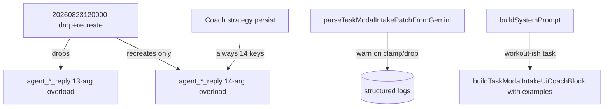

# Phase 3.6A — Backend remediation (RPC overload hygiene + Coach prompt anti-confusion + clamp telemetry)

> **Stop-Ship remediation.** Inserted between Phase 3.5 and Phase 4 to address
> the Principal Staff Engineer audit of the `task_modal_intake_patch`
> implementation. Phase 3.6A is **server-only** (Postgres migration + Edge
> Function prompts/parser logging). Phase 3.6B (next document) handles the
> React lifecycle remediations.
>
> All changes ride the existing `NEXT_PUBLIC_STANDARD_TASK_CHAT_RAIL` flag for
> client-visible behavior — none of the changes in this phase require the flag,
> because they live below the rail (DB / Edge / prompt). The legacy
> `TaskModalCommentsPanel` path is unaffected.
>
> **Surgical-edit rule.** Existing call sites of
> `agent_create_card_and_reply` and `agent_insert_coach_workout_draft_reply`
> keep running unchanged. The wire format (parameter names) is preserved. The
> only callable signature after this phase is the **14-arg** version.

## Why this phase exists

The audit (`task_modal_intake_patch` review) flagged three **server-side**
defects in the cross-stack work that landed in the previous turn:

1. **C1 — Zombie RPC overload.** Migration
   [`20260822120000_agent_task_modal_intake_patch_rpc.sql`](../../../supabase/migrations/20260822120000_agent_task_modal_intake_patch_rpc.sql)
   used `create or replace function …` with a **new typed parameter**
   (`p_task_modal_intake_patch jsonb default null`). In Postgres, function
   identity is the typed parameter list — adding a parameter creates a
   **new overload**, it does **not** replace the old one. After the migration,
   production has both the legacy 13-arg version (with the OLD body that
   doesn't merge the intake patch and still grants `service_role`) and the
   new 14-arg version. Any caller that misses the new parameter silently
   lands on the old overload and drops the patch on the floor with no error.
   The repository's own prior pattern
   ([`20260813120000_user_exercise_notes_and_personal_cues_rpc.sql:248-291`](../../../supabase/migrations/20260813120000_user_exercise_notes_and_personal_cues_rpc.sql))
   handled this correctly with a dynamic drop block. The new migration did
   not carry that block forward.

2. **M1 — Silent clamp masks the original "95 vs 9" bug.** `parseReadinessSleep`
   ([`src/lib/agents/coach/task-modal-intake-patch.ts:56-70`](../../../src/lib/agents/coach/task-modal-intake-patch.ts))
   clamps out-of-range values (`readiness: 95` → `10`) without logging.
   `parseDuration`, `parseStringArray`, and `normalizeSoreness` silently drop
   invalid enum members. We have no telemetry for the exact contract drift the
   prompt is meant to prevent.

3. **M2 — Prompt strength is asserted, not proven.** The block emitted by
   `buildTaskModalIntakeUiCoachBlock`
   ([`src/lib/agents/coach/prompts.ts:50-75`](../../../src/lib/agents/coach/prompts.ts))
   states the 1–10 vs 0–100 distinction in prose. It does not include a
   worked positive/negative example pair, and it is gated on
   `taskItemType in ('workout','workout_log')` — meaning legacy/mistyped rows
   that still render the wizard never see the block.

## Locked decisions (Phase 3.6A planning — do not revisit without amending)

1. **One forward-only migration.** A single new migration file
   `supabase/migrations/20260823120000_agent_rpcs_drop_legacy_overloads.sql`
   drops every existing overload of `agent_create_card_and_reply` and
   `agent_insert_coach_workout_draft_reply`, then re-creates **only** the
   14-arg version (identical body to the one shipped in `20260822120000`).
   We do **not** edit `20260822120000` in place — that file is already in
   the migration history of any environment that has run it. We add a new
   timestamped file that supersedes it. Decision-locked.

2. **Drop block lives at the top of the new migration.** The drop runs
   inside a `do $$ … $$;` block using
   `pg_get_function_identity_arguments`, mirroring
   [`20260813120000_user_exercise_notes_and_personal_cues_rpc.sql:248-291`](../../../supabase/migrations/20260813120000_user_exercise_notes_and_personal_cues_rpc.sql).
   No hand-coded signature lists — the drop block enumerates **every**
   overload that exists at migration time. Decision-locked.

3. **Re-grant `service_role` only on the 14-arg version.** All `revoke …
from public/anon/authenticated` and `grant execute … to service_role`
   statements target the new (and now only) signature. No grants on the old
   signature survive. Decision-locked.

4. **Wire format unchanged.** The 14-arg RPC is byte-compatible with the
   `AgentCreateCardArgs` / `AgentInsertCoachDraftArgs` shapes already
   shipped in
   [`supabase/functions/_shared/dispatch/rpc.ts`](../../../supabase/functions/_shared/dispatch/rpc.ts).
   No Edge Function or
   [`src/types/database.generated.ts`](../../../src/types/database.generated.ts)
   changes are required for C1. Decision-locked.

5. **Clamp logging is `warn`, not `error`.** The Edge Function emits a
   `log('warn', 'coach intake patch field clamped|dropped', …)` per
   contract violation, with `request_id`, `slug`, the field name, and the
   original raw value (truncated to 64 chars). Warnings do **not** trigger
   the safe-reply fallback — the patch still applies for the fields that
   _did_ validate, and the reply still inserts. Decision-locked.

6. **Prompt block ships even on missing/legacy `item_type`.** We change the
   gate from "`item_type` is `workout` or `workout_log`" to "the dispatcher
   resolved a task whose metadata or item_type indicates a workout intake
   wizard would render." Concretely: when `loadCurrentTaskContext` returns
   non-null **and** (`item_type` ∈ {`workout`, `workout_log`} **or** the
   resolved task metadata has any of `workout_type | duration_min |
exercises | ai_workout_factory`), append the intake block. Decision-locked.

7. **Prompt block gains a worked example.** A single positive-vs-negative
   block, lifted verbatim from this spec, is appended to
   `buildTaskModalIntakeUiCoachBlock()`. Mirror file (`supabase/functions/agents/coach/prompts.ts`)
   updated; `pnpm check:agent-mirror` must pass. Decision-locked.

## Architecture



## Inputs

- Phase 3.5 complete and shipped.
- Migration `20260822120000_agent_task_modal_intake_patch_rpc.sql` already
  applied to production (it has, or it has not — both branches handled by the
  drop block).
- `pnpm check:agent-mirror` and `pnpm run test:deno-integration` are green
  on `main` before starting.

## Deliverables

### Files to create

1. [`supabase/migrations/20260823120000_agent_rpcs_drop_legacy_overloads.sql`](../../../supabase/migrations/20260823120000_agent_rpcs_drop_legacy_overloads.sql)

   Forward-only migration that:
   - Drops **every** existing overload of `agent_create_card_and_reply`.
   - Drops **every** existing overload of
     `agent_insert_coach_workout_draft_reply`.
   - Re-creates the 14-arg version of each function with the **exact body**
     shipped in `20260822120000` (including the
     `task_modal_intake_patch` merge).
   - Re-issues `revoke … from public/anon/authenticated` + `grant execute
… to service_role` only on the new signatures.
   - Re-issues the `comment on function …` strings.

   **Required drop block (verbatim, both functions):**

   ```sql
   -- ---------------------------------------------------------------------------
   -- Drop overloads: agent_create_card_and_reply,
   -- agent_insert_coach_workout_draft_reply
   --
   -- Mirrors the dynamic drop pattern at
   -- supabase/migrations/20260813120000_user_exercise_notes_and_personal_cues_rpc.sql:248-291
   -- so we forward-collapse every parameter-list overload Postgres has,
   -- including the zombie 13-arg version left behind when 20260822120000
   -- created a parallel 14-arg overload via `create or replace function …`.
   -- ---------------------------------------------------------------------------

   do $drop_create$
   declare
     stmt text;
   begin
     for stmt in
       select format(
         'drop function if exists %I.%I(%s)',
         n.nspname,
         p.proname,
         pg_catalog.pg_get_function_identity_arguments(p.oid)
       )
       from pg_catalog.pg_proc p
       join pg_catalog.pg_namespace n on n.oid = p.pronamespace
       where n.nspname = 'public'
         and p.proname = 'agent_create_card_and_reply'
     loop
       execute stmt;
     end loop;
   end;
   $drop_create$;

   do $drop_draft$
   declare
     stmt text;
   begin
     for stmt in
       select format(
         'drop function if exists %I.%I(%s)',
         n.nspname,
         p.proname,
         pg_catalog.pg_get_function_identity_arguments(p.oid)
       )
       from pg_catalog.pg_proc p
       join pg_catalog.pg_namespace n on n.oid = p.pronamespace
       where n.nspname = 'public'
         and p.proname = 'agent_insert_coach_workout_draft_reply'
     loop
       execute stmt;
     end loop;
   end;
   $drop_draft$;
   ```

   The body of each `create or replace function …` after the drop block is
   a **byte-for-byte copy** of the body that landed in
   [`20260822120000_agent_task_modal_intake_patch_rpc.sql`](../../../supabase/migrations/20260822120000_agent_task_modal_intake_patch_rpc.sql).
   No body changes in 3.6A — we are forward-collapsing the overload set,
   not changing the contract. The `comment on function …` text and the
   `revoke … / grant execute …` block at the bottom of each function also
   carry forward verbatim.

   > **Why a new file instead of editing `20260822120000`.** Migration
   > history is append-only: any environment that has already run the
   > original 14-arg migration must be brought into the new state by a
   > forward migration. Editing the historical file would leave drift
   > between environments that ran "before-edit" vs "after-edit." The
   > drop block runs idempotently in either case.

### Files to modify

1. [`src/lib/agents/coach/task-modal-intake-patch.ts`](../../../src/lib/agents/coach/task-modal-intake-patch.ts)
   **(canonical)** + [`supabase/functions/agents/coach/task-modal-intake-patch.ts`](../../../supabase/functions/agents/coach/task-modal-intake-patch.ts) **(mirror)**

   **Goal:** annotate every parser drop/clamp event with a structured
   `dropped` record so the calling site can emit a single batched `log('warn',
…)` per turn.
   - Refactor the parser to return `{ patch, dropped }` from a new
     internal helper `parseAndCollectTaskModalIntakePatch(raw)`. The
     existing `parseTaskModalIntakePatchFromGemini(raw): TaskModalIntakePatch
| null` and `parseTaskModalIntakePatchFromMetadata(raw):
TaskModalIntakePatch | null` keep their **return type and signature
     unchanged** — they call the new helper and discard `dropped`. This
     keeps every existing import (Vitest tests, client adapter, hook)
     binary-compatible.
   - `dropped` shape (decision-locked):

     ```ts
     export type TaskModalIntakePatchDrop =
       | { field: 'readiness' | 'sleep_quality'; reason: 'clamped' | 'invalid_type'; raw: unknown }
       | { field: 'wizard_step'; reason: 'out_of_range' | 'invalid_type'; raw: unknown }
       | { field: 'duration_minutes'; reason: 'invalid_enum' | 'invalid_type'; raw: unknown }
       | { field: 'target_intensity'; reason: 'invalid_enum' | 'invalid_type'; raw: unknown }
       | {
           field: 'soreness' | 'equipment';
           reason: 'invalid_enum_items';
           raw: unknown;
           droppedItems: unknown[];
         }
       | { field: 'unknown_key'; reason: 'unknown_key'; raw: unknown; key: string };
     ```

   - Helper signature:

     ```ts
     export function parseAndCollectTaskModalIntakePatch(raw: unknown): {
       patch: TaskModalIntakePatch | null;
       dropped: TaskModalIntakePatchDrop[];
     };
     ```

   - The clamp branch in `parseReadinessSleep` records
     `{ field, reason: 'clamped', raw }` when the input number/parsed
     string is out of `[1, 10]`. The branch is **inside** the helper, not in
     `parseTaskModalIntakePatchFromGemini`, so both the Vitest unit tests
     and the Edge runtime see the same drops. The clamped value still wins.

   - **Mirror parity.** The Deno copy under
     `supabase/functions/agents/coach/task-modal-intake-patch.ts` mirrors
     this verbatim. `pnpm check:agent-mirror` must pass.

2. [`src/lib/agents/coach/parse.ts`](../../../src/lib/agents/coach/parse.ts)
   **(canonical)** + [`supabase/functions/agents/coach/parse.ts`](../../../supabase/functions/agents/coach/parse.ts) **(mirror)**
   - Replace the call site
     ```ts
     const task_modal_intake_patch = parseTaskModalIntakePatchFromGemini(
       (parsed as Record<string, unknown>).task_modal_intake_patch,
     );
     ```
     with the helper call:
     ```ts
     const intakeResult = parseAndCollectTaskModalIntakePatch(
       (parsed as Record<string, unknown>).task_modal_intake_patch,
     );
     const task_modal_intake_patch = intakeResult.patch;
     const task_modal_intake_dropped = intakeResult.dropped;
     ```
   - Add `task_modal_intake_dropped: TaskModalIntakePatchDrop[]` to
     `CoachGeminiJsonResponse` (always present; empty array when the model
     emitted a clean patch or no patch at all). Both create-card and
     no-card branches return it.
   - Mirror parity unchanged for everything else.

3. [`supabase/functions/agents/coach/strategy.ts`](../../../supabase/functions/agents/coach/strategy.ts)
   - In `parse(json, ctx)`, immediately after `parseCoachJson`:
     ```ts
     if (out.task_modal_intake_dropped.length > 0) {
       log('warn', 'coach task_modal_intake_patch field drops', {
         request_id: ctx.requestId,
         slug: COACH_SLUG,
         message_id: ctx.message.id,
         drop_count: out.task_modal_intake_dropped.length,
         drops: out.task_modal_intake_dropped.map((d) => ({
           field: d.field,
           reason: d.reason,
         })),
       });
     }
     ```
     The full `raw` value is **not** logged — we keep PII surface low and
     log volume bounded. The reason+field tuple is enough to correlate the
     prompt-violation rate against deploys.
   - No persist-path changes (the parser already drops invalid keys, so
     the patch reaching the RPC is clean).

4. [`src/lib/agents/coach/prompts.ts`](../../../src/lib/agents/coach/prompts.ts)
   **(canonical)** + [`supabase/functions/agents/coach/prompts.ts`](../../../supabase/functions/agents/coach/prompts.ts) **(mirror)**

   Append a worked-example block to `buildTaskModalIntakeUiCoachBlock()`
   (decision-locked text):

   ```
   EXAMPLES (follow these literally):

   - User says "I slept great and feel really energetic, like 9 out of 10."
     CORRECT JSON fragment:
       "task_modal_intake_patch": { "readiness": 9, "sleep_quality": 9 },
       "session_readiness_score": 90
     INCORRECT (do NOT do this):
       "task_modal_intake_patch": { "readiness": 90, "sleep_quality": 90 }
       (90 is out of the 1–10 slider range; that value belongs only in session_readiness_score.)

   - User says "set my readiness to 7."
     CORRECT JSON fragment:
       "task_modal_intake_patch": { "readiness": 7 }
     INCORRECT:
       "task_modal_intake_patch": { "readiness": "high" }
       (free-text strings are dropped; readiness is an integer 1–10.)

   - User says "I'm sore in legs and shoulders."
     CORRECT:
       "task_modal_intake_patch": { "soreness": ["Legs", "Shoulders"] }
     INCORRECT:
       "task_modal_intake_patch": { "soreness": ["legs", "Shoulders", "None"] }
       (lowercase "legs" is dropped; "None" cannot be combined with other areas.)

   SELF-CHECK before emitting JSON: if a number you placed in
   `task_modal_intake_patch.readiness` or `.sleep_quality` is greater than 10,
   you violated the contract — divide by 10 and round to the nearest integer in
   [1, 10], or omit the key entirely.
   ```

   The prompt assembly in `strategy.ts` (`buildSystemPrompt`) is also
   updated per Locked Decision #6:

   ```ts
   const it = (taskItemType ?? '').toLowerCase();
   const taskMetaHasWorkoutShape =
     taskMetadataForContext != null &&
     typeof taskMetadataForContext === 'object' &&
     !Array.isArray(taskMetadataForContext) &&
     ['workout_type', 'duration_min', 'exercises', 'ai_workout_factory'].some(
       (k) => k in (taskMetadataForContext as Record<string, unknown>),
     );
   if (it === 'workout' || it === 'workout_log' || taskMetaHasWorkoutShape) {
     parts.push(buildTaskModalIntakeUiCoachBlock());
   }
   ```

   Mirror file updated identically; `pnpm check:agent-mirror` must pass.

### Files to NOT touch

- [`supabase/migrations/20260822120000_agent_task_modal_intake_patch_rpc.sql`](../../../supabase/migrations/20260822120000_agent_task_modal_intake_patch_rpc.sql)
  — append-only migration history. The new file at `20260823120000` is
  the forward fix.
- [`supabase/functions/_shared/dispatch/rpc.ts`](../../../supabase/functions/_shared/dispatch/rpc.ts),
  [`supabase/functions/_shared/dispatch/fallback.ts`](../../../supabase/functions/_shared/dispatch/fallback.ts) —
  the 14-arg shape they already send is exactly what the post-3.6A RPC
  expects. No `AgentCreateCardArgs` / `AgentInsertCoachDraftArgs` changes.
- [`src/types/database.generated.ts`](../../../src/types/database.generated.ts)
  — generated by `supabase gen types`. After 3.6A merges, regenerate
  separately and verify the diff is "remove the legacy overload, keep the
  14-arg one." Out of scope for this phase's manual edits.
- Any client-side wizard / adapter files (those are Phase 3.6B).
- `agent-dispatch/handler.ts`, `WorkoutCoachRail.tsx`, `WorkoutPlayer.tsx`,
  RLS policies.

## Tests

1. **Migration smoke (manual + scripted).**
   - Run `supabase db reset` against the local stack so migrations replay
     from scratch. Confirm `pg_proc` shows **exactly one** overload of
     each function:
     ```sql
     select proname, pg_get_function_identity_arguments(oid)
       from pg_proc
       where proname in (
         'agent_create_card_and_reply',
         'agent_insert_coach_workout_draft_reply'
       );
     ```
     Expected: two rows, each with the 14-arg signature.
   - Apply the **prior** migration set up to and including
     `20260822120000`, then apply only `20260823120000`. Re-run the
     `pg_proc` query and confirm the same single-overload result.
2. **Deno integration tests** (`pnpm run test:deno-integration`) all pass.
   The 14-arg call from `coach/strategy.ts` round-trips through the new
   sole overload. The fallback path (`p_task_modal_intake_patch: null`)
   round-trips identically.
3. **Vitest parser tests.** Add `src/lib/agents/coach/__tests__/task-modal-intake-patch.parse.test.ts`:
   - `readiness: 95` → patch has `readiness: 10`, `dropped` has one entry
     `{ field: 'readiness', reason: 'clamped', raw: 95 }`.
   - `readiness: "nine"` → no `readiness` key, drop entry with
     `reason: 'invalid_type'`.
   - `duration_minutes: 75` → no `duration_minutes` key, drop entry with
     `reason: 'invalid_enum'`.
   - `soreness: ["legs", "Shoulders", "None"]` → patch
     `{ soreness: ["Shoulders"] }` (per existing normalize rule), drop
     entry with `reason: 'invalid_enum_items'`, `droppedItems: ["legs", "None"]`.
   - **Property test:** 1000 random JSON-shaped inputs (numbers, strings,
     arrays, nested objects, BigInt-ish, `__proto__`, NaN) → parser never
     throws, `patch` either matches `TaskModalIntakePatch` or is `null`,
     `dropped` is always an array.
4. **Mirror parity.** `pnpm check:agent-mirror` is green.
5. **Vitest prompt tests.** New
   `src/lib/agents/coach/__tests__/prompts.intake-block.test.ts`:
   - `buildTaskModalIntakeUiCoachBlock()` contains both the literal
     strings `"readiness": 9` and `"session_readiness_score": 90`.
   - The string `90` only appears next to `session_readiness_score` (no
     unguarded `readiness: 90` substring).
6. **Coach unit/integration test fixture for prompt gating.** Update or add
   a fixture-driven test that exercises `buildSystemPrompt` with each of:
   - `item_type === 'workout'` → block present.
   - `item_type === 'workout_log'` → block present.
   - `item_type === 'experience'`, metadata has `workout_type` →
     block present (Locked Decision #6).
   - `item_type === 'task'`, metadata `{}` → block absent.
7. **Log capture in Deno integration test.** Add a case feeding a
   shape-valid Coach reply with `task_modal_intake_patch: { readiness: 95 }`,
   assert the `coach task_modal_intake_patch field drops` log fires and the
   reply still inserts.

## Operational checklist (per environment)

- [ ] CI passes with `NEXT_PUBLIC_STANDARD_TASK_CHAT_RAIL` both `0` and `1`
      (this phase does not toggle behavior under either flag, but we keep
      the matrix green).
- [ ] `pnpm check:agent-mirror` clean.
- [ ] `pnpm run test:deno-integration` clean.
- [ ] `supabase db reset` locally; migrate from scratch; `pg_proc` shows
      exactly one overload per function.
- [ ] Apply only `20260823120000` against a database that already had
      `20260822120000`; same single-overload result.
- [ ] `supabase db push` to staging; smoke a Coach turn that emits
      `task_modal_intake_patch` and confirm: - The reply row's `metadata.task_modal_intake_patch` is present and
      well-formed. - The `coach task_modal_intake_patch field drops` log line is
      absent for valid input, present for a synthetic out-of-range
      readiness.
- [ ] Soak in staging ≥ 1 day before production migration.

## Acceptance criteria

- [ ] **C1 closed.** `select count(*) from pg_proc where proname in
('agent_create_card_and_reply','agent_insert_coach_workout_draft_reply');`
      returns `2`. Both rows have the 14-arg signature. Both rows have a
      `comment on function` mentioning `task_modal_intake_patch`.
- [ ] **M1 closed.** Synthetic `readiness: 95` input emits exactly one
      `coach task_modal_intake_patch field drops` warn log per turn, with
      `field: 'readiness'`, `reason: 'clamped'`. The reply still inserts;
      the patch still applies; the slider lands on `10`. The Vitest
      parser test for that case is green.
- [ ] **M2 closed.** Coach prompt now includes the worked-example block
      whenever the dispatcher resolved a task whose `item_type` is
      `workout`/`workout_log` **or** whose metadata carries any of
      `workout_type | duration_min | exercises | ai_workout_factory`.
      Prompt unit test asserts the block contains the literal `9` next to
      `readiness` and the literal `90` next to `session_readiness_score`,
      and that no unguarded `readiness: 90` substring exists.
- [ ] No edits to `20260822120000_agent_task_modal_intake_patch_rpc.sql`.
- [ ] No edits to `agent-dispatch/handler.ts`, RLS, or any
      non-Coach agent strategy.
- [ ] `database.generated.ts` regeneration is deferred to a separate
      housekeeping commit.

## Risk + rollback

- **Migration rollback.** The new migration is forward-only. To revert,
  apply a follow-up migration that re-creates the historical 13-arg
  overload from `20260821120000_agent_reply_thread_subject_user_id.sql`
  (its body is preserved in the migration history). In practice we do
  not expect to roll back C1 — the legacy overload's body has no
  `task_modal_intake_patch` merge and is exactly the bug we are closing.
- **Edge Function rollback.** The parse + log changes are isolated to
  `parse.ts` / `strategy.ts` / `prompts.ts` (canonical + mirror). Reverting
  is a single PR revert; no DB change required.
- **Prompt rollback.** If the worked example causes a regression in
  Coach quality (unlikely — examples are additive), set the gate
  predicate back to `it === 'workout' || it === 'workout_log'` and
  remove the EXAMPLES section from `buildTaskModalIntakeUiCoachBlock()`.
  Mirror parity remains intact.
- **Soak window.** ≥ 1 day in staging with a Coach turn that exercises
  `task_modal_intake_patch` (manual, plus the integration test feed).
  Production migration should run during a low-traffic window because
  `drop function … cascade`-style locks on `pg_proc` momentarily block
  concurrent dispatcher RPCs (sub-second).

## Out of scope (covered by Phase 3.6B)

- C2 — silent data wipe on first task save (`useWorkoutIntakeWizardState`
  reset semantics).
- C3 — adapter remount replaying stale Coach intake patches.
- C4 — two-writer race between manual slider drag and incoming Coach
  patch.
- M5 — collapsing the three near-identical `TaskModalChatRailAdapter`
  mounts in `TaskModal.tsx`.

These are React-lifecycle defects and are addressed entirely in
`phase-3.6B-frontend-remediation.md`.
