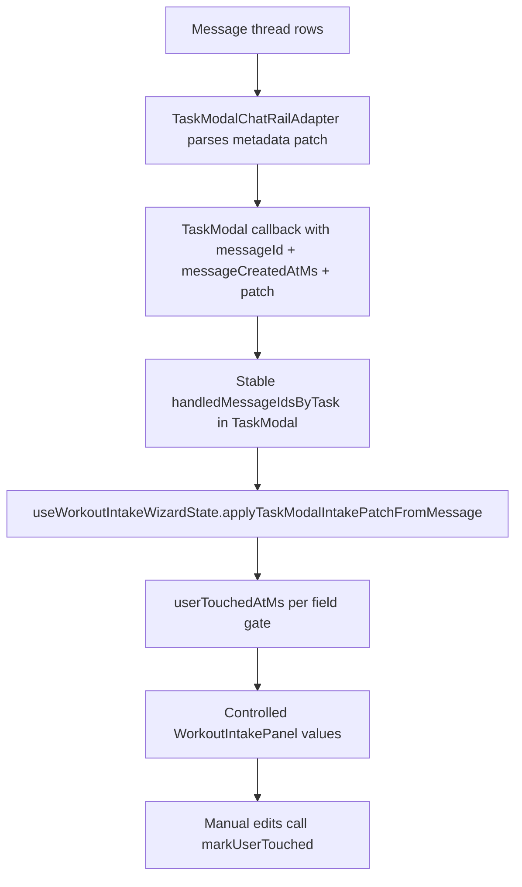

# Phase 3.6B — Frontend remediation (wizard state ownership + replay safety + two-writer policy)

> **Stop-Ship remediation.** This phase closes the React-side findings from the
> architectural/security audit of `task_modal_intake_patch`:
> **C2, C3, C4, M5**.
>
> Phase 3.6A handles backend/prompt remediations. Phase 3.6B is strictly UI
> state/lifecycle architecture and does not modify DB schemas or RPC signatures.

## Why this phase exists

The audit identified four frontend defects that can overwrite user intent or
replay stale agent state:

1. **C2 — Silent data wipe.**
   `useWorkoutIntakeWizardState(taskId ?? 'new')` resets on `resetKey` change,
   which wipes intake values when create-mode transitions `null -> new taskId`
   after first save.
2. **C3 — Stale patch replay on remount.**
   `TaskModalChatRailAdapter` tracks handled message IDs in component refs; a
   remount clears those refs and replays old Coach messages onto current wizard
   state.
3. **C4 — Two-writer race.**
   Manual user edits and incoming Coach patch writes have no timestamp policy;
   whichever write lands last wins, including stale replay.
4. **M5 — Duplicated adapter mount wiring.**
   Three near-identical `TaskModalChatRailAdapter` mounts in `TaskModal.tsx`
   increase drift risk and compound replay bugs.

## Locked decisions (Phase 3.6B planning)

1. **Single source of truth remains in `TaskModal` via `useWorkoutIntakeWizardState`.**
   We do not reintroduce local state to `WorkoutIntakePanel`.

2. **Message de-dup moves up to `TaskModal` (stable across adapter remounts).**
   `TaskModalChatRailAdapter` becomes a transport/parser layer only; it does not
   own long-lived "handled patch IDs."

3. **`TaskModalChatRailAdapter` keys are stabilized to task identity only.**
   We stop keying by `initialCommentThreadMessageId`, which currently forces
   remount/replay churn.

4. **Two-writer policy is timestamp-based and field-level.**
   User manual writes win over stale agent writes using `userTouchedAtMs` per
   field. Agent writes only apply when patch timestamp is newer than the
   corresponding user timestamp.

5. **No schema/RPC changes in 3.6B.**
   This phase consumes existing message metadata shape and existing callbacks.

## Exact C4 policy — `userTouchedAt` in `useWorkoutIntakeWizardState`

This structure is mandatory for implementation:

```ts
type IntakeWritableField =
  | 'readiness'
  | 'sleep_quality'
  | 'wizard_step'
  | 'duration_minutes'
  | 'target_intensity'
  | 'soreness'
  | 'equipment';

type FieldWriteMeta = {
  userTouchedAtMs: number; // last local/manual user edit time for this field
  agentAppliedAtMs: number; // timestamp of last applied agent patch for this field
};

type WizardWritePolicyState = Record<IntakeWritableField, FieldWriteMeta>;
```

### Hook API additions (design contract)

`useWorkoutIntakeWizardState` gains:

1. `markUserTouched(field | field[])`
   - Called by all manual setters/toggles before state mutation.
   - Sets `userTouchedAtMs = Date.now()` for each touched field.

2. `applyTaskModalIntakePatchFromMessage(args)`

   ```ts
   type ApplyPatchArgs = {
     patch: TaskModalIntakePatch;
     messageId: string;
     messageCreatedAtMs: number; // derived from message row created_at
   };
   ```

   - For each field present in `patch`:
     - `if (messageCreatedAtMs < writePolicy[field].userTouchedAtMs)`: skip field.
     - else apply field value and set `agentAppliedAtMs = messageCreatedAtMs`.

3. Optional telemetry surface:
   - `onPatchFieldSkipped?: (field, reason: 'stale_vs_user', messageId) => void`
   - `onPatchFieldApplied?: (field, messageId) => void`

### Manual write mapping (must be explicit)

- Slider `readiness` drag -> marks `readiness`.
- Slider `sleepQuality` drag -> marks `sleep_quality`.
- Step navigation -> marks `wizard_step`.
- Duration button -> marks `duration_minutes`.
- Intensity button -> marks `target_intensity`.
- `toggleSoreness` -> marks `soreness`.
- `toggleEquipment` -> marks `equipment`.

### Policy semantics

- **User-over-stale-agent guarantee:** if a user touched a field after a message
  was authored, that older message cannot overwrite the field.
- **Fresh-agent override allowed:** if a new Coach message is authored after the
  user edit, it may overwrite (intentional "latest authoritative write").
- **Per-field granularity:** a stale message can be blocked for one field and
  still apply newer/untouched fields.

## Architecture



## Deliverables

### Files to modify

1. [`src/components/modals/task-modal/hooks/useWorkoutIntakeWizardState.ts`](../../../src/components/modals/task-modal/hooks/useWorkoutIntakeWizardState.ts)

   **C2 + C4 closure**
   - Add `WizardWritePolicyState` ref/state and `markUserTouched`.
   - Add `applyTaskModalIntakePatchFromMessage({ patch, messageId, messageCreatedAtMs })`.
   - Keep existing `applyTaskModalIntakePatch(raw)` as compatibility shim only
     for non-message callers (if any), but route internally to the new method
     with `messageCreatedAtMs = Date.now()`.
   - Ensure all manual setters/toggles call `markUserTouched(...)`.
   - Reset behavior:
     - Replace broad `resetKey` reset semantics with **session-safe reset**:
       - reset when switching between existing task IDs (`A -> B`)
       - reset when modal starts a new create-session
       - **do not reset** on create-mode `null -> newTaskId` post-create transition.

2. [`src/components/modals/TaskModal.tsx`](../../../src/components/modals/TaskModal.tsx)

   **C2 + C3 + M5 closure**
   - Introduce stable create-session key:
     - e.g. `createSessionIdRef` seeded when modal opens in create-mode.
     - pass this stable key to `useWorkoutIntakeWizardState` so first-save
       `null -> uuid` does not trigger reset.
   - Move intake patch de-dup ownership to `TaskModal`:
     - `handledIntakePatchMessageIdsByTaskRef: Map<taskId, Set<messageId>>`.
     - callback rejects already-handled IDs before calling hook.
   - Build a single shared adapter props object and a small local mount helper
     (`renderChatRail()` or `TaskModalChatRailMount`) used in all three branches.
   - Remove `initialCommentThreadMessageId` from adapter React `key`; key only
     by stable `taskId` identity.

3. [`src/components/modals/task-modal/TaskModalChatRailAdapter.tsx`](../../../src/components/modals/task-modal/TaskModalChatRailAdapter.tsx)

   **C3 transport hardening**
   - Extend intake callback payload from raw patch to:
     ```ts
     onApplyTaskModalIntakePatch?: (args: {
       taskId: string;
       messageId: string;
       messageCreatedAtMs: number;
       patch: TaskModalIntakePatch;
     }) => void;
     ```
   - Adapter still parses metadata, but no longer owns authoritative de-dup
     state for intake patches.
   - Keep effect-level guardrails (`isLoading`, `coachAuthUserId`) intact.

4. [`src/components/modals/task-modal/TaskModalDetailsBody.tsx`](../../../src/components/modals/task-modal/TaskModalDetailsBody.tsx) and [`src/components/fitness/WorkoutIntakePanel.tsx`](../../../src/components/fitness/WorkoutIntakePanel.tsx)
   - Keep controlled panel contract.
   - No behavioral changes beyond any type updates required by hook API updates.

5. Tests:
   - [`src/components/modals/task-modal/__tests__/TaskModalChatRailAdapter.test.tsx`](../../../src/components/modals/task-modal/__tests__/TaskModalChatRailAdapter.test.tsx)
   - [`src/components/modals/task-modal/__tests__/TaskModalDetailsBody.snapshot.test.tsx`](../../../src/components/modals/task-modal/__tests__/TaskModalDetailsBody.snapshot.test.tsx)
   - Add new focused tests under `src/components/modals/task-modal/hooks/__tests__/` for
     the `userTouchedAt` policy.

### Files to NOT touch

- `supabase/migrations/*`
- `supabase/functions/_shared/dispatch/rpc.ts`
- `supabase/functions/agents/coach/strategy.ts`
- `src/lib/agents/coach/prompts.ts`
- RLS policies or DB types generation

## Test plan

1. **C2 regression test — no wipe on first save**
   - Start create-mode wizard.
   - Set non-default readiness/sleep/duration.
   - Simulate create success `taskId: null -> uuid`.
   - Assert wizard values are preserved.

2. **C3 regression test — remount does not replay stale patch**
   - Apply one Coach patch message (`msg-1`) to set readiness=7.
   - User manually sets readiness=9.
   - Force adapter remount (layout branch/key churn).
   - Assert readiness remains 9; `msg-1` not re-applied.

3. **C4 policy tests (field-level)**
   - User touches readiness at `T2`.
   - Agent patch readiness from message `T1 < T2` -> skipped.
   - Agent patch readiness from message `T3 > T2` -> applied.
   - Agent patch with multiple fields where some are stale and some fresh ->
     partial apply is correct.

4. **M5 structural test**
   - Ensure exactly one shared adapter mount helper is used (snapshot/assertion
     against duplicate wiring blocks is acceptable).

5. Existing test suite
   - `pnpm check:agent-mirror` (should remain green; frontend-only phase)
   - targeted `vitest` for task modal files

## Acceptance criteria

- [ ] **C2 closed:** create-mode values are not wiped on first save (`null -> uuid`).
- [ ] **C3 closed:** remounting adapter does not replay old intake patches.
- [ ] **C4 closed:** `userTouchedAt` field-level policy enforced exactly as
      specified; stale messages cannot overwrite newer manual edits.
- [ ] **M5 closed:** single shared chat-rail mount wiring in `TaskModal.tsx`.
- [ ] No backend schema/migration/RPC contract changes in this phase.

## Risk + rollback

- Risk: timestamp source mismatches (`created_at` parse issues). Mitigation:
  strict `Number.isFinite(Date.parse(created_at))` with safe fallback and tests.
- Risk: over-blocking agent patches if policy is too strict. Mitigation:
  field-level (not whole-patch) gating and telemetry counters.
- Rollback: revert 3.6B commit; backend 3.6A remains valid independently.

## Out of scope (already addressed in 3.6A)

- C1 zombie RPC overload collapse
- M1 clamp/drop telemetry in parser
- M2 prompt positive/negative examples for 1-10 vs 0-100 clarity
